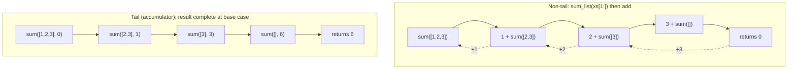
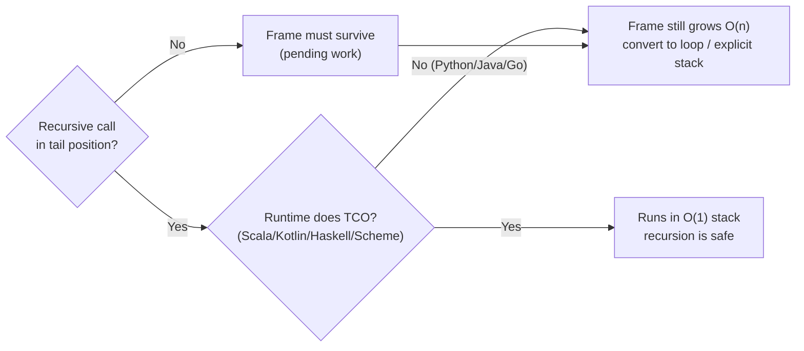

# Recursion & Tail Calls — Middle Level

> **Roadmap:** [Functional Programming](../README.md) → Recursion & Tail Calls
>
> *Knowing how recursion works is the junior bar. Using it well is the middle bar: shaping a recursion so its call stack stays flat (the accumulator), recognizing when a tail call could be optimized away, knowing when to convert it to a loop, and — crucially — knowing that the three languages on your desk (Python, Java, Go) will **not** do that optimization for you.*

---

## Table of Contents

1. [Introduction](#introduction)
2. [Prerequisites](#prerequisites)
3. [The Accumulator Pattern](#the-accumulator-pattern)
4. [Tail Recursion: What It Actually Is](#tail-recursion-what-it-actually-is)
5. [Recursion ↔ Iteration: A Mechanical Conversion](#recursion--iteration-a-mechanical-conversion)
6. [Which Languages Optimize Tail Calls — and Which Don't](#which-languages-optimize-tail-calls--and-which-dont)
7. [Memoizing Recursive Calls](#memoizing-recursive-calls)
8. [Mutual Recursion](#mutual-recursion)
9. [When Recursion Is Clearer (and When a Loop Wins)](#when-recursion-is-clearer-and-when-a-loop-wins)
10. [Common Mistakes](#common-mistakes)
11. [Test Yourself](#test-yourself)
12. [Cheat Sheet](#cheat-sheet)
13. [Summary](#summary)
14. [Further Reading](#further-reading)
15. [Related Topics](#related-topics)

---

## Introduction

> Focus: **using recursion well**, and surviving the languages that punish it.

At the junior level you learned what recursion *is*: a function that calls itself, a base case that stops it, and a call stack that grows one frame per call. That mental model is correct, but it leaves you exposed to two practical problems that bite in real code.

The first is **stack growth**. A naive recursion over a list of one million elements allocates one million stack frames before it does any real work on the way back down. In most mainstream languages that is a crash, not a slowdown.

The second is a **dangerous half-truth**: "recursion is the functional way to loop, and the compiler turns it into a loop for free." That is true in Scheme, Haskell, and Scala (with `@tailrec`). It is **false** in Python, Java, and Go — the three languages this file uses. A recursion that an FP textbook calls "safe" will blow the stack in CPython.

The middle-level skill is therefore twofold: **shape recursions so the recursive call is the last thing the function does** (tail recursion, usually via an accumulator), *and* know exactly when that shaping buys you nothing because your runtime doesn't optimize it — at which point you reach for an explicit loop or an explicit stack.

---

## Prerequisites

- **Required:** You can read and write a basic recursion with a clear base case — comfortable with [`junior.md`](junior.md).
- **Required:** You understand the call stack: each call pushes a frame holding locals and a return address; returning pops it.
- **Helpful:** Familiarity with the core transforms in [Map / Filter / Reduce](../04-map-filter-reduce/middle.md) — `reduce`/`fold` *is* the iterative form of an accumulator recursion.
- **Helpful:** Comfort with [Pure Functions](../02-pure-functions-and-referential-transparency/middle.md), since a pure recursive function is the easiest kind to memoize.
- **Helpful:** Basic Big-O reasoning, so "this allocates O(n) stack frames" reads as a cost, not a curiosity.

---

## The Accumulator Pattern

Take the textbook recursive sum:

```python
def sum_list(xs):
    if not xs:
        return 0
    return xs[0] + sum_list(xs[1:])    # <-- the '+' happens AFTER the recursive call returns
```

The shape here matters more than it looks. The function cannot finish `xs[0] + ...` until the recursive call returns a value. So every frame must **stay alive on the stack**, waiting to do its addition on the way back. For `n` elements, that is `n` live frames at the deepest point. This is **non-tail** recursion: there is *pending work* after the recursive call.

The **accumulator pattern** rewrites this so the running result is carried *down* into the recursion as an extra argument, instead of being assembled *up* on the return path:

```python
def sum_list(xs, acc=0):
    if not xs:
        return acc                     # answer is already complete here
    return sum_list(xs[1:], acc + xs[0])   # nothing left to do after this call
```

Now each call hands the *finished-so-far* total to the next call. When the base case is reached, `acc` already holds the answer — there is no pending `+` waiting on the stack. The recursive call is the **last action** of the function. That is the precondition for tail-call optimization (next section).

The pattern generalizes. Anything you would write as a `reduce`/`fold` has an accumulator-recursion form:

| Task | Accumulator | Combine step |
|---|---|---|
| Sum | `0` | `acc + x` |
| Product | `1` | `acc * x` |
| Reverse a list | `[]` | `[x] + acc` |
| Length | `0` | `acc + 1` |
| Max | `-∞` | `max(acc, x)` |

The accumulator is exactly the "state" you would carry in a loop variable. That equivalence is the bridge to iteration — and it is why `reduce` exists: it *is* the accumulator pattern with the recursion factored out (see [Map / Filter / Reduce](../04-map-filter-reduce/middle.md)).



In the left column every box must wait for the box below it (the dotted lines are pending additions — live frames). In the right column nothing waits: each call replaces the previous one's work entirely.

---

## Tail Recursion: What It Actually Is

A recursive call is in **tail position** if it is the **last action the function performs** — its result is returned directly, with no further computation wrapped around it.

```python
return f(x)            # tail call: nothing happens to the result
return f(x) + 1        # NOT tail: there is a '+ 1' pending
return g(f(x))         # NOT tail for f (g still has to run); IS tail for g
return f(x) if c else h(x)   # tail for whichever branch is taken
x = f(x); return x     # tail (the assignment is just naming the return value)
```

The "last action" test is mechanical: after the recursive call returns, does the function have *anything left to do* — an arithmetic op, a wrapping call, an `append`, a `finally`/cleanup block? If yes, it is not a tail call, and the frame must survive.

**Why tail position is special.** When a call is the last action, the current frame has no remaining use — its locals will never be read again. A compiler that knows this can **reuse the current frame** instead of pushing a new one. The recursion runs in *constant* stack space, exactly like a loop. This is **tail-call optimization (TCO)**, sometimes called tail-call *elimination*.

Two cautions before you rely on this:

1. **Tail position is necessary but not sufficient.** A call can be in tail position and *still* blow the stack — if the language doesn't implement TCO. The shape enables the optimization; the runtime has to actually perform it.
2. **A `try`/`finally`, a `with` block, or a `defer` around the call destroys tail position.** There is pending cleanup work after the call returns, so the frame must stay. This is a common reason "obviously tail-recursive" code isn't.

```go
// Go: NOT a tail call — the deferred close runs after recurse() returns
func walk(d string) error {
    f, _ := os.Open(d)
    defer f.Close()        // pending work after the recursive call below
    return walk(subdir)    // looks like a tail call, but defer keeps the frame alive
}
```

---

## Recursion ↔ Iteration: A Mechanical Conversion

Once a recursion is in accumulator (tail) form, converting it to a loop is mechanical — and on Python/Java/Go you usually *should*, because they won't do it for you.

**The rule:** the accumulator's parameters become loop variables; the recursive call becomes "update the variables and continue."

```python
# Tail-recursive
def sum_list(xs, acc=0):
    if not xs:
        return acc
    return sum_list(xs[1:], acc + xs[0])

# Same algorithm, as a loop — O(1) stack, no overflow risk
def sum_list(xs):
    acc = 0
    for x in xs:
        acc += x
    return acc
```

```java
// Java: factorial as a loop (the tail-recursive version would still grow the stack)
static long factorial(int n) {
    long acc = 1;
    for (int i = 2; i <= n; i++) acc *= i;   // loop var i + acc = the recursion's two args
    return acc;
}
```

Going the **other way** — iteration to recursion — is just as mechanical, and it is how you handle the genuinely-recursive shapes (trees, parsers) where a loop is awkward. When the structure has *more than one* recursive sub-part (a binary tree node has two children), a single accumulator/loop is not enough; you need an **explicit stack** to simulate what the call stack did for you:

```python
# Tree sum WITHOUT recursion, using an explicit stack — survives any depth
def tree_sum(root):
    total, stack = 0, [root]
    while stack:
        node = stack.pop()
        if node is None:
            continue
        total += node.value
        stack.append(node.left)
        stack.append(node.right)
    return total
```

This is the escape hatch when a tree is deep enough to overflow the native call stack: move the stack from the runtime (fixed, smallish) onto the heap (large, resizable). It is uglier than the recursive version — which is *exactly* the trade-off table in the [When Recursion Is Clearer](#when-recursion-is-clearer-and-when-a-loop-wins) section.

---

## Which Languages Optimize Tail Calls — and Which Don't

This is the single most important practical fact in this file, because the FP literature assumes TCO and most of your day-job languages don't have it.

| Language | TCO? | What that means for you |
|---|---|---|
| **Scheme** | **Yes, guaranteed by the standard** | Recursion *is* the looping construct; deep tail recursion is safe and idiomatic. |
| **Haskell** | **Effectively yes** | Lazy + tail calls run in constant stack; deep recursion is normal. |
| **Scala** | **Yes, opt-in** | Mark a method `@tailrec`; the compiler rewrites it to a loop **or fails to compile** if it isn't actually tail-recursive — a guarantee, not a hope. |
| **Kotlin** | **Yes, opt-in** | The `tailrec` modifier does the same rewrite-or-error. |
| **JavaScript** | Spec says yes, engines mostly **no** | ES2015 mandates proper tail calls, but V8/Node and most browsers never shipped it. Treat as "no." |
| **Python** | **No — by design** | Guido has repeatedly refused TCO (it would obscure stack traces). Default recursion limit ~1000. |
| **Java** | **No** | The JVM keeps full frames for stack traces and security; no automatic TCO. `StackOverflowError` awaits. |
| **Go** | **No** | The Go compiler does not eliminate tail calls. Goroutine stacks *grow* (start ~8 KB, expand to a hard cap, default ~1 GB), so Go tolerates deeper recursion than Python before crashing — but it is still O(n) memory and still crashes eventually. |

The takeaways for **Python, Java, and Go**:

- Writing your recursion in tail/accumulator form buys you **nothing at runtime** on these three — the frame is *not* reused. It is still a fine shape for clarity, but it does **not** make deep recursion safe.
- If recursion depth can scale with input size (a list of N items, a path of N steps), **use a loop or an explicit stack**, not recursion. Bounded depth (a balanced tree of depth ~log N, a JSON document a few levels deep, a parser for a small grammar) is fine.

```python
import sys
print(sys.getrecursionlimit())     # ~1000 on CPython
# sum_list(list(range(20000)))     # RecursionError, even in tail form — Python has no TCO
```

```scala
import scala.annotation.tailrec
@tailrec                                   // contract with the compiler
def sumList(xs: List[Int], acc: Int = 0): Int = xs match {
  case Nil     => acc
  case h :: t  => sumList(t, acc + h)      // rewritten to a loop; constant stack
}
// If you accidentally wrote `acc + sumList(t)` (non-tail), this would FAIL to compile.
```

> **The trap:** copying a "safe, tail-recursive" algorithm from a Haskell or Scheme tutorial straight into Python or Java. The source language made it safe via TCO that your target language does not have. Always convert depth-scaling recursion to iteration in the no-TCO three.



---

## Memoizing Recursive Calls

Some recursions are slow not because of stack depth but because they **recompute the same subproblem** many times. The canonical example is naive Fibonacci:

```python
def fib(n):
    if n < 2:
        return n
    return fib(n - 1) + fib(n - 2)     # fib(n-2) is recomputed all over the tree
```

`fib(n)` calls `fib(n-1)` and `fib(n-2)`, which both call `fib(n-3)`, and so on — the call tree is exponential (`O(2^n)`). **Memoization** caches each result the first time it is computed, so every distinct `fib(k)` runs once. The recursion shape is unchanged; only repeated work disappears.

```python
from functools import lru_cache

@lru_cache(maxsize=None)               # cache keyed by the arguments
def fib(n):
    if n < 2:
        return n
    return fib(n - 1) + fib(n - 2)     # now O(n): each k computed once, then cached
```

Memoization is only sound when the function is **pure** — same input always yields the same output, no side effects (see [Pure Functions](../02-pure-functions-and-referential-transparency/middle.md)). Caching an impure function (one that reads a clock, a DB, or mutable global state) caches a lie.

Two more notes:

- Memoization fixes **redundant work**, not **stack depth**. A memoized `fib` in Python is `O(n)` time but still recurses `n` deep — push `n` past ~1000 and it overflows regardless of the cache. The depth fix is still iteration.
- This is the doorway to **dynamic programming**: a memoized top-down recursion and a bottom-up loop filling a table are two faces of the same idea. Bottom-up DP is the iterative form and sidesteps the stack entirely.

---

## Mutual Recursion

Recursion need not be a function calling *itself* — two (or more) functions can call *each other*. The classic clean example is parity:

```go
func isEven(n int) bool {
    if n == 0 {
        return true
    }
    return isOdd(n - 1)      // tail call to the OTHER function
}
func isOdd(n int) bool {
    if n == 0 {
        return false
    }
    return isEven(n - 1)
}
```

Mutual recursion shines where the *problem* naturally has interlocking cases — most notably **recursive-descent parsers**, where `parseExpression` calls `parseTerm` calls `parseFactor`, which may call back into `parseExpression` for a parenthesized sub-expression. The mutual structure mirrors the grammar's structure, which is why parsers read so cleanly when written this way.

The same caveats apply, only more so: these calls are mutually tail-recursive, but **Python/Java/Go still won't optimize them**. The `isEven`/`isOdd` pair above is `O(n)` deep and will overflow for large `n` on all three. For a deeply-nested input (say, a thousand nested parentheses), a recursive-descent parser can blow the stack — real-world parsers either cap nesting depth deliberately or convert the hot recursion to an explicit stack.

---

## When Recursion Is Clearer (and When a Loop Wins)

Recursion is not always the more "advanced" choice — it is a tool whose value depends on the *shape of the data*. The honest rule: **let the structure decide.**

**Reach for recursion when the data is itself recursive or branches:**

- **Trees** — file systems, DOM/HTML, JSON, ASTs, B-trees. A node contains nodes; the code mirrors that. `process(node)` calling `process(child)` is the most direct possible expression.
- **Divide-and-conquer** — mergesort, quicksort, binary search, FFT. "Split in half, solve each half, combine" *is* a recursive sentence; the recursion depth is `O(log n)`, so stack growth is a non-issue even without TCO.
- **Parsing / grammars** — recursive-descent parsers (above): the code's call graph mirrors the grammar's production rules.
- **Backtracking** — permutations, N-queens, maze solving: "try a choice, recurse, undo on failure." The implicit call stack *is* the undo trail (see [Recursion & Backtracking in DSA](../../../../Algorithms/README.md), if available — otherwise this is covered under the DSA roadmap).

**Reach for a loop when the data is linear and depth scales with size:**

- Summing/scanning a list or array, walking a linked list, processing a stream of N records. Depth would be `O(n)`, and on Python/Java/Go that is a crash waiting for a big enough N. A `for`/`while` is both safer and usually clearer here.
- Anything you would naturally describe as "for each X, update a running total/state" — that *is* the accumulator pattern, and a loop expresses it without ceremony.

| Data shape | Typical depth | Prefer | Why |
|---|---|---|---|
| Linear list / array / stream | `O(n)` | **Loop** | Depth scales with input → overflow risk on no-TCO langs |
| Balanced tree | `O(log n)` | **Recursion** | Shallow; mirrors structure; safe |
| Unbalanced/deep tree | up to `O(n)` | **Explicit stack** | Could overflow; move stack to heap |
| Divide-and-conquer | `O(log n)` | **Recursion** | Shallow; the algorithm *is* recursive |
| Grammar / parsing | depth of nesting | **Mutual recursion** (cap depth) | Mirrors grammar; guard against pathological nesting |
| Permutations / search | depth of solution | **Recursion (backtracking)** | Call stack = the undo trail |

> **Decision rule:** *recursion for branching/recursive structure (and shallow `O(log n)` depth); loops for linear, depth-scales-with-N work — and an explicit heap stack when you genuinely need recursion's shape but the depth could overflow.*

---

## Common Mistakes

1. **Assuming your language has TCO.** Writing a tail-recursive list fold in Python "because it's the functional way" and shipping it — then watching it `RecursionError` on a 10k-element input in production. Python, Java, and Go do **not** optimize tail calls. Tail shape ≠ safe depth on these three.
2. **Confusing tail shape with the optimization.** "I returned the recursive call directly, so it's optimized." No — you made it *eligible*. Eligibility means nothing unless the runtime acts on it (Scala/Kotlin/Haskell/Scheme do; your three don't).
3. **`return f(x) + 1` and calling it tail-recursive.** The `+ 1` is pending work; the frame must survive. Move the work into an accumulator argument if you want true tail position.
4. **A `try`/`finally`, `with`, or `defer` around the recursive call.** The cleanup runs *after* the call returns, so it is not a tail call — even a TCO compiler won't (and mustn't) optimize it.
5. **Naive Fibonacci-style recomputation.** Exponential blowup from re-solving the same subproblem. Memoize pure recursive functions (`functools.lru_cache`) — but remember memoization fixes *time*, not *stack depth*.
6. **Memoizing an impure function.** Caching the result of something that reads the clock, a file, or mutable state caches a stale or wrong answer. Only pure functions are safe to memoize.
7. **Forgetting the base case progresses toward termination.** A "base case" that the arguments never actually reach (e.g., recursing on `n` but never decrementing it) is infinite recursion — instant overflow. Each call must move strictly closer to a base case.
8. **Using recursion for a linear scan over user-controlled input.** If N comes from outside (file lines, API records), an `O(n)`-deep recursion is a denial-of-service waiting to happen on no-TCO runtimes. Loop it.

---

## Test Yourself

1. Rewrite this as a tail-recursive (accumulator) function, then say whether that rewrite makes it safe to call on a 100,000-element list **in Python**: `def length(xs): return 0 if not xs else 1 + length(xs[1:])`.
2. Which of these are in tail position? (a) `return f(n-1)` (b) `return n * f(n-1)` (c) `return f(n-1) if n else 0` (d) `with lock: return f(n-1)`
3. You have a correct, elegant tail-recursive function in Scala marked `@tailrec`. You port it line-for-line to Java. What changes about its runtime safety, and why?
4. Naive `fib(40)` takes seconds; memoized `fib(40)` is instant. Does memoization also let you safely call `fib(50000)` in Python? Explain.
5. You must sum the values in a binary tree that may be 200,000 nodes deep (a degenerate, list-like tree). Recursion is the natural fit — why is it nonetheless the wrong choice in Go, and what do you do instead?
6. Give one data shape where a loop is clearly better than recursion, and one where recursion is clearly better. Justify each in one sentence.

<details>
<summary>Answers</summary>

1. `def length(xs, acc=0): return acc if not xs else length(xs[1:], acc + 1)`. It is **not** safe on 100k elements in Python: CPython has no TCO, so it still recurses 100k deep and raises `RecursionError` (limit ~1000). The accumulator improves clarity, not stack depth. Use a loop.
2. (a) **tail** — call's result returned directly. (b) **not tail** — pending `n *` after the call. (c) **tail** for the `f(n-1)` branch (the `if`/`else` just selects which branch returns). (d) **not tail** — the `with` (context manager) has exit/cleanup work that runs after `f(n-1)` returns, so the frame must survive.
3. In Scala, `@tailrec` makes the compiler rewrite it to a loop running in constant stack — guaranteed (it wouldn't compile otherwise). In Java there is **no TCO**: the same algorithm now pushes one frame per call and will throw `StackOverflowError` once depth exceeds the (configurable but bounded) JVM stack. The shape is identical; only the runtime's treatment differs.
4. **No.** Memoization eliminates *redundant computation* (turning exponential time into linear), but `fib(50000)` still recurses ~50,000 deep on first computation, far past Python's ~1000 limit → `RecursionError`. To compute `fib(50000)` you need a bottom-up loop (iterative DP) that uses no recursion.
5. Go does not optimize tail calls, and a 200k-deep recursion grows the goroutine stack toward its cap — it is `O(n)` memory and risks a fatal stack-overflow crash. Replace the recursion with an **explicit heap-allocated stack** (push children, pop and accumulate in a `for` loop), moving the depth off the limited native stack onto the resizable heap.
6. **Loop better:** summing a flat array/stream of N items — depth would scale with N and overflow on no-TCO runtimes, and a `for` loop expresses "running total" directly. **Recursion better:** traversing a balanced tree or doing mergesort — the data/algorithm is intrinsically branching/recursive and depth is only `O(log n)`, so the code mirrors the structure with no overflow risk.

</details>

---

## Cheat Sheet

| Concept | What it means | Practical move |
|---|---|---|
| **Accumulator** | Carry the running result *down* as an argument | Turns return-path work into a parameter; precondition for tail position |
| **Tail call** | Recursive call is the **last action**, returned directly | Test: is there *any* work after the call returns? If yes → not tail |
| **TCO** | Compiler reuses the frame → O(1) stack | Only happens if the **runtime** does it (see table below) |
| **Memoization** | Cache results of a **pure** function | Fixes redundant *time*, not stack *depth*; `@lru_cache` |
| **Mutual recursion** | Functions call each other | Great for parsers/grammars; same no-TCO caveat |
| **Explicit stack** | Move the call stack onto the heap | The escape hatch for deep trees on no-TCO langs |

**Does my language optimize tail calls?**

| Has TCO | No TCO |
|---|---|
| Scheme (guaranteed), Haskell, Scala (`@tailrec`), Kotlin (`tailrec`) | **Python, Java, Go**, JavaScript (in practice) |

**The two rules that matter most:**
- *Tail/accumulator shape ≠ safe depth — only TCO makes deep recursion safe, and Python/Java/Go don't have it.*
- *Recursion for branching/`O(log n)`-deep structure (trees, divide-and-conquer, parsing); loops for linear depth-scales-with-N work; explicit stack when you need recursion's shape but depth could overflow.*

---

## Summary

- The **accumulator pattern** carries the running result down into the recursion as an argument, leaving the recursive call as the function's last action — this is what puts a call in **tail position**.
- A call is in **tail position** when nothing happens to its result before returning. Pending arithmetic, a wrapping call, or a `finally`/`with`/`defer` cleanup all destroy tail position.
- **TCO** lets a runtime reuse the frame so tail recursion runs in constant stack — but it is a *runtime* feature. Scheme, Haskell, Scala (`@tailrec`), and Kotlin (`tailrec`) have it; **Python, Java, and Go do not**, so on them tail shape buys clarity, not safety.
- **Convert depth-scaling recursion to iteration** on the no-TCO three: accumulator args become loop variables; for branching structures that genuinely need recursion's shape but could overflow, use an **explicit heap stack**.
- **Memoize** pure recursive functions to kill redundant recomputation — but memoization fixes *time*, never *stack depth*.
- **Mutual recursion** elegantly models grammars and parsers, with the same no-TCO caveat.
- **Let the data's shape decide:** recursion for trees, divide-and-conquer, parsing, and backtracking (shallow or branching); loops for linear, depth-scales-with-N work.
- Next: [`senior.md`](senior.md) — continuation-passing style, trampolining to fake TCO on hostile runtimes, and the connection between recursion schemes and folds.

---

## Further Reading

- **Structure and Interpretation of Computer Programs** — Abelson & Sussman — §1.2 distinguishes *linear recursive* from *linear iterative* (tail) processes; the source of the accumulator framing.
- **The Python FAQ / Guido van Rossum, "Tail Recursion Elimination" (2009)** — the rationale for why CPython deliberately omits TCO (debuggability, stack traces).
- **Scala documentation — `@tailrec`** — how an opt-in compiler contract turns "I hope this is tail-recursive" into "the compiler proves it or rejects it."
- **Effective Java** — Joshua Bloch — on the JVM's preference for loops and the cost of unbounded recursion.
- **Programming in Haskell** — Graham Hutton — recursion and accumulators in a language where it is the *only* loop.

---

## Related Topics

- [Map / Filter / Reduce](../04-map-filter-reduce/middle.md) — `reduce`/`fold` is the accumulator pattern with the recursion factored out.
- [Pure Functions & Referential Transparency](../02-pure-functions-and-referential-transparency/middle.md) — why only pure recursive functions are safe to memoize.
- [Composition](../05-composition/middle.md) — building pipelines from small functions, the iterative cousin of nested recursive calls.
- [Laziness & Streams](../12-laziness-and-streams/middle.md) — how lazy evaluation lets some recursions run in constant space without TCO.
- [Recursion & Tail Calls — junior.md](junior.md) — the mechanics this file builds on.
