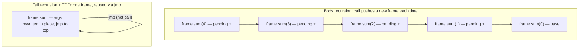

# Recursion & Tail Calls — Professional Level

> **Roadmap:** [Functional Programming](../README.md) → Recursion & Tail Calls
>
> *Essence: a function call is a stack frame; a tail call is the one call that doesn't have to be — and whether your runtime turns it into a jump or a stack-overflow decides if "the FP loop" is O(1) space or a production incident.*

---

## Table of Contents

1. [Introduction](#introduction)
2. [Prerequisites](#prerequisites)
3. [Stack Frame Mechanics](#stack-frame-mechanics)
4. [How TCO Reuses Frames (the assembly view)](#how-tco-reuses-frames-the-assembly-view)
5. [Why the JVM and CPython Lack TCO; How Go's Stacks Differ](#why-the-jvm-and-cpython-lack-tco-how-gos-stacks-differ)
6. [Trampolines & CPS — Trading Stack for Heap](#trampolines--cps--trading-stack-for-heap)
7. [Measurement](#measurement)
8. [Common Mistakes](#common-mistakes)
9. [Test Yourself](#test-yourself)
10. [Cheat Sheet](#cheat-sheet)
11. [Summary](#summary)
12. [Further Reading](#further-reading)
13. [Related Topics](#related-topics)

---

## Introduction

> Focus: **what recursion costs the machine** — stack frames, the return-address chain, cache behavior, heap-allocated continuations — and **why three runtimes you ship on (JVM, CPython, Go) each refuse general tail-call optimization for different, defensible reasons.**

`junior.md` taught you recursion as the FP loop and the base-case/recursive-case shape. `middle.md` taught the accumulator pattern and why `foldLeft` doesn't blow the stack. `senior.md` taught you to choose recursion vs iteration deliberately and to recognize tail position. This file goes one layer down — to the **call stack, the instruction stream, and the runtime that owns them.**

The professional insight is that "recursion is elegant" and "recursion is safe in production" are independent claims. Elegance is a source-level property. Safety is a property of *your specific runtime's frame management*: the same `O(n)`-depth recursion is free on a tail-call-optimizing Scheme, a `StackOverflowError` on the JVM, a `RecursionError` at depth ~1000 on CPython, and a multi-megabyte-but-survivable deep stack on Go. The function didn't change. The frame allocator did.

Two disciplines define this level:

1. **Know whose stack you're standing on.** Tail-call elimination is a *runtime guarantee*, not a syntactic one. Writing a call in tail position buys you nothing unless the language *specifies* TCO (Scheme, most ML/Haskell compilers, Scala via `@tailrec`, Lua, WebAssembly's `return_call`). On the JVM, CPython, and Go, tail position is just a normal call — the depth still costs frames.
2. **Never argue stack safety from intuition.** Every claim below pairs with the instrument that proves it on *your* code: Go's `testing.B` plus `runtime/debug.SetMaxStack` and stack-growth traces, JMH plus a measured `StackOverflowError` depth, CPython's `sys.setrecursionlimit` plus `timeit`. Illustrative numbers are labeled; your job is to reproduce them.

> **The mental model:** a recursive call is a *promise to come back* — it pushes a frame holding the return address and the live locals so control can resume after the callee returns. A **tail call** is a call after which the caller does *nothing* — so there is nothing to come back to, and the frame is dead weight. TCO is the optimization that recognizes this and reuses the frame instead of stacking a new one. Whether your runtime performs it is the whole game.

---

## Prerequisites

- **Required:** Fluent with [`senior.md`](senior.md) — you can rewrite a body-recursive function into accumulator (tail) form and explain tail position.
- **Required:** A working mental model of the call stack: stack frames, the stack pointer, return addresses, caller- vs callee-saved registers. See [Stack vs Heap](../../../language-internals/memory-management/02-stack-vs-heap/README.md).
- **Required:** You can read a microbenchmark comparison (`benchstat`, JMH, `timeit`) and tell signal from noise.
- **Helpful:** Basic assembly literacy — the difference between a `call` and a `jmp` instruction.
- **Helpful:** big-o-analysis and profiling-techniques skills for the space/time vocabulary used throughout.

---

## Stack Frame Mechanics

To reason about tail calls you must first know precisely what a non-tail call costs. When function `A` calls `B`, the runtime builds a **stack frame** (activation record) for `B`. On a typical native ABI (System V x86-64, AArch64 AAPCS) that frame holds:

| Slot | Purpose |
|---|---|
| **Return address** | Where `B` jumps back to when it executes `ret` — the instruction in `A` right after the `call`. |
| **Saved frame/base pointer** | The caller's frame pointer, so the chain can be unwound (and debuggers can walk it). |
| **Saved (callee-saved) registers** | Registers `B` will clobber but `A` expects preserved — pushed on entry, popped on exit. |
| **Local variables / spilled temporaries** | Anything that doesn't fit in registers, or whose address is taken. |
| **Outgoing argument area** | Arguments to functions `B` itself calls (when they don't fit in argument registers). |

The frame is pushed by the `call`/prologue and popped by the epilogue/`ret`. The cost of *one* call is small — a few cycles for `call`, a register save/restore dance, a `ret`. The cost that matters for recursion is **depth × frame size**: a recursion `n` deep holds `n` live frames simultaneously, because each one is *waiting* to do work after its callee returns.

```
Body-recursive sum(4) — frames pile up because each caller still has to add:

  sum(4): return 4 + sum(3)   ← frame 4 waits to do "4 + _"
    sum(3): return 3 + sum(2) ← frame 3 waits to do "3 + _"
      sum(2): return 2 + sum(1)
        sum(1): return 1 + sum(0)
          sum(0): return 0     ← deepest; now the additions unwind
```

The pending `+` in each frame is precisely what keeps the frame alive: the result of the inner call must come *back* to complete the addition. This is **body (non-tail) recursion**, and its space cost is **O(n) stack**. That O(n) is the failure mode — it is not abstract "memory," it is a hard, fixed-size region (default ~1 MB on a Linux pthread, ~512 KB–8 MB depending on platform/runtime) that, when exhausted, does not gracefully degrade. It crashes.

There is also a cache and prefetch story. Frames are contiguous and the stack region is hot, so shallow recursion is cache-friendly. But a deep recursion that spills large locals per frame walks a lot of stack memory, and the *return-address chain* is a sequence of indirect jumps the branch predictor handles well only because the return-stack-buffer (RSB) predicts `ret` targets — until the recursion is deeper than the RSB (~16–32 entries), after which deep returns start mispredicting. None of this matters at depth 10; all of it matters at depth 100,000.

---

## How TCO Reuses Frames (the assembly view)

A **tail call** is a call in **tail position**: the very last action of the function, whose result *is* the function's result. After it, the caller does nothing — no pending addition, no cleanup, no "and then." Compare:

```scheme
; Body recursion: the call is NOT in tail position — there's a pending (+ n ...).
(define (sum n)
  (if (= n 0) 0
      (+ n (sum (- n 1)))))      ; must come back to do the +

; Tail recursion: the call IS the result — an accumulator carries the partial sum.
(define (sum n acc)
  (if (= n 0) acc
      (sum (- n 1) (+ n acc))))  ; nothing pending; this call's result is ours
```

In the tail version, when `sum` calls itself, the current frame has **no remaining work**. Its return address, its locals — all dead. So instead of a `call` (push a new frame on top), a TCO-capable compiler emits a `jmp` (overwrite the *current* frame's arguments and jump to the start). The frame is **reused**; the stack does not grow. `O(n)` recursion becomes `O(1)` stack — it is, at the machine level, a loop.



The contrast at the instruction level is exactly one opcode of intent:

```asm
; Non-tail call: push return address, run callee, come back, then finish.
    call   sum            ; pushes return addr; new frame on top
    add    rax, rdi       ; ← the pending work that REQUIRED the frame
    ret

; Tail call after TCO: arguments rewritten, then jump — no new frame, no return.
    mov    rdi, <new n>    ; overwrite this frame's args in place
    mov    rsi, <new acc>
    jmp    sum             ; reuse current frame; never returns here
```

`call` pushes a return address and grows the stack; `jmp` does neither. That single substitution — `call` → `jmp` when the caller has no continuation — is the *entire* mechanism of tail-call optimization. The function source looks recursive; the emitted code is a loop with `O(1)` stack.

Crucially, **TCO is not limited to self-recursion.** *Proper tail calls* (the Scheme term) cover any tail call, including mutual recursion (`even?`/`odd?` calling each other) and calls to *different* functions in tail position. A self-tail-call can be a simple loop; a general proper-tail-call discipline requires the runtime to reuse a frame across *arbitrary* targets — which is what makes it a runtime guarantee rather than a peephole trick. Scheme *mandates* this (R7RS); a Scala `@tailrec` only handles direct self-recursion and *fails to compile* otherwise — a deliberate, honest limitation.

---

## Why the JVM and CPython Lack TCO; How Go's Stacks Differ

Three production runtimes you almost certainly ship on do **not** perform general TCO — each for a coherent reason. Knowing the reason tells you the workaround.

### The JVM — stack walking, security, and `Throwable`

The JVM bytecode set *can* express a tail call (and there is a long-dormant proposal for it), but HotSpot does not eliminate frames in the general case. The reasons are structural, not lazy:

- **Stack-walking permissions.** Historically the JVM's security model (and APIs like the old `SecurityManager`, `StackWalker`, `Reflection.getCallerClass`) inspected the *actual* call stack to make access decisions. Collapsing frames via TCO would erase frames those checks depend on, changing observable behavior.
- **Stack traces.** A `Throwable` captures the live frame stack. TCO would silently drop the recursive frames, so an exception thrown deep in a tail-recursive loop would show a *misleading* trace — a debuggability regression the platform refuses to ship by default.
- **`expand` semantics & verification.** The verifier and the precise exception/stack model assume frames correspond to calls.

So the JVM's answer is: **don't rely on TCO; turn the recursion into a loop yourself, or let the compiler that targets the JVM do it for you.** Scala does the latter with `@tailrec` (compiler rewrites a self-tail-recursive method into a `while` loop in bytecode, and *errors* if it can't — so you find out at compile time, not at depth 12,000 in production). Plain Java has no such rewrite; the idiom is an explicit loop or an explicit trampoline.

```java
// Java: there is no TCO. A self-tail-recursive factorial still grows the stack.
// At ~10k–20k depth (default ~512KB thread stack) this throws StackOverflowError.
static long factBad(long n, long acc) {
    if (n <= 1) return acc;
    return factBad(n - 1, n * acc);   // tail position, but JVM still pushes a frame
}

// The professional Java idiom: write the loop. Same algorithm, O(1) stack, faster.
static long factGood(long n) {
    long acc = 1;
    for (; n > 1; n--) acc *= n;       // no frames, no SOE, JIT-friendly
    return acc;
}
```

### CPython — Guido's "no, on purpose"

CPython refuses TCO as a **language design decision**, not a missing optimization. Guido van Rossum's stated reasoning (the "Tail Recursion Elimination" / "Final Words on Tail Calls" posts) is debuggability and Python's identity:

- **Tracebacks must be complete.** Eliminating frames would erase exactly the frames a developer needs in a traceback. Python prioritizes the debugger over the deep recursion.
- **Recursion is not Python's idiom.** Loops, comprehensions, and generators are. The language doesn't want to encourage a style its tooling would then have to special-case.
- **`sys.setrecursionlimit` is a feature, not a bug.** The default ~1000-frame limit (raising `RecursionError` *before* a real C-stack overflow) is a guardrail: a runaway recursion fails with a catchable Python exception instead of segfaulting the interpreter.

So in CPython, deep recursion is a *correctness* hazard, and the idiom is to iterate, use an explicit stack, or (for genuinely recursive shapes) raise the limit *carefully* while knowing the real ceiling is the C stack:

```python
import sys
sys.setrecursionlimit(20_000)   # raises the Python guard...
# ...but the *actual* limit is now the OS C-stack: too deep → interpreter SEGFAULT,
# not a catchable RecursionError. Raising the limit trades a safe failure for an unsafe one.
```

### Go — no TCO, but cheap, growable stacks

Go also does **not** do TCO. But its stack model makes deep recursion far more survivable than the JVM's or CPython's fixed stacks:

- **Goroutine stacks are small and growable.** A goroutine starts with a tiny stack (historically ~2–8 KB) and **grows on demand**: when a function prologue detects the stack would overflow, the runtime allocates a larger stack, copies the old one over, fixes up pointers, and continues. So depth that would `StackOverflowError` on the JVM simply triggers a stack-growth event in Go.
- **There's still a ceiling.** The default maximum goroutine stack is large (1 GB on 64-bit) but bounded; exceed it and the runtime panics with `goroutine stack exceeds … limit` / `fatal error: stack overflow`. You can tune it with `runtime/debug.SetMaxStack`.
- **Growth isn't free.** Each grow is a copy-and-fixup; a recursion that repeatedly crosses growth thresholds pays copying cost. Cheap-but-not-free is the honest summary.

```go
// Go: deep recursion grows the goroutine stack instead of crashing at ~1MB —
// but it still costs O(n) stack space and stack-copy events on the way down.
func sum(n, acc int) int {
    if n == 0 { return acc }
    return sum(n-1, acc+n)   // tail position, but Go still recurses (no TCO)
}
```

> **The unifying point:** none of these three runtimes turns your tail call into a jump. The *reason* differs — JVM (stack walking + traces), CPython (debuggability by design), Go (chose growable stacks over TCO) — and so does the workaround: Scala's `@tailrec` / Java's loop, Python's iteration or explicit stack, Go's "rely on growable stacks but respect the ceiling." Haskell and Scheme, by contrast, *do* guarantee it (Scheme by spec; GHC compiles tail calls to jumps), which is why their idiom genuinely is "recursion is the loop."

---

## Trampolines & CPS — Trading Stack for Heap

When you need unbounded recursive *shape* (especially mutual recursion or a tail-call discipline) on a runtime without TCO, the portable escape hatch is a **trampoline**: don't recurse — *return a description of the next step*, and let a driver loop run the steps. This converts stack growth into heap allocation.

```python
# Trampoline: each "recursive" step returns a thunk (a 0-arg callable) instead
# of calling deeper. The driver loop bounces them — O(1) stack, O(1) live heap.
def trampoline(thunk):
    while callable(thunk):
        thunk = thunk()        # the driver "bounce" — flat loop, no growth
    return thunk

def even(n):
    return True if n == 0 else (lambda: odd(n - 1))   # return next step, don't call it
def odd(n):
    return False if n == 0 else (lambda: even(n - 1))

trampoline(even(1_000_000))    # mutual recursion, a million deep, no RecursionError
```

The trampoline trades the **call stack** (fixed, fast, cache-hot, crashes when exhausted) for the **heap** (large, GC-managed, but each step is a heap-allocated closure/continuation the allocator and GC must service). That is the core runtime cost:

- **Per-step heap allocation.** Each thunk/continuation is an object: allocation cost + GC pressure + pointer-chasing instead of contiguous stack access. A native `jmp`-based TCO loop allocates *nothing*; a trampoline allocates *per iteration*.
- **Indirection.** Every step is an indirect call through a closure — the branch predictor and inliner do worse than on a tight loop.
- **Cache locality loss.** Stack frames are contiguous and hot; heap-allocated continuations scatter across the heap.

**Continuation-passing style (CPS)** generalizes this: instead of returning, every function takes a *continuation* (a callback for "what to do next") and tail-calls it. On a TCO runtime, CPS is free (the continuation calls are tail calls → jumps). On a non-TCO runtime, naive CPS *itself* overflows the stack — so it's paired with a trampoline (each continuation invocation returns a thunk to the driver). CPS makes control flow explicit and is the engine behind async/await desugaring, generators, and effect systems — but its runtime cost on the JVM/CPython/Go is exactly the trampoline's: continuations live on the heap.

> **The trade in one line:** TCO gives you `O(1)` stack *and* `O(1)` allocation by reusing one frame; a trampoline gives you `O(1)` stack at the cost of `O(n)` heap allocations and indirection. Reach for a trampoline when (a) you genuinely need deep/mutual recursion, (b) your runtime lacks TCO, and (c) a plain loop can't express the control flow — otherwise just write the loop.

---

## Measurement

Never claim "this recursion is fine" or "the trampoline is fast enough" without the instrument that proves it. The tooling map for the three languages:

| Concern | Go | Java / JVM | Python |
|---|---|---|---|
| **Microbenchmark** | `testing.B` + `benchstat` | JMH | `timeit`, `pyperf` |
| **Stack depth limit** | `runtime/debug.SetMaxStack`; observe `fatal error: stack overflow` | catch `StackOverflowError`, binary-search the depth | `sys.getrecursionlimit` / `setrecursionlimit`; catch `RecursionError` |
| **Stack growth** | `GODEBUG=...`, profile in `pprof`; `runtime.Stack` snapshots | (fixed thread stack; set with `-Xss`) | (fixed; C stack opaque) |
| **CPU profile** | `go test -cpuprofile`, `pprof` | async-profiler, JFR | `cProfile`, `py-spy` |
| **Allocation (trampoline cost)** | `-benchmem` (`B/op`, `allocs/op`) | JFR alloc events, `-prof gc` in JMH | `tracemalloc`, `memray` |

### Before / after — naive recursion vs accumulator vs iteration

The classic before/after is body recursion (O(n) stack, slower) versus the accumulator/loop form (O(1) stack, faster because no frame management). Measure all three on each runtime.

**Go** — `testing.B` with `-benchmem`. The recursive and loop forms compute the same factorial:

```go
func factRec(n, acc int) int {            // tail position, but Go has no TCO → O(n) frames
    if n <= 1 { return acc }
    return factRec(n-1, n*acc)
}
func factLoop(n int) (acc int) {          // O(1) stack
    for acc = 1; n > 1; n-- { acc *= n }
    return
}
// go test -bench=. -benchmem
```

```
# ILLUSTRATIVE — reproduce on your machine; do not trust these numbers.
BenchmarkFactRec-8     6_100_000    195 ns/op    0 B/op   0 allocs/op
BenchmarkFactLoop-8   28_000_000     41 ns/op    0 B/op   0 allocs/op
# ~4.7x faster as a loop; identical algorithm. The cost was frame setup/teardown.
```

**Java** — JMH, plus a separate test that *finds the overflow depth*:

```java
@Benchmark public long rec()  { return factBad(30, 1); }   // recursive, frames
@Benchmark public long loop() { return factGood(30); }     // iterative, no frames

// And the failure-mode test the JVM forces you to care about:
static int maxDepth() {
    try { return 1 + maxDepth(); } catch (StackOverflowError e) { return 0; }
}
// ILLUSTRATIVE JMH:  rec ≈ 22 ns/op   loop ≈ 6 ns/op   (~3.6x)
// ILLUSTRATIVE depth: ~11,000–18,000 frames before StackOverflowError (default -Xss).
//   -Xss8m raises it, but you've moved a hard limit, not removed it.
```

**Python** — `timeit`, plus `sys.setrecursionlimit` to expose the guard:

```python
import sys, timeit
def fact_rec(n, acc=1):
    return acc if n <= 1 else fact_rec(n-1, n*acc)   # RecursionError near default limit
def fact_loop(n):
    acc = 1
    for k in range(2, n+1): acc *= k
    return acc

print(sys.getrecursionlimit())               # 1000 by default
# fact_rec(2000) → RecursionError (guard fires before C-stack overflow)
# ILLUSTRATIVE timeit (n=900):  fact_rec ≈ 78 µs   fact_loop ≈ 31 µs   (~2.5x)
```

### Trampoline cost — the heap shows up

The trampoline removes the stack-overflow failure mode but introduces allocations. Measure them — this is where `-benchmem` / `tracemalloc` / JMH gc profiling earn their keep:

```
# ILLUSTRATIVE — trampolined deep recursion vs a plain loop, same result:
loop          :   41 ns/op      0 allocs/op    ← stack reuse, no heap
trampoline    :  410 ns/op      3 allocs/op    ← ~10x slower, allocates per step
# The trampoline's win is correctness (no overflow at depth 1e6), not speed.
# If a plain loop fits the control flow, it beats the trampoline on every axis.
```

> **Discipline:** the three numbers that decide a recursion design are **ns/op** (speed), **allocs/op or B/op** (does it touch the heap per step?), and **max depth before failure** (the production hazard). A design isn't "fine" until you've measured all three on your target runtime — the JVM and CPython hide a hard depth ceiling that only the depth test reveals.

### Memoization — space for time

Memoization (caching recursive results) turns exponential recursion into linear by trading time for space. Naive recursive Fibonacci is `O(φⁿ)` calls (and `O(n)` stack); memoized is `O(n)` time and `O(n)` heap for the cache (still `O(n)` stack unless you also iterate). The professional caveat: the cache is *heap* you now own — bound it (LRU), measure its hit rate, and remember that a memoized recursion still recurses, so it doesn't fix the stack-depth hazard, only the recomputation.

```python
from functools import lru_cache
@lru_cache(maxsize=None)            # O(n) time, O(n) heap cache — but still O(n) deep
def fib(n): return n if n < 2 else fib(n-1) + fib(n-2)
# fib(35): naive ≈ tens of millions of calls; memoized ≈ 36 calls.
# But fib(10_000) still RecursionErrors — memoization fixed time, not depth.
```

---

## Common Mistakes

Professional-level mistakes — the ones that pass review and fail in production:

1. **Assuming tail position implies TCO.** Writing an accumulator and believing the stack is now `O(1)` — true on Scheme/Scala-`@tailrec`/Haskell, **false** on the JVM (plain Java), CPython, and Go. The frame is still pushed. Verify with a depth test, not by reading the source.
2. **Shipping recursion sized by input you don't control.** A recursive parser/JSON walker that's fine on test data overflows on a deeply-nested adversarial input — a real DoS vector. Depth driven by untrusted input must be iterative or depth-limited.
3. **Raising `sys.setrecursionlimit` to "fix" a `RecursionError`.** You've replaced a *catchable* Python exception with an *uncatchable* interpreter segfault when the real C-stack runs out. Iterate or use an explicit stack instead.
4. **Reaching for a trampoline when a loop would do.** Trampolines allocate per step and add indirection (illustrative ~10x slower than a loop). They're for control flow a loop *can't* express (mutual recursion, CPS) on a non-TCO runtime — not a default.
5. **Forgetting that `@tailrec` only handles direct self-recursion.** Scala's annotation won't optimize mutual recursion or a tail call to a different method — and (helpfully) won't compile, telling you so. Don't assume it covers proper tail calls in general.
6. **Benchmarking recursion without `-benchmem`/gc profiling.** ns/op alone hides the trampoline's or memoizer's heap cost. The allocation count is half the story.
7. **Trusting the JIT to "probably optimize" deep Java recursion.** HotSpot may inline shallow self-calls, but it does not give you the `O(1)`-stack guarantee TCO would. Inlining is not frame elimination.
8. **Treating Go's growable stacks as infinite.** They grow to a tunable max (1 GB default) then panic; and each growth is a copy. Deep recursion in Go is *survivable*, not *free* — measure the growth and respect `SetMaxStack`.
9. **Memoizing without bounding the cache.** An unbounded memo on a long-lived process is a memory leak; and memoization fixes recomputation, *not* recursion depth — you can still overflow.

---

## Test Yourself

1. You rewrite a body-recursive `sum` into accumulator (tail) form and deploy on plain Java. Does the stack still grow `O(n)`? Why, and what's the one-line tool/test that proves it?
2. At the assembly level, what single instruction substitution *is* tail-call optimization, and what does each instruction do to the stack?
3. Give the distinct reasons the JVM and CPython each refuse general TCO. They are not the same reason — name both.
4. Why is raising `sys.setrecursionlimit(100_000)` a *worse* failure mode than the default limit firing?
5. A teammate replaces a `while` loop with a trampoline "to be more functional." What did they trade, and what would `-benchmem` / `tracemalloc` show?
6. How does Go survive a recursion depth that would `StackOverflowError` on the JVM — and what's the cost and the ceiling?
7. You memoize a recursive Fibonacci and it's far faster, but `fib(50_000)` still crashes. Explain.

<details>
<summary>Answers</summary>

1. **Yes — it still grows `O(n)`.** Tail position is a syntactic property; TCO is a *runtime* guarantee, and HotSpot doesn't provide it (stack-walking/security and `Throwable` traces depend on real frames). Each call still pushes a frame; at ~10k–18k depth you get `StackOverflowError`. Prove it with a depth test: `static int d(){ try { return 1 + d(); } catch (StackOverflowError e){ return 0; } }` — it returns a finite number, not "no limit."
2. **`call` → `jmp`.** A `call` pushes a return address and creates a new frame (stack grows); a `jmp` after rewriting the current frame's arguments transfers control without pushing anything (stack stays flat, current frame reused). TCO emits the `jmp` because a tail call has no continuation to return to.
3. **JVM:** stack-walking APIs and the security model inspect real frames, and `Throwable` captures the live frame stack — TCO would erase frames those features depend on and produce misleading stack traces. **CPython:** a deliberate language-design choice (Guido) — complete tracebacks and debuggability over deep recursion; recursion isn't Python's idiom, and `setrecursionlimit` is a feature giving a safe, catchable failure. Different reasons: platform/security vs. language identity/debuggability.
4. The default ~1000 limit makes Python raise a **catchable `RecursionError`** *before* the real C stack is exhausted. Raising it to 100k removes that guard, so a too-deep recursion now overflows the **C stack** directly → an **uncatchable interpreter segfault/crash**. You traded a safe, recoverable failure for an unsafe one.
5. They traded **stack reuse for heap allocation**: a `while` loop allocates nothing and is cache-hot; a trampoline allocates a thunk/continuation per step (indirection + GC pressure). `-benchmem`/`tracemalloc` would show nonzero `allocs/op`/`B/op` per iteration and a slower ns/op (illustratively ~10x). A loop was the right tool unless the control flow genuinely needed it (mutual recursion/CPS on a non-TCO runtime).
6. Go uses **small, growable goroutine stacks**: a prologue check detects impending overflow, the runtime allocates a bigger stack, copies the old one, fixes up pointers, and continues — so depth that crashes a fixed JVM stack just triggers growth. **Cost:** each growth is a copy-and-fixup (not free); **ceiling:** a tunable max (1 GB default via `runtime/debug.SetMaxStack`), beyond which the runtime panics with `stack overflow`.
7. Memoization fixes **recomputation** (turns `O(φⁿ)` calls into `O(n)`), not **recursion depth**. `fib(50_000)` still descends ~50,000 frames deep before any base case returns, so it hits the recursion limit / overflows the stack regardless of the cache. To fix depth you must also iterate (bottom-up) or use an explicit stack.

</details>

---

## Cheat Sheet

| Question | Answer |
|---|---|
| **What makes a call a tail call?** | It's the last action; its result *is* the caller's result — nothing pending after it. |
| **What does TCO do at the machine level?** | Replaces `call` (push frame) with `jmp` (reuse frame) → `O(n)` recursion becomes `O(1)` stack. |
| **Does tail position guarantee `O(1)` stack?** | Only on a TCO runtime (Scheme, Haskell/GHC, Scala `@tailrec`, Lua, Wasm `return_call`). **Not** JVM/CPython/Go. |
| **Why no TCO on the JVM?** | Stack-walking/security checks and `Throwable` stack traces depend on real frames. |
| **Why no TCO on CPython?** | Design choice (Guido): complete tracebacks/debuggability; `setrecursionlimit` is a safe guardrail. |
| **Why no TCO on Go?** | Chose small growable goroutine stacks instead — deep recursion is survivable but not free, with a tunable ceiling. |
| **JVM/Java workaround** | Write the loop, or use Scala's `@tailrec` (compile-time-checked self-tail-recursion rewrite). |
| **Python workaround** | Iterate, use an explicit stack, or trampoline (mutual recursion). Don't just raise the limit. |
| **Trampoline trade-off** | `O(1)` stack at the cost of `O(n)` heap allocations + indirection. Use only when a loop can't express it. |
| **Memoization** | Trades time for heap; fixes recomputation, **not** recursion depth — and bound the cache. |
| **The three numbers to measure** | ns/op (speed), allocs/op (heap touch per step), max depth before failure (the hazard). |

---

## Summary

- A non-tail (body) recursive call holds an `O(n)` chain of live stack frames because each caller has **pending work** to do after its callee returns; that `O(n)` stack is the hard, fixed-size region whose exhaustion is a crash, not graceful degradation.
- A **tail call** has no pending work, so the frame is dead weight. **TCO** is the optimization that recognizes this and emits a `jmp` (reuse the frame) instead of a `call` (push a new one) — turning `O(n)`-deep recursion into an `O(1)`-stack loop. The whole mechanism is one opcode of intent: `call` → `jmp`.
- TCO is a **runtime guarantee, not a syntax**. Scheme mandates proper tail calls; Haskell/GHC and Scala `@tailrec` deliver it; the **JVM, CPython, and Go do not** — for different, defensible reasons (stack-walking + `Throwable` traces; debuggability by design; growable stacks chosen instead).
- The workarounds follow from the reasons: **Java** writes the loop (or uses Scala `@tailrec`); **Python** iterates / uses an explicit stack and treats `setrecursionlimit` as a guardrail not a knob; **Go** leans on growable goroutine stacks while respecting their tunable ceiling and copy cost.
- A **trampoline / CPS** is the portable escape hatch for deep or mutual recursion on a non-TCO runtime: it trades the call stack for the heap — `O(1)` stack but `O(n)` heap-allocated continuations plus indirection. Reach for it only when a plain loop can't express the control flow.
- **Measure all three:** ns/op (recursion's frame overhead makes the loop form illustratively 2.5–5x faster), allocs/op (the trampoline's and memoizer's hidden heap cost), and max depth before failure (the JVM/CPython hazard a depth test reveals). **Memoization** fixes recomputation, not depth.
- This drops below `senior.md`'s "choose recursion vs iteration" to the runtime that owns the stack. The professional move is to know *whose stack you're standing on* before you call recursion safe.

---

## Further Reading

- **Structure and Interpretation of Computer Programs** — Abelson & Sussman — §1.2 on linear vs. iterative processes and proper tail recursion; the canonical treatment of why tail recursion is "really" iteration.
- **Revised⁷ Report on the Algorithmic Language Scheme (R7RS)** — the spec that *mandates* proper tail calls; read it to see TCO defined as a language guarantee.
- **"Tail Recursion Elimination" / "Final Words on Tail Calls"** — Guido van Rossum (Neopythonic blog, 2009) — the primary source for CPython's deliberate refusal.
- **The Go Programming Language** — Donovan & Kernighan — goroutine stack model; plus the Go runtime source (`runtime/stack.go`) for growable-stack mechanics.
- **Optimizing Java** — Evans, Gough, Newland — JIT, inlining, and why inlining is not frame elimination; JMH for the benchmarks above.
- **Compilers: Principles, Techniques, and Tools** ("the Dragon Book") — Aho et al. — activation records, the call stack, and tail-call code generation.
- **"Continuation-Passing Style, Defunctionalization, Accumulations, and Associativity"** — and Reynolds' classic CPS papers — for the theory behind trampolines and CPS.

---

## Related Topics

- [`senior.md`](senior.md) — choosing recursion vs. iteration and recognizing tail position; this file is its runtime-level continuation.
- [Map / Filter / Reduce](../04-map-filter-reduce/professional.md) — `foldLeft`/`reduce` are the iterative (accumulator) face of recursion; the same stack-safety story applies.
- [Immutability](../03-immutability/professional.md) — persistent structures are built by recursion over trees; their depth is the stack hazard discussed here.
- [Currying & Partial Application](../07-currying-and-partial-application/professional.md) — closures are the building block of the thunks a trampoline allocates.
- [Stack vs Heap](../../../language-internals/memory-management/02-stack-vs-heap/README.md) — the frame/stack mechanics this file depends on, in full.
- [Bad Structure (anti-patterns)](../../anti-patterns/01-development/01-bad-structure/professional.md) — the companion "what does this shape cost the machine, and how do you measure it" treatment for code structure.
- big-o-analysis · profiling-techniques · dynamic-programming — the complexity, measurement, and memoization toolkits referenced throughout.
