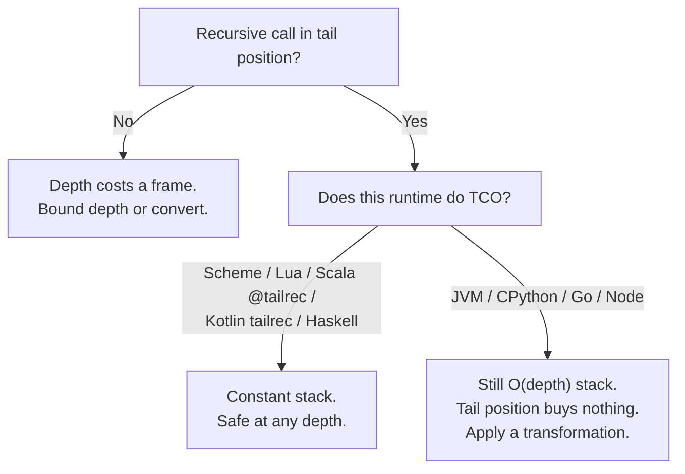
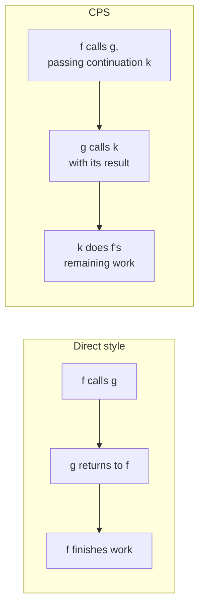

# Recursion & Tail Calls — Senior Level

> **Roadmap:** [Functional Programming](../README.md) → Recursion & Tail Calls
>
> *Recursion is the natural control structure of functional programming, but the call stack is a finite, runtime-specific resource. At the senior level the question is no longer "how do I write a recursive function?" but "will this recursion survive a production-sized input on **this** runtime, and if not, which transformation makes it safe?"*

---

## Table of Contents

1. [Introduction](#introduction)
2. [TCO Across Runtimes — Who Actually Has It](#tco-across-runtimes--who-actually-has-it)
3. [Trampolining — Recursion Without a Growing Stack](#trampolining--recursion-without-a-growing-stack)
4. [Continuation-Passing Style](#continuation-passing-style)
5. [Explicit-Stack Conversion](#explicit-stack-conversion)
6. [Structural Recursion over ADTs](#structural-recursion-over-adts)
7. [Designing Recursive Algorithms That Won't Blow the Stack](#designing-recursive-algorithms-that-wont-blow-the-stack)
8. [Common Mistakes](#common-mistakes)
9. [Test Yourself](#test-yourself)
10. [Cheat Sheet](#cheat-sheet)
11. [Summary](#summary)
12. [Further Reading](#further-reading)
13. [Related Topics](#related-topics)

---

## Introduction

> Focus: **design and architecture implications.** When is recursion safe in production, and what do you reach for when the runtime won't optimize it for you?

At the junior and middle levels (see [`middle.md`](middle.md)) you learned recursion as the FP replacement for the loop, the accumulator pattern, and the idea of a *tail call* — a recursive call in tail position whose result is returned directly. That picture is correct but dangerously incomplete for production engineering, because it omits a hard physical fact:

**Every non-tail-optimized recursive call consumes a stack frame, and the stack is finite.** On a typical JVM thread the default stack is ~512 KB–1 MB; CPython defaults to a recursion *limit* of 1000 (a deliberate guard, not the true C-stack limit); Go grows goroutine stacks dynamically but still caps them (1 GB on 64-bit by default). A recursion depth that is fine for your test fixture of 50 elements becomes a `StackOverflowError`, `RecursionError`, or a hard crash on the 200,000-element list a customer uploads at 2 a.m.

The senior shift is to treat **recursion depth as a capacity-planning variable**, exactly like memory or connection-pool size. Three questions decide everything:

1. **Is the recursion bounded by `O(log n)` or by `O(n)`?** Logarithmic depth (balanced divide-and-conquer) is almost always safe — `log₂(10⁹) ≈ 30`. Linear depth over user-controlled input is a latent outage.
2. **Is the recursive call in tail position, and does my runtime eliminate tail calls?** If both are true, depth is free. If either is false, depth costs a frame.
3. **If depth is unbounded and TCO is absent, which transformation do I apply?** Trampolining, CPS, explicit-stack conversion, or a plain loop — each with different ergonomics and cost.

This file is a decision framework for those three questions, grounded in what real runtimes actually do.

---

## TCO Across Runtimes — Who Actually Has It

**Tail-call optimization (TCO)** — also called *tail-call elimination* — is a compiler/runtime transformation that reuses the current stack frame for a call in tail position instead of pushing a new one. A tail-recursive function with TCO runs in **constant stack space**; it is, mechanically, a loop. Without TCO, the same function runs in **`O(depth)` stack space** and will eventually overflow.

A call is in **tail position** only if its result is returned *with no further computation*. These distinctions trip up even experienced engineers:

```python
def sum_bad(xs, i=0):
    if i == len(xs): return 0
    return xs[i] + sum_bad(xs, i + 1)   # NOT tail: the '+' happens AFTER the call

def sum_good(xs, i=0, acc=0):
    if i == len(xs): return acc
    return sum_good(xs, i + 1, acc + xs[i])  # tail: call result is returned as-is
```

`sum_good` is *tail-recursive*. Whether that buys you anything depends entirely on the runtime:

| Runtime / Language | TCO? | Notes |
|---|---|---|
| **Scheme** | Yes — *guaranteed* | The standard (R5RS/R7RS) **mandates** proper tail calls. Iteration is *defined* as tail recursion; there is no separate loop primitive needed. |
| **Haskell** | Effectively, via laziness | GHC doesn't "do TCO" in the imperative sense, but tail-recursive (and well-structured lazy) functions run in constant stack. Beware *space leaks* from un-forced thunks (`foldl` vs `foldl'`). |
| **Scala** | Yes — *self* tail calls | The compiler rewrites self-recursive tail calls into loops. Annotate with **`@tailrec`** to get a **compile error** if a function you believe is tail-recursive isn't. Does *not* optimize mutual/general tail calls (JVM limitation). |
| **Kotlin** | Yes — opt-in | The **`tailrec`** modifier rewrites a self-tail-recursive function into a loop; the compiler warns if it can't. |
| **Lua** | Yes — *guaranteed* "proper tail calls" | A `return f(x)` is a proper tail call by spec; unbounded tail recursion is safe. |
| **JavaScript** | Spec yes, engines no | ES2015 specified proper tail calls, but **V8, SpiderMonkey, and Node never shipped it** (only JavaScriptCore/Safari did, partially). Treat JS as *no TCO* in practice. |
| **JVM (Java)** | **No** | The bytecode has no tail-call instruction and the verifier/security model historically blocked it. Java the language does no TCO. Plan for it. |
| **CPython** | **No** — by design | Guido van Rossum has repeatedly declined TCO, valuing readable tracebacks over deep recursion. Default `sys.setrecursionlimit` is 1000. |
| **Go** | **No** | The `gc` compiler does not eliminate tail calls. Stacks grow dynamically (up to ~1 GB) so you get *deeper* recursion than the JVM before crashing — but it is not free, and it *will* crash. |



**The architectural consequence:** *you cannot port a deep-recursion idiom from Scheme or Scala to Java, Python, Go, or Node and expect it to work.* The same algorithm that is provably constant-stack in one runtime is a latent crash in another. A senior reviewing a recursive function in Java/Python/Go must ask "what bounds the depth?" because the runtime offers no safety net. The remaining sections are the toolkit for exactly those runtimes.

---

## Trampolining — Recursion Without a Growing Stack

A **trampoline** turns recursion into iteration *without* requiring runtime TCO. The trick: instead of a function *calling* its continuation (and consuming a frame), it **returns a description of the next step**, and a driver loop repeatedly invokes those steps. The stack never grows because each step returns to the loop before the next begins.

The recursive function returns one of two things:
- `Done(value)` — the final answer, or
- `More(thunk)` — a zero-argument function that, when called, produces the next `Done`/`More`.

```python
# Python — a trampoline. factorial would overflow at depth ~1000; this is flat.
from dataclasses import dataclass
from typing import Callable, Any

@dataclass
class Done:  value: Any
@dataclass
class More:  thunk: Callable[[], Any]

def trampoline(step):
    while isinstance(step, More):   # the ONLY place control "recurses" — a loop
        step = step.thunk()
    return step.value

def fact(n, acc=1):
    if n <= 1:
        return Done(acc)
    return More(lambda: fact(n - 1, acc * n))   # describe the next step, don't call it

print(trampoline(fact(100_000)))   # no RecursionError — runs in constant stack
```

The key move is `lambda: fact(n - 1, acc * n)`: `fact` does **not** call itself. It returns a thunk; `trampoline` calls it on the next iteration. Stack depth stays at 2 frames regardless of `n`.

The same pattern in Go, where there is no TCO and you want safe unbounded depth:

```go
// Go — a trampoline. The Thunk type is the bounce.
type Bounce struct {
    Done  bool
    Value int
    Next  func() Bounce
}

func trampoline(b Bounce) int {
    for !b.Done {
        b = b.Next()
    }
    return b.Value
}

func fact(n, acc int) Bounce {
    if n <= 1 {
        return Bounce{Done: true, Value: acc}
    }
    return Bounce{Next: func() Bounce { return fact(n-1, acc*n) }}
}
```

**Trade-offs you must weigh as a senior:**
- **Cost:** each bounce allocates a closure/thunk and pays an indirect call. Trampolining is *slower* than a native loop and produces GC pressure. Use it when depth genuinely exceeds the stack and a hand-written loop is awkward (e.g., mutual recursion).
- **Mutual recursion is where it shines.** Scala's `@tailrec` and Kotlin's `tailrec` only handle *self*-recursion. A trampoline handles arbitrary mutually-recursive tail calls because every call routes through the same loop — `isEven`/`isOdd`, parser state machines, interpreters.
- **Library support:** Scala's `cats.Eval` and the `TailRec`/`Trampoline` monad, and the FP libraries in most languages, package this so you write near-natural recursion and get a trampoline for free. Roll your own only when you must.

> **When to reach for it:** unbounded or input-controlled depth, *and* the recursion is (or can be made) tail-recursive, *and* the runtime lacks TCO. If depth is bounded by `O(log n)`, skip it — the complexity isn't worth it.

---

## Continuation-Passing Style

A trampoline handles *tail*-recursive functions. But many important recursions are **not** tail-recursive — the result of the recursive call is used in further computation (`xs[i] + recurse(...)`). **Continuation-passing style (CPS)** is the systematic transformation that makes *any* recursion tail-recursive, by passing "what to do with the result" as an explicit function argument (the **continuation**).

In CPS, no function ever returns a value to its caller; instead it calls its continuation with the value. The "rest of the computation" that the language stack normally remembers becomes an explicit, heap-allocated chain of closures.

```python
# Direct style — NOT tail-recursive: the '+' is pending work after the call.
def sum_direct(xs, i=0):
    if i == len(xs): return 0
    return xs[i] + sum_direct(xs, i + 1)

# CPS — every call is now in tail position. The pending '+' is captured in `k`.
def sum_cps(xs, i, k):
    if i == len(xs):
        return k(0)                              # hand the base value to the continuation
    return sum_cps(xs, i + 1, lambda r: k(xs[i] + r))   # tail call; defer the '+'

# sum_cps(xs, 0, lambda x: x)  -> the identity continuation extracts the answer
```

Trace it: `sum_cps` always ends in a tail call to itself. The deferred additions live in the *continuation chain* `k`, which is a tower of closures on the **heap**, not the stack.

**CPS alone does not save you on a no-TCO runtime** — the tail calls still consume stack on the JVM/CPython/Go. CPS's real power is twofold:

1. **CPS + trampoline = safe, unbounded, non-tail recursion.** Once every call is a tail call (via CPS), you can route it through a trampoline, and now *any* recursive algorithm runs in constant stack. This is the general escape hatch.
2. **CPS makes control flow first-class.** The continuation *is* the rest of the program. This is why CPS underlies async/await desugaring, generators, exception handling, and the `Cont` monad — `callCC` (call-with-current-continuation) in Scheme captures exactly this. Understanding CPS is understanding how non-blocking I/O and coroutines are *compiled*.



> **Architecture note.** You rarely hand-write CPS in application code — it is hard to read and the continuation chain can leak memory just like a deep stack. Its value to a senior is *conceptual*: recognizing that "make it tail-recursive so the trampoline can run it" is always achievable via CPS, and that the async machinery you use daily is CPS the compiler wrote for you. See also [Composition](../05-composition/senior.md) for how continuations compose.

---

## Explicit-Stack Conversion

The most pragmatic, most portable, and most production-common technique: **replace the call stack with an explicit data structure on the heap** — a `list`/`slice`/`Deque` used as a stack (LIFO) or a queue/worklist (FIFO). This is the standard senior answer for tree and graph traversal in any no-TCO runtime, because it (a) cannot overflow the native stack, (b) makes the traversal order an explicit, tunable choice, and (c) lets you checkpoint, pause, or bound the work.

The mechanical recipe to convert a recursive traversal:

1. Create an explicit stack and push the initial node(s).
2. Loop while the stack is non-empty: pop a node, do its work, push its children.
3. The pop/push order encodes the traversal order (reverse-push children for left-to-right DFS).

```python
# Recursive DFS — overflows on a deep/degenerate tree (a linked-list-shaped tree
# of 100k nodes is depth 100k -> RecursionError).
def dfs_rec(node, visit):
    if node is None: return
    visit(node.val)
    dfs_rec(node.left, visit)
    dfs_rec(node.right, visit)

# Iterative DFS — explicit stack on the heap. Depth is bounded by heap, not the
# 1000-frame recursion limit. Safe on adversarial / user-supplied trees.
def dfs_iter(root, visit):
    if root is None: return
    stack = [root]
    while stack:
        node = stack.pop()
        visit(node.val)
        if node.right: stack.append(node.right)   # push right first...
        if node.left:  stack.append(node.left)    # ...so left is popped first
```

For graphs, the same shape with a `visited` set is iterative DFS; swap the stack for a FIFO queue and it becomes BFS — the **worklist** pattern that scales to millions of nodes:

```go
// Go — BFS as an explicit worklist (queue). No recursion, no stack-depth limit;
// memory is bounded by the frontier width, which you can monitor and cap.
func bfs(start *Node, visit func(*Node)) {
    seen := map[*Node]bool{start: true}
    queue := []*Node{start}
    for len(queue) > 0 {
        n := queue[0]
        queue = queue[1:]
        visit(n)
        for _, c := range n.Neighbors {
            if !seen[c] {
                seen[c] = true
                queue = append(queue, c)
            }
        }
    }
}
```

```java
// Java — iterative post-order is the genuinely awkward case, the one that tempts
// people back to recursion. Two-stack trick keeps it flat and JVM-safe.
void postOrder(Node root, Consumer<Node> visit) {
    if (root == null) return;
    Deque<Node> in = new ArrayDeque<>(), out = new ArrayDeque<>();
    in.push(root);
    while (!in.isEmpty()) {
        Node n = in.pop();
        out.push(n);
        if (n.left  != null) in.push(n.left);
        if (n.right != null) in.push(n.right);
    }
    while (!out.isEmpty()) visit(out.pop());   // drain in reverse = post-order
}
```

**Why this is the senior default in Java/Python/Go:** it has no hidden runtime dependency. It works identically regardless of TCO, recursion limits, or stack size; the only resource it consumes is heap, which is larger, monitorable, and degrades gracefully (an `OutOfMemoryError` you can alert on) rather than the abrupt `StackOverflowError`. The cost is that the code is more verbose and the explicit stack is slightly slower than native frames — a trade nearly always worth making for traversals over unbounded, externally-controlled data.

---

## Structural Recursion over ADTs

The cleanest recursion follows the *shape of the data*. **Structural recursion** means recursing on the sub-structures of an algebraic data type (see [Algebraic Data Types](../06-algebraic-data-types/senior.md)): for each constructor of a sum type, one case; the recursive cases recurse on the strictly-smaller sub-values. Because each recursive call is on a structurally smaller value, **termination is guaranteed by construction** — there is no "off-by-one infinite loop" risk that plagues numeric recursion.

```haskell
-- Haskell — a tree ADT and structural recursion over it. Each branch maps to a
-- constructor; the recursive calls are on the strictly smaller subtrees.
data Tree a = Leaf | Node (Tree a) a (Tree a)

sumTree :: Num a => Tree a -> a
sumTree Leaf         = 0
sumTree (Node l x r) = sumTree l + x + sumTree r   -- one case per constructor
```

### Folds and catamorphisms — recursion you don't write

The decisive senior insight: **most structural recursion is an instance of a `fold`**, and a fold is the *one* place recursion lives, so you never re-derive (or re-bug) it. A **catamorphism** is the generalization of `fold` to any ADT — it collapses a recursive structure into a value by replacing each constructor with a supplied function. Once you have `foldTree`, `sumTree`, `height`, `toList`, and `mirror` are all non-recursive expressions:

```haskell
foldTree :: b -> (b -> a -> b -> b) -> Tree a -> b
foldTree z _ Leaf         = z
foldTree z f (Node l x r) = f (foldTree z f l) x (foldTree z f r)

sumTree' t = foldTree 0 (\l x r -> l + x + r) t       -- no explicit recursion
height   t = foldTree 0 (\l _ r -> 1 + max l r) t     -- the recursion is amortized
```

This connects directly to [Map / Filter / Reduce](../04-map-filter-reduce/senior.md): `reduce`/`fold` over a list is the catamorphism of the list ADT. Folds give you *correct structural recursion for free* and centralize the stack-safety concern — make `foldTree` stack-safe once (via an explicit stack or trampoline) and every operation built on it inherits the safety.

### Mutual recursion and divide-and-conquer

Two design shapes recur (so to speak):

- **Mutual recursion** is natural for grammars and ASTs: `parseExpr` calls `parseTerm` calls `parseFactor` calls `parseExpr`. The depth is bounded by *nesting depth of the input*, which for user-supplied source is **attacker-controllable** — deeply-nested `((((...))))` is a classic parser DoS. Defenses: an explicit recursion-depth counter that rejects input past a limit, or an explicit-stack/Pratt parser. Note again that `@tailrec`/`tailrec` do **not** help mutual recursion — trampolining or an explicit stack is the only option.
- **Divide-and-conquer** (mergesort, quicksort, balanced-tree ops) recurses on *halves*, giving `O(log n)` depth — the safe regime. The danger is **degenerate splits**: quicksort on already-sorted input with a naive pivot degrades to `O(n)` depth and overflows. The fix is algorithmic (median-of-three / random pivot to keep splits balanced) or to recurse on the *smaller* partition and loop on the larger, capping depth at `O(log n)` regardless. (The DSA roadmap's *Divide & Conquer* and *Recursion/Backtracking* sections cover the algorithmic side in depth.)

> **Design rule:** prefer structural recursion over an ADT to ad-hoc numeric recursion — termination is free and the shape is self-documenting. Then factor the recursion into a fold so it exists in exactly one auditable place.

---

## Common Mistakes

1. **Assuming tail position implies stack safety.** Writing a textbook tail-recursive function and shipping it on the JVM, CPython, Go, or Node — none of which do TCO — so it still overflows. *Tail position is necessary but not sufficient; the runtime must eliminate the call.* Verify your runtime is on the "Yes" list before relying on tail recursion for depth.
2. **`@tailrec`/`tailrec` on mutual recursion.** Expecting Scala/Kotlin to optimize `isEven`↔`isOdd`. They optimize *self*-recursion only; the annotation will fail to compile or silently not apply. *Use a trampoline for mutual tail recursion.*
3. **Raising the recursion limit instead of fixing the algorithm.** `sys.setrecursionlimit(10**6)` in Python "works" until the real C stack overflows and the interpreter *segfaults* — a worse, undebuggable failure than the clean `RecursionError`. *Convert to an explicit stack; don't paper over depth.*
4. **Unbounded recursion on user-controlled input.** Recursive JSON/XML parsers, comparison of nested structures, recursive `equals`/`hashCode` — all are `O(input nesting depth)` and a deeply-nested payload is a denial-of-service. *Bound the depth explicitly or use an iterative parser.*
5. **`foldl` instead of `foldl'` in Haskell.** Lazy left fold builds a chain of unforced thunks and blows the stack (or heap) on long lists — the canonical Haskell space leak. *Use the strict `foldl'` for accumulating folds.*
6. **Hand-rolling a trampoline where an iterative loop is clearer.** Trampolining a simple linear accumulation that converts trivially to a `while` loop adds closures, allocation, and indirection for no benefit. *Reach for the heaviest tool last: loop < explicit stack < trampoline < CPS+trampoline.*
7. **Degenerate divide-and-conquer.** Naive-pivot quicksort or unbalanced-tree recursion that silently becomes `O(n)` depth. *Keep splits balanced, and recurse on the smaller half while looping on the larger to cap stack at `O(log n)`.*
8. **Forgetting CPS continuations live on the heap.** Converting to CPS to "avoid stack overflow" but then running the tail calls on a no-TCO runtime: you've moved nothing, just renamed the problem. *CPS only helps when paired with a trampoline (or a TCO runtime).*

---

## Test Yourself

1. A colleague's Scala function is annotated `@tailrec` and compiles. They port the identical logic to Java. Why might the Java version overflow on the same input, and what do you tell them to do?
2. You have a recursive function that is *not* in tail position (it multiplies the recursive result). On a no-TCO runtime you need it to handle depth 1,000,000. Describe the two-step transformation that makes this safe.
3. Why does raising `sys.setrecursionlimit` to a very large number risk a *worse* failure than the default `RecursionError`?
4. A balanced-binary-tree recursion is depth `O(log n)`. For `n = 10⁹`, roughly what depth, and is recursion safe here? Contrast with a recursion that is depth `O(n)` over the same input.
5. Explain why `@tailrec`/`tailrec` cannot optimize a mutually-recursive `isEven`/`isOdd` pair, and what technique can.
6. What single structural change makes "all my tree operations are individually bugged-recursive functions" into "the recursion exists in exactly one place I can make stack-safe once"?

<details>
<summary>Answers</summary>

1. Scala's compiler rewrites the self-tail-recursive call into a loop (constant stack); the JVM bytecode the *Java* compiler emits does **not** eliminate tail calls, so the Java version consumes `O(depth)` frames and overflows. Tell them the JVM has no TCO at the language level — they must convert to an explicit-stack iteration or an accumulator-plus-loop, not rely on tail position.
2. **(a)** Convert to continuation-passing style so every call is in tail position (the pending multiplication is captured in the continuation closure on the heap). **(b)** Run the now-tail-recursive function through a **trampoline** — each step returns a thunk and a driver loop bounces, keeping native stack constant. CPS makes it tail-recursive; the trampoline makes tail recursion stack-safe on a no-TCO runtime.
3. The recursion limit is a *soft guard* the interpreter checks; the real limit is the C stack. Setting the limit far above what the C stack can hold means CPython recurses past the actual stack boundary and **segfaults** — a hard, undebuggable crash with no traceback — instead of raising a clean, catchable `RecursionError`.
4. `log₂(10⁹) ≈ 30`. Depth ~30 is trivially safe — recursion is the right tool for balanced divide-and-conquer. An `O(n)` recursion over the same input is depth 10⁹, which overflows the stack on every common runtime; it must be made iterative or trampolined.
5. `@tailrec`/`tailrec` rewrite only *self*-recursion into a loop; `isEven` calling `isOdd` is a call to a *different* function, which the rewrite cannot turn into a `goto`/loop within a single frame (and the JVM has no general tail-call instruction). A **trampoline** handles it: both functions return thunks routed through one driver loop, so mutual tail recursion runs in constant stack.
6. Factor every operation through a single **fold / catamorphism** (`foldTree`). Each operation becomes a non-recursive expression supplying combining functions; the recursion lives only inside `foldTree`, which you make stack-safe once (explicit stack or trampoline) and every operation inherits the safety.

</details>

---

## Cheat Sheet

| Situation | Reach for |
|---|---|
| Balanced divide-and-conquer, depth `O(log n)` | Plain recursion — safe even on no-TCO runtimes |
| Tail-recursive + runtime has TCO (Scheme/Lua/Scala `@tailrec`/Kotlin `tailrec`/Haskell) | Plain tail recursion — constant stack, free |
| Tail-recursive + **no** TCO (JVM/CPython/Go/Node) | Rewrite as a loop with an accumulator, **or** trampoline |
| **Not** tail-recursive + unbounded depth | CPS to make it tail-recursive, **then** trampoline |
| Tree / graph traversal over unbounded input | **Explicit stack** (DFS) or **worklist queue** (BFS) — the portable default |
| Mutual recursion needing unbounded depth | **Trampoline** (annotations don't help mutual recursion) |
| Many recursive ops over one ADT | Factor into a **fold / catamorphism**; make that one function stack-safe |

**Runtime TCO verdict:** Scheme ✅ (mandated) · Lua ✅ · Scala ✅ self only · Kotlin ✅ opt-in · Haskell ✅ effectively · **JVM ❌ · CPython ❌ · Go ❌ · Node ❌**

**Tool weight, lightest first:** loop → explicit stack → trampoline → CPS + trampoline. *Use the lightest that solves the depth problem.*

---

## Summary

- **Recursion depth is a capacity variable**, not a free abstraction. `O(log n)` depth is safe everywhere; `O(n)` depth over user-controlled input is a latent stack overflow / DoS.
- **TCO is runtime-specific.** Scheme and Lua *guarantee* it; Scala (`@tailrec`) and Kotlin (`tailrec`) do *self*-recursion; Haskell achieves it effectively. **The JVM, CPython, Go, and Node do not** — tail position buys nothing there, and you cannot port deep-recursion idioms into them.
- **Trampolining** turns tail recursion into a driver loop that bounces over returned thunks — constant stack without runtime TCO, ideal for mutual recursion, at the cost of closure allocation.
- **CPS** makes *any* recursion tail-recursive by reifying "the rest of the computation" as a continuation; it only achieves stack safety when paired with a trampoline (or a TCO runtime), but it's the conceptual root of async/await, generators, and `callCC`.
- **Explicit-stack / worklist conversion** is the portable senior default for tree and graph traversal: it depends on no runtime feature, bounds depth by heap not stack, and degrades gracefully.
- **Structural recursion over ADTs** guarantees termination by construction; factor it into a **fold / catamorphism** so the recursion — and its stack-safety fix — lives in exactly one auditable place.
- **Design rule:** keep splits balanced (cap divide-and-conquer at `O(log n)`), bound depth on attacker-controlled input, and reach for the lightest tool that solves the depth problem.

---

## Further Reading

- **Structure and Interpretation of Computer Programs** — Abelson & Sussman — the canonical treatment of recursion vs. iteration and *proper tail recursion* (Section 1.2); explains why Scheme needs no loop construct.
- **Compiling with Continuations** — Andrew Appel — CPS as a compilation strategy; the rigorous source for continuations as first-class control.
- **"Stackless Scala With Free Monads"** — Rúnar Bjarnason — the definitive practical walk-through of trampolining a no-TCO runtime (the JVM) to safety.
- **Functional Programming in Scala** — Chiusano & Bjarnason ("the red book") — `@tailrec`, trampolines (`TailRec`), and stack-safe recursion on the JVM.
- **The Implementation of Functional Programming Languages** — Simon Peyton Jones — laziness, thunks, and the space-leak behavior behind `foldl` vs `foldl'`.
- **Real World Haskell** / GHC docs — strict folds, space leaks, and constant-stack recursion under laziness.

---

## Related Topics

- [Map / Filter / Reduce](../04-map-filter-reduce/senior.md) — `reduce`/`fold` is the list catamorphism; the stack-safety concern of folds connects directly here.
- [Composition](../05-composition/senior.md) — continuations compose; CPS is the compositional view of "the rest of the program."
- [Algebraic Data Types](../06-algebraic-data-types/senior.md) — structural recursion follows the ADT's constructors; catamorphisms generalize folding over any ADT.
- [Currying & Partial Application](../07-currying-and-partial-application/senior.md) — continuations and accumulators are higher-order arguments threaded through recursion.
- [Laziness & Streams](../12-laziness-and-streams/senior.md) — lazy evaluation enables constant-stack recursion in Haskell and underlies the `foldl`/`foldl'` space-leak distinction.
- The **Data Structures & Algorithms** roadmap's *Divide & Conquer* and *Recursion / Backtracking* sections cover the algorithmic side — recurrence analysis, the Master Theorem, and depth-bounding pivot strategies.
