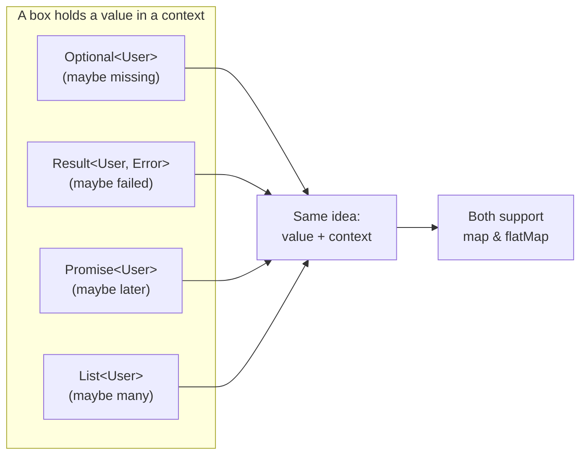
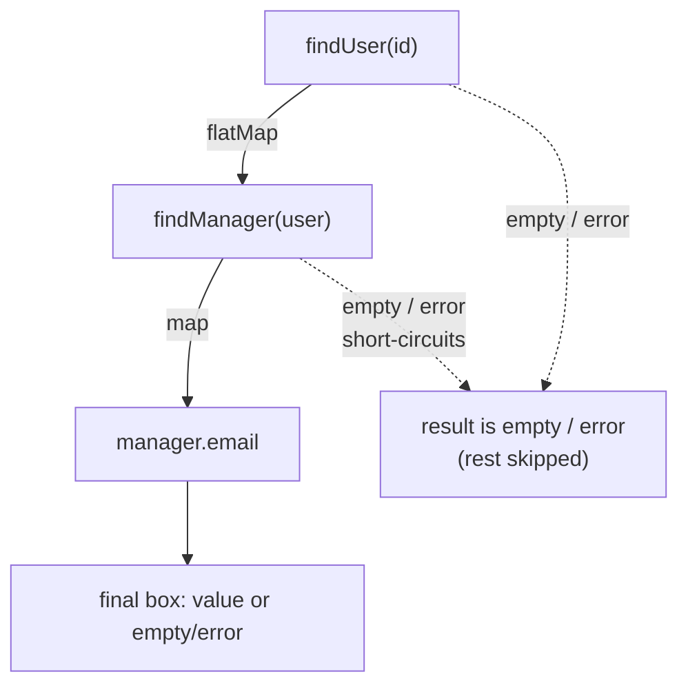

# Monads — Plain English (Junior Level)

> **Roadmap:** [Functional Programming](../README.md) → Monads — Plain English
>
> *A monad is just a **box** that holds a value in some context — "maybe missing," "maybe failed," "maybe later," "maybe many" — together with a way to **chain** operations that each return another box, so you stop writing pyramids of null-checks and error-checks.*

---

## Table of Contents

1. [Introduction: Monads Aren't Scary](#introduction-monads-arent-scary)
2. [Prerequisites](#prerequisites)
3. [Glossary](#glossary)
4. [The Box Intuition](#the-box-intuition)
5. [`map` vs `flatMap`: The Key Move](#map-vs-flatmap-the-key-move)
6. [Familiar Monads You Already Use](#familiar-monads-you-already-use)
   - [Optional / Maybe — "what if it's missing?"](#optional--maybe--what-if-its-missing)
   - [Result / Either — "what if it failed?"](#result--either--what-if-it-failed)
   - [Promise / Future — "what if it's later?"](#promise--future--what-if-its-later)
   - [List — "what if there are many?"](#list--what-if-there-are-many)
7. [The Haskell Aside: `Maybe` in One Breath](#the-haskell-aside-maybe-in-one-breath)
8. [Go: No Monads, Manual Chaining](#go-no-monads-manual-chaining)
9. [Why It Helps: No More Pyramid](#why-it-helps-no-more-pyramid)
10. [Common Mistakes](#common-mistakes)
11. [Test Yourself](#test-yourself)
12. [Cheat Sheet](#cheat-sheet)
13. [Summary](#summary)
14. [Further Reading](#further-reading)
15. [Related Topics](#related-topics)

---

## Introduction: Monads Aren't Scary

Monads have a reputation. People say "a monad is a monoid in the category of endofunctors" and walk away looking pleased. That sentence is true, useless to you today, and the reason most programmers think monads are hard. **Ignore it.**

Here is the whole idea at the junior level:

> You already use monads. `Optional`, `Result`, `Promise`, and `List` are all the same shape: a **box** around a value, plus a **chain** operation that lets you keep working with the value *without opening the box by hand at every step*.

That's it. The word "monad" is just the name mathematicians gave to "things that behave like this box." You do not need the math to use them — the same way you don't need group theory to add numbers. This file gives you the **intuition** and the **concrete boxes**. The theory — the laws, the category-theory framing, the `IO` monad — comes later in [`middle.md`](middle.md) and [`senior.md`](senior.md).

> **The one move to learn here:** when each step of your work returns *another box* (a lookup that might find nothing, a parse that might fail, a fetch that happens later), you need a way to **chain box-returning steps** without ending up with a box-inside-a-box-inside-a-box. That move is called `flatMap` (or `bind`, or `then`, or `andThen`, depending on the language). Learn that one move and monads stop being mysterious.

---

## Prerequisites

- **Required:** You can read and write functions in at least one language (examples use Java, Python, and Go).
- **Required:** You understand a function that takes a value and returns a value, and you've called `map` / `filter` on a list before. See [Map / Filter / Reduce](../04-map-filter-reduce/junior.md).
- **Helpful:** You've felt the pain of nested `if (x != null)` checks, or a stack of `if err != nil` in Go. That pyramid is exactly what monads flatten.
- **Helpful:** Familiarity with [Algebraic Data Types](../06-algebraic-data-types/junior.md) — `Optional` and `Result` are sum types ("either a value, or nothing / an error").

---

## Glossary

| Term | Plain-English meaning |
|------|----------------------|
| **Box / context** | A wrapper around a value that adds meaning: *maybe* there's a value, *maybe* it failed, *maybe* it'll arrive later, *maybe* there are several. |
| **Monad** | A box that comes with two abilities: (1) put a plain value *into* the box, and (2) `flatMap` — chain a box-returning function without nesting boxes. That's the whole definition for now. |
| **`map`** | Transform the value *inside* the box with a function that returns a **plain** value. The box stays a box: `Box<A>` → `Box<B>`. |
| **`flatMap`** (a.k.a. `bind`, `then`, `andThen`, `>>=`) | Transform the value inside the box with a function that returns **another box**, then *flatten* so you don't get a box-in-a-box: `Box<A>` → `Box<B>` (not `Box<Box<B>>`). |
| **Wrap / `of` / `pure` / `return`** | Put a plain value into the box: `A` → `Box<A>`. (In Haskell this is confusingly called `return` — it has nothing to do with returning from a function.) |
| **Pyramid of doom** | The deeply-nested `if`-check shape you get when every step might fail and you check each one by hand. Monads flatten it. |
| **Short-circuit** | When a chained step "fails" (empty `Optional`, error `Result`, rejected `Promise`), the rest of the chain is skipped automatically. |

---

## The Box Intuition

Forget mathematics. Picture a **box** with a value inside it. The box's *shape* tells you what kind of uncertainty surrounds that value:

| Box | The uncertainty it captures | The question it answers |
|---|---|---|
| `Optional<T>` / `Maybe T` | The value might be **missing** | *"What if it's not there?"* |
| `Result<T, E>` / `Either E T` | The operation might have **failed** | *"What if it went wrong?"* |
| `Promise<T>` / `Future<T>` | The value arrives **later** | *"What if it's not ready yet?"* |
| `List<T>` / `[T]` | There might be **zero, one, or many** | *"What if there are several?"* |

In every case you have a value *plus a context*. The whole point of treating these as the same idea is that **the way you work with the value is the same regardless of the context.** You want to say "take whatever is in the box and apply this function" — and let the box handle its own bookkeeping (the missing-ness, the error, the lateness, the multiplicity).



The boxes differ in *which* context they carry. They agree on *how* you reach inside: `map` and `flatMap`.

---

## `map` vs `flatMap`: The Key Move

This is the single most important section in the file. Almost all confusion about monads is really confusion about `map` versus `flatMap`.

### `map` — for functions that return a plain value

`map` reaches into the box, applies your function, and puts the result back in a box of the same shape. Your function takes a plain value and returns a **plain value**.

```
map:  Box<A>  +  (A -> B)        =  Box<B>
```

Example: you have an `Optional<User>` and a function `User -> String` (get the name). After `map` you have an `Optional<String>`. Still one box deep. 

### `flatMap` — for functions that return *another box*

Sometimes your function doesn't return a plain value — it returns *another box*, because that step itself might fail / be missing / be async. If you use `map` here, you get a box **inside** a box, which is useless. `flatMap` does the `map` **and then flattens** the double box into a single one.

```
map:      Box<A>  +  (A -> Box<B>)  =  Box<Box<B>>   ← nested, wrong!
flatMap:  Box<A>  +  (A -> Box<B>)  =  Box<B>         ← flattened, right!
```

> **The rule of thumb:**
> - Your transforming function returns a **plain value** → use `map`.
> - Your transforming function returns **another box** → use `flatMap`.

That single decision is the heart of using monads. Here it is concretely in Java with `Optional`:

```java
Optional<User> user = findUser(id);

// map: getName returns a plain String → stays Optional<String>
Optional<String> name = user.map(u -> u.getName());

// findManager returns Optional<User> (the manager might not exist),
// so map would give Optional<Optional<User>> — a box in a box.
// flatMap flattens it back to a single Optional<User>:
Optional<User> manager = user.flatMap(u -> findManager(u));   // ✅ one box deep
// Optional<Optional<User>> bad = user.map(u -> findManager(u)); // ❌ nested
```

And in Python (lists, where `flatMap` is "map then concatenate"):

```python
words = ["hi", "yo"]

# map: len returns a plain int → list of ints
lengths = [len(w) for w in words]            # [2, 2]

# each word -> list of its letters; we want ONE flat list, not list-of-lists
flat = [ch for w in words for ch in w]       # ['h','i','y','o']  ← flatMap
nested = [list(w) for w in words]            # [['h','i'],['y','o']]  ← map (nested)
```

`flatMap` for a list is exactly "apply a function that returns a list to each element, then concatenate the results into one flat list." Same word, same idea, different box.

### The third ability: getting *into* the box

Besides `map` and `flatMap`, a monad needs one more, easy-to-overlook ability: a way to take a plain value and **wrap** it into the box. You've done this without thinking:

| Language / box | Wrap a plain value | Result |
|---|---|---|
| Java `Optional` | `Optional.of(x)` | `Optional<X>` |
| Java `Stream` | `Stream.of(x)` | `Stream<X>` |
| JavaScript `Promise` | `Promise.resolve(x)` | `Promise<X>` |
| Python list | `[x]` | `list` of one element |
| Haskell `Maybe` | `Just x` (or `pure x`) | `Maybe X` |

This "wrap" step (called `of`, `pure`, `resolve`, or — confusingly in Haskell — `return`) is what lets a `flatMap` callback *end* a chain by handing back a plain result inside the right box. You rarely think about it, but it's the partner to `flatMap`: one puts values *in*, the other chains *across*.

---

## Familiar Monads You Already Use

You have almost certainly used every box below without calling it a monad. Seeing them side by side is the moment monads "click."

### Optional / Maybe — "what if it's missing?"

The `Optional` box says "there may or may not be a value here." It exists to kill the `null` check. Instead of asking "is it null?" at every step, you `flatMap` a chain of lookups, and if *any* step finds nothing, the whole chain short-circuits to empty.

```java
// Java — find a user's manager's email, any step may be absent.
// No null checks: if any lookup is empty, the result is just empty.
Optional<String> email =
    findUser(id)                       // Optional<User>
        .flatMap(user -> findManager(user))   // Optional<User>   (manager may not exist)
        .map(manager -> manager.getEmail());  // Optional<String> (email is a plain String)

email.ifPresent(e -> send(e));         // only runs if the whole chain produced a value
```

Compare the null-check version you're trying to avoid:

```java
// The pyramid we're escaping:
User user = findUser(id);
if (user != null) {
    User manager = findManager(user);
    if (manager != null) {
        String e = manager.getEmail();
        if (e != null) {
            send(e);
        }
    }
}
```

The monadic version is the same logic, flattened. Note the `map`/`flatMap` choice: `findManager` returns an `Optional` (→ `flatMap`); `getEmail` returns a plain `String` (→ `map`).

### Result / Either — "what if it failed?"

`Result<T, E>` (Rust), `Either<E, T>` (Scala/Haskell/Vavr), `Try<T>` — same box, different name. It holds **either** a success value **or** an error explaining the failure. `flatMap` chains steps that each might fail; the first error short-circuits and is carried to the end, *with* its message — unlike `Optional`, which only knows "empty," `Result` knows *why*.

```python
# Python (illustrative Result-like class). Each step returns a Result.
# A failure anywhere skips the rest and propagates the error.
def process(raw):
    return (
        parse(raw)                      # Result[Config, Error]
        .flat_map(lambda cfg: validate(cfg))   # validate -> Result
        .flat_map(lambda cfg: connect(cfg))    # connect  -> Result
        .map(lambda conn: conn.session_id)     # plain value -> map
    )

r = process(user_input)
# r is Ok(session_id)  OR  Err("invalid port")  — and we never wrote `if error: ...` four times
```

The win: you write the *happy path* as a clean chain, and error handling lives in the box's machinery instead of being smeared across every line. The difference from `Optional` is just **what the "bad" case carries**: `Optional` carries nothing (`None`); `Result` carries an error value you can inspect and log.

### Promise / Future — "what if it's later?"

A `Promise` / `Future` is a box holding a value that **isn't here yet** — it'll arrive after some asynchronous work. Its `flatMap` is spelled `.then(...)` in JavaScript and `.thenCompose(...)` in Java. When you chain a step that returns *another* Promise, `then` flattens it — exactly `flatMap`.

```javascript
// JavaScript — fetchUser returns a Promise; fetchOrders returns a Promise.
// .then with a Promise-returning callback flattens (it's flatMap):
fetchUser(id)                                  // Promise<User>
    .then(user => fetchOrders(user.id))        // flatMap: returns Promise<Order[]>
    .then(orders => orders.length)             // map: returns a plain number
    .then(count => console.log(count));
```

Notice this is the *same shape* as the `Optional` chain — only the context changed from "maybe missing" to "maybe later." `async/await` is just nicer syntax for this exact chaining; under the hood it's `flatMap` on the Promise box.

### List — "what if there are many?"

A `List` is a box holding **zero or more** values. `map` transforms each element. `flatMap` applies a function that returns a *list* to each element and concatenates the results — flattening list-of-lists into one list. This is how you express "for each X, produce several Ys, give me all the Ys."

```java
// Java Streams — each order has many items; we want all items across all orders.
List<Item> allItems =
    orders.stream()
          .flatMap(order -> order.getItems().stream())  // each order -> a stream of items, flattened
          .collect(Collectors.toList());

// map here would give Stream<Stream<Item>> conceptually — a box in a box.
```

Same `flatMap`, same "flatten the nesting" job — just that the "context" is multiplicity instead of failure or absence.

---

## The Haskell Aside: `Maybe` in One Breath

Haskell is where these names come from, so a 20-second look helps — then we leave. Haskell's `Optional` is called `Maybe`, and its two cases are `Nothing` and `Just x`:

```haskell
data Maybe a = Nothing | Just a   -- a sum type: nothing, or a value

-- (>>=) is flatMap / bind. Chain lookups; Nothing short-circuits the whole thing.
managerEmail :: Int -> Maybe String
managerEmail uid =
  findUser uid >>= findManager >>= \mgr -> Just (email mgr)
--          ^^^ flatMap         ^^^ flatMap
```

`>>=` (pronounced "bind") is `flatMap`. `Just` is "wrap a value in the box." That's the *exact* same chain as the Java `Optional` example above — Haskell just made `flatMap` an operator and gave the box the name `Maybe`. The lesson: **the FP world invented these boxes first; modern languages copied them under friendlier names.** You don't need Haskell to use the idea; it just shows the idea in its purest form.

---

## Go: No Monads, Manual Chaining

Go deliberately has **no generic monad type** (and, for most of its life, no generics at all). Its idiom for "this might fail" is the `(value, error)` return pair, and you check the error **by hand** after every call. This is instructive precisely *because* it shows what monads automate.

```go
// Go — the manual chain. Every step explicitly checks err and returns early.
func managerEmail(id int) (string, error) {
    user, err := findUser(id)
    if err != nil {
        return "", err          // manual short-circuit
    }
    manager, err := findManager(user)
    if err != nil {
        return "", err          // ...again
    }
    return manager.Email, nil
}
```

Each `if err != nil { return ... }` is doing *by hand* exactly what a `Result` monad's `flatMap` does *automatically*: "if this step failed, skip the rest and carry the error to the end." Go's designers chose explicitness over the abstraction — every short-circuit is visible on the page. That's a real trade-off, not a mistake:

- **Cost:** more boilerplate; the happy path is interrupted by error checks.
- **Benefit:** no hidden control flow — you can see exactly where each early-return happens, and there's no `map`-vs-`flatMap` puzzle to get wrong.

Even with generics (Go 1.18+), the language has no `flatMap` chaining for `(T, error)` because that pair isn't a single value you can wrap — so a fluent `Result` chain doesn't fit Go's grain. The takeaway for you: **monads are one solution to "chaining fallible steps," and Go shows the other one** — do it manually, visibly, every time. Seeing both makes the monadic version less magical: it's just the same short-circuit, hidden inside the box.

---

## Why It Helps: No More Pyramid

Pull the threads together. Every box above solves the same structural problem:

> When each step of a computation might *not produce a usable value* — it could be missing, failed, pending, or multiple — naively you check that condition after **every** step. The checks nest, and you get the pyramid of doom.

Monadic chaining **factors that repeated check into the box once**, so your code expresses only the interesting part: the sequence of transformations. The box handles the "what if the previous step didn't give me anything" bookkeeping. Concretely, you gain:

1. **Flat code instead of nested.** A chain of `flatMap`/`then` calls reads top-to-bottom like a recipe, not a rightward-marching pyramid. (This is the [Arrow Anti-Pattern](../../anti-patterns/01-development/01-bad-structure/junior.md) cure, applied to absence and failure.)
2. **Short-circuit for free.** The moment a step is empty / errors / rejects, the rest of the chain is skipped automatically. You write the happy path; the box handles the sad path.
3. **One mental model for four problems.** "Missing," "failed," "later," and "many" all use `map` and `flatMap`. Learn the shape once, reuse it everywhere.
4. **The uncertainty is in the type.** `Optional<User>` *tells you* the user might be absent — the compiler reminds you to handle it, instead of a `null` blowing up at runtime.



The dashed arrows are the point: a failure at *any* node jumps straight to the end. You never wrote that jump — the monad did.

### Before and after, side by side

To make the payoff concrete, here is the *same task* — "get a user's manager's email, where the user and the manager may each be absent" — written both ways in Java:

```java
// BEFORE — manual, nested. The "→" pyramid; the real line is buried.
String email = null;
User user = findUser(id);
if (user != null) {
    User manager = findManagerOrNull(user);
    if (manager != null) {
        email = manager.getEmail();   // ← the only line we actually care about
    }
}
// ...and every caller must remember `email` might still be null.

// AFTER — monadic chain. Flat, the intent reads top to bottom,
// and the type Optional<String> forces every caller to handle "absent".
Optional<String> email =
    findUser(id)
        .flatMap(this::findManager)   // findManager returns Optional<User>
        .map(User::getEmail);         // getEmail returns a plain String
```

The "after" version is shorter, but that's not the real win. The real win is that **the absence is now in the type** (`Optional<String>`), so the compiler won't let a caller forget it — whereas the "before" version's `null` is a silent landmine that explodes at runtime in some unrelated method three weeks later.

---

## Common Mistakes

1. **Confusing `map` and `flatMap`.** The number-one error. If your function returns a **box**, use `flatMap`; if it returns a **plain value**, use `map`. Using `map` with a box-returning function gives you `Optional<Optional<T>>` / `Stream<Stream<T>>` / `Promise<Promise<T>>` — a nested box you then can't easily use.
2. **Over-nesting instead of chaining.** `a.flatMap(x -> b.flatMap(y -> c.map(z -> ...)))` works but rebuilds the pyramid inside the lambdas. Keep chains flat where the language allows (`for`-comprehensions, `?` in Rust, `async/await` for Promises). Flatness was the whole goal.
3. **Opening the box too early.** Calling `.get()` on an `Optional`, `.unwrap()` on a `Result`, or blocking on a `Future` immediately *throws away* the safety. Stay inside the box as long as possible; unwrap once, at the edge, where you must.
4. **Thinking you need category theory.** You don't. "Box + `flatMap`" is enough to use monads correctly every day. The laws and theory are for *implementing* and *reasoning about* monads — a later topic.
5. **Believing monads are a Haskell-only thing.** You used `Promise.then`, `Optional.flatMap`, and `stream.flatMap` this month. Those are monads. The concept is everywhere; only the name is exotic.
6. **Mixing box types in one chain by accident.** You can't `flatMap` an `Optional` step into a `Promise` chain directly — they're different boxes. Convert at the boundary, don't assume one chain swallows another's context.

---

## Test Yourself

1. In one sentence each, what uncertainty does each box capture: `Optional`, `Result`, `Promise`, `List`?
2. You have `Optional<Order> order` and a function `Order -> Customer` (always returns a customer). Do you use `map` or `flatMap` to get `Optional<Customer>`?
3. Same `Optional<Order>`, but now the function is `Order -> Optional<Coupon>` (an order may have no coupon). `map` or `flatMap`? What goes wrong if you pick the other one?
4. Rewrite this Go-style manual chain as a *concept* sentence describing what a `Result` monad's `flatMap` would do automatically:
   ```go
   a, err := stepA()
   if err != nil { return err }
   b, err := stepB(a)
   if err != nil { return err }
   return use(b)
   ```
5. Why does the `Optional` version of "find user → find manager → get email" need *no* `null` checks, while the Go version needs an `if err != nil` after every step?
6. True or false: `flatMap` on a `List` produces a list of lists. Explain.

<details>
<summary>Answers</summary>

1. **`Optional`** — the value might be *missing*. **`Result`** — the operation might have *failed* (and it carries *why*). **`Promise`** — the value arrives *later* (async). **`List`** — there might be *zero, one, or many* values.
2. **`map`.** The function returns a plain `Customer`, so `map` gives `Optional<Customer>` — still one box deep.
3. **`flatMap`.** The function returns `Optional<Coupon>`. If you used `map`, you'd get `Optional<Optional<Coupon>>` — a box inside a box you'd have to unwrap twice. `flatMap` flattens it to `Optional<Coupon>`.
4. *"Run each step; if a step returns an error, skip all remaining steps and propagate that error to the final result; otherwise pass the success value to the next step."* — that automatic short-circuit is exactly what every `if err != nil { return err }` is doing by hand.
5. Because the `Optional` box performs the "is there a value to continue with?" check *internally* on every `flatMap`/`map`, short-circuiting to empty if not. Go's `(T, error)` pair isn't a box with that behavior, so **you** must write the short-circuit (`if err != nil { return }`) after each call.
6. **False — that's `map`.** `map` over a list of words with `wordToLetters` gives a list of lists (`[['h','i'],['y','o']]`). `flatMap` does that *and then concatenates*, giving one flat list (`['h','i','y','o']`). Flattening the nesting is the defining job of `flatMap`.

</details>

---

## Cheat Sheet

| You want to... | Use | Shape |
|---|---|---|
| Transform the value, function returns a **plain value** | `map` | `Box<A>` + `(A→B)` → `Box<B>` |
| Transform the value, function returns **another box** | `flatMap` | `Box<A>` + `(A→Box<B>)` → `Box<B>` |
| Put a plain value into a box | `of` / `Optional.of` / `Promise.resolve` / `[x]` | `A` → `Box<A>` |

| Box | Context | `flatMap` is spelled | Short-circuits on |
|---|---|---|---|
| `Optional` / `Maybe` | maybe **missing** | `flatMap` / `>>=` | empty / `None` |
| `Result` / `Either` | maybe **failed** | `flatMap` / `andThen` / `>>=` | the error case |
| `Promise` / `Future` | maybe **later** | `.then` / `.thenCompose` | rejection |
| `List` / `Stream` | maybe **many** | `flatMap` | (empty list = no results) |

> **The one rule:** function returns a **box** → `flatMap`; returns a **plain value** → `map`. Get that right and monads are easy.

---

## Summary

- A **monad** is, for your purposes today, a **box** that holds a value in a context — *missing*, *failed*, *later*, or *many* — plus a `flatMap` operation to chain box-returning steps without nesting boxes.
- **`map`** transforms with a plain-value function (`Box<A>`→`Box<B>`); **`flatMap`** transforms with a box-returning function and *flattens* the result. Choosing between them is the core skill.
- `Optional`, `Result`, `Promise`, and `List` are all the same shape with different contexts. You already use them — that's the proof monads aren't exotic.
- The payoff is **flat code with automatic short-circuiting**: write the happy path as a chain, and the box handles the missing/failed/pending/multiple bookkeeping — killing the pyramid of null- and error-checks.
- **Go** shows the alternative: no monads, manual `if err != nil` short-circuiting after every step — explicit, more boilerplate, but no hidden control flow. **Haskell** shows the pure form: `Maybe` and `>>=` (bind), the original names everyone copied.
- You do **not** need category theory to use any of this. Next: [`middle.md`](middle.md) — the monad laws and why chaining behaves predictably.

---

## Further Reading

- **Functors, Applicatives, And Monads In Pictures** — Aditya Bhargava (adit.io) — the illustrated "box" explanation this file is built on; read it next.
- **Functional Programming in Scala** — Chiusano & Bjarnason (2014) — the chapters on `Option`, `Either`, and monads, in code you can run.
- **Railway Oriented Programming** — Scott Wlaschin (fsharpforfunandprofit.com) — `Result`/`Either` chaining as a "two-track railway"; the clearest mental model for error handling.
- **Learn You a Haskell for Great Good!** — Miran Lipovača — the "A Fistful of Monads" chapter, if you want the pure form (free online).

---

## Related Topics

- [Algebraic Data Types](../06-algebraic-data-types/junior.md) — `Optional` and `Result` are sum types; the box *is* an ADT.
- [Map / Filter / Reduce](../04-map-filter-reduce/junior.md) — `map` over a box is the same `map` you know from lists.
- [Composition](../05-composition/junior.md) — `flatMap` is how you compose functions that return boxes.
- **Effect Tracking** (sibling topic `10-effect-tracking`) — the `IO` monad and the pure-core / impure-shell pattern, where this idea goes next.
- [Clean Code → Async & Functional](../../clean-code/12-async-and-functional/README.md) — `Promise` chaining and functional style in everyday code.
- [Arrow Anti-Pattern](../../anti-patterns/01-development/01-bad-structure/junior.md) — the nested-`if` pyramid that monadic chaining flattens.
