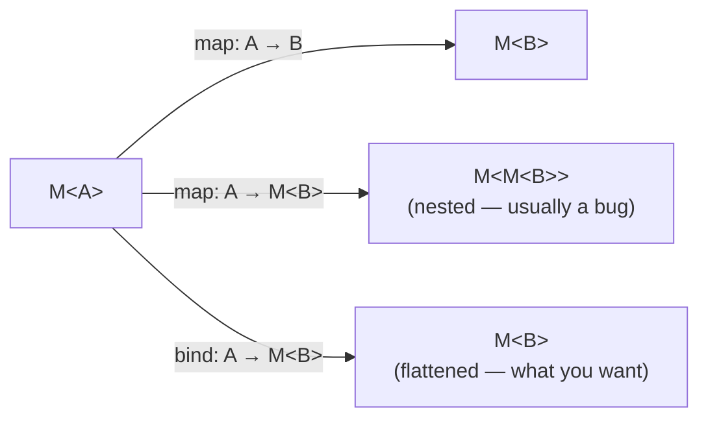
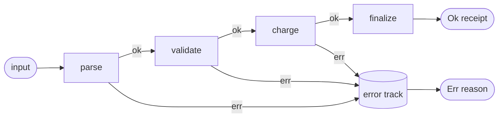

# Monads — Plain English (Middle)

> **Roadmap:** [Functional Programming](../README.md) → Monads — Plain English
>
> *A monad is a small, boring interface — a way to wrap a value and a way to chain operations that produce wrapped values — plus three sanity rules so the chaining never surprises you. `Optional`, `Result`, `List`, and `Promise` are all the same shape wearing different clothes.*

---

## Table of Contents

1. [Introduction](#introduction)
2. [Prerequisites](#prerequisites)
3. [The Monad Interface: `unit` + `bind`](#the-monad-interface-unit--bind)
4. [The Three Laws (Informally)](#the-three-laws-informally)
5. [A Tour of Common Monads](#a-tour-of-common-monads)
6. [State, Reader, Writer — a Gentle Intro](#state-reader-writer--a-gentle-intro)
7. [do-notation / for-comprehension: Flattening Sugar](#do-notation--for-comprehension-flattening-sugar)
8. [Railway-Oriented Programming](#railway-oriented-programming)
9. [Trade-offs: When Monadic Style Clarifies vs Obscures](#trade-offs-when-monadic-style-clarifies-vs-obscures)
10. [Common Mistakes](#common-mistakes)
11. [Test Yourself](#test-yourself)
12. [Cheat Sheet](#cheat-sheet)
13. [Summary](#summary)
14. [Further Reading](#further-reading)
15. [Related Topics](#related-topics)

---

## Introduction

> Focus: **using it well.** At the junior level you saw *why* `Promise`, `Optional`, and `Result` feel related. Here you learn the shared interface, the laws that keep it predictable, and the everyday practice — chaining, do-notation, and railway-oriented error handling — across Java, Python, and Go.

The word "monad" scares people because the math is presented before the use. We do the reverse. A monad is two functions and three rules:

- a way to **put a plain value into a box** (`unit`, also spelled `of` / `return` / `pure`), and
- a way to **chain a box-producing step onto a box** (`bind`, also spelled `flatMap` / `>>=`), so the boxes never nest.

That's it. Everything else — `Optional.flatMap`, `Stream.flatMap`, `CompletableFuture.thenCompose`, `Result.and_then`, list comprehensions, `async/await` — is a re-skin of that interface. Once you see the shape, a dozen APIs collapse into one idea, and you stop writing the same nesting-and-unwrapping boilerplate by hand.

The practical payoff at this level: **you can describe a multi-step computation that might fail, be absent, be asynchronous, or produce many results — as a flat sequence of steps, with the boxing concern handled once instead of at every line.**

---

## Prerequisites

- **Required:** [`junior.md`](junior.md) — you can recognize that `Optional`, `Result`, `Promise`, and `List` "wrap" a value, and you've used `map` on at least one.
- **Required:** [Map / Filter / Reduce](../04-map-filter-reduce/middle.md) — `map` over a container is the gateway concept; `bind` is its more powerful sibling.
- **Required:** [Algebraic Data Types](../06-algebraic-data-types/middle.md) — `Option`/`Either` *are* sum types; pattern matching on them is how a monad is implemented underneath.
- **Helpful:** [Composition](../05-composition/middle.md) — `bind` is what lets you compose functions that return wrapped values.
- **Helpful:** [Currying & Partial Application](../07-currying-and-partial-application/middle.md) — useful for the function-shapes that appear in `bind`.

---

## The Monad Interface: `unit` + `bind`

A monad is a generic type `M<A>` (a box holding an `A`) equipped with two operations.

| Operation | Common names | Type, in words |
|---|---|---|
| **unit** | `of`, `return`, `pure`, `just` | takes a plain `A`, gives back `M<A>` |
| **bind** | `flatMap`, `then`, `and_then`, `>>=` | takes an `M<A>` and a function `A -> M<B>`, gives back `M<B>` |

The signature of `bind` is the whole story:

```text
bind :  M<A>  ×  (A -> M<B>)   ->   M<B>
        the box   a step that      the result,
                  itself returns   still one box deep
                  a box
```

The crucial word is **flat**. A step `A -> M<B>` *produces its own box*. Naive `map` would give you `M<M<B>>` — a box in a box. `bind` flattens that one layer automatically. That single behavior — *chain a box-returning step without accumulating nested boxes* — is what makes a monad more than a plain "mappable" container.

### `map` vs `bind`, concretely

```text
map  :  M<A>  ×  (A -> B)      ->  M<B>     // step returns a plain value
bind :  M<A>  ×  (A -> M<B>)   ->  M<B>     // step returns a box; bind flattens
```

- Use **`map`** when the step *can't fail and isn't itself wrapped*: `Optional<int>.map(x -> x + 1)`.
- Use **`bind`** when the step *itself returns the same kind of box*: `Optional<User>.flatMap(u -> findManager(u))` where `findManager` returns `Optional<User>`.

If you ever find yourself with an `Optional<Optional<X>>` or a `List<List<X>>` you didn't want, you reached for `map` where you needed `bind`.



### Why `unit` matters

`unit` is the way *in*. It lets you start a chain from a plain value, and it's what a step returns when it has "nothing special" to say — a present `Optional`, an `Ok` result, an already-resolved `Promise`. Without `unit` you couldn't lift ordinary code into the monad, so the boundary between "plain world" and "boxed world" would have no door.

---

## The Three Laws (Informally)

The laws aren't bureaucracy. They are the **guarantees that let you refactor monadic code the way you refactor arithmetic** — moving pieces around, extracting steps, reordering grouping — without changing the result. Every well-behaved monad obeys them; if a custom one doesn't, chaining will betray you in subtle ways.

### 1. Left identity — *unit then bind is just calling the function*

> `bind(unit(x), f)` is the same as `f(x)`.

Wrapping a plain value and immediately chaining a step is the same as just running the step on the value. Practically: **`unit` adds no behavior of its own.** Putting a value in the box and pulling it through one step shouldn't differ from handing the value straight to the step.

```text
Optional.of(5).flatMap(f)   ==   f(5)        // (when f returns an Optional)
```

### 2. Right identity — *binding `unit` changes nothing*

> `bind(m, unit)` is the same as `m`.

If the step you chain is "just re-box it" (`unit`), you get the original box back untouched. Practically: **a no-op step is a no-op.** `someOptional.flatMap(Optional::of)` returns the same `Optional`.

### 3. Associativity — *grouping of chained steps doesn't matter*

> `bind(bind(m, f), g)` is the same as `bind(m, x -> bind(f(x), g))`.

Whether you chain `f` then `g`, or bundle "`f` then `g`" into one combined step and chain that — same result. Practically: **you can extract a run of chained steps into a helper function** and the meaning is unchanged. This is exactly what lets `a.flatMap(f).flatMap(g)` read top-to-bottom like a script, and lets you pull `.flatMap(f).flatMap(g)` out into `doFandG`.

```text
m.flatMap(f).flatMap(g)   ==   m.flatMap(x -> f(x).flatMap(g))
```

> **The one-sentence takeaway:** left/right identity say *unit is a true do-nothing wrapper*; associativity says *chaining is order-of-grouping-agnostic, so a chain is a sequence you can read and refactor linearly.* When `async/await` or a `Result` chain "just reads like normal code," these laws are the reason.

A subtle real-world consequence: a `Promise`/`Future` that **fires its side effect at construction time** (eager) technically violates the spirit of these laws (when you call `unit` matters), which is one reason purists distinguish lazy `IO`/`Task` from eager `Promise`. For everyday use the chaining still behaves; just know that's why the distinction exists — see [Effect Tracking](../10-effect-tracking/middle.md).

---

## A Tour of Common Monads

Each entry below names the box, says what "chaining" *means* for it, and shows whether Java, Python, and Go give you `bind` directly.

### Maybe / Option — *the value might be absent*

`bind` = "if present, run the next step; if absent, short-circuit and stay absent." It removes manual `null`/`None` checks between every step.

```java
// Java — Optional has both map and flatMap
Optional<Address> shipping =
    findUser(id)                     // Optional<User>
        .flatMap(User::primaryOrder) // step returns Optional<Order> -> flatMap
        .map(Order::shippingAddress);// step returns Address (plain) -> map
// Any None along the way => the whole result is Optional.empty(), no NPE.
```

```python
# Python — no Optional monad in the stdlib; the idiomatic substitute is `None` + checks,
# or a small library (e.g. `returns`). Manual version:
def shipping(uid):
    user = find_user(uid)
    if user is None: return None
    order = user.primary_order()
    if order is None: return None
    return order.shipping_address
# Python has no built-in flatMap on Optional; you write the short-circuit by hand
# (or adopt a Maybe type). This is the "doesn't support chaining natively" case.
```

```go
// Go — no Option type, no generics-based flatMap in the stdlib.
// The idiom is the comma-ok / explicit pointer-nil check, step by step:
user, ok := findUser(id)
if !ok { return Address{}, false }
order, ok := user.PrimaryOrder()
if !ok { return Address{}, false }
return order.ShippingAddress, true
// Go deliberately favors explicit checks over a Maybe monad.
```

### Either / Result — *the step succeeds or fails with a reason*

`bind` = "if Ok, run the next step; if Err, short-circuit carrying the error." Unlike `Optional`, the failure *carries information*. This is the backbone of [railway-oriented programming](#railway-oriented-programming).

```java
// Java has no stdlib Either, but the same shape is common via libraries (Vavr's Either)
// or built by hand. Sketch with Vavr:
Either<Error, Receipt> result =
    parse(input)                 // Either<Error, Cart>
        .flatMap(Cart::validate) // Either<Error, Cart>
        .flatMap(this::charge)   // Either<Error, Receipt>
        .map(Receipt::finalize); // Either<Error, Receipt>
```

```python
# Python — most code uses exceptions instead of a Result monad. The functional substitute
# is a tagged result (a tuple, a dataclass, or the `returns` library's Result):
def charge(cart):
    try:
        receipt = gateway.charge(cart)
        return ("ok", receipt)
    except PaymentError as e:
        return ("err", e)
# No native flatMap; you branch on the tag. Exceptions are the mainstream Python style.
```

```go
// Go — the canonical idiom IS error-as-value, but without flatMap: the explicit chain.
cart, err := parse(input)
if err != nil { return nil, err }
if err := cart.Validate(); err != nil { return nil, err }
receipt, err := charge(cart)
if err != nil { return nil, err }
return receipt, nil
// This is the railway, written out by hand. `if err != nil` is Go's `bind`,
// done explicitly on purpose for readability and to keep control flow visible.
```

> Go is the clearest example of a language that **rejects implicit monadic chaining** for errors and absence, trading conciseness for an always-visible control flow. The pattern is the same; only the sugar is absent.

### List — *the step produces zero or more results*

`bind` = "apply the step to each element and concatenate the resulting lists" (a.k.a. `flatMap` / `concatMap`). It models nondeterminism — "for each x, here are the possible y's."

```java
// Java Streams: flatMap concatenates the sub-streams.
List<Pair> pairs = customers.stream()
    .flatMap(c -> c.orders().stream()        // each customer -> a stream of orders
        .map(o -> new Pair(c, o)))           // pair each order with its customer
    .toList();
```

```python
# Python: nested comprehension is list-monad bind in disguise.
pairs = [(c, o) for c in customers for o in c.orders]
# `for c ... for o ...` == customers.flatMap(c -> c.orders.map(o -> (c, o)))
```

```go
// Go: an explicit double loop — the flattening is manual append.
var pairs []Pair
for _, c := range customers {
    for _, o := range c.Orders {
        pairs = append(pairs, Pair{c, o})
    }
}
```

### Future / Promise — *the value arrives later*

`bind` = "when this completes, feed its result to the next async step." It linearizes callback chains. Note: most `Promise`/`Future` types are **eager** (the work starts immediately), which is why they're "monad-like" rather than textbook-pure.

```java
// Java CompletableFuture: thenCompose IS flatMap (step returns another future);
// thenApply is map (step returns a plain value).
CompletableFuture<Receipt> f =
    fetchCart(id)                       // CompletableFuture<Cart>
        .thenCompose(this::charge)      // step returns CompletableFuture<Receipt> -> flatMap
        .thenApply(Receipt::finalize);  // plain -> map
```

```python
# Python async/await is do-notation for the coroutine/awaitable "monad-like" type.
async def checkout(id):
    cart = await fetch_cart(id)    # await == bind: unwrap the awaited value
    receipt = await charge(cart)   # next step depends on the previous result
    return receipt.finalize()
# `await` flattens the awaitable so you never write Awaitable<Awaitable<X>>.
```

```go
// Go has no Future monad; concurrency is channels + goroutines, composed explicitly.
ch := make(chan Result, 1)
go func() { ch <- charge(fetchCart(id)) }()
res := <-ch
// No flatMap over futures; you sequence with channels/sync primitives by hand.
```

| Monad | "Chaining means…" | Java `bind` | Python `bind` | Go `bind` |
|---|---|---|---|---|
| **Maybe/Option** | skip the rest if absent | `Optional.flatMap` | none (manual `None` checks / lib) | none (comma-ok) |
| **Either/Result** | skip the rest if errored | lib (`Vavr Either`) | none (exceptions / lib) | none (`if err != nil`) |
| **List** | for-each then concatenate | `Stream.flatMap` | nested comprehension | nested loop |
| **Future/Promise** | continue when it resolves | `CompletableFuture.thenCompose` | `await` | none (channels) |

---

## State, Reader, Writer — a Gentle Intro

The four above wrap a *value*. The next three wrap a *function* — they thread something invisibly through a computation. You rarely build these by hand in Java/Python/Go, but recognizing them explains features you already use.

- **Reader** — *"every step can read a shared, read-only environment."* The box is "a function from `Env` to a value." Chaining threads the same `Env` (config, dependencies) through every step without passing it as an explicit argument each time. **This is dependency injection, formalized.** When a framework hands every handler the same request-scoped config, that's Reader in spirit.

- **Writer** — *"every step can append to an accumulating log/output on the side."* The box is "a value plus an accumulated extra (log, metrics)." Chaining concatenates the side-output. A structured logger that collects messages as a computation proceeds, or accumulating a sequence of audit events, is Writer-shaped.

- **State** — *"every step reads and updates a threaded state, without a mutable variable."* The box is "a function from old state to (value, new state)." Chaining passes the new state to the next step automatically. A pseudo-random generator that returns `(value, nextSeed)`, or a parser that carries position, is State-shaped.

```text
Reader:  Env        -> A           "give me the environment, I'll produce A"
Writer:  ()         -> (A, Log)    "I produce A and a log to merge"
State:   S          -> (A, S')     "give me state S, I'll produce A and new state S'"
```

> The practical lesson: **State/Reader/Writer turn an ambient concern (config, logging, threaded state) into a value you compose**, instead of a side effect or a parameter on every function. In Java/Python/Go you usually achieve the same ends with DI containers, loggers, and explicit parameters — which is *fine*. Knowing the monadic framing just clarifies what those tools are doing. The deep version lives in [Effect Tracking](../10-effect-tracking/senior.md).

---

## do-notation / for-comprehension: Flattening Sugar

Hand-written `bind` chains with lambdas get noisy fast — especially when a later step needs a value from an earlier one. Many languages add **syntactic sugar that desugars to `bind`** so the code reads like ordinary sequential statements while staying inside the box.

The mental model: **each `<-` / `await` / `for x in` line is a `bind`; the boxing (absence, failure, async) is handled between the lines, not on every line.**

```text
-- Haskell do-notation (the canonical form)
checkout id = do
  cart    <- fetchCart id        -- bind
  valid   <- validate cart       -- bind, can short-circuit
  receipt <- charge valid        -- bind
  return (finalize receipt)      -- unit
```

```text
desugars to:
fetchCart id >>= \cart ->
  validate cart >>= \valid ->
    charge valid >>= \receipt ->
      return (finalize receipt)
```

How the three target languages compare:

- **Python** — `async/await` is do-notation for awaitables; nested `for` in a comprehension is do-notation for lists. There is **no general** do-notation (no `<-` for `Optional`/`Result`), which is why monadic error handling never caught on in mainstream Python — exceptions fill the role.

```python
# `await` reads sequentially; the "awaitable" boxing is invisible between lines.
async def checkout(id):
    cart = await fetch_cart(id)
    valid = await validate(cart)
    receipt = await charge(valid)
    return receipt.finalize()
```

- **Java** — no general do-notation either. Streams' chained `flatMap`/`map` and `CompletableFuture`'s `thenCompose` are the closest things, and they read as method chains rather than statements. `Optional`/`Stream` chains are the everyday "for-comprehension."

- **Go** — no do-notation and no plans for it; the explicit `if err != nil` / `comma-ok` *is* the sequencing, deliberately spelled out. Go's design philosophy treats invisible control flow as a cost, not a convenience.

> Scala's `for { x <- a; y <- b } yield ...` and Rust's `?` operator are the other famous examples: `for`-comprehension and `?` both desugar to `flatMap`/`and_then` chains. None of Java/Python/Go offers the fully general version, which is the single biggest reason monadic style feels native in Scala/Haskell/Rust but bolted-on elsewhere.

---

## Railway-Oriented Programming

Railway-oriented programming (Scott Wlaschin's term) is the **practical, name-able pattern** built on the Either/Result monad. Picture a railway with two parallel tracks: a **success track** and a **failure track**. Each step is a function that takes a success value and returns *either* a success or a failure.

- `bind` (`flatMap`/`and_then`) is the **switch**: a step that runs on the success track and may divert you onto the failure track.
- Once you're on the failure track, every subsequent step is **skipped** — the error is carried straight to the end.
- `map` is a step that *can't* fail: it stays on the success track and transforms the value.



The win: **the happy path reads as a straight, top-to-bottom sequence; error handling is structural, not scattered.** You don't write `if (failed) return error;` after every call — the railway does it for you (or, in Go, you write exactly that, by hand, every time).

```java
// Java with Vavr Either — the happy path is the only path you read:
Either<Error, Receipt> checkout(String input) {
    return parse(input)              // Either<Error, Cart>
        .flatMap(this::validate)     // diverts to Err track on invalid
        .flatMap(this::charge)       // skipped if already on Err track
        .map(Receipt::finalize);     // success-only transform
}
```

```go
// Go — the same railway, switches written explicitly. This is idiomatic Go,
// and many Go programmers consider the visibility a feature, not a burden.
func checkout(input string) (Receipt, error) {
    cart, err := parse(input)
    if err != nil { return Receipt{}, err }
    if err := validate(cart); err != nil { return Receipt{}, err }
    receipt, err := charge(cart)
    if err != nil { return Receipt{}, err }
    return finalize(receipt), nil
}
```

Both versions implement the *same* railway. The monadic version hides the switches; the Go version shows them. Choosing between them is a readability and team-convention decision, not a correctness one.

> Key constraint: railway-oriented programming needs every step to return the **same** error type (or an error type the chain can merge). When steps fail in incompatible ways, you map their errors into a common type before chaining — otherwise the tracks don't connect.

---

## Trade-offs: When Monadic Style Clarifies vs Obscures

Monadic chaining is a tool, not a virtue. At this level the skill is **knowing when it earns its keep**.

**It clarifies when:**

- A computation has **many sequential steps that share one failure/absence/async concern**. Threading that concern by hand (a `null` check or `if err` after every line) is noise; `flatMap` factors it out.
- The language has **good sugar** for it (`await` in Python, `?` in Rust, `for` in Scala). Sugar keeps the linear reading.
- The boxing is **already the idiom**: `Optional` in a Java Streams pipeline, `await` in Python async code.

**It obscures when:**

- The language has **no sugar** and you end up with deeply nested lambdas. A four-deep `flatMap(x -> ...flatMap(y -> ...))` in Java is often *harder* to read than four plain statements.
- You **mix monads** (an `Optional` of a `Future` of a `List`). Stacking boxes needs monad transformers, which are heavy machinery most mainstream code shouldn't carry.
- The team isn't fluent. Code is read far more than written; an idiom half the team must decode is a net loss regardless of elegance.
- A **single** check would do. `findUser(id).flatMap(...)` for one lookup is fine; reaching for a `Result` monad to guard one division is ceremony.

**The Go lesson, generalized:** Go shows that *explicit* sequencing of failure and absence is a legitimate, often-preferable choice in a language without sugar. The monad is still there conceptually; Go just declines to hide it. Don't import monadic abstractions into a codebase whose language and team fight them — you'll get the cost (indirection, unfamiliar types) without the benefit (concise linear reads).

| Situation | Prefer |
|---|---|
| Many steps, one shared failure/async concern, good sugar | **Monadic chaining** |
| Go, or no sugar, control flow worth seeing | **Explicit checks** |
| One isolated check | **A plain `if`** |
| Stacked effects (Option of Future of List) | **Rethink the design** before reaching for transformers |

---

## Common Mistakes

1. **Using `map` where you need `bind`.** The tell is a nested box: `Optional<Optional<X>>`, `List<List<X>>`, `Future<Future<X>>`. The step returns a box, so it needs `flatMap`/`thenCompose`/`and_then`, not `map`.
2. **Treating `Optional`/`Result` as a fancy `null` and immediately calling `.get()`/`.unwrap()`.** That throws away the whole point — the short-circuiting — and reintroduces the crash you were avoiding. Chain or pattern-match; unwrap only at the very edge.
3. **Mixing error types in a railway.** Steps that fail with different, unmergeable error types won't chain. Normalize errors into one type (or a sum type) first.
4. **Stacking monads casually.** An `Optional<Future<Result<X>>>` is three boxes deep and miserable to work with. This is the signal to flatten the design or use a dedicated combinator — not to nest three `flatMap`s.
5. **Forcing monads into a hostile language/team.** Hand-rolling an `Either` with four-deep lambdas in Java, or a `Maybe` type in idiomatic Go, often produces code worse than plain checks. Match the style to the language.
6. **Assuming `Promise`/`Future` obeys the laws perfectly.** Eager futures start work at creation, so *when* you call `unit` matters — they're monad-*like*. Fine in practice; just don't be surprised when a purist distinguishes them from lazy `IO`/`Task`.
7. **Confusing `map` over a `List` with `flatMap`.** `list.map(f)` where `f` returns a list gives you a list of lists; you wanted `flatMap` to concatenate.

---

## Test Yourself

1. State `bind`'s signature in words, and explain why its result is `M<B>` and not `M<M<B>>`.
2. You have `Optional<User>` and a method `findManager(User) -> Optional<User>`. Should you use `map` or `flatMap`, and what goes wrong if you pick the other one?
3. Restate the three monad laws in one plain sentence each (no symbols).
4. Translate this Python `await` chain into the "what each line really is" framing: `cart = await fetchCart(id); receipt = await charge(cart); return receipt`.
5. Write the *same* three-step success-or-fail pipeline twice: once as an idiomatic Go `if err != nil` chain, and once described as a railway with `flatMap`. What's identical, what differs?
6. Give one situation where monadic chaining clarifies code and one where it obscures it. What property of the *language* tips the balance?

<details>
<summary>Answers</summary>

1. `bind` takes an `M<A>` (a box) and a function `A -> M<B>` (a step that itself returns a box) and returns `M<B>`. It's `M<B>` not `M<M<B>>` because `bind` **flattens** the one layer the step's own box would add — that flattening is the defining behavior that separates it from `map`.
2. Use **`flatMap`**: `findManager` returns `Optional<User>`, so the step is `A -> M<B>`. If you use `map` you get `Optional<Optional<User>>` — a box in a box you'd then have to unwrap by hand, defeating the purpose.
3. **Left identity:** wrapping a value then chaining a step is the same as just running the step on the value (unit adds nothing). **Right identity:** chaining a "just re-wrap it" step gives the original box back (a no-op step is a no-op). **Associativity:** how you group a run of chained steps doesn't change the result (so you can extract steps into a helper and read a chain linearly).
4. Each `await` is a **`bind`**: it unwraps the awaitable and feeds its result to the next step. `fetchCart` returns an awaitable box; `await` flattens it to `cart`; `charge(cart)` returns another awaitable box; `await` flattens it to `receipt`; the function returns `receipt`. The "arrives later" boxing is handled between the lines.
5. **Go:** `cart, err := parse(in); if err != nil {return ...}; ...validate...; ...charge...; return ok`. **Railway:** `parse(in).flatMap(validate).flatMap(charge)`. *Identical:* the steps, the order, and the short-circuit-on-failure semantics. *Different:* Go writes the switch (`if err != nil`) explicitly at each step; the railway hides it inside `flatMap`. Same correctness; different visibility.
6. **Clarifies:** many sequential steps sharing one failure/async concern in a language with sugar (Python `await`, Rust `?`) — the concern is factored out and the happy path reads straight. **Obscures:** the same chain in Java with no sugar becomes four-deep nested lambdas, harder than four plain statements. The tipping property is **whether the language has do-notation/`?`-style sugar** (and whether the team is fluent); without it, explicit code often wins.

</details>

---

## Cheat Sheet

| Concept | One-liner |
|---|---|
| **Monad** | A box type with `unit` (wrap a value) and `bind` (chain a box-returning step, flattening one layer) + three laws |
| **`unit`** (`of`/`return`/`pure`) | Put a plain value in the box; the way *into* a chain |
| **`bind`** (`flatMap`/`then`/`and_then`) | `M<A> × (A -> M<B>) -> M<B>`; chain without nesting boxes |
| **`map` vs `bind`** | `map` for plain-returning steps; `bind` for box-returning steps |
| **Left identity** | `unit` adds no behavior |
| **Right identity** | a `unit` step is a no-op |
| **Associativity** | grouping of chained steps doesn't matter → linear reading & refactor |
| **Maybe/Option** | chain skips the rest if absent |
| **Either/Result** | chain skips the rest if errored, carrying the reason |
| **List** | chain = map-each-then-concatenate (nondeterminism) |
| **Future/Promise** | chain = continue when it resolves (monad-*like*, eager) |
| **State / Reader / Writer** | thread state / read-only env / accumulating log through steps |
| **do-notation** | sugar that makes each `<-`/`await`/`for` line a `bind` |
| **Railway-oriented** | Result chain: happy path straight, errors structural |

**Language support at a glance:**

| | Option `bind` | Result `bind` | List `bind` | Future `bind` | General do-notation |
|---|---|---|---|---|---|
| **Java** | `Optional.flatMap` | lib only | `Stream.flatMap` | `thenCompose` | no |
| **Python** | no (None/lib) | no (exceptions/lib) | nested comp. | `await` | no |
| **Go** | no (comma-ok) | no (`if err`) | nested loop | no (channels) | no |

---

## Summary

- A **monad** is a small interface: `unit` (wrap a plain value) and `bind` (chain a step that itself returns a box, flattening one layer) — plus three laws. `Optional`, `Result`, `List`, and `Promise` are all this one shape.
- The defining behavior is **flattening**: `bind` turns `A -> M<B>` chained onto `M<A>` into `M<B>`, never `M<M<B>>`. Reach for `bind`/`flatMap` (not `map`) whenever a step returns its own box.
- The **three laws** — left identity, right identity, associativity — say *unit is a true do-nothing wrapper* and *chaining is group-order-agnostic*. That's what lets monadic code read and refactor like a linear script.
- The **common monads** differ only in what "chaining" means: skip-if-absent (Maybe), skip-if-errored (Either/Result), for-each-and-concat (List), continue-when-resolved (Future). **State/Reader/Writer** thread state/config/logs through a computation.
- **do-notation / for-comprehension / `await` / `?`** are sugar that desugars to `bind`, keeping the linear reading. Among our three languages only Python's `await` (and list comprehensions) qualify; Java and Go have no general form.
- **Java** has real `flatMap` for `Optional`/`Stream`/`CompletableFuture` but no sugar; **Python** uses exceptions and `None` for most of this and offers monads only via libraries; **Go** deliberately rejects implicit chaining in favor of explicit `if err != nil` / comma-ok — the railway written by hand.
- **Use monadic style when** many steps share one effect and the language has sugar; **avoid it when** it produces nested lambdas, stacked boxes, or fights the language/team. Next: [Effect Tracking](../10-effect-tracking/middle.md) takes the idea to its conclusion — modeling side effects themselves as values.

---

## Further Reading

- **Functional Programming in Scala** — Chiusano & Bjarnason ("the red book") — Chapter 11 builds the monad interface and the laws from first principles.
- **Railway Oriented Programming** — Scott Wlaschin (fsharpforfunandprofit.com) — the canonical, illustrated explanation of Result-chaining.
- **Domain Modeling Made Functional** — Scott Wlaschin (2018) — railway-oriented programming applied to real domain code.
- **"Monads for functional programming"** — Philip Wadler (1992) — the paper that introduced State/Reader/Writer framings to a wide audience (readable, despite the title).
- **The official `java.util.Optional` and `java.util.stream.Stream` Javadocs** — the most-used monad-shaped APIs you already have.

---

## Related Topics

- [Algebraic Data Types](../06-algebraic-data-types/middle.md) — `Option`/`Either` are sum types; this is how monads are implemented underneath.
- [Map / Filter / Reduce](../04-map-filter-reduce/middle.md) — `map` is the gateway to `flatMap`/`bind`.
- [Composition](../05-composition/middle.md) — `bind` is what lets you compose functions that return wrapped values.
- [Effect Tracking](../10-effect-tracking/middle.md) — the `IO`/`Task` monad and the pure-core / impure-shell pattern.
- [Currying & Partial Application](../07-currying-and-partial-application/middle.md) — the function shapes that show up inside `bind` and in Reader/State.
- [Error Handling Patterns](../../clean-code/README.md) — exceptions vs result-values, the mainstream counterpart to the Either monad.
