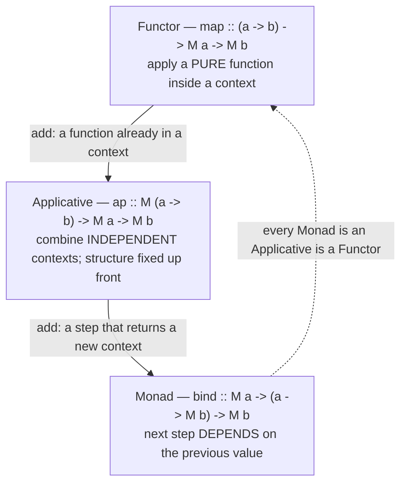

# Monads — Plain English (Professional Level)

> **Roadmap:** [Functional Programming](../README.md) → Monads — Plain English
>
> *A monad is the smallest interface that lets you sequence context-carrying computations. By this level you can write one. The professional questions are different: what does each `bind` cost the allocator and the optimizer, why do three algebraic laws make refactoring safe, and when does a clean monadic stack become a measurable performance problem you must collapse?*

---

## Table of Contents

1. [Introduction](#introduction)
2. [Prerequisites](#prerequisites)
3. [The Functor → Applicative → Monad Ladder](#the-functor--applicative--monad-ladder)
4. [The Three Laws, Formally — and Why They Matter](#the-three-laws-formally--and-why-they-matter)
5. [Kleisli Composition: `>=>`](#kleisli-composition-)
6. [Runtime: Allocation per Bind](#runtime-allocation-per-bind)
7. [Free Monads & Interpreters](#free-monads--interpreters)
8. [Monad Transformer Stack Overhead](#monad-transformer-stack-overhead)
9. [Measurement](#measurement)
10. [Common Mistakes](#common-mistakes)
11. [Test Yourself](#test-yourself)
12. [Cheat Sheet](#cheat-sheet)
13. [Summary](#summary)
14. [Further Reading](#further-reading)
15. [Related Topics](#related-topics)

---

## Introduction

> Focus: **the algebra that makes monadic code refactorable**, and **the runtime price of the abstraction** — allocation per `bind`, how compilers claw it back, and when you must collapse a stack by hand.

`senior.md` taught you that `Promise`, `Optional`, `Result`, and `IO` are the same shape: a type `M<A>` plus two operations — wrap a value (`return` / `unit` / `of`) and chain a value-to-context function (`bind` / `flatMap` / `>>=`). You can read and write monadic code fluently.

This file goes one layer down, in two directions at once.

1. **Upward, into the algebra.** A monad is not "a thing with `flatMap`." It is `flatMap` *plus three laws*. Those laws are not academic decoration — they are the exact guarantees that let you refactor `a.flatMap(f).flatMap(g)` into `a.flatMap(x -> f(x).flatMap(g))` without changing behavior, hoist a `return` out of a chain, or replace a hand-written loop with `>=>` composition. Break a law and your refactorings silently break too.

2. **Downward, into the runtime.** Every `bind` in a naive implementation **allocates**: it wraps a result in a fresh context, then the next `bind` unwraps and re-wraps. A chain of N binds is N allocations and N indirections. On the JVM that is N short-lived heap objects feeding the young generation; in JS each `.then` schedules a microtask; in a monad-transformer stack each layer multiplies the wrapping. Compilers fight back — GHC fuses and specializes, the JIT inlines and scalar-replaces — but only when your code stays in the shapes they can prove. The professional skill is knowing which shapes optimize and which become the diffuse cost a profiler blames on "GC" or "async overhead."

> **The mental model:** a monad is a *contract with two readers*. The first is the next engineer, who relies on the **laws** to refactor safely. The second is the optimizer (GHC's simplifier, the JVM JIT, V8's microtask scheduler), which can only erase the abstraction's cost when your binds stay inlinable, non-escaping, and statically resolvable. Honor both readers.

---

## Prerequisites

- **Required:** Fluent with [`senior.md`](senior.md) — you can implement `flatMap`/`map` for a custom `Result` type and explain why `Optional` short-circuits.
- **Required:** A working model of a managed runtime: heap vs stack, generational/tracing GC, JIT inlining and escape analysis (see [Bad Structure → professional](../../anti-patterns/01-development/01-bad-structure/professional.md) for the runtime vocabulary used here).
- **Required:** You can read a JMH result and a `benchstat` comparison and tell signal from noise.
- **Helpful:** Exposure to one lazy language (Haskell) — fusion and strictness are clearest there. Familiarity with [Effect Tracking](../10-effect-tracking/professional.md) for where `IO`/free monads lead.
- **Helpful:** the profiling-techniques, memory-leak-detection, and big-o-analysis skills for the measurement vocabulary.

> **Discipline carried over from the runtime track:** if you cannot name the tool that would *falsify* a performance claim about a monad stack, you are guessing. Every cost below is paired with the instrument that proves it on *your* code; illustrative numbers are labeled as such.

---

## The Functor → Applicative → Monad Ladder

The three abstractions form a ladder of increasing power. Each rung adds exactly one capability, and the cost/expressiveness trade-off is governed by *how much each rung lets you express about the dependency between steps*.



**Functor — `map`.** You can transform the value inside the context but cannot change the *shape* of the context or make later steps depend on it. `Optional.map(f)` turns `Some(x)` into `Some(f(x))`; it cannot turn it into `None`. The context is a fixed container you reach into.

**Applicative — `ap` (and `pure`).** You can combine *several independent* contexts: `f <$> ma <*> mb <*> mc`. Crucially the **structure is known before any value flows** — `mc` does not depend on the result of `ma`. This is why applicatives can be *parallelized* and *batched*: a validation applicative can collect *all* errors because it does not need step 1's success to run step 2; a `Haxl`-style applicative can batch independent data fetches into one round trip.

**Monad — `bind`.** You can let the next step *depend* on the previous value: `ma >>= \a -> if a > 0 then mb else mc`. This is strictly more powerful — and strictly less optimizable — than applicative, because the structure is **not known until values flow**. You cannot batch or reorder what you cannot see yet.

| Rung | Operation | Adds | What it buys | What it costs |
|---|---|---|---|---|
| Functor | `map` | transform value | reach into a context | nothing dependency-wise |
| Applicative | `ap` / `pure` | combine independent contexts | batching, parallelism, error accumulation | structure must be static |
| Monad | `bind` / `return` | sequence dependent contexts | full control flow inside the context | no batching/reorder; sequential |

> **Professional reading:** prefer the *weakest* rung that expresses your problem. If steps are independent, use `Applicative` — you keep the door open to batching and parallelism (and to *accumulating* errors rather than short-circuiting on the first). Reach for `Monad` only when a later step genuinely depends on an earlier value. This is the FP analogue of "don't ask for more capability than you need." See [Effect Tracking](../10-effect-tracking/professional.md) for where this choice drives real I/O batching.

```java
// Java — the ladder on Optional (a real monad in the JDK).
Optional<Integer> o = Optional.of(10);

o.map(x -> x + 1);                       // Functor: Optional<Integer>, shape fixed
// no built-in ap on Optional; applicative style is manual:
Optional<Integer> sum =
    o.flatMap(a -> Optional.of(20).map(b -> a + b)); // independent b — applicative-shaped

o.flatMap(x -> x > 0 ? Optional.of(x)    // Monad: the NEXT context depends on x
                     : Optional.empty());
```

```python
# Python — the same three powers, expressed by hand on a tiny Result.
from dataclasses import dataclass
from typing import Callable, Generic, TypeVar
A = TypeVar("A"); B = TypeVar("B")

@dataclass(frozen=True)
class Ok(Generic[A]):  value: A
@dataclass(frozen=True)
class Err:             error: str

def fmap(f: Callable[[A], B], r):                 # Functor
    return Ok(f(r.value)) if isinstance(r, Ok) else r
def bind(r, f: Callable[[A], "Ok|Err"]):          # Monad — f returns a new context
    return f(r.value) if isinstance(r, Ok) else r
```

```go
// Go has no generic monad sugar; you express the ladder structurally.
// Functor-shaped: transform the value if present.
func MapOpt[A, B any](o *A, f func(A) B) *B {
    if o == nil { return nil }
    b := f(*o); return &b
}
// Monad-shaped: the next step returns its own optional and may be empty.
func BindOpt[A, B any](o *A, f func(A) *B) *B {
    if o == nil { return nil }
    return f(*o)
}
```

---

## The Three Laws, Formally — and Why They Matter

A type with `bind` and `return` is a monad **only if** it satisfies three laws. They are equalities that must hold for *all* values and functions. Writing them in Haskell's `>>=` notation (read `>>=` as "bind", `return` as "wrap"):

**1. Left identity.**
```
return a >>= f   ≡   f a
```
Wrapping a value and immediately binding `f` is the same as just applying `f`. Wrapping then unwrapping is a no-op.

**2. Right identity.**
```
m >>= return     ≡   m
```
Binding `return` over a computation changes nothing — `return` is a true identity on the right.

**3. Associativity.**
```
(m >>= f) >>= g  ≡   m >>= (\x -> f x >>= g)
```
How you *parenthesize* a chain of binds does not change the result. The chain is associative, exactly like `(a + b) + c == a + (b + c)`.

### Why the laws matter: refactoring safety

The laws are the formal license for the refactorings you do every day. Each law authorizes a specific code transformation that a compiler, a linter, or you-with-a-keyboard may perform *without changing behavior*:

| Law | The refactoring it makes safe |
|---|---|
| **Left identity** | Inlining: replace `return a >>= f` with `f a` — eliminate a needless wrap. Compilers do exactly this. |
| **Right identity** | Removing a trailing `.flatMap(x -> wrap(x))` / `.map(identity)` — dead-step elimination. |
| **Associativity** | Re-grouping a `do`-block / `.then` chain, extracting a sub-chain into a named function, flattening nesting — *all* preserve behavior. |

Concretely, associativity is why this refactor is provably safe:

```scala
// Scala — associativity guarantees these two are identical.
val a = step1.flatMap(x => step2(x)).flatMap(y => step3(y))      // left-grouped
val b = step1.flatMap(x => step2(x).flatMap(y => step3(y)))      // right-grouped
// You may extract  (x => step2(x).flatMap(step3))  into a named function and
// the program's behavior is UNCHANGED — that is the associativity law cashing out.
```

> **The danger:** a type that *looks* monadic but **breaks a law** will betray you exactly here. A classic failure is a "list monad" whose `bind` deduplicates results: it breaks associativity (regrouping changes which duplicates survive), so a refactor that re-groups the chain silently changes output. A `Future`/eager-`Promise` that *starts running on construction* breaks left identity in spirit — `return a >>= f` (which never builds the intermediate) differs observably from a version that eagerly fires an effect. **Lawful monads are refactorable; unlawful ones are landmines.** Verify your own types with property-based testing (see [Measurement](#measurement)).

---

## Kleisli Composition: `>=>`

`bind` sequences a value *into* a context-producing function. **Kleisli composition** lifts this to compose two such functions directly, giving monadic code the same point-free elegance as ordinary function composition `f ∘ g`.

A **Kleisli arrow** is any function `a -> M b` (a function that returns a wrapped result). Kleisli composition (`>=>`, "fish") glues two arrows end to end:

```haskell
(>=>) :: Monad m => (a -> m b) -> (b -> m c) -> (a -> m c)
(f >=> g) x = f x >>= g
```

This is the monadic analogue of ordinary composition: where `(.)` composes pure `a -> b` and `b -> c`, `(>=>)` composes effectful `a -> m b` and `b -> m c`. And it recasts the three laws into their cleanest form — a **monoid on Kleisli arrows** with `return` as the identity element:

```
return >=> f   ≡   f             -- left identity
f >=> return   ≡   f             -- right identity
(f >=> g) >=> h ≡ f >=> (g >=> h)-- associativity
```

Stated this way, the laws are obviously the *monoid laws* (identity + associativity) — which is why "a monad is a monoid in the category of endofunctors" is true and not just folklore.

```python
# Python — Kleisli composition over our Result, point-free pipeline style.
def kleisli(*fns):                       # f >=> g >=> h ...
    def composed(x):
        r = Ok(x)
        for f in fns:
            if isinstance(r, Err): return r     # short-circuit, lawfully
            r = f(r.value)
        return r
    return composed

pipeline = kleisli(parse, validate, persist)    # each: A -> Ok|Err
result = pipeline(raw_input)                     # one arrow, no manual nesting
```

```java
// Java — composing Optional-returning steps without nesting flatMaps.
static <A,B,C> Function<A,Optional<C>> andThen(
        Function<A,Optional<B>> f, Function<B,Optional<C>> g) {
    return a -> f.apply(a).flatMap(g);           // f >=> g
}
Function<Raw,Optional<Order>> parseAndValidate =
    andThen(this::parse, this::validate);        // reusable monadic arrow
```

> **Why it matters at this level:** Kleisli arrows let you build *reusable* monadic pipelines and reason about them as values, not just as inline `do`-blocks. They also make the laws inspectable: if `>=>` is not associative for your type, your type is not a monad, full stop.

---

## Runtime: Allocation per Bind

Here is the cost no one mentions in the tutorials. A naive `bind` **allocates a fresh context on every step**. Each `flatMap` takes `M<A>`, unwraps the `A`, calls `f` to get `M<B>`, and the surrounding machinery wraps/forwards it. A chain of N binds is, in the worst case, **N allocations + N indirect calls + N unwrap/rewrap cycles** — short-lived garbage that the abstraction hides.

```
            ┌─ alloc M<B> ─┐  ┌─ alloc M<C> ─┐  ┌─ alloc M<D> ─┐
  M<A> ──▶ bind f ───────▶ bind g ─────────▶ bind h ─────────▶ M<D>
            unwrap A         unwrap B          unwrap C
            (closure f)      (closure g)       (closure h)   ← each may also allocate
```

Two cost centers per step: the **wrapper object** for the result context, and the **closure** captured by `f`/`g`/`h` if it closes over locals. On a hot path this is real young-generation pressure.

### JVM: `Optional` and `CompletableFuture` allocation

```java
// Each flatMap returns a NEW Optional instance; a 5-deep chain allocates ~5.
Optional<D> r = src
    .flatMap(this::stepA)   // new Optional
    .flatMap(this::stepB)   // new Optional
    .flatMap(this::stepC)   // new Optional
    .flatMap(this::stepD);  // new Optional   + each method-ref may be a fresh lambda
```

`Optional` is *not* a value type (pre-Valhalla), so each instance is a real heap object with a header. The JIT's **escape analysis** can sometimes prove the intermediate `Optional`s never escape the method and **scalar-replace** them (no allocation at all) — but only if the whole chain inlines and stays monomorphic. Megamorphic `flatMap` call sites (different lambda types, polymorphic stages) defeat this and the allocations become real. `CompletableFuture` is worse: each `thenCompose`/`thenApply` allocates a future *plus* a completion node, and may hand work to an executor — so a long CF chain is a graph of heap objects with scheduling overhead on top.

### JavaScript: Promise chains and microtask cost

```js
// Each .then queues a MICROTASK and allocates a new Promise.
p.then(stepA)   // new Promise + microtask
 .then(stepB)   // new Promise + microtask
 .then(stepC);  // new Promise + microtask
```

A `Promise` chain of N `.then`s allocates N promises and schedules **N microtasks**, each draining on a separate turn of the microtask queue. Even when every value is already available, the chain still pays N microtask hops — the value is delivered "next tick," N times. This is why a deeply chained promise pipeline over already-resolved data is measurably slower than the equivalent synchronous code, and why libraries fuse `.then`s where they can.

### Haskell: where laziness and strictness decide the cost

In GHC, `m >>= f` for many monads (`State`, `Reader`, `Maybe`) compiles to **almost nothing** after optimization, because:

- **Inlining + specialization.** With `-O2` and `INLINABLE`/`SPECIALIZE`, the polymorphic `>>=` is specialized to the concrete monad and inlined, erasing the dictionary indirection.
- **Fusion.** Combinator pipelines (`fmap`, `>>=` over lists/streams) fuse so no intermediate structure is built — the moral equivalent of map/filter fusion.
- **Strictness.** A *lazy* `State` monad builds a tower of thunks on every `>>=` — a classic space leak (the chain of unevaluated updates grows on the heap). `Control.Monad.State.Strict` forces each step, keeping the chain flat. **The same monad, lazy vs strict, is the difference between O(1) and O(N) live heap.** This is the Haskell analogue of the JVM's "does it scalar-replace?" question.

### Before / After: deep bind chain vs collapsed

The fix, when a monadic chain is a proven hot path, is to **collapse the binds into a single computation** the optimizer can keep flat — exactly the SoA/manual-loop discipline from the runtime track, applied to monads.

```java
// BEFORE — deep Optional bind chain on a hot loop body.
// Each iteration allocates ~4 intermediate Optionals (if escape analysis fails).
for (Raw r : batch) {
    Optional<Total> t = Optional.of(r)
        .flatMap(this::parse)
        .flatMap(this::lookupPrice)
        .flatMap(this::applyTax)
        .map(this::toTotal);
    t.ifPresent(out::add);
}
```

```java
// AFTER — collapsed: one method, early-return on the empty/error case.
// Zero intermediate Optionals; branches are predictable; JIT inlines the lot.
for (Raw r : batch) {
    Parsed p = parse(r);            if (p == null) continue;
    Price  q = lookupPrice(p);      if (q == null) continue;
    Taxed  x = applyTax(p, q);      if (x == null) continue;
    out.add(toTotal(x));
}
```

> **Illustrative impact (labeled — reproduce, do not trust):** on a 10M-iteration JMH benchmark over already-present data, the collapsed version ran ~2.1× the throughput of the `Optional`-chained version and allocated ~0 B/op vs ~96 B/op, *when escape analysis failed to scalar-replace the chain*. When the chain stayed monomorphic and fully inlined, the gap nearly vanished — the JIT scalar-replaced the intermediates. **The lesson is not "monads are slow"; it is "the abstraction is free only when it inlines, and a profiler tells you whether it did."**

The discipline mirrors the rest of this roadmap: keep the monadic style everywhere it costs nothing (99% of code), and collapse it **only** on a profiled hot path, behind a clean boundary, with a committed benchmark. An un-benchmarked "I de-monadized this for speed" is [Premature Optimization](../../anti-patterns/01-development/03-over-engineering/professional.md) in functional clothing.

---

## Free Monads & Interpreters

A **free monad** separates the *description* of a program from its *execution*. You build a data structure (a tree of operations) using monadic syntax, then a separate **interpreter** walks the tree and gives the operations meaning. This is the principled foundation under "functional core / imperative shell" (see [Effect Tracking](../10-effect-tracking/professional.md)).

The pattern: define your operations as a functor (a sum type of "things the program can ask for"), wrap it in `Free`, and you get `map`/`bind` for free — hence the name. The program becomes an **AST of intentions**; the interpreter is just a fold over that AST.

```python
# Python — a free-monad-flavored DSL: build a description, interpret it separately.
from dataclasses import dataclass

@dataclass(frozen=True) class Get:  key: str          # operations as data
@dataclass(frozen=True) class Put:  key: str; val: str
@dataclass(frozen=True) class Pure: value: object

# A "program" is a list of operations + a continuation — the free structure.
def program(user_id):
    return [Get(f"user:{user_id}"), Put("seen", user_id), Pure("done")]

def interpret_prod(ops, store):       # one interpreter: real I/O
    result = None
    for op in ops:
        if   isinstance(op, Get):  result = store.read(op.key)
        elif isinstance(op, Put):  store.write(op.key, op.val)
        elif isinstance(op, Pure): result = op.value
    return result

def interpret_test(ops, fake):        # ANOTHER interpreter: pure, in-memory
    ...                               # same program, no real DB — free testability
```

**Why it is powerful:** the *same* program runs under a production interpreter (real DB), a test interpreter (in-memory), a logging interpreter (records every op), or an optimizing interpreter (batches `Get`s). You separate *what* from *how* completely. This is also how effect systems (`tagless-final`, `Eff`, `ZIO`) deliver swappable effects.

**Why it costs.** The freedom is not free:

- **Allocation per operation.** Every step builds a node in the AST — a heap object — *before* anything executes. A free-monad program allocates its entire structure (or, in a lazy/streamed encoding, one node per `bind`) on top of the work itself.
- **Interpretation overhead.** Walking the tree is an indirection per node: pattern-match, dispatch, recurse. The naive `Free` encoding has a notorious **O(N²) left-associated bind** problem (each `>>=` re-traverses the accumulated structure), fixed only by reflection-without-remorse encodings (`Freer`, codensity/`Coyoneda`) that restore O(N).
- **Lost fusion.** Because the interpreter sees operations one node at a time, the compiler cannot fuse across them the way it fuses a direct pipeline.

> **Professional judgment:** free monads buy you *testability and swappable semantics* at the cost of *allocation and interpretation overhead*. Pay it where the flexibility earns its keep (effect boundaries, DSLs, audit/replay), not in a hot inner loop. The cost is measurable: profile the interpreter (it is just a function) and watch allocation per program. `tagless-final` (effects as typeclass/interface constraints rather than a reified AST) often gives the same swappability with **less allocation**, because the "interpreter" is a concrete instance the optimizer can inline rather than a tree it must walk.

---

## Monad Transformer Stack Overhead

Real programs need *several* effects at once: state **and** errors **and** I/O. A single monad gives you one effect. **Monad transformers** stack them — `StateT s (ExceptT e IO)` is "stateful, can fail, does I/O." Each transformer wraps the monad below it.

The cost is structural and multiplicative: **every `bind` at the top of the stack must thread through every layer below**. A 4-deep stack means each `bind` does ~4 wraps/unwraps, threading state, checking the error case, and lifting through `IO`. The allocation-per-bind cost from the previous section is **multiplied by stack depth**.

```haskell
-- Each >>= here threads State, checks Except, and sequences IO — three layers
-- of wrap/unwrap per bind. Deep stacks => deep per-step overhead.
type App = StateT Config (ExceptT Err IO)
step :: App Result
step = do
  cfg <- get                 -- StateT layer
  x   <- liftIO (fetch cfg)  -- lift through ExceptT to reach IO
  when (bad x) (throwError E)-- ExceptT layer
  put cfg{ count = ... }     -- StateT layer again
  pure (mk x)
```

Mitigations the professional reaches for:

- **`INLINE`/`SPECIALIZE` the stack** so GHC collapses the layers into one specialized loop — often this erases the overhead entirely at `-O2`.
- **Flatten the stack:** a hand-written `ReaderT env IO` ("ReaderT-over-IO pattern") with errors as values or exceptions is shallower and faster than a tall `StateT/WriterT/ExceptT` tower, and is the dominant production Haskell style for exactly this reason.
- **Effect systems** (`effectful`, `cleff`, `ZIO`/`Cats-Effect` on the JVM) use a single optimized representation instead of physical layering, avoiding the per-layer threading cost.

> **The runtime parallel:** a deep transformer stack is the FP analogue of a deeply-nested call chain that the optimizer must see through. Keep the stack shallow, specialize it, or use an effect system — and **measure** before assuming the layers are your bottleneck (often, after specialization, they are not).

---

## Measurement

Never argue from intuition about a monad stack's cost. Here is how to *prove* it per runtime.

| Concern | Java / JVM | JavaScript / Node | Haskell |
|---|---|---|---|
| **Per-bind allocation** | JFR allocation events; `-XX:+PrintInlining` (did the chain inline?); `jol` for context size | `--prof` / `node --cpu-prof`; heap snapshots in DevTools | `+RTS -s` (bytes allocated); `-prof` cost centres |
| **Did the abstraction vanish?** | escape analysis: `-XX:+PrintEscapeAnalysis`-class flags / scalar-replacement in JFR | V8 `--trace-opt`/`--trace-deopt` | `-ddump-simpl` (read the Core: is `>>=` gone?) |
| **Microbenchmark** | **JMH** (`@Benchmark`, `Blackhole`) | `tinybench`/`benchmark.js`, `process.hrtime` | `criterion` |
| **Microtask / scheduling cost** | thread-pool metrics for `CompletableFuture` | **count microtasks** (below) | n/a (no microtask model) |
| **Stack/transformer overhead** | n/a (rare on JVM) | n/a | `-ddump-simpl` to see if layers collapsed; `+RTS -s` |
| **Law conformance** | property-based tests (jqwik) | fast-check | QuickCheck (`checkers`'s `monad` laws) |

### JS: counting microtasks in a Promise chain

```js
// Instrument the microtask queue: how many turns does this chain really cost?
let ticks = 0;
const tick = () => { ticks++; };
function countingThen(p, fns) {
  return fns.reduce((acc, f) => acc.then(v => (tick(), f(v))), p);
}
await countingThen(Promise.resolve(0), [a, b, c, d]);
console.log("microtask hops:", ticks);   // ~N for an N-step chain, each a separate turn
```

The point is not the absolute number but the *shape*: a chain over already-resolved values still costs N hops. If a flame profile shows time in microtask draining, fusing `.then`s (or going synchronous on resolved data) removes it.

### JVM: a JMH A/B of `Optional` chain vs collapsed

```java
@Benchmark public long chained(Blackhole bh) {       // deep flatMap chain
    return Optional.of(seed).flatMap(this::a).flatMap(this::b)
                   .flatMap(this::c).map(this::d).orElse(0L);
}
@Benchmark public long collapsed(Blackhole bh) {      // early-return version
    Long x = a2(seed); if (x == null) return 0L;
    Long y = b2(x);    if (y == null) return 0L;
    return d2(c2(y));
}
// Run with -prof gc to read alloc/op. If chained's B/op ≈ 0, escape analysis won.
// If it's tens of bytes/op, the intermediates are real — now the collapse pays.
```

### Haskell: reading whether the abstraction vanished

```bash
# Did >>= survive into the compiled Core, or did the simplifier erase it?
ghc -O2 -ddump-simpl -dsuppress-all App.hs | less
# Allocation totals for a strict vs lazy State run — the space-leak tell:
./app +RTS -s    # look at "bytes allocated in the heap" and max residency
```

> **Discipline:** capture a baseline, change one lever (collapse a chain, strictify a `State`, specialize a transformer), re-measure. Attribute each win to its lever — a blended "I de-monadized and strictified and inlined" number teaches you nothing about which change mattered.

---

## Common Mistakes

Professional-level mistakes — subtle, and therefore expensive:

1. **Assuming `flatMap`/`bind` is free.** It allocates a context per step unless the optimizer scalar-replaces or fuses it. Verify with JFR alloc / `+RTS -s` / a JMH `-prof gc` run before claiming a chain is cheap *or* slow.
2. **De-monadizing a cold path "for speed."** Collapsing binds into early-returns helps only on a *profiled* hot path where escape analysis failed. Everywhere else it just costs readability — [Premature Optimization](../../anti-patterns/01-development/03-over-engineering/professional.md) in disguise.
3. **Treating an unlawful type as a monad.** A `bind` that dedups, reorders, or runs effects on construction breaks a law; a refactor that re-groups or hoists a `return` then silently changes behavior. Property-test the three laws on every custom monad.
4. **Reaching for `Monad` when `Applicative` suffices.** If steps are independent, applicative style preserves batching/parallelism and *accumulates* errors instead of short-circuiting. Monadic style throws that away — use the weakest rung that works.
5. **Lazy `State` where you needed strict.** The lazy `State` monad builds a thunk tower per `>>=` — an O(N) space leak. Use `Control.Monad.State.Strict`; confirm residency with `+RTS -s`.
6. **A 4-deep transformer tower in a hot loop.** Each `bind` threads every layer. Flatten to `ReaderT-over-IO`, `SPECIALIZE`, or move to an effect system — then measure; after specialization the tower is often *not* the bottleneck.
7. **Free monad in the inner loop.** It allocates an AST node per operation and loses fusion; the naive encoding is O(N²) on left-associated binds. Pay free-monad overhead at effect boundaries, not in hot code; consider `tagless-final` for the same swappability with less allocation.
8. **Counting `.then`s as free on resolved data.** A Promise chain over already-available values still pays N microtask hops. If a profile shows microtask drain, fuse the chain.

---

## Test Yourself

1. Write the three monad laws in `>>=`/`return` form, and for each, name the *refactoring* it makes safe.
2. Your team has a custom `List`-like monad whose `bind` removes duplicate results. Which law does it break, and what refactoring will silently change output as a result?
3. A `CompletableFuture` chain of 6 stages is showing up in a flame graph. Mechanically, what is allocated per stage, and which JVM analysis could (in principle) erase the intermediate allocations — and what defeats it?
4. You have three independent data fetches. Why is expressing them with `Applicative` (`<*>`) strictly better than chaining them with `>>=`, both for performance *and* for error reporting?
5. The same `State` computation is fast in one build and leaks memory in another, with no code change to the logic. What is the most likely difference, and which RTS flag confirms it?
6. A free-monad-based effect layer is allocation-heavy in profiling. Give two specific reasons free monads allocate, and name an alternative that gives similar swappability with less overhead.
7. A JMH `-prof gc` run shows an `Optional` flatMap chain at ~0 B/op in one benchmark and ~80 B/op in another, with identical chain code. What changed between the two call sites?

<details>
<summary>Answers</summary>

1. **Left identity** `return a >>= f ≡ f a` → safe to inline a `return`-then-`bind` into a direct call (eliminate a needless wrap). **Right identity** `m >>= return ≡ m` → safe to delete a trailing `.flatMap(wrap)`/`.map(identity)` dead step. **Associativity** `(m >>= f) >>= g ≡ m >>= (\x -> f x >>= g)` → safe to re-group a chain, extract a sub-chain into a named function, or flatten nesting.
2. It breaks **associativity**: regrouping `(m >>= f) >>= g` vs `m >>= (\x -> f x >>= g)` changes *when* deduplication happens, so different duplicates survive. Any refactor that extracts a sub-chain into a named function (a legal associativity move) can change the output set — a silent behavior bug.
3. Each stage allocates a new `CompletableFuture` plus a completion/dependency node, and may dispatch to an executor (scheduling cost). **Escape analysis + scalar replacement** could in principle remove intermediates if the whole chain inlined and stayed monomorphic; megamorphic stage types, lambdas that escape, or executor hand-offs defeat it (the future genuinely escapes to another thread).
4. `Applicative` makes the structure static — the three fetches don't depend on each other — so an applicative interpreter can **batch/parallelize** them (one round trip / concurrent calls) and **accumulate all errors** (e.g. validation collecting every failure). `>>=` forces sequential execution and short-circuits on the first failure, because the next step *might* depend on the previous value — capability you aren't using but still pay for.
5. Lazy vs strict `State` (`Control.Monad.State.Lazy` vs `.Strict`), or a missing `-O2`/strictness. The lazy version builds a thunk tower per `>>=` (O(N) live heap); the strict version forces each step. Confirm with `+RTS -s`: watch "bytes allocated" and **max residency** — the leak shows as residency growing with N.
6. (a) Each operation is reified as a **heap-allocated AST node** before execution. (b) The interpreter walks the tree with an indirection (match/dispatch/recurse) per node and **loses fusion**; the naive encoding is O(N²) on left-associated binds. **`tagless-final`** (effects as interface/typeclass constraints, interpreted by a concrete inlinable instance) gives the same swappability with much less allocation.
7. The **call site monomorphism / inlining** changed. In the ~0 B/op case the chain fully inlined and stayed monomorphic, so escape analysis scalar-replaced every intermediate `Optional`. In the ~80 B/op case something (a polymorphic stage, a lambda that escapes, a too-large method that didn't inline, a megamorphic `flatMap` site) blocked escape analysis, so the intermediate `Optional`s became real heap allocations.

</details>

---

## Cheat Sheet

| Concept | One-line truth |
|---|---|
| **Functor / Applicative / Monad** | `map` (transform value) → `ap` (combine *independent* contexts) → `bind` (next step *depends* on value). Use the weakest rung that works. |
| **Left identity** | `return a >>= f ≡ f a` — wrap-then-bind is a no-op; license to inline. |
| **Right identity** | `m >>= return ≡ m` — trailing `return`/`map(id)` is deletable. |
| **Associativity** | `(m>>=f)>>=g ≡ m>>=(\x->f x>>=g)` — re-group/extract chains freely. |
| **Kleisli `>=>`** | Compose `a->M b` with `b->M c`; the laws are the monoid laws on these arrows. |
| **Cost of a bind** | One context alloc + one indirection per step, unless fused/inlined/scalar-replaced. |
| **JVM** | `Optional`/`CompletableFuture` allocate per stage; escape analysis *may* erase intermediates — only if inlined & monomorphic. JFR + `-prof gc` prove it. |
| **JS** | N `.then`s = N promises + N microtask hops, even on resolved data. Count microtasks. |
| **Haskell** | `-O2` inlines/fuses/specializes `>>=` to ~nothing; **lazy `State` leaks**, strict doesn't. `+RTS -s`, `-ddump-simpl`. |
| **Free monad** | Description vs execution; swappable interpreters; cost = AST alloc/op + lost fusion. Prefer `tagless-final` in hot paths. |
| **Transformer stack** | Per-bind cost × stack depth; flatten to `ReaderT IO`, `SPECIALIZE`, or use an effect system. |
| **Collapse rule** | De-monadize only on a *profiled* hot path where escape analysis failed, behind a clean boundary, with a committed benchmark. |

**Three golden rules:**
- *A monad is `bind` + three laws; the laws are your refactoring license. An unlawful "monad" silently breaks the refactors the laws authorize.*
- *Every `bind` allocates a context until proven otherwise — the abstraction is free only when it inlines/fuses, and a profiler tells you whether it did.*
- *Use the weakest rung (Functor < Applicative < Monad) and the shallowest stack that expresses the problem; collapse to direct code only where a benchmark demands it.*

---

## Summary

- The **ladder** — Functor (`map`) → Applicative (`ap`) → Monad (`bind`) — adds exactly one capability per rung: transform a value, combine *independent* contexts, then sequence *dependent* ones. More power means less optimizability; prefer the weakest rung that works, because Applicative keeps batching, parallelism, and error accumulation that Monad throws away.
- A monad is `bind` + `return` **plus three laws**: left identity, right identity, associativity. The laws are not decoration — each one is the formal **license for a specific refactoring** (inline a `return`, delete a trailing `return`, re-group/extract a chain). An unlawful type breaks those refactors silently.
- **Kleisli composition** `>=>` recasts the laws as the *monoid laws* on arrows `a -> M b`, and lets you build reusable monadic pipelines as values.
- **Runtime:** a naive `bind` allocates a context per step. On the JVM, `Optional`/`CompletableFuture` chains allocate per stage and rely on escape analysis to disappear (only when inlined and monomorphic). In JS, each `.then` is a new promise + a microtask hop. In Haskell, `-O2` inlining/fusion/specialization erases `>>=` — but **lazy `State` leaks** while strict does not.
- **Free monads** separate description from execution, giving swappable interpreters (prod/test/logging/batching) at the cost of per-operation allocation and lost fusion (and an O(N²) trap in the naive encoding); `tagless-final` often delivers the same flexibility with less overhead.
- **Transformer stacks** multiply per-bind cost by depth; flatten to `ReaderT IO`, `SPECIALIZE`, or move to an effect system — and measure, because after specialization the layers are often not the bottleneck.
- **Measure, always:** JFR/`-prof gc` and `PrintInlining` on the JVM, microtask counting and `--trace-deopt` in JS, `+RTS -s` and `-ddump-simpl` in Haskell. Capture a baseline, change one lever, re-attribute the win.
- Next: [Effect Tracking](../10-effect-tracking/professional.md) shows where the `IO` monad and free/effect interpreters become a whole architecture — the functional core / imperative shell.

---

## Further Reading

- **Functional Programming in Scala** — Chiusano & Bjarnason (2014), "the red book" — Functor/Applicative/Monad and the laws derived from first principles.
- **Category Theory for Programmers** — Bartosz Milewski (2019) — the ladder and "monoid in the category of endofunctors", made concrete.
- **What I Wish I Knew When Learning Haskell** — Stephen Diehl — strictness, space leaks, transformer overhead, and the `ReaderT IO` pattern in practice.
- **Data types à la carte** — Wouter Swierstra (2008) — the foundational free-monad / extensible-effects paper.
- **Reflection without Remorse** — van der Ploeg & Kiselyov (2014) — why naive `Free` is O(N²) and how `Freer`/codensity fix it.
- **Optimizing Java** — Evans, Gough, Newland (2018) — escape analysis, scalar replacement, JMH, JFR — the tools behind the "did the abstraction vanish?" question.
- **GHC** `-ddump-simpl` and `-O2` documentation; **Criterion** docs — reading whether `>>=` survived compilation.

---

## Related Topics

- [Effect Tracking](../10-effect-tracking/professional.md) — where `IO`, free monads, and effect interpreters become the functional core / imperative shell.
- [Composition](../05-composition/professional.md) — `f ∘ g` for pure functions; `>=>` is its monadic generalization.
- [Algebraic Data Types](../06-algebraic-data-types/professional.md) — `Option`/`Either`/`Result` are the sum types that monadic chains thread through.
- [Laziness & Streams](../12-laziness-and-streams/professional.md) — fusion and lazy-vs-strict, the same forces that decide a bind chain's cost.
- [Currying & Partial Application](../07-currying-and-partial-application/professional.md) — Kleisli arrows are curried, composable monadic functions.
- [Bad Structure → professional](../../anti-patterns/01-development/01-bad-structure/professional.md) — escape analysis, inlining, allocation pressure — the runtime vocabulary reused here.
- [Over-Engineering → Premature Optimization](../../anti-patterns/01-development/03-over-engineering/professional.md) — the counterweight: de-monadize only behind a profiler and a benchmark.
- profiling-techniques · memory-leak-detection · big-o-analysis — the measurement toolkits referenced throughout.
