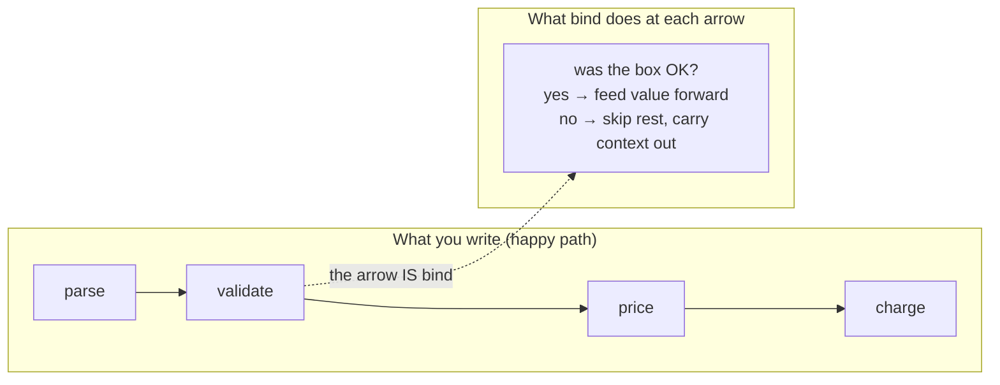
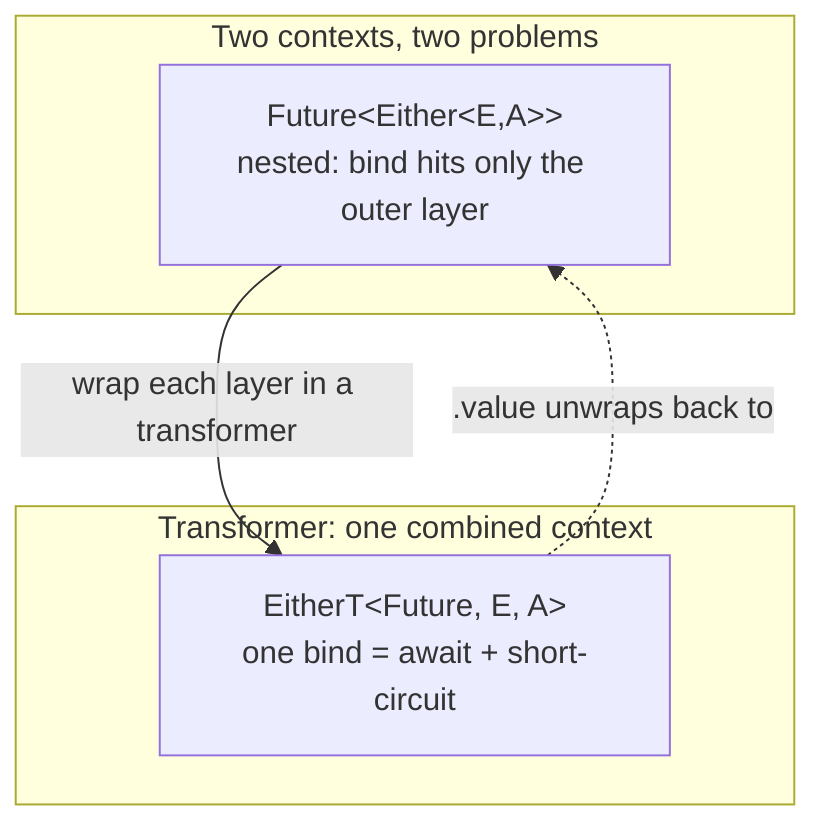
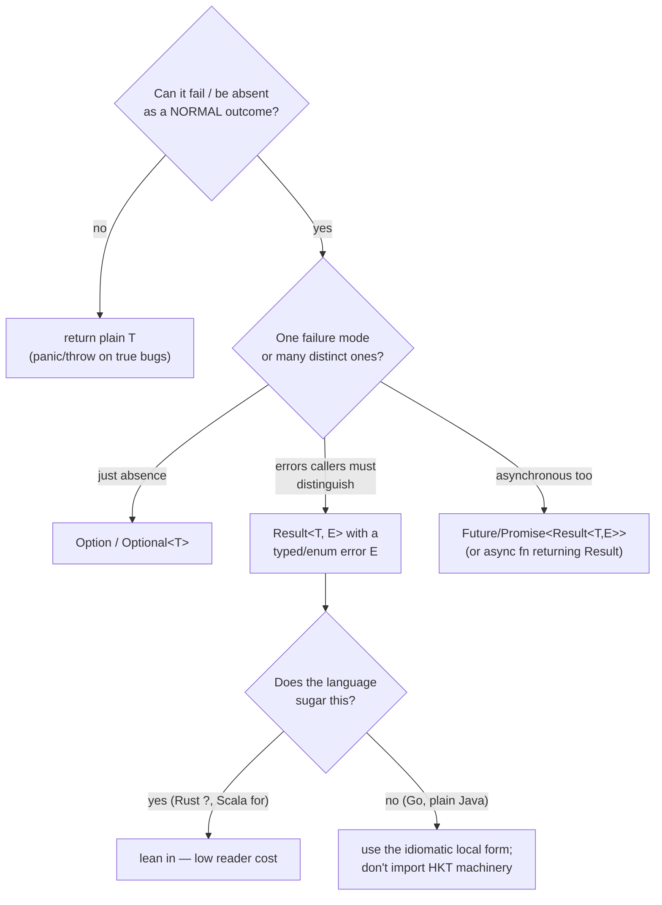

# Monads — Plain English (Senior Level)

> **Roadmap:** [Functional Programming](../README.md) → Monads — Plain English
>
> **Essence:** A monad is the design abstraction for *sequencing computations that carry context* — failure, absence, asynchrony, state, logging — so that the context plumbing is written once and the business logic reads like plain sequential code. At the senior level the question is never "what is a monad?" but "**does treating this as a monad lower the cost of change, or am I importing category theory to impress my reviewers?**"

---

## Table of Contents

1. [Introduction](#introduction)
2. [The Monad as a "Programmable Semicolon"](#the-monad-as-a-programmable-semicolon)
3. [Language Reality: Who Has Monads and What They Call Them](#language-reality-who-has-monads-and-what-they-call-them)
4. [Monad Transformers — The Stacking Problem (Intro)](#monad-transformers--the-stacking-problem-intro)
5. [When Monadic Abstraction Pays Off vs When It's Cargo-Cult](#when-monadic-abstraction-pays-off-vs-when-its-cargo-cult)
6. [Designing APIs That Return Monadic Types](#designing-apis-that-return-monadic-types)
7. [Common Mistakes](#common-mistakes)
8. [Test Yourself](#test-yourself)
9. [Cheat Sheet](#cheat-sheet)
10. [Summary](#summary)
11. [Further Reading](#further-reading)
12. [Related Topics](#related-topics)

---

## Introduction

> Focus: **design and architecture implications.** Not "what is a monad" (that's [`junior.md`](junior.md)) and not "how do I implement `flatMap`" (that's [`middle.md`](middle.md)) — but *when, in a real codebase that ships, treating something as a monad is the right architectural call, and when it is over-abstraction you'll regret.*

Most working engineers use monads every day without naming them. If you have written `promise.then(...)`, `optional.flatMap(...)`, `result?`, or a Scala `for`-comprehension, you have sequenced monadic computations. The pattern keeps reappearing because it solves one recurring design problem: **you have a series of steps, each of which might "go sideways" (return nothing, fail, suspend, mutate a context), and you want to write the *happy path* as a straight line while the "going sideways" is handled uniformly and automatically.**

The senior insight is that "monad" is not a feature you add — it's a *shape* you recognize. The shape is: a generic type `M<A>` (a box with a context), plus two operations — a way to *put a plain value in the box* (`of` / `pure` / `return` / `unit`), and a way to *chain a context-producing function onto a boxed value* (`flatMap` / `bind` / `>>=` / `then`). When your domain has that shape, a large amount of glue code can be written once and shared, instead of hand-rolled per call site as nested `if`s, null checks, try/catch ladders, and callback pyramids.

The design payoff and the design trap are the same mechanism: monads **hide the wiring between steps**. Hidden wiring is leverage when the wiring is incidental (short-circuiting on the first error, threading a context). Hidden wiring is a liability when the wiring is the thing your reader actually needs to see, or when your team can't read the abstraction. A senior's job is to tell those apart.

> **The frame for this whole file:** a monad is a *control-flow abstraction*, like a loop or a `try`. You adopt it for the same reason you'd extract a helper — to stop repeating glue and to make illegal sequences hard to write — and you reject it for the same reason you'd reject any abstraction: when it costs more in comprehension than it saves in duplication.

---

## The Monad as a "Programmable Semicolon"

In imperative code, the semicolon is the sequencing operator. `a(); b();` means "do `a`, then do `b`." The semicolon is *fixed*: it always means "ignore whatever `a` produced and just run `b` next." That's fine until "do `a`, then `b`" needs a rule — *only run `b` if `a` succeeded*, or *run `b` with the value `a` produced*, or *await `a` before `b`*.

A monad is a **programmable semicolon**: it lets you define what "then" means for a particular kind of computation, and then write your steps as if the special behavior were the default.

Consider the universal example — a chain of steps where any step can fail. Without a monad, the sequencing rule ("stop at the first failure") is hand-coded at every junction:

```go
// Go — the rule "stop at the first error" is repeated at every step.
// This is what a monad would otherwise factor out. Go deliberately keeps
// it explicit (see Language Reality); the repetition is the cost it accepts.
func process(raw string) (Receipt, error) {
    parsed, err := parse(raw)
    if err != nil {
        return Receipt{}, err
    }
    validated, err := validate(parsed)
    if err != nil {
        return Receipt{}, err
    }
    priced, err := price(validated)
    if err != nil {
        return Receipt{}, err
    }
    return charge(priced)
}
```

The `if err != nil { return }` block is the *manual* implementation of a monadic semicolon for the "error" context. Every step says the same thing: "if the previous step failed, short-circuit; otherwise continue with its value." A monad captures exactly that rule once:

```python
# Python — a Result monad. `bind` IS the programmable semicolon: it encodes
# "if Err, short-circuit; if Ok, feed the value to the next step."
from dataclasses import dataclass
from typing import Callable, Generic, TypeVar

T = TypeVar("T"); U = TypeVar("U")

@dataclass(frozen=True)
class Ok(Generic[T]):    value: T
@dataclass(frozen=True)
class Err:               error: str

Result = Ok[T] | Err

def bind(r: Result, f: Callable[[T], Result]) -> Result:
    return f(r.value) if isinstance(r, Ok) else r   # the semicolon's rule, once

# The happy path now reads as a straight line; the "stop on first error"
# wiring is invisible because `bind` owns it.
def process(raw: str) -> Result:
    return bind(bind(bind(parse(raw), validate), price), charge)
```

`bind` (a.k.a. `flatMap`, `>>=`, `then`) is the whole game. It says: *given a boxed value and a function that takes a plain value and returns a boxed value, splice them together according to this context's rule.* For `Result`, the rule is short-circuit-on-error. For `Optional`, it's short-circuit-on-absence. For `List`, it's run-the-rest-for-every-element (the cartesian product / non-determinism). For `Future`/`Promise`, it's await-then-continue. For `State`, it's thread-the-state-through. **Same shape, different "then."**



Languages with *do-notation* (Haskell) or *for-comprehensions* (Scala) give this a syntax so the chain looks fully imperative while still being monadic underneath — that syntactic sugar is the clearest possible illustration of "programmable semicolon," because the code literally looks like `;`-separated statements:

```haskell
-- Haskell — do-notation. Each line is sequenced by the Either monad's bind.
-- `<-` is "run this step, and if it didn't fail, bind its result to the name."
-- There is no visible error handling; Either's bind short-circuits for you.
process :: String -> Either Error Receipt
process raw = do
  parsed    <- parse raw       -- if Left, the whole do-block is that Left
  validated <- validate parsed
  priced    <- price validated
  charge priced
```

```scala
// Scala — the same chain as a for-comprehension. Desugars to flatMap/map.
// Works identically for Option, Either, Future, Try, List — the monad
// supplies the "then," the for-comprehension supplies the readable syntax.
def process(raw: String): Either[Error, Receipt] =
  for {
    parsed    <- parse(raw)
    validated <- validate(parsed)
    priced    <- price(validated)
    receipt   <- charge(priced)
  } yield receipt
```

The architectural significance: **the sequencing rule is now a property of the type, not of the call site.** Change `Either` to `Future[Either[...]]` and the *shape* of the code barely changes, but every step is now also asynchronous. That uniformity — "I write steps; the type decides how they connect" — is the entire value proposition, and the entire risk.

### Why the monad laws matter to a designer (briefly)

The middle level proves the three monad laws (left identity, right identity, associativity) mechanically. The *senior* relevance is what they guarantee for your architecture: **the laws are what let you refactor a monadic pipeline without thinking.** Associativity (`(m.flatMap(f)).flatMap(g)` equals `m.flatMap(x => f(x).flatMap(g))`) is precisely the property that lets you **extract a sub-sequence of steps into a named helper and inline it back** with zero behavioral change — the bread-and-butter refactor of pipelines. Identity laws are why `of(x).flatMap(f)` is just `f(x)`, so wrapping-then-immediately-binding is a no-op you can delete.

When a type *almost* satisfies the laws but not quite — JS `Promise` is the famous case, because it auto-flattens nested promises and runs eagerly — those refactors stop being safe in edge cases, and you get the subtle "it worked until I extracted that helper" bugs. **A lawful monad is a refactoring guarantee; a law-bending one is a footgun you keep in a drawer.** That's the practical reason FP-in-JS libraries ship a lawful, lazy `Task`/`IO` alongside `Promise`.

---

## Language Reality: Who Has Monads and What They Call Them

No mainstream language markets "monads." They ship *specific* monads with bespoke method names and rarely a way to abstract over "monad-ness" generically. Knowing the local dialect is most of the senior skill, because it tells you what you actually have to work with.

| Language | Monadic types you already use | The `bind`/`then` operator | Generic over all monads? | Sugar |
|---|---|---|---|---|
| **Haskell** | `Maybe`, `Either`, `IO`, `[]`, `State`, `Reader`, `Writer`, … | `>>=` | Yes (`Monad` typeclass) | `do` notation |
| **Scala** | `Option`, `Either`, `Try`, `Future`, `List`, Cats `IO` | `flatMap` | Partially (Cats `Monad[F]`) | `for`-comprehension |
| **Rust** | `Option`, `Result`, iterators, `Future` | `and_then` / `?` | No (no HKT) | `?` operator, `async/await` |
| **Java** | `Optional`, `Stream`, `CompletableFuture` | `flatMap` / `thenCompose` | No | none (no comprehension) |
| **JavaScript/TS** | `Promise`, arrays | `.then` / `flatMap` | No | `async/await` |
| **Python** | (none built-in; `asyncio` futures, generators) | — | No | `await`, generators |
| **Go** | (deliberately none) | — | No | none — explicit `if err != nil` |

A few of these are worth dwelling on because their design choices teach the trade-off.

**Rust's `?` is Result-monad sugar — and a model of restraint.** `let x = step()?;` means "if `step()` returned `Err`, return that `Err` from the enclosing function; otherwise bind the `Ok` value to `x`." That is *exactly* `Either`'s bind, expressed as a postfix operator. Rust gives you the ergonomic payoff of do-notation for the two monads that matter most in systems code (`Result`, `Option`) without committing to higher-kinded types or asking every engineer to learn the word "monad." It's the most successful mainstream "monad" precisely because it's invisible.

```rust
// Rust — `?` is the Either/Result monad's bind, postfix. Each `?` short-circuits.
fn process(raw: &str) -> Result<Receipt, Error> {
    let parsed    = parse(raw)?;        // on Err: return early with that Err
    let validated = validate(parsed)?;
    let priced    = price(validated)?;
    charge(priced)                       // already Result<Receipt, Error>
}
```

**Java has the monads but not the abstraction.** `Optional.flatMap`, `Stream.flatMap`, and `CompletableFuture.thenCompose` are each a monadic bind, but Java has no way to write code generic over "any monad `M`" (no higher-kinded types), and no comprehension syntax. So Java monads are useful *individually* but don't compose into the unified style Scala/Haskell enjoy. The practical consequence: `Optional` chains and `CompletableFuture` chains are great; trying to build a general "effect framework" out of them in plain Java fights the language.

```java
// Java — three different monads, three different method names, no shared syntax.
Optional<Address> shippingCity =
    findUser(id)                       // Optional<User>
        .flatMap(User::primaryOrder)   // Optional<Order>
        .flatMap(Order::shipTo)        // Optional<Address>
        .filter(Address::isDomestic);  // still Optional<Address>

CompletableFuture<Receipt> receipt =
    fetchCart(id)                      // CF<Cart>
        .thenCompose(this::price)      // CF<Priced>   (thenCompose == flatMap)
        .thenCompose(this::charge);    // CF<Receipt>
```

**JavaScript's `Promise` is a *not-quite* monad — and the deviation bit people.** `then` flattens nested promises (`Promise<Promise<A>>` collapses to `Promise<A>`), which is monad-ish, but `Promise` also runs eagerly on creation and `then` doubles as `map`, so it violates the monad laws in edge cases (you can't have a `Promise<Promise<A>>` as a genuine value). `async/await` is then-sugar, the JS analogue of do-notation. It works beautifully in practice and is a great example of *getting the ergonomics without the theory* — but the law-bending is why "is `Promise` a monad?" is a perennial flame war and why some FP-in-JS libraries ship a separate `Task`/`IO` type that *is* lawful and lazy.

**Go deliberately refuses.** Go's designers chose explicit `if err != nil` over a `Result` monad as a *readability and simplicity* decision: every error decision is visible at the call site, there's no hidden control flow, and there's no need for generics-over-effects (which Go lacked entirely until 1.18 and still can't express HKTs). This is a legitimate, defensible architectural stance — "no programmable semicolon; the semicolon stays dumb and the error handling stays loud." When you write Go you are working in a language that has *rejected* this abstraction on purpose, and fighting it with a home-grown `Result[T]` type usually produces worse Go than idiomatic explicit returns. (Go 1.18 generics let you *write* `Result[T]`, but the lack of `?`-style sugar and the cultural norm both push against it.)

> **The senior reading of this table:** the abstraction's value is bounded by the language's support for it. In Haskell/Scala, monads are a first-class architectural tool you build frameworks on. In Rust, they're a brilliantly disguised local convenience. In Java/JS, they're useful per-type but don't generalize. In Go/Python, the idiomatic answer is usually *not* to monad-ify. Match your design to the language's grain, not to a blog post about Haskell.

---

## Monad Transformers — The Stacking Problem (Intro)

The clean story above breaks the moment you need *two* contexts at once. Real steps are often *both* asynchronous *and* fallible: a database call returns "a future that, when it completes, yields either a row or an error." In types, that's `Future<Either<Error, Row>>` — a monad *inside* a monad.

The problem: **monads don't compose automatically.** Given a `Future` monad and an `Either` monad, there is no free, generic way to get a combined "Future-of-Either" monad whose `flatMap` does the right thing (await the future, *then* short-circuit on the error). Each step in a `for`-comprehension over `Future[Either[E, A]]` binds at the `Future` layer, so you get back a *nested* `Future[Either[...]]` and the `Either` short-circuiting doesn't happen — you end up unwrapping the inner `Either` by hand on every line, which is exactly the boilerplate the monad was supposed to delete.

```scala
// Scala — the pain. We want to chain steps that are BOTH async AND fallible.
// A naive for-comprehension over Future[Either[E,A]] binds only the Future;
// the Either has to be pattern-matched by hand, defeating the point.
def naive(id: Id): Future[Either[Err, Receipt]] =
  fetchUser(id).flatMap {            // fetchUser: Future[Either[Err, User]]
    case Left(e)  => Future.successful(Left(e))     // manual short-circuit (ugh)
    case Right(u) => price(u).flatMap {             // price: Future[Either[Err, Priced]]
      case Left(e)  => Future.successful(Left(e))   // ...repeated at EVERY step
      case Right(p) => charge(p)
    }
  }
```

A **monad transformer** is a type that *bakes one monad into another* and provides the combined `flatMap`. `EitherT[Future, Err, A]` is "an `Either` transformer stacked on `Future`" — a single type whose bind both awaits the future *and* short-circuits on the error, so the comprehension reads clean again:

```scala
// Scala + Cats — EitherT stacks Either onto Future. One flatMap now does
// "await, then short-circuit on Left." The hand-written matching is gone.
import cats.data.EitherT
import cats.implicits._

def clean(id: Id): EitherT[Future, Err, Receipt] =
  for {
    user   <- EitherT(fetchUser(id))   // lift Future[Either[..]] into the transformer
    priced <- EitherT(price(user))
    rcpt   <- EitherT(charge(priced))
  } yield rcpt
// .value gets you back the underlying Future[Either[Err, Receipt]]
```



**Why transformers are the canonical example of monads' real-world pain.** The theory is elegant; the practice is heavy:

- **Stacking is order-sensitive and grows.** `ReaderT[StateT[EitherT[IO, E, *], S, *], R, A]` is a real shape (config + state + error + effects). Reading the type is a job in itself, and the *order* of the stack changes the semantics (does state survive an error, or roll back?).
- **`lift` everywhere.** To use an operation from an inner layer, you must `lift` it through the outer layers. This pollutes call sites with mechanical lifting that has nothing to do with the domain.
- **Performance.** Each transformer layer adds allocation and indirection; deep stacks are measurably slower, which is why modern Scala/Haskell increasingly favor a single effect monad with built-in error/state channels (Cats Effect `IO`, ZIO's `ZIO[R, E, A]`, Haskell's effect-system libraries) *instead of* hand-stacked transformers. (See [`../10-effect-tracking/senior.md`](../10-effect-tracking/senior.md) for where that road leads.)

> **The senior takeaway on transformers:** they are the point where "everything is a monad" stops being free. The moment you need to combine effects, you pay in type complexity, `lift` noise, and performance — and you need a team that can read `EitherT[Future, E, A]` at a glance. In a mainstream OO codebase, reaching for monad transformers is almost always a signal you've over-committed to the abstraction; in a Scala/Haskell shop with the requisite fluency, it's a normal tool, increasingly superseded by unified effect types.

---

## When Monadic Abstraction Pays Off vs When It's Cargo-Cult

This is the senior decision. The abstraction is not good or bad in the abstract — it's good *for some shapes of problem in some languages with some teams*. Here is how to tell.

### It pays off when…

- **You have a genuine sequence of context-carrying steps, and the context's "then" rule is uniform.** A pipeline of fallible parse → validate → transform → persist steps, all short-circuiting on the first error, is the textbook win: the monad deletes the repeated `if err`/`if null` glue and makes "forgot to check the error" *unrepresentable*.
- **The language has ergonomic support.** Rust `?`, Scala `for`, Haskell `do`, JS `async/await`. When the sugar exists, the readability tax is near zero — the code looks imperative and the wiring is free.
- **The alternative is demonstrably worse.** Callback pyramids (`Promise`/`Future` vs nested callbacks), deeply nested null checks (`Optional.flatMap` chains vs `if (a != null && a.b != null && ...)`), error-handling ladders. Here the monad isn't abstraction-for-its-own-sake; it's *removing* accidental complexity that already exists.
- **You want to make "skipping the check" impossible.** Returning `Result<T, E>` instead of `T`-plus-thrown-exception forces every caller to confront the error path at compile time. That's a *type-safety* win, not a style preference.

### It's cargo-cult / over-abstraction when…

- **You're in a language that rejected it (Go) or barely supports it (plain Java for general effects).** Hand-rolling a `Result[T]` monad in Go to avoid `if err != nil` produces non-idiomatic code that the next maintainer reads slower, not faster. You're paying the abstraction tax with none of the sugar discount.
- **There's no real sequence — you have one optional value, not a chain.** A single nullable lookup doesn't need a monad; it needs a null check or one `Optional.map`. Wrapping isolated values in `Result`/`Option` "to be functional" is ceremony.
- **The team can't read it.** An abstraction nobody on the team fluently reads is *negative* leverage: it slows every review and every onboarding, and it gets misused (people unwrap monads early "to be safe," reintroducing the very bugs they prevent). The abstraction's value is gated on team fluency, full stop.
- **You're reaching for monad transformers in a CRUD app.** If your justification for `EitherT[Future, ...]` is "it's more principled," and the team is five Java-background engineers shipping a web service, you have optimized for elegance over the actual cost function (change cost × comprehension cost). This is [Speculative Generality](../../anti-patterns/03-over-engineering/senior.md) wearing a category-theory hat.
- **The effect is incidental and rare.** If only one function in a module can fail, threading `Result` through twenty pure functions that can't fail just to reach it is noise. Keep the monad at the boundary where the effect actually lives.

> **The litmus test:** *"Does the monadic version make the code that a future maintainer reads and changes simpler, in this language, for this team — or does it make it cleverer?"* "Simpler to change" wins funding; "cleverer" loses it. The same risk-adjusted-investment frame from [bad-structure refactoring](../../anti-patterns/01-development/01-bad-structure/senior.md) applies: an abstraction is justified by the change-cost it removes, not by its pedigree.

### The cost function, made explicit

Treat the decision as a comparison of two cost columns, summed over the lifetime of the code:

| Cost | Manual glue (`if err`/null checks) | Monadic style |
|---|---|---|
| **Per-step writing** | Repeated boilerplate at every junction | Written once in `bind`; steps are one-liners |
| **Forgetting the check** | Easy — a silent bug, found in prod | Impossible — the type won't let you skip it |
| **Reader onboarding** | Zero (everyone reads `if`) | Non-zero — must know the abstraction |
| **Refactoring a sub-sequence** | Manual, error-prone | Free and safe *if the monad is lawful* |
| **Adding a new effect (e.g. async)** | Rewrite every junction | Often a type change at the boundary |
| **Combining two effects** | Nested but readable | **Expensive** — transformers or effect types |

The monadic column wins decisively when there are *many* steps, the "forgetting the check" risk is real, and the language sugars the syntax (the reader-onboarding cost evaporates). It loses when steps are few, the team doesn't speak the abstraction, or you're forced into the bottom row (combining effects) without a unified effect type. **The decision is the row-by-row sum, in your context — not a default in either direction.** A senior can show this table in a design review and turn "I like monads" / "monads are too clever" into a defensible call.

The honest senior position: **use the monads your language ships and sugars** (Rust `Result`/`?`, Java `Optional`/`Stream`/`CompletableFuture`, JS `Promise`, Scala `Option`/`Either`/`Future`) **freely and idiomatically; reach for *custom* monads and *transformer stacks* only in languages and teams built for them, and never as a default.** The word "monad" should rarely appear in your design docs; the *shape* should quietly inform which return types you choose.

### A worked judgment call: migrating an exception ladder to `Result`

Suppose a Java service has a `checkout` method that throws a different checked exception per failure mode, and callers have grown brittle nested try/catch. Is migrating to a sealed `Result` type (now viable with Java 17 sealed classes) worth it? Walk the litmus test:

```java
// BEFORE — exceptions for *expected* business outcomes (declined card, out of
// stock). These aren't bugs; they're normal results — yet they're invisible in
// the type, and callers handle them with sprawling try/catch.
Receipt checkout(Cart c) throws CardDeclinedException,
                                OutOfStockException,
                                AddressInvalidException { /* … */ }
```

```java
// AFTER — a sealed Result makes the outcomes explicit and exhaustive. The
// compiler now forces every caller's switch to handle each case; "forgot the
// declined-card branch" is a compile error, not a production incident.
sealed interface CheckoutResult permits Success, Declined, OutOfStock, BadAddress {}
record Success(Receipt receipt) implements CheckoutResult {}
record Declined(String reason)  implements CheckoutResult {}
record OutOfStock(List<Sku> skus) implements CheckoutResult {}
record BadAddress(Address given) implements CheckoutResult {}

CheckoutResult checkout(Cart c) { /* … returns one of the four … */ }
```

The senior verdict: **migrate, because** (a) these are *expected, recoverable* outcomes wrongly modeled as exceptions; (b) the failures are *distinct and callers must distinguish them* — a sealed type with exhaustive `switch` makes a missing branch a compile error; (c) Java 17 sealed classes + pattern-matching `switch` mean the reader cost is now low. But **keep throwing for genuine bugs** (a null cart, a corrupted catalog) — don't fold those into `CheckoutResult`. This is the rule "monad-ify expected outcomes, fail-fast on bugs" applied to a concrete refactor, and it mirrors the parallel-change discipline from [bad-structure refactoring](../../anti-patterns/01-development/01-bad-structure/senior.md): expand the new return type alongside the old throwing method, migrate callers, then contract.

---

## Designing APIs That Return Monadic Types

The most consequential monad decision a senior makes isn't internal control flow — it's the **public signature**: do your functions return `T` (and throw on failure), or `Result<T, E>` / `Option<T>` / `Future<T>` (making the effect part of the type)?

### The core trade-off: effects in the type vs effects in the runtime

Returning a monadic type **moves the effect into the type signature**, where the compiler and the reader can both see it. `fn charge(o: Order) -> Result<Receipt, ChargeError>` tells every caller, at compile time, "this can fail, and here's how — you must handle it." `Receipt charge(Order o) throws ChargeException` tells them too, but only if they read the signature/Javadoc; unchecked exceptions tell them nothing. This is the same "make illegal states unrepresentable" principle that drives [algebraic data types](../06-algebraic-data-types/senior.md): a missing error-handling branch becomes a *type error*, not a 2am page.

```rust
// Rust — the effect is in the type. The caller CANNOT ignore the failure;
// they must `?`, match, or explicitly `.unwrap()` (and own that choice).
pub fn charge(order: &Order) -> Result<Receipt, ChargeError> { /* … */ }
```

```java
// Java — Optional in a return type documents "may be absent" far better than
// returning null. This is a good, idiomatic monadic API choice.
public Optional<User> findUser(UserId id) { /* … */ }
// BUT: Optional is for return values, not fields/params (it's not Serializable,
// adds an allocation, and a null Optional is the worst of both worlds).
```

### "Result everywhere?" — the over-correction to govern

Having discovered that `Result`/`Option` make failure explicit, teams sometimes swing to **`Result` on every function**, including ones that can't fail or whose failure is a true bug (a programming error, not an expected outcome). This is its own anti-pattern:

- **Don't monad-ify programmer errors.** An out-of-bounds index, a null where the type says non-null, a violated invariant — these are *bugs*, and the right response is to `panic`/throw/`fail-fast`, not to return `Result` and let the caller "handle" a condition that should never occur. Reserve `Result`/`Option` for *expected, recoverable* outcomes (the user wasn't found; the payment was declined; the input didn't parse). Mixing the two floods every signature with error channels for impossible cases and trains callers to ignore them.
- **Don't thread effects through pure code.** If a deep call chain is pure except at one boundary, keep the monad at that boundary. Wrapping twenty pure transformations in `Result` to carry one possible error from the edge is the opposite of the functional-core/imperative-shell discipline (see [`../10-effect-tracking/senior.md`](../10-effect-tracking/senior.md)).
- **Pick one error model and stick to it.** The worst outcome is a codebase where some functions throw, some return `Result`, some return `(T, error)`, and some return `Optional`-that-means-error. Callers can't develop a reflex. Choose the idiom (Rust: `Result`; Go: `(T, error)`; Java: exceptions for exceptional, `Optional` for absence; JS: `Promise` rejection or a `Result` library — but *one*) and enforce it as a convention.

### API-design checklist for monadic return types



Concrete senior guidance for the four mainstream languages this roadmap targets:

- **Go:** return `(T, error)`. It *is* the local "Result." Don't build a generic `Result[T]`; honor the language's grain. Sentinel errors / `errors.Is` / wrapped errors are your error-model vocabulary.
- **Java:** `Optional<T>` for "may be absent" return values only; checked exceptions or a small sealed `Result` type (Java 17 sealed classes make a real `Result`/`Either` viable now) for recoverable failures; unchecked exceptions for bugs. `CompletableFuture<T>` for async. Don't try to build a general effect framework.
- **Python:** prefer raising for errors (idiomatic), `Optional[T]` / `T | None` for absence; a `Result`-style library is reasonable in large typed codebases but swims against the language's exception-first culture — adopt it team-wide or not at all.
- **Rust:** `Result<T, E>` and `Option<T>` everywhere they belong; `?` makes them ergonomic. This is the one mainstream language where "monadic return types as the default" is simply *correct idiom*.

> **The design principle:** a monadic return type is a *contract* — "here is the effect this function carries; the type system will hold you to handling it." Use it where the effect is real, expected, and recoverable; keep it out of pure code and out of programmer-error paths; and never let "be more functional" override "be idiomatic in this language and readable by this team."

---

## Common Mistakes

Mistakes seniors make (or let through review) around monadic design:

1. **Hand-rolling a `Result` monad in Go.** Trading loud, idiomatic `if err != nil` for a non-idiomatic generic type the next maintainer reads slower. The language rejected this abstraction on purpose; honor the grain.
2. **`Result`/`Option` on functions that can't fail or whose failure is a bug.** This floods signatures with error channels for impossible cases, trains callers to reflexively `.unwrap()`/ignore them, and hides real bugs as "handled." Reserve monadic error types for *expected, recoverable* outcomes; fail-fast on programmer errors.
3. **Threading a monad through pure code.** Wrapping twenty pure transformations in `Result` to carry one boundary error is the inverse of functional-core/imperative-shell. Keep the effect at the boundary where it lives.
4. **Reaching for monad transformers in a mainstream OO/CRUD codebase.** `EitherT[Future, E, A]` for "principled-ness" in a team that can't read it is Speculative Generality. The combined-effects machinery is justified only in shops with the fluency and a unified effect type, and even there `IO`/`ZIO`-style effect systems increasingly replace hand-stacked transformers.
5. **Unwrapping monads too early "to be safe."** Calling `.get()`/`.unwrap()`/blocking on a `Future` mid-pipeline throws away exactly the short-circuiting / async safety the monad provided — reintroducing the null-pointer / unhandled-error / blocking bugs it prevented. Stay in the monad until the boundary.
6. **Mixing error models in one codebase.** Some functions throw, some return `Result`, some return `(T, error)`, some return `Optional`-meaning-error. Callers can't form a reflex, and every call site needs investigation. Pick one idiom and enforce it.
7. **Putting `Optional` in fields, parameters, or collections (Java).** `Optional` is a *return-value* tool. As a field it's a non-serializable extra allocation; as a parameter it forces callers to wrap; `Optional` in a `List` is a code smell. Use plain nullability conventions or a real ADT instead.
8. **Treating `Promise` as a lawful monad and being surprised by eager evaluation.** `Promise` starts running on creation and `then` doubles as `map`; for genuinely lawful, lazy composition (retries, cancellation, referential transparency) reach for a `Task`/`IO` type, not a bare `Promise`.
9. **Saying "monad" in a design doc to a team that doesn't speak it.** The word triggers either eye-rolls or cargo-culting. Describe the *shape and the payoff* ("functions return `Result` so the compiler forces error handling") — let the abstraction be invisible, the way Rust's `?` is.

---

## Test Yourself

1. Explain "programmable semicolon" in one sentence, then state what the "semicolon's rule" is for each of `Option`, `Result`/`Either`, `List`, and `Future`/`Promise`.
2. Rust's `?`, Scala's `for`-comprehension, Haskell's `do`, and JS's `async/await` are all sugar for the same operation. Which operation, and what does the sugar buy you?
3. Why doesn't `Future<Either<Error, Row>>` compose cleanly with a normal `for`-comprehension, and what does a monad transformer like `EitherT[Future, E, A]` fix? Name two concrete costs of transformer stacks.
4. A teammate proposes replacing all Go `(T, error)` returns with a generic `Result[T]` "to be more functional." Give the senior response.
5. When should a function return `Result<T, E>` versus return plain `T` and panic/throw? Give the rule and one example of each.
6. Why is `Optional` a good return type but a bad field/parameter type in Java?
7. A 30-function module is pure except for one I/O call at the edge that can fail. Where should the `Result`/error live, and why is threading it through all 30 functions wrong?

<details>
<summary>Answers</summary>

1. A monad is a *programmable semicolon*: it lets you define what "do this, then that" means for a kind of computation. Rules: **`Option`** — if absent, skip the rest and stay absent (short-circuit on `None`). **`Result`/`Either`** — if error, skip the rest and carry the error out (short-circuit on the first failure). **`List`** — run the rest for *every* element (cartesian product / non-determinism). **`Future`/`Promise`** — await the value, then continue (sequenced asynchrony).
2. They're all sugar for **`bind`/`flatMap`** (a.k.a. `>>=`, `then`, `and_then`). The sugar lets you write a monadic chain as if it were plain sequential imperative code — the short-circuiting / awaiting / threading is handled by the type's bind and stays invisible, so reader cost drops to near zero while the safety is retained.
3. A `for`-comprehension over `Future[Either[E,A]]` binds only the *outer* `Future`, so each step yields a nested `Future[Either[...]]` and the `Either`'s short-circuit-on-`Left` never fires — you must pattern-match the inner `Either` by hand on every line, which is the boilerplate the monad was meant to remove. `EitherT[Future, E, A]` provides a single combined `flatMap` that awaits *and* short-circuits, so the comprehension is clean again. Two costs: **(a)** order-sensitive, hard-to-read stacked types and `lift`-noise to use inner-layer operations; **(b)** per-layer allocation/indirection → measurable performance overhead (why unified effect types like `IO`/`ZIO` increasingly replace stacks).
4. Go *deliberately* rejected the Result-monad abstraction in favor of explicit, visible `if err != nil`; there's no `?`-style sugar and the cultural norm is loud error handling. A hand-rolled `Result[T]` is non-idiomatic, reads slower for the next maintainer, and pays the abstraction tax with none of the sugar discount. Honor the language's grain: use `(T, error)`, error wrapping, and `errors.Is`/`As`. ("More functional" is not the cost function; change-cost and readability are.)
5. **Rule:** return `Result<T, E>` (or `Option`) for *expected, recoverable* outcomes the caller should handle; **panic/throw** for *programmer errors / violated invariants* that should never occur in correct code. Example of `Result`: `charge(order)` — a declined card is a normal, recoverable outcome. Example of panic/throw: indexing past the end of an array, or a `None` where an invariant guarantees `Some` — that's a bug, and returning `Result` would just train callers to ignore an "impossible" error.
6. As a **return type**, `Optional<T>` documents "may be absent" in the signature and forces the caller to confront absence — a real safety win over returning `null`. As a **field**, it's a non-serializable extra heap allocation and you can have the worst case `null`-`Optional`; as a **parameter**, it forces every caller to wrap their value; `Optional` inside collections is a smell. It's a boundary/return tool, not a general "maybe" container for your data model — use an ADT or nullability convention there.
7. The `Result`/error should live **only at the I/O boundary** (the one function that does the failing call, and its immediate caller that decides what to do). Threading it through all 30 pure functions forces them to carry an error channel for a failure they can't produce, turns pure code impure-looking, and adds wrapping/unwrapping noise everywhere — the opposite of functional-core/imperative-shell. Keep the pure core pure (`T -> T`), confine the effect to the shell.

</details>

---

## Cheat Sheet

| Concept | Plain-English meaning | Senior decision it drives |
|---|---|---|
| **Monad** | A type `M<A>` with `of` (box a value) + `flatMap`/`bind` (chain a boxing function) | Recognize the *shape*; don't say the word in design docs |
| **Programmable semicolon** | `bind` defines what "then" means for this context | Adopt when the "then" rule (short-circuit/await/thread) is uniform across steps |
| **`bind`/`flatMap`/`>>=`/`then`/`and_then`/`?`** | Splice a context-producing step onto a boxed value | Same operation under every name; learn your language's spelling |
| **do-notation / for-comprehension / async-await / `?`** | Sugar making a monadic chain read imperatively | Where sugar exists, reader cost ≈ 0 → lean in |
| **Monad transformer (`EitherT`, `StateT`…)** | Stacks one monad inside another for combined effects | Heavy: order-sensitive types, `lift` noise, perf cost — only in fluent FP shops; prefer unified effect types |
| **`Result`/`Option` return type** | Move the effect into the signature; compiler forces handling | Use for *expected, recoverable* outcomes only — not bugs, not pure code |
| **Effect-in-type vs effect-in-runtime** | Type-checked handling vs thrown-and-hope | Choose one error model per codebase and enforce it |

**Language quick-reference:**

| Language | Use freely | Avoid / be careful |
|---|---|---|
| **Rust** | `Result`/`Option` + `?` everywhere (idiomatic default) | — (this is the language built for it) |
| **Scala/Haskell** | `Option`/`Either`/`Future`, `for`/`do`, Cats/ZIO `IO` | Deep hand-stacked transformers — prefer unified effect types |
| **Java** | `Optional` (returns only), `Stream`, `CompletableFuture` | `Optional` fields/params; building a general effect framework |
| **Python** | `Optional`/`T \| None`, raise for errors | `Result` libraries unless adopted team-wide |
| **Go** | `(T, error)`, error wrapping, `errors.Is` | Home-grown `Result[T]` — fights the language |

**Three golden rules:**
- *A monad is a control-flow abstraction; adopt it for the same reason as any helper — to delete glue and forbid illegal sequences — and reject it when comprehension cost exceeds duplication saved.*
- *Use the monads your language ships and sugars; reach for custom monads and transformer stacks only where the language and team are built for it.*
- *Put effects in return types where the effect is real, expected, and recoverable — never on pure code, never on programmer-error paths, never as "be more functional."*

---

## Summary

- **The shape, not the word.** A monad is `M<A>` + `of` + `flatMap`. You already use them (`Promise.then`, `Optional.flatMap`, `result?`); the senior skill is *recognizing the shape* and choosing return types accordingly, not lecturing about category theory.
- **Programmable semicolon.** `bind` defines what "then" means for a context — short-circuit-on-error (`Result`), skip-on-absence (`Option`), await (`Future`), thread-state (`State`). Same shape, different "then." This is the entire value proposition and the entire risk: it *hides the wiring between steps*.
- **Language reality is everything.** Rust `?` is the best-disguised, most successful mainstream monad. Scala/Haskell give first-class abstraction + sugar. Java has the monads but no abstraction or sugar. JS `Promise` is a useful not-quite-lawful monad. Go *deliberately rejected* the abstraction. Match the design to the language's grain.
- **Transformers are where "free" ends.** Combining effects (`Future` *and* `Either`) needs `EitherT`-style stacks that cost order-sensitive types, `lift` noise, and performance — the canonical real-world monad pain, increasingly replaced by unified effect types (`IO`/`ZIO`). In a mainstream OO codebase, reaching for them is usually over-commitment.
- **Pays off vs cargo-cult.** Pays off: genuine context-carrying sequences with a uniform "then," in a language that sugars it, where the alternative (callback pyramids, null ladders) is worse, and where you want "skipping the check" to be impossible. Cargo-cult: in Go/plain Java for general effects, for isolated values, for teams that can't read it, or transformer stacks in a CRUD app.
- **API design is the real lever.** Returning `Result<T, E>`/`Option<T>` moves the effect into the type, where the compiler forces handling. But govern the over-correction: reserve monadic error types for *expected, recoverable* outcomes (not bugs, not pure code), keep effects at the boundary, and enforce *one* error model per codebase.
- **The litmus test:** does the monadic version make the code a future maintainer reads and changes *simpler* — in this language, for this team — or just *cleverer*? Simpler gets funded; clever loses.
- Next: [`../10-effect-tracking/senior.md`](../10-effect-tracking/senior.md) — where the `IO` monad and the functional-core / imperative-shell pattern take this from "sequence fallible steps" to "track *all* effects in the type system."

---

## Further Reading

- **Functional Programming in Scala** — Chiusano & Bjarnason (2nd ed., 2023) — the "red book"; builds `Option`/`Either`/`State`/`IO` and monads from first principles, then the transformer/effect story. The senior's primary text for the *why*.
- **"Monads for functional programming"** — Philip Wadler (1992) — the paper that brought monads into programming; the original "programmable semicolon" framing.
- **"You Could Have Invented Monads (And Maybe You Already Have)"** — Dan Piponi (sigfpe, 2006) — derives the abstraction from the boilerplate it removes; the best "plain English" derivation.
- **Programming Rust** — Blandy, Orendorff, Tindall (2nd ed., 2021) — `Result`/`Option`/`?` as the idiomatic, sugar-backed monad in a systems language; the model of restraint.
- **Effective Java** — Joshua Bloch (3rd ed., 2018), Items on `Optional` — when (and emphatically when *not*) to return/store `Optional`.
- **The ZIO and Cats Effect documentation** — the modern Scala answer to transformer pain: unified effect types with built-in error/environment channels.
- **"Constraints Liberate, Liberties Constrain"** — Runar Bjarnason (talk, 2015) — why typed effects/monadic returns make code *easier* to reason about by removing freedom.

---

## Related Topics

- [Monads — Plain English: `middle.md`](middle.md) — the mechanics: implementing `flatMap`/`of`, the monad laws, building `Option`/`Result` by hand.
- [Effect Tracking](../10-effect-tracking/senior.md) — the `IO` monad and the functional-core / imperative-shell pattern; where monadic effects become an architecture.
- [Algebraic Data Types](../06-algebraic-data-types/senior.md) — `Option`/`Either`/`Result` *are* sum types; "make illegal states unrepresentable" underpins monadic return-type design.
- [Composition](../05-composition/senior.md) — `flatMap` is composition for context-carrying functions (Kleisli composition); the monad is what makes `f >=> g` work.
- [Pure Functions & Referential Transparency](../02-pure-functions-and-referential-transparency/senior.md) — why pushing effects into return types (and out of the pure core) is the deeper goal monads serve.
- [Over-Engineering](../../anti-patterns/03-over-engineering/senior.md) — Speculative Generality is the failure mode of reaching for transformer stacks and `Result`-everywhere before the requirement is real.
- [Bad Structure](../../anti-patterns/01-development/01-bad-structure/senior.md) — the same "abstraction is risk-adjusted investment in change-cost" frame that governs *when* to adopt the monad.
