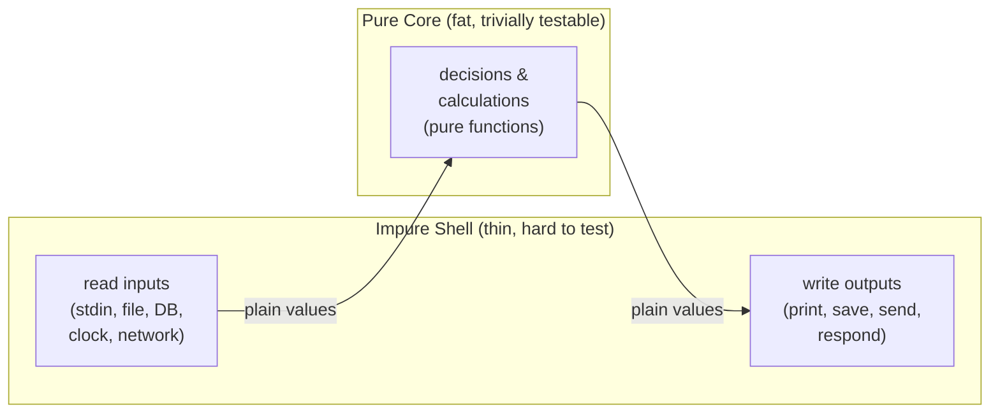

# Effect Tracking — Junior Level

> **Roadmap:** [Functional Programming](../README.md) → Effect Tracking
>
> *A program that only computes values is easy to test, easy to trust, and easy to reason about. A program that talks to the world — files, clocks, networks, random number generators — is none of those things. Effect tracking is the discipline of knowing exactly **which code touches the world** and pushing it to the edges, so the interesting decisions stay pure.*

---

## Table of Contents

1. [Introduction](#introduction)
2. [Prerequisites](#prerequisites)
3. [Glossary](#glossary)
4. [What Counts as an Effect](#what-counts-as-an-effect)
5. [Pure Core / Impure Shell](#pure-core--impure-shell)
6. [Why Isolate Effects](#why-isolate-effects)
7. [Mental Models](#mental-models)
8. [A Brief Haskell Aside: Effects in the Type](#a-brief-haskell-aside-effects-in-the-type)
9. [Common Mistakes](#common-mistakes)
10. [Test Yourself](#test-yourself)
11. [Cheat Sheet](#cheat-sheet)
12. [Summary](#summary)
13. [Further Reading](#further-reading)
14. [Related Topics](#related-topics)

---

## Introduction

> Focus: **What is it, and why does it matter?**

Take a function and ask one question: *if I call it twice with the same arguments, do I always get the same answer, and does nothing else in the world change?* If yes, the function is **pure** — it's just a value-to-value mapping, like `add(2, 3)` always being `5`. If no — it reads a file, prints to the screen, calls the database, returns a random number, or looks at the clock — then it has a **side effect**: it reaches out and touches the world.

Effect tracking is not a fancy framework or a library. It's a way of **organizing** code around a single observation: *the parts that touch the world and the parts that just compute are fundamentally different, and mixing them makes code hard to test and hard to trust.*

```python
# Tangled: decision and effect are welded together.
def apply_discount():
    price = float(input("Price? "))         # effect: reads stdin
    if datetime.now().weekday() == 4:        # effect: reads the clock
        price *= 0.9                         # the actual decision
    print(f"You pay {price}")                # effect: writes stdout
```

That `price *= 0.9` is the only *interesting* line — the business rule. But it's buried among three effects, so you can't test the rule without faking stdin, freezing the clock, and capturing stdout. The fix isn't to delete the effects (a program with no effects does nothing visible); it's to **separate** them from the decision.

```python
# Separated: a pure rule, surrounded by a thin effectful shell.
def discounted_price(price: float, is_friday: bool) -> float:  # PURE
    return price * 0.9 if is_friday else price

def main():                                                    # IMPURE shell
    price = float(input("Price? "))
    is_friday = datetime.now().weekday() == 4
    final = discounted_price(price, is_friday)   # pure call, trivially testable
    print(f"You pay {final}")
```

Now `discounted_price` is a pure function you can test with one line — `discounted_price(100, True) == 90` — no clock, no input, no screen. The effects didn't disappear; they moved to `main`, where they belong. That move *is* effect tracking at the junior level.

> **The mindset shift:** effects are not bad — they're the *point* of the program. But they are **special**. Treat "code that touches the world" as a distinct category you keep small, push outward, and watch carefully — instead of sprinkling it through every function.

This file teaches you to *see* effects and to *push them to the edges*. The deeper machinery — how languages like Haskell track effects in the type system, the `IO` type, effect systems — is the subject of [`middle.md`](middle.md) and builds directly on [Monads — Plain English](../09-monads-plain-english/junior.md).

---

## Prerequisites

- **Required:** You can write functions that take arguments and return values in at least one language (examples here use Go, Java, and Python).
- **Required:** You understand what a **pure function** is — same input, same output, no side effects. If that phrase is fuzzy, read [Pure Functions & Referential Transparency → junior](../02-pure-functions-and-referential-transparency/junior.md) first; this topic is its practical follow-up.
- **Helpful:** You've written at least one unit test and felt the pain of a test that needed a database, a network call, or a fake clock to run.
- **Helpful:** A first pass over [Monads — Plain English](../09-monads-plain-english/junior.md). Not required for this file, but it's where "tracking an effect as a value" goes next.

---

## Glossary

| Term | Definition |
|------|-----------|
| **Side effect** | Anything a function does *besides* compute a return value from its arguments: writing to a screen/file/network, mutating state outside itself, throwing, reading the clock or a random source. |
| **Pure function** | A function whose output depends only on its inputs and that causes no side effects. Calling it is just substituting a value for an expression. |
| **Effect** | A single "touch the world" action — read input, print, query a DB, get the time. Used loosely as a synonym for *side effect*; in FP it gets a precise meaning later (an effect described as a value). |
| **I/O** | *Input/Output* — the most visible effects: reading from and writing to anything outside the program (keyboard, screen, files, sockets, databases). |
| **Pure core** | The part of your program made of pure functions — the decisions, calculations, and transformations. The brain. |
| **Impure shell** | The thin outer layer that performs effects: gathers inputs from the world, calls the pure core, and writes the results back out. The hands. |
| **Determinism** | Same inputs always produce the same output. Pure functions are deterministic; the clock and the random generator are not. |
| **Referential transparency** | The property that an expression can be replaced by its value without changing the program. Pure code has it; effectful code does not. |

---

## What Counts as an Effect

An effect is any way a function interacts with the world beyond returning a value. Here is the working list to memorize — when you see any of these inside a function, that function is impure:

| Effect | Why it's an effect | Example |
|---|---|---|
| **I/O — output** | Changes the world outside the program | `print`, `System.out.println`, writing a file, sending an HTTP response |
| **I/O — input** | Result depends on the outside world, not arguments | `input()`, reading a file, an HTTP GET, a DB query |
| **Mutating external state** | Changes data other code can see | appending to a global list, setting a field on a shared object |
| **Throwing exceptions** | Abruptly changes control flow; not a returned value | `raise`, `throw`, `panic` |
| **Reading the clock** | Same call returns a different value over time | `time.Now()`, `LocalDate.now()`, `datetime.now()` |
| **Randomness** | Same call returns a different value each time | `rand.Intn`, `Math.random()`, `random.random()` |
| **Network / database** | Depends on and changes a remote, shared world | calling an API, `INSERT`, reading a cache |

The unifying test is the question from the introduction:

> **Two-call test:** *If I call this function twice with identical arguments, will I get an identical result, and will nothing else change?*
> Yes → **pure**. No → it has an **effect**.

Notice the two distinct failure modes. Some effects make the **answer change** (clock, random, reading input) — these break *determinism*. Others make **the world change** (printing, writing, mutating, sending) — these break the "nothing else happens" half. Many functions do both.

```go
// Go — spot the effects. Two of these three lines are effects.
func greet(name string) string {                 // PURE: name in, string out
    return "Hello, " + name
}

func greetNow(name string) string {              // IMPURE: reads the clock
    return fmt.Sprintf("Hello %s, it is %s", name, time.Now())  // different every call
}

func greetAndLog(name string) string {           // IMPURE: writes to the world
    msg := "Hello, " + name
    fmt.Println(msg)                              // effect: stdout
    return msg
}
```

`greet` passes the two-call test. `greetNow` fails it (the answer changes every call). `greetAndLog` fails it (something else — the screen — changes). Only `greet` can be tested with a single `assert`.

> A subtle one for juniors: **reading a value is also an effect** when that value comes from the world rather than from arguments. `now()` and `input()` *return* values, but the value isn't determined by what you passed in — it's determined by *when* and *where* you called them. That's why they're effects.

---

## Pure Core / Impure Shell

The central pattern of this entire topic — variously called **functional core, imperative shell**, **pure core / impure shell**, or **decisions vs. actions** — is a single picture:



Read it as a sandwich:

1. **The shell reads.** At the outer edge, impure code gathers everything the decision needs from the world — the user's input, rows from the database, the current time, a random seed — and turns them into ordinary values (numbers, strings, structs).
2. **The core decides.** Those plain values flow into pure functions. This is where the real work lives: validation, pricing, routing, scoring, formatting. No I/O, no clock, no globals — just values in, values out.
3. **The shell writes.** The core hands back plain values (a result, a list of commands, a record to save), and the impure shell carries out the effects: prints, saves, sends, responds.

The core *decides what should happen*; the shell *makes it happen*. Crucially, **the core never performs effects — it returns descriptions of what to do**, and the shell does it.

Here is the same idea in Java, with a realistic "should we send a reminder?" decision:

```java
// PURE CORE — a decision expressed as values in, values out.
record Reminder(String to, String body) {}

class ReminderPolicy {
    // No clock, no email, no DB. Everything it needs is an argument.
    static Optional<Reminder> due(Invoice inv, LocalDate today) {
        if (inv.isPaid())                 return Optional.empty();
        if (!today.isAfter(inv.dueDate())) return Optional.empty();
        return Optional.of(new Reminder(
            inv.customerEmail(),
            "Invoice " + inv.id() + " is overdue."));
    }
}
```

```java
// IMPURE SHELL — gathers inputs, calls the pure core, performs the effects.
class ReminderJob {
    final InvoiceRepo repo;   // DB effect
    final Clock clock;        // clock effect
    final Mailer mailer;      // network effect

    void run() {
        LocalDate today = LocalDate.now(clock);          // effect: read clock
        for (Invoice inv : repo.findOpen()) {            // effect: read DB
            ReminderPolicy.due(inv, today)               // PURE decision
                .ifPresent(r -> mailer.send(r.to(), r.body()));  // effect: send
        }
    }
}
```

`ReminderPolicy.due` is the brain. You can test every rule — paid invoices, not-yet-due invoices, overdue invoices — by calling it with handmade `Invoice` and `LocalDate` values and checking the returned `Optional`. No database, no SMTP server, no waiting for "today" to actually be after the due date. The `ReminderJob` shell — the only part that touches the world — stays small and does no deciding.

> **The discipline in one sentence:** *push the I/O to the edges and keep a fat, pure middle.* The bigger your pure core and the thinner your impure shell, the more of your program you can test with one-line assertions.

A useful way to spot the boundary: every effect should be **as far out as you can push it**. If a pure-looking function reaches in to grab `now()` or call the database, that effect has leaked into the core. Pass the value in instead — the way `due` takes `today` as a parameter rather than calling `LocalDate.now()` itself.

---

## Why Isolate Effects

Why go to this trouble? Because effects are exactly the things that make code hard to test, hard to predict, and hard to reason about. Isolating them gives you four concrete wins.

### 1. Tests become trivial

A pure function is the easiest thing in software to test: feed it inputs, assert on the output. No setup, no mocks, no teardown.

```python
# Testing the pure core: one line, no infrastructure.
assert discounted_price(100, is_friday=True) == 90
assert discounted_price(100, is_friday=False) == 100
```

Compare that with testing the tangled version from the introduction: you'd need to fake `input()`, freeze `datetime.now()`, and capture `print()` output — three pieces of test scaffolding for one rule. Every effect you push out of a function is a mock you no longer have to write. (This is the heart of [unit testing](../../../testing/README.md) discipline and why over-mocking is a smell.)

### 2. You can reason about the code locally

Pure functions have **referential transparency**: `discounted_price(100, True)` is *the same as* `90`, everywhere, always. You can understand the function by looking at it alone — its behavior doesn't depend on global state, the time, or what ran before it. Effectful code has none of this: to predict what `greetNow("Ada")` returns you need to know *when* it runs.

### 3. Bugs cluster where they belong

When effects are scattered, a bug could be anywhere — a stale global, a clock assumption, a swallowed exception. When effects live only in a thin shell, the shell is the *only* place those classes of bug can hide. Your fat pure core is, by construction, free of "it worked yesterday but not today" problems.

### 4. The same core works everywhere

Because the pure core takes plain values, it doesn't care whether those values came from a CLI, a web request, a test, or a batch job. Want to reuse the reminder rule in an HTTP endpoint instead of a nightly job? The core is untouched; you write a new, thin shell. Effect isolation is what makes business logic portable.

| | Effects tangled in | Effects pushed to the shell |
|---|---|---|
| **Testing the logic** | Needs mocks, fakes, fixtures | One-line assertions |
| **Predicting behavior** | Depends on time / globals / order | Depends only on arguments |
| **Where bugs hide** | Everywhere | The thin shell |
| **Reusing the logic** | Coupled to its I/O | Drop the core into any shell |

---

## Mental Models

Pick whichever of these makes the idea click and keep it.

- **Brain and hands.** The pure core is the brain — it thinks and decides but cannot touch anything. The impure shell is the hands — it can touch the world but does no thinking. Keep the brain big and the hands dumb.

- **The recipe vs. the cooking.** A pure function is a recipe: a description of what to do, written on paper, that changes nothing by existing. Running the effects is the actual cooking. You can read, review, and copy a recipe a thousand times with no consequence; cooking it changes the kitchen. Pure code returns recipes; the shell cooks them. (This metaphor is exactly how the `IO` type works — see the Haskell aside.)

- **Decisions vs. actions.** Split every function into *deciding what should happen* (pure) and *making it happen* (effect). `due(invoice, today) → maybe a reminder` is a decision; `mailer.send(...)` is an action. Keep them in separate functions.

- **The two-call test.** When unsure whether code is pure, ask: *call it twice with the same arguments — same result, nothing else changed?* It's the fastest way to classify a function on sight.

- **Effects flow outward.** Imagine effects as water that should drain to the edges of your program. If you find I/O deep inside a calculation, it has pooled where it shouldn't — pass the value in from outside instead.

---

## A Brief Haskell Aside: Effects in the Type

Everything above is a *discipline* — in Go, Java, or Python the compiler won't stop you from calling `print` inside a "pure" function; you have to keep the boundary yourself. Some languages make the compiler enforce it. The famous example is **Haskell**, where **effects are tracked in the type**.

In Haskell, a function that returns an `Int` *cannot* perform any effect — the type system forbids it. If a function needs to do I/O, its return type must say so: it returns `IO Int`, not `Int`. The `IO` wrapper is a visible, compiler-checked badge that means "running this touches the world."

```haskell
-- PURE: the type Int promises no effects. Same input → same output, guaranteed.
double :: Int -> Int
double x = x * 2

-- IMPURE: the IO in the type is a flag — "this touches the world."
getLine    :: IO String     -- reading input is an effect, and the type admits it
putStrLn   :: String -> IO ()   -- printing is an effect

greet :: IO ()
greet = do
    name <- getLine            -- pull a String out of an IO action (the shell)
    putStrLn (double' name)    -- 'double'' here would be a pure transformation
```

Two ideas worth carrying away, even if you never write Haskell:

1. **An `IO Int` is not an `Int` — it's a *recipe* that will produce an `Int` when run.** This is the "recipe vs. cooking" model made literal: pure code can build and combine these recipes freely (that's still pure), and only the program's outer edge actually runs them. The effect is captured *as a value*.
2. **Because effects are in the type, the pure/impure boundary isn't a convention you might forget — it's checked.** You physically cannot call `getLine` from inside `double`, because `double`'s type promises purity. The "pure core / impure shell" split becomes a wall the compiler builds for you.

This is exactly the bridge to [Monads — Plain English](../09-monads-plain-english/junior.md): `IO` is one of the standard examples of a monad, and "an effect captured as a value you can pass around and combine before running" is the monad idea applied to effects. You don't need monads to practice effect tracking in Go/Java/Python today — but when you meet them, you'll recognize that `IO` is just this chapter's discipline, promoted into the type system. The deeper treatment lives in [`middle.md`](middle.md).

---

## Common Mistakes

Mistakes juniors make when first learning to track effects:

1. **Thinking "isolate effects" means "avoid effects."** A program with no effects produces nothing observable. The goal is not zero effects — it's *concentrated* effects: a thin shell instead of a scatter.

2. **Reaching for the clock or random inside a "pure" function.** `now()` and `rand()` look harmless because they return a value, but they read the world and break determinism. Pass the time or the random value *in* as an argument; let the shell fetch it.

3. **Hiding I/O in the middle of a calculation.** A pricing function that secretly does a DB lookup is impure and untestable. Fetch the data in the shell, pass it into the pure function. Keep deep code pure.

4. **Treating exceptions as "not an effect."** Throwing is a side effect — it changes control flow instead of returning a value. At the junior level, prefer returning a result the caller checks (an `Optional`, an error value, a `Result`) over throwing from the pure core. See [Algebraic Data Types](../06-algebraic-data-types/junior.md) for `Option`/`Either`.

5. **Mutating a shared object and calling it "just a helper."** If a function changes something other code can see — a global, a passed-in list — it's effectful, even with no I/O. See [Immutability](../03-immutability/junior.md).

6. **Putting decisions in the shell.** The shell should gather inputs and perform actions — not decide. If you find `if`/`else` business logic next to your `print`s and DB calls, that decision belongs in the pure core.

7. **Assuming the language enforces purity.** Outside Haskell-style languages, *nothing* stops you from doing I/O in a "pure" function. The boundary is a discipline you maintain — naming, structure, and code review are your only enforcement.

---

## Test Yourself

1. State the **two-call test** for purity in one sentence.
2. Classify each as **pure** or **effectful**, and say *why*:
   - `func square(n int) int { return n * n }`
   - `func roll() int { return rand.Intn(6) + 1 }`
   - `func save(u User) { db.Insert(u) }`
   - `func tax(amount, rate float64) float64 { return amount * rate }`
3. In the "pure core / impure shell" picture, which layer reads the database, and which layer decides whether to send an email?
4. Why is the clock (`time.Now()`) considered an effect even though it just *returns* a value?
5. This function mixes a decision with two effects. Rewrite it as a pure function plus a thin shell:
   ```python
   def checkout(cart):
       total = sum(item.price for item in cart)
       if datetime.now().hour < 12:        # morning discount
           total *= 0.95
       print(f"Total: {total}")
       return total
   ```
6. In Haskell, what does the `IO` in `getLine :: IO String` tell you, and how does that relate to the "recipe vs. cooking" mental model?

<details>
<summary>Answers</summary>

1. **If I call the function twice with identical arguments, I get an identical result and nothing else in the world changes.** Yes → pure; no → effectful.

2. - `square` — **pure.** Output depends only on `n`; nothing else changes.
   - `roll` — **effectful.** Reads a random source; same call returns different values (breaks determinism).
   - `save` — **effectful.** Writes to the database; the world changes.
   - `tax` — **pure.** Output depends only on the two arguments; no side effect.

3. The **impure shell** reads the database (an effect). The **pure core** decides whether a reminder/email is due (a decision returning a value). The shell then performs the send.

4. Because its result isn't determined by its arguments — it's determined by *when* you call it. Call it twice and you get two different answers, so it fails the two-call test. Reading a value from the world is still an effect.

5. ```python
   # PURE core: total + flag in, total out.
   def checkout_total(cart, is_morning):
       total = sum(item.price for item in cart)
       return total * 0.95 if is_morning else total

   # IMPURE shell: fetch the time, call the core, do the I/O.
   def checkout(cart):
       is_morning = datetime.now().hour < 12   # effect: clock
       total = checkout_total(cart, is_morning) # pure decision
       print(f"Total: {total}")                 # effect: stdout
       return total
   ```
   `checkout_total` is now testable in one line: `checkout_total(cart, is_morning=True)` with no clock and no captured output.

6. The `IO` says **running `getLine` touches the world** (it reads input), so its result cannot be treated as an ordinary `String`. It's a **recipe** that *will produce* a `String` when the program runs it — building and combining recipes is pure; only the program's edge actually "cooks" them. The compiler uses the `IO` tag to keep effects out of pure functions.

</details>

---

## Cheat Sheet

| Concept | One-liner |
|---|---|
| **Side effect** | Anything a function does besides compute its return value from its arguments. |
| **Two-call test** | Same args twice → same result, nothing else changed? Yes = pure, No = effectful. |
| **The effect list** | I/O, mutating external state, exceptions, randomness, the clock, network/DB. |
| **Pure core** | The decisions and calculations — fat, no I/O, trivially testable. |
| **Impure shell** | The thin edge that reads inputs and performs actions — does no deciding. |
| **The rule** | Push I/O to the edges; keep a fat pure middle; pass effects' results *in* as values. |
| **Decisions vs. actions** | Core *decides what should happen*; shell *makes it happen*. |
| **Haskell `IO`** | Effects tracked in the type — `IO T` is a recipe to produce a `T`, not a `T`. |

> **One rule to remember:** *Effects aren't bad — they're special. Keep them in a thin shell at the edges, and keep your decisions pure.*

---

## Summary

- A **side effect** is anything a function does besides turn its arguments into a return value: I/O, mutating external state, throwing, randomness, reading the clock, hitting the network or a database.
- Use the **two-call test** to classify any function: same arguments twice → same result and nothing else changed means **pure**; otherwise it has an **effect**.
- The core pattern is **pure core / impure shell**: a thin outer shell *reads* inputs and *performs* actions, while a fat pure core *decides* using plain values. The core never performs effects — it returns descriptions of what to do.
- Isolating effects pays off four ways: tests become one-line assertions, behavior is locally predictable, bugs cluster in the thin shell, and the pure core is reusable across CLIs, web handlers, and batch jobs.
- Outside Haskell-style languages the boundary is a **discipline you maintain**; in **Haskell** it's enforced — effects appear in the type (`IO T`), turning the pure/impure wall into something the compiler builds for you, and connecting directly to monads.
- Next: [`middle.md`](middle.md) — how to model effects as values, the `IO` type in practice, and structuring real applications around a functional core.

---

## Further Reading

- **"Functional Core, Imperative Shell"** — Gary Bernhardt (Destroy All Software screencast) — the talk that popularized the pure-core / impure-shell name and the testing argument.
- **Out of the Tar Pit** — Moseley & Marks (2006) — why state and effects are the main source of complexity, and how to confine them.
- **Functional Programming in Scala** — Chiusano & Bjarnason — the chapters on `IO` and effects, for when you're ready to model effects as values.
- **Why Functional Programming Matters** — John Hughes (1990) — the classic case for pure functions and composition.
- **Learn You a Haskell for Great Good** — Miran Lipovača — gentle introduction to `IO` and how Haskell tracks effects in types.

---

## Related Topics

- [Pure Functions & Referential Transparency](../02-pure-functions-and-referential-transparency/junior.md) — the foundation; "what makes a function pure" is the prerequisite for "where to put the impure parts."
- [Monads — Plain English](../09-monads-plain-english/junior.md) — where "an effect captured as a value" becomes precise; `IO` is the canonical example.
- [Immutability](../03-immutability/junior.md) — mutating shared state is an effect; immutable data removes a whole class of them.
- [Algebraic Data Types](../06-algebraic-data-types/junior.md) — returning `Option`/`Either`/`Result` instead of throwing keeps the pure core exception-free.
- [Composition](../05-composition/junior.md) — pure cores are built by composing small pure functions into pipelines.
- [Functional vs OO in Practice](../11-functional-vs-oo-in-practice/junior.md) — how the pure-core idea shows up in hybrid, object-oriented codebases.
