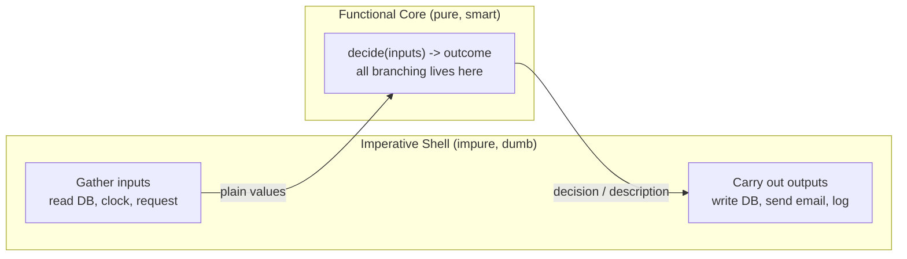
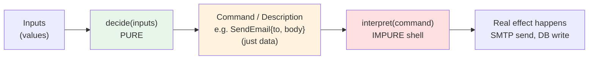

# Effect Tracking — Middle Level

> **Roadmap:** [Functional Programming](../README.md) → Effect Tracking
>
> *Essence:* the junior level taught you to **name** an effect — anything a function does beyond turning inputs into a return value. The middle level teaches you to **place** it: push every effect to the edges of the program so a pure, testable **core** decides *what* should happen, and a thin **shell** does the actual happening. You stop *performing* effects in your logic and start *describing* them, then perform the descriptions somewhere boring and small.

---

## Table of Contents

1. [Introduction](#introduction)
2. [Prerequisites](#prerequisites)
3. [Functional Core / Imperative Shell](#functional-core--imperative-shell)
4. [Injecting Effects: Clock, RNG, I/O, DB](#injecting-effects-clock-rng-io-db)
5. [Decisions as Data: Describe vs Perform](#decisions-as-data-describe-vs-perform)
6. [Testing the Pure Core Without Mocks](#testing-the-pure-core-without-mocks)
7. [Trade-offs: Where Does the Impurity Go?](#trade-offs-where-does-the-impurity-go)
8. [Common Mistakes](#common-mistakes)
9. [Test Yourself](#test-yourself)
10. [Cheat Sheet](#cheat-sheet)
11. [Summary](#summary)
12. [Further Reading](#further-reading)
13. [Related Topics](#related-topics)

---

## Introduction

> Focus: **using it well.** Not *"what is an effect"* — you know that — but *"how do I structure a real program so effects don't poison everything they touch?"*

A side effect is contagious. The moment a function reads the clock, calls the database, or rolls a random number, it inherits every property of that effect: it is no longer deterministic, no longer testable in isolation, no longer safe to reorder, retry, or cache. Worse, that contamination spreads **upward** — every caller of an impure function is itself impure, all the way to `main`.

The naive response is to accept defeat: "real programs *do* things, so most code is impure, oh well." The middle-level insight is that **the impurity has a shape you control.** You cannot eliminate effects — a program that never touches the outside world is useless — but you can *confine* them. Gary Bernhardt named the dominant pattern for this in his 2012 talk *Boundaries*: a **functional core** of pure decision-making logic, wrapped in a thin **imperative shell** that supplies inputs and carries out outputs.

This file shows the pattern in Go, Java, and Python; how to inject the four effects you'll fight most (clock, randomness, I/O, database); the technique of **returning a description of an effect instead of performing it**; how that makes the core testable *without mocks*; and the costs you sign up for.

---

## Prerequisites

- **Required:** You can read [`junior.md`](junior.md) — you can identify side effects and explain why purity matters.
- **Required:** [Pure Functions & Referential Transparency](../02-pure-functions-and-referential-transparency/middle.md) — "pure core" is meaningless if "pure" is fuzzy.
- **Helpful:** [Immutability](../03-immutability/middle.md) — the core passes values around; mutation reintroduces effects through the back door.
- **Helpful:** [Composition](../05-composition/middle.md) — the core is usually a pipeline of small pure functions.
- **Helpful:** Comfort with [Dependency Injection](../../clean-code/README.md) as a mechanism — injecting effects *is* DI, applied with discipline.
- **Helpful:** [Algebraic Data Types](../06-algebraic-data-types/middle.md) — "decisions as data" leans on sum types to model the set of possible effects.

---

## Functional Core / Imperative Shell

The pattern divides every feature into two layers with one rule between them.

| Layer | Contains | Properties | How you test it |
|---|---|---|---|
| **Functional core** | Business rules, calculations, decisions | Pure: deterministic, no I/O, no clock, no mutation | Fast unit tests, plain values in / values out |
| **Imperative shell** | DB calls, HTTP, file/console I/O, clock reads, RNG | Impure but *trivial*: no branching, no logic | A handful of integration tests |

> **The rule:** the core never performs effects; the shell never makes decisions. Logic with no I/O, I/O with no logic.

The shape it produces:



Read it as a sandwich: **impure → pure → impure.** Effects are bread; logic is filling. The core takes already-gathered data and returns a verdict; the shell turns that verdict into actions.

A concrete example: deciding whether to send a subscription-expiry warning.

```python
# ---- Functional core: pure. No clock, no DB, no email. ----
from dataclasses import dataclass
from datetime import date, timedelta

@dataclass(frozen=True)
class Subscription:
    user_email: str
    expires_on: date

def should_warn(sub: Subscription, today: date) -> bool:
    # ALL the logic; "today" is passed in, not read from the clock.
    days_left = (sub.expires_on - today).days
    return 0 <= days_left <= 7
```

```python
# ---- Imperative shell: impure, but no branching logic. ----
def run_expiry_warnings(repo, mailer, clock):
    today = clock.today()                       # effect: read clock
    subs = repo.load_active_subscriptions()     # effect: read DB
    for sub in subs:
        if should_warn(sub, today):             # pure decision
            mailer.send_expiry_warning(sub.user_email)  # effect: send email
```

Notice the shell has exactly one `if`, and that `if` is just *acting on* the core's answer — it contains no business rule. The rule ("7 days") lives only in `should_warn`, which you can test with a date literal in microseconds.

Compare this to the tangled version most code starts as:

```python
# Anti-shape: logic and effects interleaved. Untestable without a live DB,
# a real SMTP server, and the ability to time-travel.
def run_expiry_warnings_bad(db, smtp):
    today = datetime.now().date()               # effect mid-logic
    for row in db.query("SELECT ... WHERE active"):  # effect mid-logic
        if 0 <= (row.expires - today).days <= 7:     # rule buried in effects
            smtp.send(...)                            # effect mid-logic
```

Same behavior; opposite testability. The rule is identical, but in the bad version you cannot reach it without standing up the world.

---

## Injecting Effects: Clock, RNG, I/O, DB

To keep the core pure, the shell must *supply* every effectful input rather than letting the core reach for it. The mechanism is **injection**: pass the source of the effect as a parameter or dependency. Four effects cause most of the trouble.

### 1. The clock

`time.Now()` is the most common purity leak because it looks harmless. A function that reads the wall clock is non-deterministic and cannot be tested for "what happens the day before expiry" without literally waiting.

**Fix:** inject a `Clock` and pass a fixed time in tests.

```go
// Go — inject a Clock interface instead of calling time.Now() directly.
type Clock interface {
    Now() time.Time
}

type realClock struct{}
func (realClock) Now() time.Time { return time.Now() } // the only impure line

// Pure-ish core: deterministic given the clock's output.
func IsExpired(expiresAt time.Time, clk Clock) bool {
    return clk.Now().After(expiresAt)
}
```

```go
// Test: a fixed clock makes the result deterministic — no waiting, no flakiness.
type fixedClock struct{ t time.Time }
func (f fixedClock) Now() time.Time { return f.t }

func TestIsExpired(t *testing.T) {
    deadline := time.Date(2026, 1, 1, 0, 0, 0, 0, time.UTC)
    now := fixedClock{time.Date(2026, 1, 2, 0, 0, 0, 0, time.UTC)}
    if !IsExpired(deadline, now) {
        t.Fatal("expected expired")
    }
}
```

> **Purer still:** rather than inject a `Clock` *interface* (which the core must call), pass the **already-read** `time.Time` as a plain argument — `IsExpired(expiresAt, now)`. The shell reads the clock once; the core receives a value. A value is more honest than an interface you might call twice and get two answers.

### 2. Randomness (RNG)

Random number generation is an effect for the same reason the clock is: same inputs, different outputs. Shuffling, sampling, token generation, jitter — all non-deterministic.

```java
// Java — inject the source of randomness; the core takes a seed/RNG, not Math.random().
public final class Dealer {
    // Pure given the RNG: the same Random produces the same shuffle.
    public static List<Card> shuffle(List<Card> deck, Random rng) {
        List<Card> copy = new ArrayList<>(deck);
        Collections.shuffle(copy, rng);   // randomness comes from the injected rng
        return copy;
    }
}
```

```java
// Test: a seeded Random is fully deterministic — the "random" output is reproducible.
@Test
void shuffleIsReproducible() {
    var a = Dealer.shuffle(STANDARD_DECK, new Random(42));
    var b = Dealer.shuffle(STANDARD_DECK, new Random(42));
    assertEquals(a, b);   // same seed -> same shuffle, every run
}
```

The shell creates `new Random()` (unseeded, truly random) in production; the test injects `new Random(42)`. The logic never changes.

### 3. I/O (files, console, network)

I/O is effect at its most obvious. The middle move is the same: the core operates on **data already read**, and the shell does the reading and writing.

```python
# Core: pure transformation. Knows nothing about files.
def normalize_report(lines: list[str]) -> list[str]:
    return [ln.strip().lower() for ln in lines if ln.strip()]

# Shell: reads, calls the core, writes. No logic.
def process_file(in_path: str, out_path: str) -> None:
    with open(in_path) as f:                 # effect: read
        lines = f.readlines()
    cleaned = normalize_report(lines)        # pure
    with open(out_path, "w") as f:           # effect: write
        f.write("\n".join(cleaned))
```

You test `normalize_report` with a Python list and an assertion — no temp files, no filesystem.

### 4. The database

The database is the hardest because it's both an *input* (queries) and an *output* (writes), and it's slow and stateful. The discipline is unchanged: **load everything the decision needs up front, decide purely, then persist.** This is sometimes called *load → decide → store*.

```go
// Shell: load -> decide -> store. The DB never appears inside the decision.
func ApplyDiscount(repo OrderRepo, orderID string) error {
    order, err := repo.Load(orderID)      // load (effect)
    if err != nil {
        return err
    }
    updated := Discounted(order)          // decide (pure: Order -> Order)
    return repo.Save(updated)             // store (effect)
}

// Core: pure. A function from Order to Order; no repo, no SQL.
func Discounted(o Order) Order {
    if o.Total > 100_00 {                 // cents
        o.Total = o.Total * 90 / 100      // 10% off
        o.DiscountApplied = true
    }
    return o
}
```

The discount *rule* — the part that actually matters and changes often — is a pure `Order → Order` function you test with struct literals. The DB plumbing is a three-line shell function you cover once with an integration test.

> **General recipe for any effect:** find the impure call inside your logic, hoist it out to the shell, and pass its *result* into the core as a value. If the core needs to *cause* an effect (not just consume one), return a description of it — the next section.

---

## Decisions as Data: Describe vs Perform

Injection handles effects the core *consumes* (clock, RNG, loaded rows). But what about effects the core wants to *cause* — "send this email," "charge this card," "write this row"? If the core calls `mailer.send()`, it's impure again.

The functional answer: **the core returns a *description* of the effect — a plain data value — and the shell performs it.** Separate the *decision* (what should happen, pure) from the *execution* (making it happen, impure).



Instead of *doing*, the core *says what should be done*. The description is an inert value — a command, an event, an intent — that the shell later *interprets* into a real action.

```python
# Effects modeled as data — a small sum type of "things to do".
from dataclasses import dataclass

@dataclass(frozen=True)
class SendEmail:
    to: str
    subject: str

@dataclass(frozen=True)
class ChargeCard:
    customer_id: str
    cents: int

Command = SendEmail | ChargeCard   # the universe of effects this feature can request
```

```python
# Pure core: decides WHAT, returns a list of commands. Sends nothing, charges nothing.
def checkout(cart, customer) -> list[Command]:
    cmds: list[Command] = []
    total = sum(item.price for item in cart.items)
    cmds.append(ChargeCard(customer.id, total))
    if total > 5000:
        cmds.append(SendEmail(customer.email, "Thanks for the big order!"))
    return cmds   # a plan, not an action
```

```python
# Impure shell: interprets each command into a real effect. No branching on business rules.
def execute(cmds: list[Command], gateway, mailer) -> None:
    for cmd in cmds:
        match cmd:
            case ChargeCard(customer_id=cid, cents=c):
                gateway.charge(cid, c)
            case SendEmail(to=to, subject=s):
                mailer.send(to, s)
```

What you bought:

- **The decision is testable as data.** `checkout(cart, customer)` returns a *list you can assert on* — `assert ChargeCard("c1", 7000) in cmds` — with no payment gateway in sight.
- **The plan is inspectable, loggable, and reorderable.** You can log "here's what we're about to do," dry-run it, dedupe it, or replay it. A description is a value; a performed effect is gone.
- **Execution is centralized and dumb.** One interpreter, no logic, easy to retry or wrap in a transaction.

This is the everyday-language version of the **`IO` monad** idea — in Haskell, an `IO a` value is *a description of an effect* that the runtime performs at the very edge; your code only ever builds and combines descriptions. You don't need a monad to get the benefit: a list of command structs and a `match` is the same separation, made explicit. (See *Monads — Plain English* in this section for the formal version.)

> **When to use this vs. plain injection.** Injecting a `mailer` and calling it in the shell is enough for simple flows. Reach for *decisions-as-data* when you need to **test the decision itself**, when effects must be **ordered/batched/transactional**, or when you want an **audit log of intent** (which is also the seed of event sourcing).

---

## Testing the Pure Core Without Mocks

This is the payoff that makes the whole pattern worth it. A pure core needs **no mocks, no stubs, no fakes** — because there's nothing to fake. Mocks exist to stand in for effects; remove the effects from your logic and the mocks vanish with them.

Contrast the two testing styles for the discount rule:

```java
// WITHOUT the pattern: logic is tangled with the DB, so you must mock the DB.
@Test
void appliesDiscount_mockHeavy() {
    OrderRepo repo = mock(OrderRepo.class);                 // ceremony
    when(repo.load("o1")).thenReturn(new Order("o1", 20000));
    var svc = new OrderService(repo);

    svc.applyDiscount("o1");

    verify(repo).save(argThat(o -> o.total() == 18000));    // verifying an interaction
}
```

```java
// WITH the pattern: the rule is pure, so the test is a plain assertion. No mock.
@Test
void appliesDiscount_pure() {
    Order in  = new Order("o1", 20000);
    Order out = OrderRules.discounted(in);                  // pure call
    assertEquals(18000, out.total());                       // asserting a value
    assertTrue(out.discountApplied());
}
```

The mock-heavy test is slower to write, brittle (it asserts *how* the code calls the DB, not *what* it decides), and re-breaks on every refactor of the plumbing. The pure test asserts the thing that actually matters — the rule — and never touches infrastructure.

Three properties of a well-factored core's tests:

1. **Fast.** No I/O means thousands of tests run in milliseconds. This changes how often you run them — every save, not every coffee break.
2. **Deterministic.** Inject the clock and RNG and the same test gives the same answer forever. No flaky "fails at midnight UTC" tests.
3. **Readable as specification.** `should_warn(sub_expiring_in_3_days, today) == True` reads like the requirement. The test *is* the documentation of the rule.

> **Property-based testing fits the core perfectly.** Because the core is just functions over values, you can throw thousands of generated inputs at it and assert invariants ("a discounted total is never higher than the original"). Property-based testing pairs naturally with a pure functional core — there's no infrastructure to set up, just a generator and an invariant.

The shell still needs *some* tests — a few **integration tests** confirming the wiring (does `run_expiry_warnings` actually load, decide, and send end-to-end?). But these are few, because the shell is small and logic-free. The bulk of your behavior lives in the core, covered by fast unit tests; a thin layer of integration tests guards the seams. This inverts the usual painful ratio of slow-mocked tests.

---

## Trade-offs: Where Does the Impurity Go?

The pattern is not free, and pretending otherwise is how people get burned. Three honest costs.

### 1. The impurity doesn't disappear — it concentrates

You cannot delete effects; you can only **move** them. Functional core / imperative shell pushes all of them to one layer at the program's edge. That's a feature (effects are now in one auditable place) but also a reality check: someone still has to write and test that shell, and the shell *is* where the genuinely hard, stateful, failure-prone code lives — partial DB writes, network timeouts, retries. The pattern makes the *logic* easy by making the *edge* explicit, not by making the edge trivial.

> **Mental model:** purity is a conserved quantity. You're not eliminating impurity, you're *sweeping it into a corner* where you can see all of it at once.

### 2. Plumbing cost

Passing the clock, the RNG, the repo, and the mailer down to where they're needed is **boilerplate**. "Decisions as data" adds a command type and an interpreter you wouldn't otherwise write. For a three-line script, this ceremony is pure overhead — the bad, tangled version is genuinely fine.

The pattern pays off when **logic is non-trivial and effects are annoying to set up** (DB, payments, time-sensitive rules). It under-pays when logic is trivial or effects are absent. Match the investment to the stakes: a CRUD endpoint that just forwards a request to a repo doesn't need a functional core, because there's no decision to isolate.

### 3. The core can grow a "data shell" of its own

When you model effects as data, the core's output can become an elaborate command language, and the interpreter can quietly accumulate logic ("if this command, also do that"). If the shell starts branching on business rules, you've leaked the core back into the shell. Keep the interpreter **dumb**: it maps command → effect, one to one, no decisions.

| Decision | Lightweight (inject + call in shell) | Heavyweight (decisions as data) |
|---|---|---|
| Simple flow, one effect | ✅ | overkill |
| Need to unit-test the decision | possible | ✅ best |
| Effects must be ordered / batched / transactional | hard | ✅ |
| Want an audit trail of *intent* | no | ✅ |
| Tiny script, throwaway | ✅ (or skip the pattern) | ❌ |

> **Rule of thumb:** start by injecting effects and keeping the shell thin — that alone gets you a testable core. Escalate to decisions-as-data only when you need to test, order, or record the *decision* itself.

---

## Common Mistakes

1. **Reading the clock/RNG "just once" inside the core.** It feels harmless — "it's only one `time.Now()`." But one impure call makes the whole function non-deterministic and forces every test to mock time. Inject it, or better, pass the value in.
2. **A shell that branches on business rules.** If your shell has `if order.total > 100`, the logic leaked out of the core. The shell may branch on *effect outcomes* (DB error → retry) but never on *domain rules*.
3. **Calling injected effects from inside the core.** Injecting a `Clock` interface and then calling `clk.Now()` *within* a "pure" function is better than a global call, but it's still impure — the function can return two answers. Prefer passing the already-read value as data.
4. **Mocking your way around a bad structure.** If a test needs five mocks, that's a design smell, not a testing problem. The mocks are telling you logic and effects are tangled. Extract the pure core and the mocks evaporate.
5. **"Decisions as data" with a smart interpreter.** Building a command list and then putting `if`/`match`-with-logic in the interpreter just moves the tangle. The interpreter must be a flat dispatch table: command type → effect, nothing else.
6. **Applying the pattern everywhere, dogmatically.** A glue script that reads a file and prints it has no decision to isolate. Forcing a functional core onto it adds plumbing for zero testability gain. The pattern serves *non-trivial logic*; absent that, skip it.
7. **Hidden effects through mutation.** A "pure" core function that mutates its argument or a shared list is impure in disguise — it has an observable side effect. Return new values; lean on [immutability](../03-immutability/middle.md).

---

## Test Yourself

1. State the one-sentence rule that separates the functional core from the imperative shell. What is each layer forbidden from doing?
2. A function reads `time.Now()` in the middle of computing whether a token is expired. Give two refactors that make it deterministic, and say which is "purer" and why.
3. Your colleague's test for a discount rule uses three mocks (DB, clock, mailer). The rule itself is just arithmetic. What does the mock count tell you, and what's the fix?
4. Explain "returning a description of an effect instead of performing it." What concretely does the core return, and who turns it into a real action?
5. The shell has grown an `if customer.isVip` branch. Why is this a bug in the *structure*, even if the output is correct?
6. When is the functional core / imperative shell pattern *not* worth the plumbing cost? Give a concrete example.
7. "The impurity doesn't disappear, it concentrates." Where does it concentrate, and why is that an improvement even though the total amount of effect is unchanged?

<details>
<summary>Answers</summary>

1. **The core never performs effects; the shell never makes decisions** — logic with no I/O, I/O with no logic. The core is forbidden from touching the clock/RNG/DB/network/mutation; the shell is forbidden from containing business-rule branching.
2. (a) Inject a `Clock` interface and call `clk.Now()` inside; (b) read the time in the shell and pass the resulting `time.Time` *value* as a parameter — `isExpired(token, now)`. Option (b) is purer: the function receives a fixed value, so it cannot return two different answers; an injected interface could still be called twice and yield different results.
3. A high mock count signals **tangled effects and logic**, not a testing difficulty. The arithmetic rule has no real dependency on DB/clock/mailer. Extract the rule into a pure function (`discounted(order) -> order`) and test it with plain values and assertions — zero mocks. Leave the DB/mailer calls in a thin shell covered by one integration test.
4. The core returns an **inert data value** describing the intended effect — e.g. a `SendEmail{to, subject}` or `ChargeCard{id, cents}` struct, or a list of such commands. It performs nothing. The **shell's interpreter** consumes the description and turns it into the real action (SMTP send, gateway charge). This lets you assert on the *decision* as data.
5. Because business-rule branching belongs to the **core**, not the shell. Even with correct output today, the rule is now in the wrong layer: it's untestable without the shell's effects, it can drift out of sync with the core's rules, and it breaks the "shell makes no decisions" invariant — making the whole codebase harder to reason about. Move the VIP logic into the core; let the shell act on the core's verdict.
6. When there's **no real decision to isolate** or logic is trivial. Example: a script that reads a CSV and prints row counts — it's almost all I/O with one `len()`. Wrapping it in a functional core adds plumbing (injected reader, command types) for no testability gain, because there's nothing meaningful to unit-test.
7. It concentrates in the **imperative shell at the edge of the program** (the load/decide/store wiring, the command interpreter). It's an improvement because all effects are now in *one small, auditable place* instead of smeared through every function — the logic becomes pure and trivially testable, and the remaining impure code is so thin and logic-free that a handful of integration tests cover it.

</details>

---

## Cheat Sheet

| Concept | What it means | The move |
|---|---|---|
| **Functional core** | Pure decision logic | Plain values in, verdict out; no I/O, no clock, no mutation |
| **Imperative shell** | Thin impure edge | Gather inputs → call core → carry out outputs; *no* business branching |
| **Inject the clock** | Stop calling `time.Now()` in logic | Pass `now` as a value (best) or inject a `Clock` |
| **Inject the RNG** | Stop calling global random | Pass a seeded `Random`/`rng`; tests get a fixed seed |
| **Load → decide → store** | DB discipline | Read all needed rows up front, decide purely, then persist |
| **Decisions as data** | Describe vs perform | Core returns command structs; dumb interpreter performs them |
| **Test without mocks** | Mocks fake effects; core has none | Assert on returned values / returned commands |

**Recipe for any effect:** find the impure call inside your logic → hoist it to the shell → pass its *result* into the core as a value. If the core must *cause* an effect, return a *description* of it instead.

**Two golden rules:**
- *Logic with no I/O; I/O with no logic.*
- *You can't delete effects — only move them to the edge where you can see them all at once.*

---

## Summary

- A side effect contaminates every caller; you can't remove effects but you can **confine** them.
- **Functional core / imperative shell** (Gary Bernhardt, *Boundaries*): pure logic in the middle, a thin impure shell at the edges. The rule — *the core never performs effects, the shell never makes decisions.*
- **Inject effects** the core consumes — clock, RNG, I/O, DB — by passing their *results* in as values (purer than injecting a callable). For the DB: **load → decide → store.**
- **Decisions as data**: the core returns a *description* of the effects to cause (command structs), and a dumb shell **interpreter** performs them. This is the plain-English `IO` monad — separate *deciding what* from *making it happen*.
- The payoff: the core is testable **without mocks** — fast, deterministic, readable as specification — while a thin layer of integration tests guards the shell.
- **Trade-offs**: impurity concentrates rather than vanishing; there's a plumbing cost; keep the interpreter dumb. Use injection for simple flows; escalate to decisions-as-data only when you must test, order, or record the decision itself. Don't force the pattern onto trivial glue code.

---

## Further Reading

- **Boundaries** — Gary Bernhardt (2012 talk) — the original articulation of functional core / imperative shell; watch this before anything else.
- **Functional Core, Imperative Shell** — Destroy All Software screencasts (Gary Bernhardt) — the pattern worked through on real code.
- **Functional Programming in Scala** — Chiusano & Bjarnason ("the red book"), ch. 13 — effects as descriptions and the `IO` type, the rigorous version of "decisions as data."
- **Out of the Tar Pit** — Moseley & Marks (2006) — why state and effects are the dominant source of complexity, and the case for isolating them.
- **Domain Modeling Made Functional** — Scott Wlaschin (2018) — pushing effects to the edges in a typed functional style, with commands and events as data.

---

## Related Topics

- [Pure Functions & Referential Transparency](../02-pure-functions-and-referential-transparency/middle.md) — the definition of "pure" the core depends on.
- [Immutability](../03-immutability/middle.md) — mutation is a hidden effect; the core passes values.
- [Composition](../05-composition/middle.md) — the core is usually a pipeline of small pure functions.
- [Algebraic Data Types](../06-algebraic-data-types/middle.md) — sum types model the universe of commands in "decisions as data."
- *Monads — Plain English* (sibling section 09) — the formal `IO`-monad version of describe-vs-perform.
- [Clean Code → Unit Tests](../../clean-code/08-unit-tests/README.md) — fast, isolated tests are what a pure core unlocks.
