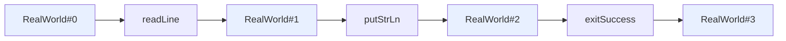

# Effect Tracking — Professional Level

> **Roadmap:** [Functional Programming](../README.md) → Effect Tracking
>
> *Essence: an effect system turns "do this side effect" into "here is a value that **describes** a side effect." That reframing is free at the type level and not free at runtime — this file is about exactly what the runtime pays, and when paying it is worth it.*

---

## Table of Contents

1. [Introduction](#introduction)
2. [Prerequisites](#prerequisites)
3. [The IO Monad's Runtime Model — the `RealWorld` Token](#the-io-monads-runtime-model--the-realworld-token)
4. [Algebraic Effects & Handlers — Continuations as the Mechanism](#algebraic-effects--handlers--continuations-as-the-mechanism)
5. [Free Monad + Interpreter — The Cost of "Describe Then Run"](#free-monad--interpreter--the-cost-of-describe-then-run)
6. [Fiber Runtimes — Where the Overhead Actually Lives](#fiber-runtimes--where-the-overhead-actually-lives)
7. [Measurement](#measurement)
8. [Common Mistakes](#common-mistakes)
9. [Test Yourself](#test-yourself)
10. [Cheat Sheet](#cheat-sheet)
11. [Summary](#summary)
12. [Further Reading](#further-reading)
13. [Related Topics](#related-topics)

---

## Introduction

> Focus: **the runtime model and the performance** of effect tracking. Not "why purity is nice" — that was the earlier levels — but *what mechanism the runtime uses to execute a pure description of an effect, and what that mechanism costs in allocations, indirections, and scheduler work.*

The earlier levels established the idea: a pure functional core surrounded by an imperative shell, with effects represented as values (`IO a`, `Task`, `ZIO[R, E, A]`) rather than performed inline. The slogan is *"a program is a value; running it is a separate step."* At this level the slogan stops being a slogan and becomes an engineering trade-off you must be able to defend with numbers.

Three questions drive everything below:

1. **How does a pure value actually cause an effect?** A `RealWorld -> (RealWorld, a)` function, a tree of constructors interpreted later, or a continuation captured by a handler — each is a real, distinct runtime mechanism.
2. **What does "describe then run" cost versus a direct call?** Building a description allocates; interpreting it dispatches; both are work a direct `println` never does.
3. **When is the cost negligible and when is it not?** For an I/O-bound service waiting 5 ms on a database, a few hundred nanoseconds of interpreter overhead per step is invisible. For a tight numeric loop, wrapping each step in an effect value is catastrophic. The professional skill is telling these apart *before* shipping.

> **The mental model:** an effect system is a **two-phase machine**. Phase one builds a data structure (the program-as-value). Phase two is an interpreter loop that walks that structure and performs the real effects. Every cost in this file is a cost of either *building* phase-one data or *running* the phase-two loop. The mainstream-discipline contrast — Go, Java, Python performing effects directly — has no phase one at all, which is why it is faster per-step and weaker at compositional reasoning.

---

## Prerequisites

- **Required:** Comfortable with [`senior.md`](senior.md) — you can structure a real codebase as functional core / imperative shell and read a `for`-comprehension over an effect type.
- **Required:** Solid grasp of monads as a mechanism, not a metaphor — see [Monads — Plain English → professional.md](../09-monads-plain-english/professional.md). `flatMap`/`bind` chaining is assumed.
- **Required:** You can read a microbenchmark (JMH, `criterion`, `go test -bench`) and tell allocation cost from compute cost.
- **Helpful:** Exposure to one effect library in anger — Cats-Effect or ZIO (Scala), OCaml 5 effect handlers, or Haskell `IO`/`mtl`.
- **Helpful:** big-o-analysis and profiling-techniques for the measurement vocabulary; concurrency-patterns for the fiber-vs-thread comparison.

---

## The IO Monad's Runtime Model — the `RealWorld` Token

The single most clarifying fact about Haskell's `IO` is that **it is not magic and it is not "impure under the hood" in a hand-wavy way.** It has a concrete, mechanical model. GHC represents `IO a` as a function that threads a token representing the entire outside world:

```haskell
-- The conceptual definition GHC actually uses (simplified):
newtype IO a = IO (State# RealWorld -> (# State# RealWorld, a #))
--                  ^^^^^^^^^^^^^^^^    ^^^^^^^^^^^^^^^^^^^^^^^
--                  the world coming in   the world going out, plus the result
```

Read `IO a` as **`RealWorld -> (RealWorld, a)`**. An `IO` action is a *pure function* from "the state of the world before" to "the state of the world after, plus a result." `RealWorld` is a zero-width type — it has no runtime representation, `State#` is erased — so threading it costs nothing at runtime. It exists purely so the type checker and the optimizer can enforce an **ordering**: each action consumes the world token produced by the previous action.

### Why this makes effects "pure descriptions"

Because `IO a` is just a function, `main :: IO ()` is a *value* — a function waiting for the world token. Nothing happens when you build it. The Haskell **runtime system (RTS)** is what finally applies that function to the real `RealWorld#` token at program start. That application *is* the execution. So the famous line "Haskell is pure; the runtime runs the `IO`" is literally true: your program is a pure value `main`, and the impurity is the RTS calling it with the world.

### How `>>=` threads the token

`bind` (`>>=`) for `IO` is the plumbing that passes the world token from one action to the next, fixing evaluation order:

```haskell
-- (>>=) for IO, conceptually: run the first action on the incoming world,
-- take the new world + result, feed both into the second action.
(>>=) :: IO a -> (a -> IO b) -> IO b
(IO m) >>= k = IO (\world0 ->
    case m world0 of
        (# world1, a #) -> case k a of
            IO n -> n world1)        -- world1 threaded forward → ordering enforced
```

The `case` forces `world0` to be consumed before `world1` is produced. That data dependency is *how* a lazy, unordered language gets strict left-to-right effect ordering: not via a special statement-sequencing rule, but via an ordinary value dependency the optimizer must respect.



*Each box consumes the world token from the left and emits a new one to the right. The token has no runtime bytes; the chain it forms is purely a compile-time ordering constraint.*

### The runtime cost of `IO` in Haskell

Here is the professional payoff: **because `State# RealWorld` is erased and `IO` is unboxed at the call boundary, GHC's `IO` is close to free per step.** After optimization, `putStrLn x >> putStrLn y` compiles to roughly the same code as two sequential C calls — there is no heap-allocated "action object," no interpreter loop. The token is a fiction the optimizer uses and then discards.

This is the crucial contrast with the *library-level* effect systems in the next sections. Haskell `IO` is a **language/compiler-integrated** effect representation, so its abstraction cost is largely optimized away. A `Free` monad or a Scala `IO` data type is a **library-level** representation built from ordinary allocated objects, so its cost is real and measurable. Same idea — "effects as values" — radically different runtime bill.

> **Mainstream contrast:** In Go, `fmt.Println(x); fmt.Println(y)` performs the effect immediately — there is no description, no token, no phase split. It is maximally fast per step and gives you nothing to inspect, reorder, mock, or interpret differently. Haskell's `IO` reaches nearly the same per-step speed *while keeping* the value-level representation, because the compiler is in on the trick. Library effect systems trade some of that speed back for the same inspectability without compiler support.

### The escape hatch and why it is dangerous

GHC exposes `unsafePerformIO :: IO a -> a` — it applies the `IO` function to a fabricated world token *now*, collapsing phase two into phase one. This is exactly the operation the type system exists to forbid, and the danger is purely a runtime one: once an `IO` is "run" inside a pure expression, the optimizer is free to treat the result as a constant — it may **float the effect out of a loop, duplicate it, or eliminate it entirely** as common-subexpression, because pure values may be shared and reordered. The `RealWorld` token was the thing preventing those rewrites; `unsafePerformIO` throws it away and the optimizer's freedom turns into your bug. The professional lesson is the mirror image of the section above: the token is not ceremony — it is the *only* thing telling the optimizer "this may not be moved." Remove it and you inherit nondeterministic, optimization-level-dependent behavior.

---

## Algebraic Effects & Handlers — Continuations as the Mechanism

Monadic `IO` bakes one fixed interpretation into the type. **Algebraic effects** generalize this: code *performs* an effect, and a *handler* somewhere up the call stack decides what that effect means — including the power to **resume the computation** from the exact point the effect was performed. The enabling mechanism is the **delimited continuation**.

### The model

An effect operation is like a resumable exception. When code performs an effect, the runtime:

1. **Captures the continuation** — the rest of the computation from the `perform` point up to the nearest enclosing handler — as a first-class value `k`.
2. Hands control to the handler with that `k`.
3. The handler may **call `k value`** to resume the computation (supplying the operation's result), call it **multiple times**, or **not at all** (abandoning the computation, like an exception).

OCaml 5 made this concrete in the standard runtime. A sketch in OCaml 5 syntax:

```ocaml
(* Declare an effect that asks for an int and expects an int back. *)
type _ Effect.t += Ask : int Effect.t

let computation () =
  let x = Effect.perform Ask in   (* suspends here; continuation captured *)
  let y = Effect.perform Ask in
  x + y

(* A handler decides what `Ask` means and resumes the captured continuation. *)
let run () =
  let open Effect.Deep in
  try_with computation ()
    { effc = fun (type a) (eff : a Effect.t) ->
        match eff with
        | Ask -> Some (fun (k : (a, _) continuation) ->
            continue k 21)          (* resume the suspended computation with 21 *)
        | _ -> None }
(* run () = 42 : each perform is resumed with 21 *)
```

`perform Ask` does not return normally — it captures everything that would have happened after it (the second `perform`, the `+`, the return) as the continuation `k`, and ships it to the handler. `continue k 21` resumes that frozen computation, plugging `21` in where `perform` sat.

```mermaid
graph TD
    H["handler (try_with)"]
    C1["x = perform Ask"]
    C2["y = perform Ask"]
    C3["x + y"]
    H -->|installs handler| C1
    C1 -->|perform: capture continuation k1 = (y=...; x+y)| H
    H -->|continue k1 21| C2
    C2 -->|perform: capture continuation k2 = (x+y)| H
    H -->|continue k2 21| C3
    C3 -->|return 42| H
    style H fill:#fff0e8
```

*Each `perform` slices the stack at the handler boundary: everything above becomes a continuation value the handler holds, then resumes.*

### How OCaml 5 implements it — and what it costs

OCaml 5's runtime gives each fiber its own **small, separately-allocated stack segment**. `perform` does *not* copy the whole stack; it **unwinds to the handler and hands over a reference to the suspended stack segment** as the continuation. `continue k` switches back onto that segment. This makes capture and resume **O(1) in the depth of the captured frames** — a stack-pointer swap plus bookkeeping, not a deep copy — which is why OCaml 5 effects are cheap enough to underpin its concurrency library.

The costs that remain are concrete:

- **Stack-segment allocation** when a fiber is created (amortized; segments are pooled/reused).
- **A control-flow transfer** (save/restore registers, switch stack pointer) on each `perform` and each `continue` — comparable to a non-local jump, far cheaper than thread context switching but not free.
- **One-shot vs multi-shot:** resuming a continuation more than once requires *copying* the captured segment (you cannot reuse a stack you have already resumed onto). OCaml 5 continuations are **one-shot by default** (`continue` consumes `k`); multi-shot needs an explicit clone and pays the copy. Most effect uses (async I/O, generators, exceptions) are one-shot, which is the cheap case the implementation optimizes for.

> **Why this matters at the professional level:** algebraic effects give you the *expressiveness* of the Free monad (define operations, interpret them many ways) with a runtime cost closer to native control flow, because the continuation lives on a real stack segment rather than as a reified tree of allocated objects walked by an interpreter. This is the performance argument for handler-based effect systems over Free-monad-based ones.

The key structural difference: a Free monad **builds the whole program as data first, then interprets it** — every step is a heap node visited by an interpreter loop. A handler-based system **runs the program on a real stack and only materializes a continuation at the `perform` points** — the in-between code (the `x + y`, the loops, the ordinary calls) executes as plain compiled code at full speed, and you pay only at the effect boundaries. For a computation with sparse effects in a dense body, this is the difference between paying per *instruction* and paying per *effect*. That is why OCaml chose handlers as the substrate for its concurrency library rather than a monadic `IO` type: the dense, effect-free stretches stay native.

> **Mainstream contrast:** Java added virtual threads (Project Loom) whose `Continuation` machinery is the same idea — mount/unmount a continuation on a carrier thread, capture on blocking. Python's generators (`yield`) and `async`/`await` are *restricted, one-shot, statically-scoped* delimited continuations: `yield` suspends and `send()` resumes, but you cannot capture an arbitrary slice of the call stack across function boundaries the way `perform` does. The general algebraic-effects mechanism is strictly more powerful — and the implementations converge on the same primitive: capture a stack slice, resume it later.

---

## Free Monad + Interpreter — The Cost of "Describe Then Run"

Before languages had effect handlers in the runtime, the portable way to get "effects as inspectable data" was the **Free monad**: represent your program as an explicit tree of operation constructors, then write an interpreter that folds the tree into a real effect (or a test effect, or a logging effect, …).

```scala
// A tiny effect algebra as data. Each operation is a constructor.
sealed trait Console[A]
case class Print(line: String) extends Console[Unit]
case object ReadLine          extends Console[String]

// Free[Console, A] is a TREE: Pure(a) | FlatMap(op, k: A => Free[...])
// Building a program allocates one node per operation + one per flatMap.
val program: Free[Console, Unit] =
  for {
    name <- liftF(ReadLine)        // allocates a FlatMap node
    _    <- liftF(Print(s"Hi $name")) // allocates another
  } yield ()
```

The program is now a value you can interpret many ways. The **interpreter** is the phase-two loop:

```scala
// Production interpreter: turn each constructor into a real side effect.
def runIO[A](p: Free[Console, A]): A = p match {
  case Pure(a)          => a
  case FlatMap(op, k)   =>
    val result = op match {                 // ← dispatch per node
      case Print(s)  => println(s)          //   real effect
      case ReadLine  => scala.io.StdIn.readLine()
    }
    runIO(k(result))                        // ← continue interpreting
}
// A *test* interpreter could match the same tree and return canned input — same
// program value, different meaning. That is the whole point of Free.
```

### Where the cost is

This is the most expensive of the three models, and the costs are explicit:

1. **Allocation per operation.** Every `flatMap` allocates a `FlatMap` node holding the operation and a closure `k`. A program of N steps allocates O(N) heap objects *before any effect runs*. The closures capture environment, adding more allocation.
2. **Interpreter dispatch per node.** The interpreter loop pattern-matches every node (a `match`/`switch` = an indirect branch) and then *calls a closure* `k(result)` to get the next node — an indirect call the JIT often cannot inline because the closure varies.
3. **Pointer-chasing the tree.** The program is a linked structure on the heap; walking it is a cache-unfriendly chase of pointers, the opposite of a tight loop over contiguous data.
4. **The "left-nested `flatMap`" trap.** Naively, `(((a flatMap f) flatMap g) flatMap h)` rebuilds and re-walks the left spine repeatedly, giving **O(n²)** behavior. Real libraries fix this with a reified continuation structure (a "type-aligned queue" / trampoline), which restores O(n) but is itself extra machinery executing per step.

> **Illustrative comparison — direct effect vs effect-value + interpreter.** A microbenchmark that increments a counter N times, doing nothing but the increment:
>
> | Approach | Per-step cost | Allocations / step | Relative |
> |---|---|---|---|
> | Direct `var i += 1` (imperative) | ~1 ns | 0 | 1× (baseline) |
> | Haskell `IO` (compiler-integrated, optimized) | ~1–3 ns | 0 | ~1–3× |
> | OCaml 5 effect/handler per step | ~10–30 ns | ~0 (stack, not heap) | ~10–30× |
> | Free monad + naive interpreter | ~150–400 ns | 2–4 heap objects | ~150–400× |
>
> *Numbers are **labeled illustrative** — order-of-magnitude shapes, not measurements of your code. The shape is the lesson: the gap between "compiler knows about the effect" and "library reifies the effect as a tree" is one to two **orders of magnitude per step**, and most of the library cost is allocation + interpreter dispatch, not the effect itself.*

The professional reading of that table: **the overhead is per-step and constant.** If each "step" is a database query taking 5 ms, 300 ns of interpreter overhead is 0.006% — utterly irrelevant, and you gladly pay it for testability and composability. If each step is a `+1` in a 10⁹-iteration loop, you have made the program 300× slower for nothing. *Effect systems belong at the granularity of I/O operations and business steps, never inside numeric inner loops.*

### What the cost buys: reinterpretation

The reason anyone pays the Free-monad tax is that the program *value* can be interpreted by **more than one** interpreter without touching the program. The same `program` above runs three ways with zero changes to the business logic:

```scala
// 1. Production: real effects.
runIO(program)

// 2. Test: a pure interpreter that feeds canned input and RECORDS output,
//    returning a value — no mocks, no I/O, deterministic, fast.
def runTest[A](p: Free[Console, A], in: List[String]): (List[String], A) = …

// 3. Audit: an interpreter that logs every operation to a trace before
//    delegating to runIO — cross-cutting instrumentation with no edits to `program`.
def runTraced[A](p: Free[Console, A]): A = …
```

This is the compositional payoff that direct-effect code cannot offer: in Go or Python, the effect is welded to the call site, so testing it requires monkeypatching, dependency injection of fakes, or an interface seam you designed in advance. The effect *value* makes "what to do" and "how to do it" independently varying — and that separation is the thing the per-step nanoseconds are buying. Whether it is worth it is a function of how much you need that separation versus how hot the step is.

---

## Fiber Runtimes — Where the Overhead Actually Lives

Modern Scala effect systems (Cats-Effect, ZIO) do not interpret a Free tree node-by-node in the naive way above. They compile the effect value into instructions executed by a **fiber runtime**: a custom scheduler that multiplexes millions of lightweight **fibers** (green threads) onto a small pool of OS threads. This is where the real, production-relevant overhead — and the real payoff — lives.

### What a fiber is and what it costs

A fiber is a suspendable computation with its own logical call stack, but **scheduled in user space** rather than by the OS kernel. The runtime runs a fiber until it hits an **asynchronous boundary** (an I/O wait, a `sleep`, an explicit yield), then **suspends** it — saving its continuation as heap state — and runs another fiber on the same carrier thread. Costs, concretely:

- **Allocation of the fiber + its continuation state** on the heap (vs a kernel thread's ~1 MB stack). This is why you can have millions of fibers but only thousands of threads.
- **Trampolining:** to avoid stack overflow from deep `flatMap` chains and to allow fair scheduling, the runtime executes a *bounded number of steps* then re-submits the fiber to the scheduler. Each "auto-yield" (e.g. every ~1024 steps in Cats-Effect) is a scheduler round-trip.
- **Work-stealing scheduler overhead:** enqueue/dequeue on the run queue, work-stealing across worker threads, and the atomic operations that coordinate them. Cheap per operation, but it is per *async step*, not per nanosecond-step.
- **Boxing of results** across async boundaries and the indirection of the effect-instruction interpreter the runtime uses.

### Fibers vs raw threads — the actual trade

| Dimension | OS thread (Go's `go`, Java platform thread) | Fiber (Cats-Effect/ZIO, Java virtual thread, OCaml domain+fiber) |
|---|---|---|
| Creation cost | ~µs; ~1 MB stack reserved | ~tens of ns; small heap object |
| Context switch | Kernel transition, ~1–2 µs | User-space continuation swap, ~tens–hundreds of ns |
| Max practical count | ~10³–10⁴ | ~10⁶+ |
| Blocking I/O | Blocks the OS thread | Suspends the fiber, frees the carrier thread |
| Scheduling cost per step | None (preemptive, OS) | Per async step: runtime dispatch + occasional scheduler hop |

The fiber bargain: you pay a **per-async-step scheduling tax** and in return you get **massive concurrency** (millions of in-flight operations) and **structured cancellation/timeout/resource-safety** for free. For an I/O-bound server handling 100k concurrent connections, this is overwhelmingly the right trade — the per-step tax is dwarfed by network latency, and you avoid the thread-per-connection memory wall.

> **Mainstream contrast:** Go's goroutines are *also* green threads on a work-stealing scheduler (`M:N`), so Go already lives on the cheap side of this table — but Go performs effects *directly* inside goroutines (no effect value, no interpreter). It gets fiber-grade concurrency without the "effects as values" layer, paying instead with weaker compositional reasoning about effects (no typed effect tracking, cancellation is `context.Context` discipline, not enforced). ZIO/Cats-Effect add the effect-value layer *on top of* a goroutine-like scheduler — the extra cost over Go is the effect interpreter and result boxing, the extra benefit is typed errors, typed environment, and total, composable cancellation. Java virtual threads (Loom) sit in between: fiber-cheap concurrency with *direct* imperative effects, no effect-value layer.

### The cancellation tax — and why it is part of the deal

A subtle, professional-grade cost of fiber runtimes is **cancellation checking**. ZIO and Cats-Effect promise that any fiber can be interrupted at well-defined points and its resources released safely (the `Resource`/`bracket`/`Scope` machinery). To deliver that, the runtime inserts an **interruption check at each effect step** — between effect nodes it asks "has this fiber been cancelled?" before continuing. This is a cheap predicate, but it is *per step*, and it is one of the things the auto-yield boundary piggybacks on. The reason this matters: cancellation is precisely the thing direct-effect code (Go, Java) cannot give you for free. Go's `context.Context` makes cancellation **cooperative and manual** — you must thread the context and check `ctx.Done()` yourself at every blocking call, and a goroutine that forgets to check simply leaks. The effect-system tax buys *automatic, total* cancellation with guaranteed resource finalization. So the per-step interruption check is not overhead you can "optimize away" — it is the runtime cost of the safety guarantee, and removing it means giving up the guarantee. When you compare ZIO to raw goroutines and find ZIO "slower per step," part of that delta is paying for a correctness property Go asks you to implement (and forget to implement) by hand.

### A worked granularity decision

Concretely, suppose a service handles a request by: (1) reading a row from Postgres (~2 ms), (2) calling a downstream HTTP API (~30 ms), (3) doing a small in-memory transform (~5 µs of pure compute over a few hundred elements), (4) writing a row back (~3 ms). The correct effect granularity is **steps 1, 2, and 4** — each is an `IO`/`ZIO` step, lifted at the I/O boundary, composed in a `for`-comprehension with typed errors and cancellation. Step 3 stays a **plain pure function** the effect value merely calls (`.map(transform)`); it is *not* decomposed into per-element effect steps.

The arithmetic that justifies this: the three I/O steps total ~35 ms of latency; the effect-runtime overhead across them is on the order of a microsecond — about 0.003%. If you instead lifted step 3's inner loop into the effect monad "for consistency," you would add a few hundred per-element effect steps at ~200 ns each, turning a 5 µs transform into tens of microseconds — and gaining *nothing*, because there is no I/O, no error, and no cancellation point to track inside a pure transform. The discipline is mechanical: **lift to an effect exactly where there is a real effect to track; everywhere else, stay a plain function the effect calls.** This single rule prevents the overwhelming majority of "effect systems are slow" reports.

### The "describe then run" cost, summarized at production scale

The full cost of a modern effect system over direct code is: **(building the effect value: allocation) + (the fiber runtime executing it: instruction interpretation + scheduler hops + result boxing).** At the granularity these systems are *designed* for — one effect step ≈ one I/O operation or one business action — this overhead is sub-microsecond and invisible against millisecond-scale I/O. The danger is only ever **misplaced granularity**: lifting a hot CPU loop into the effect monad, where the per-step tax meets a billion steps.

### A fourth point on the spectrum: tagless-final / `mtl`

There is a way to keep effect-as-abstraction *without* reifying a tree at all: **tagless final** (Scala) / the `mtl` style (Haskell). Instead of `Free[F, A]` data, you write code against a *type class* of capabilities — `def program[F[_]: Console: Monad]: F[Unit]` — and the concrete `F` is chosen at the call site (real `IO` in production, a pure `State` monad in tests). The crucial runtime property: there is **no intermediate data structure to allocate or walk**. The operations dispatch through the type-class instance, which the compiler can frequently specialize and inline, so the per-step cost collapses toward direct code while you still get the "many interpreters" benefit by choosing a different `F`.

The trade is in dispatch, not allocation: tagless-final pays a (often-inlinable) **type-class method call** per operation rather than a heap node plus interpreter dispatch. In Scala it can suffer the megamorphic-dispatch problem if the same code is instantiated at many `F`s through one hot call site; in Haskell `mtl`'s dictionary passing is usually specialized away by `SPECIALIZE`/inlining. The professional summary of the whole spectrum: **`Free` reifies and is slowest; tagless-final abstracts without reifying and is faster; handlers run on the native stack and pay only at effect points; compiler-integrated `IO` is near-free.** All four deliver "effects as a swappable abstraction"; they differ only in *where* the indirection is paid.

---

## Measurement

You cannot reason about effect overhead from the slogans above; you measure it on your workload. The discipline mirrors any performance work: baseline, isolate one variable, re-measure.

| Concern | Scala (Cats-Effect / ZIO) | Haskell | OCaml 5 |
|---|---|---|---|
| Microbenchmark | **JMH** (`sbt-jmh`) — the only credible JVM microbench | `criterion` | `core_bench` |
| Allocation rate | JFR allocation events, async-profiler `-e alloc` | GHC `+RTS -s`, `-prof` heap profile | `Gc.stat`, `memtrace` |
| Where time goes | async-profiler (`-e cpu`, flame graph) | GHC profiler (`-prof -fprof-auto`), eventlog | `perf`, `landmarks` |
| Fiber / scheduler behavior | Cats-Effect metrics, ZIO `Supervisor`/fiber dump | (RTS thread stats) | effect/domain tracing |
| GC pressure from effect values | `-Xlog:gc*`, JFR GC | `+RTS -s` (alloc, GC %) | `Gc.print_stat` |

```scala
// JMH skeleton: compare direct vs effect-value+runtime for the SAME work.
@Benchmark def direct(): Int = { var i = 0; var n = 0; while (i < N) { n += 1; i += 1 }; n }

@Benchmark def effectful(): Int =
  // builds an IO that does N increments, then runs it on the CE runtime
  (0 until N).foldLeft(IO.pure(0)) { (acc, _) => acc.map(_ + 1) }
    .unsafeRunSync()   // ← phase two: the fiber runtime executes the description
// Expect: `effectful` is dramatically slower at small per-step work (the whole
// point), and the gap VANISHES once each step does real I/O. Prove both.
```

Two measurement rules specific to effect systems:

1. **Measure at the real granularity.** A microbench that puts the effect monad around a `+1` *correctly* shows a huge slowdown — and tells you nothing about your I/O-bound service. Re-run with a realistic per-step cost (even a simulated `IO.sleep(1.millis)`) and watch the relative overhead collapse toward zero. The honest benchmark reflects production step size.
2. **Separate allocation from dispatch from scheduling.** Use the allocation profiler to see how many objects the effect *values* cost, the CPU profiler to see interpreter/dispatch time, and fiber metrics to see scheduler hops. They are three different levers with three different fixes (fewer/coarser effect steps; library tuning; auto-yield interval).

> **Discipline:** if your conclusion is "effect systems are slow," you almost certainly benchmarked at the wrong granularity. If it is "effect systems are free," you benchmarked I/O-bound code and forgot that someone *does* pay the tax on CPU-bound steps. Both numbers are real; state which one you measured.

---

## Common Mistakes

Professional-level mistakes — the ones that survive code review because they sound sophisticated:

1. **Lifting hot CPU loops into the effect monad.** Wrapping a numeric inner loop in `IO`/`ZIO`/`Free` so "everything is consistent" multiplies per-step cost by 100–400×. Keep tight compute as plain functions; lift to effects only at the I/O / business-step boundary.
2. **Believing all "effects as values" cost the same.** Haskell `IO` (compiler-integrated, token erased) is ~1–3× direct; a Free monad (library tree + interpreter) is two orders of magnitude more. Same idea, wildly different bill — know which one you are running.
3. **Naive left-nested `flatMap` in a hand-rolled Free monad.** Produces O(n²) re-walking of the left spine. Real libraries trampoline/queue-reify to fix it; if you hand-roll, you inherit the quadratic blowup.
4. **Confusing fibers with parallelism.** Fibers give cheap *concurrency* (millions in flight), not automatically more *CPU parallelism* — that is bounded by the carrier-thread pool (≈ core count). Spawning a million CPU-bound fibers does not beat your core count; it just adds scheduler overhead.
5. **Multi-shot continuations by accident.** Resuming a captured continuation twice (where the language allows it) silently copies a stack segment each time. Fine if intended (backtracking, `amb`); a hidden cost if you thought it was one-shot.
6. **Microbenchmarking at the wrong granularity, then generalizing.** Measuring `IO(+1)` and concluding "Cats-Effect is 300× slow" — true for a `+1` step, false and misleading for the I/O steps the system is built for.
7. **Forgetting that direct effects have a different, hidden cost.** Go/Java/Python performing effects inline are fast per step but give up inspectability, testability-without-mocks, deterministic reordering, and composable cancellation. The effect-system tax buys those; "direct is faster" ignores what you stopped getting.
8. **Tuning the auto-yield / scheduler before measuring.** Changing Cats-Effect's auto-yield interval or ZIO's executor to chase performance, without a flame graph showing scheduler hops are the bottleneck. Usually they are not — your effect granularity is.

---

## Test Yourself

1. Explain why `IO a ≈ RealWorld -> (RealWorld, a)` makes a Haskell program a *pure value*, and where the impurity actually happens.
2. Why does threading the `RealWorld` token through `>>=` enforce effect ordering in an otherwise lazy, unordered language — and why does it cost nothing at runtime?
3. In algebraic effects, what exactly is captured when code calls `perform`, and what are the three things a handler can do with it?
4. How does OCaml 5 make continuation capture O(1) in the depth of captured frames rather than a deep stack copy — and what changes for a *multi-shot* continuation?
5. List the four distinct runtime costs of a Free-monad-plus-interpreter program, and say which one the "left-nested `flatMap`" trap makes quadratic.
6. A teammate benchmarks `IO(x + 1)` in a tight loop, finds it ~300× slower than `var`, and proposes banning effect systems. What is wrong with the conclusion, and what benchmark settles it?
7. Go goroutines and Cats-Effect fibers both run M:N on a work-stealing scheduler. What does the effect-value layer add on top of Go's model, and what does it cost?

<details>
<summary>Answers</summary>

1. `IO a` is a function from a world token to (new world token, result); building `main` only constructs that function — no effect runs. The impurity is the **runtime system applying that function to the real `RealWorld#` token** at program start. Your code stays a pure value; the RTS is the one impure caller.
2. `>>=` feeds the *output* world token of action one into the *input* of action two via a `case` that forces consumption before production. That data dependency is something the optimizer must respect, so it cannot reorder the actions — sequencing falls out of an ordinary value dependency. It is free at runtime because `State# RealWorld` is a zero-width, erased type: there is no token in the compiled code, only the ordering constraint it imposed at compile time.
3. `perform` captures the **delimited continuation** — the rest of the computation from the `perform` point up to the nearest enclosing handler — as a first-class value `k`. The handler can: (a) `continue k v` to resume the computation with a result, (b) call `k` **multiple times** (multi-shot, e.g. backtracking), or (c) **not resume at all**, abandoning the computation like an exception.
4. Each fiber owns a small, separately-allocated stack segment; `perform` unwinds to the handler and hands over a **reference** to the suspended segment, and `continue` switches the stack pointer back onto it — a register save/restore plus a pointer swap, independent of how deep the frames are. For **multi-shot**, you cannot reuse a segment you have already resumed onto, so resuming again requires **copying** the captured segment — paying an O(depth) copy per extra resume. One-shot (the default) avoids the copy.
5. (a) **Allocation** of one node + closure per `flatMap`/operation (O(N) heap before any effect); (b) **interpreter dispatch** — a `match`/`switch` indirect branch per node; (c) an **indirect closure call** `k(result)` per node the JIT often cannot inline; (d) **pointer-chasing** the heap-linked tree (cache-unfriendly). The **left-nested `flatMap`** trap re-walks/rebuilds the left spine repeatedly, making (b)/(d) **O(n²)** unless the library reifies the continuation (trampoline / type-aligned queue).
6. The conclusion generalizes from the *wrong granularity*. Effect systems are designed for steps the size of an I/O op or business action; a `+1` step is exactly the case where constant per-step overhead dominates. The settling benchmark re-runs the same comparison with a **realistic per-step cost** (e.g. `IO.sleep(1.millis)` or a real query) and shows the relative overhead collapsing toward 0%. Keep tight compute as plain functions; the ban is unjustified.
7. The effect-value layer adds **typed effects** — typed errors, a typed environment/requirements (`ZIO[R, E, A]`), inspectable/reorderable effect descriptions, and **total, composable cancellation and resource safety** — none of which Go's direct-effects-in-goroutines model enforces. It costs the **effect-instruction interpreter, result boxing across async boundaries, and the per-async-step runtime dispatch** on top of the goroutine-like scheduler Go already has.

</details>

---

## Cheat Sheet

| Model | Runtime mechanism | Per-step cost (illustrative) | When it shines |
|---|---|---|---|
| **Haskell `IO`** | `RealWorld` token threaded by `>>=`; token erased; compiler-integrated | ~1–3× direct (near-free) | Whole-program purity with native-ish speed; compiler is in on the trick |
| **Algebraic effects + handlers** (OCaml 5, Loom) | `perform` captures a delimited continuation = a suspended stack segment; handler resumes it | ~10–30× (stack swap, ~0 heap) | Expressive, reinterpretable effects at near-native control-flow cost; one-shot is the cheap path |
| **Free monad + interpreter** | Program reified as an allocated tree; interpreter loop dispatches + calls closures | ~150–400× + 2–4 allocs/step | Maximal inspectability/portability with no runtime support; pay for it in allocation + dispatch |
| **Fiber runtime** (Cats-Effect, ZIO) | Effect value compiled to instructions run by an M:N work-stealing scheduler over fibers | Sub-µs per *async* step (alloc + dispatch + scheduler hop) | Millions of concurrent I/O ops + typed errors + composable cancellation |
| **Direct effects** (Go, Java, Python) | Side effect performed inline; no phase split | ~1× (baseline) | Hottest per-step; gives up inspectability, easy mocking, reordering, typed cancellation |

**Three golden rules**

- *Effect overhead is per-step and constant — invisible against I/O-scale steps, ruinous inside CPU-scale loops. Match effect granularity to I/O/business steps, never to inner loops.*
- *"Effects as values" is one idea with order-of-magnitude-different bills: compiler-integrated (`IO`) ≪ continuation-based (handlers) ≪ library tree (`Free`). Know which you run.*
- *Benchmark at production granularity, and separate allocation, dispatch, and scheduling — they are three levers with three fixes.*

---

## Summary

- Effect tracking is a **two-phase machine**: build a value that *describes* effects (phase one), then an executor *runs* it (phase two). Every cost is the cost of building phase-one data or running the phase-two loop; direct-effect languages (Go/Java/Python) skip phase one entirely.
- **Haskell `IO`** is concretely `RealWorld -> (RealWorld, a)`: a pure function threading an erased world token. `>>=` threads the token to enforce ordering as an ordinary value dependency. Because the type is erased and the compiler integrates it, `IO` is nearly **free per step** — the cheap end of the spectrum.
- **Algebraic effects & handlers** generalize the fixed `IO` interpretation: `perform` captures a **delimited continuation** (a suspended stack segment) and a handler decides its meaning and resumes it. OCaml 5 makes capture/resume O(1) in frame depth via stack-segment swaps; one-shot is cheap, multi-shot copies. Cost is near native control flow.
- **Free monad + interpreter** reifies the program as an allocated tree walked by an interpreter — the most expensive model: O(N) allocation, per-node dispatch, indirect closure calls, pointer-chasing, and an O(n²) trap for left-nested `flatMap` unless trampolined. One to two orders of magnitude over direct per step.
- **Fiber runtimes** (Cats-Effect, ZIO) compile effect values to instructions run by an M:N work-stealing scheduler over millions of cheap fibers. The bargain: a per-async-step scheduling tax in exchange for massive concurrency, typed errors/environment, and composable cancellation. Fibers buy concurrency, not free CPU parallelism.
- **The decisive professional judgment** is *granularity*: the overhead is constant per step, so it is irrelevant against millisecond I/O and catastrophic inside billion-iteration compute. Measure at production granularity with JMH/`criterion`/`core_bench`, and separate allocation, dispatch, and scheduler cost.
- This completes the level ladder for Effect Tracking: junior (recognize the pure-core/impure-shell idea) → middle (apply it) → [`senior.md`](senior.md) (structure a system around it) → **professional.md** (the runtime model and its price).

---

## Further Reading

- **Tackling the Awkward Squad** — Simon Peyton Jones (2001) — the canonical explanation of GHC's `IO`, the `RealWorld` token, and `>>=` as world-threading.
- **Handlers of Algebraic Effects** — Plotkin & Pretnar (2009) — the foundational theory of effects and handlers.
- **Retrofitting Effect Handlers onto OCaml** — Sivaramakrishnan et al. (PLDI 2021) — exactly how OCaml 5 implements one-shot continuations with separate stack segments, and their cost.
- **Functional Programming in Scala** — Chiusano & Bjarnason ("the red book") — builds the Free monad and an effect type from scratch; the clearest path to *why* the interpreter costs what it does.
- **Cats-Effect** and **ZIO** documentation — the fiber model, auto-yielding, work-stealing scheduler, and the runtime that executes the effect value.
- **Continuations and Delimited Control** — Oleg Kiselyov's writings — `shift`/`reset`, the theory underneath handlers, and the one-shot/multi-shot distinction.
- **JEP 444: Virtual Threads** — the Project Loom design; mainstream continuation-based fibers with direct effects, the contrast point throughout this file.

---

## Related Topics

- [Monads — Plain English → professional.md](../09-monads-plain-english/professional.md) — `IO` as a monad and `flatMap` chaining, the prerequisite mechanism for everything here.
- [Pure Functions & Referential Transparency → professional.md](../02-pure-functions-and-referential-transparency/professional.md) — why representing effects as values preserves the equational reasoning this file then prices.
- [Functional vs OO in Practice → professional.md](../11-functional-vs-oo-in-practice/professional.md) — the hybrid-language context (Scala) where effect systems actually ship, and when direct effects win.
- [Laziness & Streams → professional.md](../12-laziness-and-streams/professional.md) — lazy evaluation and the same "build a description, run it later" split applied to data.
- concurrency-patterns · profiling-techniques · big-o-analysis — the concurrency and measurement toolkits referenced throughout.
- [Concurrency](../../../language-internals/concurrency-async-parallel/concurrency/README.md) — green threads, schedulers, and the OS-thread-vs-fiber comparison at the systems level.
