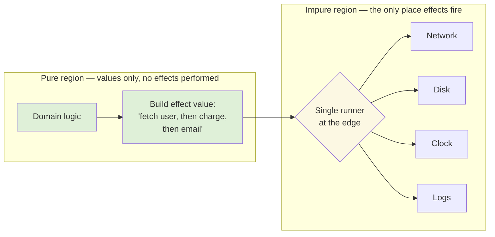
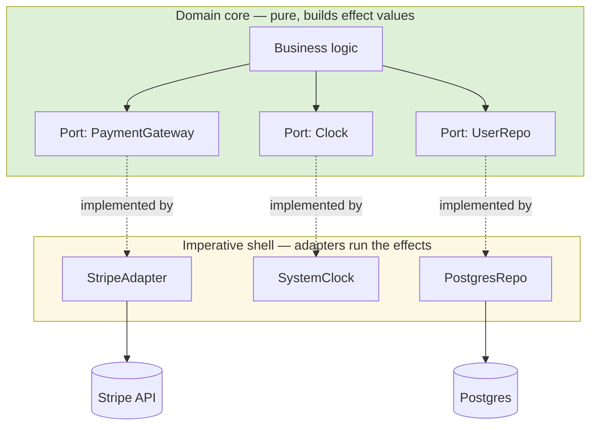

# Effect Tracking — Senior Level

> **Roadmap:** [Functional Programming](../README.md) → Effect Tracking
>
> *An effect is anything a function does beyond returning a value: it talks to a clock, a disk, a network, a global, the wall. At the senior level the question stops being "how do I tame side effects in a function" and becomes "how do I make effects a first-class part of my architecture — described as values, pushed to the edge, and tracked either by the type system or by enforced discipline — so that a 200-file service stays testable, resource-safe, and reasoning-friendly under change?"*

---

## Table of Contents

1. [Introduction](#introduction)
2. [Prerequisites](#prerequisites)
3. [Effects as Values: the IO Monad](#effects-as-values-the-io-monad)
4. [Effect Systems: Tagless-Final, Algebraic Effects, ZIO](#effect-systems-tagless-final-algebraic-effects-zio)
5. [What Effect Libraries Actually Buy You](#what-effect-libraries-actually-buy-you)
6. [Hexagonal Synergy: Effects at the Boundary](#hexagonal-synergy-effects-at-the-boundary)
7. [Discipline vs Types in Mainstream Languages](#discipline-vs-types-in-mainstream-languages)
8. [Modeling Effects Explicitly at Scale: Capabilities and Reader](#modeling-effects-explicitly-at-scale-capabilities-and-reader)
9. [Trade-offs: Complexity vs Guarantees](#trade-offs-complexity-vs-guarantees)
10. [Common Mistakes](#common-mistakes)
11. [Test Yourself](#test-yourself)
12. [Cheat Sheet](#cheat-sheet)
13. [Summary](#summary)
14. [Further Reading](#further-reading)
15. [Related Topics](#related-topics)

---

## Introduction

> Focus: **the design and architecture implications of tracking effects** — not "avoid side effects," but "where do effects live, who describes them, who runs them, and what does that decision buy or cost an entire system?"

A junior learns to separate pure logic from I/O. A middle engineer learns the *functional core / imperative shell* pattern: pure decision-making in the center, effects at the rim. The senior question is structural and economic:

- **Where is the line between "describing an effect" and "performing it" drawn in my system, and is it drawn *once at the edge* or *everywhere*?**
- **Is the absence of effects in my "pure" core enforced by the type system, by a runtime, or by nothing but reviewer vigilance?**
- **What do I pay — in cognitive load, build complexity, hiring, and stack traces — for each increment of that enforcement, and is the guarantee worth it for *this* system?**

The central reframe is this: **an effect is a value you build, not an action you perform.** `sendEmail(user)` *does* something the instant control reaches it. `sendEmail(user)` as an *effect value* is a description — "an email-sending, when run, will produce a `Unit`" — that does nothing until a single runner at the program's edge executes it. That one shift unlocks everything else in this file: you can pass the description around, compose it with others, retry it, time it out, run it on a thread pool, swap it for a no-op in tests, and reason about it equationally — because building the description has no effect, only running it does.



The whole discipline is about widening the green region and shrinking the yellow runner to a single, audited point. Whether you achieve that with a Haskell `IO` type, a Scala `ZIO`, a TypeScript `Effect`, or a hand-rolled Go interface and a code-review rule is a *trade-off*, not a religion — and choosing well is the senior's job.

---

## Prerequisites

- **Required:** [`junior.md`](junior.md) and [`middle.md`](middle.md) — you can identify side effects and apply the functional-core/imperative-shell split by hand.
- **Required:** [Monads — Plain English](../09-monads-plain-english/senior.md) — `IO` is "just another monad," and `flatMap`/`>>=` is how effect descriptions are sequenced. This file assumes you are comfortable with that.
- **Required:** [Pure Functions & Referential Transparency](../02-pure-functions-and-referential-transparency/senior.md) — the property an effect *breaks* and that effect tracking restores.
- **Helpful:** [Immutability](../03-immutability/senior.md), and the [dependency injection](../../design-patterns/README.md) idea — the Reader pattern is DI in functional clothing.
- **Helpful:** [Functional vs OO in Practice](../11-functional-vs-oo-in-practice/senior.md) for where these techniques meet mainstream OO codebases.

---

## Effects as Values: the IO Monad

### The problem effect tracking solves

A function signature is a contract. `int parse(String s)` promises: give me a string, get an int, and *nothing else happens*. The moment a function secretly reads the clock, writes a log, or hits the network, the signature is lying — the type says "pure transformation," the body says "I touch the world." Effect tracking's goal is to make signatures stop lying: an effectful function should *say so in its type*.

### IO as a description, not an action

The `IO` type (Haskell's canonical form, mirrored by Scala `cats.effect.IO`, ZIO, and TypeScript's `Effect`) is a **value that describes an effectful computation**. Constructing it performs nothing.

```haskell
-- Haskell. Building this value does NOT print anything.
greet :: IO ()
greet = putStrLn "hello"

-- It is referentially transparent to build. These two are identical:
twice  = greet >> greet
twice' = let g = greet in g >> g
-- Both, when RUN, print "hello" twice. The 'value' greet can be duplicated,
-- stored, passed around — only the runtime at `main` actually performs it.

main :: IO ()
main = twice          -- the runtime (the RTS) is the single runner at the edge
```

The key insight: `greet` is as inert as the string `"hello"` until `main` hands it to the runtime. `IO a` is morally "a recipe that, *when executed by the world*, yields an `a`." Composition with `>>=` (bind / `flatMap`) builds a bigger recipe out of smaller ones — still without running anything:

```haskell
program :: IO ()
program = do
  name <- getLine            -- recipe: "read a line"
  putStrLn ("hi " ++ name)   -- recipe: "print, using the line"
-- `program` is one inert value composed of two. Nothing has happened yet.
```

This is the same monad machinery from [Monads — Plain English](../09-monads-plain-english/senior.md): `IO` is the monad whose "context" is *"interacting with the outside world, in sequence."* `flatMap` threads the world-state implicitly so you write straight-line code while the type tracks "this touches reality."

### Why "value, not action" is the load-bearing idea

Once an effect is a value, four superpowers fall out for free:

| Because the effect is a value, you can… | …which gives you |
|---|---|
| Store it, pass it, return it | First-class composition; build programs out of program-fragments |
| Wrap it (`retry`, `timeout`, `race`) | Cross-cutting concerns as combinators, not scattered `try/catch` |
| Substitute it in a test | A `NoOpEmailer` or in-memory store with no DI framework |
| Defer running it to one place | A single audited "edge" where reality is touched — the imperative shell |

The cost is equally real: every effect is now a wrapped value, so a stack trace runs through the *runner* and the *combinators*, not your call site, and "just call the function" becomes "build the value, then run it." That tension — power vs indirection — is the through-line of this whole topic.

---

## Effect Systems: Tagless-Final, Algebraic Effects, ZIO

A bare `IO` says "this touches *something* in the world." A full **effect system** lets you say *which* something — "this needs a database and a clock, can fail with a `PaymentError`, and nothing else" — and have the compiler enforce it. Three families dominate; you should recognize all three conceptually even if you write Go for a living, because their *ideas* leak into every language.

### 1. Tagless-final (effects as an interface, parameterized over the runner)

Instead of committing to a concrete `IO`, you abstract over "the effect type `F`" and demand only the *capabilities* you need via a typeclass/interface. Your business logic is written against `F[_]` with constraints; you choose the concrete `F` at the edge.

```scala
// Scala, tagless-final sketch. `F[_]` is "some effect type"; we never name it
// in the logic. We only demand the capabilities (algebras) we use.
trait UserRepo[F[_]]  { def find(id: UserId): F[Option[User]] }
trait Clock[F[_]]     { def now: F[Instant] }

// Business logic: polymorphic in F, depends ONLY on declared capabilities.
def lastSeenAge[F[_]: Monad](repo: UserRepo[F], clock: Clock[F], id: UserId): F[Option[Duration]] =
  for {
    user <- repo.find(id)
    t    <- clock.now
  } yield user.map(u => Duration.between(u.lastSeen, t))

// At the edge: pick F = IO for production, F = Id or a State monad for tests.
```

The win: the logic *cannot* perform an effect you didn't grant it — it has no `IO`, only the algebras you passed. Tests instantiate `F` with a pure/synchronous type and need no mocking framework. The cost: heavy type machinery (`F[_]`, typeclass constraints) that newcomers find opaque, and slower compiles.

### 2. Algebraic effects + handlers (effects as resumable operations)

The conceptual frontier (OCaml 5 `effect`/`handler`, the research language Eff, Koka, Unison's `ability`s, and the spirit behind React's "effects"). You *declare* an operation (`Log`, `ReadConfig`, `Ask`), use it directly in straight-line code as if it were a normal call, and a **handler** installed higher up the stack interprets it — including the power to *resume* the computation with a value.

```text
Conceptual shape (not real Go syntax — Go has no algebraic effects):

  perform Log("charged order")     // the code just "asks"; doesn't know who answers
  ...
  handle program with
    Log(msg) -> { write to stdout; resume () }     // production handler
  // in a test, install instead:
    Log(msg) -> { record msg; resume () }           // capturing handler — no I/O
```

The elegance: the *same business code* runs against different handlers — a real one in prod, a recording one in tests — with no parameter threading and no monad transformers. Algebraic effects are, roughly, "`try/catch` that can resume," and they unify exceptions, generators, async/await, and dependency injection under one mechanism. Mainstream languages don't have them yet (it's the most likely *future* of effect tracking), but recognizing the pattern explains a lot — React Hooks, Python generators, and `async/await` are all special-cased instances of the same idea.

### 3. ZIO / Cats-Effect / Effect-TS (the production effect type)

The pragmatic, industrial form. ZIO's core type encodes three things in the signature:

```scala
ZIO[R, E, A]
//   R = the Environment/dependencies it requires (a Clock, a DB, a Config)
//   E = the typed Errors it can fail with (not just Throwable)
//   A = the success value it produces
```

`ZIO[Database & Clock, PaymentError, Receipt]` reads as a *complete contract*: "give me a `Database` and a `Clock`; I will either fail with a `PaymentError` or succeed with a `Receipt`; I touch nothing else." The compiler tracks all three channels. Cats-Effect (`IO` + `Resource` + `Ref`) and Effect-TS (`Effect<A, E, R>`, the same three type parameters, deliberately) are the Scala-pure and TypeScript siblings. These are not academic toys — they run payment systems and trading platforms; their selling point is the bundle of guarantees in the next section.

> **The senior framing:** these three approaches are points on a spectrum of *how much of the effect you lift into the type*. Tagless-final lifts *capabilities*; ZIO lifts *capabilities + errors + the runtime model*; algebraic effects aim to lift everything while keeping straight-line syntax. More in the type = more guarantees and more ceremony.

---

## What Effect Libraries Actually Buy You

Effect types are not bought for purity-as-virtue. They are bought for four concrete, hard-to-get-otherwise properties. A senior evaluating "should we adopt ZIO / Effect-TS?" weighs *these*, not aesthetics.

**1. Testability without mocking frameworks.** Because effects are values parameterized over their dependencies, a test supplies a pure or in-memory implementation. No Mockito, no `unittest.mock.patch`, no monkey-patching the clock — you pass a `TestClock` you can advance by hand, a `Ref`-backed in-memory repo, a recording logger. Determinism comes from construction, not from `freezegun`.

**2. Resource safety (acquire/release that can't leak).** `Resource`/`Scope` guarantees that whatever you acquire is released — even on failure, cancellation, or exception — with the release order being the reverse of acquisition, *enforced by the type*. This is `try/finally` and `defer` done compositionally, so you cannot forget the `finally` and cannot get the ordering wrong when three resources nest.

```scala
// Cats-Effect: the file is GUARANTEED closed — on success, on error, on cancel —
// because `Resource` ties acquisition to release in the type. No leak is possible.
val program: IO[String] =
  Resource.make(openFile("data.csv"))(f => closeFile(f)).use { file =>
    readAll(file)   // even if this throws or is cancelled, closeFile still runs
  }
```

**3. Concurrency that composes.** Fibers (lightweight, library-scheduled threads) let you `race`, `parZip`, `foreachPar`, and time things out as *combinators on effect values*. Because each is a value, `timeout(5.seconds)(fetchUser)` is just wrapping one value in another — no thread-pool plumbing at the call site.

**4. Cancellation / interruption that is safe.** This is the property hardest to get right by hand. When a request is cancelled or a `race` loser must stop, the effect runtime *interrupts* the losing fiber **at safe points** and runs its release actions, so a cancelled download still closes its socket. Go's `context.Context` gives you *cooperative* cancellation (you must check `ctx.Done()` yourself); an effect system makes cancellation structural and resource-safe by default. This is the single capability most teams underestimate and most often get wrong with raw threads.

> The honest summary: effect libraries sell **testability, resource safety, structured concurrency, and safe cancellation** as a bundle the type system enforces. If your system genuinely needs all four (high-concurrency, resource-heavy, correctness-critical), the ceremony pays. If it's a CRUD service with a request-per-thread model and a connection pool that already handles resources, you may be buying a Ferrari to fetch groceries.

---

## Hexagonal Synergy: Effects at the Boundary

Effect tracking and **hexagonal architecture** (ports & adapters) are the same idea told in two vocabularies, which is why they reinforce each other so cleanly.

- **Hexagonal says:** the domain core defines *ports* (interfaces it needs — `PaymentGateway`, `Clock`, `UserRepo`); *adapters* (Stripe client, system clock, Postgres repo) implement them at the edge; the core depends on abstractions, dependencies point inward.
- **Effect tracking says:** the pure core *describes* effects against capabilities it requires; the impure shell *runs* them with concrete implementations.

These line up exactly: **a port is a declared effect capability; an adapter is a concrete effect runner; "the core depends only on ports" is the same statement as "the core builds effect values it cannot itself perform."** Tagless-final's algebras *are* ports. ZIO's `R` environment *is* the set of ports the program requires. The "dependencies point inward" rule *is* "effects are described in the center and performed at the rim."



The practical payoff for a senior: you can adopt the *discipline* of effect tracking in **any** language by being rigorous about hexagonal boundaries, *without* a `Effect` library. The functional core / imperative shell is hexagonal architecture with the effect-as-value lens. When someone says "we don't need ZIO, we have clean architecture," they are partly right — they have the *structure*; what they lack is the *compiler enforcement* that the core never sneaks an effect in. Which brings us to the central senior trade-off.

---

## Discipline vs Types in Mainstream Languages

There are exactly two ways to keep effects out of your pure core: **by types** (the compiler refuses to compile an effect in the wrong place) or **by discipline** (humans agree not to, and reviews/tests/linters catch slips). Go, Java, and Python are overwhelmingly *discipline* languages; Haskell and (with ZIO/Cats-Effect) Scala can be *type* languages. A senior chooses deliberately and knows the failure mode of each.

### Go — discipline, with `context` and interfaces as the only "tracking"

Go has *no* effect type. `func() error` and `func()` look identical to the compiler whether or not they hit the network. Effect tracking in Go is **pure convention**, supported by three habits:

```go
// The Go way: effects live behind interfaces (ports); the core takes them as
// parameters; `context.Context` carries cancellation. The compiler enforces
// NONE of "this is pure" — only the package/interface boundary + review do.
type Clock interface { Now() time.Time }
type UserRepo interface { Find(ctx context.Context, id string) (*User, error) }

// "Pure-ish" core: deterministic given its inputs. Nothing here calls the world
// directly — but the compiler would happily let it. Discipline keeps it clean.
func lastSeenAge(now time.Time, u *User) time.Duration {
    return now.Sub(u.LastSeen)
}

// Shell: the only place the real clock/DB are touched.
func Handler(ctx context.Context, repo UserRepo, clock Clock, id string) (time.Duration, error) {
    u, err := repo.Find(ctx, id)        // effect, performed here at the edge
    if err != nil { return 0, err }
    return lastSeenAge(clock.Now(), u), nil   // pure call, real effect already done
}
```

Go's bet: *small surface, simple mental model, no type ceremony* — at the cost that nothing stops a junior from calling `time.Now()` or `http.Get` in the middle of "pure" logic. You catch it in review, with a layered-import linter (`go-arch-lint`/depguard forbidding the domain package from importing `net/http`), and by passing the clock as a parameter so tests are deterministic. The error channel (`error` return) is the *one* effect Go does track structurally — and even that by convention, not enforcement.

### Java — discipline, with a richer toolbox

Java tracks effects no better than Go at the type level (checked exceptions are the lone, much-maligned exception), but the ecosystem gives you more structural levers: package-private boundaries, `sealed` interfaces for ports, ArchUnit to *fail the build* when the domain package imports `javax.sql` or `java.net`, and Spring's DI to wire adapters. The discipline is the same — pure core, ports as interfaces, adapters at the edge — just with stronger automated guardrails than Go's.

```java
// ArchUnit makes the "effects stay at the edge" rule executable — discipline
// promoted to a build-failing fitness function (see Bad Structure → senior).
@ArchTest
static final ArchRule domain_is_effect_free =
    noClasses().that().resideInAPackage("..domain..")
        .should().dependOnClassesThat().resideInAnyPackage("java.net..", "java.sql..", "..http..");
```

### Python — discipline, weakest enforcement

Dynamic typing means even the interface boundary is a gentleman's agreement. The practical pattern is identical (functional core / imperative shell, inject the clock and the repo, keep I/O in thin shell functions), but your only enforcement is tests, type hints checked by `mypy`/`pyright`, and review. `@dataclass(frozen=True)` for inputs and passing every dependency explicitly (no module-level `requests.get`) is how seniors keep Python cores testable. The danger is highest here: nothing visible distinguishes a pure function from one that quietly calls an API.

### Haskell / Scala — by types

Haskell makes it *physically impossible* to perform `IO` in a function typed `Int -> Int` — there is no `IO` in scope and no escape hatch (`unsafePerformIO` is named to shame you). Scala with ZIO/Cats-Effect gets close: a function returning `A` cannot perform an effect; only one returning `IO[A]`/`ZIO[...]` can. The compiler *is* the reviewer. The cost is everything discussed above: ceremony, learning curve, and a stack of abstractions over the simple act of "call a function."

> **The senior's calibration.** Type-enforcement is *strictly stronger* but *not always worth it*. On a 5-person Go team shipping a CRUD API, discipline + a layering linter + injected clocks buys 90% of the benefit for 10% of the cost. On a 40-engineer payment platform where a leaked connection or a missed cancellation is a real incident, the compiler-enforced guarantees of an effect system can be cheaper than the incidents. The wrong move is dogma in either direction: forcing ZIO onto a team that will fight it, or hand-rolling discipline on a system whose correctness genuinely needs the types.

---

## Modeling Effects Explicitly at Scale: Capabilities and Reader

When a service has dozens of effects (DB, cache, clock, feature flags, metrics, three external APIs), two patterns keep "what does this code touch?" answerable at a glance.

### Capabilities: pass the *authority* to perform an effect

A **capability** is an object whose *possession* grants the right to perform an effect. Instead of any function reaching for a global `Logger` or `db`, a function can only log if it was *handed* a `Logger`. This makes effects **visible in signatures** and **least-privilege by construction**: a function that doesn't receive a `PaymentGateway` provably cannot charge a card — you can verify it by reading the parameter list, not the body.

```go
// Go: capabilities as an explicit struct of ports. A function's parameters
// declare exactly which effects it may perform. No ambient globals.
type Caps struct {
    Repo    UserRepo
    Clock   Clock
    Metrics Metrics
    // NOTE: no PaymentGateway here -> this slice of code provably cannot charge.
}

func renewSubscription(ctx context.Context, c Caps, id string) error {
    u, err := c.Repo.Find(ctx, id)         // allowed: Repo was granted
    if err != nil { return err }
    c.Metrics.Inc("renewal.attempt")        // allowed: Metrics was granted
    _ = c.Clock.Now()
    // c.Charge(...)  // <- would not compile: no payment capability in Caps
    return nil
}
```

This is the same idea ZIO encodes as its `R` environment and tagless-final encodes as typeclass constraints — *"the set of effects this code may perform is declared, not ambient."* Globals (a package-level `db`, a singleton `Logger`) are the anti-capability: they grant *every* function authority over *every* effect invisibly, which is exactly what makes a God Object untestable.

### The Reader pattern: dependencies as an implicit, threaded environment

When threading a `Caps` struct through twenty functions becomes noise, the **Reader** monad (or its `ZIO[R, …]` / `Effect<…, …, R>` industrial form) makes the environment *implicit*: every function in the chain reads from a shared `R` without you passing it explicitly, and you provide `R` once at the edge.

```scala
// Reader, conceptually: each step "reads" the environment it needs; the env is
// supplied ONCE at the edge. This is dependency injection with no framework —
// the dependency set is a type parameter the compiler tracks.
type Env = HasDb with HasClock
def step1: Reader[Env, A] = Reader(env => ... env.db ...)
def step2(a: A): Reader[Env, B] = Reader(env => ... env.clock ...)

val pipeline: Reader[Env, B] = for { a <- step1; b <- step2(a) } yield b
// pipeline.run(productionEnv)   // <- the single injection point, at main()
```

Reader is "dependency injection as a value": instead of a DI container wiring objects, the *type* `Reader[Env, A]` says "I need an `Env` to produce an `A`," and `Env` is exactly the set of effect capabilities required. Provide a `TestEnv` and the whole pipeline runs in-memory and deterministically. The cost is the usual monadic ceremony, and that nested environments (Reader over a `DB` over an `Either`) push you toward monad transformers — the friction that *drove the industry to ZIO*, which folds environment + error + async into one type to avoid the transformer stack.

> **Scaling rule of thumb:** explicit capability structs scale fine to a few effects and read beautifully in Go/Java; the Reader/ZIO `R` environment earns its ceremony only when you have *many* effects threaded through *deep* call chains and you're already paying for an effect type. Reach for the heavier tool when the parameter-threading itself becomes the smell.

---

## Trade-offs: Complexity vs Guarantees

Every step up the effect-tracking ladder trades **cognitive and operational complexity** for **compiler-enforced guarantees**. The senior decision is *where on the ladder this system belongs* — and it is not "as high as possible."

| Approach | Guarantee you gain | Price you pay |
|---|---|---|
| Ad-hoc (effects anywhere) | None | Untestable, leaks, hidden coupling — the default rot |
| Discipline (core/shell, injected deps) | Testable, effects localized — *if everyone follows it* | Enforced only by review + linters; one slip and it's invisible |
| Bare `IO`/effect value | "This touches the world" is in the type | Indirection; build-then-run; worse stack traces |
| Tagless-final / capabilities | *Which* effects are declared and least-privilege | Type machinery (`F[_]`), learning curve, slower compiles |
| Full effect system (ZIO/Effect-TS) | Errors + deps + concurrency + cancellation, all typed | Steep curve, ecosystem lock-in, debugging through a runtime |

The forces a senior weighs:

- **Team & hiring.** An effect system is a multiplier *only* if the team can wield it; otherwise it's a productivity tax and a bus-factor risk. The best architecture your team will actually maintain beats the better one they'll fight.
- **Debuggability.** Effects-as-values means a stack trace runs through combinators and the runtime, not your call site. Effect libraries invest heavily in *fiber dumps* and execution traces precisely because the naive stack trace is degraded. Budget for that.
- **Where the guarantee actually matters.** Resource safety and safe cancellation are *enormously* valuable in a high-concurrency resource-heavy service and *near-worthless* in a batch script. Pay for guarantees proportional to the cost of the failure they prevent.
- **Incrementality.** You do not need the whole ladder. Most teams' highest-ROI rung is the *discipline* rung — functional core / imperative shell, inject the clock, ports & adapters, a layering linter — which is free, language-agnostic, and captures the majority of the benefit. Climb higher only when a concrete pain (leaks, cancellation bugs, untestable concurrency) justifies it.

> **The frame:** effect tracking is not a purity contest; it's *risk-adjusted investment in correctness and testability*. More tracking = more guarantee = more complexity. Buy the rung whose guarantee is worth more than its complexity *for this system, this team, this year* — and no higher.

---

## Common Mistakes

1. **Performing the effect at construction time.** Writing `val x = sendEmail(u)` where `sendEmail` *runs* immediately, then wondering why it can't be retried or tested. The whole point is that building the value does *nothing*; if your "effect value" fires on construction, you have a side effect wearing a costume. *Make construction inert; run only at the edge.*
2. **Adopting an effect library for the type, ignoring the cost.** Bolting ZIO/Cats-Effect onto a team that will spend six months fighting `F[_]` and monad transformers, on a CRUD service that needed none of the concurrency guarantees. *Match the rung to the actual pain; discipline first.*
3. **Confusing "we have clean architecture" with "effects are tracked."** Ports & adapters give you the *structure*; without compiler enforcement (or at least a layering linter), nothing stops the core from importing `net/http`. *In discipline languages, add a fitness function (ArchUnit / go-arch-lint) or the boundary erodes.*
4. **Ambient globals as effects.** A package-level `db`, a singleton `Logger`, `time.Now()` sprinkled through the core. These are capabilities granted invisibly to everything — the opposite of effect tracking, and the reason the code is untestable. *Pass capabilities explicitly; inject the clock.*
5. **A wide, scattered "edge."** Calling the network from twelve places instead of one. Effect tracking's value collapses if the runner isn't a single audited point. *One imperative shell; the core only builds descriptions.*
6. **Using `unsafePerformIO` / escape hatches to "make it compile."** Defeating the type system's whole purpose to dodge a refactor. *The escape hatch is for FFI and the truly-justified; reaching for it routinely means your boundary is wrong.*
7. **Mocking the world instead of injecting it.** Reaching for `mock.patch('module.time')` or Mockito when the real fix is to take the clock/repo as a parameter (a capability). *If you must monkey-patch globals to test, your effects aren't tracked — make the dependency explicit.*
8. **Forgetting cancellation and resource cleanup are separate problems.** Adopting fibers/goroutines for concurrency but never wiring interruption to resource release, so a cancelled operation leaks its socket. *Tie acquire/release together (`Resource`/`defer`) and verify cleanup runs on cancel, not just on success.*

---

## Test Yourself

1. Explain why "an effect is a value you build, not an action you perform" is the load-bearing idea of effect tracking. What four capabilities fall out of it?
2. A teammate says "Go can't do effect tracking because it has no `IO` type." Correct and complete this statement — what *can* Go do, and what is the precise thing it gives up versus Haskell?
3. Map the three hexagonal-architecture concepts (port, adapter, "dependencies point inward") onto their effect-tracking equivalents. Why does this mapping mean you can practice effect tracking without an effect library?
4. ZIO's core type has three parameters, `ZIO[R, E, A]`. Name each and explain what `ZIO[Database & Clock, PaymentError, Receipt]` promises and forbids.
5. Name the four guarantees an industrial effect library (ZIO/Cats-Effect/Effect-TS) is bought for. For a single-threaded batch ETL script, which are nearly worthless and which still matter?
6. What is a *capability* in the effect sense, and why is a package-level global `Logger` its exact opposite? How does the capability approach give you least-privilege "for free"?
7. The Reader pattern and ZIO's `R` environment solve the same problem. What is that problem, and what friction in the simpler (Reader + monad transformer) approach pushed the industry toward ZIO?
8. Give two concrete signals that a system has climbed *too high* on the effect-tracking ladder for its team and needs, and two signals that it is climbing *too low*.

<details>
<summary>Answers</summary>

1. Because building an effect is inert, the description is just data: you can **store/pass/return it** (composition), **wrap it** with `retry`/`timeout`/`race` (cross-cutting concerns as combinators), **substitute it** in tests (no mocking framework — pass a no-op or in-memory impl), and **defer running it** to one audited edge (a single imperative shell). All four require that construction performs nothing; only the runner performs.
2. Go *can* do effect tracking — by **discipline**: functional core / imperative shell, effects behind interfaces (ports) passed as parameters, `context.Context` for cancellation, and a layering linter (go-arch-lint/depguard) forbidding the domain package from importing `net/http`/`database/sql`. What it gives up vs Haskell is **compiler enforcement**: `func() error` and a pure function are indistinguishable to the Go compiler, so nothing *prevents* calling `time.Now()`/`http.Get` mid-core — only review, linters, and tests catch it. Haskell makes performing `IO` in a non-`IO` type physically impossible.
3. **Port = declared effect capability** (the algebra/interface the core requires); **adapter = concrete effect runner** (the impl at the edge); **"dependencies point inward" = "the core builds effect values it cannot itself perform; only the rim runs them."** Because the mapping is exact, rigorous hexagonal *structure* gives you the effect-tracking discipline in any language — what you lack without a library is compiler *enforcement* that the core never sneaks an effect in (hence the need for a fitness function in discipline languages).
4. `R` = the environment/dependencies it requires; `E` = the typed errors it can fail with; `A` = the success value. `ZIO[Database & Clock, PaymentError, Receipt]` promises: "given a `Database` and a `Clock`, I either fail with a `PaymentError` or succeed with a `Receipt`." It forbids: requiring any *other* dependency (not in `R`), failing with any *other* error type, and — implicitly — performing effects outside what those capabilities grant.
5. Testability without mocking, resource safety (acquire/release), structured concurrency, and safe cancellation/interruption. For a single-threaded batch ETL: **concurrency and cancellation are nearly worthless** (no fibers, nothing to interrupt mid-flight in the simple case); **resource safety and testability still matter** (you still open files/connections that must close, and you still want deterministic tests) — though plain `try/finally`/`defer` may cover the resource need without a full effect type.
6. A capability is an object whose *possession* grants the right to perform an effect; a function can only perform the effect if it was *handed* the capability, so the parameter list *is* the effect inventory. A global `Logger` is the opposite: it grants logging authority to *every* function *invisibly*, so signatures no longer tell the truth and you must read bodies. Capabilities give least-privilege for free because a function that wasn't passed a `PaymentGateway` *provably cannot charge* — verifiable from the signature alone.
7. The problem: **threading dependencies (the effect environment) through deep call chains without manual parameter-passing**, while keeping them swappable for tests. Reader makes the environment implicit but **composing Reader with error (`Either`) and async pushes you into a monad-transformer stack** (Reader over EitherT over IO…), which is verbose, slow to compile, and hard to teach. ZIO folds environment + typed error + async/concurrency into *one* type (`ZIO[R, E, A]`), eliminating the transformer stack — that friction is exactly what drove its adoption.
8. **Too high:** the team spends more time fighting `F[_]`/transformers/the runtime than shipping; stack traces are unreadable and on-call can't debug incidents; the guarantees bought (e.g., structured concurrency) aren't actually exercised by the workload. **Too low:** effects are scattered globals and the core is untestable without monkey-patching; you keep shipping resource leaks or cancellation bugs that the next rung would prevent structurally; "pure" core functions silently call the clock/network and tests are flaky as a result.

</details>

---

## Cheat Sheet

| Concept | One-line essence |
|---|---|
| **Effect** | Anything a function does beyond returning a value (clock, disk, net, globals) |
| **IO as value** | An effect is a *description you build*; only a single runner at the edge performs it |
| **Tagless-final** | Logic polymorphic in `F[_]`, demanding only declared capabilities; pick concrete `F` at the edge |
| **Algebraic effects** | Declare operations, install handlers that interpret (and can *resume*) — the likely future, rare today |
| **ZIO `[R, E, A]`** | Type tracks required deps + typed errors + success; the industrial effect type |
| **What libraries buy** | Testability (no mocks) · resource safety · structured concurrency · safe cancellation |
| **Hexagonal mapping** | Port = capability; adapter = runner; "deps point inward" = "core builds, rim runs" |
| **Discipline vs types** | Go/Java/Python keep effects out of the core by *convention + linters*; Haskell/Scala-ZIO by the *compiler* |
| **Capability** | Possessing the object grants the effect; the parameter list *is* the effect inventory → least-privilege |
| **Reader / `R`** | Dependencies as an implicit threaded environment; DI as a value, supplied once at the edge |

**Three golden rules:**
- *Build effects as values in the center; run them at one audited edge — widen the pure region, shrink the runner to a point.*
- *Choose discipline vs types deliberately: type-enforcement is strictly stronger but not always worth its complexity for this team and system.*
- *Effect tracking is risk-adjusted investment in correctness — buy the rung whose guarantee outweighs its cost, and no higher.*

---

## Summary

- **The reframe:** an effect is a **value you build, then run** — not an action performed on the spot. Construction is inert; a single runner at the edge touches reality. That one shift yields composition, combinators (`retry`/`timeout`), test substitution, and a single audited edge.
- **The `IO` monad** is "just another monad" (see [Monads — Plain English](../09-monads-plain-english/senior.md)): the one whose context is "interacting with the world, in sequence." `flatMap`/`>>=` builds bigger inert recipes from smaller ones.
- **Effect systems** lift more of the effect into the type: **tagless-final** lifts *capabilities*, **ZIO/Cats-Effect/Effect-TS** lift *capabilities + typed errors + the concurrency/runtime model* (`ZIO[R, E, A]`), and **algebraic effects + handlers** aim to lift everything while keeping straight-line syntax — the likely future, rare in mainstream languages today.
- **Libraries are bought for four guarantees:** testability without mocks, resource safety, structured concurrency, and safe cancellation/interruption — the last being the one teams most underestimate.
- **Hexagonal synergy:** port = declared capability, adapter = concrete runner, "dependencies point inward" = "the core builds effect values it cannot itself perform." The mapping is exact, which is why you can practice effect tracking by *discipline* in any language — what you'd lack without a library is compiler *enforcement*.
- **Discipline vs types:** Go, Java, and Python keep effects out of the core by **convention + injected capabilities + layering linters**; Haskell and Scala-with-ZIO do it **by the compiler**. Type-enforcement is strictly stronger but carries real cost (ceremony, learning curve, degraded stack traces).
- **At scale**, make effects explicit with **capabilities** (possession grants the effect; least-privilege by construction) and, when threading them gets noisy, the **Reader pattern / ZIO `R` environment** (DI as a value, supplied once at the edge).
- **The trade-off is the whole job:** each rung up the ladder buys guarantees with complexity. Most teams' highest-ROI rung is *discipline* — functional core / imperative shell, inject the clock, ports & adapters, a fitness function. Climb higher only when a concrete pain (leaks, cancellation bugs, untestable concurrency) justifies the cost.
- Next: [Functional vs OO in Practice](../11-functional-vs-oo-in-practice/senior.md) — where these techniques meet hybrid OO codebases.

---

## Further Reading

- **Functional Programming in Scala** — Chiusano & Bjarnason ("the red book", 2nd ed.) — Part 4 builds `IO` from scratch and motivates effect-as-value rigorously.
- **Functional and Reactive Domain Modeling** — Debasish Ghosh — capabilities, the Reader pattern, and tagless-final applied to real domain code.
- **ZIO documentation & "The Death of Tagless Final" / ZIO design talks** — John De Goes — the industrial argument for folding environment + error + async into one type.
- **Practical FP in Scala** — Gabriel Volpe — tagless-final and Cats-Effect `Resource`/`Ref` in a production-shaped codebase.
- **"Algebraic Effects for the Rest of Us"** — Dan Abramov — the clearest plain-English intro to algebraic effects and why React's "effects" share the lineage.
- **OCaml 5 effects documentation / Koka & Eff language papers** — the research and now-shipping form of algebraic effects + handlers.
- **Out of the Tar Pit** — Moseley & Marks (2006) — the foundational argument for separating essential logic from accidental state/effects.
- **Domain Modeling Made Functional** — Scott Wlaschin — functional core / imperative shell and effects-at-the-edge in F#, highly transferable to mainstream languages.

---

## Related Topics

- [Monads — Plain English](../09-monads-plain-english/senior.md) — `IO` is one monad among many; `flatMap`/`>>=` is how effect descriptions sequence.
- [Pure Functions & Referential Transparency](../02-pure-functions-and-referential-transparency/senior.md) — the property effects break and effect tracking restores.
- [Immutability](../03-immutability/senior.md) — immutable values are what make the pure core's reasoning hold.
- [Functional vs OO in Practice](../11-functional-vs-oo-in-practice/senior.md) — applying these techniques inside hybrid OO codebases (Scala, Kotlin, modern Java).
- [Design Patterns](../../design-patterns/README.md) — Dependency Injection and the Strategy pattern, the OO cousins of capabilities and ports.
- [Functional Programming Roadmap](../README.md) — the paradigm this topic completes the "impure shell" half of.
