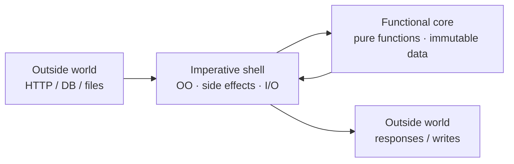

# Functional vs OO in Practice — Junior Level

> **Roadmap:** [Functional Programming](../README.md) → Functional vs OO in Practice
>
> *Two ways to organize a program: bundle data with the behavior that acts on it (OO), or keep data plain and transform it with pure functions (FP). They are tools, not teams — almost all real code mixes both.*

---

## Table of Contents

1. [Introduction — It's Not a War](#introduction--its-not-a-war)
2. [Prerequisites](#prerequisites)
3. [Glossary](#glossary)
4. [OO in a Nutshell](#oo-in-a-nutshell)
5. [FP in a Nutshell](#fp-in-a-nutshell)
6. [Same Problem, Both Ways](#same-problem-both-ways)
7. [Where Each Shines](#where-each-shines)
8. [Mental Models](#mental-models)
9. [Common Mistakes](#common-mistakes)
10. [Test Yourself](#test-yourself)
11. [Cheat Sheet](#cheat-sheet)
12. [Summary](#summary)
13. [Further Reading](#further-reading)
14. [Related Topics](#related-topics)

---

## Introduction — It's Not a War

If you spend any time online, you'll find people arguing that object-oriented programming (OO) is "dead" and that functional programming (FP) is the one true way — or the exact reverse. **Ignore all of it.** That argument is mostly noise, and it has cost beginners years of confusion.

Here is the honest truth, stated plainly:

> **OO and FP are two different ways to organize code, and the languages you'll actually use at work — Java, Python, Go, C#, Kotlin, TypeScript — let you use both, often in the same file.**

- **OO** organizes a program around **objects**: bundles of *data* plus the *behavior* that operates on that data, usually with some internal *state* that changes over time.
- **FP** organizes a program around **pure functions** that take immutable data in and return new data out, without changing anything in place.

These are not opposites the way "hot" and "cold" are. They're more like "using a hammer" and "using a screwdriver." A real project uses both, and the skill that actually matters is knowing *which tool fits the screw in front of you*.

At the junior level your goal is simple: **understand what each paradigm is, recognize the shape of each in real code, and stop treating the choice as a moral question.** You don't need to pick a side. You need to read both fluently and reach for whichever makes the current problem clearer.

> **The mindset shift:** the question is never "Is OO better than FP?" It's "For *this specific piece of code*, does bundling data-with-behavior help, or does transforming plain data with functions help?" That question has a different answer in different places — even within one program.

---

## Prerequisites

- **Required:** You can write functions, and you've seen at least one `class` (in Java, Python, or any OO language). Examples here use **Java**, **Python**, and **Go**.
- **Required:** You know what *mutable* means — changing a variable or object in place (e.g. `list.append(x)`, `count += 1`).
- **Helpful:** A first look at [Pure Functions & Referential Transparency](../02-pure-functions-and-referential-transparency/junior.md) — the idea that a pure function's output depends only on its input.
- **Helpful:** A first look at [Immutability](../03-immutability/junior.md) — data that, once created, never changes.
- **Helpful:** You've felt the pain of a bug where "some object changed somewhere and I don't know who did it." That experience makes the FP argument click instantly.

You do **not** need to know monads, currying, or any advanced FP. This is a balanced, concrete comparison — not an FP sales pitch.

---

## Glossary

| Term | Definition |
|------|-----------|
| **Paradigm** | A style of organizing code. OO and FP are two paradigms; so are procedural and logic programming. |
| **Object** | A bundle of *data* (fields) and *behavior* (methods) that act on that data. The core unit of OO. |
| **State** | Data that changes over time. A bank-account object's `balance` is state. |
| **Mutation** | Changing existing data in place. `account.balance -= 10` mutates state. |
| **Method** | A function that belongs to an object and usually reads or changes that object's data. |
| **Encapsulation** | Hiding an object's internal data behind methods, so outsiders can't poke at it directly. A core OO idea. |
| **Polymorphism** | "Many shapes": different object types responding to the same method call in their own way (e.g. every `Shape` has `area()`). |
| **Pure function** | A function whose output depends only on its inputs, with no side effects — calling it twice with the same input always gives the same result. The core unit of FP. |
| **Side effect** | Anything a function does *besides* returning a value: changing a variable, writing a file, printing, calling a database. |
| **Immutable data** | Data that can't be changed after it's created. To "change" it, you build a new copy. |
| **Side-effect-free / referentially transparent** | Code you could replace with its result without changing the program. |

---

## OO in a Nutshell

**OO bundles data with the behavior that acts on it, and lets that data change over time.**

The mental picture: a program is a collection of **objects** that **own their data** and **respond to messages** (method calls). You don't reach inside an object; you ask it to do something, and it manages its own state.

```java
// Java — an OO bank account: data + behavior bundled, state changes in place
public class Account {
    private double balance;            // state, hidden (encapsulated)

    public Account(double opening) { this.balance = opening; }

    public void deposit(double amt)  { balance += amt; }      // mutates state
    public void withdraw(double amt) {
        if (amt > balance) throw new IllegalStateException("insufficient funds");
        balance -= amt;                                       // mutates state
    }
    public double getBalance() { return balance; }            // reads state
}
```

```java
Account a = new Account(100);
a.deposit(50);     // the SAME object now holds 150
a.withdraw(30);    // the SAME object now holds 120
a.getBalance();    // 120
```

Notice the defining traits:

- **Data and behavior live together.** `balance` and the methods that change it are in one class.
- **State is mutated in place.** `a` is the same object the whole time; its `balance` field changes.
- **Internals are hidden (encapsulation).** Outsiders can't write `a.balance = -999`; they must go through `deposit`/`withdraw`, which enforce the rules.
- **Polymorphism** lets different types share an interface. Below, three shapes each answer `area()` their own way:

```java
interface Shape { double area(); }
class Circle    implements Shape { /* ... */ public double area() { return Math.PI * r * r; } }
class Square    implements Shape { /* ... */ public double area() { return side * side; } }
// Calling code doesn't care which shape it holds — it just calls shape.area().
```

OO's great strength is that it **models things that genuinely have identity and changing state** — a shopping cart, a game character, a database connection, a UI button. It also makes **extension easy**: add a new `Shape` without touching the code that uses shapes.

---

## FP in a Nutshell

**FP keeps data plain and immutable, and transforms it with pure functions.**

The mental picture: a program is a **pipeline of transformations**. Data flows in, functions reshape it into new data, and nothing is changed in place. There's no hidden state to track because functions only depend on what you hand them.

```python
# Python — an FP bank account: data is plain & immutable, functions transform it
from dataclasses import dataclass, replace

@dataclass(frozen=True)          # frozen = immutable: fields can't be reassigned
class Account:
    balance: float

def deposit(acc: Account, amt: float) -> Account:
    return replace(acc, balance=acc.balance + amt)     # returns a NEW account

def withdraw(acc: Account, amt: float) -> Account:
    if amt > acc.balance:
        raise ValueError("insufficient funds")
    return replace(acc, balance=acc.balance - amt)     # returns a NEW account
```

```python
a0 = Account(100)
a1 = deposit(a0, 50)     # a0 is still 100; a1 is a NEW account with 150
a2 = withdraw(a1, 30)    # a1 is still 150; a2 is a NEW account with 120
a2.balance               # 120  — and a0, a1 are untouched
```

Notice the defining traits:

- **Data is plain and immutable.** `Account` just holds a number; nothing mutates it. To "change" the balance you build a *new* `Account`.
- **Behavior lives in standalone functions.** `deposit` and `withdraw` aren't methods on the account — they're functions that take an account and return a new one.
- **Functions are pure.** `deposit(a0, 50)` always returns 150 given a 100-balance account. No matter when you call it, no matter what else ran, the answer is the same. That makes it trivial to test and reason about.
- **History is preserved for free.** `a0`, `a1`, `a2` all still exist. You get an undo trail without writing one.

FP's great strength is that it **eliminates whole categories of bugs** — the "who changed this object behind my back?" class — because nothing changes behind your back. It excels at **data transformation**: parsing, calculations, report generation, anything that's "take this, produce that."

> If you've used `map`, `filter`, or `reduce`, list comprehensions, or `Optional`/`Result` types, you've already written FP — even in an "OO language." See [Map / Filter / Reduce](../04-map-filter-reduce/junior.md).

---

## Same Problem, Both Ways

Concrete beats abstract. Here's **one task** — *total up the prices of the in-stock items in a cart* — written in both styles, in three languages, so you can see the shapes side by side.

### Java — OO style

Behavior bundled into a `Cart` object that holds and mutates its own state.

```java
import java.util.*;

class Item {
    String name; double price; boolean inStock;
    Item(String n, double p, boolean s) { name = n; price = p; inStock = s; }
}

class Cart {
    private final List<Item> items = new ArrayList<>();   // mutable state
    private double total = 0;                             // mutable state

    public void add(Item it) {                            // mutates the cart
        items.add(it);
        if (it.inStock) total += it.price;                // running total kept in state
    }
    public double total() { return total; }
}

// usage
Cart cart = new Cart();
cart.add(new Item("pen", 2.0, true));
cart.add(new Item("rare book", 40.0, false));   // out of stock, ignored
cart.add(new Item("mug", 8.0, true));
cart.total();                                   // 10.0
```

### Java — FP style

Plain data; a pure transformation pipeline with the Streams API. No object owns a running total.

```java
import java.util.*;

record Item(String name, double price, boolean inStock) {}   // immutable data

double total = items.stream()
    .filter(Item::inStock)            // keep only in-stock items
    .mapToDouble(Item::price)         // turn each into its price
    .sum();                           // fold them into one number
// 10.0 — `items` is never modified, no Cart object, no running state
```

### Python — OO style

```python
class Cart:
    def __init__(self):
        self._items = []        # mutable state
        self._total = 0.0       # mutable state

    def add(self, name, price, in_stock):
        self._items.append((name, price, in_stock))   # mutates the cart
        if in_stock:
            self._total += price                       # running total in state

    def total(self):
        return self._total

cart = Cart()
cart.add("pen", 2.0, True)
cart.add("rare book", 40.0, False)
cart.add("mug", 8.0, True)
cart.total()                       # 10.0
```

### Python — FP style

```python
items = [("pen", 2.0, True), ("rare book", 40.0, False), ("mug", 8.0, True)]

total = sum(price for _, price, in_stock in items if in_stock)
# 10.0 — `items` untouched, no object, just a transformation over plain data
```

### Go — both, in one language

Go is interesting because it's neither a "true OO" nor a "functional" language — and yet you can write the task in both shapes. The OO-ish version attaches a method to a struct that holds state; the FP-ish version is a plain function over a slice.

```go
package main

import "fmt"

type Item struct {
    Name    string
    Price   float64
    InStock bool
}

// --- OO-ish: a Cart with state and a method that mutates it ---
type Cart struct {
    items []Item
    total float64 // running state
}

func (c *Cart) Add(it Item) { // method with a pointer receiver mutates the cart
    c.items = append(c.items, it)
    if it.InStock {
        c.total += it.Price
    }
}

// --- FP-ish: a pure function; no state, returns a value, mutates nothing ---
func totalInStock(items []Item) float64 {
    total := 0.0
    for _, it := range items { // a loop, but it touches no outside state
        if it.InStock {
            total += it.Price
        }
    }
    return total
}

func main() {
    items := []Item{
        {"pen", 2.0, true},
        {"rare book", 40.0, false},
        {"mug", 8.0, true},
    }

    // OO-ish
    cart := &Cart{}
    for _, it := range items {
        cart.Add(it)
    }
    fmt.Println(cart.total) // 10

    // FP-ish — same answer, no object, input untouched
    fmt.Println(totalInStock(items)) // 10
}
```

> **What to notice across all six versions:** the OO versions create an object that *holds and changes* a running total; the FP versions *take data in and return an answer*, leaving the input alone. Neither is wrong. The FP versions are shorter and easier to test in isolation (no setup, no object lifecycle). The OO versions shine the moment the cart needs to *do more* — apply coupons, track quantity changes, fire "item added" events — i.e. when it has genuine, evolving identity.

---

## Where Each Shines

This is the heart of the topic — and the rest of the FP roadmap goes deeper. As a junior, internalize these rough leanings (rules of thumb, not laws):

| Situation | Leans toward | Why |
|---|---|---|
| Modeling a thing with **identity and changing state** (cart, game entity, connection, UI widget) | **OO** | State and the rules guarding it belong together; encapsulation protects the invariants. |
| **Transforming data** (parse, calculate, filter, aggregate, format a report) | **FP** | A pure pipeline is shorter, testable in isolation, and free of "who changed this?" bugs. |
| Code that must be **easy to extend with new types** (add a new `Shape`, a new payment method) | **OO** | Polymorphism: add a class, leave callers untouched. |
| Code that must be **easy to extend with new operations** over a fixed set of types | **FP** | Add a new function; you don't have to edit every existing class. |
| **Concurrency** / shared data across threads | **FP** | Immutable data can't be corrupted by two threads at once — no locks needed for reads. See [Immutability](../03-immutability/junior.md). |
| Wiring up the **outside world** (files, network, DB, time, randomness) | **OO / imperative** | Side effects are unavoidable here; isolate them at the edges (the "imperative shell"). See [Effect Tracking](../10-effect-tracking/junior.md). |

A widely used architecture — the **functional core, imperative shell** — combines both deliberately: write the *decision-making* logic as pure functions (FP, easy to test), and keep the *side effects* (I/O, mutation) in a thin outer layer (imperative/OO). Most well-designed modern programs look like this whether or not anyone named it.



> The takeaway: you don't choose OO *or* FP for a whole program. You choose, region by region, based on whether that region is mostly *state and identity* (OO) or mostly *data transformation* (FP).

---

## Mental Models

Four ways to feel the difference in your gut:

1. **Nouns vs verbs.** OO thinks in **nouns first**: "I have an `Account`; what can it *do*?" FP thinks in **verbs first**: "I have a `transform`; what does it *take* and *return*?" Most problems have both a noun and a verb worth modeling — that's why blending works.

2. **The kitchen vs the recipe.** OO is a **kitchen appliance** that holds ingredients and changes their state when you press buttons (a blender with stuff inside). FP is a **recipe**: ingredients go in, a dish comes out, the ingredients on the counter are untouched and you can run the recipe again identically.

3. **"Ask the object" vs "feed the function."** In OO you *send a message* to an object and trust it to manage itself (`account.deposit(50)`). In FP you *feed data to a function* and take the result (`deposit(account, 50)`). Same operation, opposite direction of control.

4. **Where does the truth live?** In OO, the current truth lives *inside* objects as mutable state — you must ask them. In FP, truth lives in the *values flowing through*, and old values stick around. If you've ever wished you could see "what was the cart *before* that update," FP gives you that for free.

---

## Common Mistakes

Mistakes juniors make *about the comparison itself*, not about either paradigm:

1. **Treating it as a war you must win.** "FP is superior / OO is dead" is a teenager's take. Senior engineers reach for both. The dogmatist writes worse code because they refuse half their tools.
2. **Thinking your language forces one paradigm.** Java, Python, Go, C#, Kotlin, and JS all support both. You can write a pure function in Java and a stateful object in Python. The language rarely decides; *you* do, per region of code.
3. **Believing "OO = classes" and "FP = no classes."** Not quite. You can write thoroughly *un*-OO code that's stuffed with classes (data-only classes used by free functions — that's FP-flavored), and you can write OO-style code with closures and no `class` keyword. The real distinction is **mutable bundled state (OO)** vs **pure transformation of immutable data (FP)**.
4. **Forcing FP purity onto inherently stateful, I/O-heavy code.** A database write *is* a side effect. Pretending otherwise produces convoluted code. Isolate the effect; don't deny it. (That's the imperative shell.)
5. **Over-engineering with class hierarchies when a function would do.** If a "class" has one method and no real state, it's probably a function wearing a costume. The reverse is also a mistake: a sprawling pure-function tangle that should have been one cohesive object. Match the shape to the problem.
6. **Confusing "uses `map`/`filter`" with "is fully functional."** Using the FP trio is great and counts as FP-in-the-small, but a program can use `map` everywhere and still be built around mutable shared state. Style in the small ≠ architecture in the large.

---

## Test Yourself

1. In one sentence each, define OO and FP by their *core unit* (what each is organized around).
2. Look at this Python and say whether it's OO-style or FP-style, and what single word gives it away:
   ```python
   def normalize(scores):
       hi = max(scores)
       return [s / hi for s in scores]
   ```
3. The cart examples kept a *running total* in the OO version but *recomputed* it in the FP version. Name one advantage of each choice.
4. A teammate says: "We should rewrite our whole service in a functional style — no classes allowed." What's wrong with this position, and what would a balanced answer be?
5. You're modeling a multiplayer game character that gains XP, takes damage, and changes equipment many times per second during play. Which paradigm leans more naturally to the character itself, and why?
6. Where in a typical program do side effects (DB writes, HTTP calls) belong if you're using a "functional core, imperative shell" design?

<details>
<summary>Answers</summary>

1. **OO** is organized around **objects** — bundles of data plus the behavior that acts on it, with state that changes over time. **FP** is organized around **pure functions** that transform immutable data, returning new values instead of mutating.
2. **FP-style.** The giveaway is that it **takes data in and returns new data** (`return [...]`) without mutating `scores` or any outside state — it's a pure function. (No `self`, no object, no mutation.)
3. **Running total (OO):** reading the total is instant — it's already computed and stored. **Recompute (FP):** there's no stale-total bug possible (the total is always derived from the current items), and the input list is never mutated, so it's simpler to reason about and test. The trade-off is speed (recompute) vs a stored value that must be kept in sync (state).
4. The "no classes allowed" absolutism is the mistake — it's dogma, not engineering. Real services have stateful, I/O-heavy parts (connections, sessions, request handlers) where OO/imperative code is the natural fit. A balanced answer: *push the decision logic into pure functions (a functional core) for testability, and keep the stateful/effectful parts in a thin OO/imperative shell.* Use both deliberately.
5. **OO leans more naturally** to the character. It has genuine **identity and rapidly changing state** (XP, health, equipment) that many systems read and update — exactly the case encapsulated mutable state was made for. (Some game engines still use FP-ish "new state each frame" designs, but the default intuition for a junior is: identity + frequent in-place change → OO.)
6. At the **edges** — the **imperative shell**. The pure functional core makes decisions and returns *descriptions* of what to do; the shell performs the actual DB writes and HTTP calls. This keeps the testable logic free of side effects.

</details>

---

## Cheat Sheet

| | **OO** | **FP** |
|---|---|---|
| **Core unit** | Object (data + behavior bundled) | Pure function (data → data) |
| **Data** | Often mutable, hidden inside objects | Immutable, plain, passed around |
| **State** | Lives *in* objects, changes in place | Lives *in values* flowing through; old values kept |
| **How you "change" things** | Mutate the object (`a.deposit(50)`) | Build a new value (`deposit(a, 50)` → new `a`) |
| **Extend with new types** | Easy (add a class — polymorphism) | Harder (touch each function) |
| **Extend with new operations** | Harder (touch each class) | Easy (add a function) |
| **Best at** | Identity, changing state, UIs, entities | Transformations, calculations, concurrency safety |
| **Tell-tale sign in code** | `class` with mutable fields + methods | Functions returning new immutable data, `map`/`filter`/`reduce` |

> **One rule to remember:** *It's not OO vs FP. Use OO where there's genuine identity and changing state; use FP where you're transforming data. Most good programs are a pure functional core inside a thin imperative shell.*

---

## Summary

- **OO** organizes code around **objects** — data and behavior bundled together, with mutable state and polymorphism. It shines at modeling things with **identity and changing state**, and at extension by adding new types.
- **FP** organizes code around **pure functions** that transform **immutable data**, returning new values instead of mutating. It shines at **data transformation**, testability, and concurrency safety, and at extension by adding new operations.
- The same small task (totaling a cart) is natural in both — the OO version owns a running total; the FP version recomputes from plain data. **Neither is wrong.**
- **It is not a war.** Java, Python, Go, and every other mainstream language let you use both, and almost all good programs *do* — typically as a **functional core (pure logic) inside an imperative shell (side effects)**.
- Your junior-level job: **read both fluently, recognize the shape of each, and pick per region of code** based on whether it's about *state and identity* or *transforming data* — not based on a tribe.
- Next: [`middle.md`](middle.md) — how to actually structure a real project that blends the two, and the trade-offs you'll weigh when the cart needs coupons, events, and concurrency.

---

## Further Reading

- **Structure and Interpretation of Computer Programs** — Abelson & Sussman — the classic on building programs from procedures and data, paradigm-agnostic.
- **Object-Oriented Programming versus Abstract Data Types** — William Cook (essay) — the clearest explanation of what genuinely separates objects from plain data-with-functions.
- **Functional Core, Imperative Shell** — Gary Bernhardt (Destroy All Software screencast) — the canonical talk on blending the two.
- **Out of the Tar Pit** — Moseley & Marks (2006) — why mutable shared state is the dominant source of complexity, and how to contain it.

---

## Related Topics

- [Pure Functions & Referential Transparency](../02-pure-functions-and-referential-transparency/junior.md) — the foundation of the FP side of this comparison.
- [Immutability](../03-immutability/junior.md) — why FP keeps data unchangeable and how it avoids "who changed this?" bugs.
- [Map / Filter / Reduce](../04-map-filter-reduce/junior.md) — FP-in-the-small that you can use inside any OO codebase today.
- [Effect Tracking](../10-effect-tracking/junior.md) — the functional-core / imperative-shell pattern in depth.
- [Composition](../05-composition/junior.md) — "why composition beats inheritance," the FP answer to an OO extension question.
- [Clean Code → Async & Functional](../../clean-code/12-async-and-functional/README.md) — functional style applied to everyday code.
- [Clean Code → Pure Functions](../../clean-code/15-pure-functions/README.md) — pure-function discipline in a non-FP language.
- [Design Patterns → Strategy](../../design-patterns/03-behavioral/08-strategy/junior.md) — an OO pattern that a first-class function often replaces, a perfect OO-vs-FP comparison.
