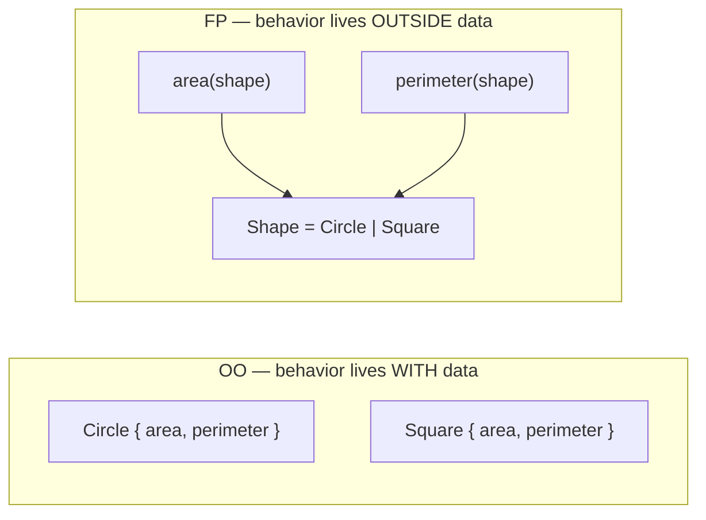
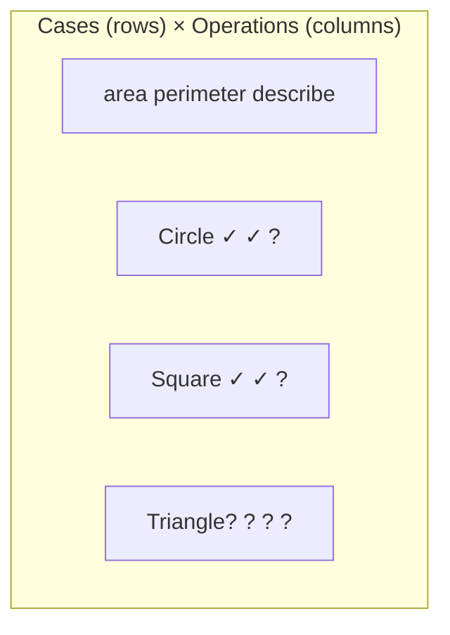
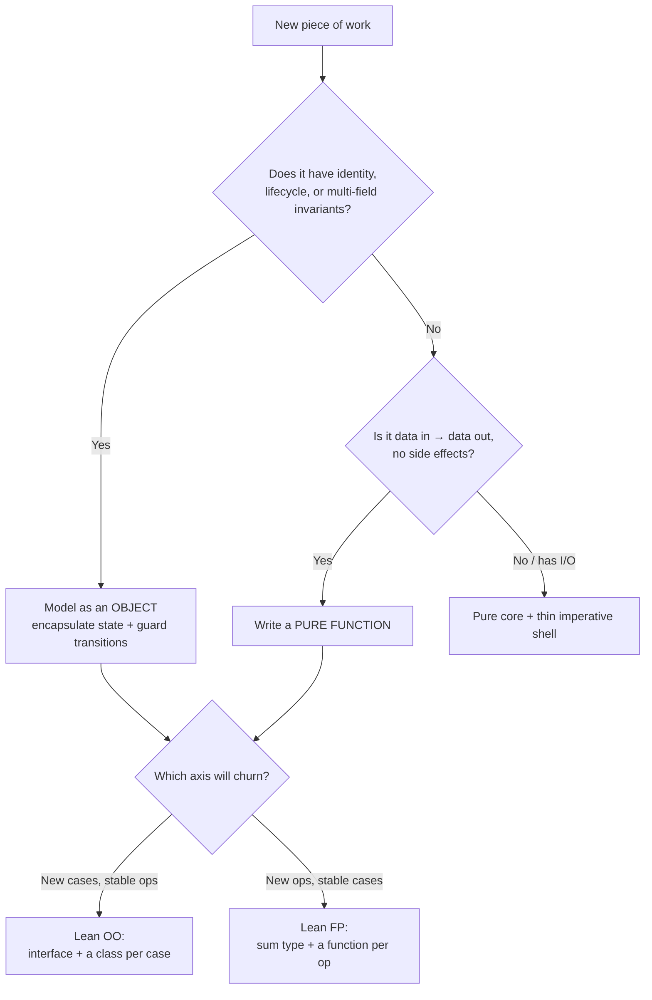

# Functional vs OO in Practice — Middle Level

> **Roadmap:** [Functional Programming](../README.md) → Functional vs OO in Practice
>
> *FP and OO are not rival religions — they are two answers to the same question: "where does behavior live, next to data or next to types?" The middle-level skill is choosing per problem, not per allegiance.*

---

## Table of Contents

1. [Introduction](#introduction)
2. [Prerequisites](#prerequisites)
3. [The One-Sentence Distinction](#the-one-sentence-distinction)
4. [Where FP Fits](#where-fp-fits)
5. [Where OO Fits](#where-oo-fits)
6. [Hybrid Patterns in Practice](#hybrid-patterns-in-practice)
7. [The Expression Problem](#the-expression-problem)
8. [Choosing Per Problem](#choosing-per-problem)
9. [Common Mistakes](#common-mistakes)
10. [Test Yourself](#test-yourself)
11. [Cheat Sheet](#cheat-sheet)
12. [Summary](#summary)
13. [Further Reading](#further-reading)
14. [Related Topics](#related-topics)

---

## Introduction

> Focus: **When does each paradigm fit?** — and why the honest answer in production code is "both, in the same file."

At the junior level the comparison is usually framed as a contest: objects-with-methods *versus* pure-functions-over-data, and you pick a winner. That framing is wrong, and senior engineers stopped believing it years ago. The two paradigms optimize for **different axes of change**, and a real system changes along both axes at once.

The middle-level move is to stop asking *"is this codebase FP or OO?"* and start asking, for each piece of work in front of you, **two concrete questions**:

1. Is this a **stateful entity** with identity and a lifecycle (a `User`, a `Connection`, a `ShoppingCart`), or a **transformation** of values (parse → validate → enrich → emit)?
2. Do I expect to add new **operations** to a fixed set of cases, or new **cases** to a fixed set of operations?

The answers point you cleanly at one paradigm or the other — and frequently at a hybrid that uses each where it is strongest. This file is about making that call deliberately instead of by habit.

---

## Prerequisites

- **Required:** You can read [`junior.md`](junior.md) — you know what "pure function," "immutability," and "higher-order function" mean.
- **Required:** Comfortable with [Pure Functions & Referential Transparency](../02-pure-functions-and-referential-transparency/middle.md) and [Composition](../05-composition/middle.md) — the FP half of the comparison.
- **Required:** You have written OO code with classes, methods, and at least one interface/polymorphic hierarchy.
- **Helpful:** Familiarity with [Algebraic Data Types](../06-algebraic-data-types/middle.md) (sum/product types) — they are central to the Expression Problem.
- **Helpful:** Awareness of the [Strategy pattern](../../design-patterns/03-behavioral/08-strategy/junior.md), which we compare directly against strategy-as-a-function.

---

## The One-Sentence Distinction

Strip away the dogma and the difference is mechanical — it is about **where behavior is bound**:

- **OO binds behavior to data.** A `Circle` *carries* its `area()` method. To use the behavior you need the object. Adding a new shape means writing a new class; the existing call sites do not change.
- **FP binds behavior to functions over data.** `area(shape)` is a standalone function that inspects the shape. The data is inert; behavior lives outside it. Adding a new operation means writing a new function; existing data definitions do not change.



Everything else in this topic — when to reach for each, the hybrid styles, the Expression Problem — falls out of this one observation. Hold onto it.

---

## Where FP Fits

FP is the right reach when **the data flows and the logic is stateless**. Concretely:

### 1. Data transformation and pipelines

Anything shaped like *"take this collection, reshape it, filter it, aggregate it"* is FP's home turf. The pipeline reads top-to-bottom, each stage is independently testable, and there is no intermediate mutable state to corrupt.

```python
# Python — a transformation pipeline; nothing here needs an object
def top_spenders(orders: list[Order], n: int) -> list[str]:
    return [
        email
        for email, total in sorted(
            ((o.email, o.total) for o in orders if o.status == "paid"),
            key=lambda kv: kv[1],
            reverse=True,
        )[:n]
    ]
```

There is no `OrderAnalyzer` class with state here, and inventing one would only add ceremony. The function *is* the unit. (See [Map / Filter / Reduce](../04-map-filter-reduce/middle.md).)

### 2. Stateless business logic

Pure functions — same input, same output, no side effects — are trivial to test (no setup, no mocks) and trivial to reason about (you can substitute the call with its result). A pricing rule, a tax calculation, a validation, a formatter: these want to be pure functions.

```java
// Java — a pure pricing rule. No fields, no lifecycle, just input → output.
static Money discountedPrice(Money base, Customer.Tier tier) {
    return switch (tier) {
        case GOLD   -> base.times(0.80);
        case SILVER -> base.times(0.90);
        case BRONZE -> base;
    };
}
```

### 3. Concurrency safety

This is FP's quietly decisive advantage. **Immutable data has no data races** — there is nothing to write, so two goroutines/threads reading the same value can never corrupt it. Pure functions have no shared state to lock. A huge class of concurrency bugs simply cannot occur.

```go
// Go — pure function fanned out across goroutines with zero locking,
// because Order is treated as immutable and score() touches no shared state.
func scoreAll(orders []Order) []float64 {
    scores := make([]float64, len(orders))
    var wg sync.WaitGroup
    for i, o := range orders {
        wg.Add(1)
        go func(i int, o Order) {   // o copied; score() is pure → safe
            defer wg.Done()
            scores[i] = score(o)
        }(i, o)
    }
    wg.Wait()
    return scores
}
```

If `score` mutated shared state, this code would need a mutex and would invite deadlocks. Because it is pure, the parallelism is free and obviously correct.

### 4. The functional core / imperative shell

Even in a heavily-OO system, the *decision-making* center benefits from being a set of pure functions, with side effects (I/O, DB, network) pushed to a thin outer shell. This is covered in [Effect Tracking](../10-effect-tracking/middle.md) and is the single most practical way to get FP's testability into an otherwise-OO application.

> **Heuristic:** if you can describe the work as *"data goes in, transformed data comes out, nothing else happens,"* write a function. Reaching for a class adds state the problem doesn't have.

---

## Where OO Fits

OO is the right reach when **there is genuine state with identity, and behavior must travel with it**. Concretely:

### 1. Stateful entities with a lifecycle

A `ShoppingCart`, a database `Connection`, a `Game`, a `Session` — these things *are* something over time. They have identity (two carts with identical contents are still different carts), they change state through well-defined transitions, and the valid operations depend on the current state. Encapsulating that state behind methods that enforce the rules is exactly what objects are for.

```python
class Connection:
    def __init__(self, dsn: str):
        self._dsn = dsn
        self._state = "closed"          # private; transitions are guarded

    def open(self):
        if self._state == "open":
            raise RuntimeError("already open")
        self._state = "open"

    def close(self):
        self._state = "closed"
```

Trying to model this as pure functions threading a `state` value through every call is awkward and gives up the one thing OO does best here: **making illegal transitions impossible by hiding the field.**

### 2. Polymorphic dispatch over a stable set of operations

When you have *many implementations* of a *fixed interface* — a dozen payment providers all answering `charge()` and `refund()`, a set of renderers all answering `render()` — OO's virtual dispatch is the clean tool. Adding the thirteenth provider is a new class; no existing code is touched. (This is the Expression Problem's "easy" direction for OO; see below.)

```java
interface PaymentGateway {
    Receipt charge(Money amount);
    void    refund(Receipt r);
}
class StripeGateway implements PaymentGateway { /* ... */ }
class PayPalGateway implements PaymentGateway { /* ... */ }
// Adding AdyenGateway = one new file. Callers unchanged.
```

### 3. Encapsulation and invariants

When a set of fields must stay mutually consistent — an `Account` whose `balance` must equal the sum of its `transactions`, an `Order` whose `total` must match its `lineItems` — bundling the data with the methods that protect the invariant prevents callers from putting the object into an illegal state. The boundary *is the value*.

### 4. Plugin boundaries and extension points

Frameworks and libraries that let third parties extend them (servlet filters, middleware, UI widgets, ORM hooks) expose **interfaces** so external code can provide new implementations without recompiling the core. An interface is the contract; OO's open-for-extension nature is the right shape for "we don't know all the implementations yet, and others will add them."

> **Heuristic:** if the thing has **identity**, **a lifecycle**, or **invariants spanning multiple fields**, model it as an object. If you find yourself passing the same bundle of values into every function, that bundle wants to be an object.

---

## Hybrid Patterns in Practice

The dichotomy is a teaching device. Production code blends both, and the best codebases do so deliberately. Three blends you will use constantly:

### Functions inside objects

The most common hybrid: an object holds state, but its *methods are written in a functional style* — they compute results from inputs without reaching out to mutate other state, and prefer returning new values to mutating in place.

```java
// OO container, FP-style method bodies: pure transformation, returns a new value.
final class Invoice {
    private final List<LineItem> items;   // immutable field
    Invoice(List<LineItem> items) { this.items = List.copyOf(items); }

    Money subtotal() {                     // pure: depends only on `items`
        return items.stream()
                    .map(LineItem::amount)
                    .reduce(Money.ZERO, Money::plus);
    }
    Invoice withItem(LineItem item) {      // returns a NEW Invoice, no mutation
        var copy = new ArrayList<>(items);
        copy.add(item);
        return new Invoice(copy);
    }
}
```

This gives you OO's encapsulation *and* FP's referential transparency at the method level — the best of both.

### Immutable value objects

A value object has **no identity** — two of them with equal fields are interchangeable (`Money(5, "USD")` is `Money(5, "USD")`, full stop). Make these immutable and they behave like FP values: safe to share across threads, safe to use as map keys, free to cache. Modern languages give you first-class support:

```java
// Java record — immutable value object, structural equality, for free.
record Money(long cents, String currency) {
    Money plus(Money other) { return new Money(cents + other.cents, currency); }
}
```

```python
# Python — frozen dataclass: immutable, hashable, value-equal.
from dataclasses import dataclass
@dataclass(frozen=True)
class Money:
    cents: int
    currency: str
```

```go
// Go — a small struct passed by value is effectively an immutable value object
// as long as you never take a pointer to it and mutate through it.
type Money struct{ Cents int64; Currency string }
func (m Money) Plus(o Money) Money { return Money{m.Cents + o.Cents, m.Currency} }
```

The rule of thumb: **entities** (things with identity and a lifecycle) → mutable objects with guarded transitions; **value objects** (things defined entirely by their fields) → immutable. See [Immutability](../03-immutability/middle.md).

### Strategy-as-a-function vs the Strategy pattern

This is the clearest place to *feel* the two paradigms solving the same problem. The classic [Strategy pattern](../../design-patterns/03-behavioral/08-strategy/junior.md) wraps "a piece of pluggable behavior" in an object implementing a one-method interface. In a language with first-class functions, that one-method interface **is just a function type** — the object is ceremony around a closure.

```java
// Strategy pattern (classic OO): an interface + a class per strategy.
interface DiscountStrategy { Money apply(Money base); }
class GoldDiscount implements DiscountStrategy {
    public Money apply(Money base) { return base.times(0.80); }
}
checkout.setStrategy(new GoldDiscount());
```

```java
// Strategy-as-a-function: the interface is a function; the strategy is a lambda.
// (Java's Function<T,R> already is the one-method interface.)
Function<Money, Money> goldDiscount = base -> base.times(0.80);
checkout.setStrategy(goldDiscount);
```

```python
# Python — strategies are just functions; no class hierarchy needed.
def gold_discount(base: Money) -> Money:   return base.scale(0.80)
def no_discount(base: Money)   -> Money:   return base
checkout.strategy = gold_discount          # swap behavior by assignment
```

```go
// Go — a strategy is a func value (or a named func type).
type Discount func(Money) Money
gold := func(b Money) Money { return b.Scale(0.80) }
checkout.SetStrategy(gold)
```

**When the function form wins:** the strategy is stateless, single-method, and you have many small variants — the boilerplate of a class per strategy buys nothing. **When the pattern (object) form wins:** the strategy needs its own state, needs to implement *several* related methods, needs a name/identity for configuration or logging, or must be discovered/registered by a framework that expects objects. Choose by what the strategy actually needs to carry, not by habit.

---

## The Expression Problem

This is the deepest idea in the FP-vs-OO comparison, and the one that explains *why* neither paradigm is universally better. Coined by Philip Wadler, it asks: can you extend a datatype in **both** directions — new cases *and* new operations — without modifying existing code and without losing type safety?

Picture a 2-D grid:



- **OO organizes by row (case).** Each class is a row: `Circle` implements all operations. **Adding a row is easy** — write a new `Triangle` class implementing the interface; touch nothing else. **Adding a column is hard** — a new operation `describe()` forces you to edit *every existing class* to add the method.
- **FP organizes by column (operation).** Each function is a column: `area(shape)` handles every case via pattern-matching/type-switch. **Adding a column is easy** — write a new `describe(shape)` function; touch no data definitions. **Adding a row is hard** — a new `Triangle` case forces you to edit *every existing function's* switch to handle it.

```java
// OO: adding a new CASE is cheap.
class Triangle implements Shape {        // new file, nothing else changes
    public double area()      { /* ... */ }
    public double perimeter() { /* ... */ }
}
// But adding a new OPERATION (describe) means editing Shape AND every class. ✗
```

```python
# FP: adding a new OPERATION is cheap.
def describe(shape) -> str:               # new function, no data definitions touched
    match shape:
        case Circle(r):   return f"circle r={r}"
        case Square(s):   return f"square s={s}"
# But adding a new CASE (Triangle) means editing area(), perimeter(), describe()... ✗
```

**The practical takeaway:** before you choose, predict which axis will churn.

- *"We'll keep adding payment providers; the operations (charge/refund) are stable."* → cases churn → **OO** (each provider is a class).
- *"We have a fixed set of AST node types but keep adding passes — type-check, optimize, pretty-print, codegen."* → operations churn → **FP** (each pass is a function over the fixed node set).

Compilers are the canonical FP case (fixed node types, ever-growing list of passes); GUI toolkits and plugin systems are the canonical OO case (fixed operations like `render`/`handleClick`, ever-growing list of widgets). Neither solves the full problem cheaply; mature ecosystems reach for advanced tools (visitors, type classes, multimethods, pattern-matching on sealed hierarchies) to soften whichever direction hurts.

---

## Choosing Per Problem

Put the heuristics together into a decision you can run in your head during design:



Three rules that keep you honest:

1. **Match the paradigm to the shape of the problem, not to the language's defaults.** Go has classes-ish structs and methods but rewards a functional style; Python and Java support both fully. The language permits both — *you* choose.
2. **Predict the axis of change.** This is the single highest-leverage call. Getting the Expression-Problem direction right means future features are one-file additions instead of shotgun edits across the codebase.
3. **Default to immutable values and pure functions for the parts that have no state, and reserve objects for the parts that genuinely do.** Most systems are mostly stateless transformation with a few stateful entities at the edges. Sizing your objects to *just* the stateful core keeps the testable, parallelizable majority pure.

> **The senior reframe:** "FP vs OO" is a false binary. The real question is *"behavior next to data, or behavior next to operations?"* and the answer is decided per module by what changes.

---

## Common Mistakes

1. **Picking a paradigm by identity, not by problem.** "I'm an FP person" / "we're an OO shop" leads to threading state through pure functions where an object belonged, or wrapping a one-line transformation in a stateful service class. Decide per piece of work.
2. **Modeling stateless transformations as stateful service objects.** A `PriceCalculator` with no fields and one method that ignores `this` is a function wearing a class costume. Make it a (static) function.
3. **Modeling stateful entities as bags of pure functions.** Threading a mutable `state` argument through twenty functions re-implements objects badly and loses encapsulation. If it has identity and a lifecycle, use an object.
4. **Reaching for the full Strategy pattern when a function value would do.** A class-per-strategy is pure ceremony when the strategy is stateless and single-method. Use a lambda/function; escalate to the object form only when the strategy needs state or multiple methods.
5. **Ignoring the Expression Problem until it bites.** Choosing OO for something whose *operations* keep changing (or FP for something whose *cases* keep changing) turns every feature into a cross-cutting edit. Predict the churn axis up front.
6. **Mutating "immutable" value objects through aliases.** A `frozen` dataclass holding a mutable `list`, or a Go struct mutated through a pointer, isn't actually immutable — and silently loses the thread-safety you thought you had. Make the contained data immutable too.
7. **Believing one paradigm is strictly "more advanced."** They optimize different axes. The advanced skill is fluency in both and knowing the trade you're making.

---

## Test Yourself

1. You're writing a function that takes a list of log lines, parses them, drops the non-errors, and returns a summary count per service. Object or function? Why?
2. You're modeling a `BankAccount` whose `balance` must always equal the running sum of its `transactions`. Object or function? Why?
3. Restate the Expression Problem in one sentence, then say which direction (new cases vs new operations) is cheap in OO and which is cheap in FP.
4. Your team maintains a compiler with ~15 fixed AST node types and keeps adding passes (lint, optimize, format, codegen). Which paradigm makes adding the *next pass* a one-file change — and why?
5. You have a stateless, single-method discount rule that comes in eight variants. When would you write it as eight lambdas, and when would you escalate to a full Strategy-pattern class hierarchy?
6. Why does immutable data give you concurrency safety "for free," and what's the one mistake that silently throws it away?

<details>
<summary>Answers</summary>

1. **Function (a pure pipeline).** It's data-in → data-out with no identity, lifecycle, or shared state. An object here would only add ceremony, and the pure function is trivially testable and parallelizable.
2. **Object.** It has identity, a lifecycle, and a multi-field invariant (`balance` must match `transactions`). Encapsulating the fields behind methods that enforce the invariant makes illegal states unreachable — exactly OO's strength. Modeling it as pure functions would force you to thread the state through every call and would expose the fields.
3. *"Can you add both new data cases and new operations to a type without editing existing code and without losing type safety?"* OO makes **new cases** cheap (new class) but **new operations** expensive (edit every class); FP makes **new operations** cheap (new function) but **new cases** expensive (edit every function's match).
4. **FP** — the node set is fixed and the *operations* (passes) churn. Each pass is a single function (or visitor) over the stable node types, so the next pass is one new file; no node definition changes. This is the textbook FP-friendly direction of the Expression Problem.
5. Write them as **eight lambdas/functions** when each is stateless and single-method — the class-per-strategy boilerplate buys nothing. Escalate to the **Strategy-pattern class** form when a strategy needs its own state, must implement several related methods, needs a name/identity for configuration or logging, or must be registered/discovered by a framework that expects objects.
6. Immutable data can't be written, so concurrent readers can never observe a torn or partially-updated value — there's no race to guard and no lock to take. The silent killer is **shallow immutability**: a "frozen"/value object that still contains a mutable collection or is mutated through a pointer/alias is not actually immutable, and the safety guarantee evaporates.

</details>

---

## Cheat Sheet

| Signal in the problem | Reach for | Why |
|---|---|---|
| Data in → data out, no side effects | **Pure function** | Trivial to test and parallelize; no state to manage |
| Collection reshaping / pipelines | **FP (map/filter/reduce)** | Reads top-to-bottom; stages testable in isolation |
| Concurrency / parallelism | **Immutable data + pure fns** | No shared writes → no data races, no locks |
| Identity + lifecycle + invariants | **Object (mutable, guarded)** | Encapsulation makes illegal states unreachable |
| Many impls of a fixed interface | **OO polymorphism** | New impl = new class; call sites unchanged |
| Plugin / extension boundary | **OO interface** | Open for third-party extension without recompiling core |
| Stateless single-method behavior, many variants | **Function value** | Lambda beats a class-per-strategy in boilerplate |
| Defined entirely by its fields, no identity | **Immutable value object** | Shareable, hashable, cacheable, thread-safe |

| Expression Problem | New **cases** cheap | New **operations** cheap |
|---|---|---|
| **OO** (organize by case/class) | ✓ new class | ✗ edit every class |
| **FP** (organize by operation/fn) | ✗ edit every function | ✓ new function |

**Three golden rules:**
- *Choose per problem, not per allegiance — behavior next to data (OO) or next to operations (FP)?*
- *Predict the churn axis: stable operations + new cases → OO; stable cases + new operations → FP.*
- *Immutable value objects for things without identity; guarded mutable objects for things with it; pure functions for everything stateless in between.*

---

## Summary

- The mechanical difference is **where behavior is bound**: OO binds it *to data* (methods on objects), FP binds it *to functions over data*. Everything else follows.
- **FP fits** stateless transformation, pipelines, pure business logic, and concurrency — immutable data has no races and pure functions need no mocks.
- **OO fits** stateful entities with identity and lifecycle, polymorphic dispatch over a stable operation set, encapsulated invariants, and plugin boundaries.
- **Hybrids dominate real code:** functions written in a pure style inside stateful objects, immutable value objects (records / frozen dataclasses / value structs), and strategy-as-a-function instead of a Strategy class when the behavior is stateless and single-method.
- The **Expression Problem** is the deep "why": OO makes new *cases* cheap and new *operations* expensive; FP is the mirror image. Predicting which axis will churn is the highest-leverage design call you make here.
- The senior reframe: *"FP vs OO"* is a false binary — decide per module by which kind of change you expect, and reserve objects for the genuinely stateful minority.

---

## Further Reading

- **Philip Wadler — "The Expression Problem"** (1998, the original email/note) — the precise statement of the two-axis extension problem.
- **Structure and Interpretation of Computer Programs** — Abelson & Sussman — data-directed programming vs message-passing; the same trade-off from first principles.
- **Functional Programming in Scala** — Chiusano & Bjarnason — blending pure cores with stateful edges in a multi-paradigm language.
- **Domain-Driven Design** — Eric Evans — the *Entity* vs *Value Object* distinction that drives "mutable-with-identity vs immutable-by-value."
- **Effective Java** — Joshua Bloch — "Minimize mutability," records, and when classes (vs functions) earn their keep.

---

## Related Topics

- [Pure Functions & Referential Transparency](../02-pure-functions-and-referential-transparency/middle.md) — the FP half: why stateless logic is easy to test and reason about.
- [Immutability](../03-immutability/middle.md) — immutable value objects and the concurrency safety they buy.
- [Composition](../05-composition/middle.md) — "why composition beats inheritance," the FP answer to OO's reuse story.
- [Algebraic Data Types](../06-algebraic-data-types/middle.md) — sum types and pattern matching, the FP side of the Expression Problem.
- [Effect Tracking](../10-effect-tracking/middle.md) — the functional-core / imperative-shell hybrid for otherwise-OO systems.
- [Design Patterns → Strategy](../../design-patterns/03-behavioral/08-strategy/junior.md) — the OO counterpart to strategy-as-a-function.
