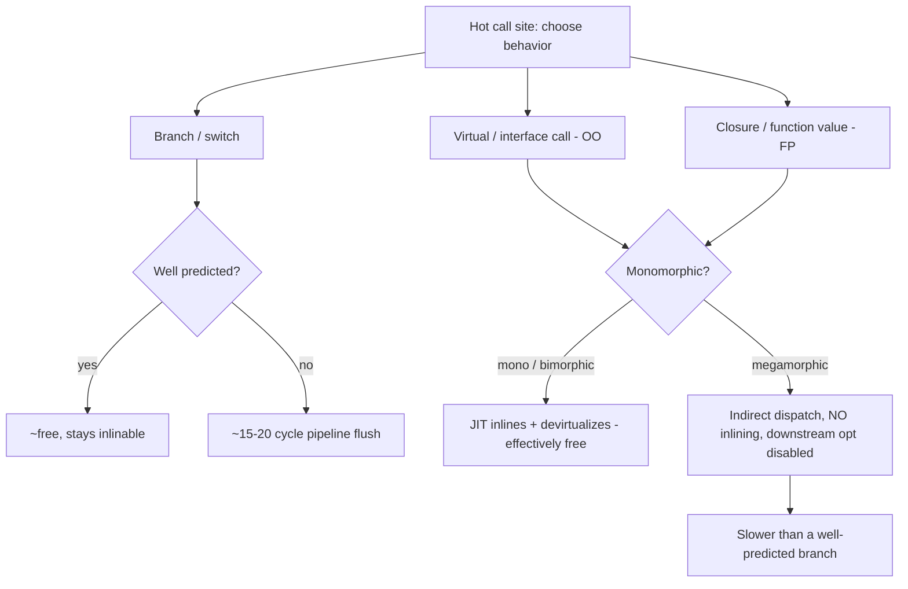
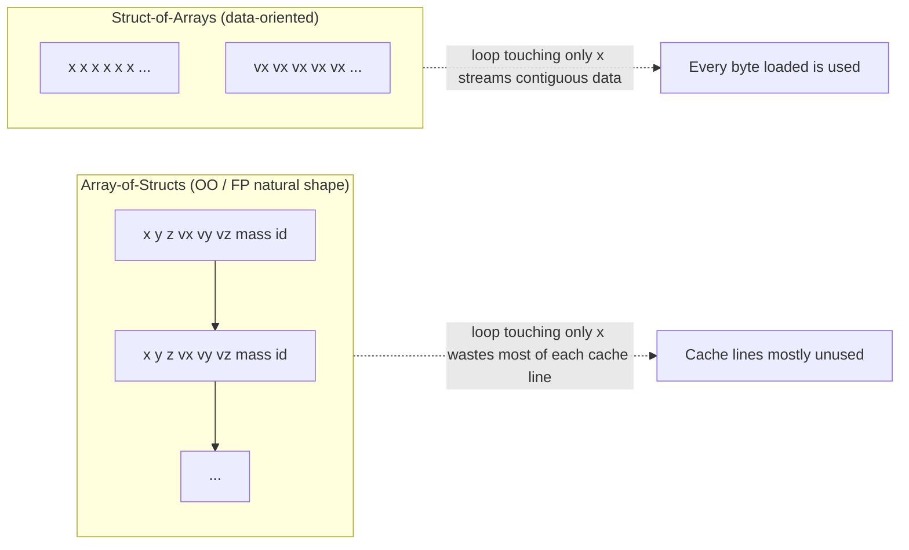

# Functional vs OO in Practice — Professional Level

> **Roadmap:** [Functional Programming](../README.md) → Functional vs OO in Practice
>
> *Essence: at this level the paradigm war is not about taste — it is about what each shape costs the machine. OO's runtime tax is indirect dispatch (vtable/itable lookups, megamorphic call sites that defeat inlining). FP's runtime tax is allocation and immutability (closures on the heap, structural sharing, GC pressure). Data-oriented design is the third lens that indicts both: neither paradigm guarantees the cache locality that dominates modern performance. There is no universal winner — you measure for the workload.*

---

## Table of Contents

1. [Introduction](#introduction)
2. [Prerequisites](#prerequisites)
3. [Measure First: The Tooling Map](#measure-first-the-tooling-map)
4. [Dispatch Cost: vtable vs Closure vs Branch](#dispatch-cost-vtable-vs-closure-vs-branch)
5. [Immutability GC Pressure vs Mutable In-Place](#immutability-gc-pressure-vs-mutable-in-place)
6. [Data-Oriented Design — The Third Lens](#data-oriented-design--the-third-lens)
7. [How JITs and Compilers Optimize Each](#how-jits-and-compilers-optimize-each)
8. [Measurement: A/B-ing the Paradigms](#measurement-ab-ing-the-paradigms)
9. [Common Mistakes](#common-mistakes)
10. [Test Yourself](#test-yourself)
11. [Cheat Sheet](#cheat-sheet)
12. [Summary](#summary)
13. [Further Reading](#further-reading)
14. [Related Topics](#related-topics)

---

## Introduction

> Focus: the **runtime and compiler trade-offs** of choosing OO dispatch, FP immutability/closures, or a data-oriented layout for a given hot path — and how to measure which one your workload actually wants.

`senior.md` taught you to choose a paradigm for *design* reasons: which makes the code easier to reason about, test, and evolve. This file goes one layer down, to the place where the choice becomes a *performance* decision the profiler can settle.

The professional insight is that the paradigm debate, argued abstractly, is unfalsifiable noise. Argued concretely — *this loop, this type distribution, this allocation rate, on this CPU* — it becomes a measurable engineering question with a clear answer. And the answer is rarely "FP is faster" or "OO is faster." It is usually "the data layout dominated both, and you were arguing about the wrong axis."

Three runtime realities frame everything below:

1. **OO's signature cost is indirect dispatch.** A virtual/interface call is a pointer chase to a method table, and — worse — a call site that sees many concrete types goes *megamorphic*, at which point the JIT stops inlining and the whole downstream optimization chain collapses.
2. **FP's signature cost is allocation.** Pure functions return new values; immutable updates copy (with structural sharing); closures capture state onto the heap. Each is cheap in isolation and expensive at volume, and it all lands on the garbage collector.
3. **Both can lose to data-oriented design**, because the metric that actually dominates a hot loop on modern hardware is **cache locality** — and a graph of small heap objects (the natural shape of both idiomatic OO *and* idiomatic immutable FP) is the worst case for the cache.

> **The mental model:** every paradigm is a bet about which resource is cheap. OO bets pointer-chasing is cheap (it isn't, on the cache). FP bets allocation is cheap (it is, until the GC disagrees). Data-oriented design bets that *memory layout* is what matters (usually true on hot paths). Your job is to know which bet your workload rewards — and the only way to know is to measure.

---

## Prerequisites

- **Required:** Fluent with [`senior.md`](senior.md) — you can pick a paradigm on design grounds and run a hybrid (functional core / OO shell) cleanly.
- **Required:** A working model of a managed runtime: heap vs stack, a tracing GC's mark/sweep, JIT inlining and devirtualization (HotSpot/JVM), Go's escape analysis and inliner, CPython's interpreter loop (no JIT in the reference implementation).
- **Required:** You can read a flame graph and a JMH / `benchstat` comparison and tell signal from noise.
- **Helpful:** CPU microarchitecture basics — cache lines (~64 B), the cost of an L1 hit (~4 cycles) vs an LLC miss to DRAM (~100–300 cycles), branch prediction, the difference between a direct and an indirect call.
- **Helpful:** [immutability](../03-immutability/professional.md) (structural sharing, persistent structures) and [effect tracking](../10-effect-tracking/professional.md) (functional core / imperative shell) at the professional level. The profiling-techniques, memory-leak-detection, and big-o-analysis skills supply the measurement vocabulary.

---

## Measure First: The Tooling Map

Before any claim that "the functional version is slower" or "the polymorphic version is faster," reach for the right instrument. Every number in this file is **labeled illustrative** — your job is to generate the real one on your code.

| Concern | Go | Java / JVM | Python |
|---|---|---|---|
| **CPU profile** | `go test -cpuprofile`, `pprof` | async-profiler (`-e cpu`), JFR | `cProfile`, `py-spy`, `scalene` |
| **Allocation / heap** | `-memprofile`, `pprof -alloc_space`, `-benchmem` | JFR alloc events, `jmap`, MAT | `tracemalloc`, `memray`, `scalene` |
| **Object / closure layout** | `unsafe.Sizeof`, field order | `jol` (Java Object Layout) | `sys.getsizeof`, `pympler` |
| **GC behavior** | `GODEBUG=gctrace=1`, `go tool trace` | GC logs (`-Xlog:gc*`), JFR GC events | `gc.set_debug`, gen stats |
| **Inlining / escape / devirt** | `go build -gcflags=-m` | `-XX:+PrintInlining`, `-XX:+PrintCompilation` | (none — CPython doesn't inline) |
| **Microbenchmark** | `testing.B` + `benchstat` | JMH | `pyperf`, `timeit` |
| **Branch / cache counters** | `perf stat`, `pprof`+`perf` | `perf`, async-profiler HW events | `perf stat python …` |
| **Dispatch type profile** | (read `-m`; inspect call sites) | `-XX:+PrintInlining` ("megamorphic"/"too many types") | (`dis` shows `CALL_*` opcodes) |

```bash
# Go: what inlines, what escapes to the heap, and per-op allocations
go build -gcflags='-m -m' ./pkg/... 2>&1 | grep -E 'inlin|escapes'
go test -bench=. -benchmem ./pkg/...        # ns/op + B/op + allocs/op

# Java: did the JIT inline & devirtualize the call site, or go megamorphic?
java -XX:+UnlockDiagnosticVMOptions -XX:+PrintInlining -jar bench.jar 2>&1 \
  | grep -E 'inline|megamorphic|too many'

# Python: line-level CPU + memory together
scalene your_script.py
```

> **Discipline:** if you cannot name the tool that would falsify your claim, you are guessing. The rest of this file pairs every paradigm cost with the instrument that confirms it on *your* workload.

---

## Dispatch Cost: vtable vs Closure vs Branch

The three ways to choose behavior at runtime — a virtual/interface call (OO), an indirect call through a function value/closure (FP), and a branch or jump table (procedural) — have different and *workload-dependent* costs. The naive ranking ("function calls are slow, branches are fast") is wrong often enough to be dangerous.

### The three mechanisms

```
Branch (switch/if)      →  CPU evaluates a condition, predicts, jumps.
                           Near-free when well-predicted; ~15–20 cycle flush on mispredict.

Virtual call (OO)       →  load type's method table, load method ptr, indirect call.
                           Monomorphic: JIT inlines it → free. Megamorphic: full
                           indirect dispatch, no inlining, no downstream optimization.

Closure / function value→  load the captured-env pointer + code pointer, indirect call.
                           Same indirect-call cost; the closure itself was a heap
                           allocation (the capture); rarely inlinable across the value.
```

The decisive variable for the two indirect mechanisms is **monomorphism**. A call site that always sees one concrete type (or one lambda shape) is *monomorphic*: the JIT speculates the target, inlines the body, and the indirect call evaporates. A site that sees two is *bimorphic* (still handled by an inline cache). A site that sees many is **megamorphic**: the inline cache overflows, the JIT abandons inlining and devirtualization, and every call becomes a true indirect dispatch with all downstream optimizations (constant folding, loop-invariant motion across the call, vectorization) disabled.



### Java — virtual dispatch vs lambda vs branch (JMH)

```java
// Three ways to apply one of N operations in a hot loop.
sealed interface Op permits Add, Mul, Sub {}        // virtual dispatch
@FunctionalInterface interface IntOp { int apply(int a, int b); }  // lambda value

@Benchmark public int viaVirtual(Blackhole bh) {     // OO: op.apply(...)
    int acc = 0; for (int i = 0; i < N; i++) acc = ops[i % ops.length].apply(acc, i);
    return acc;
}
@Benchmark public int viaLambda(Blackhole bh) {      // FP: fn.apply(...)
    int acc = 0; for (int i = 0; i < N; i++) acc = fns[i % fns.length].apply(acc, i);
    return acc;
}
@Benchmark public int viaSwitch(Blackhole bh) {      // procedural: switch on tag
    int acc = 0; for (int i = 0; i < N; i++) acc = switch (tags[i % tags.length]) {
        case 0 -> acc + i; case 1 -> acc * i; default -> acc - i; };
    return acc;
}
```

```
# JMH, illustrative numbers — reproduce on your hardware/JDK before trusting
Benchmark            (typesAtSite)  Mode  Score   Error  Units
viaSwitch                       3   avgt   1.9 ±  0.1   ns/op   # jump table, predictable
viaVirtual  (1 type, monomorphic) avgt   1.8 ±  0.1   ns/op   # JIT inlines → as fast as switch
viaVirtual  (3 types, megamorph.) avgt   6.4 ±  0.3   ns/op   # inline cache overflowed
viaLambda   (1 shape, monomorphic)avgt   1.9 ±  0.1   ns/op   # inlined like the virtual case
viaLambda   (3 shapes, megamorph.)avgt   6.6 ±  0.4   ns/op   # same megamorphic penalty as OO
```

The lesson is symmetric and it surprises people: **a monomorphic virtual call and a monomorphic lambda are both as fast as a switch — the JIT inlines them all.** And a megamorphic virtual call and a megamorphic lambda are *both* ~3x slower. "OO is slow because of vtables" and "FP is slow because of indirect calls through function values" are the *same* phenomenon, gated by the same property: how many shapes the call site sees. Confirm with `-XX:+PrintInlining`; the megamorphic sites print `too many types` / `megamorphic`.

### Go — interface vs concrete, and escape analysis

Go has no JIT, so devirtualization is limited and decided at compile time. An interface call is an indirect call through the itable; the compiler devirtualizes only when it can prove the concrete type at the call site. The pay-now cost is more visible than on the JVM.

```go
type Shaper interface{ Area() float64 }
type Circle struct{ r float64 }
func (c Circle) Area() float64 { return math.Pi * c.r * c.r }

func sumIface(ss []Shaper) (t float64) {       // indirect call per element
    for _, s := range ss { t += s.Area() }     // not devirtualized in general
    return
}
func sumConcrete(cs []Circle) (t float64) {    // direct, inlinable call
    for _, c := range cs { t += c.Area() }     // inlined → fused into the loop
    return
}
```

Two costs compound in the interface version. First, the call is indirect. Second — and often larger — **assigning a concrete value to an interface boxes it**, which usually escapes the value to the heap. `go build -gcflags='-m'` will print `... escapes to heap` for the boxing site, and `-benchmem` will show allocations the concrete version doesn't have. So in Go, "program to an interface" is not free even before dispatch: it can convert a stack-resident value loop into an allocating one.

```
# go test -bench=. -benchmem  (illustrative)
BenchmarkSumConcrete   3.1 ns/op    0 B/op   0 allocs/op   # inlined, no heap
BenchmarkSumIface      5.8 ns/op    0 B/op   0 allocs/op   # indirect call (slice already boxed)
BenchmarkBoxThenSum   12.4 ns/op   16 B/op   1 allocs/op   # boxing each value escapes
```

### Python — method call vs function call

CPython has no inlining and no JIT in the reference implementation, so dispatch cost is interpreter overhead, and the differences are small relative to the per-bytecode cost. A method call does an extra attribute lookup (`LOAD_METHOD`/`LOAD_ATTR`) compared to a bare function call (`LOAD_GLOBAL` once, then `CALL`), and a bound-method object may be created.

```python
import timeit
# free function vs method — both dominated by interpreter dispatch overhead
def add(a, b): return a + b
class Adder:
    def add(self, a, b): return a + b

t_fn  = timeit.timeit("add(1, 2)", globals=globals(), number=10_000_000)
t_mth = timeit.timeit("a.add(1, 2)", setup="a=Adder()", globals=globals(),
                      number=10_000_000)
# illustrative: t_mth ~ 1.1-1.3x t_fn — the method's extra attribute lookup.
# The real lesson: in CPython, paradigm dispatch cost is noise next to the
# interpreter loop. Optimize by removing Python-level work (vectorize with
# NumPy, push the loop into C), not by switching paradigms.
```

> **Diagnose it:** JVM — `-XX:+PrintInlining` tells you mono/bi/megamorphic at each site; if a polymorphic site went slow, that's the first place to look. Go — `-gcflags='-m'` shows devirtualization and boxing/escape; `-benchmem` shows the allocations boxing introduces. Python — `dis.dis` shows the opcode difference, but `cProfile` will tell you it doesn't matter next to interpreter overhead.

**The decision rule that falls out:** polymorphism (OO) and higher-order functions (FP) are *free* when the call site stays monomorphic or bimorphic, and they are the *clean* choice there. A branch/jump table wins when the site would otherwise be megamorphic, or when the condition is data and dense. So "polymorphism beats branching" and "branching beats polymorphism" are *both* true — the deciding variable is the number of shapes at the site and the predictability of the branch, not the paradigm label.

---

## Immutability GC Pressure vs Mutable In-Place

The functional discipline of never mutating — returning new values instead — is a correctness and reasoning win (no aliasing bugs, trivial concurrency, equational reasoning). Its runtime cost is **allocation**, and at volume that cost is paid to the garbage collector. The mutable-OO alternative updates in place: zero allocation, but it reopens every aliasing and data-race hazard immutability closed.

### What immutability costs at runtime

```java
// Immutable update: a "change" is a new object. Structural sharing (persistent
// data structures) keeps the copy O(log n), not O(n) — but it still allocates.
record Point(int x, int y) {}
Point moved = new Point(p.x() + dx, p.y());          // a fresh heap object
PVector<Point> next = vec.set(i, moved);             // ~log32(n) new nodes shared

// Mutable update: in place, zero allocation — and zero safety if aliased/shared.
p.x += dx;                                            // no allocation, but who else holds p?
arr[i] = moved;                                       // mutates the array others may read
```

Three runtime consequences of "every change is a new value":

1. **Allocation rate drives GC frequency.** A tracing collector runs proportionally to how fast you fill the young generation. An immutable hot loop that allocates a small object per iteration can dominate GC time even though each object is tiny and short-lived.
2. **Short-lived garbage is the *cheap* kind — but not free.** Generational GCs are tuned for exactly this (most objects die young; minor collections are fast). This is why idiomatic immutable Java/Scala/Clojure is viable at all. But "cheap per object × billions of objects" is still a real bill, and it shows up as GC CPU% and minor-GC pause frequency.
3. **Structural sharing trades copy cost for pointer-chasing.** A persistent vector or HAMT avoids copying the whole structure on update — but reading it now chases pointers through a tree of small nodes, which is a *cache* cost (see the next section). You traded GC pressure for locality loss; whether that's a win is workload-dependent.

```
# JFR allocation profile / Go -benchmem, illustrative
                          allocs/op   B/op    young-GC/sec   GC CPU%
immutable update loop          1      32        ~heavy         ~9%
mutable in-place loop          0       0         ~none         ~0%
# Same logic; the immutable version's entire cost is GC it created.
```

### The mutable-OO hazard immutability removes

The mutable version's zero allocation is not a free lunch — it is a loan against correctness:

```python
# Aliasing bug that immutability makes impossible.
defaults = {"retries": 3}
def config(overrides=defaults):     # shared mutable default — classic trap
    overrides["ts"] = now()         # mutates the shared dict for ALL future calls
    return overrides
```

Under concurrency the same property becomes a data race: two threads mutating a shared object with no synchronization. Immutability closes both holes structurally — a value that can't change can be shared freely across threads with no lock. So the real trade is:

| | Mutable in-place (OO) | Immutable (FP) |
|---|---|---|
| Allocation / GC | Zero | Per-update; GC-bound at volume |
| Aliasing bugs | Present — caller may hold the same object | Impossible by construction |
| Concurrency | Needs locks / careful ownership | Lock-free sharing |
| Read cost | Direct field access, dense | May chase pointers (structural sharing) |
| Best when | Hot single-owner loop, no sharing | Shared/concurrent state, reasoning matters |

> **Illustrative impact:** converting a hot per-frame update from immutable `record` reallocation to mutable in-place reuse of a pooled object cut allocation rate ~95% and removed minor-GC spikes from the p99 frame time — *on a single-owner hot path where no aliasing was possible*. The same change on shared state would have introduced a race. **Measure the allocation rate (JFR / `-benchmem`) and the GC CPU% before and after; never assume the GC bill is large without the profile.**

The professional move mirrors [effect tracking](../10-effect-tracking/professional.md)'s functional-core/imperative-shell: keep the design immutable for the 95% where reasoning and concurrency safety dominate, and drop to mutable in-place (object pools, `sync.Pool`, buffer reuse, in-place array ops) only on a *profiled, single-owner* hot loop — fenced behind a clean boundary so the mutation can't leak into shared state.

---

## Data-Oriented Design — The Third Lens

Here is the uncomfortable truth the OO-vs-FP debate usually misses: **both paradigms, in their idiomatic form, produce a graph of small heap objects — and that is the layout the CPU cache hates most.** Idiomatic OO gives you `List<Order>` where each `Order` is a separate heap allocation full of references. Idiomatic immutable FP gives you a persistent tree of small nodes. Both pointer-chase. Data-oriented design (DOD) rejects the premise: it organizes memory around *how the hardware reads it*, not around the conceptual objects.

### Array-of-Structs vs Struct-of-Arrays

```go
// AoS — the natural OO/FP shape. A loop over one field still loads whole structs.
type Particle struct { x, y, z float64; vx, vy, vz float64; mass float64; id int }
ps := []Particle{...}
for i := range ps { ps[i].x += ps[i].vx }   // loads 64+ B per element to touch 16 B

// SoA — the data-oriented shape. The hot field is contiguous; the cache loves it.
type Particles struct { x, y, z, vx, vy, vz, mass []float64; id []int }
for i := range p.x { p.x[i] += p.vx[i] }     // x[] and vx[] stream linearly, no waste
```



The hardware reads memory in ~64-byte cache lines. The AoS loop above touches `x` and `vx` (16 bytes) but drags in the whole 64+ byte struct per element — most of every cache line is wasted, and a large array thrashes the cache. The SoA loop streams `x[]` and `vx[]` contiguously: every loaded byte is used, the prefetcher predicts the access pattern perfectly, and the loop auto-vectorizes (SIMD over contiguous `float64`s). This is frequently a **2–10x** difference on a memory-bound loop — far larger than the dispatch differences the paradigm debate fixates on.

```
# Go -bench, illustrative — same computation, different layout
BenchmarkAoS   8.9 ms/op    # 1M particles, one field updated
BenchmarkSoA   1.4 ms/op    # ~6x; contiguous + vectorized
# perf confirms: AoS has the cache-misses; SoA streams.
```

### Why this indicts *both* paradigms

- **Heavy OOP / pointer-chasing hurts the cache.** A `List<Node>` where each node is `new`'d separately scatters them across the heap; traversal is a chain of cache misses. Encapsulation and "everything is an object" push you toward exactly this layout.
- **FP immutability can hurt it too.** A persistent data structure's structural sharing is a *tree of small nodes* — reading it chases pointers through cache-cold memory. The very mechanism that makes immutable updates cheap (sharing sub-trees) makes reads pointer-heavy. Immutability is not automatically cache-friendly; often the opposite.
- **DOD is paradigm-orthogonal.** SoA, hot/cold field splitting, packed arrays, entity-component systems (ECS) — these are layout decisions independent of whether the *logic* is written with virtual calls, lambdas, or branches. You can write a DOD inner loop in functional style (pure transforms over contiguous arrays — exactly what NumPy and Java Vector API encourage) or imperative style; what matters is the *layout*.

> **The synthesis:** on a memory-bound hot loop, neither "more OO" nor "more FP" is the lever — **layout** is. Get the data contiguous and the cache happy first; *then* the choice between a branch, a virtual call, and a lambda for the per-element logic is a second-order tuning decision. Rust and C++ make this explicit (you control layout directly, no GC, no boxing); in Java/Go you fight boxing and reference fields to get there; in Python you escape to NumPy/array-backed structures because the object model can't give you contiguity.

---

## How JITs and Compilers Optimize Each

The same source shape gets wildly different treatment depending on the runtime. Knowing what each optimizer *can* and *cannot* do tells you when a paradigm cost is real and when it's an illusion the compiler erases.

### JVM HotSpot — the great equalizer for monomorphic code

HotSpot is the most aggressive of the three at *erasing* paradigm cost, which is why so much idiomatic Java/Scala/Kotlin runs fast despite heavy abstraction:

- **Inlining + devirtualization.** A monomorphic or bimorphic virtual/lambda call is speculatively inlined; the indirect call disappears and the body fuses into the caller. This is why a monomorphic lambda matches a switch (see the JMH above).
- **Escape analysis + scalar replacement.** If the JIT proves a freshly allocated object (a short-lived immutable value, a closure capture, an `Optional`) never escapes the method, it *eliminates the heap allocation entirely* — the fields become registers/stack slots. This is what makes "allocate a small immutable object per iteration" survivable: often it never actually hits the heap.
- **The cliff:** all of this collapses at megamorphism. Once a site goes megamorphic, no inlining, no devirt, and the escape analysis across that call is lost too. The single biggest JVM performance question for abstraction-heavy code is "did this stay mono/bimorphic?" — answered by `-XX:+PrintInlining`.

### Go — pay-now, fewer surprises

Go's compiler does ahead-of-time inlining and escape analysis but **no speculative devirtualization** and no JIT respecialization:

- **Inlining is budget-limited and syntactic.** Small functions inline; interface calls generally do *not* devirtualize, so they stay indirect.
- **Escape analysis is the dominant lever.** It decides stack vs heap. Boxing a value into an interface usually forces a heap escape — so "program to an interface" can convert a zero-allocation loop into an allocating one. `-gcflags='-m'` is the truth source.
- **Consequence:** in Go, the FP/OO cost is more *visible and stable* than on the JVM — what you write is closer to what you pay. Concrete types and value semantics on hot paths; interfaces at boundaries.

### CPython — paradigm cost is in the noise

The reference interpreter has no JIT, no inlining, no escape analysis. Every operation pays interpreter dispatch overhead that dwarfs the difference between a method call and a function call.

- The performance lever is **getting out of Python**: vectorize with NumPy (contiguous arrays — data-oriented by necessity), push hot loops into C extensions, or use a JIT'd runtime (PyPy, or specialized compilers).
- Choosing FP vs OO in CPython is a *readability/maintainability* decision almost entirely; it is rarely a measurable performance one. (Newer optional JIT efforts change this at the margins, but the rule holds: optimize by removing Python-level work, not by switching paradigm.)

> **Diagnose it:** JVM — `-XX:+PrintInlining` (inline/devirt/megamorphic) and `-XX:+PrintCompilation`; JFR shows whether escape analysis killed the allocations. Go — `-gcflags='-m'` (inline + escape), `-benchmem` (the allocations that survived). Python — `cProfile` will show the time is in the interpreter, not the dispatch mechanism.

---

## Measurement: A/B-ing the Paradigms

A paradigm comparison is only credible as a controlled experiment: same inputs, same workload, one variable changed, run under a real microbenchmark harness with warmup and statistics. Eyeballing wall-clock is how myths ("FP is slow", "OO is slow") get born.

```java
// JMH skeleton: settle dispatch on YOUR type distribution. The (@Param) is the
// whole experiment — sweep the number of concrete types at the call site.
@State(Scope.Thread)
@BenchmarkMode(Mode.AverageTime) @OutputTimeUnit(TimeUnit.NANOSECONDS)
@Warmup(iterations = 5) @Measurement(iterations = 10) @Fork(2)
public class DispatchBench {
    @Param({"1", "2", "8"}) int typesAtSite;   // mono → bi → megamorphic
    Op[] ops; IntOp[] fns; int[] tags;
    @Setup public void setup() { /* build arrays mixing `typesAtSite` shapes */ }
    @Benchmark public int viaVirtual() { /* op.apply in a loop */ }
    @Benchmark public int viaLambda()  { /* fn.apply in a loop  */ }
    @Benchmark public int viaSwitch()  { /* switch(tag) in a loop */ }
}
```

```bash
# Go: paradigm A/B with allocations, then statistical comparison.
go test -bench='Concrete|Iface' -benchmem -count=10 ./... | tee new.txt
benchstat old.txt new.txt        # is the difference real or noise?

# Confirm the *why*, not just the *what*:
go build -gcflags='-m' ./...     # did it devirtualize? did the value escape?
perf stat -e cache-misses,branches,branch-misses ./bench   # layout vs dispatch
```

Protocol that keeps a paradigm comparison honest:

1. **Hold the workload fixed.** Same data, same access pattern, same size. The *only* variable is the paradigm (or layout) under test.
2. **Sweep the variable that actually matters.** For dispatch, that's *number of types at the call site* (the `@Param` above) — a one-type benchmark "proving OO is fast" is meaningless if production sees eight types.
3. **Measure all three resources.** Time (ns/op), allocation (B/op, allocs/op), and the hardware story (`perf` cache-misses, branch-misses). A win on time with a hidden allocation regression is not a win.
4. **Attribute the cause.** `-XX:+PrintInlining` / `-gcflags='-m'` tells you *why* — inlined? devirtualized? escaped? megamorphic? Without the cause you've measured a number you can't reason about when the next JDK/compiler changes it.
5. **Test on the target hardware.** Cache sizes and core counts change SoA/AoS and false-sharing results; a laptop benchmark can invert on a server.

> **Verdict, stated plainly: there is no universal winner.** Monomorphic OO dispatch, a monomorphic lambda, and a well-predicted branch are all roughly equal — and all lose to a cache-friendly data layout on a memory-bound loop. Megamorphic dispatch (OO *or* FP) loses to a jump table. Immutability costs GC that escape analysis sometimes erases. The only defensible statement is the measured one, for *your* workload, on *your* hardware, with the cause identified.

---

## Common Mistakes

Professional-level mistakes — sophisticated, and therefore expensive:

1. **Treating it as a religious choice instead of a measured one.** "We're an OO shop / FP shop" decides the hot loop by ideology. The hot loop should be decided by JMH/`benchstat` + `perf`, behind a clean interface, regardless of the surrounding house style.
2. **Believing "vtables are slow" unconditionally.** A monomorphic virtual call is inlined to nothing by the JIT. The cost only appears at megamorphism — which you must *confirm* with `PrintInlining`, not assume.
3. **Believing "function values are free" because it's FP.** A closure is a heap allocation (the capture) and an indirect call; a megamorphic lambda site pays the *same* penalty as a megamorphic vtable. FP indirect dispatch is not magically cheaper than OO indirect dispatch.
4. **Assuming immutability has no runtime cost.** Every immutable update allocates; at volume that's a real GC bill. (And assuming the bill is large is equally wrong — escape analysis may erase it. Profile the allocation rate and GC CPU%; don't guess either direction.)
5. **Assuming immutable = cache-friendly.** Structural sharing is a tree of small nodes — pointer-chasing, often cache-*hostile*. Immutability buys safety, not locality.
6. **Arguing OO vs FP on a memory-bound loop while ignoring layout.** The 2–10x lever is AoS→SoA; the dispatch choice is second-order. You optimized the wrong axis.
7. **Benchmarking dispatch with one type at the site.** "Polymorphism is fast!" with a monomorphic benchmark, then production sees eight types and goes megamorphic. Sweep the type count.
8. **Porting the paradigm conclusion across runtimes.** A JVM result (escape analysis, devirtualization) does not transfer to Go (pay-now) or CPython (paradigm cost is interpreter noise). Re-measure per runtime.
9. **Letting the fast-but-mutable / fast-but-SoA path leak.** In-place mutation or SoA chosen for a single-owner hot loop must be fenced behind a clean boundary, or it reintroduces aliasing/races and spreads as a new anti-pattern.

---

## Test Yourself

1. A monomorphic virtual call, a monomorphic lambda, and a `switch` benchmark all measure ~equal on the JVM, but the same virtual call and lambda are 3x slower when the site sees 8 types. Name the single property that explains both results and the tool that confirms it.
2. Why is "FP avoids the vtable cost of OO" a misconception at the level of indirect dispatch?
3. In Go, assigning a concrete `Circle` into a `[]Shaper` can turn a zero-allocation loop into an allocating one. What mechanism causes that, and which flag reveals it?
4. You convert a hot loop from immutable `record` reallocation to mutable in-place updates and allocation drops 95%. Under what condition is this a safe win, and under what condition is it a latent bug?
5. Both idiomatic heavy-OO and idiomatic immutable-FP tend to produce a layout the CPU cache dislikes. What layout, and what is the data-oriented alternative?
6. Why is the OO-vs-FP dispatch question usually *second-order* on a memory-bound loop, and what is the first-order lever?
7. Why is choosing FP vs OO almost never a performance decision in reference CPython, and where does the real performance lever lie?

<details>
<summary>Answers</summary>

1. **Monomorphism** — how many concrete shapes the call site sees. Mono/bimorphic sites are inlined and devirtualized by the JIT (the indirect call disappears, matching the switch); a megamorphic site overflows the inline cache, so the JIT abandons inlining/devirt and every call is a true indirect dispatch with downstream optimizations disabled. Confirmed with `-XX:+PrintInlining` (prints `megamorphic`/`too many types`).
2. Because the cost is the **indirect call**, not the keyword `virtual`. A closure / function value is dispatched through a code pointer exactly like a vtable entry, allocates its capture on the heap, and goes megamorphic at the same threshold. FP's indirect dispatch and OO's indirect dispatch are the same phenomenon and pay the same penalty.
3. **Boxing into the interface forces a heap escape**: storing a concrete value in an interface variable allocates a boxed copy whose lifetime the compiler can't prove is local. `go build -gcflags='-m'` prints `... escapes to heap` at the boxing site; `-benchmem` shows the `allocs/op` the concrete loop didn't have.
4. Safe **only on a single-owner hot path where no other code aliases or concurrently reads the object**. It's a latent bug the moment the object is shared (aliasing: a caller holds the same reference and sees it mutate) or accessed concurrently (data race). Immutability removed both hazards by construction; in-place mutation reopens them, so it must be fenced behind a boundary that guarantees single ownership.
5. A **graph of small heap objects** (Array-of-Structs, or a persistent tree of nodes) — scattered allocations that pointer-chase and waste cache lines. The data-oriented alternative is **Struct-of-Arrays** (and hot/cold splitting, packed arrays): the hot field is contiguous, the prefetcher predicts it, and the loop vectorizes — often 2–10x on a memory-bound loop.
6. Because the dominant cost on a memory-bound loop is **cache misses**, driven by memory layout, not by whether the per-element logic is a branch, a virtual call, or a lambda (those differ by a few cycles; a DRAM miss is ~100–300). The first-order lever is **layout (AoS→SoA / contiguity)**; the dispatch mechanism is a second-order tuning choice once the data streams.
7. CPython has no JIT, no inlining, no escape analysis, so every operation pays interpreter-dispatch overhead that dwarfs the method-vs-function difference; the paradigm choice is a readability/maintainability decision, not a measurable speed one. The real lever is **getting out of Python** — vectorize with NumPy (contiguous arrays), push hot loops into C, or use a JIT'd runtime.

</details>

---

## Cheat Sheet

| Question | Answer (then measure) |
|---|---|
| Is a virtual/interface call slow? | No — **if monomorphic/bimorphic** the JIT inlines it. Slow only when **megamorphic**. Check `PrintInlining`. |
| Is a lambda / function value faster than a vtable? | No — same indirect-call cost, same megamorphic cliff, plus the closure's heap capture. |
| Does immutability cost anything? | Yes — **allocation → GC**. But escape analysis may erase it. Profile allocs/op + GC CPU%, don't assume. |
| Is immutable data cache-friendly? | No — structural sharing is pointer-chasing. Safety ≠ locality. |
| OO vs FP on a hot numeric loop? | Wrong question — **layout (AoS→SoA)** is the 2–10x lever; dispatch is second-order. |
| When does polymorphism beat branching? | Few types, hot site (mono/bimorphic) → JIT inlines it; cleaner *and* fast. |
| When does branching beat polymorphism? | Many types at one site (would go megamorphic), or dense integer/enum data → jump table. |
| Go interface vs concrete on a hot path? | Concrete: direct, inlinable, no boxing. Interface: indirect + possible heap escape (`-m`). |
| Python FP vs OO performance? | Negligible — interpreter overhead dominates. Optimize by leaving Python (NumPy/C), not by paradigm. |

**Three golden rules:**
- *Monomorphism, not the keyword, decides indirect-dispatch cost — and it gates OO and FP identically.*
- *Immutability buys safety and pays in allocation; mutation buys speed and pays in aliasing/race risk — fence the fast path.*
- *On a memory-bound loop, layout beats paradigm; argue AoS→SoA before you argue OO vs FP.*

---

## Summary

- The OO-vs-FP debate becomes a tractable engineering question only when made concrete: *this loop, this type distribution, this allocation rate, this CPU.* Argued abstractly it is unfalsifiable.
- **Dispatch:** OO's vtable/itable call and FP's closure/function-value call are the *same* indirect-dispatch mechanism, gated by the *same* property — **monomorphism**. Mono/bimorphic → the JIT inlines both to near-free; megamorphic → both collapse, slower than a well-predicted branch or jump table. "Polymorphism beats branching" and "branching beats polymorphism" are both true; the deciding variable is type count at the site, not the paradigm.
- **Immutability vs mutation:** immutability's runtime cost is **allocation → GC pressure** (which generational GCs and escape analysis partly absorb); mutable in-place is zero-allocation but reopens aliasing bugs and data races. The trade is *safety + concurrency-freedom* vs *zero-alloc speed*; fence the mutable fast path behind single-owner boundaries.
- **Data-oriented design** is the third lens that indicts both paradigms: idiomatic OO and idiomatic immutable FP both yield a graph of small heap objects — the cache's worst case. **Struct-of-Arrays / contiguity** is frequently a 2–10x lever on memory-bound loops, dwarfing dispatch differences, and it is orthogonal to OO/FP style.
- **Runtimes differ sharply:** HotSpot erases monomorphic abstraction cost (inlining, devirtualization, escape analysis) but falls off a cliff at megamorphism; Go is pay-now (interfaces stay indirect, boxing escapes to the heap, `-m` is truth); CPython makes paradigm dispatch cost noise next to interpreter overhead.
- **Measure or don't claim:** controlled JMH/`benchstat` A/B, sweep the type count, measure time *and* allocation *and* cache/branch counters, attribute the cause with `PrintInlining`/`-m`, and re-test per runtime and per hardware target.
- **Verdict: no universal winner.** Choose for design clarity by default; on a profiled hot path, let the measurement — not the paradigm allegiance — pick the dispatch mechanism and the memory layout. This completes the level ladder for this topic: [`junior.md`](junior.md) → [`middle.md`](middle.md) → [`senior.md`](senior.md) → **professional.md** (runtime & layout).

---

## Further Reading

- **Systems Performance** — Brendan Gregg (2nd ed., 2020) — CPU caches, branch prediction, profiling methodology, `perf` (the measurement backbone for this file).
- **What Every Programmer Should Know About Memory** — Ulrich Drepper (2007) — cache lines, locality, why AoS vs SoA matters (still the canonical treatment).
- **Optimizing Java** — Evans, Gough, Newland (2018) — HotSpot inlining, devirtualization, escape analysis, JMH and JFR in practice.
- **Data-Oriented Design** — Richard Fabian (2018) — the case that layout, not the conceptual object, should drive structure; the third lens in this file.
- **The Garbage Collection Handbook** — Jones, Hosking, Moss (2nd ed., 2023) — why allocation rate and object lifetime drive pause times (the immutability cost).
- **Game Engine Architecture** — Jason Gregory (3rd ed., 2018) — entity-component systems and SoA in anger, where DOD originated as practice.
- **Go's escape analysis & inlining** — `go build -gcflags=-m` documentation; **JMH** — the OpenJDK microbenchmark harness docs (warmup, forks, `@Param`).

---

## Related Topics

- [Immutability](../03-immutability/professional.md) — persistent structures and structural sharing, whose GC and pointer-chasing costs this file quantifies against mutation.
- [Effect Tracking](../10-effect-tracking/professional.md) — functional core / imperative shell; the same fence-the-mutation discipline applied to effects.
- [Composition](../05-composition/professional.md) — closures and function values as the FP building block whose dispatch cost is analyzed here.
- [Algebraic Data Types](../06-algebraic-data-types/professional.md) — sealed types and pattern matching, the FP alternative to a polymorphic class hierarchy for dispatch.
- [Pure Functions & Referential Transparency](../02-pure-functions-and-referential-transparency/professional.md) — the purity that enables (and the allocation that taxes) the immutable style.
- Laziness & Streams (sibling topic 12) — lazy evaluation's own allocation/locality trade-offs, complementary to the eager comparisons here.
- [Anti-Patterns → Bad Structure (professional)](../../anti-patterns/01-development/01-bad-structure/professional.md) — megamorphic dispatch, false sharing, and SoA/AoS at the structural level.
- [Over-Engineering → Premature Optimization](../../anti-patterns/01-development/03-over-engineering/professional.md) — profile before you pick a paradigm for speed; the counterweight to this file.
- profiling-techniques · memory-leak-detection · big-o-analysis — the measurement toolkits referenced throughout.
