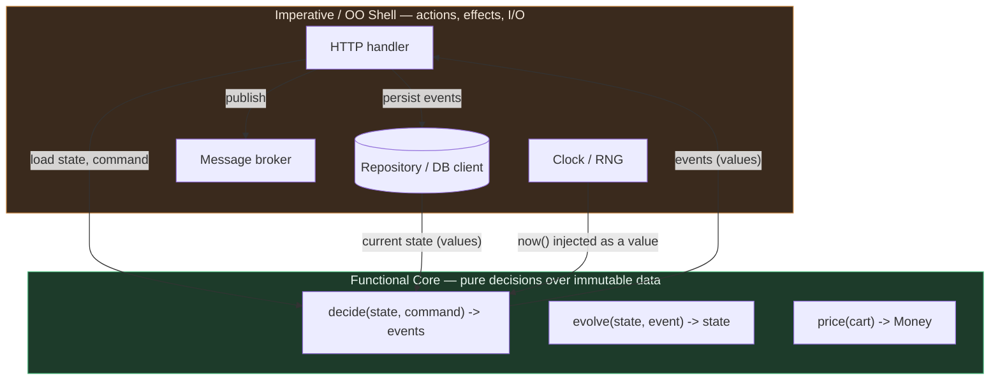

# Functional vs OO in Practice — Senior Level

> **Roadmap:** [Functional Programming](../README.md) → Functional vs OO in Practice
>
> *Essence: at system scale the question is never "functional or object-oriented?" — it is "which paradigm at which boundary?" The senior architects a **functional core inside an OO/imperative shell**, gives the domain a functional flavor (immutable aggregates, value objects, events), adds **data-oriented design** as a third lens, and migrates existing OO codebases toward functional style in reversible steps. Paradigm is a tool chosen per module and per team — never a creed.*

---

## Table of Contents

1. [Introduction](#introduction)
2. [Prerequisites](#prerequisites)
3. [Functional Core, OO/Imperative Shell — at Scale](#functional-core-ooimperative-shell--at-scale)
4. [Domain-Driven Design with a Functional Flavor](#domain-driven-design-with-a-functional-flavor)
5. [Data-Oriented Design — the Third Lens](#data-oriented-design--the-third-lens)
6. [How Modern Languages Deliberately Blend Paradigms](#how-modern-languages-deliberately-blend-paradigms)
7. [Choosing the Paradigm at the Boundary](#choosing-the-paradigm-at-the-boundary)
8. [Migrating an OO Codebase Toward Functional Style](#migrating-an-oo-codebase-toward-functional-style)
9. [Team and Maintainability Considerations](#team-and-maintainability-considerations)
10. [Common Mistakes](#common-mistakes)
11. [Test Yourself](#test-yourself)
12. [Cheat Sheet](#cheat-sheet)
13. [Summary](#summary)
14. [Further Reading](#further-reading)
15. [Related Topics](#related-topics)

---

## Introduction

> Focus: **architecting with both.** Not "which paradigm wins" but "where does each one earn its place in one system?"

At the junior and middle levels you compared the paradigms as *styles*: OO bundles state with behavior behind an interface; FP keeps data and functions separate and pushes effects to the edges. You learned that composition often beats inheritance and that immutability removes whole classes of bugs. That framing is correct but small. It answers "how do I write this function?" — not "how do I shape a 200-thousand-line system that five teams ship to weekly?"

The senior reality is that **every serious system is already a blend, whether or not anyone decided so.** Your HTTP handlers are imperative. Your database client is a mutable, stateful object holding a connection pool. Your pricing rules are pure functions. Your `Order` aggregate enforces invariants like an object but is happiest when immutable. The interesting work is not picking a side — it is *deliberately assigning* each concern to the paradigm that makes it cheapest to change and safest to reason about, and drawing the boundary between them so the system stays coherent.

> **The senior mindset shift:** the junior asks "is this OO or functional?"; the senior asks "**at this boundary, which paradigm minimizes the cost of the next change and the blast radius of the next bug?**" Paradigm becomes a *per-module, per-boundary decision*, justified the way you justify any architectural trade-off — and defended against the dogma that says one answer fits the whole system.

This file builds that capability in five moves: the **functional core / imperative shell** scaled to a whole service; **DDD with functional flavors**; **data-oriented design** as a distinct third lens; the **deliberate paradigm blending** baked into Scala, Kotlin, modern Java, C#, Swift, and Rust; and an **incremental migration** playbook for the OO codebase you actually inherit.

---

## Prerequisites

- **Required:** Fluency with [`middle.md`](middle.md) — you can articulate the trade-offs of immutability, higher-order functions, and composition-over-inheritance in everyday code.
- **Required:** [Effect Tracking](../10-effect-tracking/senior.md) — the functional-core/imperative-shell pattern at the function level; this file scales it to the system.
- **Required:** [Algebraic Data Types](../06-algebraic-data-types/senior.md) and [Immutability](../03-immutability/senior.md) — sum/product types and persistent structures are the building blocks of a functional domain model.
- **Helpful:** Working knowledge of SOLID and system design, and exposure to a real layered or hexagonal architecture.
- **Helpful:** [Composition](../05-composition/senior.md) and [Monads — Plain English](../09-monads-plain-english/senior.md) for how pure pipelines compose and short-circuit.

---

## Functional Core, OO/Imperative Shell — at Scale

The single most useful architectural idea this roadmap offers a senior is **Functional Core / Imperative Shell** (Gary Bernhardt's "Boundaries"). At the function level you met it in [Effect Tracking](../10-effect-tracking/senior.md). At system scale it becomes a *layering principle for the whole service*:

- The **core** is pure: it holds the domain logic — decisions, calculations, state transitions — as functions over immutable data. It has no I/O, no clock, no randomness, no database. Given the same inputs it always returns the same outputs. It is *decisions about data*.
- The **shell** is imperative and often object-oriented: it talks to the network, the database, the message broker, the filesystem, the clock. It gathers inputs, hands them to the core, takes the core's decisions, and *performs* the effects. It is *actions in the world*.

The shell is thin and hard to unit-test (so you integration-test it). The core is fat and trivial to unit-test (no mocks, no fakes — just values in, values out). The architectural rule that keeps them apart: **decisions never touch the world, and the world never makes decisions.**



Notice the data-flow direction: **values flow in, values flow out, effects happen only in the shell.** The clock is not *called* by the core; the shell calls `now()` and passes the timestamp in as an ordinary value. This is what makes the core deterministic and testable without a single mock.

A canonical core function in Go — note it takes the current state and a command and returns *what should happen* as data, performing nothing:

```go
// CORE — pure. No DB, no clock, no I/O. Pure decision over immutable inputs.
// Returns events (facts) as values; persisting/publishing them is the shell's job.
func Decide(acc Account, cmd Withdraw, now time.Time) ([]Event, error) {
    if cmd.Amount <= 0 {
        return nil, ErrInvalidAmount
    }
    if cmd.Amount > acc.Balance {
        return nil, ErrInsufficientFunds
    }
    return []Event{Withdrawn{Amount: cmd.Amount, At: now}}, nil
}

// CORE — pure state transition: given a state and an event, produce the next state.
func Evolve(acc Account, e Event) Account {
    switch ev := e.(type) {
    case Withdrawn:
        return Account{Balance: acc.Balance - ev.Amount} // new value, no mutation
    default:
        return acc
    }
}
```

```go
// SHELL — imperative, object-oriented, stateful. Does the I/O; makes no decisions.
func (h *AccountHandler) Withdraw(w http.ResponseWriter, r *http.Request) {
    cmd := parse(r)                          // effect: read request
    acc, _ := h.repo.Load(cmd.AccountID)     // effect: DB read
    events, err := Decide(acc, cmd, h.clock.Now()) // CALL THE CORE (pure)
    if err != nil { writeError(w, err); return }
    h.repo.Append(cmd.AccountID, events)     // effect: DB write
    h.bus.Publish(events)                    // effect: broadcast
    writeOK(w)
}
```

The payoff at scale is enormous and compounding:

- **Testing economics invert.** The hard-to-test part (the shell) becomes a thin, mostly-logic-free adapter you can cover with a handful of integration tests. The logic-rich part (the core) becomes a vast suite of fast, deterministic unit tests with zero mocks. Test suites that used to take minutes and break on every refactor become seconds and stable.
- **Concurrency gets cheap.** A pure core has no shared mutable state, so it parallelizes without locks. Contention lives only in the shell, where you can reason about it in one place.
- **The shell is swappable.** The same core runs behind an HTTP handler, a CLI, a Kafka consumer, or a test harness — because the core never knew which shell it had. This is the deep reason hexagonal/ports-and-adapters architecture and functional core describe the *same* boundary from two vocabularies.

> **The boundary is the architecture.** Where you draw the core/shell line *is* your most important design decision. Draw it too small and your "core" is a single pure function drowning in an imperative sea (no leverage). Draw it greedily — push *everything* you can into the pure core, leave only irreducible I/O in the shell — and the testable, parallelizable, swappable surface becomes most of the system.

---

## Domain-Driven Design with a Functional Flavor

Domain-Driven Design grew up object-oriented — aggregates as objects guarding their own invariants, repositories, domain services. But the *tactical patterns* of DDD turn out to be more naturally expressed with functional tools, and the combination ("Functional Domain Modeling", Scott Wlaschin) is one of the highest-leverage blends a senior can deploy.

### Value objects → immutable types with smart constructors

A value object has no identity; it is defined entirely by its attributes (`Money`, `EmailAddress`, `Quantity`). This is *exactly* an immutable product type whose only way to exist is to pass validation — a **smart constructor**.

```python
# Value object as an immutable type with a smart constructor (Python).
@dataclass(frozen=True)            # frozen => immutable, structural equality, hashable
class EmailAddress:
    value: str
    def __post_init__(self):
        if "@" not in self.value:
            raise ValueError(f"invalid email: {self.value!r}")

# Once constructed, an EmailAddress is *guaranteed* valid everywhere downstream.
# No defensive re-validation, no "is this email checked yet?" tribal knowledge.
```

The functional gain: **make illegal states unrepresentable.** If `EmailAddress` can only exist when valid, every function taking an `EmailAddress` is relieved of validating it — the type carries the proof. This is the type-driven cousin of the "typed pipeline" you saw used against spaghetti in the [bad-structure refactoring](../../anti-patterns/01-development/01-bad-structure/senior.md) toolkit.

### Aggregates → immutable state + pure decision functions

The OO aggregate bundles state and the methods that mutate it. The functional flavor keeps the *invariant enforcement* but replaces mutation with a pure `decide`/`evolve` pair (exactly the core functions above): the aggregate's state is an immutable value, a command produces events, and events fold into the next state. Invariants are checked in `decide`; they can never be violated because the only way to change state is to apply an event the decision function blessed.

### Domain events → sum types, the lingua franca of the domain

Domain events ("OrderPlaced", "PaymentFailed", "ItemShipped") are naturally a **sum type** (an [ADT](../06-algebraic-data-types/senior.md)). Pattern-matching over the closed set of events — with the compiler checking exhaustiveness in Scala/Kotlin/Rust/modern Java — means adding a new event *forces* every handler to acknowledge it. The event log itself becomes a pure, append-only value: state is `fold(evolve, initialState, events)` — which is precisely event sourcing.

### Workflows → pipelines of `Result`-returning steps

A use case ("place an order") is a pipeline: validate → check inventory → reserve → price → record. Each step can fail. Modeled functionally, each step returns `Result<T, Error>` and the steps compose with railway-oriented flow (the [monadic](../09-monads-plain-english/senior.md) bind), short-circuiting on the first failure without a pyramid of `if err != nil`/`try`:

```python
# Workflow as a Result pipeline (Python, using a small Result type).
def place_order(cmd: PlaceOrder) -> Result[OrderPlaced, OrderError]:
    return (
        validate(cmd)                 # Result[ValidatedOrder, OrderError]
        .and_then(check_inventory)    # only runs if validate succeeded
        .and_then(reserve_stock)
        .and_then(price_order)
        .map(to_order_placed_event)   # success path ends in a domain event
    )
# Errors are values in the type signature — not exceptions thrown for control flow.
```

The result is a domain model where **the types tell the story**: you can read the signatures and see the business rules, illegal states won't compile, and the workflow is one pure function you can test exhaustively.

> **The synthesis:** keep DDD's *strategic* design (bounded contexts, ubiquitous language, aggregate boundaries) — that wisdom is paradigm-neutral and indispensable. Implement the *tactical* patterns functionally where the language allows: value objects as immutable types with smart constructors, aggregates as immutable state + pure transitions, events as sum types, workflows as `Result` pipelines. You get DDD's clarity with FP's safety.

---

## Data-Oriented Design — the Third Lens

OO and FP are not the only two lenses. **Data-Oriented Design (DOD)** is a third, and a senior who knows only the first two has a blind spot. Its premise is blunt: *the hardware is the thing you are programming, and the hardware's first-order constraint is memory access.* On modern CPUs a cache miss costs ~100× an L1 hit, so the layout of your data in memory often matters more than the elegance of your abstractions.

DOD asks a different question than either paradigm. OO asks "what objects model the domain?" FP asks "what transformations map input to output?" **DOD asks "what does the data actually look like, in bulk, and how will the CPU traverse it?"** Its central move is **Struct-of-Arrays (SoA)** over **Array-of-Structs (AoS)**: instead of one array of fat objects, keep parallel arrays of fields, so a loop that touches one field streams contiguous memory instead of skipping over the others.

```go
// AoS — object-oriented instinct. One array of Particle structs.
// A loop updating positions drags velocity, color, mass through cache too.
type Particle struct{ X, Y, VX, VY, Mass float64; Color uint32 }
particles := make([]Particle, 1_000_000)
for i := range particles {
    particles[i].X += particles[i].VX // strides over 40 bytes per particle
}

// SoA — data-oriented. Parallel arrays; the hot loop streams contiguous floats.
type Particles struct {
    X, Y, VX, VY, Mass []float64
    Color              []uint32
}
for i := range ps.X {
    ps.X[i] += ps.VX[i] // X and VX each stream densely; cache-friendly, vectorizable
}
```

DOD shares FP's instinct that **data and behavior are separate** — there are no methods on the data, only functions that bulk-transform arrays of it. It diverges from FP on immutability: DOD frequently mutates in place for throughput, treating a frame/batch as the unit of consistency rather than each individual value. It is the dominant paradigm in game engines (the ECS — Entity-Component-System — pattern), high-frequency trading, scientific computing, and database engines (columnar storage is SoA at the storage layer; this is why analytical databases store columns, not rows).

> **When DOD earns its place:** the data is *bulk and homogeneous* (millions of similar records), the workload is *throughput-bound*, and a profiler says cache misses or per-object overhead dominate. For the CRUD service handling a few records per request, DOD is premature optimization — there, OO/FP clarity wins. The senior keeps DOD in the toolkit precisely so they recognize the *minority* of problems where neither OO nor FP is the right primary lens — and reaches for it with a profiler, not a hunch.

---

## How Modern Languages Deliberately Blend Paradigms

The clearest evidence that "FP vs OO" is a false binary is that the languages designed in the last twenty years are *deliberately* multi-paradigm — their authors looked at both traditions and stole the best of each. Knowing how each language blends tells you which idioms to reach for.

### Scala — OO and FP as equal first-class citizens

Scala was built from the start to unify the two. Everything is an object (even functions are objects with an `apply` method), *and* everything can be functional (immutable `val`, `case class` as algebraic product types, `sealed trait` hierarchies as sum types with exhaustive pattern matching, `for`-comprehensions as monadic do-notation). A `case class` is simultaneously an object and an immutable value type with structural equality and a generated `copy`. Scala's lesson: the paradigms are *orthogonal axes*, not opposing teams.

```scala
// Scala: ADT (sum of products) + exhaustive match — pure FP modeling, OO host.
sealed trait Shape
case class Circle(r: Double) extends Shape          // immutable value, auto equals/copy
case class Rect(w: Double, h: Double) extends Shape

def area(s: Shape): Double = s match {              // compiler warns if a case is missed
  case Circle(r)  => math.Pi * r * r
  case Rect(w, h) => w * h
}
```

### Kotlin — pragmatic OO with FP affordances

Kotlin stays comfortably object-oriented (it's the default for Android and a mainstream JVM language) but bakes in FP affordances: `data class` (immutable-by-discipline value types with `copy`), `sealed class`/`sealed interface` for exhaustive `when`, first-class lambdas, `Result`, and a rich functional collection API (`map`/`filter`/`fold`). It chooses *pragmatism over purity*: `val` for immutability is a strong convention but the language won't force a pure core on you. The blend is "OO scaffolding, functional grain."

```kotlin
// Kotlin: sealed + exhaustive `when` — modeling a closed set of outcomes.
sealed interface PaymentResult
data class Approved(val txnId: String) : PaymentResult
data class Declined(val reason: String) : PaymentResult

fun message(r: PaymentResult): String = when (r) {   // exhaustive; no `else` needed
    is Approved -> "ok ${r.txnId}"
    is Declined -> "declined: ${r.reason}"
}
```

### Modern Java — records, sealed classes, switch patterns, streams

Java spent a decade absorbing FP. `Optional` and the Streams API (Java 8) brought `map`/`filter`/`reduce` and lazy pipelines. **Records** (Java 16) give immutable, value-semantic product types with one line. **Sealed classes** (Java 17) plus **pattern-matching `switch`** (Java 21) deliver exhaustive sum types — the JVM's answer to algebraic data types. The old "everything is a mutable bean with getters and setters" Java is now a *choice*, not a necessity.

```java
// Modern Java: sealed interface + records = sum of products; switch is exhaustive.
sealed interface Shape permits Circle, Rect {}
record Circle(double r)            implements Shape {}
record Rect(double w, double h)    implements Shape {}

double area(Shape s) {
    return switch (s) {                          // exhaustive: compiler enforces all cases
        case Circle c -> Math.PI * c.r() * c.r();
        case Rect r   -> r.w() * r.h();
    };
}
```

### C#, Swift, Rust — the same convergence

- **C#** added records, pattern matching, switch expressions, `init`-only setters, and tuples — the same FP-on-an-OO-base trajectory as Java, slightly ahead.
- **Swift** is multi-paradigm by design: `struct` (value types, copy-on-write), `enum` with associated values (true sum types), `Optional`, protocol-oriented programming, and exhaustive `switch`.
- **Rust** is arguably the purest blend of all: no inheritance at all, sum types (`enum`) and product types (`struct`) as the data foundation, `Option`/`Result` instead of null and exceptions, iterators as lazy functional pipelines, traits for ad-hoc polymorphism, *and* zero-cost imperative control with a borrow checker enforcing immutability-by-default — FP guarantees without a garbage collector.

```rust
// Rust: enum = sum type, exhaustive match, Result for errors-as-values, no exceptions.
enum Shape { Circle(f64), Rect(f64, f64) }

fn area(s: &Shape) -> f64 {
    match s {                                  // compiler enforces exhaustiveness
        Shape::Circle(r)    => std::f64::consts::PI * r * r,
        Shape::Rect(w, h)   => w * h,
    }
}
```

> **The pattern across all six languages:** the *data-modeling* core converges on FP (immutable value types + algebraic data types + exhaustive matching + errors-as-values), while *organization, polymorphism, and effectful boundaries* stay comfortably object-oriented or imperative. The languages have already made the architectural choice this file argues for. Use the FP grain for your domain types and decisions; use the OO/imperative grain for your shell and your wiring.

---

## Choosing the Paradigm at the Boundary

Paradigm is not a global setting; it is chosen per module and per boundary. A useful heuristic, applied at each layer:

| Concern | Lean | Why |
|---|---|---|
| Domain calculations, business rules, state transitions | **Functional** | Pure, deterministic, exhaustively testable; the high-value core |
| Domain *data* (entities' values, events, commands) | **Functional** (immutable + ADTs) | Make illegal states unrepresentable; cheap equality and history |
| I/O adapters: DB clients, HTTP, brokers, file system | **OO / imperative** | These *are* stateful, identity-bearing resources; pretending otherwise is friction |
| Long-lived stateful services with identity & lifecycle | **OO** | A connection pool, a circuit breaker, a session — encapsulated mutable state behind an interface is the honest model |
| Cross-cutting polymorphic dispatch (plugins, drivers) | **OO** (interfaces) *or* FP (function values) | Either works; pick the team's idiom and the language's grain |
| Bulk homogeneous data, throughput-bound hot loops | **Data-oriented** | Cache layout and SoA dominate; abstraction cost shows up in the profiler |
| Wiring, configuration, application startup | **Imperative** | It's a script that assembles the object graph; clarity beats cleverness |

The boundary judgment that separates seniors from mid-levels: **don't fight the grain of the thing.** A database connection is stateful and identity-bearing — modeling it as a pure value is a fiction that costs you. A tax calculation is a pure function of its inputs — wrapping it in a mutable stateful service is a fiction that costs you testability. Match the paradigm to the *nature* of the concern, then match it to the *team and language* (next sections), and draw a clean line — the core/shell boundary — between the functional islands and the imperative sea.

---

## Migrating an OO Codebase Toward Functional Style

You rarely start green-field. The realistic task is: *we have a large, mutable, object-oriented codebase, and we want more of FP's testability and safety — without a rewrite.* This is the same disciplined, reversible-steps philosophy as any large refactor (see the [bad-structure senior playbook](../../anti-patterns/01-development/01-bad-structure/senior.md)): small commits on trunk, behavior preserved, each step shippable. Apply these moves in roughly this order, each one valuable on its own:

1. **Push effects to the edges (extract a functional core).** Find a class whose method mixes a decision with I/O. Extract the decision into a pure function that takes inputs and returns a result/events; leave the I/O in the original method, now calling the pure function. This is the single highest-ROI move — it makes the logic unit-testable without mocks immediately, and it's a tiny, safe extraction.

2. **Make value objects immutable.** Convert mutable data carriers to `record`/`data class`/`frozen dataclass`/`struct`. Replace setters with `copy`-style "with" methods that return a new instance. Aliasing bugs and "who mutated this?" investigations vanish. Start with the value objects that are *shared across threads or passed around widely* — they have the highest defect density.

3. **Replace null and control-flow exceptions with `Optional`/`Result`.** Make absence and failure *values in the type signature* rather than landmines. Migrate one public method at a time using parallel-change: add the `Optional`/`Result`-returning variant, move callers over, retire the old one. The compiler then enforces that callers handle the missing/failure case.

4. **Turn type-code conditionals into sum types + exhaustive matching.** A `switch (type)` ladder duplicated across methods becomes a `sealed`/`enum` ADT; the compiler now *forces* every site to handle every case, and adding a case is a guided edit, not a hunt. (This is the table-driven/polymorphic dispatch move from the bad-structure toolkit, with the FP twist of compiler-checked exhaustiveness.)

5. **Convert imperative loops with accumulators to `map`/`filter`/`reduce` pipelines** — but *only where it improves clarity.* A pipeline that reads as a sentence is a win; a `reduce` that needs a comment to decode is worse than the loop it replaced.

> **The discipline that keeps this from becoming a religious war:** migrate where it *pays* — the high-churn, logic-rich, hard-to-test code — and leave the stable, cold, working OO alone. You are not converting a codebase to a creed; you are lowering change-cost where change is frequent. Each step is independently shippable and reversible; none requires a flag day. Stop when the marginal benefit drops below the cost — which is usually *well short* of "everything is pure."

---

## Team and Maintainability Considerations

Paradigm choice is a *socio-technical* decision, not just a technical one. The most elegant functional core is a liability if the team can't read it, and the cleanest OO design rots if the team's instinct is to mutate everything.

- **Fit the paradigm to the team's fluency — and grow the fluency deliberately.** A team that has never used `flatMap` will write worse monadic pipelines than they would write imperative loops. The answer is not "avoid FP forever" nor "force it overnight"; it is to introduce one concept at a time (immutability first, then `Optional`/`Result`, then pipelines, then ADTs), pair on it, and let competence compound. Match ambition to current fluency, then raise the floor on purpose.

- **A consistent local idiom beats a globally "better" one applied unevenly.** A module that is half-imperative-half-functional, where the style flips every few methods, is harder to read than a module that is wholeheartedly one or the other. Pick the paradigm per module/boundary, write it down, and be consistent *within* the boundary. Convention reduces cognitive load more than cleverness adds it.

- **Onboarding and the bus factor.** Heavy point-free, deeply curried, typeclass-driven code can be write-only for everyone but its author. The maintainability question is not "is this beautiful?" but "**can the median engineer on this team change it safely in eighteen months?**" Sophistication that only its author can maintain is technical debt wearing a tuxedo.

- **Debugging and observability differ by paradigm.** A pure core is wonderful to debug — replay the inputs, get the bug, no hidden state. A deeply lazy or heavily composed pipeline can be *harder* to step through and to read a stack trace from. Weigh the operability of the style, not just its expressiveness.

- **Hiring and ecosystem reality.** If you build the system in a way that requires Haskell-grade FP fluency, you've constrained who can maintain it. There is a real, legitimate trade-off between local optimality and the size of the pool that can keep the system alive. A senior owns that trade-off explicitly rather than optimizing only for the code in front of them.

> **The anti-dogma rule.** The engineer who insists *everything* must be pure, and the engineer who dismisses FP as academic, are making the *same* mistake from opposite directions: treating paradigm as identity instead of as a tool. The senior's job is to depersonalize the choice — "for this throughput-bound batch path, SoA; for this billing logic, a pure core; for this connection pool, a stateful object" — and to make the team's shared idiom an explicit, written decision rather than an unspoken battleground.

---

## Common Mistakes

1. **Paradigm dogma in either direction.** "Everything must be pure" produces contortions to model genuinely stateful resources; "FP is academic" leaves bug-prone mutation in logic that should be pure. *Choose per boundary; defend the choice with change-cost, not creed.*
2. **A functional core with the boundary drawn too small.** One pure function buried in an imperative class gives you none of the testability or parallelism leverage. *Draw the core greedily — push everything that can be a decision into the pure core.*
3. **Leaking effects into the core.** A "pure" function that secretly reads the clock, logs, or hits the cache is not pure, and silently loses the determinism the whole pattern is built on. *Inject the clock/RNG/IO as values; keep the core honest.*
4. **Importing all of DDD's OO ceremony when the functional flavor is cleaner.** Anemic-model debates and heavyweight aggregate frameworks where an immutable state + `decide`/`evolve` pair would do. *Keep strategic DDD; implement tactical patterns functionally.*
5. **Reaching for data-oriented design without a profiler.** SoA and in-place mutation trade clarity for speed; applying them to a low-volume CRUD path is premature optimization that just costs readability. *DOD when the profiler says cache misses/per-object overhead dominate — not before.*
6. **Forcing FP idioms past the team's fluency.** Point-free, deeply-curried, typeclass-heavy code the team can't maintain is debt, however elegant. *Raise fluency deliberately; optimize for the median maintainer in eighteen months.*
7. **Mixing paradigms incoherently within one module.** Style flipping every few methods is harder to read than committing to one. *One idiom per boundary, written down.*
8. **Treating a migration as a flag-day conversion.** "We'll make it all functional next quarter" is the rewrite anti-pattern in disguise. *Migrate in small, reversible, shippable steps where change is frequent; leave cold OO alone.*

---

## Test Yourself

1. Explain the functional-core/imperative-shell pattern at the *system* level, and state the one rule that keeps the two layers apart. Why does it invert the testing economics of a service?
2. A teammate says a `decide(state, command, now)` function is "not really pure because it depends on time." How do you respond, and what is the design move that resolves the objection?
3. Take three tactical DDD patterns (value object, aggregate, domain event) and give the functional-flavored implementation of each.
4. What question does data-oriented design ask that *neither* OO nor FP asks? Give a concrete scenario where DOD is the right primary lens, and one where reaching for it would be a mistake.
5. Across modern Java, Kotlin, Scala, Swift, and Rust, name the recurring set of features that all of them added to support functional *data modeling*, and the concerns they all leave to OO/imperative style.
6. You inherit a large mutable OO service and want more FP. List the first three migration moves in order and explain why "push effects to the edges" comes first.
7. Give two situations where the more *functional* design is the wrong choice for the team, even though it's arguably the "better" code.

<details>
<summary>Answers</summary>

1. The **core** is pure domain logic (decisions/calculations/state transitions) over immutable data — no I/O, clock, or randomness; the **shell** is the imperative/OO layer that performs all effects (DB, network, broker, clock) and calls the core. The rule: **decisions never touch the world, and the world never makes decisions** (values flow in, values/events flow out, effects happen only in the shell). It inverts testing economics because the logic-rich core becomes a huge suite of fast, deterministic, mock-free unit tests, while the thin, logic-poor shell needs only a few integration tests — the opposite of the mock-heavy, brittle suite a mixed design produces.
2. The function *is* pure if `now` is passed in as an ordinary value (a parameter), because then it's deterministic: same inputs → same output. It's impure only if it *calls* `clock.now()` internally. The design move is **dependency-as-data**: the shell calls `now()` and passes the timestamp into the core. Same trick for randomness and any environmental input.
3. **Value object** → an immutable type with a smart constructor (`frozen dataclass`/`record`/`struct`) that can only exist when valid, so downstream code never re-validates. **Aggregate** → immutable state value + a pure `decide(state, command) -> events` (enforcing invariants) and `evolve(state, event) -> state` pair; the only way to change state is to apply an event the decision blessed. **Domain event** → a sum type (sealed/enum ADT) over a closed set of facts, matched exhaustively so adding an event forces every handler to acknowledge it; the event log is a pure append-only value and state is `fold(evolve, init, events)`.
4. OO asks "what objects model the domain?"; FP asks "what transformations map input to output?"; **DOD asks "what does the data look like in bulk and how will the CPU traverse memory?"** Right primary lens: a particle simulation / ECS game loop / columnar analytics engine processing millions of homogeneous records in a throughput-bound hot loop, where Struct-of-Arrays and cache locality dominate (proven by a profiler). A mistake: a low-volume CRUD service handling a few records per request, where SoA/in-place mutation just sacrifice clarity for speed nobody needs.
5. They all added: **immutable value/product types** (records / data classes / case classes / structs), **sum types / algebraic data types** (sealed classes/interfaces, enums with associated values), **exhaustive pattern matching** (switch patterns / `when` / `match`), and **errors/absence as values** (`Optional`/`Option`/`Result`). They all leave **organization, polymorphism/dispatch, effectful I/O boundaries, and long-lived stateful resources** to OO/imperative style.
6. **(a)** Push effects to the edges — extract a pure decision function out of a method that mixes logic and I/O; it comes first because it's a tiny, safe extraction that *immediately* makes the logic unit-testable without mocks (highest ROI, lowest risk). **(b)** Make widely-shared value objects immutable (records/`copy`), killing aliasing bugs. **(c)** Replace null/control-flow exceptions with `Optional`/`Result` so absence and failure are compiler-enforced in the type signature. All via parallel-change, one caller at a time.
7. Any two of: the team lacks FP fluency and forcing point-free/monadic style produces worse code than they'd write imperatively (raise fluency gradually instead); the sophisticated functional version is effectively write-only and the median engineer can't safely change it in eighteen months (bus-factor/onboarding cost); the surrounding module is consistently imperative/OO and a functional island would make the style flip incoherently mid-module; or the path is throughput-bound and immutability's allocation cost is what the profiler is flagging (DOD/in-place mutation wins there).

</details>

---

## Cheat Sheet

| Concern | Reach for | Key move |
|---|---|---|
| Business rules, calculations, state transitions | **Functional core** | Pure `decide`/`evolve`; inject clock/RNG/IO as values |
| Domain data: entities' values, events, commands | **FP (immutable + ADTs)** | Smart constructors, sum types, make illegal states unrepresentable |
| DB clients, HTTP, brokers, files, pools | **OO / imperative shell** | Honest stateful objects behind interfaces; perform effects only here |
| Use-case workflow that can fail at each step | **FP `Result` pipeline** | `validate ▸ reserve ▸ price`, short-circuit on first error |
| Bulk homogeneous, throughput-bound data | **Data-oriented (SoA)** | Parallel field arrays, in-place batch mutation — *with a profiler* |
| Cross-cutting polymorphic dispatch | **OO interface or FP function value** | Match the team's idiom and the language's grain |
| Inherited mutable OO codebase, want more FP | **Incremental migration** | (1) extract pure core (2) immutable value objects (3) `Result`/`Optional` (4) ADTs (5) pipelines — small, reversible, where change is frequent |

**Three golden rules:**
- *Choose the paradigm per boundary to minimize change-cost and blast radius — never as a global creed.*
- *Draw the functional core greedily and keep it honest (no leaked effects); leave the irreducible I/O in a thin imperative/OO shell.*
- *Optimize for the median maintainer in eighteen months: a consistent local idiom the team can read beats a globally "better" one they can't.*

---

## Summary

- **It's never "FP or OO."** Every serious system is already a blend; the senior's work is to *deliberately assign* each concern to the paradigm that makes it cheapest to change and safest to reason about, then draw a clean boundary between them.
- **Functional core / imperative shell, at system scale:** pure decisions over immutable data inside; all effects (DB, network, clock, broker) in a thin OO/imperative shell outside. *Decisions never touch the world; the world never makes decisions.* This inverts testing economics, makes concurrency cheap, and makes the shell swappable — the same boundary hexagonal architecture describes.
- **DDD with a functional flavor:** keep strategic DDD; implement value objects as immutable types with smart constructors, aggregates as immutable state + pure `decide`/`evolve`, domain events as exhaustively-matched sum types, and workflows as `Result` pipelines. The types tell the business story and illegal states won't compile.
- **Data-oriented design is a third lens:** it asks how the CPU traverses memory, favors Struct-of-Arrays and in-place batch mutation, and wins on bulk, homogeneous, throughput-bound workloads — reached for with a profiler, not a hunch.
- **Modern languages already chose the blend:** Java records/sealed/switch, Kotlin data/sealed, Scala case classes/traits, Swift structs/enums, Rust enums/`Result` — all converge on FP for *data modeling* and keep OO/imperative for *organization, dispatch, and effects*.
- **Migrate incrementally:** push effects to the edges (extract a pure core) → immutable value objects → `Optional`/`Result` → sum types with exhaustive matching → pipelines. Small, reversible, shippable steps, where change is frequent; leave cold OO alone.
- **It's socio-technical:** fit the paradigm to the team's fluency (and grow that fluency on purpose), keep one consistent idiom per boundary, and optimize for the maintainer eighteen months out. Reject dogma in both directions — paradigm is a tool, not an identity.

---

## Further Reading

- **Domain Modeling Made Functional** — Scott Wlaschin (2018) — the definitive treatment of DDD with a functional flavor: value objects, sum types, railway-oriented workflows, making illegal states unrepresentable.
- **"Boundaries"** — Gary Bernhardt (talk, 2012) — the original, crisp articulation of the functional-core / imperative-shell pattern.
- **Functional and Reactive Domain Modeling** — Debasish Ghosh (2016) — domain modeling on the JVM blending FP and DDD at scale.
- **Data-Oriented Design** — Richard Fabian (2018) — the canonical book on DOD, SoA, and designing for the cache.
- **"Data-Oriented Design and C++"** — Mike Acton (CppCon 2014 talk) — the most-cited articulation of why memory layout dominates and abstractions can cost.
- **Implementing Domain-Driven Design** — Vaughn Vernon (2013) — the OO-flavored counterpart, for the strategic patterns that stay paradigm-neutral.
- **Out of the Tar Pit** — Moseley & Marks (2006) — why state and control are the enemies of comprehensibility, and the functional-relational approach to taming them.

---

## Related Topics

- [Effect Tracking](../10-effect-tracking/senior.md) — the functional-core/imperative-shell pattern at the function level; this file scales it to a system.
- [Algebraic Data Types](../06-algebraic-data-types/senior.md) — sum/product types and exhaustive matching, the backbone of a functional domain model.
- [Immutability](../03-immutability/senior.md) — persistent structures and structural sharing that make immutable aggregates and value objects affordable.
- [Monads — Plain English](../09-monads-plain-english/senior.md) — `Result`/`Option` pipelines and railway-oriented workflows.
- [Composition](../05-composition/senior.md) — how pure pipelines compose, and why composition beats inheritance for behavior.
- [Bad Structure (anti-patterns)](../../anti-patterns/01-development/01-bad-structure/senior.md) — the reversible-steps, trunk-based discipline that the incremental FP migration borrows.
- Architecture → SOLID & System Design — hexagonal/ports-and-adapters, the OO vocabulary for the same core/shell boundary.
