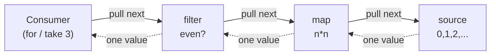

# Laziness & Streams — Junior Level

> **Roadmap:** [Functional Programming](../README.md) → Laziness & Streams
>
> *Essence: don't compute a value until someone actually asks for it — and then compute only as much as they ask for.*

---

## Table of Contents

1. [Introduction](#introduction)
2. [Prerequisites](#prerequisites)
3. [Glossary](#glossary)
4. [Eager vs Lazy Evaluation](#eager-vs-lazy-evaluation)
5. [Generators & Iterators](#generators--iterators)
6. [Infinite Sequences](#infinite-sequences)
7. [Why Laziness Helps](#why-laziness-helps)
8. [A Note on Haskell](#a-note-on-haskell)
9. [Common Mistakes](#common-mistakes)
10. [Test Yourself](#test-yourself)
11. [Cheat Sheet](#cheat-sheet)
12. [Summary](#summary)
13. [Further Reading](#further-reading)
14. [Related Topics](#related-topics)

---

## Introduction

> Focus: **What is laziness, and why does it matter?**

Most code you have written so far is **eager**: the moment you write `total = sum(numbers)`, the sum is computed right then, in full, before the next line runs. Eager evaluation is the default in almost every language, and for good reason — it's simple to reason about and matches how we read code top to bottom.

But eagerness has a cost. If you build a list of one million squared numbers and then take only the first three, you paid to compute all million. If you read an entire 10 GB log file into memory just to find the first error line, you loaded 10 GB to use a few hundred bytes. Eagerness computes *everything*, whether or not the result is needed.

**Laziness** is the opposite policy: **compute a value only when it is actually demanded, and compute only as much of it as the consumer pulls.** A lazy sequence of one million squares doesn't square anything until you ask for the first element; if you stop after three, only three squarings ever happen. A lazy view over a log file reads one line at a time and stops the instant it finds what you wanted.

That single shift — *compute-on-demand* instead of *compute-now* — is what makes the rest of this topic possible: **streams** (sequences processed element-by-element) and **infinite sequences** (sequences with no end that are still perfectly usable, because you only ever pull a finite prefix).

At the junior level your goal is to understand the **difference** between eager and lazy, recognize the **generator/iterator** machinery that produces laziness in everyday languages, and see **why** laziness avoids wasted work. You don't need to build lazy data structures by hand yet — that's later levels. You need to know when work is happening and when it isn't.

> **The mindset shift:** an eager program asks *"what is the answer?"* and computes it all. A lazy program asks *"what's the next piece you need?"* and computes one piece at a time. The second style can describe things the first cannot — like a sequence that never ends.

---

## Prerequisites

- **Required:** You can write loops and functions in at least one language (examples here use Python, Java, and Go).
- **Required:** You understand what a `for` loop over a collection does — visiting elements one at a time.
- **Helpful:** Familiarity with [Map / Filter / Reduce](../04-map-filter-reduce/junior.md) — laziness changes *when* those transformations run, not *what* they compute.
- **Helpful:** A feel for memory — knowing roughly why "load 10 GB into a list" is different from "read one line at a time."

---

## Glossary

| Term | Definition |
|------|-----------|
| **Eager evaluation** | Compute a value as soon as it is bound or an expression is reached — the default in most languages. |
| **Lazy evaluation** | Defer computing a value until it is actually needed, and compute only as much as is demanded. |
| **Thunk** | A deferred computation — a small wrapped "recipe" that produces a value the first time it's forced. The unit of laziness. |
| **Generator** | A function that *yields* values one at a time and pauses between them, resuming where it left off when asked for the next value. |
| **Iterator** | An object you can pull values from one at a time, typically via a `next()`-style call, until it signals it's exhausted. |
| **Stream** | A sequence of values processed lazily, element-by-element, often through a pipeline of transformations. |
| **Pull / demand** | The act of asking a lazy source for its next value. Nothing is computed until something pulls. |
| **Terminal operation** | The step that finally consumes a stream and forces the work to happen (e.g. collecting to a list, summing, finding the first match). |

---

## Eager vs Lazy Evaluation

Here is the same idea in both styles. We want **the first three even squares** from the numbers 0, 1, 2, ….

### Eager: compute everything, then take three

```python
# Python — eager: build the WHOLE list, then slice
numbers = list(range(1_000_000))          # 1,000,000 ints materialized
squares = [n * n for n in numbers]         # 1,000,000 multiplications done NOW
evens   = [s for s in squares if s % 2 == 0]  # 1,000,000 checks, ~500k kept
first_three = evens[:3]                     # we wanted... three of them
```

Every line runs to completion before the next begins. We did a million multiplications and built two giant lists in memory to keep **three** results. All the rest was wasted work.

### Lazy: pull only what you need

```python
# Python — lazy: a generator pipeline; nothing runs until we pull
def squares():
    n = 0
    while True:                 # an INFINITE source — fine, because it's lazy
        yield n * n
        n += 1

evens = (s for s in squares() if s % 2 == 0)  # still nothing computed yet

first_three = []
for s in evens:                  # each pull advances the pipeline by one element
    first_three.append(s)
    if len(first_three) == 3:
        break                    # we stop — and so does all the work behind us
# first_three == [0, 4, 16]; only ~5 numbers were ever squared
```

Nothing is squared, filtered, or stored until the `for` loop **pulls** a value. When we `break` after three, the machine behind the loop simply stops — no million-element list ever existed. Note the source is *infinite* (`while True`) and that's completely safe, because laziness only ever produces what's demanded.

### The shape of demand



Demand flows **right** (the consumer asks the source), values flow **left** (one at a time, back to the consumer). The source produces a number *only* when something downstream pulls it. Contrast this with eager evaluation, where the source would push out all million values first and each stage would fully process them before the next stage started.

| | Eager | Lazy |
|---|---|---|
| **When work happens** | Immediately, all at once | On demand, one piece at a time |
| **How much work** | Everything, whether used or not | Only what's pulled |
| **Memory** | Whole result held at once | One element in flight |
| **Infinite sequences** | Impossible (hangs / OOM) | Natural and safe |
| **Reasoning** | Simple, top-to-bottom | Requires knowing *what forces the work* |

---

## Generators & Iterators

Laziness in everyday languages is produced by two closely related tools: the **iterator** (the thing you pull from) and the **generator** (the easiest way to *write* an iterator).

### Python — `yield`

A generator function looks like a normal function but uses `yield` instead of `return`. Calling it doesn't run the body — it hands you a paused generator object. Each time you pull (via `next()` or a `for` loop), the body runs **up to the next `yield`**, produces that value, and pauses again, keeping all its local state.

```python
def count_up(start):
    print("started")          # does NOT print on the call below
    n = start
    while True:
        yield n               # pause here, hand back n
        n += 1                # resumes here on the next pull

gen = count_up(10)            # nothing printed yet — body hasn't run
print(next(gen))              # prints "started", then 10
print(next(gen))              # 11   (resumed after the yield)
print(next(gen))              # 12
```

The function "remembers where it was." That suspend-and-resume behavior is exactly what makes element-by-element, compute-on-demand processing possible.

### Java — `Stream` laziness

Java's `Stream` is lazy by design. **Intermediate** operations (`map`, `filter`) build up a description of the pipeline but run nothing. Only a **terminal** operation (`collect`, `findFirst`, `count`) triggers execution — and even then it pulls only as much as it needs.

```java
import java.util.stream.*;

Stream.iterate(0, n -> n + 1)        // infinite source: 0,1,2,...
      .map(n -> {                    // intermediate — lazy, runs nothing yet
          System.out.println("mapping " + n);
          return n * n;
      })
      .filter(s -> s % 2 == 0)       // intermediate — also lazy
      .limit(3)                      // short-circuits after 3 elements
      .forEach(System.out::println); // TERMINAL — now the pipeline actually runs
```

Because the terminal `forEach` (with `limit(3)`) only needs three results, the `map` lambda prints just a handful of "mapping n" lines — **not** infinitely many, even though the source is infinite. If `Stream` were eager, `Stream.iterate` would loop forever and the program would hang. Laziness is what makes the infinite source usable.

> A subtle point juniors hit: a `map` with a `println` side effect appears to "do nothing" until a terminal op is added. The work was never skipped — it simply hadn't been *demanded* yet.

### Go — iterators via channels (and range-over-func)

Go has no `yield` keyword in the Python sense, but a goroutine pushing onto a channel gives you the same pull-on-demand stream: the producer blocks until the consumer is ready for the next value.

```go
// Go — a channel-backed lazy sequence of squares
func squares() <-chan int {
    ch := make(chan int)
    go func() {
        defer close(ch)
        for n := 0; ; n++ {
            ch <- n * n        // blocks here until the consumer pulls
        }
    }()
    return ch
}

func main() {
    count := 0
    for s := range squares() { // each loop iteration pulls one value
        fmt.Println(s)
        count++
        if count == 3 {
            break              // stop pulling; the producer blocks forever, harmless here
        }
    }
}
```

The producer goroutine computes the next square only when the consumer is ready to receive it — that blocking send is the "pull." (Go 1.23+ also adds *range-over-func* iterators, a cleaner native form of the same idea; the channel version above is the classic, widely-seen pattern.)

> **The common thread:** generator, `Stream`, and channel all express the same shape — *a source that hands out values one at a time, only when asked.* The keyword differs; the laziness is identical.

---

## Infinite Sequences

Once values are produced on demand, a sequence **doesn't need an end.** This sounds exotic but it's just the natural consequence of laziness: if you only ever pull a finite number of values, the producer never has to finish.

```python
def naturals():
    n = 0
    while True:        # no termination condition — and that's fine
        yield n
        n += 1

import itertools
first_five = list(itertools.islice(naturals(), 5))  # [0, 1, 2, 3, 4]
```

The `naturals()` generator describes *all* natural numbers, but `islice(..., 5)` pulls exactly five. The `while True` loop runs five iterations and then pauses forever, harmlessly.

Why is this useful, not just a parlor trick?

- **Generate-then-take.** Describe a potentially endless source (page numbers from an API, IDs, a Fibonacci sequence, retry timestamps) once, then let the consumer decide how many to take. The producer doesn't need to know the limit.
- **Separation of concerns.** The thing that *produces* values is decoupled from the thing that decides *when to stop*. That's cleaner than threading a `count` parameter through your generator.
- **It models reality.** A stream of incoming events, sensor readings, or log lines genuinely has no predetermined end. A lazy sequence is the honest data type for it.

```python
def fibonacci():
    a, b = 0, 1
    while True:
        yield a
        a, b = b, a + b

# "First Fibonacci number over 1000" — naturally expressed, finitely computed
for f in fibonacci():
    if f > 1000:
        print(f)        # 1597
        break
```

We described an infinite sequence and asked a finite question of it. Eager evaluation cannot do this — there is no "list of all Fibonacci numbers" to build. Laziness lets the *description* be infinite while the *computation* stays finite.

---

## Why Laziness Helps

Three concrete payoffs, each a form of **avoided wasted work**:

### 1. It skips work you never use

The "first three even squares" example did ~5 multiplications instead of 1,000,000. Whenever a consumer short-circuits — `take(n)`, `findFirst`, `any`, an early `break` — every element past the stopping point is never computed. The earlier you stop, the more you save.

```java
// Stops at the first match — does NOT scan the whole stream
Optional<User> admin =
    users.stream()
         .filter(User::isActive)
         .filter(User::isAdmin)
         .findFirst();          // pulls until the first admin, then stops
```

### 2. It keeps memory flat

A lazy pipeline holds **one element in flight** at a time instead of materializing the whole collection. Processing a 10 GB file line-by-line uses kilobytes of memory; reading it into a list uses 10 GB.

```python
# Memory stays tiny — one line at a time, regardless of file size
def error_lines(path):
    with open(path) as f:
        for line in f:                 # file objects are lazy iterators
            if "ERROR" in line:
                yield line

for err in error_lines("huge.log"):    # 10 GB file, kilobytes of RAM
    print(err)
```

### 3. It composes pipelines without intermediate collections

Chaining lazy operations (`map` then `filter` then `take`) does **not** build a throwaway list between each stage. Each element flows through the whole pipeline before the next one starts, so there's no million-element intermediate. (Eager `map`/`filter` chains build a new full list at every step — see [Map / Filter / Reduce](../04-map-filter-reduce/junior.md).)

> **The rule of thumb:** laziness pays off most when (a) you might not need all the data, (b) the data is large, or (c) the data is infinite or streaming. When you *always* consume the whole small collection, eager is simpler and the difference doesn't matter — don't reach for generators reflexively.

---

## A Note on Haskell

Everything above is *opt-in* laziness bolted onto eager languages. **Haskell** flips the default: it is **lazy by default** — nothing is evaluated until its value is demanded, everywhere, automatically. A thunk (deferred computation) is the normal representation of every value.

```haskell
-- Haskell — an infinite list, and it's idiomatic, not a trick
naturals = [0..]              -- ALL natural numbers
firstFive = take 5 naturals   -- [0,1,2,3,4]

fibs = 0 : 1 : zipWith (+) fibs (tail fibs)  -- infinite Fibonacci, defined in terms of itself
take 10 fibs                  -- [0,1,1,2,3,5,8,13,21,34]
```

In Haskell you don't *write* generators — every list is already lazy, so `[0..]` is an ordinary infinite list and `take 5` just pulls five thunks. This is the "pure" form of the idea that Python, Java, and Go reconstruct piece by piece with `yield`, `Stream`, and channels. Seeing it lets you recognize the same machinery elsewhere: a thunk is what a paused generator *is*, and `take` is what a `limit`/`break`/`islice` *does*.

---

## Common Mistakes

1. **Consuming a generator twice.** A generator (Python) or a `Stream` (Java) is a **one-shot pull source**: once exhausted, it's empty. Iterating it again yields nothing.

   ```python
   gen = (n * n for n in range(5))
   print(list(gen))   # [0, 1, 4, 9, 16]
   print(list(gen))   # []  ← already drained! surprises everyone once
   ```

   Java throws `IllegalStateException: stream has already been operated upon or closed`. If you need to iterate more than once, **materialize to a list** (paying the eager cost on purpose) or **rebuild** the generator.

2. **Hidden eagerness.** Some operations quietly force the whole thing. A list comprehension `[...]` is eager; only the generator expression `(...)` is lazy. `sorted()`, `len()`, `sum()`, `list()`, and Java's `collect`/`count`/`sorted` all drain the source fully — there's no laziness left after them.

   ```python
   evens = (n for n in range(1_000_000) if n % 2 == 0)
   first = sorted(evens)[0]   # sorted() consumed ALL of it — no savings here
   ```

3. **Side effects that "don't happen."** Because intermediate stream ops are lazy, a `map` whose lambda prints or writes a file does **nothing** until a terminal operation runs. The work isn't lost — it was never demanded. Put effects where they're actually forced (later levels cover *why mixing effects into lazy pipelines is risky* — see [Pure Functions](../02-pure-functions-and-referential-transparency/junior.md)).

4. **Assuming lazy means free.** Laziness defers and skips work; it doesn't make work cheaper. If you *do* consume every element, you pay the full cost — plus a little overhead for the suspend/resume machinery. Lazy is a win for *partial* or *large* or *infinite* consumption, not a universal speedup.

5. **Infinite source with no stopping condition.** A `while True` generator is safe only because the consumer stops pulling. Pair an infinite source with `take`/`limit`/`islice`/`break`; feeding it to `list()` or `sum()` will hang forever.

---

## Test Yourself

1. In one sentence, what is the difference between eager and lazy evaluation?
2. Why can a lazy sequence be infinite while an eager list cannot?
3. In this Python code, how many times does `expensive(n)` actually run?
   ```python
   results = (expensive(n) for n in range(1000))
   for r in results:
       print(r)
       break
   ```
4. A coworker writes a Java `Stream` pipeline with a `map` that logs each element, runs the program, and sees **no log output**. Nothing crashed. What's the most likely explanation?
5. What goes wrong here, and how do you fix it?
   ```python
   squares = (n * n for n in range(5))
   total = sum(squares)
   biggest = max(squares)
   ```

<details>
<summary>Answers</summary>

1. **Eager** computes a value immediately when reached; **lazy** defers the computation until the value is actually demanded, and computes only as much as is pulled.
2. Because a lazy sequence only ever produces the values that are **pulled** — its producer never has to finish. An eager list must compute and store *every* element up front, so an endless one would never finish building (it would hang or run out of memory).
3. **Once.** The generator is lazy; the `for` loop pulls the first value (running `expensive(0)`), prints it, then `break`s. No other elements are ever demanded.
4. The `map` is an **intermediate (lazy)** operation, so it runs nothing on its own. The pipeline has **no terminal operation** (like `forEach`, `collect`, `count`) to force it — so nothing is pulled and the log lambda never executes. The work wasn't skipped; it was never demanded.
5. `sum(squares)` **drains the generator**; it's a one-shot source, so by the time `max(squares)` runs the generator is empty and `max` raises `ValueError: max() arg is an empty sequence`. Fix: materialize once — `squares = [n * n for n in range(5)]` — then both `sum` and `max` can read the list. (You pay the eager cost on purpose, which is correct when you need multiple passes.)

</details>

---

## Cheat Sheet

| Concept | What to remember |
|---|---|
| **Eager** | Compute now, in full. The default. Simple, but can do wasted work. |
| **Lazy** | Compute on demand, one piece at a time. Skips unused work; enables infinite sequences. |
| **Generator (Python)** | `yield` pauses and resumes; calling the function runs nothing until you pull. |
| **Stream (Java)** | `map`/`filter` are lazy; `collect`/`findFirst`/`count` are terminal and force the work. |
| **Channel/iterator (Go)** | Producer goroutine sends one value per consumer pull; `range` over a channel pulls. |
| **Infinite sequence** | Safe *only* with a finite consumer — pair with `take`/`limit`/`islice`/`break`. |
| **One-shot** | Generators and Streams are consumed once. Need two passes? Materialize to a list. |
| **Hidden eager** | `list()`, `sum()`, `sorted()`, `collect`, `count` drain everything — no laziness after. |

> **One rule to remember:** *Laziness pays off when you might not need all the data, the data is large, or the data is infinite. When you always consume a small whole collection, eager is simpler — and that's fine.*

---

## Summary

- **Eager evaluation** computes values immediately and in full; **lazy evaluation** computes them only when demanded and only as much as is pulled. That single change — *compute-on-demand* instead of *compute-now* — is the whole topic.
- **Generators** (`yield`), **Java `Stream`s**, and **Go channels/iterators** are the everyday tools that produce laziness. They differ in syntax but share one shape: a source that hands out values one at a time, only when asked.
- **Infinite sequences** are the natural consequence of laziness — you can *describe* an endless source and still ask a *finite* question of it, computing only the prefix you pull.
- Laziness helps by **avoiding wasted work**: it skips elements you never reach, keeps memory flat (one element in flight), and composes pipelines without throwaway intermediate collections.
- Watch for the traps: **consuming a one-shot source twice**, **hidden eagerness** (`sum`/`list`/`collect`), and **side effects that never fire** because nothing forced the lazy pipeline.
- **Haskell** is lazy by default and shows the pure form of every idea here — useful as a mental model even if you never write it.
- Next: [`middle.md`](middle.md) — *how lazy pipelines behave in real code, the performance trade-offs of laziness, and when eager is the right call.*

---

## Further Reading

- **Structure and Interpretation of Computer Programs** — Abelson & Sussman — §3.5 "Streams," the classic treatment of delayed evaluation.
- **Why Functional Programming Matters** — John Hughes (1990) — argues laziness is one of FP's two great glues; the source of the "generate then prune" insight.
- **Fluent Python** — Luciano Ramalho (2nd ed., 2022) — Chapters on iterators, generators, and `itertools`; the definitive Python treatment.
- **Effective Java** — Joshua Bloch (3rd ed., 2018) — Items on the Stream API: when laziness helps and when it misleads.

---

## Related Topics

- [Map / Filter / Reduce](../04-map-filter-reduce/junior.md) — laziness changes *when* these run; lazy chains avoid intermediate collections.
- [Pure Functions & Referential Transparency](../02-pure-functions-and-referential-transparency/junior.md) — why side effects inside lazy pipelines are surprising and best avoided.
- [Recursion & Tail Calls](../08-recursion-and-tail-calls/junior.md) — the other way FP expresses "keep going until done"; lazy streams often replace explicit recursion.
- [Immutability](../03-immutability/junior.md) — lazy sequences are read-only pull sources; you transform, never mutate.
- [Composition](../05-composition/junior.md) — lazy pipelines are composition of stream stages, evaluated on demand.
