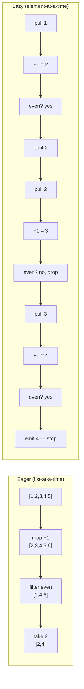

# Laziness & Streams — Middle Level

> **Roadmap:** [Functional Programming](../README.md) → Laziness & Streams
>
> *Essence:* a lazy value is a **promise to compute, not a computed result**. Once you stop thinking of a collection as "data sitting in memory" and start thinking of it as "a recipe that produces elements on demand," whole classes of problems — infinite sequences, gigabyte files, early-exit searches — collapse into small, composable pipelines.

---

## Table of Contents

1. [Introduction](#introduction)
2. [Prerequisites](#prerequisites)
3. [Lazy Pipelines: Per-Element, On Demand](#lazy-pipelines-per-element-on-demand)
4. [Short-Circuiting: Stopping Early](#short-circuiting-stopping-early)
5. [Memoized Lazy Values: Compute Once](#memoized-lazy-values-compute-once)
6. [Infinite Streams](#infinite-streams)
7. [Processing Unbounded Data](#processing-unbounded-data)
8. [Per-Language Reality](#per-language-reality)
9. [Trade-offs](#trade-offs)
10. [Common Mistakes](#common-mistakes)
11. [Test Yourself](#test-yourself)
12. [Cheat Sheet](#cheat-sheet)
13. [Summary](#summary)
14. [Further Reading](#further-reading)
15. [Related Topics](#related-topics)

---

## Introduction

> Focus: **using laziness well** — building pipelines that pull data through one element at a time, stopping the moment you have your answer, and modelling sequences that never end.

At the junior level, "laziness" probably meant a definition: *evaluation deferred until a value is needed.* That definition is correct and almost useless on its own. The middle-level skill is **operational**: knowing what actually happens when an element flows through `map → filter → take`, knowing *when* a pipeline does zero work, and knowing the handful of places where laziness silently changes performance or correctness.

The mental shift is from **collection** to **stream**. A collection is a noun — a list of values that exists in memory right now. A stream is a verb — a description of how to produce values, evaluated only as a consumer asks for them. The same `map(f)` over a collection allocates a whole new collection; over a stream it allocates *nothing* until something pulls.

This file is built around the four things you do with laziness in real code:

- **Lazy pipelines** — transform per element, without materializing intermediates.
- **Short-circuiting** — stop the entire pipeline as soon as the answer is known.
- **Memoized lazy values** — defer a *single* expensive computation and cache its result.
- **Infinite / unbounded sources** — generators, ranges, and file streams you could never hold in memory.

We'll work in **Python** (generators / `itertools`), **Java** (the `Stream` API's intermediate-vs-terminal split), and **Go** (range-over-func iterators and channels), with a sidebar on **Haskell**, where laziness is the *default* rather than an opt-in.

---

## Prerequisites

- **Required:** You've used [map / filter / reduce](../04-map-filter-reduce/middle.md) on ordinary collections and understand they each take a function and return a result.
- **Required:** You can read a `for` loop and trace which line runs how many times.
- **Helpful:** Familiarity with [pure functions](../02-pure-functions-and-referential-transparency/middle.md) — laziness is far safer when the deferred computation has no side effects.
- **Helpful:** A feel for [recursion](../08-recursion-and-tail-calls/middle.md), since several infinite-stream definitions are naturally recursive.
- **Helpful:** Comfort reading the lazy-vs-eager distinction introduced in [map / filter / reduce → senior](../04-map-filter-reduce/senior.md) (fusion).

---

## Lazy Pipelines: Per-Element, On Demand

The defining behavior of a lazy pipeline: **one element is pulled all the way through every stage before the next element starts.** Nothing is batched; no intermediate list is built.

Compare the two execution models for `numbers → +1 → keep evens → first 2`:



The eager version allocates three full lists and processes element `5`/`6` that the consumer never wanted. The lazy version allocates nothing, touches the source only as far as element `3`, and stops.

### Python — generators compose into a pipeline

A generator expression (or any function with `yield`) is a lazy producer. Chaining them builds a pipeline that does nothing until iterated.

```python
nums = range(1, 1_000_000)            # lazy range, not a million-element list

plus_one = (n + 1 for n in nums)      # nothing computed yet
evens    = (n for n in plus_one if n % 2 == 0)   # still nothing

# Only NOW does work happen — and only enough work to produce 2 values.
from itertools import islice
result = list(islice(evens, 2))       # -> [2, 4]
```

No intermediate list of a million-and-one numbers is ever built. Each `+ 1` and each `% 2` runs exactly as many times as needed to yield two evens.

### Java — intermediate operations are deferred; terminal operations run

Java's `Stream` API encodes the lazy/eager split *in the API itself*. **Intermediate** operations (`map`, `filter`, `peek`, `limit`) return a new `Stream` and run nothing. A **terminal** operation (`collect`, `findFirst`, `count`, `forEach`) is what actually drives the pipeline.

```java
List<Integer> result = Stream.of(1, 2, 3, 4, 5)
    .map(n -> n + 1)        // intermediate — recorded, not run
    .filter(n -> n % 2 == 0)// intermediate — recorded, not run
    .limit(2)               // intermediate — short-circuiting
    .collect(Collectors.toList()); // terminal — NOW the pipeline runs, element by element
```

A `Stream` with only intermediate ops and no terminal op does *zero* work — a classic source of "my `map` never ran" confusion (see [Common Mistakes](#common-mistakes)).

### Go — range-over-func iterators (Go 1.23+)

Go has no built-in lazy collection type, but since 1.23 a function with the right signature is a `range`-able iterator. The `yield` callback returning `false` is how a consumer says "stop."

```go
// An iterator is a func that pushes values into yield until yield returns false.
func Map[A, B any](seq iter.Seq[A], f func(A) B) iter.Seq[B] {
    return func(yield func(B) bool) {
        for v := range seq {
            if !yield(f(v)) {   // consumer asked to stop — propagate
                return
            }
        }
    }
}

func Filter[A any](seq iter.Seq[A], keep func(A) bool) iter.Seq[A] {
    return func(yield func(A) bool) {
        for v := range seq {
            if keep(v) && !yield(v) {
                return
            }
        }
    }
}
```

Composing `Map` and `Filter` builds a pipeline that, like Python and Java, pulls one element through all stages on demand and stops when the consumer breaks the `range` loop.

---

## Short-Circuiting: Stopping Early

Short-circuiting is the operational *payoff* of laziness: a downstream operation that needs only some prefix of the data can **terminate the entire upstream pipeline early**. With eager collections this is impossible — the upstream already ran to completion before the downstream saw anything.

| Operation | Stops as soon as… | Python | Java | Go |
|---|---|---|---|---|
| "first match" | one element matches | `next(filter(p, xs))` | `.filter(p).findFirst()` | `range` + `break` |
| "any?" | one element is true | `any(p(x) for x in xs)` | `.anyMatch(p)` | `range` + `return true` |
| "all?" | one element is false | `all(p(x) for x in xs)` | `.allMatch(p)` | `range` + `return false` |
| "take N" | N elements emitted | `islice(xs, n)` | `.limit(n)` | counter + `break` |

```python
# Find the first user over 1000 points — scans only until the first hit.
first_vip = next((u for u in stream_of_users() if u.points > 1000), None)
```

```java
// anyMatch stops at the first true — it does not evaluate the rest.
boolean hasVip = users.stream().anyMatch(u -> u.points() > 1000);
```

```go
// Manual short-circuit: break ends the range, which signals the iterator to stop.
var firstVip *User
for u := range streamOfUsers() {
    if u.Points > 1000 {
        firstVip = &u
        break   // iterator's yield returns false; upstream stops producing
    }
}
```

The crucial guarantee: in all three, if the VIP is the *third* user, **users four through one million are never produced.** That is the difference between an O(answer) scan and an O(n) scan, and it's free once the pipeline is lazy.

> **Why it matters:** short-circuiting is the only reason laziness is *required* (not just convenient) for infinite streams. `any(is_prime(n) for n in naturals())` would loop forever eagerly; lazily it stops at the first prime.

---

## Memoized Lazy Values: Compute Once

A lazy *value* (as opposed to a lazy *sequence*) defers a single expensive computation until first use — and then caches it so repeated use is free. This is laziness applied to a scalar: **compute-on-demand + compute-once.**

Use it for: an expensive config parse, a database connection, a compiled regex, a derived field nobody may ever read.

### Python

```python
from functools import cached_property

class Report:
    def __init__(self, rows):
        self._rows = rows

    @cached_property            # computed on first access, then stored on the instance
    def summary(self):
        print("computing summary...")   # prints exactly once
        return expensive_aggregate(self._rows)

r = Report(rows)
r.summary   # "computing summary..." then returns the value
r.summary   # returns cached value, no print, no recompute
```

For a module-level singleton, `functools.cache` on a zero-arg function gives the same compute-once behavior.

### Java

```java
// Idiomatic lazy field via a Supplier memoized on first call.
private Supplier<Summary> summary = memoize(this::computeSummary);

static <T> Supplier<T> memoize(Supplier<T> delegate) {
    var value = new AtomicReference<T>();
    return () -> {
        T v = value.get();
        if (v == null) {
            v = delegate.get();
            value.compareAndSet(null, v);   // first writer wins; thread-safe
        }
        return value.get();
    };
}
```

(Guava ships this as `Suppliers.memoize`. For a truly final field, the *double-checked-locking* / holder idiom is the classic alternative.)

### Go

```go
// sync.Once guarantees the computation runs exactly once, even under concurrency.
type Report struct {
    once    sync.Once
    summary Summary
    rows    []Row
}

func (r *Report) Summary() Summary {
    r.once.Do(func() { r.summary = expensiveAggregate(r.rows) })
    return r.summary
}
```

The shared idea across all three: the *first* read pays the cost; every subsequent read is a cheap field load. If nobody ever reads it, the cost is never paid at all.

> **Caveat:** memoization caches the *result*, so the deferred computation must be **pure** (or at least idempotent). Memoizing `currentTime()` or `nextRandom()` freezes a value you almost certainly wanted to be fresh.

---

## Infinite Streams

Because a lazy stream only produces elements on demand, its *definition* can describe infinitely many — you simply never ask for all of them. The producer and the "how many" decision are decoupled.

### Naturals, then derive everything else

```python
import itertools

def naturals():                 # 0, 1, 2, 3, ... forever
    n = 0
    while True:
        yield n
        n += 1

evens   = (n for n in naturals() if n % 2 == 0)
squares = (n * n for n in naturals())
first_5_squares = list(itertools.islice(squares, 5))   # [0,1,4,9,16]
```

### Fibonacci as a stream

```python
def fib():
    a, b = 0, 1
    while True:
        yield a
        a, b = b, a + b

import itertools
print(list(itertools.islice(fib(), 10)))   # 0 1 1 2 3 5 8 13 21 34
```

### `repeat` / `cycle` — constant and periodic streams

```python
from itertools import repeat, cycle
zeros   = repeat(0)              # 0, 0, 0, ... forever
weekdays = cycle(["Mon","Tue","Wed","Thu","Fri"])  # wraps around endlessly
```

### Java — infinite via `iterate` / `generate`

```java
// Naturals: iterate(seed, next-fn) — infinite, must be bounded by a short-circuit op.
Stream.iterate(0, n -> n + 1)
      .filter(n -> n % 2 == 0)
      .limit(5)                  // WITHOUT limit this never terminates
      .forEach(System.out::println);   // 0 2 4 6 8

// Fibonacci with a pair state:
Stream.iterate(new int[]{0, 1}, p -> new int[]{p[1], p[0] + p[1]})
      .map(p -> p[0])
      .limit(10)
      .forEach(System.out::println);
```

### Go — infinite iterator

```go
func Naturals() iter.Seq[int] {
    return func(yield func(int) bool) {
        for n := 0; ; n++ {        // intentionally unbounded
            if !yield(n) {         // consumer's break is the only exit
                return
            }
        }
    }
}

// Consumer decides where to stop:
for n := range Naturals() {
    if n > 8 { break }
    fmt.Println(n)
}
```

The rule for every infinite source: **the producer never decides to stop; the consumer does**, via `take` / `limit` / `islice` / `break`. Forgetting the bound is the canonical way to hang a program (see [Common Mistakes](#common-mistakes)).

---

## Processing Unbounded Data

The most practical use of laziness isn't mathematical sequences — it's data that's *finite but too large to hold in memory*: multi-gigabyte logs, paginated API responses, database cursors. You process them as a stream so memory stays **O(1) in the data size**, not O(n).

### Python — stream a huge file line by line

```python
def error_lines(path):
    with open(path) as f:           # f is itself a lazy iterator of lines
        for line in f:              # reads one line at a time, never the whole file
            if "ERROR" in line:
                yield line.rstrip()

# Counts errors in a 50 GB file using a few KB of RAM.
count = sum(1 for _ in error_lines("app.log"))
```

The contrast: `open(path).readlines()` or `f.read().split("\n")` loads the entire file into memory and can OOM. Iterating the file object is lazy and bounded.

### Java — `Files.lines` returns a lazy, closeable stream

```java
try (Stream<String> lines = Files.lines(Path.of("app.log"))) {  // lazy, not loaded
    long errors = lines.filter(l -> l.contains("ERROR")).count();
}   // try-with-resources closes the underlying file handle
```

Note the `try (...)`: a file-backed stream holds an OS resource, so it must be closed — a subtlety pure in-memory streams don't have.

### Go — `bufio.Scanner` is a pull-based line stream

```go
f, _ := os.Open("app.log")
defer f.Close()
sc := bufio.NewScanner(f)
errors := 0
for sc.Scan() {                     // pulls one line per iteration
    if strings.Contains(sc.Text(), "ERROR") {
        errors++
    }
}
```

### Pagination as an infinite-ish stream

The same shape handles a paginated API — you lazily fetch the next page only when the current one is exhausted:

```python
def all_items(client):
    cursor = None
    while True:
        page = client.fetch(cursor=cursor)   # one network call per page
        yield from page.items
        if not page.next_cursor:
            return                            # finite, but bounded by the API, not memory
        cursor = page.next_cursor

# Consumer can short-circuit after the first match — fetching only the pages it needs.
first = next((it for it in all_items(client) if it.matches(q)), None)
```

A consumer that short-circuits (`next(... )`) may fetch only **one page**; an eager `fetch_all()` would download every page first. Laziness turns "load everything, then search" into "search while loading, stop when found."

---

## Per-Language Reality

The concept is universal; the ergonomics, defaults, and footguns differ sharply.

| Aspect | Python | Java | Go | Haskell |
|---|---|---|---|---|
| **Laziness is…** | opt-in (generators, `itertools`) | opt-in per `Stream` | opt-in (iterators / channels) | the **default** for all values |
| **Pipeline unit** | generator / generator-expr | `Stream` (intermediate ops) | `iter.Seq` func / channel | thunk |
| **What triggers work** | iterating (`for`, `list`, `next`) | terminal op (`collect`, `findFirst`) | `range` / receive | pattern-match / `seq` / output |
| **Short-circuit** | `next`, `any`, `islice` | `findFirst`, `limit`, `anyMatch` | `break` / `return false` | natural — `take`, `head` |
| **Single-use?** | yes — generators exhaust | yes — a `Stream` runs once | iterators reusable; channels not | no — values are reusable |
| **Classic footgun** | consuming a generator twice | reusing a consumed `Stream` | goroutine leak on abandoned channel | space leaks from unforced thunks |

### Python: generators are *one-shot*

```python
g = (x * x for x in range(3))
print(list(g))   # [0, 1, 4]
print(list(g))   # []  ← already exhausted, NOT an error — a silent surprise
```

### Java: a `Stream` may be operated on once

```java
Stream<Integer> s = Stream.of(1, 2, 3);
s.forEach(System.out::println);
s.forEach(System.out::println);   // IllegalStateException: stream already operated upon
```

### Go: channels as lazy streams need cleanup

A producer goroutine pushing into a channel is a lazy stream, but if the consumer stops reading early, the producer **blocks forever and leaks** unless you wire up a `context`/`done` channel. The newer `iter.Seq` functions sidestep this because `range` calls the producer synchronously and signals stop via `yield`'s return value — no separate goroutine to leak.

### Haskell: laziness is the water you swim in

```haskell
nats = [0..]                 -- an infinite list, ordinary Haskell
fibs = 0 : 1 : zipWith (+) fibs (tail fibs)   -- self-referential, only works because lazy
main = print (take 10 fibs)  -- [0,1,1,2,3,5,8,13,21,34]
```

In Haskell you don't *reach for* laziness — you occasionally *force* eagerness (`seq`, `BangPatterns`) to avoid building up unevaluated thunks. The other three languages are the mirror image: eager by default, lazy on request.

---

## Trade-offs

Laziness is not free. The middle-level engineer reaches for it deliberately, knowing the costs.

**What you gain:**

- **Memory** — O(1) instead of O(n) for large/unbounded data; no intermediate collections.
- **Composability** — infinite producers compose with finite consumers; the "how much" decision lives at the call site.
- **Work avoidance** — short-circuiting means you compute only as far as the answer requires.

**What you pay:**

- **Debuggability.** A stack trace points at the *terminal* operation (where work happens), not the `map` lambda that's actually wrong. Stepping through is confusing because nothing runs until you pull. Inserting a `peek`/print mid-pipeline can itself alter timing.
- **Surprise re-computation.** A *non-memoized* lazy source recomputes on every traversal. Iterating the same generator pipeline twice does the work twice (or, for one-shot generators, yields nothing the second time). Eager collections don't have this trap.
- **Resource lifetime.** A file- or socket-backed stream holds a handle open *for as long as the stream is alive*. Forget to close it (Java) or leak a goroutine (Go) and you exhaust file descriptors.
- **Order-of-effects surprises.** If your pipeline functions have side effects, laziness changes *when* and *whether* they run — exactly why deferred computations should be [pure](../02-pure-functions-and-referential-transparency/middle.md).
- **Latency vs throughput.** Per-element processing can be slower in raw throughput than a tight eager loop over an array (worse cache behavior, per-element call overhead). For small, fully-consumed collections, eager is often *faster*.

> **Rule of thumb:** use laziness when the data is large, unbounded, or you only need a prefix. For a small list you're going to consume entirely, an eager `for` loop or list comprehension is simpler, faster, and easier to debug.

---

## Common Mistakes

1. **A Java `Stream` with no terminal operation does nothing.** `list.stream().map(this::log)` looks like it logs every element — it logs *nothing*, because `map` is intermediate and no terminal op drove the pipeline. Add `.forEach(...)` / `.collect(...)`.
2. **Reusing a consumed generator or stream.** A Python generator iterated twice is empty the second time (silent); a Java `Stream` throws `IllegalStateException`. If you need the data twice, materialize it (`list(...)` / `collect`) or rebuild the pipeline.
3. **Forgetting to bound an infinite source.** `Stream.iterate(0, n -> n + 1).forEach(...)` or `for n := range Naturals()` with no `break` hangs forever. Every infinite producer needs a consumer-side `limit` / `islice` / `break`.
4. **Memoizing an impure computation.** A `cached_property` over `datetime.now()` or a random value caches the *first* result forever — a freshness bug disguised as an optimization.
5. **Leaking resources behind a lazy stream.** `Files.lines(path)` without try-with-resources leaks a file descriptor; a producer goroutine feeding a channel that the consumer abandons leaks the goroutine. Lazy sources backed by I/O need explicit lifetime management.
6. **Side effects inside pipeline stages.** Putting a `print`, counter increment, or mutation inside a `map`/`filter` makes behavior depend on *how far* the consumer pulls — which laziness makes non-obvious. Keep stages pure; do effects in the terminal step.
7. **Choosing lazy for small, fully-consumed data.** Wrapping a 5-element list in a generator pipeline adds overhead and debugging friction with zero memory benefit. Match the tool to the data size.

---

## Test Yourself

1. In Java, why does `users.stream().map(u -> sendEmail(u))` send no emails, and what one change fixes it?
2. You write `g = (x*x for x in range(5))`, then call `list(g)` twice. Why is the second result empty, and how would you get `[0,1,4,9,16]` both times?
3. Explain why `any(is_prime(n) for n in naturals())` terminates but `[is_prime(n) for n in naturals()]` does not.
4. You add `@cached_property` to a method that returns `time.time()`. What bug have you introduced?
5. A 40 GB log file needs its `ERROR` lines counted. Why is iterating the file object preferable to `f.read().splitlines()`, and what's the memory difference?
6. When is an eager `for` loop the *better* choice over a lazy pipeline?

<details>
<summary>Answers</summary>

1. `map` is an **intermediate** operation — it records the transformation but runs nothing without a **terminal** operation. With no terminal op the pipeline never executes, so no emails go out. Add a terminal op such as `.count()` or `.forEach(u -> {})` (better: don't hide side effects in `map` at all — iterate and send in the terminal step).
2. A generator is **one-shot**: the first `list(g)` exhausts it, leaving nothing to yield. To consume it twice, either materialize once (`squares = list(g)` then reuse the list) or define a function/comprehension you can call again to build a fresh generator.
3. `any` is **short-circuiting** — it pulls from the lazy generator only until the first `True`, then stops, so it never asks `naturals()` for an unbounded number of elements. The list comprehension is **eager** — it tries to build the *entire* list first, which over an infinite source never completes.
4. `cached_property` computes on first access and **caches the result forever**. `time.time()` is impure (different every call), so the property returns the timestamp of first access on every subsequent read — a stale value. Memoization is only safe for pure/idempotent computations.
5. Iterating the file object reads **one line at a time** (O(1) memory in file size); `f.read().splitlines()` loads all 40 GB into RAM at once and likely OOMs. The lazy form uses a few KB regardless of file size.
6. When the data is **small and fully consumed**: an eager loop is simpler, faster (better cache locality, no per-element generator overhead), and easier to debug — and you gain no memory or short-circuit benefit because you're touching every element anyway.

</details>

---

## Cheat Sheet

| Goal | Python | Java | Go |
|---|---|---|---|
| Lazy producer | generator / genexpr | `Stream` | `iter.Seq` func / channel |
| Lazy map | `(f(x) for x in xs)` | `.map(f)` | custom `Map` iterator |
| Lazy filter | `(x for x in xs if p(x))` | `.filter(p)` | custom `Filter` iterator |
| Take N | `islice(xs, n)` | `.limit(n)` | counter + `break` |
| First match | `next((x for x in xs if p(x)), None)` | `.filter(p).findFirst()` | `range` + `break` |
| Any / all | `any(...)` / `all(...)` | `.anyMatch` / `.allMatch` | `range` + `return` |
| Infinite naturals | `count()` / `while True: yield` | `Stream.iterate(0, n->n+1)` | unbounded `for` in iterator |
| Memoized value | `@cached_property` / `@cache` | `Suppliers.memoize` | `sync.Once` |
| Stream a big file | `for line in open(p)` | `Files.lines(p)` (close it!) | `bufio.Scanner` |
| Drive the work | iterate / `list` / `next` | terminal op | `range` / receive |

**Three rules:**
- *Lazy = a recipe, not a result; nothing runs until a consumer pulls.*
- *Every infinite source needs a consumer-side bound (`take` / `limit` / `break`).*
- *Defer pure computations only; memoize results only when re-running would give the same answer.*

---

## Summary

- A lazy stream is a **description of how to produce values**, evaluated **per element, on demand** — no intermediate collections, no work until a consumer pulls.
- **Short-circuiting** (`findFirst`, `take`, `any`) turns an O(n) scan into O(answer) and is what makes infinite streams usable at all.
- **Memoized lazy values** apply the same defer-then-cache idea to a single scalar — compute on first use, free thereafter — but only for **pure** computations.
- **Infinite sources** (naturals, fibonacci, `repeat`) work because the *producer never decides to stop*; the *consumer* bounds them.
- The biggest real-world win is **processing finite-but-huge data** (gigabyte files, paginated APIs) in O(1) memory by streaming instead of loading.
- Per language: Python (generators/`itertools`) and Java (`Stream` intermediate-vs-terminal) and Go (range-over-func / channels) are **lazy on request**; Haskell is **lazy by default**. The footguns — one-shot exhaustion, missing terminal op, unbounded loops, leaked handles — differ but rhyme.
- **Trade-offs**: harder debugging, surprise re-computation, resource lifetime, and per-element overhead. Reach for laziness when data is large, unbounded, or only partially needed; prefer an eager loop for small, fully-consumed collections.

---

## Further Reading

- *Structure and Interpretation of Computer Programs* — Abelson & Sussman — Chapter 3.5, "Streams," the canonical treatment of delayed evaluation and infinite sequences.
- *Why Functional Programming Matters* — John Hughes (1990) — the section on lazy evaluation as a *glue* that lets you separate "what to produce" from "how much to consume."
- *Effective Java* — Joshua Bloch (3rd ed.) — Items 45–48 on using Streams judiciously, and the laziness of intermediate operations.
- *Fluent Python* — Luciano Ramalho (2nd ed.) — chapters on iterators, generators, and `itertools` recipes.
- Go blog: *Range Over Function Types* — the design and use of `iter.Seq` push iterators.

---

## Related Topics

- [Map / Filter / Reduce → middle](../04-map-filter-reduce/middle.md) — the operations whose lazy variants this file builds pipelines from; see [its senior file](../04-map-filter-reduce/senior.md) for stream fusion.
- [Pure Functions & Referential Transparency → middle](../02-pure-functions-and-referential-transparency/middle.md) — why deferred and memoized computations must be pure.
- [Recursion & Tail Calls → middle](../08-recursion-and-tail-calls/middle.md) — several infinite-stream definitions are naturally recursive.
- [Immutability → middle](../03-immutability/middle.md) — streams pair with immutable values to keep pipelines safe to share.
- [Monads — Plain English → middle](../09-monads-plain-english/middle.md) — lazy `IO`/`Stream` as a deferred-effect structure.
- Same topic, other levels: [`junior.md`](junior.md) (recognizing laziness), `senior.md`, `professional.md`, `interview.md`.
- Beyond FP: Concurrency — Go channels as lazy streams and back-pressure.
