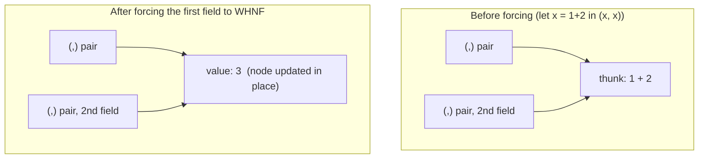

# Laziness & Streams — Professional Level

> **Roadmap:** [Functional Programming](../README.md) → Laziness & Streams
> **Essence:** Laziness is not a syntax feature — it is a *runtime representation*. A lazy value is a heap-allocated **thunk** (a suspended computation) that is **forced** to **Weak Head Normal Form** on demand, and the difference between a clean program and a heap-leaking one is entirely about *when* and *how often* those thunks are forced.

---

## Table of Contents

1. [Introduction](#introduction)
2. [Prerequisites](#prerequisites)
3. [Thunks & Weak Head Normal Form](#thunks--weak-head-normal-form)
4. [Graph Reduction & Sharing](#graph-reduction--sharing)
5. [Space Leaks & Strictness — `foldl` vs `foldl'`](#space-leaks--strictness--foldl-vs-foldl)
6. [Generator / Coroutine Runtime Cost](#generator--coroutine-runtime-cost)
7. [Fusion & Deforestation](#fusion--deforestation)
8. [Measurement](#measurement)
9. [Common Mistakes](#common-mistakes)
10. [Test Yourself](#test-yourself)
11. [Cheat Sheet](#cheat-sheet)
12. [Summary](#summary)
13. [Further Reading](#further-reading)
14. [Related Topics](#related-topics)

---

## Introduction

> Focus: **what a lazy value *is* at the machine level**, **what it costs** (thunk allocation, GC scanning, frame suspension), and **how to measure** whether laziness saved work or quietly built a leak.

`senior.md` taught you to *use* laziness to express infinite sequences, short-circuit pipelines, and decouple producers from consumers. This file goes one layer down — to the **runtime**. The questions here are not "what does `lazy` mean" but "how many bytes did that `foldl` retain on the heap, why, and which tool would have shown you before it OOM'd production?"

Two facts shape everything below:

1. **Laziness is a space–time trade made by *deferring* work into a heap object.** A thunk lets you avoid computing a value you might never need — but until it is forced, it *retains everything it closes over*. The same mechanism that gives you `take 5 (map expensive [1..])` for free is the mechanism that turns a naive sum-a-million-numbers loop into a million-deep chain of unevaluated additions.
2. **"Lazy" in the mainstream is almost never Haskell-style laziness.** Python generators, Java `Stream`, and Go's range-over-func are *demand-driven iteration*, not graph reduction. They suspend a **stack frame** or thread a **lambda chain**, not a thunk graph, and their costs and leak modes are different. Knowing which model you are in is the whole game.

> **The mental model:** a lazy value is a node in a graph that is either an **unevaluated thunk** (a closure: code + captured environment) or an **already-reduced value**. Forcing walks the graph, reduces nodes to WHNF, and — crucially — *updates the node in place* so the work is shared, never repeated.

---

## Prerequisites

- **Required:** Fluent with [`senior.md`](senior.md) — you can build infinite streams and short-circuiting lazy pipelines and reason about evaluation order.
- **Required:** A working model of a managed heap and a tracing GC (allocation, reachability, mark/scan), and of a call stack (frames, suspension). See [Bad Structure → professional](../../anti-patterns/01-development/01-bad-structure/professional.md) for the runtime vocabulary.
- **Required:** You can read a heap profile and a microbenchmark comparison and tell signal from noise (profiling-techniques, memory-leak-detection, big-o-analysis).
- **Helpful:** Comfort with Haskell syntax for the internals sections; the mainstream sections assume Python, Java, and Go.

---

## Thunks & Weak Head Normal Form

In a lazy language (Haskell is the canonical one), evaluating an expression does **not** compute its value. It allocates a **thunk**: a heap object holding a pointer to the code that *would* compute the value, plus the captured free variables that code needs. The value is computed only when something **forces** it — and "force" has a precise, partial meaning.

### What "force" means: WHNF, not full evaluation

Forcing reduces an expression to **Weak Head Normal Form (WHNF)**: just far enough to expose the **outermost constructor** (or lambda). It does *not* evaluate the arguments inside that constructor. This is the single most misunderstood point about laziness.

```haskell
-- These are all in WHNF — outermost shape is known, contents may be thunks:
(1 + 1, 2 + 2)        -- WHNF: a pair constructor (,). Neither component evaluated.
3 : map f [4,5,6]     -- WHNF: a cons cell (:). Head and tail still thunks.
Just (error "boom")   -- WHNF: the Just constructor. Forcing it does NOT explode.

-- NOT in WHNF — outermost shape is an unapplied function call:
1 + 1                 -- redex; forcing reduces it to 2
if c then x else y    -- must pick a branch to reach WHNF
```

`seq a b` forces `a` to **WHNF** (not deeper) and returns `b`. This is the primitive everything else is built on. `Just (error "boom") \`seq\` ()` evaluates to `()` *without* throwing — `seq` only exposed the `Just` constructor, never touched its contents. To force deeper you need `deepseq` (full **Normal Form**, NF) from the `deepseq` package, which costs a full structural traversal.

### Anatomy of a thunk

A thunk is a small heap object. Conceptually:

```
thunk node:
  +------------------+
  | info ptr  -------|--> evaluation code (the "how to compute me")
  +------------------+
  | free var 1       |    captured environment — these stay ALIVE
  | free var 2       |    as long as the thunk is unforced
  | ...              |
  +------------------+
```

The captured free variables are why a thunk is not free: **an unforced thunk pins everything it references in the heap.** A thunk that closes over a 100 MB list keeps that list alive until forced, even if the "result" would be a single integer. This is the seed of most space leaks.

### The cost ledger

| Operation | Cost | Notes |
|---|---|---|
| Allocate a thunk | heap allocation (~2–4 words + captured vars) | cheap individually, deadly in bulk |
| Force a thunk (first time) | run its code + **update node in place** | the update is what enables sharing |
| Force a thunk (subsequent) | pointer indirection to the cached value | ~free — this is the payoff |
| Keep a thunk unforced | retains all captured vars in the heap | GC must scan it; it pins memory |

> **The trade in one line:** laziness wins when forcing is *avoided* (you never needed the value) or *shared* (you needed it many times, computed once). It loses when you build a large thunk you *will* force anyway — you paid allocation + GC scan to defer work you always do.

---

## Graph Reduction & Sharing

Haskell's runtime evaluates by **graph reduction**: the program is a graph of nodes (thunks and values), and evaluation repeatedly finds a **redex** (reducible expression), reduces it one step toward WHNF, and — the key move — **overwrites the redex node with its result**. Because other parts of the graph point at the *same node*, they all see the reduced value. This **in-place update** is how laziness gives you **sharing** (also called *call-by-need*, as opposed to *call-by-name* which would recompute).



Both fields of the pair point at the **same thunk node**. Force one, and the node is overwritten with `3`; the second field, sharing the pointer, gets `3` for free. `1 + 2` runs **once**, not twice. Call-by-name would recompute it per use; call-by-need (Haskell) computes once and shares.

### CAFs: top-level sharing that never goes away

A **Constant Applicative Form (CAF)** is a top-level thunk with no arguments — a named constant whose value is computed once on first use and then **retained for the lifetime of the program**:

```haskell
-- A CAF: computed once, on first demand, then shared forever.
primes :: [Int]
primes = sieve [2..]         -- the whole evaluated prefix is RETAINED

-- Using it:
main = do
  print (primes !! 1000)     -- forces the first 1001 primes; they stay in memory
  print (primes !! 2000)     -- reuses the shared prefix, computes 1001..2000
```

CAF sharing is a feature (memoization for free — `primes !! 2000` reuses the prefix) **and** a hazard: a CAF holding a large lazily-grown structure is a permanent root the GC can never collect. A top-level `let bigCache = [0..]` that gets forced deep is a memory leak with the lifetime of the process. The cure when you *don't* want retention is to make the value a function (recomputed, not shared) or scope it locally so it becomes garbage after use.

> **Sharing is the whole point and the whole danger.** It turns repeated work into a one-time cost (good) and turns a transient computation into a permanent heap root (bad). Whether a given thunk is shared depends on whether it is *named and reachable* — which is exactly what a heap profiler shows you.

---

## Space Leaks & Strictness — `foldl` vs `foldl'`

This is the canonical lazy-evaluation footgun, and the one you will actually hit in production. A left fold that should run in constant space instead builds a **thunk chain** linear in the input, then forces it all at once — blowing the stack or the heap.

### The leak: lazy `foldl` builds a thunk chain

```haskell
-- foldl is lazy in the accumulator. Summing a million numbers:
foldl (+) 0 [1..1000000]
```

Because `foldl` does not force the accumulator at each step, the accumulator after the loop is **not** `500000500000` — it is a nested, unevaluated chain:

```
((((0 + 1) + 2) + 3) + ... + 1000000)
```

That is **one million nested `(+)` thunks** sitting on the heap, each pinning its operands. Nothing is forced until the *final* result is demanded — at which point the runtime must walk the entire chain, and the recursion to evaluate it overflows the stack (or thrashes the heap). The accumulator that "should" be 8 bytes is instead ~megabytes of suspended additions.

```
+--------+     +--------+     +--------+           +--------+
| (+) ? 1| --> | (+) ? 2| --> | (+) ? 3| -- ... -->| (+) 0 1|
+--------+     +--------+     +--------+           +--------+
   ^ outermost thunk; forcing it forces the entire chain inward
```

### The fix: `foldl'` forces the accumulator each step

`foldl'` (from `Data.List`) is the **strict** left fold: it forces the accumulator to WHNF *before* the next step, so the accumulator is always a single reduced number, never a chain.

```haskell
import Data.List (foldl')
foldl' (+) 0 [1..1000000]    -- accumulator stays a single Int; constant space
```

Now each step reduces `acc + x` immediately; the heap holds one integer at a time. This is the difference between O(n) and O(1) accumulator space.

> **Before / after — labeled illustrative numbers** (sum of `[1..10_000_000]`, GHC, `+RTS -s`):
>
> | | Peak residency | Total allocation | Result |
> |---|---|---|---|
> | `foldl (+) 0` | **~480 MB** (thunk chain) | high | often **stack overflow** before completing |
> | `foldl' (+) 0` | **~50 KB** (one Int) | low | completes in constant space |
>
> *Numbers are illustrative — reproduce on your machine with `+RTS -s` and a heap profile (`-hT`). The *shape* (linear-in-n vs constant) is the real lesson, not the megabytes.*

### Strictness analysis, `seq`, and bang patterns

The compiler can sometimes *prove* a value is always forced (strictness analysis) and evaluate it eagerly without you asking — GHC's demand analyzer does this and will, in optimized builds, often fix a naive `foldl` on a simple accumulator. But it cannot prove it in general (laziness is the semantic default), so you make strictness explicit:

```haskell
-- seq forces acc to WHNF before recursing — manual strictness:
mySum = go 0 where
  go !acc []     = acc
  go  acc (x:xs) = let acc' = acc + x in acc' `seq` go acc' xs

-- BangPatterns extension: the ! forces the binding to WHNF on entry. Idiomatic.
{-# LANGUAGE BangPatterns #-}
mySum = go 0 where
  go !acc []     = acc
  go !acc (x:xs) = go (acc + x) xs   -- !acc keeps the accumulator strict
```

A strict field in a data type (`data T = T !Int`) forces that field on construction — the standard way to make a record incapable of holding a thunk leak. **WHNF is usually enough** for an `Int` accumulator (the constructor *is* the value). For a tuple or record accumulator, `seq` only forces the outermost constructor — you can still leak inside it, which is the subtle "lazy in the second component of the pair" leak that `seq`-ing the pair does *not* fix; you need to force the components (`deepseq`, strict fields, or `seq` on each).

> **The professional rule:** *strict by default in accumulators, lazy by default in producers.* Fold accumulators, loop counters, and anything you will definitely force → make strict (`foldl'`, bang patterns, strict fields). Producers and pipelines where you might short-circuit → keep lazy. Mixing these up is where both leaks (lazy accumulator) and lost laziness (strict producer) come from.

---

## Generator / Coroutine Runtime Cost

Step outside Haskell and "laziness" means something operationally different: **demand-driven iteration**. There is no thunk graph and no graph reduction. Instead, a producer is *suspended* and *resumed* on demand. The costs are frame suspension and per-item call overhead, not thunk allocation — and the leak modes differ too.

### Python generators: frame suspend / resume

A Python generator is a **suspended stack frame**. Calling a generator function does not run its body; it creates a generator object holding a frame. Each `next()` resumes the frame, runs to the next `yield`, and suspends again — saving the instruction pointer and locals. The cost model:

- **Per-item cost:** resume/suspend is roughly a function-call's worth of interpreter overhead per `yield`. For trivial bodies this can make a generator *slower* per element than building a list, while using dramatically less memory.
- **Memory:** O(1) live items instead of O(n) — the whole point. A generator over 10M rows holds one frame, not 10M objects.

```python
# Eager: materializes the entire 10M-element list — peak memory O(n).
def squares_list(n):
    return [x * x for x in range(n)]      # all 10M ints live at once

# Lazy: one frame suspended; yields on demand — peak memory O(1).
def squares_gen(n):
    for x in range(n):
        yield x * x                       # suspends here each iteration
```

> **Before / after — labeled illustrative numbers** (`sum()` over n = 10_000_000, CPython 3.12, `tracemalloc` for peak, `timeit` for time):
>
> | | Peak memory | Wall time | Notes |
> |---|---|---|---|
> | `sum([x*x for x in range(n)])` (eager list) | **~400 MB** | ~0.9 s | list of 10M ints fully materialized |
> | `sum(x*x for x in range(n))` (generator) | **~0.1 MB** | ~1.0 s | one frame; slightly slower per item, ~4000× less memory |
>
> *Illustrative — measure with `tracemalloc.get_traced_memory()` and `timeit`. The takeaway: the generator trades a tiny per-item time overhead for an enormous memory win. When the consumer **short-circuits** (e.g. `any(...)`, `next(...)`), the generator is also faster because it stops producing.*

The short-circuit case is where laziness wins on *both* axes:

```python
# Eager: build all matches, then check — O(n) work and memory even if first matches.
found = len([r for r in rows if r.flagged]) > 0
# Lazy: stops at the FIRST flagged row — often O(1) work, O(1) memory.
found = any(r.flagged for r in rows)
```

### Java Streams: no native laziness — Spliterator + lambdas

The JVM has **no native lazy evaluation**. `java.util.stream.Stream` simulates it: a stream is a *pipeline description* — a chain of lambda objects (the `map`/`filter` functions) over a **`Spliterator`** (the source). Intermediate operations (`map`, `filter`) are lazy *records of intent*; nothing runs until a **terminal** operation (`collect`, `findFirst`, `reduce`) pulls elements through the lambda chain. There is no thunk and no graph — just a fused traversal that applies the lambdas per element.

```java
// Intermediate ops build the pipeline; NOTHING runs yet.
// findFirst is terminal AND short-circuiting — stops at the first match.
Optional<Order> first = orders.stream()
    .filter(o -> o.total() > 1000)   // lambda, not yet invoked
    .map(Order::customer)            // lambda, not yet invoked
    .findFirst();                    // pulls elements until one passes — then stops
```

Costs: each element passes through a chain of (often non-inlined at first) lambda invocations; megamorphic lambda call sites can defeat JIT inlining (see [Bad Structure → professional](../../anti-patterns/01-development/01-bad-structure/professional.md) on megamorphism). For tight numeric loops a plain `for` loop frequently beats a `Stream` until the JIT warms up and inlines the pipeline. The laziness payoff is the same as elsewhere: **short-circuit terminals (`findFirst`, `anyMatch`, `limit`) avoid producing the tail.**

### Go: range-over-func iterators and channels

Go has two streaming idioms. As of Go 1.23, **range-over-func** lets a function drive a `for ... range`: the iterator calls a `yield` callback per element, and the loop body *is* that callback. Suspension is via ordinary function calls — cheap, no goroutine, no allocation per item beyond the closure.

```go
// Range-over-func: lazy, single-goroutine, cheap. The loop body is `yield`.
func Squares(n int) func(yield func(int) bool) {
    return func(yield func(int) bool) {
        for x := 0; x < n; x++ {
            if !yield(x * x) {   // consumer returned false → stop early (short-circuit)
                return
            }
        }
    }
}
// for v := range Squares(1_000_000) { ... break stops production ... }
```

The older idiom — a **goroutine + channel** producer — is true concurrent streaming but **much more expensive per item**: each send/receive is a synchronization point (channel ops cost on the order of tens to ~100+ ns each, plus goroutine scheduling), and a leaked producer goroutine blocked on a send is a classic Go goroutine leak. Range-over-func is the right default for *lazy sequencing*; channels are for *concurrent* producer/consumer, where the cost buys you parallelism, not just laziness.

> **The mainstream reality:** none of these is graph reduction. Python suspends a frame (per-`yield` interpreter cost), Java threads lambdas over a Spliterator (per-element call cost, JIT-dependent), Go calls a yield closure or synchronizes a channel. All deliver the *semantic* win of laziness — produce-on-demand and short-circuit — without thunk leaks, but with their own costs (frame overhead, lambda dispatch, goroutine/channel cost) and their own leaks (held generator, leaked producer goroutine).

---

## Fusion & Deforestation

A lazy (or stream) pipeline like `map f . filter p . map g` naively builds **intermediate collections** between each stage. **Deforestation** (Wadler) / **fusion** is the optimization that eliminates those intermediates, turning the pipeline into a single pass with no intermediate allocation — "removing the trees (intermediate data structures) from the forest."

### Haskell: build/foldr and stream fusion

GHC fuses list pipelines via rewrite rules. The classic `foldr/build` rule and modern **stream fusion** (used in `vector` and `text`) rewrite a producer-immediately-consumed pattern so the intermediate list is never allocated:

```haskell
-- Naively: map (+1) allocates a list, sum consumes it → one intermediate list.
sum (map (+1) [1..n])
-- After fusion: the (+1) is folded directly into the summation loop.
-- No intermediate list is ever built — a single tight loop.
```

Fusion is why idiomatic Haskell pipelines can match hand-written loops: the intermediates exist *in the source* for readability but are *compiled away*. It is fragile, though — it depends on the rewrite rules firing, which they may not across module boundaries or behind certain abstractions. You verify fusion happened by reading Core (`-ddump-simpl`) or by the allocation numbers (`+RTS -s`): if `sum (map (+1) [1..n])` allocates O(n), fusion did **not** fire.

### The mainstream analogue

- **Java Streams** fuse by construction: intermediate ops don't materialize collections; elements flow one-at-a-time through the fused lambda chain to the terminal op. `list.stream().filter(p).map(f).collect(...)` makes **one** pass, not three lists.
- **Rust iterators** are the gold standard: the iterator adapter chain (`.filter().map()...`) is monomorphized and inlined into a single loop with zero intermediate allocation — "zero-cost abstraction."
- **Python generators** chain lazily (`map(f, filter(p, xs))` passes items through without intermediate lists), giving fusion-like memory behavior, though with per-item call overhead rather than a fused loop.
- **Go** range-over-func composes similarly: chained iterators pass items through yield calls without intermediate slices.

> **The principle is universal even where the mechanism differs:** lazy/streaming pipelines let you *write* `map . filter . map` for clarity while *executing* a single pass with no intermediate collection. The win is both memory (no intermediates) and time (one traversal, often short-circuited). See [Map / Filter / Reduce → professional](../04-map-filter-reduce/professional.md) for fusion at the operator level.

---

## Measurement

Every claim above has an instrument. If you cannot point at the tool that would falsify your laziness claim, you are guessing.

| Concern | Haskell | Python | Java / JVM | Go |
|---|---|---|---|---|
| **Peak heap / residency** | `+RTS -s`, `-hT`/`-hc` heap profile | `tracemalloc`, `memray` | JFR heap, `jmap`, MAT | `pprof -alloc_space`, `-inuse_space` |
| **Thunk / leak diagnosis** | `-hT` (closure type), `-hb` (biography: lag/drag/void/use) | `tracemalloc` snapshots diff | JFR allocation profiling | `pprof` alloc, `runtime.ReadMemStats` |
| **Time / per-item cost** | Criterion | `timeit`, `pyperf` | JMH | `testing.B` + `benchstat` |
| **Did fusion fire?** | `-ddump-simpl`, allocation in `+RTS -s` | (n/a — read the code) | `-XX:+PrintInlining` | `-gcflags=-m` (inlining) |
| **Goroutine / frame leaks** | (n/a) | (held generator refs) | thread dumps | `pprof` goroutine profile |

```bash
# Haskell: RTS summary — total allocation, peak residency, GC time.
ghc -O2 prog.hs && ./prog +RTS -s
# Haskell: heap profile by closure type — THUNK on top = a thunk leak.
ghc -O2 -prof -fprof-auto prog.hs && ./prog +RTS -hT && hp2ps -c prog.hp

# Python: peak memory of a lazy vs eager version.
python -c "import tracemalloc; tracemalloc.start(); \
  sum(x*x for x in range(10_000_000)); print(tracemalloc.get_traced_memory())"

# Java: JMH A/B of eager loop vs Stream (warm up the JIT first!).
java -jar benchmarks.jar StreamVsLoop -prof gc

# Go: benchmark range-over-func vs channel producer, with allocations.
go test -bench=Squares -benchmem ./... | tee /tmp/before.txt
```

**Reading a Haskell heap profile for a thunk leak:** run with `+RTS -hT`. If the dominant band is `THUNK` (or `THUNK_*`) and it *grows over time*, you have a building thunk chain — the `foldl` leak signature. A `-hb` (biography) profile classifies heap as **lag** (allocated but not yet used), **drag** (used but still retained), **void** (never used — pure waste), and **use**; high *drag* means you're holding things past their last use, often a CAF or an over-broad closure.

**The measurement discipline (mirrors [Bad Structure → professional](../../anti-patterns/01-development/01-bad-structure/professional.md)):** capture a baseline, change *one* lever (`foldl` → `foldl'`, list → generator, loop → Stream), re-measure. Never attribute a blended memory win to a blended change. And warm up the JVM — a cold JMH run will tell you the loop beats the Stream when, warmed up, they tie.

---

## Common Mistakes

Professional-level mistakes — subtle, and therefore expensive:

1. **Using lazy `foldl` for a strict accumulation.** The textbook thunk-chain leak. Use `foldl'` (or a bang-pattern loop) whenever you will force the whole result anyway. `foldr` is for lazy/short-circuiting consumers; `foldl'` is for strict accumulation; `foldl` is almost never what you want.
2. **Thinking `seq` forces deeply.** `seq` reduces to **WHNF only** — the outermost constructor. `seq` on a tuple does *not* force its components; you can still leak inside a "forced" pair. Use strict fields or `deepseq` when you need NF, and know it costs a full traversal.
3. **A CAF that grows without bound.** A top-level lazily-grown structure (cache, memo list) is a permanent GC root. Free memoization is a feature until it's a leak — scope it or recompute when you don't want lifetime-of-process retention.
4. **Assuming laziness is always a win.** If you *always* force a value, deferring it cost you a thunk allocation and GC scan for nothing. Laziness pays when forcing is *avoided* or *shared*, not when it's merely postponed.
5. **Confusing Haskell laziness with generator laziness.** Generators/Streams/range-over-func are demand-driven *iteration* (frame/lambda suspension), not graph reduction. They don't have thunk-chain leaks; they have *held-iterator* and *leaked-producer* leaks. Different model, different failure modes.
6. **Iterating a generator twice.** A Python generator (and a Java `Stream`) is single-use — exhausted after one pass. Re-iterating silently yields nothing. If you need multiple passes, materialize once or use a re-iterable.
7. **Benchmarking Java Streams cold.** A cold-JIT Stream loses to a `for` loop; warmed up they're usually comparable because the pipeline inlines. JMH with proper warmup, or you're measuring the interpreter.
8. **Leaking a Go producer goroutine.** A goroutine blocked forever on a channel send because the consumer stopped reading is a leak the GC can't collect (it's reachable, blocked). Prefer range-over-func for pure laziness; use `context`/cancellation for channel producers.
9. **Assuming fusion fired.** Fusion is an optimization, not a guarantee — it can fail to fire across module boundaries or behind abstractions. Confirm with allocation numbers (`+RTS -s`), don't assume your `map . filter` compiled to one loop.

---

## Test Yourself

1. Explain what "force to WHNF" means and why `Just (error "boom") \`seq\` ()` evaluates to `()` without throwing.
2. Why does `foldl (+) 0 [1..1000000]` risk a stack overflow while `foldl' (+) 0 [1..1000000]` runs in constant space? Describe what's on the heap in each case.
3. In `let x = expensive in (x, x)`, how many times does `expensive` run, and what runtime mechanism guarantees that?
4. A teammate adds `acc \`seq\` go acc' xs` to a fold whose accumulator is a `(Int, Int)` tuple, and it *still* leaks. Why didn't `seq` fix it, and what would?
5. A Python generator uses ~constant memory but is slightly *slower* per element than the equivalent list comprehension when fully consumed. Explain both halves. When does the generator also win on time?
6. The JVM has no native laziness, yet `stream().filter(...).findFirst()` short-circuits. How does that work, and what is actually lazy here?
7. What is a CAF, why is its sharing both a memoization benefit and a leak hazard, and how would a `-hT` heap profile reveal the hazard?
8. You write `sum (map (+1) [1..n])` expecting fusion to give a single allocation-free loop, but `+RTS -s` shows O(n) allocation. What happened and how would you investigate?

<details>
<summary>Answers</summary>

1. Forcing to **WHNF** reduces an expression just far enough to expose its **outermost constructor or lambda** — not its contents. `seq` forces only to WHNF. `Just (error "boom")` is *already* in WHNF (the outer `Just` constructor is visible), so `seq` exposes `Just` and stops; the `error` thunk inside is never forced, hence no exception. Forcing the contents would require `deepseq` / pattern-matching deeper.
2. `foldl` is lazy in the accumulator, so it never reduces `acc` mid-loop — after the traversal the accumulator is a **chain of ~1,000,000 nested `(+)` thunks** on the heap (O(n) space). Forcing the final result recurses through the whole chain and overflows the stack. `foldl'` forces the accumulator to WHNF at **each step**, so the heap holds a single reduced `Int` at a time (O(1) space).
3. **Once.** `x` is a single named thunk node; the pair's two fields both point at it. Graph reduction overwrites that node with the computed value in place on first force (**call-by-need / sharing**), so the second use sees the cached value — `expensive` does not re-run.
4. `seq` forces only to **WHNF** — the outermost `(,)` constructor — which is *already* exposed for a tuple, so `seq` does essentially nothing; the two `Int` components inside remain unevaluated thunks that chain up and leak. Fix: force the components (`seq` on each field, **strict fields** `data P = P !Int !Int`, or `deepseq`).
5. **Constant memory:** a generator is one suspended frame yielding items on demand, so only O(1) items are live — versus the list comprehension materializing all n at once. **Slightly slower per element:** each `yield`/`next` is a frame resume/suspend with interpreter overhead, more than a tight list-building loop pays per element. The generator **also wins on time** when the consumer **short-circuits** (`any`, `next`, `break`) — it stops producing, doing far less total work.
6. A `Stream` is a **pipeline description**: intermediate ops (`filter`, `map`) just record lambdas over a `Spliterator`; nothing runs until a **terminal** op pulls elements through. `findFirst` is terminal *and* short-circuiting — it pulls elements one at a time and **stops at the first** that passes, so the tail is never produced. The laziness is in *deferring execution to the terminal op and pulling per-element*, not in any thunk graph.
7. A **CAF** is a top-level argument-less thunk — a named constant computed **once on first demand and retained for the program's lifetime**. Sharing makes it free memoization (later uses reuse the computed value) but also a **permanent GC root**: a CAF holding a large lazily-grown structure can never be collected. A `-hT` heap profile would show a large, non-shrinking band attributable to that structure that never drops even when you'd expect it to be garbage.
8. **Fusion did not fire.** O(n) allocation means the intermediate list from `map (+1)` was actually built. Causes: the rule didn't fire across a module boundary, an intervening abstraction blocked it, or `-O2` wasn't on. Investigate by dumping Core (`-ddump-simpl`) to see whether the intermediate list survives, and compare `+RTS -s` allocation against a hand-fused version; consider `vector`/stream-fusion or rewriting to a single fold.

</details>

---

## Cheat Sheet

| Concept | One-line truth | Cost / payoff | Measure with |
|---|---|---|---|
| **Thunk** | Heap closure = code + captured env, computed on force | cheap to make, pins captured vars until forced | Haskell `-hT` (THUNK band) |
| **WHNF** | Reduced to outermost constructor only; `seq` stops here | shallow — does *not* touch contents | reason about it; `deepseq` for NF |
| **Sharing (call-by-need)** | Forced node updated in place → computed once, reused | turns repeated work into one-time cost | (semantic; observe via timing) |
| **CAF** | Top-level thunk, computed once, retained forever | free memoization *and* permanent root | `-hT` band that never shrinks |
| **`foldl` leak** | Lazy accumulator → O(n) thunk chain | OOM / stack overflow | `+RTS -s` residency, `-hT` |
| **`foldl'` / bang / strict field** | Force accumulator each step → O(1) | the fix; "strict in accumulators" | `+RTS -s` (flat residency) |
| **Python generator** | Suspended frame, yields on demand | O(1) memory, small per-item time cost; wins on short-circuit | `tracemalloc` + `timeit` |
| **Java Stream** | Lambda chain over Spliterator; no native laziness | per-element call cost, JIT-dependent; lazy at terminal op | JMH with warmup, `-prof gc` |
| **Go range-over-func** | yield-callback iterator, single goroutine | cheap; channels cost more (sync) but add concurrency | `go test -benchmem`, pprof |
| **Fusion / deforestation** | Eliminate intermediate collections → one pass | memory + time; **fragile**, may not fire | `+RTS -s` alloc, `-ddump-simpl` |

**Three golden rules:**
- *Strict by default in accumulators, lazy by default in producers* — `foldl'` for sums, lazy streams for pipelines you might short-circuit.
- *Laziness pays only when forcing is avoided or shared* — if you always force it, you paid for the thunk and got nothing.
- *Know which model you're in* — Haskell thunk graphs leak via thunk chains/CAFs; generators/Streams/iterators leak via held iterators and leaked producers. Different mechanism, different cure, and the right profiler is different too.

---

## Summary

- A lazy value is a **thunk**: a heap closure holding code plus its captured environment, computed only when **forced**. Forcing reduces to **WHNF** — the outermost constructor — not all the way down; `seq` forces to WHNF, `deepseq` to full Normal Form at the cost of a full traversal.
- Haskell evaluates by **graph reduction with in-place update**, which gives **sharing** (call-by-need): a named thunk is computed once and reused. **CAFs** make top-level sharing permanent — free memoization *and* a potential lifetime-of-process leak.
- The canonical space leak is lazy **`foldl`** building an O(n) **thunk chain** in the accumulator; the fix is strict accumulation — **`foldl'`**, bang patterns, or strict fields. *Strict in accumulators, lazy in producers.*
- The **mainstream "laziness" is demand-driven iteration, not graph reduction**: Python suspends a generator **frame** (per-`yield` cost), Java threads **lambdas over a Spliterator** (no native laziness; lazy at the terminal op), Go uses a **yield-callback iterator** (cheap) or a **channel producer** (concurrent but costlier). Their wins are the same — produce-on-demand and short-circuit — but their leaks differ (held iterator, leaked goroutine).
- **Fusion / deforestation** lets you write multi-stage pipelines for clarity while executing a single allocation-free pass — universal in principle (GHC rules, Java Streams, Rust iterators, Python generator chains) but **fragile** in Haskell; confirm with allocation numbers.
- **Measure, never guess:** Haskell `+RTS -s` / `-hT` heap profiles for thunk leaks, Python `tracemalloc` + `timeit` for generator vs list, JMH (warmed up) for Stream vs loop, Go `-benchmem` + pprof. Capture a baseline, change one lever, re-measure.
- The professional judgment: laziness is a **space–time trade made by deferring work into the heap**. It is a tool, not a default virtue — it pays when work is avoided or shared, and it costs when work is merely postponed and then done anyway.

---

## Further Reading

- **Why Functional Programming Matters** — John Hughes (1990) — the original argument for laziness as a *modularity* tool (gluing producers to consumers).
- **Implementing Functional Languages: a tutorial** — Peyton Jones & Lester (1992) — graph reduction, the G-machine, how thunks are actually evaluated.
- **The Implementation of Functional Programming Languages** — Simon Peyton Jones (1987) — the canonical treatment of lazy graph reduction.
- **Deforestation: transforming programs to eliminate trees** — Philip Wadler (1990) — the foundational fusion paper.
- **Stream Fusion: From Lists to Streams to Nothing at All** — Coutts, Leshchinsky, Stewart (2007) — modern fusion used in `vector`/`text`.
- **Real World Haskell** — O'Sullivan, Goerzen, Stewart — the chapter on profiling and the `foldl`/`foldl'` space-leak walkthrough.
- **GHC User's Guide** — RTS options (`+RTS -s`, `-h*`), `BangPatterns`, strictness analysis, rewrite rules.
- **High Performance Python** — Gorelick & Ozsvald — generators, `tracemalloc`, iterator memory behavior.

---

## Related Topics

- [Laziness & Streams → senior.md](senior.md) — building infinite sequences and short-circuiting pipelines; this file is the runtime layer beneath it.
- [Map / Filter / Reduce → professional](../04-map-filter-reduce/professional.md) — fusion and lazy-vs-eager at the operator level; `foldl'` lives here too.
- [Recursion & Tail Calls → professional](../08-recursion-and-tail-calls/professional.md) — strict accumulators, TCO, and why a lazy accumulator defeats the constant-space goal of a tail loop.
- [Immutability → professional](../03-immutability/professional.md) — persistent structures and structural sharing, the data-structure cousin of thunk sharing.
- [Pure Functions & Referential Transparency → professional](../02-pure-functions-and-referential-transparency/professional.md) — referential transparency is what *makes* call-by-need sound (sharing a value is safe only because it's pure).
- [Bad Structure → professional](../../anti-patterns/01-development/01-bad-structure/professional.md) — the runtime/toolchain vocabulary (heap, GC scan, megamorphic dispatch, JIT inlining) this file builds on.
- profiling-techniques · memory-leak-detection · big-o-analysis — the measurement toolkit referenced throughout.
