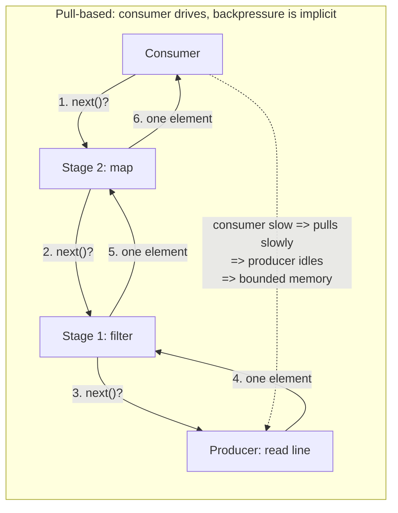

# Laziness & Streams — Senior Level

> **Roadmap:** [Functional Programming](../README.md) → Laziness & Streams
>
> *Laziness is a contract about **when** a value is computed. At the senior level the question stops being "is this lazy?" and becomes "what does this laziness do to my memory profile, my failure timing, and the shape of the API I hand to other teams?"*

---

## Table of Contents

1. [Introduction](#introduction)
2. [Prerequisites](#prerequisites)
3. [Designing a Streaming API](#designing-a-streaming-api)
4. [Backpressure & Pull-Based Streams](#backpressure--pull-based-streams)
5. [Lazy vs Eager at Scale](#lazy-vs-eager-at-scale)
6. [Processing Infinite & Large Datasets Without Buffering](#processing-infinite--large-datasets-without-buffering)
7. [Generators as Coroutines](#generators-as-coroutines)
8. [Space Leaks & Strictness — Haskell's Classic Pitfall](#space-leaks--strictness--haskells-classic-pitfall)
9. [Late Effects & Late Exceptions](#late-effects--late-exceptions)
10. [Common Mistakes](#common-mistakes)
11. [Test Yourself](#test-yourself)
12. [Cheat Sheet](#cheat-sheet)
13. [Summary](#summary)
14. [Further Reading](#further-reading)
15. [Related Topics](#related-topics)

---

## Introduction

> Focus: **design and architecture implications.** Not "how do I write a generator" — that's [`middle.md`](middle.md) — but "what happens to a system when its data spine is lazy?"

Laziness changes one thing — the *moment of evaluation* — and that single change ripples into every architectural property you care about: peak memory, where the program spends its time, when side effects fire, and when exceptions surface. A lazy pipeline that processes a 200 GB log file in 8 MB of RAM and the same pipeline silently retaining the whole file as un-forced thunks are written almost identically. The difference is invisible in a unit test and catastrophic in production at 3 a.m.

This file covers four senior concerns:

1. **API design** — when you expose a stream instead of a materialized collection, you are exporting a *protocol*: who pulls, who buffers, what happens on error, whether it can be consumed twice. Get this wrong and every consumer pays.
2. **Backpressure** — a fast producer and a slow consumer is a memory bomb unless the consumer can say "slow down." Pull-based streams give backpressure for free; push-based ones make you engineer it.
3. **Scale** — laziness is the only way to process data larger than memory, but it trades a predictable cost (materialize once) for a subtle one (thunk retention, re-traversal, deferred effects).
4. **The dark side** — **space leaks** (Haskell's signature footgun), effects that fire at a surprising time or not at all, and exceptions that escape the `try` block that should have caught them.

> **The senior mindset shift:** the junior asks "does laziness make this faster?"; the senior asks "where does the work *actually* happen, what is the peak resident memory of the realized pipeline, and what does a consumer three teams away have to know to use this safely?"

---

## Prerequisites

- **Required:** Fluency with [`junior.md`](junior.md) and [`middle.md`](middle.md) — you can write Python generators, consume a Java `Stream`, and explain lazy vs eager evaluation of `map`/`filter`.
- **Required:** Comfort with [Map / Filter / Reduce](../04-map-filter-reduce/senior.md) (stream fusion, terminal vs intermediate operations) and [Recursion & Tail Calls](../08-recursion-and-tail-calls/senior.md) (because lazy infinite structures are built by recursion that doesn't bottom out).
- **Helpful:** [Effect Tracking](../10-effect-tracking/senior.md) — laziness and effects interact badly; understanding the pure-core/impure-shell split clarifies *why*.
- **Helpful:** Exposure to concurrency primitives (channels, futures, thread pools) — backpressure is a concurrency problem wearing a streaming hat.

---

## Designing a Streaming API

The first architectural decision is **collection vs stream** at a boundary. Returning `List<T>` promises "I have computed all of this and it fits in memory." Returning a stream/iterator/generator promises "I will produce these one at a time, on demand." That promise leaks into five design properties you must decide *deliberately*, because consumers cannot recover them later.

### The five properties you are exporting

| Property | Collection | Stream | The trap if you get it wrong |
|---|---|---|---|
| **Memory** | O(n) up front | O(1)–O(window) | A "stream" that internally buffers everything is a lie |
| **Latency to first element** | After all are computed | Immediate | Eager APIs add startup lag for no reason |
| **Re-consumption** | Free, many times | Often once | Consumer iterates twice, second pass is empty/errors |
| **Error timing** | At call time | During iteration | `try` around the call won't catch a mid-iteration failure |
| **Resource lifetime** | None after return | Held until drained | File/socket open for the *consumer's* whole loop |

### Single-shot vs replayable

The single most common streaming-API bug is the **single-shot stream consumed twice**. A Java `Stream` throws `IllegalStateException: stream has already been operated upon or closed`; a Python generator silently yields nothing on the second pass. Decide and *document* which you are:

```java
// BAD: returns a single-shot Stream from a method named like a getter.
// Callers reasonably assume getActiveUsers() is replayable; it isn't.
Stream<User> getActiveUsers() { return users.stream().filter(User::isActive); }

// caller — looks innocent, throws on the second terminal op:
var active = svc.getActiveUsers();
long count = active.count();          // consumes the stream
active.forEach(this::notify);         // IllegalStateException
```

```java
// BETTER: if it's logically a collection, return one. If it's genuinely lazy,
// return a Supplier<Stream<T>> (a factory) so each consumer gets a fresh stream.
Supplier<Stream<User>> activeUsers() {
    return () -> users.stream().filter(User::isActive);
}
// caller: svc.activeUsers().get()  — a brand-new stream each call, replayable by construction.
```

The Go iterator design (Go 1.23 `iter.Seq[T]`) made this explicit: an `iter.Seq[T]` is `func(yield func(T) bool)` — a *function that produces a fresh traversal every time you call it*. Replayability is the default because you re-invoke the closure.

```go
// Go 1.23 — an iter.Seq is a function; calling it again restarts the iteration.
func ActiveUsers(users []User) iter.Seq[User] {
    return func(yield func(User) bool) {
        for _, u := range users {
            if u.Active && !yield(u) { // yield returns false => consumer wants to stop
                return                  // honors early termination (break) cleanly
            }
        }
    }
}

// for u := range ActiveUsers(users) { ... }   // ranges; can range again, fresh each time
```

### Design rules for stream-returning APIs

- **Name and document the laziness.** `lines(path)` returning a lazy iterator is fine; `getLines()` implying a materialized list is a trap. Document re-consumption, error timing, and who closes resources.
- **Own resource lifetime explicitly.** If the stream holds a file or socket, the API must make closing unmissable: Java's `try (Stream<String> s = Files.lines(p))`, Python's `with` + generator-`close()`, Go's `defer` inside the producer or `iter.Seq`'s guaranteed cleanup on `break`.
- **Don't leak laziness across a trust boundary you don't control.** Returning a lazy stream to *internal* callers is great. Returning one across a public API / service boundary, where the consumer may not drain it, may hold it for minutes, or may iterate twice, often warrants materializing or paginating instead.
- **Keep the pipeline pure until the terminal step.** Intermediate operations (`map`, `filter`) should be side-effect-free; only the terminal consumer commits effects. This is the same discipline as the [functional core / imperative shell](../10-effect-tracking/senior.md), and it is what makes lazy pipelines safe to reorder and fuse.

---

## Backpressure & Pull-Based Streams

The defining scaling hazard of streaming is the **fast producer, slow consumer**. If the producer races ahead and its output is queued, memory grows without bound until OOM. **Backpressure** is the mechanism by which the consumer signals "I am not ready for more." Whether you get it for free depends on *who drives the pull*.

### Pull-based: backpressure is structural

In a **pull-based** model the consumer asks for the next element; the producer does nothing until asked. This is lazy evaluation applied to a pipeline, and it has an enormous architectural payoff: **backpressure is automatic**. A slow consumer simply pulls less often; the producer, blocked waiting to be pulled, generates nothing extra. No queue, no buffer, no explicit flow-control protocol.



Python generators, Java `Stream`, Rust `Iterator`, and Go `iter.Seq` are all pull-based: nothing is produced until a terminal/`for` loop pulls. That is why a 200 GB file streams in constant memory — the reader is throttled by the consumer's pace, one element at a time.

### Push-based: backpressure must be engineered

In a **push-based** model the producer emits whenever data is ready and the consumer reacts (callbacks, observers, `Flux.subscribe`). This is natural for genuinely asynchronous sources — network packets, UI events, sensor feeds — that produce *when they produce*, not when you ask. But a naive push pipeline has no flow control: a 10k-msg/s producer feeding a 1k-msg/s consumer accumulates 9k unprocessed messages every second.

The **Reactive Streams** specification (the basis of `java.util.concurrent.Flow`, Project Reactor, RxJava, Akka Streams) solves this by adding a *demand* signal back-channel: the subscriber calls `request(n)`, and the publisher may emit at most `n` more items. This grafts pull-style backpressure onto a push model.

```java
// java.util.concurrent.Flow — the JDK's Reactive Streams interfaces (JDK 9+).
// The Subscriber pulls demand; the Publisher must not exceed it.
class BoundedSubscriber implements Flow.Subscriber<LogLine> {
    private Flow.Subscription sub;
    private static final int BATCH = 64;

    public void onSubscribe(Flow.Subscription s) {
        this.sub = s;
        s.request(BATCH);                 // "I can handle 64" — this IS the backpressure
    }
    public void onNext(LogLine line) {
        process(line);                    // slow work
        sub.request(1);                   // pull one more only when ready => bounded buffer
    }
    public void onError(Throwable t) { /* terminal */ }
    public void onComplete()          { /* terminal */ }
}
```

The contract is strict: the publisher **must never** emit more than the cumulative `request(n)`. A correct publisher buffers nothing beyond what was demanded; an incorrect one re-introduces the unbounded-queue bomb the spec exists to prevent.

### Decision: pull or push?

| Source nature | Model | Why |
|---|---|---|
| You can *ask* for the next item (file, DB cursor, in-memory collection) | **Pull** (iterator/generator/`Stream`) | Backpressure is free; simplest correct design |
| Source emits on its own schedule (network, events, Kafka, sensors) | **Push with demand** (Reactive Streams / `Flow`) | You can't throttle the world; negotiate demand instead |
| Hybrid / fan-in-fan-out async graphs | **Reactive framework** (Reactor, Akka Streams) | Backpressure, error channels, and composition are pre-solved |

> **The senior heuristic:** prefer pull. It gives bounded memory by construction and is dramatically simpler to reason about. Reach for push/reactive *only* when the source is genuinely asynchronous and you cannot control its rate — then use a spec-compliant framework rather than hand-rolling flow control, because getting `request(n)` accounting right under concurrency is a known minefield.

A note on **Go channels**: a *buffered* channel with a fixed capacity gives bounded backpressure — a producer doing `ch <- x` blocks when the buffer is full, throttling itself to the consumer's pace. An *unbuffered* channel is pure rendezvous (maximal backpressure: the producer blocks until the consumer takes). An over-large buffer silently removes backpressure and re-creates the memory bomb. Channel capacity is a backpressure-tuning knob, not just a performance one.

---

## Lazy vs Eager at Scale

Laziness is not free and not universally better. At scale the trade-offs sharpen.

### What laziness buys

- **Bounded memory over unbounded/large data** — the headline win; process more than fits in RAM.
- **Short-circuiting** — `findFirst`, `any`, `take(10)` stop the entire upstream pipeline the instant the answer is known. Over an expensive or infinite source this is the difference between O(1) and O(∞) work.
- **Compositional efficiency via fusion** — `xs.map(f).filter(g).map(h)` over a lazy stream makes *one* pass with no intermediate collections; the eager version allocates a full array after each step. (See [Map / Filter / Reduce](../04-map-filter-reduce/senior.md) for fusion.)

### What laziness costs

- **Per-element overhead.** Each lazy step is a function call / closure invocation / thunk. For small, in-memory data that fits comfortably, an eager array loop is often *faster* — better cache locality, no closure churn, vectorizable. Laziness pays off when n is large or the source is external; it can lose on a 100-element in-memory list.
- **Re-computation on re-traversal.** A lazy stream that isn't memoized recomputes everything on each pass. Iterate twice → do the work twice (or get an empty second pass for single-shot streams). Eager collections are computed once and re-read freely.
- **Deferred, opaque cost.** The expensive work happens at the terminal step, far from where the pipeline was *defined*. A profiler points at `collect()` / `for` loop, not at the `map(expensiveTransform)` that's actually slow. Debugging "why is this line slow" requires understanding the *whole* deferred chain.
- **Thunk-retention space leaks** — the marquee hazard, covered in its own section below.

### The senior judgment

```text
Use LAZY when:                          Use EAGER when:
  data > memory (files, logs, network)    data is small and in-memory
  source is infinite                      you iterate the result many times
  you short-circuit (take/find/any)       you need O(1) random access / size
  you pipeline many transforms (fusion)    the work is trivial per element
  latency-to-first-element matters         predictable, profilable cost matters
```

> The mistake is treating laziness as a default virtue. It is a tool for a specific cost profile — *large or unbounded data, traversed once, possibly short-circuited.* Outside that profile, eager is often simpler, faster, and free of the thunk-leak and late-effect hazards below.

---

## Processing Infinite & Large Datasets Without Buffering

The canonical senior use of laziness: a transform over data far larger than memory, in constant space. The discipline is **never materialize the whole thing** — keep the pipeline lazy end-to-end and let a single terminal consumer drive it.

```python
# Python — count ERROR lines in a 200 GB log in ~constant memory.
# Each step is a lazy generator; nothing is buffered. The file is read one
# line at a time, pulled by sum() at the very end.
def lines(path):
    with open(path) as f:
        yield from f                       # file objects are lazy line iterators

def parsed(src):
    for line in src:
        yield line.rstrip("\n")

def errors(src):
    for line in src:
        if " ERROR " in line:
            yield line

# Terminal step drives the whole chain; peak memory is ~one line.
count = sum(1 for _ in errors(parsed(lines("app.log"))))
```

The killer mistake is a single innocent-looking `list(...)`, `.collect(toList())`, `sorted(...)`, or `.count()` *in the middle* — any operation that must see all elements collapses the lazy chain into a full buffer and OOMs.

```python
# DISASTER — sorted() is a fully-materializing operation. This buffers the
# entire 200 GB file into memory before yielding a single result. OOM.
for line in sorted(errors(parsed(lines("app.log")))):   # <-- materializes everything
    ...
```

Stateful, all-elements operations (`sort`, `distinct` without bounded state, `groupBy`, "reverse") are fundamentally incompatible with constant-memory streaming. If you need them over big data, you need an **external** algorithm (external merge sort, streaming top-k with a bounded heap, approximate-distinct with HyperLogLog) — not an in-memory collect.

### Infinite sequences

Laziness makes *infinite* data structures finite to compute, because only the demanded prefix is ever realized.

```python
# Python — an infinite generator; take(5) realizes only the first 5.
import itertools
def naturals():
    n = 0
    while True:
        yield n
        n += 1

first_five = list(itertools.islice(naturals(), 5))   # [0,1,2,3,4]; the rest never runs
```

```java
// Java — Stream.iterate is lazy; limit() bounds an otherwise-infinite stream.
List<Integer> firstFive = Stream.iterate(0, n -> n + 1)
                                .limit(5)              // without this, terminal op hangs forever
                                .collect(Collectors.toList());
```

```haskell
-- Haskell — laziness is the default, so infinite lists are idiomatic and cheap.
-- 'take 5' forces exactly five cells; the rest of the list is never constructed.
naturals :: [Int]
naturals = [0..]                 -- conceptually infinite
firstFive = take 5 naturals      -- [0,1,2,3,4]

-- The classic: a self-referential infinite stream (only forced as far as demanded).
fibs :: [Integer]
fibs = 0 : 1 : zipWith (+) fibs (tail fibs)
-- take 10 fibs  ==>  [0,1,1,2,3,5,8,13,21,34]
```

The architectural lesson: an infinite stream is safe **only** if every consumer eventually short-circuits (`take`, `find`, `any`). An infinite source plus a fully-consuming terminal op (`count`, `sum`, `collect`) is an infinite loop. This is why exposing an infinite/unbounded stream across an API boundary is dangerous — a consumer who forgets to bound it hangs the system.

---

## Generators as Coroutines

A generator is not just "lazy list producer" — it is a **coroutine**: a function that can *suspend* at a `yield`, hand control (and a value) back to its caller, and *resume* exactly where it left off with its entire local state intact. This dual nature is what makes generators the substrate for both streaming and cooperative concurrency.

```python
# Python — a two-way coroutine. yield is an EXPRESSION: it also RECEIVES a value
# sent in by the caller. The generator's stack frame is preserved across suspends.
def running_average():
    total, count = 0.0, 0
    avg = None
    while True:
        x = yield avg            # suspend, emit avg, resume with the value sent in
        total += x
        count += 1
        avg = total / count

g = running_average()
next(g)            # prime to first yield
g.send(10)         # -> 10.0   (state retained between calls)
g.send(20)         # -> 15.0
g.send(30)         # -> 20.0
```

This suspend/resume capability is the seam between FP-style laziness and `async`/`await`: Python's `async def` coroutines, JavaScript generators driving promises, and C#'s `IEnumerator`-based iterators all reuse the *same* machinery — a resumable stack frame. `await` is conceptually `yield`-ing control to an event loop that resumes you when the awaited thing is ready.

Go takes the opposite path: instead of stackful coroutines as a language feature, goroutines + channels provide the same producer/consumer streaming, and Go 1.23's `iter.Seq` provides the *iterator* face. The `yield func(T) bool` callback is Go's idiom for "emit a value, and let the consumer say stop" — coroutine-like suspension expressed without first-class continuations.

> **Architectural use:** generators-as-coroutines let you write a *producer* as straight-line code (loops, branches, local state) that nonetheless yields lazily and cooperates with a scheduler. This is far more readable than a hand-rolled state machine or callback soup — the suspended local variables *are* the state. It is the readable way to express a streaming parser, a paginating API client, or a step-by-step simulation.

---

## Space Leaks & Strictness — Haskell's Classic Pitfall

This is *the* canonical lazy-evaluation footgun, and Haskell — being lazy by default — is where it lives. Understanding it teaches you the failure mode that hides in every lazy system.

### What a thunk is, and how it leaks

In a lazy language, an unevaluated expression is stored as a **thunk** — a closure that says "here's how to compute this value when someone forces it." Thunks are the mechanism of laziness. The leak: if you build up a *chain* of thunks faster than anything forces them, they accumulate on the heap. You expected an `Int` to occupy 8 bytes; instead you have a teetering tower of "add 1 to (add 1 to (add 1 to ...))" thunks consuming gigabytes — and then a stack overflow when something finally forces the whole chain at once.

```haskell
-- SPACE LEAK — the classic. foldl is lazy in its accumulator: it builds
--   (((0 + x1) + x2) + x3) + ...  as ONE GIANT THUNK, never evaluating until
-- the end. Over a million elements this is a million nested thunks => heap blowup
-- and a stack overflow when forced.
sumLeak :: [Int] -> Int
sumLeak = foldl (+) 0          -- looks fine; leaks badly on large input
```

```haskell
-- FIX 1 — foldl' (strict left fold, from Data.List) forces the accumulator at
-- EACH step. The accumulator is always a fully-evaluated Int: O(1) space.
import Data.List (foldl')
sumStrict :: [Int] -> Int
sumStrict = foldl' (+) 0       -- constant space, no thunk tower
```

### Strictness annotations — telling the compiler "evaluate now"

Haskell gives you explicit tools to *defeat* laziness exactly where it hurts:

```haskell
{-# LANGUAGE BangPatterns #-}
-- FIX 2 — a bang pattern (!) forces the accumulator on every recursive call,
-- so it never becomes a thunk chain.
sumBang :: [Int] -> Int
sumBang = go 0
  where go !acc []     = acc          -- ! forces acc to WHNF each step
        go !acc (x:xs) = go (acc + x) xs

-- seq / $! force evaluation; deepseq forces FULLY (to normal form, not just WHNF).
-- Strict fields in a data type prevent lazy fields from accumulating thunks:
data Stats = Stats { count :: !Int, total :: !Double }  -- ! = strict fields
```

The senior insight: **laziness and strictness are both tools, and the skill is knowing which axis you're on for each value.** Lazy by default + strict where you fold/accumulate is the working Haskeller's rule of thumb. Strict-by-default languages (Python, Java, Go) have the *inverse* problem — they over-evaluate — and you opt *into* laziness (generators, `Stream`, `Supplier`) where you need it.

### The same leak in a strict language

You don't escape thunk-style retention by leaving Haskell — you just meet it in a different costume. In any pull-based pipeline, an operation that **closes over and retains** all prior elements is the strict-language space leak:

```python
# Python "space leak" — looks streaming, secretly retains everything.
# Each yielded item holds a reference to a growing list => O(n) memory, defeating
# the entire point of the generator.
def running_with_history(src):
    history = []
    for x in src:
        history.append(x)         # <-- unbounded retention; the stream is now O(n)
        yield (x, list(history))  # consumer thinks it's streaming; memory grows forever
```

```java
// Java — a lazy Stream captured into a field, never closed: the underlying
// file handle and any buffered state live as long as the object. The "leak"
// is the unclosed resource the lazy stream pins open.
this.lines = Files.lines(path);   // never in a try-with-resources => leaked file descriptor
```

> **The unifying lesson:** laziness defers work, and *deferred work has to be remembered somewhere.* A space leak is when "somewhere" grows without bound — a thunk chain in Haskell, a captured accumulator/history in Python, a pinned resource in Java. The fix is always the same shape: **force/bound the retained state** (strict fold, fixed-size window, close the resource) so the deferred memory is bounded.

---

## Late Effects & Late Exceptions

Laziness decouples *defining* a computation from *running* it. When that computation has side effects or can throw, the decoupling moves *when* those things happen — often to a surprising place. This is the second great lazy footgun, and it's a *correctness* bug, not just a performance one.

### Effects fire at consumption, not definition

```python
# The effect (the print / the DB write) does NOT happen here — only the
# generator object is created. Nothing runs until something iterates.
def writes(rows):
    for r in rows:
        save_to_db(r)            # SIDE EFFECT
        yield r.id

gen = writes(rows)               # <-- save_to_db has NOT been called yet!
# ... if nothing ever iterates `gen`, NOTHING IS SAVED. The effect silently vanishes.
```

This is a real and recurring production bug: code that "does the work" inside a generator, where the caller forgets to consume it (or consumes it with a short-circuit like `next(gen)` that only pulls one). In an eager function the effects are guaranteed; in a lazy one they are *conditional on consumption*. The architectural rule from [Effect Tracking](../10-effect-tracking/senior.md) applies hard here: **keep side effects out of lazy intermediate stages.** A `map(saveToDb)` in a lazy pipeline is a bug waiting for a `limit()` to skip half the saves.

### Exceptions thrown late — outside the `try`

```java
// The Files.lines call may succeed; the IOException for a read error fires
// LATER, while the terminal forEach is pulling lines — OUTSIDE this try block.
try {
    Stream<String> s = Files.lines(path);   // no read happens yet
} catch (IOException e) {
    // This catches open-time errors only. A mid-stream read failure escapes here.
}
// The read actually happens during the terminal operation:
s.forEach(System.out::println);             // UncheckedIOException can fly out HERE
```

Because evaluation is deferred, the `try` that *looks* like it wraps the risky operation wraps only the *construction* of the lazy pipeline, not its *execution*. The exception surfaces during the terminal step, wherever that is — potentially in a completely different method, after the resource-acquiring `try` has already exited. The same trap exists in Python (the exception fires inside the `for`, not at generator creation) and is *worse* in Reactive Streams, where errors travel down an `onError` channel rather than propagating up a call stack at all.

```python
# Python — exception is deferred to iteration time, not definition time.
def risky(src):
    for x in src:
        yield 10 // x            # ZeroDivisionError fires when a 0 is PULLED

g = risky([1, 2, 0, 4])          # no error here
for v in g:                      # error erupts mid-loop, at the 0
    print(v)
```

> **The senior rule:** with lazy pipelines, **error handling and resource management must live at the consumption site, not the definition site.** Wrap the *terminal* operation in your `try`/`with`/`defer`, close resources via try-with-resources / context managers / `defer` that span the full drain, and treat any side effect inside an intermediate lazy stage as a code smell. The `onError` channel in reactive frameworks exists precisely because stack-based exception handling doesn't work across deferred, asynchronous evaluation.

---

## Common Mistakes

1. **Returning a single-shot stream from a getter-shaped method.** Consumers assume re-iterability; the second terminal op throws (`Stream`) or silently yields nothing (generator). *Return a collection if it's logically materialized, or a `Supplier<Stream>` / `iter.Seq` factory if it's genuinely lazy — and document it.*
2. **A materializing operation in the middle of a "streaming" pipeline.** `sorted`, `list(...)`, `collect(toList())`, `distinct`, `groupBy` over big data buffers everything and OOMs. *Keep the pipeline lazy end-to-end; use external algorithms for sort/distinct over data larger than memory.*
3. **Side effects inside lazy intermediate stages.** A `map(saveToDb)` whose saves get skipped by a downstream `limit()` or are never run because nothing consumes the stream. *Effects belong only at the terminal step; intermediate stages stay pure.*
4. **`try`/`catch` around stream *construction* instead of *consumption*.** The deferred exception fires during the terminal op, escaping the block. *Wrap the terminal operation; manage resources with try-with-resources / `with` / `defer` spanning the full drain.*
5. **The lazy space leak: `foldl` / retained accumulator / pinned resource.** A thunk tower (Haskell), an unbounded `history` list (Python), or an unclosed lazy `Files.lines` (Java). *Force/bound the retained state: `foldl'` / bang patterns / strict fields; fixed-size windows; close the resource.*
6. **Exposing an infinite stream without a contract that the consumer must bound it.** A `count()`/`sum()` on an infinite source hangs forever. *Either don't expose infinite streams across boundaries, or document loudly that consumers must `take`/`limit`.*
7. **Treating laziness as a default good.** On small in-memory data traversed multiple times, eager is faster (cache locality, no closure/thunk overhead) and simpler (no late-effect or leak hazards). *Match laziness to its profile: large/unbounded, single-pass, short-circuiting.*
8. **An over-sized Go channel buffer (or an unbounded reactive queue) that removes backpressure.** A large buffer silently lets a fast producer outrun a slow consumer into OOM. *Size buffers to the backpressure you want; prefer pull-based designs where backpressure is structural.*

---

## Test Yourself

1. You're designing a method that returns "all matching records." When do you return a `List<T>` and when a lazy stream, and what five properties does that choice export to every consumer?
2. Explain why a pull-based pipeline gives backpressure "for free" while a push-based one must engineer it. What does Reactive Streams' `request(n)` add to a push model, and why?
3. A colleague writes a generator pipeline to count error lines in a 200 GB file but adds `sorted(...)` in the middle "to make output nicer." What happens, and why?
4. What is a thunk, and how does `foldl (+) 0` over a million-element list produce a space leak? Give two ways Haskell lets you fix it.
5. A `save_to_db` call lives inside a Python generator. The caller creates the generator but the data never appears in the database. What's the bug?
6. Why does wrapping `Files.lines(path)` in a `try { } catch (IOException)` fail to catch a read error that occurs partway through the file? Where must the handling go?
7. Give the profile (three properties) under which laziness clearly wins, and the profile under which eager is the better choice.

<details>
<summary>Answers</summary>

1. Return a **`List<T>`** (or other materialized collection) when the data is bounded, fits in memory, will be iterated more than once, or needs random access/size — the API then promises "computed, in memory, replayable." Return a **lazy stream** when the data is large/unbounded, traversed once, or you want low latency-to-first-element. The choice exports five properties: **memory** (O(n) vs O(1)), **latency to first element** (after-all vs immediate), **re-consumption** (free vs often single-shot), **error timing** (at call vs during iteration), and **resource lifetime** (none vs held until drained).
2. In **pull**, the consumer drives: the producer computes nothing until asked, so a slow consumer simply pulls slower and the producer idles — bounded memory with no queue, automatically. In **push**, the producer emits on its own schedule; a fast producer outruns a slow consumer into an unbounded queue. Reactive Streams' **`request(n)`** adds a *demand back-channel*: the subscriber tells the publisher the maximum it may emit, grafting pull-style flow control onto push so the publisher never produces more than the consumer has asked for — restoring bounded memory.
3. `sorted` is a **fully-materializing, all-elements** operation: it must see and buffer every line before emitting the first, so it collapses the lazy chain and loads the entire 200 GB into memory — **OOM**. Sort/distinct/groupBy are incompatible with constant-memory streaming; over big data you need an *external* algorithm (external merge sort), not an in-memory collect.
4. A **thunk** is a stored unevaluated expression — a closure for "compute this when forced." `foldl (+) 0` is lazy in its accumulator, so it builds `(((0+x1)+x2)+x3)+...` as one giant nested thunk that isn't evaluated until the end — a million nested thunks → heap blowup and stack overflow when finally forced. Fixes: use **`foldl'`** (strict left fold that forces the accumulator each step), or a **bang pattern** `!acc` / `seq` / `$!` / strict data fields to force evaluation per step — keeping the accumulator a fully-evaluated value in O(1) space.
5. The generator is **lazy**: creating it runs *no* body code, so `save_to_db` never executes until something *iterates* the generator. If the caller never consumes it (or only pulls one element), the side effects silently never happen. The bug is putting an effect inside a lazy stage whose consumption isn't guaranteed; effects must run at a terminal, eagerly-consumed step.
6. Because `Files.lines` only **constructs** the lazy stream — no file read happens yet — so the `try` wraps construction, not execution. The actual reads (and any `UncheckedIOException`) happen during the **terminal operation** (`forEach`/`collect`), which may run after the `try` block has exited, possibly in another method. Handling and resource management must live at the **consumption site**: wrap the terminal op, and use try-with-resources spanning the full drain so the file is closed even on mid-stream failure.
7. **Laziness wins** when: data is larger than memory or infinite; the result is traversed once; and/or you short-circuit (`take`/`find`/`any`) — plus when many transforms fuse into one pass. **Eager wins** when: data is small and in-memory; you iterate the result multiple times; you need O(1) size/random access; per-element work is trivial (closure/thunk overhead dominates); or you want predictable, profilable cost without late-effect/space-leak hazards.

</details>

---

## Cheat Sheet

| Concern | Lazy / streaming answer | Watch out for |
|---|---|---|
| **Large/infinite data** | Pull-based generator/`Stream`/`iter.Seq`, O(1) memory | A mid-pipeline `sort`/`distinct`/`list()` that materializes everything |
| **Fast producer, slow consumer** | Pull = automatic backpressure; push = Reactive Streams `request(n)` | Over-sized channel/queue buffers that remove backpressure |
| **Stream as API return** | Document single-shot vs replayable; own resource lifetime | Getter-shaped method returning a single-shot `Stream` |
| **Re-consumption** | Return `Supplier<Stream>` / `iter.Seq` factory for replay | Generator silently empty on 2nd pass; `Stream` throws |
| **Small in-memory data, multi-pass** | Prefer **eager** (collection) | Laziness overhead + recompute-on-retraversal |
| **Space leak (Haskell)** | `foldl'`, bang patterns `!`, strict fields, `seq`/`deepseq` | `foldl (+) 0` thunk tower → heap blowup |
| **Space leak (strict langs)** | Bound retained state; close resources | Captured growing `history`; unclosed `Files.lines` |
| **Side effects** | Only at the terminal step; intermediates stay pure | `map(saveToDb)` skipped by `limit()` or never consumed |
| **Exceptions** | Handle at the *consumption* site, span the drain | `try` around stream *construction* misses mid-stream errors |
| **Generators-as-coroutines** | Suspend/resume; `send()`; basis of `async`/`await` | State lives in suspended frame — keep it bounded |

**Three golden rules:**
- *Prefer pull-based streams — backpressure and bounded memory come for free; reach for push/reactive only for genuinely async sources, and use a spec-compliant framework.*
- *Keep lazy pipelines pure until the terminal step; effects and error handling belong at the consumption site, never in an intermediate stage.*
- *Deferred work is remembered somewhere — bound that "somewhere" (strict folds, fixed windows, closed resources) or it becomes a space leak.*

---

## Summary

- **Laziness changes one thing — the moment of evaluation — and that ripples into peak memory, where time is spent, when effects fire, and when exceptions surface.** Senior work is reasoning about those ripples, not the syntax.
- **A stream-returning API exports a protocol:** memory profile, latency-to-first-element, re-consumption, error timing, and resource lifetime. Decide and document single-shot vs replayable; return a `Supplier<Stream>`/`iter.Seq` factory for replay; own resource cleanup explicitly.
- **Backpressure is structural in pull-based streams** (consumer drives, producer idles when not pulled → bounded memory) and must be *engineered* in push-based ones (**Reactive Streams / `java.util.concurrent.Flow`** add a `request(n)` demand back-channel; Go channel capacity is a backpressure knob). Prefer pull; use push only for genuinely asynchronous sources.
- **Lazy vs eager is a cost-profile choice:** lazy wins on large/unbounded, single-pass, short-circuiting data (and fuses transforms into one pass); eager wins on small in-memory data traversed many times, where closure/thunk overhead and recompute-on-retraversal make laziness lose. Laziness is not a default virtue.
- **Constant-memory big-data processing** requires keeping the pipeline lazy end-to-end; one stray materializing operation (`sort`, `list`, `collect`, `distinct`) OOMs. Infinite streams are safe only if every consumer short-circuits.
- **Generators are coroutines** — resumable stack frames — which is why they underpin both streaming and `async`/`await`; Go expresses the same producer/consumer streaming with goroutines+channels and `iter.Seq`'s `yield` callback.
- **Space leaks** are laziness's signature failure: a Haskell thunk tower (`foldl (+) 0`), fixed by **strictness** (`foldl'`, bang patterns, strict fields); the same shape appears in strict languages as retained accumulators or pinned resources. Deferred work is remembered somewhere — bound it.
- **Late effects and late exceptions:** effects inside lazy stages fire at consumption (or never, if unconsumed); exceptions surface during the terminal op, escaping a `try` around construction. Put effects and error/resource handling at the **consumption site**.

---

## Further Reading

- **Why Functional Programming Matters** — John Hughes (1990) — the original argument that laziness is a *modularity* tool: it lets you separate "generate" from "select," gluing a producer to a consumer via demand.
- **Structure and Interpretation of Computer Programs** — Abelson & Sussman — Chapter 3.5, "Streams," develops lazy streams from first principles (delay/force) and the infinite-sequence idioms.
- **Real World Haskell** / **Haskell Wiki — "Space leak"** — the definitive treatment of thunk accumulation, `foldl` vs `foldl'`, and strictness annotations.
- **Reactive Streams specification** (reactive-streams.org) — the four interfaces and the backpressure contract that `java.util.concurrent.Flow`, Reactor, and RxJava implement.
- **"Range over function types" — Go blog (Go 1.23)** — the design of `iter.Seq`/`iter.Seq2`, the `yield` protocol, and how iterators stay pull-based and cleanly cancellable.
- **Effective Java (3rd ed.)** — Bloch — Items 45–48 on Streams: when *not* to use them, side-effect-free pipelines, and `Collectors`.
- **Java Concurrency / Project Reactor docs** — backpressure operators (`onBackpressureBuffer`/`Drop`/`Latest`), the practical engineering of push-stream flow control.

---

## Related Topics

- [Map / Filter / Reduce](../04-map-filter-reduce/senior.md) — stream fusion, intermediate vs terminal operations; the operations laziness makes single-pass.
- [Recursion & Tail Calls](../08-recursion-and-tail-calls/senior.md) — infinite lazy structures are built by recursion that produces one cell per demand.
- [Effect Tracking](../10-effect-tracking/senior.md) — the pure-core/impure-shell discipline that keeps effects out of lazy intermediate stages and explains late-effect bugs.
- [Pure Functions & Referential Transparency](../02-pure-functions-and-referential-transparency/senior.md) — why pure intermediate stages are safe to reorder, fuse, and defer.
- [Immutability](../03-immutability/senior.md) — persistent structures and structural sharing, the data-side companion to lazy traversal.
- [Functional vs OO in Practice](../11-functional-vs-oo-in-practice/senior.md) — where streaming/reactive styles fit alongside object-oriented and imperative designs.
- [Functional Programming](../README.md) — the paradigm overview tying laziness back to purity, composition, and effect tracking.
