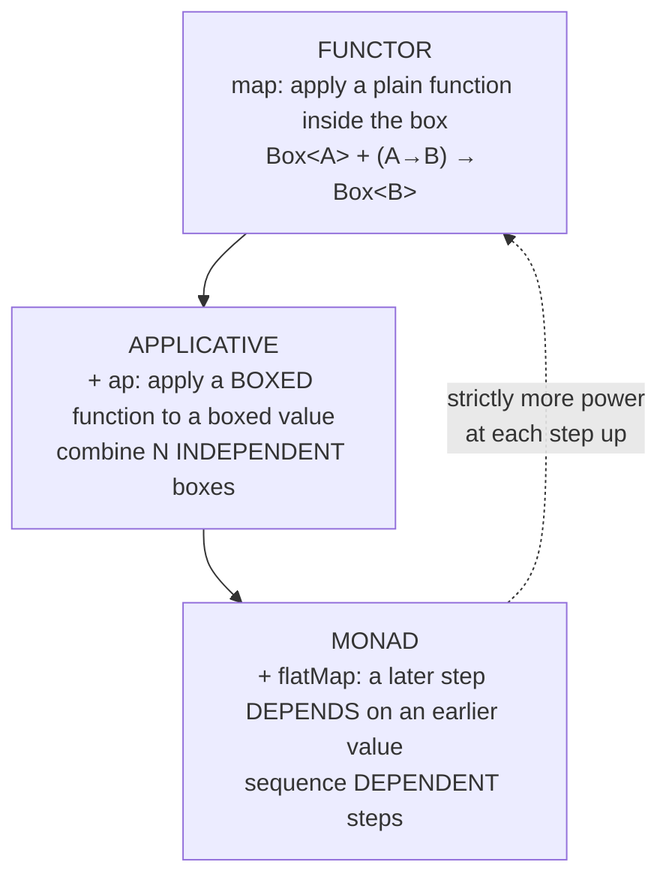

# Functors & Applicatives (Junior Level)

> **Roadmap:** [Functional Programming](../README.md) → Functors & Applicatives
>
> *A **functor** is any box you can `map` over — apply a function to the value inside without opening the box by hand. An **applicative** adds one more power: take a **function that's also in a box** and apply it to a **value in a box**, which is exactly what you need to combine several independent boxed values into one result.*

---

## Table of Contents

1. [Introduction: One Step Below Monads](#introduction-one-step-below-monads)
2. [Prerequisites](#prerequisites)
3. [Glossary](#glossary)
4. [The Functor: "Map Inside the Box"](#the-functor-map-inside-the-box)
5. [The Two Functor Rules (Informally)](#the-two-functor-rules-informally)
6. [Boxes You Already Map Over](#boxes-you-already-map-over)
7. [Where `map` Runs Out of Road](#where-map-runs-out-of-road)
8. [The Applicative: "Apply a Boxed Function to a Boxed Value"](#the-applicative-apply-a-boxed-function-to-a-boxed-value)
9. [The Running Example: Validating a Form](#the-running-example-validating-a-form)
10. [The Ladder: Functor → Applicative → Monad](#the-ladder-functor--applicative--monad)
11. [Go: No Typeclasses, Combine by Hand](#go-no-typeclasses-combine-by-hand)
12. [Common Mistakes](#common-mistakes)
13. [Test Yourself](#test-yourself)
14. [Cheat Sheet](#cheat-sheet)
15. [Summary](#summary)
16. [Further Reading](#further-reading)
17. [Related Topics](#related-topics)

---

## Introduction: One Step Below Monads

If you've met monads, you already know the hardest of these three ideas. Functors and applicatives are the two **weaker, simpler** abstractions that sit *underneath* monads — and you use both constantly without naming them.

Here is the whole picture in one breath:

> - **Functor** — you can `map` a plain function over the box. (`Optional.map`, `list.map`, `Promise.then` with a plain function.) You've done this a thousand times.
> - **Applicative** — you can apply a *boxed function* to a *boxed value*. This is the one new move, and it exists to solve one problem: **combining several independent boxes into one** — like collecting three form fields, each of which might be invalid, into one validated user.
> - **Monad** — you can let a later step *depend on* the value an earlier step produced. (`flatMap`.) The most powerful, and the one you've probably heard the most fuss about.

The surprising lesson of this topic is that **weaker is often better.** The most famous payoff — a form validator that reports *all* the bad fields at once instead of stopping at the first — works *because* applicatives are weaker than monads. A monad would short-circuit at the first error; an applicative, because its steps can't depend on each other, can run them all and gather every failure. We'll build exactly that validator below.

> **The one move to learn here:** a functor lets you put a plain function *into* the box (`map`). An applicative lets you also put a *boxed* function into the box and apply it (`ap` / `<*>`). That second move is what lets you combine `Box<A>` and `Box<B>` into `Box<C>` — the heart of this whole topic.

---

## Prerequisites

- **Required:** You can read and write functions in at least one language (examples use Python, Java, JavaScript, and Go).
- **Required:** You've called `map` on a list or an `Optional` before. See [Map / Filter / Reduce](../04-map-filter-reduce/junior.md).
- **Helpful:** You know what `Optional` / `Maybe` and `Result` / `Either` are — boxes for "maybe missing" and "maybe failed." See [Algebraic Data Types](../06-algebraic-data-types/junior.md).
- **Helpful:** You've read [Monads — Plain English](../09-monads-plain-english/junior.md). Functors and applicatives are the two rungs *below* the monad on the same ladder — but you can learn them first; they're simpler.
- **Helpful:** You understand a function that takes its arguments one at a time (currying), because applicatives lean on it. See [Currying & Partial Application](../07-currying-and-partial-application/junior.md).

---

## Glossary

| Term | Plain-English meaning |
|------|----------------------|
| **Box / context** | A wrapper around a value that adds meaning: *maybe* there's a value, *maybe* it failed, *maybe* there are several, *maybe* it'll arrive later. |
| **Functor** | Any box you can `map` over: apply a plain function to the value inside, leaving the box's shape unchanged. `Box<A>` + `(A→B)` → `Box<B>`. |
| **`map` / `fmap`** | The functor operation. Reach into the box, transform the value, put it back in the same kind of box. |
| **Applicative** (functor) | A functor with two extra powers: `pure` (put a plain value in the box) and `ap` (apply a *boxed* function to a *boxed* value). |
| **`pure` / `of`** | Put a plain value into the box: `A` → `Box<A>`. (Same idea as a monad's `unit`.) |
| **`ap` (`<*>`)** | Apply a function-in-a-box to a value-in-a-box: `Box<(A→B)>` + `Box<A>` → `Box<B>`. |
| **`liftA2`** | A convenience: combine *two* boxed values with a two-argument function. `(A→B→C)` + `Box<A>` + `Box<B>` → `Box<C>`. |
| **Independent vs dependent** | Steps are **independent** if neither needs the other's *value* (validate name, validate email — separately). They're **dependent** if a later step needs an earlier one's result (look up a user, *then* load that user's orders). Independent → applicative; dependent → monad. |
| **Short-circuit** | Stop at the first failure and skip the rest (what a monad does). |
| **Accumulate** | Run every step and collect *all* the failures (what an applicative `Validation` does). |

---

## The Functor: "Map Inside the Box"

Forget the word "functor" for a second. You already know the idea: a **functor is anything you can `map` over.**

A box holds a value in some context. `map` lets you transform that value *without opening the box yourself*:

```
map:  Box<A>  +  (A -> B)   =  Box<B>
```

You hand `map` a plain function (`A -> B`) and it gives you back a box of the same shape, with the value transformed. Crucially, **`map` never changes the shape or size of the box.** An `Optional` stays an `Optional`. A 3-element list stays a 3-element list. Map over a "missing" `Optional` and you get a "missing" `Optional` back — the function never even runs. This is the defining promise of a functor: *transform the contents, preserve the structure.*

```python
# Python — map over different boxes; the box's shape is preserved each time.
nums = [1, 2, 3]
doubled = [n * 2 for n in nums]      # list stays length 3: [2, 4, 6]

from typing import Optional
def add_one(x: int) -> int:
    return x + 1

present = 5
absent = None
# "map over Optional" = apply only if present; structure (present/absent) preserved
mapped_present = add_one(present) if present is not None else None   # 6
mapped_absent  = add_one(absent)  if absent  is not None else None   # None
```

```java
// Java — Optional is a functor. map transforms the value, keeps it an Optional.
Optional<String> name = findUser(id).map(User::getName);  // Optional<User> -> Optional<String>
// If findUser was empty, name is empty too — getName never ran. Shape preserved.
```

```javascript
// JavaScript — arrays and Promises are functors.
const lengths = ["hi", "yo"].map(s => s.length);   // [2, 2] — still length 2
fetchUser(id).then(u => u.name);                    // Promise<User> -> Promise<string>
// .then with a plain (non-Promise-returning) function IS map for the Promise box.
```

The word "functor" just names this shared shape. `Optional`, `List`, `Promise`, `Result` — they're all functors because they all support a lawful `map`.

---

## The Two Functor Rules (Informally)

A box isn't *really* a functor unless its `map` plays fair. There are exactly two rules, and they're both common sense:

### Rule 1 — Identity: mapping "do nothing" does nothing

> Mapping the identity function (`x => x`) over a box gives you back **the same box, unchanged**.

```text
box.map(x => x)   ==   box
```

If you map a function that returns its input untouched, nothing should change — not the value, not the structure. A `map` that secretly reordered a list, or dropped an element, or "helpfully" filled in a missing `Optional`, would break this rule. The rule guarantees `map` is *only* about transforming contents.

### Rule 2 — Composition: two maps in a row equal one combined map

> Mapping `f`, then mapping `g`, is the same as mapping "`g` after `f`" in a single pass.

```text
box.map(f).map(g)   ==   box.map(x => g(f(x)))
```

This is the rule that lets a compiler or library **fuse** two `map` calls into one loop — and it lets *you* refactor `.map(f).map(g)` into one step without fear. It says `map` doesn't sneak in any extra behavior between the two transforms; chaining maps is just function composition happening inside the box.

> **Why you should care:** these two rules are why `map` is *safe and boring* — and boring is exactly what you want. They guarantee `map` only ever transforms the value and never disturbs the container. Every reliable `map` you've used obeys them. If you ever write a custom `map` that breaks one, your "functor" will surprise people.

---

## Boxes You Already Map Over

Here are the everyday functors, side by side. The point of seeing them together is the same as with monads: they're all the *same idea* wearing different clothes.

| Box | `map` means… | Shape preserved |
|---|---|---|
| `Optional<T>` / `Maybe T` | apply only if present; stay empty if empty | present-or-empty unchanged |
| `List<T>` / `[T]` | apply to every element | length unchanged |
| `Result<T, E>` / `Either E T` | apply only on success; pass errors through untouched | ok-or-error unchanged |
| `Promise<T>` / `Future<T>` | apply when the value arrives | still one pending value |
| `Function (->) r` | apply *after* the function runs (compose on the output) | still a function |
| `(A, B)` tuple | apply to the *second* element, leave the first | still a pair |

The last two are surprising and worth a beat:

- **A function is a functor.** `map` over a function `r -> a` with `f : a -> b` gives `r -> b` — it just runs your function and then applies `f` to the result. That's plain old function composition: `map(f, g) == f ∘ g`. (More in [Composition](../05-composition/junior.md).)
- **A tuple/pair is a functor** over its *last* slot. `map(f, (x, y)) == (x, f(y))` — the first component rides along untouched (often it's a label or a log).

You don't need to memorize these. The takeaway is just: **"functor" is a wide net.** Almost any container or context you'd want to transform-inside-of is one.

---

## Where `map` Runs Out of Road

`map` is powerful but limited in one specific way: it takes **one** box and a function of **one** argument. What if you have *two* boxes and want to combine them?

Say you have `Optional<int> a` and `Optional<int> b`, and you want `Optional<int>` holding `a + b` — but only if *both* are present. `map` can't do this directly. `map` gives you one box and one function. You'd `map` `a` with `x => (y => x + y)` and get... `Optional<Function>` — a box holding a *function that still needs `b`*. Now you're stuck: you have a function **in a box**, and a value **in a box**, and `map` has no way to apply one to the other.

```python
# Python — the wall. We have a boxed function and a boxed value, and map can't connect them.
a = 3        # pretend this is Optional[int] = present(3)
b = 4        # pretend this is Optional[int] = present(4)

# map a with "add": we get a function waiting for the second number...
add = lambda x: lambda y: x + y     # curried add
boxed_function = add(a)             # this is "(y => 3 + y)" — a function we'd like in a box
# ...but b is ALSO in a box. How do we feed a boxed b into a boxed function? map can't.
```

This is the exact gap between functor and monad — and it's the gap **applicatives** were invented to fill.

---

## The Applicative: "Apply a Boxed Function to a Boxed Value"

An applicative is a functor with two extra abilities:

1. **`pure` (a.k.a. `of`)** — put a plain value into the box: `A` → `Box<A>`. (Exactly the monad's `unit`.)
2. **`ap` (a.k.a. `<*>`)** — apply a *boxed function* to a *boxed value*:

```
ap:  Box<(A -> B)>  +  Box<A>   =  Box<B>
```

That second one is the whole new idea. It's the missing tool from the previous section: you have a function-in-a-box and a value-in-a-box, and `ap` connects them.

With `ap`, combining two boxes becomes a clean pattern: `map` the two-argument function over the first box (giving a *boxed* partially-applied function), then `ap` it against the second box:

```python
# Python — combine two Optionals with a 2-argument function, using a tiny Maybe.
# (Stdlib Python has no applicative; this shows the SHAPE.)
def opt_map(opt, f):       # functor: map
    return None if opt is None else f(opt)

def opt_ap(boxed_f, opt):  # applicative: ap — boxed function applied to boxed value
    if boxed_f is None or opt is None:
        return None
    return boxed_f(opt)

add = lambda x: lambda y: x + y     # curried 2-arg function

a, b = 3, 4                          # both "present"
boxed_f = opt_map(a, add)            # Optional[(y => 3 + y)]
result  = opt_ap(boxed_f, b)         # Optional[7]   ✅ both present
# If either a or b were None, result is None — the box's rule handled it.
```

The convenience function **`liftA2`** wraps that two-step dance — "map then ap" — into one call, so you rarely write `ap` by hand:

```text
liftA2:  (A -> B -> C)  +  Box<A>  +  Box<B>   =  Box<C>
```

> **Read `liftA2` out loud:** "lift a two-argument function so it works on two boxed arguments." `liftA2(add, boxA, boxB)` is "add the two boxed numbers, giving a boxed result, succeeding only if both boxes succeed." That's the everyday applicative move.

Here it is in Haskell, where this all has clean built-in names — read it as the reference, then we leave:

```haskell
-- Haskell — the canonical home. <$> is map, <*> is ap, pure puts a value in the box.
result :: Maybe Int
result = (+) <$> Just 3 <*> Just 4     -- Just 7
--        ^^^   ^^^^^^^^ map (+) over the first box, then <*> against the second
-- (+) <$> Nothing <*> Just 4  ==  Nothing   -- any Nothing makes the whole thing Nothing
```

The shape `f <$> boxA <*> boxB <*> boxC` is the applicative workhorse: **apply an N-argument function across N independent boxes, succeeding only if all of them do.** That is *precisely* the form validation problem.

---

## The Running Example: Validating a Form

This is the example that makes applicatives click. Keep it in your head; it's the whole reason the abstraction exists.

**The task:** validate a sign-up form with a `name`, an `email`, and an `age`. Each field can be invalid for its own reason. You want to build a `User` from all three — and if any are bad, report **every** problem at once, not just the first.

First, the naive monadic version — and why it disappoints the user:

```python
# Python — monadic / short-circuit style. Stops at the FIRST error.
def validate_monadic(name, email, age):
    if not name:
        return ("error", ["name is required"])
    if "@" not in email:
        return ("error", ["email is invalid"])
    if age < 0:
        return ("error", ["age must be non-negative"])
    return ("ok", User(name, email, age))

# Problem: submit a form with ALL three fields wrong, and the user is told only
# "name is required." They fix it, resubmit, and NOW learn "email is invalid."
# Three round-trips to discover three errors. Infuriating.
```

The fields are **independent** — validating the email doesn't need the validated name. That independence is exactly what lets an applicative run *all three* and gather *all* the errors:

```python
# Python — applicative / accumulating style, with a tiny Validation type.
# Valid(value) or Invalid(list_of_errors). ap COLLECTS errors instead of stopping.

class Valid:
    def __init__(self, value): self.value = value
class Invalid:
    def __init__(self, errors): self.errors = errors   # always a list

def ap(boxed_f, boxed_x):
    # The crux: if BOTH sides are Invalid, CONCATENATE their errors.
    if isinstance(boxed_f, Invalid) and isinstance(boxed_x, Invalid):
        return Invalid(boxed_f.errors + boxed_x.errors)   # ← accumulation
    if isinstance(boxed_f, Invalid):
        return boxed_f
    if isinstance(boxed_x, Invalid):
        return boxed_x
    return Valid(boxed_f.value(boxed_x.value))

def check_name(name):
    return Valid(name) if name else Invalid(["name is required"])
def check_email(email):
    return Valid(email) if "@" in email else Invalid(["email is invalid"])
def check_age(age):
    return Valid(age) if age >= 0 else Invalid(["age must be non-negative"])

def make_user(name):                 # curried 3-arg constructor
    return lambda email: lambda age: User(name, email, age)

def validate(name, email, age):
    # map make_user over the first box, then ap across the rest.
    step1 = check_name(name)
    boxed = step1 if isinstance(step1, Invalid) else Valid(make_user(step1.value))
    boxed = ap(boxed, check_email(email))
    boxed = ap(boxed, check_age(age))
    return boxed

# validate("", "bad", -1)  ==  Invalid(["name is required",
#                                       "email is invalid",
#                                       "age must be non-negative"])  ← ALL THREE
# validate("Ada", "ada@x.io", 36)  ==  Valid(User(...))
```

Look at what changed: the **only** difference from the monadic version is what `ap` does when *both* sides have failed — it **concatenates the error lists** instead of stopping at the first. Because the three checks don't depend on each other's values, the applicative can run them all and merge every complaint into one response. One round-trip, all the errors. That is the canonical applicative win, and it falls out *for free* from "independent steps + accumulating `ap`."

> **The deciding question, every time:** *Do my steps depend on each other's values?* No → they're independent → use an **applicative**, and you can accumulate errors (or run them in parallel). Yes → a later step needs an earlier *result* → you need a **monad** and its short-circuiting `flatMap`.

---

## The Ladder: Functor → Applicative → Monad

These three form a ladder. Each rung is strictly more powerful than the one below — and you should always reach for the **weakest** rung that does the job.



| Rung | New power | Combines steps that are… | Failure behavior you can get |
|---|---|---|---|
| **Functor** | `map` | (just one box, transform it) | n/a |
| **Applicative** | `ap` / `pure` | **independent** of each other | **accumulate** all errors, or run in parallel |
| **Monad** | `flatMap` | **dependent** (later needs earlier's value) | **short-circuit** at the first error |

The key insight, restated: **applicatives are weaker than monads, and that weakness is a feature.** Because applicative steps *can't* depend on each other, the library is free to run them all (gathering every error) — or even run them at the same time. A monad *can't* do error-accumulation, because its whole power is "the next step depends on the previous one," so it *must* stop the moment a step fails. Less power, more options. Reach for `map` if you have one box; `liftA2`/`ap` if you have several independent boxes; `flatMap` only when a step truly needs the previous step's value.

> **Every monad is an applicative, and every applicative is a functor.** The ladder only goes one way. If something supports `flatMap`, it automatically supports `ap` and `map`. So you never *lose* anything by understanding the weaker rungs first — and you often *gain* (like error accumulation) by deliberately staying on a weaker rung.

---

## Go: No Typeclasses, Combine by Hand

Go has no functor, applicative, or monad abstractions — no typeclasses, no generic `map` over arbitrary containers, no operator like `<*>`. The Go way is to combine independent fallible values **by hand**, and seeing it makes the applicative pattern concrete.

```go
// Go — the form-validation example, written out. This IS applicative-style
// "accumulate all errors," done manually with an explicit error slice.
func validate(name, email string, age int) (User, []string) {
    var errs []string

    if name == "" {
        errs = append(errs, "name is required")
    }
    if !strings.Contains(email, "@") {
        errs = append(errs, "email is invalid")
    }
    if age < 0 {
        errs = append(errs, "age must be non-negative")
    }

    if len(errs) > 0 {
        return User{}, errs          // all errors, gathered — applicative accumulation by hand
    }
    return User{Name: name, Email: email, Age: age}, nil
}
```

Notice that Go programmers *naturally* write the accumulating version — they collect into an `errs` slice and check it at the end, rather than returning at the first bad field. That's the applicative pattern, just spelled out manually because there's no `ap` to do the merging for you. Go's lesson is the same as it was for monads: **the abstraction is one way to factor out a pattern you can always write by hand.** The hand-written version is explicit and perfectly readable here; the applicative version pays off when you have *many* of these and want the "run all, collect failures" wiring written once.

---

## Common Mistakes

1. **Thinking `map` can change the box's shape.** It can't — that's the whole point of the identity rule. `map` over a 3-element list gives a 3-element list; over an empty `Optional`, an empty `Optional`. If you need to *change* the structure (filter, flatten, fail), `map` is the wrong tool.
2. **Reaching for a monad when an applicative would do.** The classic case: validation. If you use `flatMap`/short-circuiting for independent field checks, you'll report only the *first* error and frustrate users. Independent steps → applicative → accumulate.
3. **Confusing "independent" with "unordered."** Independence is about *values*, not execution order. Two checks are independent if neither needs the *other's result* — even if you happen to run them left to right. Email validation doesn't need the validated name, so they're independent, full stop.
4. **Expecting an applicative to short-circuit like a monad.** A `Validation` applicative runs *all* the checks (to gather every error). If you wanted "stop at the first failure," that's the monadic behavior — a different choice, on purpose.
5. **Forgetting that `ap` needs a *boxed* function.** `ap` is `Box<(A→B)> + Box<A> → Box<B>`. The function is in a box too. That's why you usually `map` (or `pure`) a curried function into the box first, then `ap` the arguments in one at a time.
6. **Believing this is Haskell-only.** You `map` over `Optional`, `List`, and `Promise` every day — those are functors. Whenever you've gathered multiple validation errors into one list, you've hand-rolled an applicative.

---

## Test Yourself

1. In one sentence, what does `map` do, and what does it promise *never* to do?
2. State the two functor rules in your own words.
3. You have `Optional<int> a` and `Optional<int> b` and want their sum (only if both present). Why can't plain `map` do this, and what operation can?
4. What is the *one* difference between the monadic (short-circuit) and applicative (accumulate) versions of the form validator?
5. Two checks: (A) "is the email well-formed?" and (B) "does a user with that email already exist in the DB?" — where (B) only runs if (A) passed. Independent or dependent? Applicative or monad?
6. True or false: every monad is also an applicative. Explain what that buys you.
7. Why does error *accumulation* require the weaker (applicative) abstraction rather than the stronger (monad) one?

<details>
<summary>Answers</summary>

1. `map` applies a function to the value(s) inside a box and returns a box of the **same shape**. It promises **never to change the structure or size** of the box — only the contents.
2. **Identity:** mapping a do-nothing function (`x => x`) returns the box unchanged. **Composition:** `map(f)` then `map(g)` equals `map(g ∘ f)` in one pass — chaining maps is just composing the functions inside the box.
3. Plain `map` takes *one* box and a *one-argument* function; here you have *two* boxes. Mapping a 2-argument (curried) function over the first box leaves you with a *function inside a box*, and `map` can't apply a boxed function to the second boxed value. **`ap`** (or `liftA2`) can — that's exactly what applicatives add.
4. The **only** difference is what happens on failure: the monadic version **stops at the first error**; the applicative version's `ap` **concatenates the error lists**, so it runs all checks and reports every failure at once.
5. **Dependent** — (B) needs (A) to have *produced a valid email* before it can run, and arguably needs that value. So it's a **monad** (short-circuit: don't hit the DB on a malformed email). Independence is about whether a later step needs an earlier step's *value*; here it does.
6. **True.** If a type supports `flatMap` (monad), you can define `ap` and `map` from it, so it's automatically an applicative and a functor. That means you never lose anything by learning the weaker rungs — and you can deliberately *use* a weaker view (like a `Validation` applicative) to get error accumulation.
7. Because accumulation requires *running every step regardless of earlier failures*. A monad's defining power is "the next step depends on the previous step's value," so a failed step has no value to feed forward — it *must* stop. An applicative's steps are independent, so they can all run and their failures can be merged. The weaker contract is precisely what permits "run them all."

</details>

---

## Cheat Sheet

| You have… | You want… | Use | Shape |
|---|---|---|---|
| One box, a plain function | Transform the contents | `map` / `fmap` | `Box<A>` + `(A→B)` → `Box<B>` |
| A boxed function, a boxed value | Apply one to the other | `ap` / `<*>` | `Box<(A→B)>` + `Box<A>` → `Box<B>` |
| A plain value | Put it in a box | `pure` / `of` | `A` → `Box<A>` |
| Two independent boxes, a 2-arg function | Combine them | `liftA2` | `(A→B→C)` + `Box<A>` + `Box<B>` → `Box<C>` |
| N independent boxes | Combine, gathering all errors | `f <$> a <*> b <*> c` | applicative chain |
| A step that needs the previous *value* | Sequence dependent steps | `flatMap` (monad) | `Box<A>` + `(A→Box<B>)` → `Box<B>` |

| Rung | Operation | For steps that are… | On failure |
|---|---|---|---|
| **Functor** | `map` | one box, transform it | — |
| **Applicative** | `ap` / `liftA2` | **independent** | **accumulate** all errors |
| **Monad** | `flatMap` | **dependent** | **short-circuit** at first |

> **The deciding question:** do later steps depend on earlier *values*? **No** → applicative (and you can accumulate errors). **Yes** → monad (and it short-circuits).

---

## Summary

- A **functor** is any box you can `map` over: apply a plain function to the value inside, leaving the box's **shape and size unchanged**. `Optional`, `List`, `Result`, `Promise`, functions, and tuples are all functors.
- The **two functor rules** — identity (`map(id) == id`) and composition (`map(f).map(g) == map(g∘f)`) — guarantee `map` is *only* about transforming contents, never disturbing the container. That's what makes `map` safe and boring.
- `map` hits a wall when you have **two boxes** and want to combine them. An **applicative** breaks through that wall with `ap` (apply a *boxed function* to a *boxed value*) and `pure` (put a plain value in a box). `liftA2` packages "map then ap" for combining two boxes.
- The killer applicative example is **form validation that accumulates all errors**. Because the field checks are **independent**, the applicative can run them all and merge every failure into one response — something a monad *can't* do, because monads short-circuit at the first error.
- The **ladder** is Functor → Applicative → Monad, each strictly more powerful. The deciding question between the top two: **are the steps independent (→ applicative, accumulate/parallel) or dependent (→ monad, short-circuit)?** Reach for the *weakest* rung that works.
- **Go** has none of these abstractions; you combine independent fallible values by hand — and Go programmers naturally write the accumulating (applicative-shaped) version with an `errs` slice. The abstraction just factors out a pattern you can always write manually.
- Next: [`middle.md`](middle.md) — the precise interfaces, the applicative laws, `traverse`/`sequence`, and a full tour of instances.

---

## Further Reading

- **Functors, Applicatives, And Monads In Pictures** — Aditya Bhargava (adit.io) — the illustrated source of the "box" intuition; the single best first read for this exact topic.
- **"Applicative programming with effects"** — Conor McBride & Ross Paterson (2008) — the paper that introduced applicative functors; the validation/accumulation motivation comes straight from here (the later sections are dense, but the opening is approachable).
- **Learn You a Haskell for Great Good!** — Miran Lipovača — the "Functors, Applicative Functors and Monoids" chapter, free online, in the purest form of these ideas.
- **The fp-ts / Arrow / Cats documentation** — if you work in TypeScript / Kotlin / Scala, their `Validation`/`Validated` types are the production version of the form-validation example above.

---

## Related Topics

- [Map / Filter / Reduce](../04-map-filter-reduce/junior.md) — `map` is the functor operation; this is where you first met it.
- [Monads — Plain English](../09-monads-plain-english/junior.md) — the rung *above* applicative; `flatMap` for dependent steps.
- [Algebraic Data Types](../06-algebraic-data-types/junior.md) — `Optional`/`Result`/`Validation` are sum types; the boxes here *are* ADTs.
- [Composition](../05-composition/junior.md) — a function is a functor; `map` over a function is just composition.
- [Currying & Partial Application](../07-currying-and-partial-application/junior.md) — applicatives feed a curried function its boxed arguments one at a time.
- [Optics, Lenses & Prisms](../14-optics-lenses-and-prisms/junior.md) — the next topic; another family of "operate inside a structure" tools.
