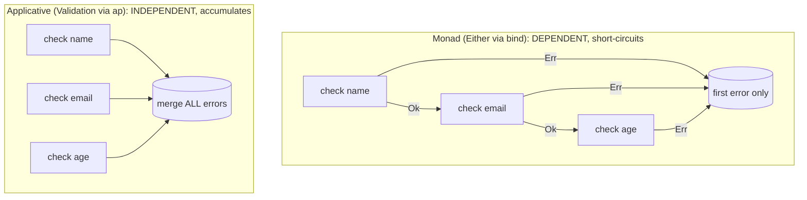

# Functors & Applicatives (Middle)

> **Roadmap:** [Functional Programming](../README.md) → Functors & Applicatives
>
> *A functor is a type with one lawful operation (`map`) and two laws; an applicative adds two operations (`pure`, `ap`) and four more laws. Together they give you a precise, weaker-than-monad vocabulary for "transform inside a context" and "combine independent contexts" — and the second is exactly what error-accumulating validation and `traverse` are built on.*

---

## Table of Contents

1. [Introduction](#introduction)
2. [Prerequisites](#prerequisites)
3. [The Functor Interface and Its Two Laws](#the-functor-interface-and-its-two-laws)
4. [A Tour of Functor Instances](#a-tour-of-functor-instances)
5. [The Applicative Interface: `pure` and `ap`](#the-applicative-interface-pure-and-ap)
6. [`liftA2`, `liftA3`, and the `f <$> a <*> b` Idiom](#lifta2-lifta3-and-the-f--a--b-idiom)
7. [The Applicative Laws (Informally)](#the-applicative-laws-informally)
8. [Independent vs Dependent: The Validation Example in Full](#independent-vs-dependent-the-validation-example-in-full)
9. [`traverse` and `sequence`: Flipping the Boxes](#traverse-and-sequence-flipping-the-boxes)
10. [Trade-offs: When Applicative Style Clarifies vs Obscures](#trade-offs-when-applicative-style-clarifies-vs-obscures)
11. [Common Mistakes](#common-mistakes)
12. [Test Yourself](#test-yourself)
13. [Cheat Sheet](#cheat-sheet)
14. [Summary](#summary)
15. [Further Reading](#further-reading)
16. [Related Topics](#related-topics)

---

## Introduction

> Focus: **the interfaces and the laws, used well.** At the junior level you saw that a functor is "anything you can `map`" and an applicative adds "apply a boxed function to a boxed value." Here you get the precise operations, the laws that keep them honest, the full instance tour, and the two payoffs that make this abstraction earn its keep in real code: **error-accumulating validation** and **`traverse`** (turning a list of effects into an effect of a list).

There are three abstractions, and they're a ladder of *power*:

- **Functor** — one operation, `map :: (a -> b) -> f a -> f b`. Transform the value inside one context.
- **Applicative** — adds `pure :: a -> f a` and `ap :: f (a -> b) -> f a -> f b`. Combine *several independent* contexts.
- **Monad** — adds `bind :: f a -> (a -> f b) -> f b`. Sequence *dependent* contexts (a later step uses an earlier value).

Each rung is strictly more powerful, and the practical skill at this level is **reaching for the weakest one that does the job.** That's not minimalism for its own sake: the weaker the abstraction, the *more* a library can do for you. An applicative's steps can't depend on each other, so the library is free to run them all and gather every error — the famous accumulating validator. A monad *cannot* do that, because its power ("the next step depends on the previous value") forces it to stop at the first failure. **Less expressive, more capable** is the recurring lesson of this topic.

---

## Prerequisites

- **Required:** [`junior.md`](junior.md) — you can explain "functor = mappable box," "applicative applies a boxed function to a boxed value," and the independent-vs-dependent distinction.
- **Required:** [Map / Filter / Reduce](../04-map-filter-reduce/middle.md) — `map` is the functor operation; this builds directly on it.
- **Required:** [Algebraic Data Types](../06-algebraic-data-types/middle.md) — `Option`/`Either`/`Validation` are sum types; their `map`/`ap` are defined by pattern-matching the cases.
- **Helpful:** [Currying & Partial Application](../07-currying-and-partial-application/middle.md) — `ap` feeds a curried function its arguments one box at a time; the whole `f <$> a <*> b` idiom depends on currying.
- **Helpful:** [Monads — Plain English](../09-monads-plain-english/middle.md) — the rung above; this topic is best understood as "the two simpler abstractions underneath the monad."

---

## The Functor Interface and Its Two Laws

A **functor** is a type constructor `F` (a "box" `F<A>`) equipped with one operation:

```text
map :  F<A>  ×  (A -> B)   ->   F<B>
       the box   a plain     the box, same shape,
                 function     value transformed
```

The defining constraint — the thing that makes `map` *trustworthy* — is that it **preserves structure**. It transforms the contained value(s) and touches nothing else: not the number of elements, not the present/absent state, not the success/failure tag, not the ordering. Two laws pin this down.

### Law 1 — Identity

```text
map(box, id)  ==  box           where id = x => x
```

Mapping the identity function returns the box untouched. This forbids any `map` that "secretly does something" — reorders, drops, duplicates, or fills in a missing value. If mapping `id` changed the box, `map` would be doing more than transforming contents.

### Law 2 — Composition

```text
map(map(box, f), g)  ==  map(box, g ∘ f)
```

Mapping `f` then `g` equals mapping their composition in a single pass. This is what licenses **map fusion** (a library or compiler collapsing `.map(f).map(g)` into one traversal — see [Laziness & Streams](../12-laziness-and-streams/middle.md)) and lets *you* refactor chained maps freely.

```python
# Python — checking both laws on the list functor.
xs = [1, 2, 3]
f = lambda x: x + 1
g = lambda x: x * 10

# Identity
assert [x for x in xs] == xs                                  # map(id) == id ✓

# Composition
assert [g(f(x)) for x in xs] == [g(y) for y in [f(x) for x in xs]]   # ✓
```

> **Why a senior-track engineer cares:** the two laws are the contract that makes `map` *boring in the best way* — purely structure-preserving. They are also the minimal definition: a type is a functor iff it has a `map` satisfying them. When you write a custom container's `map`, these are the two properties to verify (a property-based test asserting them is cheap insurance — see [the professional level](professional.md)).

---

## A Tour of Functor Instances

Every box below is a functor. Seeing the variety is the point — "functor" is a wide net, and the *shape* it preserves differs each time.

| Functor | `map(box, f)` does… | Structure preserved |
|---|---|---|
| `Option`/`Maybe` | apply `f` if present; stay `None` if absent | present/absent |
| `List`/`[]` | apply `f` to every element | length & order |
| `Either E`/`Result` | apply `f` on the `Right`/`Ok`; pass `Left`/`Err` through | success/failure tag |
| `Future`/`Promise` | apply `f` to the value when it arrives | the single pending value |
| **Function `(->) r`** | `map(g, f) = f ∘ g` — apply `f` *after* the function | it's still a function `r -> _` |
| **Tuple `(c, _)`** | apply `f` to the *second* slot; first rides along | the pair, first component |

```java
// Java — Optional, Stream, CompletableFuture: all functors, three method names.
Optional<Integer> a = Optional.of(3).map(x -> x + 1);                // Optional[4]
List<Integer> b = Stream.of(1, 2, 3).map(x -> x * 10).toList();      // [10, 20, 30]
CompletableFuture<Integer> c = supplyAsync(() -> 5).thenApply(x -> x + 1);  // CF[6]
// thenApply IS map for the future functor (a plain-function transform).
```

```haskell
-- Haskell — fmap is the one name; <$> is its infix alias. The function and tuple
-- instances are the surprising-but-illuminating ones.
fmap (+1) (Just 3)        -- Just 4
fmap (+1) [10, 20]        -- [11, 21]
fmap (+1) ((*2))  $  5    -- 11   :  function functor — ((*2) then (+1)) applied to 5
fmap (+1) ("log", 10)     -- ("log", 11)   :  tuple functor — first component untouched
```

The function and tuple instances aren't trivia. The **function functor** (`map = compose`) is why "a function is a context" — it underlies the Reader pattern (see [Monads — Plain English: middle](../09-monads-plain-english/middle.md)). The **tuple functor** (map the last slot, carry the first) is the shape of "value + a label/log riding alongside" — the Writer pattern. Recognizing these connects functors to abstractions you've already met.

---

## The Applicative Interface: `pure` and `ap`

`map` takes **one** box and a **one-argument** function. The moment you have *two* boxes you want to combine, `map` stalls — mapping a two-argument (curried) function over the first box leaves you with a *function inside a box*, and `map` cannot apply that to the second boxed value.

An **applicative functor** is a functor with two more operations that close this gap:

```text
pure :  A   ->   F<A>                          put a plain value in the box
ap   :  F<(A -> B)>  ×  F<A>   ->   F<B>        apply a BOXED function to a boxed value
```

`ap` (written `<*>` in Haskell) is the new primitive. With it, combining two boxes is a fixed two-step pattern: **`map` the combining function over the first box** (yielding a *boxed* partially-applied function), **then `ap` that against the second box.**

```python
# Python — a minimal Option applicative, showing pure and ap explicitly.
class Some:
    def __init__(self, v): self.v = v
class Nothing: pass

def pure(v):          # A -> Option<A>
    return Some(v)

def opt_map(box, f):  # functor
    return box if isinstance(box, Nothing) else Some(f(box.v))

def opt_ap(boxed_f, box):                       # applicative: F<A->B> × F<A> -> F<B>
    if isinstance(boxed_f, Nothing): return Nothing()
    if isinstance(box, Nothing):     return Nothing()
    return Some(boxed_f.v(box.v))

add = lambda x: lambda y: x + y                 # curried 2-arg function

boxed_fn = opt_map(Some(3), add)                # Some(y => 3 + y)  — a boxed function
result   = opt_ap(boxed_fn, Some(4))            # Some(7)
# opt_ap(opt_map(Nothing(), add), Some(4))  ==  Nothing()  — any Nothing collapses it
```

For `Option`, `ap` short-circuits: any `Nothing` makes the whole result `Nothing`. For a list, `ap` produces the *cartesian product* of functions × values. For `Validation`, `ap` *accumulates* errors. The interface is the same; the instance decides what "combine" means — exactly as `bind` decides what "then" means for a monad.

> **`pure` vs a monad's `unit`:** they are the same operation (`A -> F<A>`). Every applicative is also a functor (it has `map`), and every monad is also an applicative (you can define `ap` from `bind`). The ladder only goes one way.

---

## `liftA2`, `liftA3`, and the `f <$> a <*> b` Idiom

Writing `ap(map(box1, f), box2)` by hand is noisy. Two conveniences clean it up.

**`liftA2`** packages "map then ap" for a two-argument function:

```text
liftA2 :  (A -> B -> C)  ×  F<A>  ×  F<B>   ->   F<C>
```

Read it as: *lift a two-argument function so it operates on two boxed arguments, succeeding (or accumulating) according to the box's rule.* `liftA3` does the same for three arguments, and so on.

```python
# Python — liftA2 for the Option applicative built above.
def liftA2(f, box_a, box_b):
    # f is a plain 2-arg function; curry it, map over a, ap over b.
    curried = lambda x: lambda y: f(x, y)
    return opt_ap(opt_map(box_a, curried), box_b)

liftA2(lambda x, y: x + y, Some(3), Some(4))    # Some(7)
liftA2(lambda x, y: x + y, Some(3), Nothing())  # Nothing()
```

**The `f <$> a <*> b <*> c` idiom** (Haskell spelling) generalizes this to any number of boxes without a named `liftAN`:

```haskell
-- Haskell — the applicative workhorse. <$> is map, <*> is ap.
-- Apply an N-argument function across N independent boxes.
data User = User String String Int

-- (User <$> name <*> email <*> age) builds a User from three boxed fields,
-- succeeding only if all three boxes succeed.
makeUser :: Maybe String -> Maybe String -> Maybe Int -> Maybe User
makeUser name email age = User <$> name <*> email <*> age
--                        ^^^^^^^^^^^^ map the 3-arg ctor over the first box,
--                                     then <*> the remaining two boxes in turn.
```

The mechanics: `User <$> name` maps the **three-argument** constructor over the first box, leaving a box holding a *two-argument function waiting for email and age*. Each `<*>` feeds the next boxed argument in, peeling one parameter off the boxed function. After three `<*>`s, the function is fully applied and you have `Maybe User`. This is currying and `ap` working together — and it's why applicatives *need* curried functions to scale past two arguments.

```javascript
// JavaScript via fp-ts — the same idiom with real names (Option example).
import { option as O } from "fp-ts";
import { pipe } from "fp-ts/function";

const makeUser = (name) => (email) => (age) => ({ name, email, age });
const user = pipe(
  O.some(makeUser),
  O.ap(O.some("Ada")),      // ap feeds each boxed argument in turn
  O.ap(O.some("ada@x.io")),
  O.ap(O.some(36)),
);                          // O.some({ name: "Ada", email: "ada@x.io", age: 36 })
```

---

## The Applicative Laws (Informally)

An applicative obeys the two functor laws (`map` is still lawful) **plus four laws governing `pure` and `ap`**. You rarely cite them by name, but they're what guarantee the `f <$> a <*> b` idiom means what you expect regardless of how you group it. Informally:

1. **Identity** — `ap(pure(id), v) == v`. Applying a *boxed* identity function changes nothing. (The applicative cousin of the functor identity law.)
2. **Homomorphism** — `ap(pure(f), pure(x)) == pure(f(x))`. If both the function and the value are "plainly boxed" (via `pure`), applying them is the same as applying them outside the box and then boxing the result. `pure` doesn't smuggle in any effect.
3. **Interchange** — `ap(u, pure(y)) == ap(pure(g => g(y)), u)`. Applying a boxed function to a `pure` value can be rewritten as applying a `pure` "call-me-with-y" function to the boxed function. (The technical way of saying: it doesn't matter which operand carries the `pure`.)
4. **Composition** — `ap(ap(ap(pure(compose), u), v), w) == ap(u, ap(v, w))`. Chained `ap`s associate the way ordinary function composition does, so `f <$> a <*> b <*> c` is unambiguous — you can re-parenthesize the `<*>` chain without changing the result.

> **The one-sentence takeaway:** the functor laws say *`map` only transforms contents*; the applicative laws say *`pure` adds no behavior of its own, and chaining `ap` associates like function composition.* Together they make `f <$> a <*> b <*> c` a well-defined "apply this N-arg function across these N boxes" with no surprises from grouping or from where you inject `pure`.

A subtle but important consequence: the laws say nothing that *forces* `ap` to short-circuit. `Either`'s monadic `ap` (derived from `bind`) stops at the first error; `Validation`'s applicative `ap` accumulates — **and both are lawful.** That freedom is exactly the door through which error accumulation walks. We meet it next.

---

## Independent vs Dependent: The Validation Example in Full

This is the spine of the topic. Two computations are **independent** if neither needs the *value the other produces*; **dependent** if a later one needs an earlier one's result. The distinction decides applicative vs monad — and it has a concrete, daily payoff.

### Why `Either` (used monadically) short-circuits

`Either`/`Result` is most often *used as a monad* — chained with `flatMap`. Monadic `bind` has signature `F<A> × (A -> F<B>) -> F<B>`: the next step is a *function of the previous value*. If the previous step was `Left`/`Err`, there is **no value** to feed the function, so `bind` *must* skip it and carry the error out. Short-circuiting isn't a choice `Either` makes — it's forced by the monadic interface.

```python
# Python — Result used monadically (flatMap). Stops at the first error by necessity.
def validate_monadic(name, email, age):
    return (check_name(name)
            .flat_map(lambda n: check_email(email)   # this LAMBDA needs n... or does it?
                .flat_map(lambda e: check_age(age)
                    .map(lambda a: User(n, e, a)))))
# Even though the fields don't truly depend on each other, expressing this with
# flat_map forces left-to-right short-circuit: only the FIRST error is ever seen.
```

### Why `Validation` (an applicative) accumulates

The three field checks are **independent**: validating the email needs nothing from the validated name. An *applicative* combines them with `ap`, whose signature `F<(A->B)> × F<A> -> F<B>` has **no function-of-the-previous-value** — both operands exist independently. So when both are failures, `ap` is free to **merge** them. A `Validation` type whose `ap` concatenates errors gives you the accumulating validator.

```python
# Python — Validation applicative. The ONLY difference from a Result monad is the
# ap behavior on (Invalid, Invalid): it concatenates instead of stopping.
from dataclasses import dataclass

@dataclass
class Valid:   value: object
@dataclass
class Invalid: errors: list          # a list (a "semigroup" — something you can combine)

def v_pure(x): return Valid(x)

def v_map(box, f):
    return box if isinstance(box, Invalid) else Valid(f(box.value))

def v_ap(boxed_f, box):
    match (boxed_f, box):
        case (Invalid(e1), Invalid(e2)): return Invalid(e1 + e2)   # ← accumulate!
        case (Invalid(_), _):            return boxed_f
        case (_, Invalid(_)):            return box
        case (Valid(fn), Valid(x)):      return Valid(fn(x))

def liftA3(f, a, b, c):
    curried = lambda x: lambda y: lambda z: f(x, y, z)
    return v_ap(v_ap(v_map(a, curried), b), c)

def check_name(n):  return Valid(n) if n      else Invalid(["name required"])
def check_email(e): return Valid(e) if "@" in e else Invalid(["email invalid"])
def check_age(a):   return Valid(a) if a >= 0 else Invalid(["age must be >= 0"])

def validate(name, email, age):
    return liftA3(User, check_name(name), check_email(email), check_age(age))

# validate("", "bad", -1)
#   == Invalid(["name required", "email invalid", "age must be >= 0"])   ← ALL of them
# validate("Ada", "ada@x.io", 36) == Valid(User("Ada", "ada@x.io", 36))
```



> **The deciding question, stated as a rule:** *Does a later step need an earlier step's value?* **No → independent → applicative** (you can accumulate errors, and you can run the steps in parallel). **Yes → dependent → monad** (it short-circuits, and the steps must run in order). The validator's superpower is a direct consequence of choosing the *weaker* abstraction for *independent* checks.

This is also why Scala's `cats` ships `Validated` (applicative, accumulates) *separately* from `Either` (monad, short-circuits), and why fp-ts has `Validation`, and Arrow (Kotlin) has `Validated`/`EitherNel`. The two types hold the same data; they differ only in whether their combine *accumulates* or *short-circuits*. Picking the right one is a design decision you now know how to make.

---

## `traverse` and `sequence`: Flipping the Boxes

The second big applicative payoff. You constantly end up with a **list of boxed values** — `[Result<A>]`, `List<Optional<A>>`, `[Future<A>]` — when what you *want* is a **boxed list** — `Result<[A]>`, `Optional<List<A>>`, `Future<[A]>`. `traverse` and `sequence` flip the two layers using the applicative.

```text
sequence :  List<F<A>>            ->   F<List<A>>          flip the layers
traverse :  List<A>  ×  (A -> F<B>)   ->   F<List<B>>     map-then-sequence in one pass
```

`sequence` is `traverse` with the identity function; `traverse` is the more useful primitive. The classic use: validate every item in a list, getting *one* result that's `Ok` only if *all* items passed.

```python
# Python — traverse a list with a validating function, collecting into one box.
# Uses the Validation applicative from above, so it ACCUMULATES every item's errors.
def traverse(items, f):
    acc = Valid([])                                   # start: Valid(empty list)
    for item in items:
        boxed = f(item)                               # F<B>
        # combine acc : F<List> with boxed : F<B>, appending on success
        acc = v_ap(v_map(acc, lambda lst: lambda x: lst + [x]), boxed)
    return acc

def check_positive(n):
    return Valid(n) if n > 0 else Invalid([f"{n} is not positive"])

traverse([1, 2, 3], check_positive)     # Valid([1, 2, 3])
traverse([1, -2, -3], check_positive)   # Invalid(["-2 is not positive", "-3 is not positive"])
```

```haskell
-- Haskell — traverse / sequenceA are the standard library primitives.
sequenceA [Just 1, Just 2, Just 3]   -- Just [1, 2, 3]
sequenceA [Just 1, Nothing, Just 3]  -- Nothing            (any Nothing sinks it)
traverse parseInt ["1", "2", "3"]    -- Maybe [Int]        (map + sequence in one pass)
```

```javascript
// JavaScript — Promise.all IS sequence for the Promise applicative:
// Array<Promise<A>>  ->  Promise<Array<A>>
const results = await Promise.all([fetchA(), fetchB(), fetchC()]);
// Three independent async calls, run concurrently, collected into one Promise<[A,B,C]>.
// That concurrency is possible BECAUSE the calls are independent — pure applicative.
```

That last example is worth pausing on. **`Promise.all` is `sequence` for the Promise applicative**, and the reason it can run the three fetches *concurrently* is precisely that they're independent (applicative, not monadic). If each fetch depended on the previous one's result, you'd need `await` in sequence (monadic), and you'd *lose* the concurrency. **Independence buys parallelism** — the same property that buys error accumulation. The type that supports `traverse` is called **Traversable**; lists, `Option`, trees, and most containers are traversable, and `traverse` is one of the most-used functions in idiomatic FP. (You'll meet it again in [Parser Combinators](../15-parser-combinators/middle.md) and [Recursion Schemes & Transducers](../16-recursion-schemes-and-transducers/middle.md).)

---

## Trade-offs: When Applicative Style Clarifies vs Obscures

Applicative style is a tool, not a virtue. The middle-level skill is knowing when it earns its keep.

**It clarifies when:**

- You have **several independent fallible/optional/async values to combine into one**. `liftA2`/`traverse`/`Validation` express "combine these N things, succeeding (or accumulating) according to the box" in one readable line, replacing a hand-rolled accumulation loop.
- You want **all the errors**, not the first. A `Validation` applicative is the cleanest way to report every bad form field at once.
- You want **concurrency for free** from independence. `Promise.all`/`sequence` runs independent effects together; expressing them applicatively (not as a monadic `await` chain) is what unlocks it.

**It obscures when:**

- The steps are actually **dependent**, and you contort them into applicative shape. If step 2 genuinely needs step 1's value, forcing an applicative is wrong; use the monad.
- The **language has no sugar or operators** for it and you hand-build `ap(map(...), ...)` chains. In plain Java with no `<*>`, a four-box applicative chain is often less readable than an explicit "collect errors into a list" loop (which is what Go does deliberately).
- **One value, one check.** Reaching for `Validation` to guard a single field is ceremony; a plain `if` is clearer.
- The team **doesn't read it**. `f <$> a <*> b` is opaque to engineers who haven't met it; in a mixed team, an explicit accumulation may communicate better.

| Situation | Prefer |
|---|---|
| Many independent checks, want all errors | **`Validation` applicative** |
| Many independent async calls | **`sequence`/`Promise.all`** (concurrency) |
| Steps depend on each other's values | **Monad (`flatMap`)** |
| One isolated check, or Go, or no operators/sugar | **Explicit `if` / accumulate-into-a-list** |

> The Go lesson generalizes again: collecting independent failures into an `errs` slice by hand *is* the applicative pattern, written out. The abstraction is worth importing only when you have enough of these to amortize the cost of the machinery — and when the language and team support it.

---

## Common Mistakes

1. **Using a monad (`flatMap`) for independent validation.** The single most common waste of the applicative. Independent field checks chained with `flatMap` short-circuit, so users see one error at a time. Independent → `Validation` applicative → accumulate.
2. **Expecting `Either` to accumulate.** `Either` used monadically short-circuits *by necessity* (bind needs the previous value). If you want accumulation, you need a *distinct* applicative type (`Validated`/`Validation`) whose `ap` merges errors. Same data, different combine.
3. **Forgetting `ap` needs a curried function for >2 arguments.** `f <$> a <*> b <*> c` only typechecks if `f` is curried (takes its arguments one at a time). Pass an uncurried N-arg function and the chain won't build.
4. **Thinking `traverse` and `map` are interchangeable.** `map` over a list with an `A -> F<B>` gives `List<F<B>>` (a list of boxes). `traverse` gives `F<List<B>>` (a box of a list) — the layers flipped. If you got a list-of-boxes you didn't want, you needed `traverse`/`sequence`.
5. **Assuming applicatives always short-circuit (or always accumulate).** Neither is mandated by the laws. `Option`/`Either` applicatives short-circuit; `Validation` accumulates; `List` takes the cartesian product. The instance decides.
6. **Writing a custom `map`/`ap` that breaks the laws.** A `map` that reorders, or an `ap` that drops one operand's errors, will pass today's tests and betray a future refactor. Property-test the laws on custom instances.
7. **Reaching for the abstraction when the language fights it.** Hand-built `ap` chains in plain Java/Go are usually worse than an explicit loop. Use applicative style where there's sugar/operators (Haskell, Scala `cats`, fp-ts) and a team that reads it.

---

## Test Yourself

1. State `map`'s signature and its two laws in your own words. What do the laws forbid?
2. Why can't `map` alone combine two `Option` values with a two-argument function? What operation fixes it, and what's its signature?
3. Walk through `User <$> a <*> b <*> c` step by step. Why must `User` be curried?
4. The form validator: name the *only* code difference between the monadic (short-circuit) and applicative (accumulate) versions, and explain why that difference is *possible* for the applicative but *impossible* for the monad.
5. What do `traverse` and `sequence` do, and how do they relate? Give the type signature of `sequence`.
6. Why is `Promise.all` able to run its requests concurrently, while a chain of `await`s runs them in sequence? Tie your answer to applicative vs monad.
7. Give one situation where applicative style clarifies code and one where it obscures it. What property of the *problem* (not the language) tips the balance?

<details>
<summary>Answers</summary>

1. `map : F<A> × (A -> B) -> F<B>` — transform the value inside the box, returning the *same-shaped* box. **Identity:** `map(box, id) == box`. **Composition:** `map(map(box, f), g) == map(box, g∘f)`. The laws forbid `map` from doing anything *besides* transforming contents — no reordering, dropping, duplicating, or filling-in. They make `map` purely structure-preserving.
2. `map` takes one box and a one-arg function; with two boxes, mapping a curried 2-arg function over the first leaves a *function inside a box*, and `map` can't apply a boxed function to the second boxed value. **`ap : F<(A->B)> × F<A> -> F<B>`** (apply a boxed function to a boxed value) fixes it.
3. `User <$> a` maps the 3-arg `User` constructor over box `a`, yielding a box holding a *2-arg function* (awaiting email and age). `<*> b` feeds the next boxed argument, leaving a box holding a *1-arg function*. `<*> c` feeds the last, yielding `F<User>`. `User` must be **curried** because each `<*>` peels off exactly one argument — an uncurried N-arg function can't be partially applied one box at a time.
4. The only difference is `ap`'s behavior when **both** operands are failures: the applicative `Validation` **concatenates the error lists**; the monad stops at the first. It's *possible* for the applicative because `ap`'s operands are independent (no function-of-the-previous-value), so both can be evaluated and merged. It's *impossible* for the monad because `bind`'s next step is a function of the previous value — if that value is an error, there's nothing to feed the function, so it must short-circuit.
5. `sequence : List<F<A>> -> F<List<A>>` flips a list-of-boxes into a box-of-list. `traverse : List<A> × (A -> F<B>) -> F<List<B>>` maps each element to a box and sequences in one pass. `sequence` is `traverse` with the identity function (`traverse(xs, id)`).
6. `Promise.all` is `sequence` for the Promise applicative: it combines *independent* promises, and independence means there's no ordering constraint, so they can run concurrently. A chain of `await`s is *monadic* — each step can depend on the previous value, so they must run in order. **Independence (applicative) buys concurrency; dependence (monad) forces sequencing.**
7. **Clarifies:** combining several *independent* fallible values into one and wanting *all* the errors — a `Validation` applicative or `traverse` says it in one line. **Obscures:** when the steps are actually *dependent* (forcing them applicative is wrong), or when there's a single check (a plain `if` is clearer). The tipping property of the *problem* is **whether the steps are independent** — that's what the abstraction is for.

</details>

---

## Cheat Sheet

| Concept | One-liner |
|---|---|
| **Functor** | Box with lawful `map`; transform contents, preserve structure |
| **`map`/`fmap`** | `F<A> × (A→B) → F<B>` |
| **Functor laws** | identity (`map id == id`), composition (`map f . map g == map (g∘f)`) |
| **Applicative** | Functor + `pure` + `ap`; combine *independent* boxes |
| **`pure`/`of`** | `A → F<A>` (same as a monad's `unit`) |
| **`ap`/`<*>`** | `F<(A→B)> × F<A> → F<B>` — apply a *boxed* function to a *boxed* value |
| **`liftA2`** | `(A→B→C) × F<A> × F<B> → F<C>` — combine two boxes |
| **`f <$> a <*> b <*> c`** | apply an N-arg curried function across N independent boxes |
| **Applicative laws** | identity, homomorphism, interchange, composition — `pure` is neutral, `ap` associates |
| **`Validation`** | applicative whose `ap` **accumulates** errors (vs `Either`'s short-circuit) |
| **`sequence`** | `List<F<A>> → F<List<A>>` — flip the layers |
| **`traverse`** | `List<A> × (A→F<B>) → F<List<B>>` — map then sequence |
| **Traversable** | a type you can `traverse` (lists, `Option`, trees, …) |

**Decision rule:**

| Steps are… | Use | Failure / concurrency |
|---|---|---|
| one box | `map` | — |
| **independent** | applicative (`liftA2`/`ap`/`traverse`) | accumulate errors; run in parallel |
| **dependent** (later needs earlier value) | monad (`flatMap`) | short-circuit; sequential |

> **The deciding question:** does a later step need an earlier step's *value*? No → applicative; yes → monad.

---

## Summary

- A **functor** is a type with a lawful `map : F<A> × (A→B) → F<B>` that **preserves structure**. Its two laws — identity and composition — forbid `map` from doing anything but transforming contents. `Option`, `List`, `Either`, `Promise`, functions, and tuples are all functors.
- `map` stalls when you have **two boxes** to combine. An **applicative** adds `pure` (`A → F<A>`) and `ap` (`F<(A→B)> × F<A> → F<B>`), letting you apply a *boxed function* to a *boxed value*. `liftA2` and the `f <$> a <*> b <*> c` idiom combine N independent boxes — which requires the function be **curried**.
- The **applicative laws** (identity, homomorphism, interchange, composition) say `pure` adds no behavior and `ap` associates like composition — so the combine idiom is unambiguous. Critically, the laws **don't force short-circuiting**, which is the opening for error accumulation.
- The **independent-vs-dependent** distinction decides everything. `Either`/`Result` used *monadically* short-circuits *by necessity* (bind needs the previous value). A `Validation` applicative on *independent* checks **accumulates all errors** — the canonical form-validation win, available *because* the applicative is weaker than the monad. (Hence `cats` `Validated`, fp-ts `Validation`, Arrow `Validated` exist alongside `Either`.)
- **`traverse`/`sequence`** flip `List<F<A>>` into `F<List<A>>` using the applicative — validating a whole list into one result, or (via `Promise.all`) running independent async calls **concurrently**. Independence buys both error accumulation *and* parallelism.
- **Use applicative style** for many independent values you want to combine (especially with all-errors or concurrency); **avoid it** for dependent steps, single checks, or languages/teams without the sugar — where an explicit accumulation loop (the Go approach) is clearer.
- Next: [`senior.md`](senior.md) — the design judgment of when this abstraction pays off, the language reality across Haskell/Scala/Kotlin/TS/Python, and the cost of reaching for it.

---

## Further Reading

- **"Applicative programming with effects"** — McBride & Paterson (2008) — the founding paper; introduces applicatives and the `traverse`/validation motivation. The first few pages are unusually readable.
- **Functors, Applicatives, And Monads In Pictures** — Aditya Bhargava (adit.io) — the illustrated intuition, now with the interfaces filled in.
- **Scala with Cats** — Welsh & Gurnell (free online) — the `Validated`/`Applicative`/`Traverse` chapters, with the form-validation example in production Scala.
- **The fp-ts documentation** — `Apply`, `Applicative`, `Validation`, and `traverse`/`sequence` modules — the TypeScript realization of everything here.
- **Learn You a Haskell for Great Good!** — Lipovača — "Functors, Applicative Functors and Monoids," the canonical home of `<$>`/`<*>`.

---

## Related Topics

- [Map / Filter / Reduce](../04-map-filter-reduce/middle.md) — `map` is the functor operation this builds on.
- [Monads — Plain English](../09-monads-plain-english/middle.md) — the rung above; `flatMap` for dependent steps and why it must short-circuit.
- [Algebraic Data Types](../06-algebraic-data-types/middle.md) — `Option`/`Either`/`Validation` are sum types; their `map`/`ap` are defined by case analysis.
- [Currying & Partial Application](../07-currying-and-partial-application/middle.md) — the `f <$> a <*> b` idiom is currying feeding boxed arguments in one at a time.
- [Composition](../05-composition/middle.md) — the function functor's `map` *is* composition; the backdrop for applicative combine.
- [Laziness & Streams](../12-laziness-and-streams/middle.md) — the composition law is what licenses map fusion.
- [Optics, Lenses & Prisms](../14-optics-lenses-and-prisms/middle.md) — the next topic; `traverse` reappears there as a traversal.
