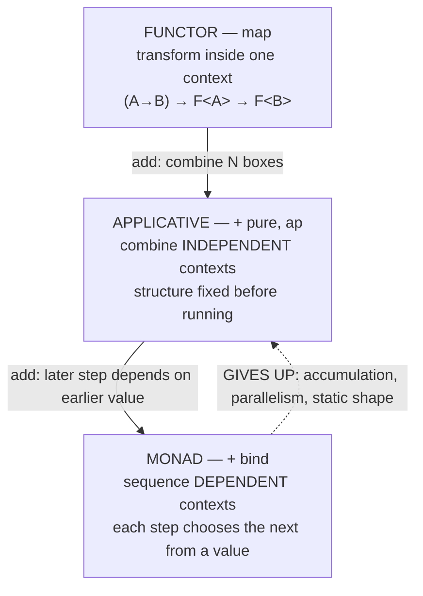
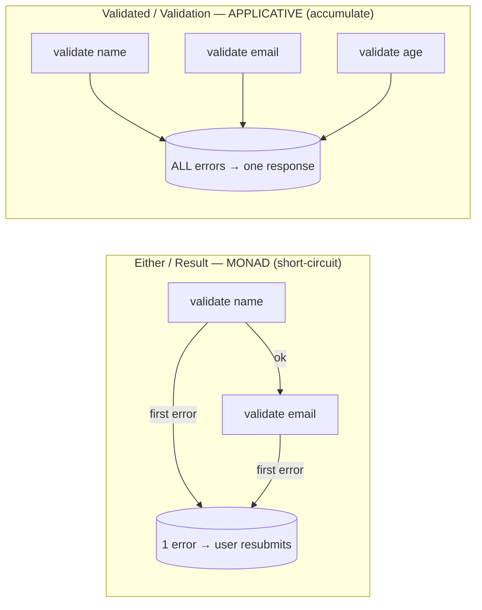

# Functors & Applicatives (Senior Level)

> **Roadmap:** [Functional Programming](../README.md) → Functors & Applicatives
>
> **Essence:** Functor and applicative are the two abstractions *below* the monad on the power ladder, and the senior insight is that **descending the ladder is a design move, not a consolation prize.** Choosing the weakest abstraction that fits — applicative over monad for independent effects — is what buys you error accumulation, parallelism, and statically analyzable structure. The question is never "what is an applicative?" but "*does treating this as an applicative instead of a monad make the system cheaper to change and capable of things the monad can't do — or am I importing `<*>` to look clever?*"

---

## Table of Contents

1. [Introduction](#introduction)
2. [The Power Ladder, and Why Weaker Is a Feature](#the-power-ladder-and-why-weaker-is-a-feature)
3. [The Deciding Question: Independent vs Dependent Effects](#the-deciding-question-independent-vs-dependent-effects)
4. [Language Reality: Who Has This and What They Call It](#language-reality-who-has-this-and-what-they-call-it)
5. [The Validation Type as an Architecture Decision](#the-validation-type-as-an-architecture-decision)
6. [Applicatives and Parallelism](#applicatives-and-parallelism)
7. [When the Abstraction Pays Off vs When It's Cargo-Cult](#when-the-abstraction-pays-off-vs-when-its-cargo-cult)
8. [Designing APIs Around Functor/Applicative](#designing-apis-around-functorapplicative)
9. [Common Mistakes](#common-mistakes)
10. [Test Yourself](#test-yourself)
11. [Cheat Sheet](#cheat-sheet)
12. [Summary](#summary)
13. [Further Reading](#further-reading)
14. [Related Topics](#related-topics)

---

## Introduction

> Focus: **design and architecture implications.** Not "what is a functor" (that's [`junior.md`](junior.md)) and not "how do `map`/`ap` work and what are their laws" (that's [`middle.md`](middle.md)) — but *when, in a codebase that ships, choosing functor/applicative over a monad is the right call, what it buys you that the monad cannot, and when reaching for `<*>` is over-abstraction you'll regret.*

Most engineers learn monads first and treat functor and applicative as warm-up trivia — the rungs you climb past on the way to the "real" abstraction. That ordering is pedagogically backwards and architecturally harmful. The senior framing is the reverse:

> **The monad is the *most* powerful of the three, and "most powerful" is a cost, not just a benefit.** A monad lets every step depend on every prior value. That expressiveness *forbids* certain optimizations and capabilities — you cannot accumulate errors across steps, you cannot run steps in parallel, you cannot statically inspect the shape of the computation before running it — *precisely because* a later step might do anything based on an earlier result. An applicative gives up that dependency, and in exchange gets accumulation, parallelism, and static analyzability. A functor gives up even combining, and gets the simplest possible contract.

So the central senior skill in this topic is **descending the ladder deliberately.** When your effects are independent, modeling them as an *applicative* rather than a *monad* is not a stylistic preference — it's the difference between "report all the validation errors and fire the three HTTP calls concurrently" and "report the first error and fire the calls one at a time." The weaker abstraction is strictly *more capable* for the problem it fits. This file is about recognizing which problems those are, in which languages, for which teams.

> **The frame for this whole file:** functor and applicative are *constraints you choose*. Like making a field `final`, a function pure, or a class `sealed`, picking the weaker abstraction *removes* expressive freedom — and that removal is what enables the compiler, the runtime, and the next engineer to do more for you. "Constraints liberate; liberties constrain." Choosing applicative-over-monad is that principle applied to effect composition.

---

## The Power Ladder, and Why Weaker Is a Feature

The three abstractions form a strict hierarchy. Each adds exactly one capability, and each capability *costs* something the rung below kept.



The asymmetry is the whole point. Climbing *up* the ladder adds power. Climbing up also *subtracts* three concrete capabilities:

1. **Error accumulation.** An applicative's `ap` takes two *independent* operands, so when both fail it can merge their errors. A monad's `bind` takes a function *of the previous value*; a failed step yields no value to feed forward, so it *must* short-circuit. **Monads cannot accumulate — not by convention, by construction.**

2. **Parallelism / concurrency.** Independent applicative steps have no ordering constraint, so a runtime is free to evaluate them simultaneously (`Promise.all`, `parTraverse`, concurrent `ap`). A monadic chain's later step may depend on the earlier result, so the runtime *must* run them in order. **Independence is the license to parallelize; the monad revokes it.**

3. **Static inspectability.** Because an applicative's structure is fixed *before* anything runs (the shape of `f <$> a <*> b <*> c` doesn't depend on runtime values), a library can *analyze* the whole computation up front — count the requests it will make, build an optimal query plan, render a form's fields — without executing it. A monad's `bind` can branch on a runtime value, so its future shape is unknowable until you run it. This is the basis of static-applicative parsers, the Haxl/Stitch data-fetching libraries that batch and dedupe queries, and applicative form/UI builders.

```haskell
-- Haskell — the same three independent fetches, two ways.
-- APPLICATIVE: the shape is static; a smart runtime (e.g. Haxl) can BATCH all
-- three into one round-trip because it sees them before running any.
getProfile :: Id -> Haxl Profile
getProfile id = Profile <$> fetchUser id <*> fetchPrefs id <*> fetchAvatar id
--                                  ^^^^ three independent fetches — batchable, parallel

-- MONADIC: if the second fetch DEPENDED on the first's result, batching is
-- impossible — the runtime can't know what to fetch second until the first returns.
getProfileSeq :: Id -> Haxl Profile
getProfileSeq id = do
  user <- fetchUser id
  prefs <- fetchPrefs (user.region)   -- DEPENDS on user → cannot batch with fetchUser
  pure (Profile user prefs ...)
```

> **The senior reading:** "use the weakest abstraction that works" is not asceticism. It is the recognition that **expressive power is paid for in lost capability.** Every time you reach past applicative to monad, you forfeit accumulation, parallelism, and static analysis — so reach past it *only when a step genuinely depends on an earlier value.* The discipline is identical to preferring `final`/`const`, pure functions, or the narrowest interface: constrain to enable.

This is the same principle that, one rung up, makes [pure functions](../02-pure-functions-and-referential-transparency/senior.md) more useful than effectful ones and [immutable data](../03-immutability/senior.md) more useful than mutable: giving up a freedom hands a guarantee to every downstream reader and tool.

---

## The Deciding Question: Independent vs Dependent Effects

Everything in this topic reduces to one question you ask at every junction:

> **Does a later step need the *value* an earlier step produced?**
> - **No** → the steps are *independent* → model with a **functor** (one step) or **applicative** (several) → you get accumulation and parallelism.
> - **Yes** → the steps are *dependent* → you need a **monad** → you get short-circuiting and sequencing.

The trap is that "independent" is about *values*, not about whether the steps run in some order or share some resource. Two checks can run left-to-right and still be independent if neither consumes the *other's result*. Validating an email's format and validating a name's length are independent; you happen to run them in sequence, but neither needs the other's output. Looking up a user and then loading *that user's* orders is dependent — the second call's *argument* is the first call's *result*.

| Scenario | Later step needs earlier *value*? | Abstraction | Why |
|---|---|---|---|
| Validate name, email, age of a form | No | **Applicative** | accumulate all field errors |
| Fetch user, prefs, avatar by the same id | No | **Applicative** | batch/parallelize the three calls |
| Look up user, then load *that user's* orders | Yes | **Monad** | the orders query needs the user id from step 1 |
| Parse, then validate the *parsed* result | Yes | **Monad** | validation operates on parse's output |
| Run 100 independent DB writes | No | **Applicative** (`traverse`) | run concurrently, collect all results |
| Retry: try A, if it fails *because of X*, try B | Yes | **Monad** | B is chosen based on A's failure value |

A common real shape is **mixed**: a pipeline where some steps are independent and some are dependent. The senior move is to use the *weakest* abstraction at each segment — applicative `traverse` to validate-and-collect a batch (accumulating), then monadic `flatMap` to feed the collected result into a dependent next step. You don't pick one abstraction for the whole pipeline; you pick the right rung for each link.

```python
# Python (sketch) — a mixed pipeline. Independent validation (applicative,
# accumulate), THEN a dependent persistence step (monad, short-circuit).
def register(form):
    validated = validate_all(form)        # APPLICATIVE: collect ALL field errors
    if isinstance(validated, Invalid):
        return validated                  # report every error at once
    user = validated.value
    # now a DEPENDENT step: saving needs the validated user; if save fails,
    # there's nothing to do next — monadic short-circuit is correct here.
    return save(user).flat_map(send_welcome_email)
```

> **The interview-grade one-liner:** *"Don't use a monad just because you can. If the steps don't depend on each other's values, an applicative gives you everything the monad would — plus error accumulation and parallelism the monad structurally cannot."* That sentence, applied at every junction, is most of the senior judgment in this topic.

---

## Language Reality: Who Has This and What They Call It

No mainstream language advertises "applicative functors," and the support ranges from first-class (Haskell) to "you'll build it by hand" (Go). Knowing your local dialect is most of the practical skill, because it determines whether reaching for the abstraction is idiomatic or a fight.

| Language | Functor (`map`) | Applicative (`ap`) | Accumulating validation type | `traverse`/`sequence` | Generic over all functors? |
|---|---|---|---|---|---|
| **Haskell** | `fmap`/`<$>` | `<*>`, `liftA2` | `Validation` (validation pkg) | `traverse`/`sequenceA` | Yes (`Functor`/`Applicative` classes) |
| **Scala (Cats)** | `map` | `Apply`/`mapN` | `Validated` / `ValidatedNel` | `traverse`/`sequence` | Yes (`Applicative[F]`) |
| **Kotlin (Arrow)** | `map` | `zip`/`Applicative` | `Validated` / `EitherNel` | `traverse`/`sequence` | Partially (no HKT; uses context) |
| **TypeScript (fp-ts)** | `map` | `ap`/`sequenceT` | `Validation`/`These` | `traverse`/`sequence` | Simulated HKT (`Kind` encoding) |
| **Rust** | `map` on `Option`/`Result`/iter | none generic; `zip` on `Option` | none stdlib (`itertools`/crates) | `collect::<Result<Vec<_>>>()` | No (no HKT) |
| **Java** | `map`/`thenApply` | none generic | none stdlib (libs: Vavr) | manual / `Collectors` | No (no HKT) |
| **Python** | `map`/comprehensions | none stdlib (`returns` lib) | none stdlib (`returns`/`pydantic`) | manual / `returns` | No |
| **Go** | none generic | none | none — accumulate by hand | none | No |

A few of these deserve a closer look because their design choices teach the trade-off.

**Scala + Cats is the most idiomatic mainstream home.** `Validated` and `ValidatedNel` (where `Nel` = non-empty list of errors) are *exactly* the accumulating applicative, shipped as a distinct type from `Either` *on purpose*. The library makes the design decision visible in the type you import: choose `Either` for short-circuit, `Validated` for accumulate.

```scala
// Scala + Cats — Validated accumulates; the `.mapN` is the applicative combine.
import cats.data.ValidatedNel
import cats.implicits._

def checkName(n: String):  ValidatedNel[String, String] =
  if (n.nonEmpty) n.validNel else "name required".invalidNel
def checkEmail(e: String): ValidatedNel[String, String] =
  if (e.contains("@")) e.validNel else "email invalid".invalidNel
def checkAge(a: Int):      ValidatedNel[String, Int] =
  if (a >= 0) a.validNel else "age must be >= 0".invalidNel

// (a, b, c).mapN(f) is liftA3 — runs all three, accumulates errors into the Nel.
def validate(n: String, e: String, a: Int): ValidatedNel[String, User] =
  (checkName(n), checkEmail(e), checkAge(a)).mapN(User.apply)
// Invalid(NonEmptyList("name required", "email invalid"))  — ALL errors
```

**Rust has the *idea* without the *abstraction* — and one beautiful special case.** Rust can't express a generic `Applicative` (no higher-kinded types), but its `collect` into `Result<Vec<T>, E>` is exactly `sequence` for the result applicative — flipping `Vec<Result<T, E>>` into `Result<Vec<T>, E>`, short-circuiting on the first error:

```rust
// Rust — collect::<Result<Vec<_>, _>>() IS sequence for the Result applicative.
let parsed: Result<Vec<i32>, _> =
    ["1", "2", "3"].iter().map(|s| s.parse::<i32>()).collect();
// Ok([1, 2, 3])   — or Err(...) at the first unparseable string (short-circuit).
```

Note this is the *short-circuiting* applicative; for accumulation you reach for a crate (or fold errors into a `Vec` by hand). Rust gives you `traverse`'s most common case as a stdlib idiom without ever saying "applicative."

**Java and Python have functors but no applicative abstraction.** `Optional.map`, `Stream.map`, `CompletableFuture.thenApply` are lawful functors; but there is no `ap`, no `Validated`, no HKT to write code generic over "any applicative." So in plain Java/Python, the accumulating validator is written *by hand* — collect errors into a list, check at the end — which is fine and idiomatic. Importing a library `Result`/`Validation` type is justified only at scale, and only team-wide. (Java's `CompletableFuture.allOf` is `sequence` for futures in spirit, giving you concurrent independent calls — the parallelism payoff even without the named abstraction.)

**Go refuses, and that refusal is instructive.** Go has no generics-over-containers `map`, no `ap`, no `Validated`. Its idiom for "combine independent fallible values" is to collect into an error slice and check at the end — which *is* the applicative accumulation pattern, written out:

```go
// Go — applicative-shaped accumulation, by hand. The errs slice IS the Validated Nel.
func validate(name, email string, age int) (*User, []error) {
    var errs []error
    if name == "" {
        errs = append(errs, errors.New("name required"))
    }
    if !strings.Contains(email, "@") {
        errs = append(errs, errors.New("email invalid"))
    }
    if age < 0 {
        errs = append(errs, errors.New("age must be >= 0"))
    }
    if len(errs) > 0 {
        return nil, errs                       // all errors at once
    }
    return &User{name, email, age}, nil
}
```

Notice that idiomatic Go *naturally* writes the accumulating version — collect-then-check — rather than returning at the first failure. Go programmers reach for the applicative *pattern* without the applicative *abstraction*, and for independent validations it reads perfectly well. The lesson generalizes: **the abstraction is one way to factor out a pattern; in a language that fights the abstraction, the pattern written by hand is the better code.**

> **The senior reading of this table:** the abstraction's *value* is bounded by the language's support *and* the team's fluency. In Haskell/Scala-Cats, `Validated`/`Applicative`/`traverse` are first-class architectural tools. In Kotlin-Arrow/TS-fp-ts they're available with some ceremony. In Rust the most common case is a stdlib idiom under a different name. In Java/Python/Go the idiomatic answer is usually to write the accumulation by hand. Match the design to the language's grain — don't import `<*>` into a codebase built to reject it.

---

## The Validation Type as an Architecture Decision

The single most consequential applicative decision a senior makes is **choosing the validation type for a system boundary** — the API request handler, the form processor, the config loader, the CSV importer. The choice is binary and visible in the type, and it has real product consequences.

### `Either`/`Result` (short-circuit) vs `Validation`/`Validated` (accumulate)

Both types hold "a success value or some errors." They differ in *one* behavior: how they combine when there are multiple errors.

- **`Either`/`Result`** is a **monad**; its combine (`flatMap`) short-circuits at the first error. The user sees *one* error, fixes it, resubmits, sees the *next*. For an N-field form, that's up to N round-trips to discover N errors.
- **`Validation`/`Validated`** is an **applicative** (it deliberately has *no* lawful monad instance — more on that below); its combine (`ap`/`mapN`) accumulates *all* errors. The user sees every problem in one response.

This is not a micro-optimization. For a public sign-up form, "report all errors at once" is a *product requirement*, and the abstraction choice is how you satisfy it cleanly. Picking `Either` for a form validator is a latent UX bug encoded in a type.



### Why `Validation` has no monad instance — and why that's the point

A subtle, senior-level fact: `Validation`/`Validated` is an applicative but **deliberately not a monad.** This is not an oversight — it's a *coherence law*. If a type is both an applicative and a monad, its applicative `ap` must agree with the `ap` *derived from* its monadic `bind`. But the monadic `ap` short-circuits (bind needs the previous value), while the accumulating `ap` merges errors — *they disagree*. You cannot have both behaviors lawfully on one type. So `Validation` chooses the accumulating applicative and **refuses** the monad instance, precisely so it can keep accumulating. `Either` makes the opposite choice. The two types are the *same data* split apart by *which law they're willing to satisfy.*

> **The architectural takeaway:** the existence of *two* types for the same data — short-circuiting and accumulating — is the ladder made concrete. When you reach for `Validated`, you are explicitly choosing the *weaker* (applicative-only) abstraction *in order to gain* accumulation. The type system records your decision, and the next engineer reads it. This is "make the right thing the easy thing": name the boundary type after the behavior you want.

### The practical rule for boundaries

- **User-facing input validation (forms, API request bodies, config files):** accumulate. Use `Validated`/`Validation`, or — in a language without it — collect errors into a list by hand (the Go pattern). Reporting all errors at once is almost always the right UX.
- **Internal dependent pipelines (parse → enrich → persist, where each step needs the prior result):** short-circuit. Use `Either`/`Result`/`flatMap`. There's no value in "accumulating" when a later step *cannot run* without an earlier result anyway.
- **Convert between them at the seam.** Validate-and-accumulate at the boundary (`Validated`), then `.toEither` to drop into a monadic dependent pipeline. The transition point is where independent validation ends and dependent processing begins.

---

## Applicatives and Parallelism

The second architectural payoff of the applicative — beyond accumulation — is **concurrency**, and it follows from the identical property: independence.

Because an applicative's operands don't depend on each other's *values*, a runtime is free to evaluate them in *any* order, including *simultaneously*. A monadic chain forbids this: `bind`'s next step is a function of the previous result, so the runtime must finish step 1 before it even knows what step 2 *is*. **Independence is the license to parallelize, and the applicative is how you express independence in the type.**

```javascript
// JavaScript — Promise.all is `sequence` for the Promise applicative.
// The three fetches are INDEPENDENT (none needs another's result), so they
// run CONCURRENTLY. Total latency ≈ max(a, b, c), not a + b + c.
const [user, prefs, avatar] = await Promise.all([
  fetchUser(id),       // ─┐
  fetchPrefs(id),      //  ├─ all in flight at once — applicative concurrency
  fetchAvatar(id),     // ─┘
]);

// CONTRAST — the monadic version. Each await blocks the next; if a later call
// depended on an earlier value this would be necessary, but here it needlessly
// serializes independent work. Latency ≈ a + b + c.
const user2   = await fetchUser(id);
const prefs2  = await fetchPrefs(id);   // waits for user2 even though it doesn't need it
const avatar2 = await fetchAvatar(id);
```

The lesson is sharp and has direct performance consequences: **writing independent async work as a monadic `await` chain instead of an applicative `Promise.all` silently serializes it.** This is one of the most common real-world latency bugs in async code — three independent 100ms calls taking 300ms instead of 100ms because someone reached for the more powerful abstraction (sequential `await`) when the weaker one (`all`) was both correct and faster. The same pattern recurs as Scala Cats' `parTraverse`/`parMapN`, ZIO's `zipPar`, and Haskell's concurrent applicatives (Haxl): *the applicative structure is what tells the runtime "these are independent — run them together."*

```scala
// Scala + Cats Effect — parMapN runs independent effects in parallel.
// The `par` prefix is only sound BECAUSE the applicative combine has no
// inter-step value dependency. A monadic flatMap chain could not be parallelized.
(fetchUser(id), fetchPrefs(id), fetchAvatar(id)).parMapN(Profile.apply)
```

> **The senior framing:** parallelism and error accumulation are *the same capability* viewed two ways. Both are gifts of *independence*, and the applicative is the abstraction that captures independence in a type a runtime can exploit. Every time you write `Promise.all`, `parTraverse`, or a `Validated` combine, you are cashing in the discount you earned by *not* reaching for the monad. The deeper this idea sits in your reflexes, the more often you'll catch needlessly serial code and needlessly first-error-only validation in review.

---

## When the Abstraction Pays Off vs When It's Cargo-Cult

The applicative is not good or bad in the abstract — it's good *for some shapes of problem, in some languages, for some teams.* Here is how to tell.

### It pays off when…

- **You have several independent effectful values to combine, and you want all of them.** Form/request/config validation that reports every error; combining results from multiple independent services; `traverse`-ing a batch and collecting all outcomes. This is the textbook win — the applicative deletes the hand-rolled accumulation loop *and* makes "report only the first error" unrepresentable.
- **Independence can buy you concurrency.** Independent I/O (HTTP, DB, RPC) expressed applicatively (`Promise.all`, `parTraverse`) runs in parallel for free. Here the abstraction isn't just cleaner — it's *faster*, and the monadic alternative is a latency bug.
- **The language has first-class support.** Haskell, Scala-Cats, and to a lesser extent Kotlin-Arrow and TS-fp-ts give you `Validated`/`traverse`/`parMapN` with low ceremony. The reader cost is near zero in a team fluent in them.
- **You want static analyzability.** Applicative parsers, batching data layers (Haxl), and form-builders exploit the fact that an applicative's *shape is known before it runs.* If you need to inspect/optimize a computation before executing it, the applicative's static structure is the enabling property — the monad's runtime branching forecloses it.

### It's cargo-cult / over-abstraction when…

- **The steps are actually dependent and you contort them into applicative shape.** If step 2 needs step 1's value, the monad is correct; forcing `ap` is wrong and usually impossible without faking it. Independence is a *fact about the problem*, not a goal to engineer toward.
- **You're in a language that fights it (Go, plain Java/Python) and there's no scale to amortize the machinery.** Hand-collecting errors into a slice is idiomatic, readable Go; importing a `Validated` type to avoid it is non-idiomatic and slows the next maintainer. The accumulation *pattern* is free; the *abstraction* costs.
- **There's one value, one check.** A single field validated once doesn't need `Validated` any more than a single nullable needs a `Maybe` monad. Reaching for the abstraction for one check is ceremony.
- **The team can't read `f <$> a <*> b` (or its local equivalent).** An applicative chain is opaque to engineers who haven't met it; in a mixed-fluency team, an explicit accumulation loop communicates better. The abstraction's value is gated on team fluency, full stop.
- **You reach for it to look principled.** Using `traverse`/`sequence`/`<*>` because they're "more functional" — when a plain loop is clearer to this team in this language — is [speculative generality](../../anti-patterns/01-development/03-over-engineering/senior.md) wearing a category-theory hat.

### The cost function, made explicit

| Cost | Manual accumulation (collect-into-list) | Applicative (`Validated`/`traverse`) |
|---|---|---|
| **Per-combine writing** | Boilerplate at each call site | Written once; combine is one line |
| **Forgetting to accumulate** | Easy — someone returns early, reverting to short-circuit | Impossible — the type's `ap` accumulates by construction |
| **Reader onboarding** | Zero (everyone reads a loop) | Non-zero — must know `Validated`/`<*>`/`traverse` |
| **Concurrency** | Manual (thread/async wiring) | Free with `parTraverse`/`Promise.all` |
| **Static inspection** | Not available | Available (shape known before run) |
| **Fighting the language** | None (it's just a loop) | High in Go/plain-Java/Python; low in Haskell/Scala |

The applicative column wins decisively when there are *many* independent combines, when concurrency or all-errors is a real requirement, and when the language sugars it. It loses for one-off checks, dependent steps, or hostile languages/teams. **The decision is the row-by-row sum in your context** — and a senior can put this table in a design review to turn "I like `traverse`" / "applicatives are too clever" into a defensible call.

> **The litmus test:** *"Are these steps genuinely independent, and does treating them applicatively give me accumulation/parallelism I actually need — in this language, for this team — or am I reaching for `<*>` to be clever?"* "Independent + a real need for accumulation/concurrency + a language and team that support it" funds the abstraction; anything short of that doesn't.

---

## Designing APIs Around Functor/Applicative

The senior payoff of this topic in *your own* code is mostly about return types and combinators at boundaries.

### Make your boundary types functor/applicative-friendly

If you build a domain `Result`/`Validation` type, give it a lawful `map` (functor) and, where independent combination matters, a `pure` + `ap` (applicative). The `map` lets callers transform results without unwrapping; the `ap` lets them combine several into one with accumulation. Even in languages without an `Applicative` *interface* (Java, TS, Python), providing the *operations* (`map`, `ap`/`zip`, a `validateAll`) gives callers the payoffs without the typeclass machinery.

```typescript
// TypeScript — a small Validation with map and a `combine` (ap-flavored) helper,
// usable without any HKT machinery. Accumulates errors by construction.
type Validation<T> =
  | { ok: true;  value: T }
  | { ok: false; errors: string[] };

const valid = <T>(value: T): Validation<T> => ({ ok: true, value });
const invalid = <T>(errors: string[]): Validation<T> => ({ ok: false, errors });

// functor: map
function map<A, B>(v: Validation<A>, f: (a: A) => B): Validation<B> {
  return v.ok ? valid(f(v.value)) : v;
}

// applicative combine (liftA2 shape): accumulate on double-failure
function map2<A, B, C>(
  va: Validation<A>, vb: Validation<B>, f: (a: A, b: B) => C,
): Validation<C> {
  if (!va.ok && !vb.ok) return invalid([...va.errors, ...vb.errors]); // ← accumulate
  if (!va.ok) return va;
  if (!vb.ok) return vb;
  return valid(f(va.value, vb.value));
}
// Callers combine independent validations and get ALL errors — no HKT, no library.
```

### Prefer the weakest return type that fits

This mirrors the monad-API guidance one rung down. If a function transforms but never combines or sequences, returning a *functor* (something with `map`) is enough — don't return a full monad and imply a sequencing capability that doesn't apply. If a boundary combines independent values, return/accept a *Validation*-shaped applicative, signaling "these accumulate" rather than `Either`, which signals "these short-circuit." **The abstraction in your signature is a promise about behavior; pick the one whose promise is true.**

### Don't reach for HKT-simulation in languages without HKT

In Java/Kotlin/TS you *can* simulate higher-kinded types (witness encodings, fp-ts's `Kind`) to write code generic over "any applicative." This is almost always a mistake outside a dedicated FP library: it produces inscrutable signatures and fights the language for a generality most application code never needs. Provide the *concrete* operations on your *concrete* types (`Validation.map`, `Validation.combine`, `Result.traverse`) and skip the generic abstraction. The payoff (accumulation, traversal) is in the operations, not in the typeclass.

```java
// Java — provide the concrete operation, NOT a generic Applicative<F>.
// A static traverse for your Result type gives callers the payoff with no HKT.
static <A, B> Result<List<B>, List<E>> traverse(
        List<A> items, Function<A, Result<B, E>> f) {
    List<B> oks = new ArrayList<>();
    List<E> errs = new ArrayList<>();
    for (A a : items) {
        Result<B, E> r = f.apply(a);
        if (r.isOk()) oks.add(r.value()); else errs.addAll(r.errors());
    }
    return errs.isEmpty() ? Result.ok(oks) : Result.err(errs);  // accumulate all
}
// Idiomatic Java: the accumulation is explicit, the signature is concrete, no HKT.
```

> **The design principle:** expose the *capabilities* (`map`, `ap`/combine, `traverse`) on your boundary types where they matter, choose the *weakest* shape that fits the behavior you want callers to rely on, and resist the urge to abstract over "all functors/applicatives" in a language that wasn't built for it. The goal is callers who get accumulation and traversal for free — not a category-theory framework nobody can read.

---

## Common Mistakes

Mistakes seniors make (or wave through review) around functor/applicative design:

1. **Reaching for a monad when an applicative fits.** The headline error: independent validations chained with `flatMap`/`?`/sequential `await`, forfeiting error accumulation and parallelism. If no step needs an earlier *value*, descend the ladder.
2. **Serializing independent async work.** Writing three independent calls as sequential `await`s instead of `Promise.all`/`parTraverse` — a latency bug where the *more powerful* abstraction (monadic sequencing) is *slower*. Independence licenses concurrency; spend it.
3. **Picking `Either`/`Result` for user-facing validation.** Short-circuiting a form validator is a UX bug encoded in a type: the user discovers one error per round-trip. Use `Validated`/`Validation` (or hand-accumulate) at user boundaries.
4. **Expecting `Validation` to also be a monad.** It deliberately isn't — the accumulating `ap` and a monadic `bind`'s short-circuiting `ap` can't both be lawful on one type. If you need dependent sequencing, convert to `Either` at the seam; don't `flatMap` a `Validated`.
5. **Importing the abstraction into a hostile language.** Hand-built `ap` chains in Go/plain-Java, or HKT-simulation in TS application code, usually produce worse code than an explicit accumulation loop. Use the abstraction where it's idiomatic; write the *pattern* by hand where it isn't.
6. **Writing a custom `map`/`ap` that breaks the laws.** A `map` that reorders or an `ap` that drops one side's errors passes today's tests and breaks a future refactor (or silently loses errors). Property-test the laws on custom instances — see [the professional level](professional.md).
7. **`traverse` where `map` was meant (or vice versa).** `map` over a list with `A -> F<B>` gives `List<F<B>>`; `traverse` gives `F<List<B>>`. Getting a list-of-boxes you have to re-combine means you wanted `traverse`/`sequence`.
8. **Generalizing to "all applicatives" before the second use case.** Building an `Applicative<F>` interface (real or simulated) for one concrete type is speculative generality. Provide concrete `map`/`combine`/`traverse` until a *second* type genuinely needs the shared abstraction.

---

## Test Yourself

1. Explain why "use the weakest abstraction that works" makes functor/applicative a *design* choice, not a consolation prize. Name the three capabilities a monad *gives up* relative to an applicative.
2. State the deciding question between applicative and monad, and explain why "independent" is about values, not execution order.
3. A teammate validates a form with `Either` and `flatMap`, reporting one error at a time. What's the diagnosis, the fix, and the product reason it matters?
4. Why does `Validation`/`Validated` deliberately *lack* a monad instance? Tie your answer to a law.
5. Three independent 100ms HTTP calls take 300ms in production. What's almost certainly wrong, and what abstraction fixes it? Why is the *less powerful* abstraction faster here?
6. When is reaching for `traverse`/`<*>`/`Validated` cargo-cult? Give two language-or-team conditions that tip it from payoff to over-abstraction.
7. You're designing a `Result` type in Java (no HKT). Should you build a generic `Applicative<F>` interface? What should you provide instead, and why?

<details>
<summary>Answers</summary>

1. Picking the weakest abstraction *removes expressive freedom* (the applicative can't let a step depend on an earlier value), and that removal *enables* capabilities the more powerful rung forbids — like a `final` field or a pure function. The three a monad gives up: **(a) error accumulation** (bind needs the prior value, so a failed step has nothing to feed forward → must short-circuit); **(b) parallelism** (bind's next step may depend on the prior result, so the runtime must sequence); **(c) static inspectability** (bind can branch on runtime values, so the computation's shape is unknown until it runs).
2. **"Does a later step need the *value* an earlier step produced?"** No → independent → applicative (accumulate, parallelize). Yes → dependent → monad (short-circuit, sequence). "Independent" is about values because two steps can run left-to-right yet be independent if neither consumes the *other's result* (validate name and validate email both run, but neither needs the other's output).
3. **Diagnosis:** using a monad (`Either`/`flatMap`, short-circuiting) for *independent* checks, so only the first error surfaces. **Fix:** use a `Validated`/`Validation` applicative (or hand-accumulate into an error list), combining with `mapN`/`ap`/`traverse` so all errors are collected. **Product reason:** users get every problem in one response instead of discovering them one round-trip at a time — a real UX requirement for forms/APIs.
4. Because if a type were both applicative and monad, its applicative `ap` would have to *agree* with the `ap` derived from its monadic `bind` (a coherence law). But the accumulating `ap` (merge errors) and the monadic `ap` (short-circuit, since bind needs the prior value) **disagree**. You can't satisfy both lawfully, so `Validation` keeps the accumulating applicative and refuses the monad — exactly so it can keep accumulating.
5. They're almost certainly written as a sequential `await` chain (monadic), needlessly serializing independent work. Fix: `Promise.all`/`parTraverse` (the Promise applicative's `sequence`), running them concurrently → latency ≈ max(100ms) instead of sum (300ms). The *less powerful* abstraction is faster because **independence licenses concurrency**: the applicative tells the runtime the calls don't depend on each other, so it can run them together; the monad's possible value-dependency forces ordering.
6. Cargo-cult when: **(a)** the steps are actually *dependent* (forcing applicative is wrong), **(b)** it's one check (ceremony), **(c)** the language fights it with no scale to amortize (Go/plain-Java — hand-accumulate instead), **(d)** the team can't read the chain, or **(e)** it's reached for to look principled. Two tipping conditions: **language without first-class support** (use the hand-written pattern) and **team without fluency** (an explicit loop communicates better).
7. **No** — don't build a generic `Applicative<F>` (Java has no HKT; simulating it yields inscrutable signatures for a generality app code rarely needs). **Provide concrete operations** on your concrete `Result`: a lawful `map`, a `combine`/`map2` that accumulates, and a static `traverse(list, fn)`. Callers get accumulation and traversal for free; the payoff lives in the operations, not in a typeclass abstraction.

</details>

---

## Cheat Sheet

| Concept | Plain meaning | Senior decision it drives |
|---|---|---|
| **Power ladder** | Functor ⊂ Applicative ⊂ Monad | Use the *weakest* rung that fits — descending is a design move |
| **What a monad gives up** | accumulation, parallelism, static shape | Reach past applicative only for *dependent* steps |
| **Deciding question** | does a later step need an earlier *value*? | No → applicative; Yes → monad |
| **Independent ≠ unordered** | independence is about *values*, not run order | two ordered checks can still be independent |
| **`Validated`/`Validation`** | applicative that **accumulates** errors | the type to choose at user-facing boundaries |
| **`Either`/`Result`** | monad that **short-circuits** | for *dependent* internal pipelines |
| **Why no monad on `Validation`** | accumulating `ap` ≠ monadic `ap` (a law) | convert to `Either` for dependent sequencing |
| **`Promise.all`/`parTraverse`** | `sequence` for an effect; concurrency from independence | use for independent I/O — serial `await` is a latency bug |
| **Static inspectability** | applicative shape is known before run | enables batching (Haxl), applicative parsers, form builders |

**Language quick-reference:**

| Language | Use freely | Avoid / be careful |
|---|---|---|
| **Haskell/Scala-Cats** | `Validated`, `traverse`, `parMapN`, `<*>` | over-stacking; needless monad where applicative fits |
| **Kotlin-Arrow / TS-fp-ts** | `Validated`/`Validation`, `traverse` | HKT-simulation in *application* (non-library) code |
| **Rust** | `collect::<Result<Vec<_>>>()` (sequence), `Option::zip` | hand-rolling generic applicatives (no HKT) |
| **Java/Python** | functor `map`; concrete `traverse`/`combine` helpers | generic `Applicative<F>`; library `Result` unless team-wide |
| **Go** | accumulate into an `errs` slice (the pattern by hand) | importing a `Validated` abstraction — fights the language |

**Three golden rules:**
- *Functor and applicative are constraints you choose; the weaker abstraction is strictly more capable for the problem it fits (accumulation, parallelism, static shape).*
- *The whole decision is one question — do later steps need earlier values? Independent → applicative; dependent → monad.*
- *Use the abstraction where the language and team support it; write the accumulation/traversal pattern by hand where they don't — the pattern is free, the abstraction costs.*

---

## Summary

- **Descending the ladder is a design move.** Functor and applicative aren't warm-ups for the monad — they're *weaker* abstractions you choose *deliberately*, because giving up the monad's power *gains* you three things the monad structurally cannot deliver: **error accumulation, parallelism, and static inspectability.** "Constraints liberate."
- **One question decides it:** does a later step need an earlier step's *value*? **No → independent → applicative** (accumulate errors, run concurrently); **Yes → dependent → monad** (short-circuit, sequence). "Independent" is about *values*, not execution order; real pipelines mix the two and you pick the weakest rung per segment.
- **The validation type is an architecture decision.** `Either`/`Result` (monad) short-circuits; `Validated`/`Validation` (applicative) accumulates. The same data, split by *which law they satisfy* — `Validation` deliberately has *no* monad instance, because the accumulating `ap` and a monadic `ap` can't both be lawful. Choose accumulation at user-facing boundaries; short-circuit for dependent internal pipelines; convert at the seam.
- **Parallelism is the other gift of independence.** `Promise.all`/`parTraverse`/`parMapN` run independent effects concurrently *because* the applicative expresses "no inter-step value dependency." Writing independent async work as a serial `await` chain is a common latency bug where the more powerful abstraction is slower.
- **Language reality bounds the value.** Haskell/Scala-Cats make `Validated`/`traverse`/`parMapN` first-class; Kotlin-Arrow/TS-fp-ts offer them with ceremony; Rust gives the common `traverse` case as `collect::<Result<Vec<_>>>()`; Java/Python/Go have functors but no applicative abstraction — and idiomatic Go *already* writes the accumulation pattern by hand. Match the design to the language's grain.
- **API design:** expose `map`/`ap`-flavored `combine`/`traverse` on your concrete boundary types, pick the weakest return shape that fits the behavior, and resist HKT-simulation in languages without HKT. The payoff is in the operations, not a generic typeclass.
- **The litmus test:** are the steps genuinely independent, and does the applicative buy accumulation/parallelism you actually need — in this language, for this team — or are you reaching for `<*>` to be clever? Next: [`professional.md`](professional.md) — the laws formally, the Functor→Applicative→Monad algebra, `traverse`/`Traversable` in depth, and the runtime cost of `ap`.

---

## Further Reading

- **"Applicative programming with effects"** — McBride & Paterson (2008) — the founding paper; the validation/accumulation and traversal motivations originate here.
- **"The Essence of the Iterator Pattern"** — Gibbons & Oliveira (2009) — `traverse`/`Traversable` as the deep generalization of iteration; the static-structure insight.
- **Scala with Cats** — Welsh & Gurnell (free online) — `Validated`, `Applicative`, `Traverse`, and `parMapN` in production Scala, with the form-validation case worked end to end.
- **"There is no Fork: an Abstraction for Efficient, Concurrent, and Concise Data Access"** — Marlow et al. (Haxl, 2014) — how applicative structure enables automatic batching/parallelism of independent fetches; the static-inspectability payoff made real.
- **"Constraints Liberate, Liberties Constrain"** — Runar Bjarnason (talk, 2015) — the principle underlying "prefer the weakest abstraction": less power up front, more guarantees and capabilities downstream.
- **The fp-ts and Arrow documentation** — `Validation`/`Validated`, `Apply`, `Traversable` — the mainstream-typed-FP realization of these decisions.

---

## Related Topics

- [Functors & Applicatives: `middle.md`](middle.md) — the interfaces, the laws, `traverse`/`sequence`, the instance tour.
- [Monads — Plain English](../09-monads-plain-english/senior.md) — the rung above; when dependent sequencing and short-circuiting are what you actually need.
- [Algebraic Data Types](../06-algebraic-data-types/senior.md) — `Validated`/`Either` are sum types; "make illegal states unrepresentable" underpins choosing the validation type.
- [Composition](../05-composition/senior.md) — the function functor's `map` is composition; applicative combine generalizes it to independent effects.
- [Pure Functions & Referential Transparency](../02-pure-functions-and-referential-transparency/senior.md) — the same "constrain to enable" logic that makes the weaker abstraction more useful.
- [Laziness & Streams](../12-laziness-and-streams/senior.md) — static structure and fusion, the performance cousins of applicative inspectability.
- [Over-Engineering](../../anti-patterns/01-development/03-over-engineering/senior.md) — speculative generality is the failure mode of HKT-simulation and "all-applicatives" abstraction before the requirement is real.
