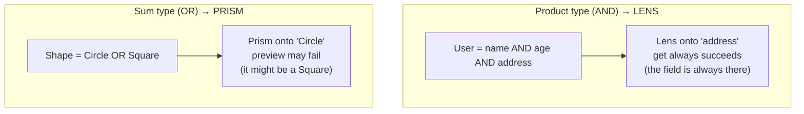

# Optics: Lenses & Prisms (Junior Level)

> **Roadmap:** [Functional Programming](../README.md) → Optics: Lenses & Prisms
>
> *An optic is a **first-class, reusable "pointer" into a piece of a data structure** — one value that knows both how to **read** that piece and how to **update** it, without mutating the original. A **lens** points at a part that is always there (a field). A **prism** points at a case that might be there (one variant of a choice). Together they kill the tower of nested copies you write to change `user.address.city` in immutable code.*

---

## Table of Contents

1. [Introduction: The Nested-Update Pain](#introduction-the-nested-update-pain)
2. [Prerequisites](#prerequisites)
3. [Glossary](#glossary)
4. [The Pain, Concretely](#the-pain-concretely)
5. [A Lens: A Pointer That Reads *and* Writes](#a-lens-a-pointer-that-reads-and-writes)
6. [Composing Lenses to Go Deep](#composing-lenses-to-go-deep)
7. [A Prism: A Pointer at a *Maybe-There* Case](#a-prism-a-pointer-at-a-maybe-there-case)
8. [Lens vs Prism: The One Mental Model](#lens-vs-prism-the-one-mental-model)
9. [A Traversal: A Pointer at *Many* Things](#a-traversal-a-pointer-at-many-things)
10. [The Language Reality (Briefly)](#the-language-reality-briefly)
11. [Common Mistakes](#common-mistakes)
12. [Test Yourself](#test-yourself)
13. [Cheat Sheet](#cheat-sheet)
14. [Summary](#summary)
15. [Further Reading](#further-reading)
16. [Related Topics](#related-topics)

---

## Introduction: The Nested-Update Pain

You have a `user`. Inside it is an `address`. Inside that is a `city`. Your task: *change the city.* In a world where you are not allowed to mutate (because the data is shared, or frozen, or you want [immutability](../03-immutability/junior.md) for safety), you cannot just write `user.address.city = "Berlin"`. You must build a **new** `user` that is identical to the old one *except* for the city — which means a new `address` too, which means copying every other field at every level along the way.

That copying gets ugly fast. Three levels deep and you have a small pyramid of spread-and-copy. Ten fields per level and you are repeating field names everywhere just to say "keep this the same." Miss one field and you have a silent bug.

> **The whole idea of optics:** package "how to reach this piece" into a **single reusable value** — an *optic* — that knows how to read it *and* how to produce an updated copy. Build it once, use it everywhere. Compose two of them to reach twice as deep. The nested-copy tower disappears.

There are a few kinds of optic, but at this level you only need three, and they line up with three plain-English questions:

| Optic | Points at | The question it answers |
|---|---|---|
| **Lens** | a part that **always** exists (a field of a record) | *"Where is this **field**?"* |
| **Prism** | a case that **may** exist (one variant of a choice) | *"Is it **this** case, and if so where's the value?"* |
| **Traversal** | **zero-or-more** matching parts (every item in a list) | *"Where are **all** of these?"* |

That is the map for this whole file. A lens is for fields; a prism is for choices; a traversal is for many. Everything else is detail.

---

## Prerequisites

- **Required:** You can read functions in at least one language (examples use Python, JavaScript, Haskell, and Go).
- **Required:** You understand [Immutability](../03-immutability/junior.md) — *why* we copy instead of mutate. Optics exist to make that copying painless. If "don't mutate shared state" is news to you, read that first.
- **Required:** You've used `map` on a list (see [Map / Filter / Reduce](../04-map-filter-reduce/junior.md)). A traversal is "map, but into a nested structure."
- **Helpful:** A feel for [Algebraic Data Types](../06-algebraic-data-types/junior.md) — a **record/product** ("a name *and* an age *and* an address") versus a **union/sum** ("a circle *or* a square"). This product-vs-sum split is *exactly* the lens-vs-prism split, and seeing it makes optics click.
- **Helpful:** You've felt the pain of `{...user, address: {...user.address, city: "Berlin"}}`. That's the disease; optics are the cure.

---

## Glossary

| Term | Plain-English meaning |
|------|----------------------|
| **Optic** | A first-class, reusable value that knows how to *focus on* a piece of a structure — to read it and to make an updated copy. Umbrella term for lens, prism, traversal, and friends. |
| **Focus / target** | The piece the optic points at (the `city`, the `Some` value, every list element). |
| **Whole / structure** | The big thing the optic reaches *into* (the `user`). |
| **Lens** | An optic for a part that **always exists** — a field of a record. Has `get` and `set`. |
| **Prism** | An optic for a case that **may exist** — one variant of a union/sum. Has `preview` (try to read) and `review` (build from). |
| **Traversal** | An optic for **zero-or-more** targets — every element of a list, every matching node. |
| **`get` / `view`** | Read the focus out of the whole. (Lens only; always succeeds.) |
| **`set`** | Produce a **new** whole with the focus replaced by a given value. The original is untouched. |
| **`over` / `modify`** | Produce a new whole with a **function applied** to the focus (e.g. uppercase the city). `set` is `over` with a constant function. |
| **`preview`** | Try to read a prism's focus; returns "found a value" or "nope, wrong case." |
| **`review`** | Run a prism *backwards*: build a whole from just the focus value. |
| **Compose** | Glue two optics into one that reaches deeper: `userAddress` then `addressCity` → `userCity`. |

---

## The Pain, Concretely

Let's feel the disease before prescribing the cure. We have a config: a `user`, with an `address`, with a `city`. We want to change the city, immutably.

```python
# Python — the manual nested copy. dataclasses are immutable here (frozen=True).
from dataclasses import dataclass, replace

@dataclass(frozen=True)
class Address: street: str; city: str; zip: str
@dataclass(frozen=True)
class User:    name: str; age: int; address: Address

u = User("Ada", 36, Address("5 Main", "London", "EC1"))

# Change the city. We must rebuild address, then rebuild user.
# `replace` copies all OTHER fields for us — without it this is even worse.
u2 = replace(u, address=replace(u.address, city="Berlin"))
#            └── rebuild user ──┘        └── rebuild address ──┘
```

Python's `replace` is already a kindness — it copies the untouched fields automatically. In a language without it, you spell out *every* field just to keep it the same:

```javascript
// JavaScript — the spread tower. Every level copied by hand.
const u = { name: "Ada", age: 36, address: { street: "5 Main", city: "London", zip: "EC1" } };

const u2 = {
  ...u,                       // keep name, age
  address: {
    ...u.address,             // keep street, zip
    city: "Berlin",           // ← the ONE thing we actually wanted to change
  },
};
```

```go
// Go — no spread, no replace. You copy each struct by value and overwrite one field.
type Address struct{ Street, City, Zip string }
type User struct{ Name string; Age int; Address Address }

u := User{"Ada", 36, Address{"5 Main", "London", "EC1"}}

newAddr := u.Address          // value copy of the whole address struct
newAddr.City = "Berlin"
u2 := u                       // value copy of the whole user struct
u2.Address = newAddr          // graft the new address on
```

Look at how much code surrounds the *one* line that matters (`city: "Berlin"`). And this is only three levels deep with a happy structure. Now imagine the city is inside the address inside the *billing* info inside the *account* inside the user — and that you do this kind of update in fifty places. The "keep everything else the same" boilerplate is the enemy. **Optics name and package "reach the city" so you never write that tower again.**

---

## A Lens: A Pointer That Reads *and* Writes

A **lens** is a reusable value that focuses on *one part that always exists*. The part is a field of a record — a `city`, a `name`, an `age`. A lens bundles two abilities:

- **`get`** — pull the focus out of the whole. `cityLens.get(address)` → `"London"`.
- **`set`** — put a new focus into the whole, returning a **new** whole. `cityLens.set("Berlin", address)` → a new address with city `"Berlin"`, original untouched.

From those two you also get **`over`** (a.k.a. `modify`): apply a *function* to the focus. `cityLens.over(str.upper, address)` → address with city `"LONDON"`. (`set(x)` is just `over(_ -> x)`.)

Here is a tiny hand-rolled lens so you can see there is no magic — a lens is *literally a pair of functions* travelling together:

```python
# Python — a lens, built by hand. It's just (getter, setter) packaged with `over`.
from dataclasses import dataclass, replace
from typing import Callable, Generic, TypeVar
S = TypeVar("S"); A = TypeVar("A")

@dataclass(frozen=True)
class Lens(Generic[S, A]):
    get: Callable[[S], A]                 # read the focus out of the whole
    set: Callable[[A, S], S]              # put a new focus in, return a NEW whole
    def over(self, f, s):                 # apply a function to the focus
        return self.set(f(self.get(s)), s)

# A lens onto Address.city — note it knows how to make a fresh copy on set.
city = Lens(
    get=lambda a: a.city,
    set=lambda new, a: replace(a, city=new),
)

addr = Address("5 Main", "London", "EC1")
city.get(addr)                 # "London"
city.set("Berlin", addr)       # Address(..., city="Berlin")  — addr unchanged
city.over(str.upper, addr)     # Address(..., city="LONDON")  — addr unchanged
```

The lens didn't do anything you couldn't do by hand. The point is that "reach the city, read or update it, copy everything else" is now **one named value** you can pass around, store, and — crucially — *compose*.

> **Mental model:** a lens is a labeled cable into a box. One end reads the value at the focus; the other end lets you drop in a new value and get back a freshly-sealed box. The box is never cut open and re-taped (no mutation) — a brand-new box comes out.

---

## Composing Lenses to Go Deep

Here is where lenses earn their keep. A lens onto `user.address` and a lens onto `address.city` **compose** into a single lens onto `user.address.city`. The composed lens reads two levels deep and, on update, rebuilds *both* levels for you — the entire copy tower, handled.

```python
# Python — composing two lenses into one deep lens. No nested replace() at the call site.
def compose(outer: Lens, inner: Lens) -> Lens:
    return Lens(
        get=lambda s: inner.get(outer.get(s)),                       # dig down twice
        set=lambda new, s: outer.set(inner.set(new, outer.get(s)), s),  # rebuild both levels
    )

address = Lens(get=lambda u: u.address,
               set=lambda new, u: replace(u, address=new))

# Compose: user -> address -> city, as ONE lens.
user_city = compose(address, city)

u  = User("Ada", 36, Address("5 Main", "London", "EC1"))
user_city.get(u)                 # "London"
user_city.set("Berlin", u)       # brand-new User, city changed, everything else copied
user_city.over(str.upper, u)     # city -> "LONDON", immutably
```

Compare that `user_city.set("Berlin", u)` against the spread/`replace` tower from earlier. The tower is *gone* — it now lives inside `compose`, written once. Reaching ten levels deep is `compose(compose(compose(...)))`; the call site stays one clean line. **This composability is the entire reason optics exist.** A getter alone composes; a setter alone composes; but only a *lens* — which carries both — composes while *also* rebuilding the copy tower automatically.

In real libraries the composition is even prettier — often just an operator or a chain:

```haskell
-- Haskell (the `lens` library) — `.` composes optics; it reads left-to-right as a path.
-- `^.` is "view/get"; `.~` is "set"; `%~` is "over/modify".
view  (address . city)            u   -- "London"          (get, two levels deep)
set   (address . city) "Berlin"   u   -- new User          (set)
over  (address . city) toUpper    u   -- city uppercased   (modify)
-- Operator forms read like a sentence:
u ^.  address . city                  -- "London"
u &   address . city .~ "Berlin"      -- set
```

```typescript
// TypeScript (monocle-ts) — composeLens builds the deep optic; calls stay flat.
import { Lens } from "monocle-ts";
const address = Lens.fromProp<User>()("address");
const city    = Lens.fromProp<Address>()("city");
const userCity = address.composeLens(city);     // one deep lens

userCity.get(u);                 // "London"
userCity.set("Berlin")(u);       // new User, immutably
userCity.modify(s => s.toUpperCase())(u);  // "over"
```

The library spellings differ, but it is the *same* idea every time: a lens for each hop, composed into one optic that handles the whole path.

---

## A Prism: A Pointer at a *Maybe-There* Case

A lens assumes the focus is **always there**. But some structures are a *choice*: a value is *either* a circle *or* a square; a JSON node is *either* a string *or* a number; an `Optional` is *either* `Some(x)` *or* `None`. You can't `get` "the circle" out of a shape that might be a square — there's nothing to get. The focus is **conditional**.

That is exactly what a **prism** is for. A prism focuses on **one case of a sum type** — and reading it can *fail* (the wrong case is present). It has two abilities, mirror images of each other:

- **`preview`** — *try* to read the focus. Returns "here's the value" if the right case is present, or "nope" otherwise. (Think: `Optional`-returning getter.)
- **`review`** — run the prism **backwards**: build a whole *from* a focus value. Given a number, build the "it's a number" case.

```python
# Python — a prism onto the "Some" case of an Optional-like value, by hand.
from dataclasses import dataclass
from typing import Callable, Generic, Optional, TypeVar
S = TypeVar("S"); A = TypeVar("A")

@dataclass(frozen=True)
class Prism(Generic[S, A]):
    preview: Callable[[S], Optional[A]]   # try to read: returns the value or None
    review:  Callable[[A], S]             # build the whole from just the focus
    def over(self, f, s):                 # modify IF the case matches, else leave as-is
        a = self.preview(s)
        return self.review(f(a)) if a is not None else s

# Prism for "this string parses as an int." preview may FAIL (returns None).
def to_int(s: str) -> Optional[int]:
    try:    return int(s)
    except ValueError: return None

parse_int = Prism(preview=to_int, review=str)   # review: int -> its string form

parse_int.preview("42")        # 42      — matched
parse_int.preview("hello")     # None    — didn't match, NO crash
parse_int.review(99)           # "99"    — backwards: build the string from the int
parse_int.over(lambda n: n + 1, "42")   # "43"  — modified the parsed value, immutably
parse_int.over(lambda n: n + 1, "hi")   # "hi"  — wrong case, left untouched
```

Two things to notice. First, **`preview` can fail** — that partiality is the whole difference from a lens (whose `get` always succeeds). Second, **`review` lets you go backwards** — a prism is reversible in a way a lens is not, because constructing "the Some case" from a value is meaningful, whereas "construct a whole User from just a city" is not.

Prisms shine for *parsing*, *validation*, and *picking one variant out of a union*: "if this node is a number, +1 it; otherwise leave it." And the headline feature: **prisms compose with lenses.** A lens into a field, then a prism into that field's variant, then a lens into *that* variant's field — all one optic.

```haskell
-- Haskell — `_Just` is the prism onto an Optional's value. `^?` is preview, `_Right` etc. exist too.
preview _Just (Just 5)     -- Just 5    (matched: returns Maybe)
preview _Just Nothing      -- Nothing   (wrong case)
review  _Just 5            -- Just 5    (backwards: build the Just)
-- Compose a lens then a prism: focus on user.account, THEN only if it's the Premium case:
over (account . _Premium . discount) (+5) user   -- bump discount, only for Premium accounts
```

---

## Lens vs Prism: The One Mental Model

If you remember one thing from this file, remember this. It maps perfectly onto [algebraic data types](../06-algebraic-data-types/junior.md):

> **A lens is for a *product* (`AND`). A prism is for a *sum* (`OR`).**

- A **product type** is "this **and** that **and** the other" — a record with fields, all present at once. A `User` is a name **and** an age **and** an address. To focus on *one field of an always-present bundle*, you use a **lens**. Reading always succeeds, because the field is always there.

- A **sum type** is "this **or** that" — a choice of exactly one variant. A `Shape` is a circle **or** a square. An `Optional` is `Some` **or** `None`. To focus on *one possible case of a choice*, you use a **prism**. Reading may fail, because the value might be the *other* case.



That's the duality, and it's not a coincidence — it falls straight out of the structure of the data. **Field of a record → lens. Case of a union → prism.** Everything else about optics is built on this one split. When you stare at a piece of nested data and ask "lens or prism here?", the answer is just "is this layer an AND or an OR?"

---

## A Traversal: A Pointer at *Many* Things

A lens focuses on *one* always-present thing. A prism on *one* maybe-present thing. A **traversal** generalizes both to **zero-or-more**: every element of a list, every value in a map, every matching node in a tree. It's the optic version of `map` — but a `map` that can reach into a *nested* structure and update all the leaves immutably.

```python
# Python — a traversal over "every element of a list" via `over`.
# (A real library packages this; here's the idea.)
def each_over(f, xs):           # the list traversal's `over`: map f across all elements
    return [f(x) for x in xs]

each_over(str.upper, ["london", "paris"])     # ["LONDON", "PARIS"]

# The payoff: COMPOSE a lens with a traversal to update a deep collection.
# "Uppercase the city of EVERY user in a team" — one expression, immutably.
@dataclass(frozen=True)
class Team: members: list   # list[User]

def upper_all_cities(team: Team) -> Team:
    new_members = each_over(lambda u: user_city.over(str.upper, u), team.members)
    return replace(team, members=new_members)
```

```haskell
-- Haskell — `traverse`/`each`/`mapped` are traversals; they compose with lenses.
-- "Uppercase the city of every member" reads as one path:
over (members . traverse . address . city) toUpper team
--    ^list^    ^each elem^  ^lens^   ^lens^
```

The magic is the last line: **`members . traverse . address . city`** is a *lens ∘ traversal ∘ lens ∘ lens*, composed into a single optic that reaches every member's city and uppercases them all, immutably, in one shot. This is the real power of optics — a lens, a prism, and a traversal **all compose with each other** into one expression that describes a path through arbitrarily nested, branching, repeating data. (The composed optic is as "weak" as its weakest part — compose a lens with a traversal and you get a traversal, because "many" wins over "exactly one." More on that in [`middle.md`](middle.md).)

---

## The Language Reality (Briefly)

You will not write optics from scratch in production — you'll use a library, *or* you'll use a different tool that solves the same pain. Here's the lay of the land at a junior glance:

| Language | What you'd actually use |
|---|---|
| **Haskell** | The `lens` library (Edward Kmett's — powerful, big) or the friendlier `optics` library. This is optics' true home. |
| **Scala** | **Monocle** — lenses, prisms, traversals as a first-class library. |
| **TypeScript/JS** | **monocle-ts** / **optics-ts**; or **Ramda** lenses for the simple cases. |
| **Kotlin** | **Arrow Optics** (often with a compiler plugin that *generates* the lenses for you). |
| **Clojure** | **Specter** — a very practical "navigate and transform nested data" library. |
| **JavaScript (the pragmatic non-optic answer)** | **Immer** — you write code that *looks* like mutation on a "draft," and Immer produces the immutable copy for you. No optics vocabulary needed. |
| **Go** | No optics, no real library culture for it — you write the manual nested copies (as shown above). |

> **The honest junior takeaway:** optics are a beautiful, composable solution to nested immutable updates — but they are *one* solution. In a JavaScript app, **Immer** ("just mutate a draft, I'll handle the copy") is often the pragmatic winner and needs zero new concepts. In Go, you copy by hand. Optics pay off most when your nesting is *deep* and you update it in *many places*, in a language with a good optics library. For a shallow one-off update, a plain spread/`replace` is perfectly fine — don't reach for a lens to change one top-level field.

---

## Common Mistakes

1. **Reaching for a lens onto something that might not be there.** A field that's always present → lens. A *case* that might be absent (`Some`/`None`, one variant of a union, a parse that can fail) → **prism**. Using a lens where you need a prism means assuming a focus exists when it might not.
2. **Forgetting that `set`/`over` return a *new* whole.** Optics never mutate. `lens.set("Berlin", user)` does **not** change `user` — it *returns* a new user. If you ignore the return value, nothing happens. (This trips up people used to `user.city = ...`.)
3. **Hand-writing the nested copy when a composed optic would do.** The whole point is `compose(a, b).set(...)` instead of the spread tower. If you find yourself typing `{...x, y: {...x.y, z: ...}}`, that's an optic-shaped pain.
4. **Over-wrapping in `Optional` instead of using a prism.** A prism *is* the principled "maybe this case" focus. Don't reach for an extra `Optional<Optional<...>>`; that's a prism's job.
5. **Using optics for a one-field, top-level, one-time update.** `{...user, name: "Bo"}` is fine. A lens here is ceremony. Optics earn their keep with *depth* and *repetition*, not shallow one-offs.
6. **Confusing `map` (functor) with a traversal.** They're cousins — a traversal *is* "map into a nested structure" — but a plain `map` over a flat list doesn't need optics. Reach for a traversal when the "many" is *buried* inside other layers you also need to compose through.

---

## Test Yourself

1. In one sentence each: what does a **lens** focus on, and what does a **prism** focus on?
2. Fill in the duality: a lens is for a ___ type (AND); a prism is for a ___ type (OR).
3. You have `user.address.city` and want to change the city immutably, in many places in your code. Why is a *composed lens* better than writing the spread/`replace` tower at each call site?
4. Which optic operation can **fail to find a value**: a lens's `get`, or a prism's `preview`? Why?
5. What does `over` (a.k.a. `modify`) do that `set` doesn't — and how is `set` a special case of `over`?
6. You want to uppercase the `city` of **every** user in a list. Which optic do you compose into the path to express "every element," and what is that kind of optic called?
7. In a JavaScript codebase that doesn't use optics, name the popular library that solves the same nested-immutable-update pain by letting you "mutate a draft."

<details>
<summary>Answers</summary>

1. A **lens** focuses on a *part that always exists* — a field of a record (e.g. `address.city`). A **prism** focuses on a *case that may exist* — one variant of a choice/union (e.g. the `Some` of an `Optional`, or "this string parses as an int").
2. A lens is for a **product** type (AND — fields all present together); a prism is for a **sum** type (OR — exactly one of several variants).
3. Because the composed lens packages the entire "reach the city, update it, copy everything else at every level" tower into **one reusable value**, written once. Every call site becomes one clean line (`userCity.set("Berlin", u)`) instead of a hand-written, error-prone nest — and if the structure changes, you fix it in one place, not fifty.
4. A **prism's `preview`** can fail (returns "found"/"not found"), because the value might be the *other* case of the sum — there may be nothing of the focused case present. A **lens's `get`** always succeeds, because a lens focuses on a field that is always there.
5. `over` applies a *function* to the focus (e.g. uppercase the city), whereas `set` replaces it with a fixed value. `set(x)` is just `over` with the constant function `_ -> x` — it ignores the old value and returns `x`.
6. You compose a **traversal** into the path (e.g. `members . traverse . address . city`). A traversal is the optic that focuses on **zero-or-more** targets — every element of a collection.
7. **Immer** — you write code that looks like mutation on a "draft" object, and Immer produces the immutable copy for you.

</details>

---

## Cheat Sheet

| Optic | Focuses on | Always succeeds? | Key ops | Data shape it suits |
|---|---|---|---|---|
| **Lens** | one **always-present** part (a field) | yes (`get` total) | `get`, `set`, `over` | **product** (AND / record) |
| **Prism** | one **maybe-present** case (a variant) | no (`preview` may fail) | `preview`, `review`, `over` | **sum** (OR / union) |
| **Traversal** | **zero-or-more** parts (every element) | n/a (acts on all) | `over` (map across all) | collections / nested many |

| Operation | What it does | Mutates original? |
|---|---|---|
| `get` / `view` | read the focus (lens) | no |
| `preview` | *try* to read the focus (prism) — may return "nothing" | no |
| `set` | return a **new** whole with the focus replaced | **no** (returns a copy) |
| `over` / `modify` | return a **new** whole with a *function* applied to the focus | **no** (returns a copy) |
| `review` | build a whole *from* a focus (prism, run backwards) | n/a |
| compose (`.`) | glue two optics into one deeper optic | n/a |

> **The two rules to leave with:** ① **field → lens, case → prism, many → traversal.** ② **Optics never mutate — `set`/`over` always return a new whole; the original is untouched.**

---

## Summary

- **The pain:** changing a deeply nested field *immutably* forces a tower of copy-everything-else-the-same boilerplate (`{...x, y: {...x.y, z: ...}}`). Optics make that tower disappear.
- **An optic** is a first-class, reusable value that knows how to *focus on* a piece of a structure — read it **and** produce an updated copy — and that **composes** with other optics to reach deeper.
- **A lens** focuses on a part that **always exists** (a field of a record). It has `get`, `set`, and `over`. It's for **product** types (AND).
- **A prism** focuses on a case that **may exist** (one variant of a union — `Some`, a parse result, one shape). It has `preview` (which can *fail*) and `review` (run backwards). It's for **sum** types (OR). Partiality is the difference from a lens.
- **The one mental model:** **lens = product (AND), prism = sum (OR)** — straight out of [algebraic data types](../06-algebraic-data-types/junior.md). Field of a record → lens; case of a choice → prism.
- **A traversal** focuses on **zero-or-more** targets (every element) — the optic version of `map`. Lenses, prisms, and traversals **all compose into one optic** describing a path through nested, branching, repeating data.
- **Language reality:** Haskell `lens`/`optics`, Scala Monocle, TS monocle-ts, Kotlin Arrow Optics, Clojure Specter — and the pragmatic JS alternative **Immer** ("mutate a draft"). Go has no optics; you copy by hand. Reach for optics when nesting is *deep* and updated in *many places*; for shallow one-offs, a plain spread is fine.
- Next: [`middle.md`](middle.md) — the lens laws, the full optic family, and the trade-offs of each.

---

## Further Reading

- **"Lenses in Pictures"** and Edward Kmett's `lens` library docs — the canonical home; skim the diagrams even if the Haskell is dense.
- **Monocle (Scala) documentation** — the clearest *practical* introduction to lenses, prisms, and traversals with runnable examples.
- **Immer documentation** (immerjs.github.io) — the pragmatic non-optic answer in JS; read it to understand the alternative optics compete with.
- **Specter (Clojure) README** — "navigate and transform nested data" framed for working programmers, light on theory.
- **"A Little Lens Starter Tutorial"** — School of Haskell — gentle, example-first, builds the intuition this file rests on.

---

## Related Topics

- [Immutability](../03-immutability/junior.md) — the core motivation: optics exist to make immutable nested updates painless.
- [Algebraic Data Types](../06-algebraic-data-types/junior.md) — product vs sum *is* the lens vs prism duality; read this to make optics click.
- [Composition](../05-composition/junior.md) — composing optics is the same idea as composing functions; it's why optics scale to deep structures.
- [Map / Filter / Reduce](../04-map-filter-reduce/junior.md) — a traversal generalizes `map` to reach into nested structures.
- **Functors & Applicatives** (sibling topic `13-functors-and-applicatives`) — the machinery underneath how real optic libraries encode lenses; the deeper "why" arrives at the senior level.
