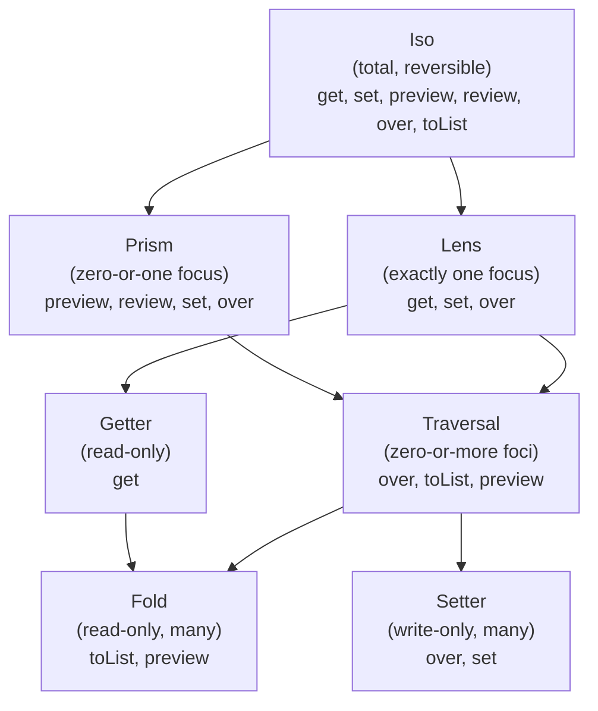

# Optics: Lenses & Prisms (Middle Level)

> **Roadmap:** [Functional Programming](../README.md) → Optics: Lenses & Prisms
>
> *An optic is a composable, first-class focus into a data structure that bundles reading and immutable updating. At this level you learn the **mechanics** — how `get`/`set`/`over` actually work, the **laws** that make a lens trustworthy, the **full family** (lens, prism, iso, traversal, fold, getter, setter), and the **rule that governs how they compose** — so you can pick the right optic and predict what a composed one does.*

---

## Table of Contents

1. [Recap and Framing](#recap-and-framing)
2. [The Lens, Mechanically](#the-lens-mechanically)
3. [The Lens Laws (Informally)](#the-lens-laws-informally)
4. [The Prism, Mechanically](#the-prism-mechanically)
5. [Iso: The Lossless, Reversible Optic](#iso-the-lossless-reversible-optic)
6. [Traversal: Zero-or-More Foci](#traversal-zero-or-more-foci)
7. [The Optic Hierarchy and How Composition Degrades](#the-optic-hierarchy-and-how-composition-degrades)
8. [A Running Example: An Editor Document](#a-running-example-an-editor-document)
9. [Trade-offs: When Optics Help and When They Hurt](#trade-offs-when-optics-help-and-when-they-hurt)
10. [Common Mistakes](#common-mistakes)
11. [Test Yourself](#test-yourself)
12. [Cheat Sheet](#cheat-sheet)
13. [Summary](#summary)
14. [Further Reading](#further-reading)
15. [Related Topics](#related-topics)

---

## Recap and Framing

From [`junior.md`](junior.md): an **optic** is a reusable value that focuses on a piece of a structure — reads it and produces an immutable updated copy — and **composes** with other optics to reach deeper. The three you met:

- **Lens** — one always-present part (a field). For **product** types (AND).
- **Prism** — one maybe-present case (a variant). For **sum** types (OR).
- **Traversal** — zero-or-more parts (every element).

This file goes one level into the mechanics. The questions now are: *exactly what functions does each optic hold? What laws must a lens obey to be a real lens (and what bugs you get if it doesn't)? What are the other family members — iso, fold, getter, setter — and where do they sit? And the one that bites everyone: when you compose two different optics, what do you get?*

> **The frame for this file:** an optic is a tiny bundle of functions with *algebraic laws*, and the family forms a *hierarchy* where composition always yields the **weaker** of the two optics. Master that hierarchy and you can read any `a . b . c` optic path and know precisely what it can and can't do.

---

## The Lens, Mechanically

A lens onto a focus of type `A` inside a whole of type `S` is, at its simplest, **two functions packaged together**:

```
get :: S -> A                 -- read the focus out of the whole
set :: A -> S -> S            -- put a new focus in, return a new whole
```

From those two, everything else is derived. `over` (a.k.a. `modify`) reads, transforms, writes:

```
over :: (A -> A) -> S -> S
over f s = set (f (get s)) s   -- get, apply f, set the result back
set  a s = over (const a) s    -- set is "over with a function that ignores the old value"
```

Here's a complete, minimal lens type in three languages so you can see it is genuinely just `(get, set)`:

```python
# Python — a Lens is literally a getter + a setter; over/set are derived.
from dataclasses import dataclass, replace
from typing import Callable, Generic, TypeVar
S = TypeVar("S"); A = TypeVar("A")

@dataclass(frozen=True)
class Lens(Generic[S, A]):
    get: Callable[[S], A]
    set: Callable[[A, S], S]
    def over(self, f: Callable[[A], A], s: S) -> S:
        return self.set(f(self.get(s)), s)
    def then(self, inner: "Lens") -> "Lens":          # composition: self . inner
        return Lens(
            get=lambda s: inner.get(self.get(s)),
            set=lambda a, s: self.set(inner.set(a, self.get(s)), s),
        )

def lens_for(field: str) -> Lens:                     # build a field lens generically
    return Lens(get=lambda s: getattr(s, field),
                set=lambda a, s: replace(s, **{field: a}))
```

```typescript
// TypeScript — same shape, structurally typed. `compose` chains two lenses.
interface Lens<S, A> {
  get: (s: S) => A;
  set: (a: A, s: S) => S;
}
const over = <S, A>(l: Lens<S, A>, f: (a: A) => A, s: S): S => l.set(f(l.get(s)), s);

const compose = <S, A, B>(o: Lens<S, A>, i: Lens<A, B>): Lens<S, B> => ({
  get: (s) => i.get(o.get(s)),
  set: (b, s) => o.set(i.set(b, o.get(s)), s),    // rebuild both levels immutably
});

const prop = <S, K extends keyof S>(k: K): Lens<S, S[K]> => ({
  get: (s) => s[k],
  set: (a, s) => ({ ...s, [k]: a }),
});
```

```haskell
-- Haskell — the "naive" lens as a record of get + set. (The REAL `lens` library
-- uses a cleverer single-function encoding — see senior.md — but this is the model.)
data Lens s a = Lens { getL :: s -> a, setL :: a -> s -> s }

over :: Lens s a -> (a -> a) -> s -> s
over l f s = setL l (f (getL l s)) s

compose :: Lens s a -> Lens a b -> Lens s b
compose o i = Lens (getL i . getL o)
                   (\b s -> setL o (setL i b (getL o s)) s)
```

Notice the `compose`/`then` in all three: to `get` through a composed lens you dig down twice; to `set` you rebuild the inner whole, then rebuild the outer whole around it. That rebuilding *is* the copy tower from the junior file — now written **once**, inside `compose`, and free at every call site.

---

## The Lens Laws (Informally)

A pair of functions called "get" and "set" isn't automatically a *good* lens. To be trustworthy — to behave like a real "pointer at a field" and to compose predictably — a lens must satisfy three **lens laws**. They're common sense once you read them, but violating them produces baffling bugs.

**1. Get-Put (a.k.a. "set what you got changes nothing").**
> If you `get` the focus and immediately `set` it back, the whole is unchanged.
```
set (get s) s  ==  s
```
*Why it matters:* a lens that fails this is "leaky" — reading and writing back the same value mutates something on the side. Refactors like "read it, maybe change it, write it back" stop being safe.

**2. Put-Get (a.k.a. "you get back what you put").**
> If you `set` a value and then `get`, you read back exactly what you set.
```
get (set a s)  ==  a
```
*Why it matters:* this is the lens being *honest*. If you set the city to `"Berlin"` and read it back as `"BERLIN"` (because the setter secretly uppercased), the lens lied — and any `over` built on top of it is wrong.

**3. Put-Put (a.k.a. "the last set wins").**
> Setting twice is the same as setting once with the second value; the first set is overwritten cleanly.
```
set a2 (set a1 s)  ==  set a2 s
```
*Why it matters:* the focus is a single, well-defined slot. A lens failing this has *memory* of intermediate writes — a sign it's touching more than the one focus.

```python
# Python — the three laws as runnable property checks (the shape of a real test).
def lens_laws_hold(lens, s, a1, a2) -> bool:
    get_put = lens.set(lens.get(s), s) == s                 # 1. get-put
    put_get = lens.get(lens.set(a1, s)) == a1               # 2. put-get
    put_put = lens.set(a2, lens.set(a1, s)) == lens.set(a2, s)  # 3. put-put
    return get_put and put_get and put_put
```

> **The practical reading:** a lens obeying these three laws behaves *exactly* like a labeled mutable field — except immutably. The laws are what let you reason "`over f` = read, apply `f`, write back" and trust it; what let you compose lenses and trust the result; and what a property-based test should verify for any custom lens you write (see [property-based-testing] in the skills set). A "lens" that breaks a law is a footgun: it looks like a field accessor but has side behavior, and refactors silently change meaning.

A classic law-breaker: a lens onto "the city, normalized to title-case." Its setter title-cases the input. That breaks **put-get** (`set "berlin"` then `get` returns `"Berlin"`, not `"berlin"`). The fix is to *not* hide normalization in a lens — put it in the `over` function or a separate validation step, and keep the lens a pure, honest field accessor.

---

## The Prism, Mechanically

A prism focuses on **one case of a sum type**, and reading it can fail. Its two functions are mirror images:

```
preview :: S -> Maybe A      -- try to read the focus; Nothing if the wrong case
review  :: A -> S            -- build the whole FROM the focus (run backwards)
```

Where a lens splits a product (`S` = `A` *and* "the rest"), a prism splits a sum (`S` = `A` *or* "the other cases"). `over` for a prism is "modify *if* the case matches, otherwise leave the whole alone":

```
over :: (A -> A) -> S -> S
over f s = case preview s of
             Just a  -> review (f a)    -- right case: transform and rebuild
             Nothing -> s               -- wrong case: untouched
```

```python
# Python — a Prism: preview (may fail) + review (backwards). over is conditional.
from dataclasses import dataclass
from typing import Callable, Generic, Optional, TypeVar
S = TypeVar("S"); A = TypeVar("A")

@dataclass(frozen=True)
class Prism(Generic[S, A]):
    preview: Callable[[S], Optional[A]]
    review:  Callable[[A], S]
    def over(self, f, s):
        a = self.preview(s)
        return self.review(f(a)) if a is not None else s

# Example: prism onto the "Circle" case of a Shape sum type.
@dataclass(frozen=True)
class Circle: radius: float
@dataclass(frozen=True)
class Square: side: float
Shape = Circle | Square

circle = Prism(
    preview=lambda sh: sh if isinstance(sh, Circle) else None,
    review=lambda c: c,                                  # a Circle IS already a Shape
)

circle.preview(Circle(2.0))    # Circle(2.0)   matched
circle.preview(Square(3.0))    # None          wrong case
circle.over(lambda c: Circle(c.radius * 2), Circle(2.0))   # Circle(4.0)
circle.over(lambda c: Circle(c.radius * 2), Square(3.0))   # Square(3.0) unchanged
```

### Prism laws (informally)

Prisms have their own two laws, dual to the lens laws:

**1. Review-Preview ("build then read gets it back").**
```
preview (review a)  ==  Just a
```
If you `review` a value into the whole and then `preview`, you get exactly that value back. Building the case and then matching it must round-trip.

**2. Preview-Review ("read then build reconstructs the whole").**
```
preview s == Just a   ⟹   review a == s
```
If a `preview` succeeds with `a`, then `review a` rebuilds the original whole. The prism doesn't lose information about *which* case it was.

Together these say a prism is a *faithful, reversible* focus onto one variant: building and matching are honest inverses on the case they target. This is why prisms are perfect for parsing/serialization pairs (`parse`/`print`), `Some`/`None`, and "pick one constructor of a union."

```haskell
-- Haskell — `prism'` builds a prism from (review, preview). _Just, _Left, _Right are built-in.
-- A prism onto "string that parses as an int":
import Text.Read (readMaybe)
_Int :: Prism' String Int
_Int = prism' show readMaybe        -- review = show, preview = readMaybe
-- ^? is preview, # is review:
"42"  ^? _Int      -- Just 42
"hi"  ^? _Int      -- Nothing
99    #  _Int      -- "99"   (review: build the string)
```

---

## Iso: The Lossless, Reversible Optic

An **iso** (isomorphism) is the strongest, simplest optic: a *lossless, two-way conversion* between two types that hold the **same information** in different shapes. It's a pair of total inverses:

```
to   :: S -> A          -- convert there
from :: A -> S          -- convert back, losslessly
```

with the laws `from (to s) == s` and `to (from a) == a`. Examples: Celsius ↔ Fahrenheit (via a formula), a `Temperature` newtype ↔ its underlying `Double`, a tuple `(a, b)` ↔ a 2-field record, a string ↔ its list of characters.

```typescript
// TypeScript — an Iso between Celsius and Fahrenheit (lossless both ways).
interface Iso<S, A> { to: (s: S) => A; from: (a: A) => S; }

const celsiusFahrenheit: Iso<number, number> = {
  to:   (c) => c * 9 / 5 + 32,
  from: (f) => (f - 32) * 5 / 9,
};
// An Iso IS both a lens (get=to, set=ignore-old-and-from) and a prism (preview=Just∘to).
// That's why it sits at the top of the hierarchy — it can be USED as either.
```

Why iso matters at this level: it sits at the **top of the optic hierarchy**. Because an iso is total and reversible, it can be *used as* a lens (its `get` is `to`, always succeeds) *and* as a prism (its `preview` always succeeds, its `review` is `from`). Anything you can do with a lens or a prism, you can do with an iso — so composing an iso with anything else just gives you back the other thing. Iso is the identity-ish element of the optic family.

---

## Traversal: Zero-or-More Foci

A **traversal** focuses on **zero-or-more** targets at once: every element of a list, every value in a map, both fields of a pair, every matching node in a tree. It's the optic generalization of `map` — and the unifying generalization of *both* lens (exactly one focus) and prism (zero-or-one focus). Its core operation is `over`, mapping a function across **all** foci:

```
over :: (A -> A) -> S -> S        -- apply f to every focused target
toList :: S -> [A]                -- collect all foci into a list
preview :: S -> Maybe A           -- the FIRST focus, if any (traversal can be "viewed" weakly)
```

```python
# Python — the "each element of a list" traversal. over maps across all; toList collects.
from dataclasses import dataclass
from typing import Callable, Generic, TypeVar
A = TypeVar("A")

@dataclass(frozen=True)
class Traversal(Generic[A]):
    over:    Callable[..., object]      # (A->A) -> S -> S, maps across all foci
    to_list: Callable[..., list]        # S -> [A]

each = Traversal(
    over=lambda f, xs: [f(x) for x in xs],
    to_list=lambda xs: list(xs),
)
each.over(lambda n: n + 1, [1, 2, 3])   # [2, 3, 4]   — immutable map across all
each.to_list([1, 2, 3])                  # [1, 2, 3]   — collect the foci
```

A traversal cannot have a single total `get` — there might be zero foci (an empty list has nothing to read), or many (which one would `get` return?). That's why a traversal supports `over`, `toList`, and a *partial* `preview` (the first focus), but **not** a total `get`. This is the key structural fact behind the hierarchy in the next section.

> **The unification:** a lens is a traversal that always has *exactly one* focus; a prism is a traversal that has *zero or one* focus. Every lens and every prism *is* a traversal — a degenerate one. That's why they all compose: under the hood, they're all "ways to focus on some targets," and the most general such thing is the traversal.

---

## The Optic Hierarchy and How Composition Degrades

This is the section that makes you fluent. The optic family forms a **hierarchy of generality**. Each optic supports a set of operations; a more general optic supports *fewer* operations (because it makes fewer guarantees about its foci). Here's the lattice:



The arrows mean "is a more general / weaker case of." Reading it:

- **Iso** — top. Total and reversible. Usable as anything below it.
- **Lens** — exactly one focus. Total `get`/`set`. (A weakening of iso: you can't run a lens *backwards* to rebuild the whole from just the focus.)
- **Prism** — zero-or-one focus. `preview` (partial read) + `review` (backwards). (Iso's other weakening: reversible, but partial.)
- **Traversal** — zero-or-more foci. `over`/`toList`. The common generalization of lens and prism: drop "exactly one" *and* "reversible," keep "map across all."
- **Getter** — read-only lens (just `get`, no update).
- **Fold** — read-only traversal (just `toList`/`preview` — read many, no update).
- **Setter** — write-only traversal (just `over`/`set` — update many, no read).

### The rule: composition yields the weaker optic

Now the punchline — the single most useful fact about optics:

> **When you compose two optics, the result is the *least upper bound* — the weakest of the two — supporting only the operations they *both* support.**

Concretely:

| Compose this | …with this | You get | Because |
|---|---|---|---|
| Lens | Lens | **Lens** | both total, single focus |
| Lens | Prism | **Traversal** | "one" ∘ "zero-or-one" = "zero-or-one"… but it's spelled Traversal (an *Affine Traversal* / *Optional*, precisely) |
| Prism | Prism | **Prism** | both reversible, zero-or-one |
| Lens | Traversal | **Traversal** | "one" ∘ "many" = "many" |
| Traversal | Lens | **Traversal** | "many" ∘ "one" = "many" |
| Iso | *anything* | *the other thing* | iso adds no weakening |
| Lens | Getter | **Getter** | getter can't write, so the composite can't either |

```haskell
-- Haskell — the composite optic is exactly as powerful as its weakest link.
-- lens . lens  = lens  (can still `set` and `view`):
view (address . city)            u      -- OK: it's a Lens, view works
-- lens . prism = an affine traversal (zero-or-one): you can `preview` and `over`,
-- but you CANNOT `view` (the focus might be absent — the prism case may not match):
preview (account . _Premium . discount) u   -- OK: Maybe Double
-- view    (account . _Premium . discount) u   -- TYPE ERROR: can't `view` through a prism
over    (account . _Premium . discount) (+5) u  -- OK: modify-if-present
```

> **Why this rule is the whole game:** it means you can read any optic path `a . b . c . d`, find the weakest optic in the chain, and immediately know what operations the composite supports. A chain with a prism in it → you can't `view`, only `preview`/`over` (the focus might be absent). A chain with a traversal in it → you can `over` and `toList`, not `get`. **The composite is only as strong as its weakest link** — exactly like a chain. Internalize that and optic types stop surprising you.

(The precise name for "lens ∘ prism" — zero-or-one focus with read *and* write — is an **Affine Traversal** or **Optional** optic; many libraries surface it. At this level, "it's a traversal that happens to hit at most one target" is the right mental model.)

---

## A Running Example: An Editor Document

Let's make it concrete with a realistic nested domain: an editor document. A `Document` has `metadata` and a list of `blocks`. Each `block` is a *sum*: a `Heading`, a `Paragraph`, or an `Image`. We want operations like "uppercase every heading's text" and "set the alt-text of an image block" — immutably.

```python
# Python — the domain. Blocks are a SUM (Heading | Paragraph | Image) → prisms.
# Document/Metadata are PRODUCTS → lenses.
from dataclasses import dataclass, replace

@dataclass(frozen=True)
class Metadata: title: str; author: str
@dataclass(frozen=True)
class Heading:   level: int; text: str
@dataclass(frozen=True)
class Paragraph: text: str
@dataclass(frozen=True)
class Image:     src: str; alt: str
Block = Heading | Paragraph | Image

@dataclass(frozen=True)
class Document: meta: Metadata; blocks: list   # list[Block]
```

The manual immutable version of "uppercase every heading's text" is a nested comprehension with a type check, and "set the title" is a double `replace`. With optics we describe the *paths* once and compose:

```python
# Optics for the document. (Using the Lens/Prism/Traversal types from earlier.)
meta_l   = lens_for("meta")                          # Document -> Metadata   (lens)
title_l  = lens_for("title")                         # Metadata -> str        (lens)
blocks_l = lens_for("blocks")                        # Document -> [Block]     (lens)

heading_p = Prism(                                   # Block -> Heading        (prism)
    preview=lambda b: b if isinstance(b, Heading) else None,
    review=lambda h: h,
)
heading_text_l = lens_for("text")                    # Heading -> str          (lens)

# 1) Set the document title: compose lens . lens = lens (total).
doc_title = meta_l.then(title_l)
doc2 = doc_title.set("New Title", doc)               # one line, immutable, both levels copied

# 2) Uppercase every heading's text: traversal (blocks) . prism (Heading) . lens (text).
#    The composite is a TRAVERSAL (the weakest link is "many"), so we use `over`.
def upper_headings(doc: Document) -> Document:
    def bump(block):
        # prism . lens, over: uppercase text IF it's a Heading, else leave the block.
        return heading_p.over(lambda h: replace(h, text=h.text.upper()), block)
    return blocks_l.set([bump(b) for b in doc.blocks], doc)
```

In a real library this whole second operation collapses to one composed path. Here's the Haskell, where it's a single expression — the clearest demonstration of why optics exist:

```haskell
-- Haskell — the entire "uppercase every heading's text" is ONE composed optic.
-- traverse (blocks) . _Heading (prism) . text (lens) — a Traversal, so `over`:
upperHeadings :: Document -> Document
upperHeadings = over (blocks . traverse . _Heading . text) toUpper
--                     ^lens^   ^trav^     ^prism^    ^lens^
-- Setting the title is a Lens, so `set`:
retitle :: Document -> Document
retitle = set (meta . title) "New Title"
```

```typescript
// TypeScript (monocle-ts flavor) — compose lens/prism/traversal into one optic.
const blocksT  = Lens.fromProp<Document>()("blocks").composeTraversal(fromTraversable(array)<Block>());
const heading  = Prism.fromPredicate<Block>(b => b._tag === "Heading"); // narrow to Heading
const text     = Lens.fromProp<Heading>()("text");
const everyHeadingText = blocksT.composePrism(heading).composeLens(text); // a Traversal
const upperHeadings = (d: Document) => everyHeadingText.modify(s => s.toUpperCase())(d);
```

The lesson lands here: **`blocks . traverse . _Heading . text` is a lens, a traversal, a prism, and a lens composed into ONE optic.** It reaches every heading's text through a list and a sum type, and uppercases them all immutably, in one line. The manual version is a nested loop with a type-check and two layers of copying. *That* is the payoff — and the cost is that a reader must know what `traverse`, `_Heading`, and the composition rule mean.

---

## Trade-offs: When Optics Help and When They Hurt

Optics are not free. Here's the honest middle-level balance sheet.

### They help when…

- **The structure is deeply nested and updated in many places.** The copy tower's cost (boilerplate, bug surface, fragility to schema changes) is paid per call site without optics; with optics it's paid *once* in the optic definition.
- **You need to update *many* targets through *branching* data** (every heading, every premium account's discount). The traversal + composition story has no clean manual equivalent.
- **The same paths are reused.** Define `docTitle` once, use it in twenty places; if the schema moves, fix one optic.
- **The language has a good optics library and a team that reads it.** Haskell, Scala (Monocle), Kotlin (Arrow). The composition operator makes deep updates read like a path.

### They hurt when…

- **The structure is shallow.** `{...user, name: "Bo"}` needs no lens. One or two levels, updated occasionally → a plain spread/`replace` is *clearer* and has zero learning cost.
- **The team doesn't know optics.** An optic path is opaque to someone who hasn't learned the vocabulary; it slows every review and onboarding. The abstraction's value is gated on team fluency (the same lesson as monads — see [`../09-monads-plain-english/senior.md`](../09-monads-plain-english/senior.md)).
- **There's a simpler pragmatic tool.** In JS, **Immer** ("write mutation, get immutability") solves the *same* nested-update pain with *no new concepts* — for many teams it's the better trade. Reaching for monocle-ts when Immer would do is over-engineering.
- **You're in a language without support.** Go has no optics culture; hand-rolling lenses there fights the language. Write the manual copy.

```javascript
// JavaScript — Immer: the pragmatic, non-optic answer to the SAME pain.
// You "mutate" a draft; Immer produces the immutable copy. No optic vocabulary.
import { produce } from "immer";

const doc2 = produce(doc, (draft) => {
  draft.meta.title = "New Title";            // looks like mutation; isn't
  for (const b of draft.blocks)
    if (b.tag === "Heading") b.text = b.text.toUpperCase();
});
// Trade-off vs optics: Immer is dead simple and needs no new concepts, but the
// "path" isn't a reusable first-class value you can compose, pass, or name.
```

> **The middle-level judgment:** optics buy **composability and reuse of update paths**; Immer buys **familiarity and zero new concepts**; manual copies buy **no abstraction at all**. Pick by *depth × repetition × team-fluency × language-support*. Deep, repeated, fluent, supported → optics shine. Shallow, one-off, unfamiliar → don't. This is the same "abstraction is justified by the change-cost it removes" frame you'll formalize at the senior level.

---

## Common Mistakes

1. **Writing a "lens" that breaks put-get.** A setter that normalizes/validates (title-cases, trims, clamps) makes `get (set a s) != a` — the lens lies. Keep lenses honest field accessors; put transformation in the `over` function or a separate step.
2. **Expecting to `view`/`get` through a prism or traversal.** A prism's focus may be absent; a traversal may have zero or many. Neither supports a total `get` — use `preview` (first/maybe) or `toList` (all). The composition rule tells you this in advance.
3. **Misreading what a composed optic supports.** `lens . prism` is *not* a lens — it's an affine traversal, so you can't `view`, only `preview`/`over`. Always find the **weakest link** in the chain.
4. **Hiding side effects in `over`.** `over` should apply a *pure* function to the focus. If your modify function does I/O or mutates, you've broken the immutable, referentially-transparent contract optics rely on.
5. **Reaching for optics on shallow structure.** A lens onto a top-level field you update once is pure ceremony. The break-even is *depth × repetition*.
6. **Double-focusing — `Optional<X>` plus a prism.** A prism already models "maybe this case." Wrapping the result in another `Optional` is redundant nesting; let the prism's `preview` be your maybe.
7. **Forgetting the result is a new value.** `lens.set(a, s)` returns a new `s`; it doesn't change the old one. Ignoring the return value is a no-op bug.

---

## Test Yourself

1. A lens holds two functions — name them and give their types (`S` = whole, `A` = focus).
2. State the three lens laws informally, and give a concrete example of a "lens" that *breaks* put-get.
3. A prism holds `preview` and `review`. Which one can fail, which runs "backwards," and what sum-type situation are they for?
4. What's an **iso**, and why does it sit at the top of the optic hierarchy (i.e. why can it be used as both a lens and a prism)?
5. Why can't a **traversal** support a total `get`, while a lens can?
6. You compose `lens . traversal . lens`. What optic do you get, and which operations does it support (`get`? `over`? `toList`?)?
7. You compose `lens . prism`. Why is the result *not* a lens, and what can/can't you do with it?
8. Give one situation where **Immer** is a better choice than an optics library, and one where optics win.

<details>
<summary>Answers</summary>

1. `get :: S -> A` (read the focus out of the whole) and `set :: A -> S -> S` (put a new focus in, return a new whole). `over`/`modify` is derived: `over f s = set (f (get s)) s`.
2. **Get-Put:** `set (get s) s == s` (writing back what you read changes nothing). **Put-Get:** `get (set a s) == a` (you read back what you set). **Put-Put:** `set a2 (set a1 s) == set a2 s` (last write wins). A put-get breaker: a "lens" onto `city` whose setter title-cases the input — `set "berlin"` then `get` returns `"Berlin" ≠ "berlin"`. The lens lied; fix by keeping it an honest accessor and normalizing elsewhere.
3. **`preview` can fail** (returns `Maybe`/`Optional` — the focused case may not be present). **`review` runs backwards** — it builds the whole *from* the focus. They're for a **sum type**: focusing on one variant (e.g. `Some` of an `Optional`, `Circle` of a `Shape`, a string that parses as an int).
4. An **iso** is a lossless, total, *reversible* conversion between two equivalent types (`to`/`from`, exact inverses). It tops the hierarchy because, being total and reversible, it can act as a lens (its `get` = `to`, always succeeds) *and* as a prism (its `preview` always succeeds, `review` = `from`). It adds no weakening, so composing an iso with X yields X.
5. A traversal focuses on **zero-or-more** targets — there may be *none* (nothing to read) or *many* (which one would `get` return?). So it supports `over`/`toList`/partial `preview` but not a total `get`. A lens always focuses on **exactly one** target, so `get` is total.
6. **A traversal.** The weakest link is the traversal ("many"), so the composite is a traversal. It supports `over` (map across all foci) and `toList` (collect them); it does **not** support a total `get`.
7. The result is an **affine traversal** (a.k.a. `Optional` optic) — zero-or-one focus — because the prism's focus may be absent. You **can** `preview` (maybe-read) and `over` (modify-if-present); you **cannot** `view`/`get` (there might be nothing there). Composition yields the weakest link: lens ("one") ∘ prism ("zero-or-one") = "zero-or-one".
8. **Immer wins** when the team is JS-native, doesn't know optics, and just needs occasional nested updates — Immer's "mutate a draft" needs zero new concepts. **Optics win** when update paths are *deep*, *reused* in many places, and you want them as first-class composable values (and the team/library support it) — e.g. "every heading's text in a document tree" composed once and used widely.

</details>

---

## Cheat Sheet

| Optic | Functions it bundles | Total `get`? | `over`? | Reversible? | Foci |
|---|---|---|---|---|---|
| **Iso** | `to`, `from` (inverses) | yes | yes | **yes** | exactly one (lossless) |
| **Lens** | `get`, `set` | **yes** | yes | no | exactly one |
| **Prism** | `preview`, `review` | no (partial) | yes | yes | zero-or-one |
| **Traversal** | `over`, `toList` | no | yes | no | zero-or-more |
| **Getter** | `get` | yes | **no** | no | exactly one (read-only) |
| **Fold** | `toList`, `preview` | no | no | no | zero-or-more (read-only) |
| **Setter** | `over`, `set` | no | yes | no | zero-or-more (write-only) |

**Lens laws:** `set (get s) s == s` · `get (set a s) == a` · `set a2 (set a1 s) == set a2 s`.
**Prism laws:** `preview (review a) == Just a` · `(preview s == Just a) ⟹ review a == s`.

**Composition rule (the big one):**
> A composed optic is **as weak as its weakest link** — it supports only the operations both optics support.

| `.` | Lens | Prism | Traversal | Getter |
|---|---|---|---|---|
| **Lens** | Lens | (Affine) Traversal | Traversal | Getter |
| **Prism** | (Affine) Traversal | Prism | Traversal | Fold |
| **Traversal** | Traversal | Traversal | Traversal | Fold |

> **Two rules to leave with:** ① **field → lens, case → prism, many → traversal, lossless-conversion → iso.** ② **Compose = weakest link**: a prism anywhere in the path kills total `get`; a traversal anywhere kills it too.

---

## Summary

- **A lens is `(get, set)`** packaged with derived `over`; composing lenses rebuilds the copy tower automatically, once, in `compose`. The **three lens laws** (get-put, put-get, put-put) make a lens behave exactly like an honest immutable field — break them (e.g. a normalizing setter) and refactors silently change meaning.
- **A prism is `(preview, review)`** — `preview` may fail (the case might be absent), `review` runs backwards to build the whole from the focus. Its two laws make it a faithful, reversible focus onto one variant of a **sum** type. Partiality is the difference from a lens.
- **An iso** is a lossless, reversible conversion; it tops the hierarchy and can act as either a lens or a prism.
- **A traversal** focuses on **zero-or-more** targets — the generalization of both lens and prism, and the optic version of `map`. It supports `over`/`toList` but no total `get` (there may be none or many).
- **The optic hierarchy** (iso → lens/prism → traversal → getter/fold/setter) is a lattice of generality, and the governing rule is: **a composed optic is as weak as its weakest link**, supporting only the operations both parts share. A prism or traversal in the path means you `preview`/`over`, not `view`. Internalizing this makes optic types predictable.
- **The running example** — `blocks . traverse . _Heading . text` — shows the payoff: a lens, traversal, prism, and lens composed into one optic that uppercases every heading immutably, where the manual version is a nested type-checking loop with two layers of copying.
- **Trade-offs:** optics buy composability and reuse of update paths, justified by *depth × repetition × team-fluency × language-support*. For shallow one-offs, a plain spread is clearer; in JS, **Immer** solves the same pain with zero new concepts; in Go you copy by hand.
- Next: [`senior.md`](senior.md) — the design judgment (when optics pay off vs cargo-cult, the cost function, API design) and [`professional.md`](professional.md) — the van Laarhoven/profunctor encoding that makes optics *actually* compose with `.`.

---

## Further Reading

- **Monocle (Scala) documentation** — the best practical tour of lens/prism/iso/traversal with the composition rule made concrete and runnable.
- **"Lenses, Folds, and Traversals"** — Edward Kmett (talk) — the original `lens` library author walking the hierarchy; dense but authoritative.
- **`optics` library (Haskell) docs** — a cleaner, more teachable presentation of the optic hierarchy than `lens`, with the subtyping made explicit.
- **"CPS-based functional references"** / Twan van Laarhoven's blog — the encoding behind real libraries (preview of [`professional.md`](professional.md)).
- **Arrow Optics (Kotlin) guide** — optics with code generation; a good model of how a non-Haskell language productionizes them.

---

## Related Topics

- [Algebraic Data Types](../06-algebraic-data-types/middle.md) — product vs sum *is* lens vs prism; the data side of the duality.
- [Immutability](../03-immutability/middle.md) — the motivation; optics are the composable answer to "update without mutating."
- [Composition](../05-composition/middle.md) — optic composition is function composition's cousin; the "weakest link" rule is the optic version.
- [Map / Filter / Reduce](../04-map-filter-reduce/middle.md) — a traversal generalizes `map` to reach into nested, branching structures.
- [Monads — Plain English](../09-monads-plain-english/senior.md) — the same "abstraction's value is gated on team fluency and language support" judgment applies to optics.
- **Functors & Applicatives** (sibling topic `13-functors-and-applicatives`) — the machinery the real van-Laarhoven encoding of optics is built on; see [`professional.md`](professional.md).
