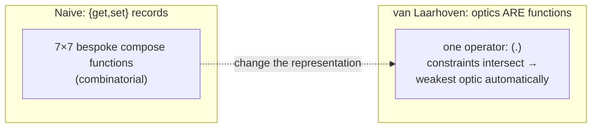

# Optics: Lenses & Prisms (Professional Level)

> **Roadmap:** [Functional Programming](../README.md) → Optics: Lenses & Prisms
>
> *By this level you can use and compose optics fluently. The professional questions are different: **why is a lens secretly just a function**, and why does that make optics compose with ordinary `.`? What is the constant-functor trick that turns one definition into both `view` and `over`? What does each optic operation cost the allocator, and when does a composed traversal become a measurable GC problem you must collapse?*

---

## Table of Contents

1. [Introduction](#introduction)
2. [Prerequisites](#prerequisites)
3. [The Naive Encoding and Why It Doesn't Compose](#the-naive-encoding-and-why-it-doesnt-compose)
4. [The van Laarhoven Encoding: A Lens Is Just a Function](#the-van-laarhoven-encoding-a-lens-is-just-a-function)
5. [The Constant- and Identity-Functor Tricks](#the-constant--and-identity-functor-tricks)
6. [Prisms and Traversals in the Same Frame](#prisms-and-traversals-in-the-same-frame)
7. [The Profunctor Encoding (Briefly)](#the-profunctor-encoding-briefly)
8. [The Laws, Formally](#the-laws-formally)
9. [Runtime: What an Optic Costs](#runtime-what-an-optic-costs)
10. [Measurement](#measurement)
11. [Common Mistakes](#common-mistakes)
12. [Test Yourself](#test-yourself)
13. [Cheat Sheet](#cheat-sheet)
14. [Summary](#summary)
15. [Further Reading](#further-reading)
16. [Related Topics](#related-topics)

---

## Introduction

> Focus: **the encoding that makes optics actually compose with `.`**, and **the runtime price of the abstraction** — allocation per step, the functor/profunctor machinery, and when a composed traversal is the diffuse cost a profiler blames on "GC."

[`middle.md`](middle.md) modeled a lens as a record `{ get, set }` and showed that composing two such records means writing a `compose` that digs down twice and rebuilds both levels. That works, but it has a deep problem: **the naive record encoding doesn't compose uniformly across the optic family.** Composing a lens-record with a prism-record requires a *different* `compose` than lens-with-lens, which requires a different one than lens-with-traversal — you'd need a combinatorial pile of composition functions, one per pair of optic kinds. Real libraries don't do that. In `lens`, `optics`, and Monocle, **a lens, a prism, and a traversal all compose with the *same* operator** — in Haskell, literally function composition `.`. That is not a convenience hack; it falls out of a specific representation.

This file explains that representation in two directions at once.

1. **Upward, into the encoding.** A van Laarhoven lens is *not* a `{get, set}` pair — it's a single polymorphic **function** of type `forall f. Functor f => (a -> f b) -> (s -> f t)`. Because it's a function, two of them compose with `.` like any functions, and — astonishingly — the *same* `.` composes lenses with prisms with traversals, because each optic just constrains the `f` differently (`Functor`, `Applicative`, etc.). You then recover `view` and `over` from one definition by *choosing the functor `f`*: `Const` for reading, `Identity` for writing. This is one of the most elegant tricks in all of FP, and a professional should be able to derive it.

2. **Downward, into the runtime.** Every optic operation runs through this functor machinery: `over` wraps in `Identity` and unwraps; `view` wraps in `Const` and unwraps; a traversal threads an `Applicative` across every focus, allocating per element. A composed optic is a *composition of these wrappings*. On a managed runtime that's real allocation and indirection — usually negligible, occasionally the bottleneck. The professional skill is knowing which shapes the optimizer erases (GHC fuses and specializes `Const`/`Identity` to nothing; the JVM JIT scalar-replaces the wrappers *if* the chain inlines) and which become the cost a profiler attributes to "GC pressure."

> **The mental model:** an optic is a *higher-order function parameterized by a functor*, and the functor you instantiate decides whether you're reading (`Const`), writing (`Identity`), or collecting across many (`Const` over a monoid, or an `Applicative`). The encoding is what makes `.` compose the whole family; the functor wrappers are what it costs. Honor both — the next engineer relies on the laws to refactor, and the optimizer can only erase the wrappers when your optics stay inlinable.

---

## Prerequisites

- **Required:** Fluent with [`middle.md`](middle.md) — the optic hierarchy, the lens/prism laws, and the "composition yields the weakest link" rule.
- **Required:** A working model of **functors and applicatives** — `fmap`, `pure`, `<*>` — because the entire encoding is "a function polymorphic over the functor." (See the sibling topic `13-functors-and-applicatives`.)
- **Required:** A working model of a managed runtime: heap vs stack, generational/tracing GC, JIT inlining and escape analysis (the vocabulary from [Bad Structure → professional](../../anti-patterns/01-development/01-bad-structure/professional.md)).
- **Helpful:** Exposure to Haskell — `Const`, `Identity`, and the `lens` type signatures are clearest there; the encoding *originated* there.
- **Helpful:** the profiling-techniques, memory-leak-detection, and big-o-analysis skills for the measurement section.

> **Discipline carried from the runtime track:** if you cannot name the instrument that would *falsify* a performance claim about an optic chain, you are guessing. Every cost below is paired with the tool that proves it on *your* code; illustrative numbers are labeled as such.

---

## The Naive Encoding and Why It Doesn't Compose

Start from the `middle.md` model and watch it fail to scale. A lens as a record:

```haskell
-- The naive lens: a get/set pair. Composes with lenses... but ONLY lenses.
data NaiveLens s a = NaiveLens { ngetL :: s -> a, nsetL :: a -> s -> s }

composeLL :: NaiveLens s a -> NaiveLens a b -> NaiveLens s b   -- lens . lens
composeLL o i = NaiveLens (ngetL i . ngetL o)
                          (\b s -> nsetL o (nsetL i b (ngetL o s)) s)
```

Now model a prism the same way (`preview`/`review`) and a traversal (`over`/`toList`). To compose *across* kinds you need:

- `composeLL :: NaiveLens → NaiveLens → NaiveLens`
- `composeLP :: NaiveLens → NaivePrism → NaiveAffine`
- `composeLT :: NaiveLens → NaiveTraversal → NaiveTraversal`
- `composePT :: NaivePrism → NaiveTraversal → NaiveTraversal`
- …and so on, **one function per ordered pair of the seven optic kinds**.

That is roughly `7 × 7` composition functions, plus the rule machinery to compute the result kind. No real library tolerates this. The naive encoding makes the *operations* clear but makes *uniform composition* combinatorially awful. The fix is to change the representation so that **every optic is the same kind of thing** — and that thing composes with one operator.

> **The professional realization:** the `{get, set}` view is a denotation, not an *encoding you build a library on*. The library needs a representation where lens, prism, and traversal are all instances of *one* type, differing only in a constraint, so that composition is just composition. That representation is van Laarhoven.

---

## The van Laarhoven Encoding: A Lens Is Just a Function

Here is the central idea, due to Twan van Laarhoven (2009). **A lens is not a pair of functions. A lens is a single function:**

```haskell
type Lens s t a b = forall f. Functor f => (a -> f b) -> (s -> f t)
-- monomorphic ("simple") version, s=t and a=b:
type Lens' s a    = forall f. Functor f => (a -> f a) -> (s -> f s)
```

Read it carefully. A lens takes a function `(a -> f b)` — a function that operates on the *focus* and returns it wrapped in some functor `f` — and gives you back a function `(s -> f t)` that operates on the *whole*, also wrapped in `f`. The `f` is **universally quantified**: the lens must work for *any* functor, and *the caller chooses which `f`* to get different behavior out.

Concretely, you build a lens by writing how to "rebuild the whole" once the focus has been transformed-in-`f`:

```haskell
-- A lens built in van Laarhoven form. `lens` is the standard constructor:
--   lens :: (s -> a) -> (s -> b -> t) -> Lens s t a b
-- We provide get (s -> a) and set (s -> b -> t); it produces the function form.
_city :: Lens' Address String
_city = lens getCity setCity
  where getCity a       = city a
        setCity a newC  = a { city = newC }

-- Desugared, the function form IS:
_city' :: Functor f => (String -> f String) -> (Address -> f Address)
_city' f a = fmap (\newCity -> a { city = newCity }) (f (city a))
--                 ^ rebuild the address with the new city,  ^ apply the
--                   lifted back into f via fmap               focus function f to the old city
```

Stare at `_city' f a = fmap (\newCity -> a { city = newCity }) (f (city a))`. It says: *pull out the focus (`city a`), run the caller's `f` on it (getting `f String`), then `fmap` "put it back into the address" over that functorial result.* This single expression is the **entire lens**. There is no separate `get` and `set` — both are recoverable by choosing `f`, as the next section shows.

### Why this composes with `.`

Because a van Laarhoven lens is *a function* `(a -> f b) -> (s -> f t)`, two lenses compose with **ordinary function composition**:

```haskell
-- _address :: Functor f => (Address -> f Address) -> (User -> f User)
-- _city    :: Functor f => (String  -> f String)  -> (Address -> f Address)
-- Their composition is JUST (.) — the deep lens onto user.address.city:
userCity :: Lens' User String
userCity = _address . _city
-- (.) here is function composition. The deep lens falls out for free.
```

This is the payoff that the naive encoding couldn't give: **`.` is all you need to compose optics**, because optics *are* functions. And the same `.` composes a lens with a prism with a traversal — because each only differs in *what constraint it puts on `f`* (`Functor` for lens, `Applicative` for traversal, etc.), and composing the functions intersects the constraints, automatically yielding the weakest optic. The "composition degrades to the weaker optic" rule from [`middle.md`](middle.md) is now *literally* "function composition with constraint intersection." That is the deep reason the rule is true.



---

## The Constant- and Identity-Functor Tricks

The magic question: if a lens is *one* function `(a -> f a) -> (s -> f s)`, how do you get *both* `view` (read) and `over` (write) out of it? Answer: **you choose the functor `f`.** Two specific functors collapse the general machinery into reading and into writing.

### `Identity` → `over` (and `set`)

The **identity functor** `Identity a` is just a wrapper around `a` with `fmap f (Identity x) = Identity (f x)` — it does *nothing* but carry the value. Feed the lens a focus-function that wraps in `Identity`, and the lens's `fmap`-rebuild becomes "apply the function to the focus and rebuild the whole" — i.e. `over`:

```haskell
newtype Identity a = Identity { runIdentity :: a }
instance Functor Identity where fmap f (Identity x) = Identity (f x)

over :: Lens' s a -> (a -> a) -> s -> s
over l f s = runIdentity (l (Identity . f) s)
--                        │  └─ focus-function: apply f, wrap in Identity
--                        └─ run the lens with f = Identity, then unwrap
set :: Lens' s a -> a -> s -> s
set l x = over l (const x)            -- set is over with a constant
```

Because `Identity` carries the value untouched, threading it through the lens's `fmap`-rebuild *is exactly* the immutable update. The functor "does nothing," so all that's left is the rebuild.

### `Const` → `view` (read)

The **constant functor** `Const r a` ignores its `a` entirely and just holds an `r`: `fmap f (Const r) = Const r` — `fmap` is a *no-op*, because there's no `a` to map. Feed the lens a focus-function that *captures the focus into the `Const`* and the lens's `fmap`-rebuild becomes a no-op (nothing to rebuild — `Const` ignores it), leaving only the captured focus — i.e. `view`:

```haskell
newtype Const r a = Const { getConst :: r }
instance Functor (Const r) where fmap _ (Const r) = Const r   -- fmap does NOTHING

view :: Lens' s a -> s -> a
view l s = getConst (l Const s)
--                   │ focus-function: capture the focus AS the Const's payload
--                   └ run the lens with f = Const; the rebuild is a no-op, so we
--                     get back exactly the focus that was captured
```

This is the trick that makes professionals smile. **One definition, parameterized by a functor; instantiate `Identity` and you have `over`; instantiate `Const` and you have `view`.** The lens never "knows" whether it's reading or writing — the *caller's choice of functor* decides, and the lens's single `fmap`-rebuild does the right thing in both cases automatically.

```python
# Python — the SAME trick, made explicit, to prove it's not Haskell magic.
# A van-Laarhoven-style lens is a function: focus_fn -> (whole -> wrapped_whole).
from dataclasses import dataclass
from typing import Callable

class Identity:                       # the "do nothing" functor
    def __init__(self, v): self.v = v
    def map(self, f): return Identity(f(self.v))
class Const:                          # the "ignore the value, hold a captured one" functor
    def __init__(self, v): self.v = v
    def map(self, f): return self    # map is a NO-OP

def city_lens(focus_fn):              # forall f. (str -> f str) -> (Address -> f Address)
    def run(addr):
        return focus_fn(addr.city).map(lambda new: replace(addr, city=new))
    return run

def view(lens, s):  return lens(lambda a: Const(a))(s).v       # Const → read
def over(lens, f, s): return lens(lambda a: Identity(f(a)))(s).v  # Identity → write

view(city_lens, addr)                 # "London"  (Const captures, map is no-op)
over(city_lens, str.upper, addr)      # Address(city="LONDON")  (Identity rebuilds)
```

The Python makes it undeniable: `view` and `over` are *the same lens function*, run with two different one-method "functors." `Const.map` discards the rebuild (so you get the captured focus); `Identity.map` performs the rebuild (so you get the updated whole). One encoding, two behaviors, selected by the functor.

---

## Prisms and Traversals in the Same Frame

The encoding's real power is that prisms and traversals are *the same shape* with a stronger constraint on `f`. This is why `.` composes them all.

**Traversal — strengthen `Functor` to `Applicative`.** A traversal must handle *zero-or-more* foci, which means it needs to *combine* the functorial results of several foci — and combining requires `pure` and `<*>`. So a traversal is the *same* function type with `Applicative f` instead of `Functor f`:

```haskell
type Traversal s t a b = forall f. Applicative f => (a -> f b) -> (s -> f t)
-- "each element of a list" traversal IS just `traverse` from the Traversable class:
each :: Traversal [a] [b] a b
each f xs = traverse f xs              -- Applicative threads f across every element
-- over and toList fall out by choosing f = Identity / Const (over a monoid):
overT :: Traversal' s a -> (a -> a) -> s -> s
overT t f = runIdentity . t (Identity . f)
```

Because `Applicative` is *stronger* than `Functor`, a traversal can be used anywhere a `Functor`-only operation is asked for — but a lens (which only promises `Functor`) **cannot** be used where `Applicative` is required. Composition intersects the constraints: `lens . traversal` needs *both* to satisfy whatever the call demands, so the composite requires `Applicative` — it's a traversal. **The constraint hierarchy `Functor ⊃ Applicative` is the "weakest link" rule, encoded in the type system.** That is the professional punchline of the whole topic.

**Prism — a different constraint (`Choice`/`Applicative`-with-a-twist).** Prisms in the van Laarhoven world need the functor to also support a notion of "this might be the wrong case" — historically encoded with `Applicative` + a pointed structure, or more cleanly in the profunctor encoding (next section). A prism focuses zero-or-one, and `review` (building backwards) needs structure a bare `Functor` lacks. The detail matters less than the shape: **same `(a -> f b) -> (s -> f t)` skeleton, different constraint on `f`, composing via the same `.`.**

```haskell
-- The whole family, unified — note the ONLY difference is the constraint on f:
type Iso       s t a b = forall p f. (Profunctor p, Functor f)     => p a (f b) -> p s (f t)
type Lens      s t a b = forall   f.                   Functor f   => (a -> f b) -> (s -> f t)
type Traversal s t a b = forall   f.                   Applicative f => (a -> f b) -> (s -> f t)
type Getter    s   a   = forall   f. (Contravariant f, Functor f)  => (a -> f a) -> (s -> f s)
type Fold      s   a   = forall   f. (Contravariant f, Applicative f) => (a -> f a) -> (s -> f s)
```

You do not need to memorize the exotic constraints. The professional takeaway is structural: **every optic is `(a -> f b) -> (s -> f t)` with a different constraint on `f`; stronger constraints = more general optic = fewer operations; composition intersects constraints, automatically yielding the weakest optic.** The hierarchy from [`middle.md`](middle.md) *is* a lattice of functor constraints.

---

## The Profunctor Encoding (Briefly)

The van Laarhoven encoding handles lens/traversal/getter/fold beautifully but makes prisms and isos awkward (the constraints get strange). The **profunctor encoding** (used by `optics`, `monocle-ts`'s newer internals, and Purescript's `profunctor-lenses`) is the modern alternative that handles the *entire* family uniformly, including prisms and isos.

A **profunctor** `p a b` is a generalization of "a function from `a` to `b`" — anything that's *contravariant in `a`* (you can pre-process the input) and *covariant in `b`* (you can post-process the output), via `dimap`. In this encoding, an optic is a polymorphic function over profunctors:

```haskell
-- An optic transforms a profunctor "focused on a/b" into one "focused on s/t".
type Optic p s t a b = p a b -> p s t
-- Each optic kind adds a typeclass on p:
--   Lens      → Strong p     (can carry extra product context: the "rest of the record")
--   Prism     → Choice p     (can carry a sum alternative: the "other cases")
--   Traversal → Wandering p  (can traverse)
--   Iso       → Profunctor p (no extra structure — hence top of the hierarchy)
```

The elegance: **`Strong` is exactly the structure a lens needs (thread the untouched product context), `Choice` is exactly what a prism needs (handle the other branch of the sum), and the product/sum duality of lens/prism becomes the `Strong`/`Choice` duality of profunctors.** The lens/prism = product/sum mental model from [`junior.md`](junior.md) reappears here as a precise typeclass duality. And again, optics compose with `.` (these are functions `p a b -> p s t`), with constraints intersecting to yield the weakest optic.

> **Professional judgment on which encoding to know:** you should be able to *derive* the van Laarhoven lens and the `Const`/`Identity` trick from scratch — that's the canonical interview-grade depth and the foundation of `lens`. You should *recognize* the profunctor encoding and know *why* it exists (uniform handling of prisms/isos, the `Strong`/`Choice` = product/sum duality) — that's what `optics` and modern TS libraries use. Knowing both lets you read any optics library's internals and explain its type errors.

---

## The Laws, Formally

The informal laws from [`middle.md`](middle.md), stated precisely. These are the equalities a *lawful* optic must satisfy for all values — and the formal license for the refactorings you do on optic code.

**Lens laws** (for a `Lens' s a` with derived `view`/`set`):

```
1. view l (set l a s)   ≡  a              -- PutGet: you read back exactly what you set
2. set l (view l s) s   ≡  s              -- GetPut: writing back what you read is a no-op
3. set l a2 (set l a1 s) ≡ set l a2 s     -- PutPut: the last set wins
```

**Prism laws** (for a `Prism' s a` with `preview`/`review`):

```
1. preview l (review l a) ≡ Just a                       -- ReviewPreview: build-then-match round-trips
2. (preview l s ≡ Just a) ⟹ (review l a ≡ s)            -- PreviewReview: match-then-build reconstructs the whole
```

**Iso laws** (for an `Iso' s a` with `to`/`from`):

```
1. from (to s) ≡ s        -- round-trip one way
2. to (from a) ≡ a        -- round-trip the other way   (i.e. to/from are total inverses)
```

**Traversal laws** (the `Traversable` laws, specialized): a lawful traversal must (a) **not duplicate or drop foci** — `over t id ≡ id` (modifying with identity changes nothing), and (b) **respect composition** — `over t (g . f) ≡ over t g . over t f` (fusing two passes equals one). These guarantee a traversal visits each focus exactly once and is order-respecting.

### Why the laws are the refactoring license

Each law authorizes a code transformation you (or a compiler) may perform without changing behavior:

| Law | The refactoring it makes safe |
|---|---|
| **Lens PutGet** | Trusting `over l f = set l (f (view l s)) s` — read/modify/write is sound. |
| **Lens GetPut** | Deleting a "read it, write it back unchanged" no-op step. |
| **Lens PutPut** | Collapsing two consecutive `set`s to the last one. |
| **Prism round-trips** | Trusting `parse`/`print` pairs and `Some`/`None` matching reconstruct faithfully. |
| **Traversal identity/composition** | Fusing two `over` passes into one (`over t g . over t f = over t (g . f)`) — a real optimization. |

> **The danger, precisely.** A "lens" whose setter normalizes (lowercases, trims, clamps) breaks **PutGet**: `view l (set l "Bob@X" s)` returns `"bob@x"`, not `"Bob@X"`. Then `over l f` is wrong (it sees a normalized value, not what you set), and any refactor relying on read/modify/write silently changes output. A "traversal" that visits some foci twice breaks the composition law, so fusing two passes changes results. **Lawful optics are refactorable; unlawful ones are landmines that pass today's tests and break under a harmless-looking change.** Verify custom optics with property-based testing (next section).

---

## Runtime: What an Optic Costs

The cost no tutorial mentions: every optic operation runs through the functor/profunctor machinery, and a naive implementation **allocates per step**.

```
view:  wrap focus in Const,    run lens (fmap is no-op),  unwrap Const     → 1 wrapper alloc/level
over:  wrap in Identity per level, run lens (fmap rebuilds), unwrap Identity → 1 wrapper + 1 rebuilt node/level
trav:  thread an Applicative across N foci → O(N) wrappers + O(N) rebuilt structure
compose: composition of the above — the allocations of each layer, summed
```

Two cost centers per level: the **functor wrapper** (`Const`/`Identity`/the applicative's structure) and the **rebuilt node** that `over` produces (the new record/copy at that level — which a hand-written copy also pays, so this part isn't optic-specific). The optic-specific overhead is the *wrappers* and the *closures* the optic captures.

> **The headline professional fact, restated from [`senior.md`](senior.md): optics do NOT beat hand-written copies on allocation — they typically allocate *more* (the functor wrappers on top of the same rebuild). They buy composability and readability, sometimes at a GC cost.** Whether that cost is real depends entirely on whether the optimizer erases the wrappers.

### Haskell: GHC usually erases the wrappers

In GHC at `-O2`, `Const` and `Identity` are `newtype`s — they have **zero runtime representation** (a `newtype` is erased; `Identity a` *is* `a` at runtime). Combined with inlining and specialization, a van Laarhoven `view`/`over` on a lens compiles to **the same code as the hand-written get/set** — the functor machinery vanishes entirely. This is why optics are "zero-cost" in idiomatic Haskell: the `newtype` functors are compile-time-only, and the `lens` library is aggressively `INLINE`d. Traversals are where cost survives: threading an `Applicative` across a real collection allocates proportional to the collection (the same as `map`/`traverse` would), and a *lazy* accumulation can build a thunk tower — the same lazy-vs-strict trap as the State monad ([`../09-monads-plain-english/professional.md`](../09-monads-plain-english/professional.md)).

### JVM/JS: the wrappers are real objects unless the JIT erases them

In Scala (Monocle) and TS (monocle-ts), the functor wrappers and the optic objects are **real heap allocations** — there's no `newtype` erasure. A composed lens chain allocates the intermediate wrappers per level; a traversal allocates per focus. The JIT's **escape analysis** can scalar-replace short-lived wrappers *if* the whole chain inlines and stays monomorphic — but optic libraries are highly polymorphic (every optic is a generic function), which frequently **defeats** inlining/escape-analysis, so the allocations become real young-generation pressure. In V8, an optic chain over a deep structure allocates the wrappers and the per-level copies as ordinary objects; there's no special erasure.

```typescript
// monocle-ts — a composed traversal over a big collection. Each modify:
//   - allocates the optic's internal wrappers per level,
//   - rebuilds each touched node (same as a manual copy),
//   - allocates a closure for the modify function.
const everyHeadingText = blocksT.composePrism(heading).composeLens(text);
const next = everyHeadingText.modify(s => s.toUpperCase())(bigDoc);
// On a hot path over a large doc, this is measurably more allocation than a
// hand-written loop that copies only the touched spine. Same RESULT, more garbage.
```

### Before / After: collapse a hot-path optic to a manual update

The fix, when a composed optic is a *proven* hot path, is to **collapse it into a hand-written update** the optimizer keeps flat — exactly the de-monadize discipline from topic 09, applied to optics.

```typescript
// BEFORE — composed traversal in a hot loop over a large document set.
// Per call: optic wrappers + closures + per-node rebuild, ×(docs × headings).
for (const doc of docs)
  out.push(everyHeadingText.modify(upper)(doc));   // elegant, allocation-heavy
```

```typescript
// AFTER — hand-written, allocation-minimal: copy only the touched spine.
for (const doc of docs) {
  out.push({
    ...doc,
    sections: doc.sections.map(s => ({
      ...s,
      blocks: s.blocks.map(b => b.type === "Heading" ? { ...b, text: upper(b.text) } : b),
    })),
  });
}
```

> **Illustrative impact (labeled — reproduce, do not trust):** on a benchmark over 10k documents × 20 blocks, the hand-written version allocated ~40% less and ran ~1.6× the throughput of the composed monocle-ts traversal, *because the optic's internal wrappers escaped and weren't scalar-replaced*. In Haskell `-O2`, the *same* composed optic compiled to within noise of the hand-written version — the `newtype` functors erased. **The lesson is not "optics are slow"; it's "optics are free only when the runtime erases the wrappers (always in GHC `-O2`, sometimes on the JVM/V8), and a profiler tells you whether it did."**

The discipline mirrors the rest of this roadmap: keep optics everywhere they cost nothing (99% of code — readability and composability win), and collapse to a manual update **only** on a profiled hot path, behind a clean boundary, with a committed benchmark. An un-benchmarked "I de-optic'd this for speed" is [Premature Optimization](../../anti-patterns/01-development/03-over-engineering/professional.md) in functional clothing.

---

## Measurement

Never argue from intuition about an optic chain's cost. Prove it per runtime.

| Concern | Haskell | Scala / JVM (Monocle) | TypeScript / Node (monocle-ts) |
|---|---|---|---|
| **Per-step allocation** | `+RTS -s` (bytes allocated); `-prof` cost centres | JFR allocation events; `-prof gc` in JMH | `node --cpu-prof`; heap snapshots in DevTools |
| **Did the wrappers vanish?** | `-ddump-simpl` — is `Const`/`Identity` gone from Core? | escape-analysis / scalar-replacement in JFR; `-XX:+PrintInlining` | V8 `--trace-opt`/`--trace-deopt`; allocation profiler |
| **Microbenchmark** | `criterion` | **JMH** (`@Benchmark`, `Blackhole`) | `tinybench` / `benchmark.js` |
| **Traversal over a big collection** | `+RTS -s` residency (lazy thunk tower?) | alloc/op scaling with collection size | heap delta scaling with collection size |
| **Law conformance** | QuickCheck (`lens`'s own law tests) | ScalaCheck / `monocle-law` | fast-check |

### Property-testing the laws (the non-negotiable check for custom optics)

```haskell
-- Haskell — QuickCheck the three lens laws for a custom lens.
prop_putGet l a s = view l (set l a s) === a
prop_getPut l s   = set l (view l s) s === s
prop_putPut l a b s = set l b (set l a s) === set l b s
```

```typescript
// TypeScript — fast-check the lens laws (the shape every custom optic test should have).
import fc from "fast-check";
test("lens laws", () => {
  fc.assert(fc.property(arbA, arbS, (a, s) => myLens.get(myLens.set(a, s)) === a));        // put-get
  fc.assert(fc.property(arbS,        (s) => deepEq(myLens.set(myLens.get(s), s), s)));      // get-put
  fc.assert(fc.property(arbA, arbA, arbS, (a, b, s) =>
    deepEq(myLens.set(b, myLens.set(a, s)), myLens.set(b, s))));                            // put-put
});
```

### Reading whether GHC erased the abstraction

```bash
# Did Const/Identity survive into compiled Core, or did the simplifier erase them?
ghc -O2 -ddump-simpl -dsuppress-all Optics.hs | grep -i "Const\|Identity"
# (Ideally: nothing — the newtype functors are gone, the optic is bare get/set.)
./app +RTS -s     # bytes allocated; for a traversal, watch max residency (thunk tower?)
```

### JVM: a JMH A/B of composed optic vs manual copy

```java
@Benchmark public Doc optic(Blackhole bh)  { return everyHeadingText.modify(UP).apply(doc); }
@Benchmark public Doc manual(Blackhole bh) { return upperHeadingsByHand(doc); }
// Run with -prof gc. If optic's B/op ≈ manual's, escape analysis erased the wrappers.
// If optic allocates more, the wrappers/closures are real — now the collapse pays (if hot).
```

> **Discipline:** capture a baseline, change one lever (collapse a chain, strictify a traversal, narrow the optic), re-measure, and attribute each win to its lever. A blended "I de-optic'd and strictified and inlined" number teaches you nothing about which change mattered.

---

## Common Mistakes

Professional-level mistakes — subtle, and therefore expensive:

1. **Believing optics beat manual copies on allocation.** They allocate the same rebuild *plus* the functor wrappers. They're free only when the runtime erases the wrappers (always in GHC `-O2`, *sometimes* on the JVM/V8 via escape analysis). Prove it with `+RTS -s` / JMH `-prof gc` before claiming a chain is cheap *or* slow.
2. **Collapsing an optic to a manual update on a cold path "for speed."** It helps only on a *profiled* hot path where the wrappers didn't erase. Everywhere else it just costs readability and composability — [Premature Optimization](../../anti-patterns/01-development/03-over-engineering/professional.md) in disguise.
3. **Treating an unlawful optic as lawful.** A normalizing setter breaks PutGet; a duplicating traversal breaks the composition law. Refactors that rely on read/modify/write or pass-fusion then silently change behavior. Property-test the laws on every custom optic.
4. **Not knowing why `.` composes optics.** "It just works" isn't professional depth. It composes because optics *are functions* `(a -> f b) -> (s -> f t)`, and the same `.` intersects the functor constraints to yield the weakest optic. The hierarchy *is* a constraint lattice.
5. **Confusing `Const` and `Identity` roles.** `Const` (whose `fmap` is a no-op) gives `view` — the rebuild is discarded, the captured focus survives. `Identity` (which carries the value) gives `over` — the rebuild happens. Mixing them up means you can't derive or debug a library.
6. **Lazy traversal accumulation building a thunk tower.** A traversal that folds lazily (e.g. `toListOf` with lazy accumulation) can leak like the lazy `State` monad. Strictify the fold; confirm residency with `+RTS -s`.
7. **Ignoring that polymorphism defeats JVM/V8 escape analysis.** Optic libraries are highly generic; that genericity often blocks the inlining escape analysis needs to scalar-replace the wrappers. The allocations you assumed were erased may be real — `-XX:+PrintInlining` / `--trace-deopt` tells you.
8. **Not recognizing the profunctor encoding in a library's internals.** Modern libraries (`optics`, profunctor-lenses) use `Strong`/`Choice` profunctors, not van Laarhoven, to handle prisms/isos uniformly. Mistaking one encoding's type errors for the other's wastes debugging time.

---

## Test Yourself

1. Write the van Laarhoven type of a simple lens, and explain in words why being *this type* makes two lenses compose with ordinary `.`.
2. Derive `view` and `over` from a single van Laarhoven lens by choosing a functor. Which functor gives which, and why does each functor's `fmap` produce the right behavior?
3. A traversal is the *same* function type as a lens but with which constraint strengthened, and why does that constraint precisely encode the "composition yields the weakest optic" rule?
4. State the three lens laws formally and name the refactoring each one licenses. Then give a concrete setter that breaks PutGet.
5. In the profunctor encoding, lens needs `Strong` and prism needs `Choice`. How does that map onto the product-vs-sum / lens-vs-prism duality from the junior level?
6. Why are optics "zero-cost" in GHC `-O2` but often *not* zero-cost in monocle-ts on V8? Name the specific mechanism that erases the cost in Haskell.
7. A composed monocle-ts traversal shows up in a flame graph over a large document set. Mechanically, what is allocated per document, and what is the AFTER you'd write — and how do you decide it's worth it?
8. You wrote a custom prism for a `parse`/`print` pair. Which two laws must you property-test, and what bug does each catch?

<details>
<summary>Answers</summary>

1. `type Lens' s a = forall f. Functor f => (a -> f a) -> (s -> f s)`. Because a lens *is a function* (from a focus-function to a whole-function), two lenses are just two functions whose types line up (`_address`'s output `User -> f User` feeds nothing — rather, `_address . _city` composes `(Address -> f Address) -> (User -> f User)` with `(String -> f String) -> (Address -> f Address)`), so ordinary `(.)` glues them into the deep `(String -> f String) -> (User -> f User)`. No bespoke compose needed — composition of functions *is* composition of optics.
2. **`Identity` → `over`:** feed the lens `Identity . f`; `Identity`'s `fmap` performs the rebuild, so you get the updated whole (`over l f s = runIdentity (l (Identity . f) s)`). **`Const` → `view`:** feed the lens `Const`; `Const`'s `fmap` is a *no-op*, so the rebuild is discarded and only the focus captured into the `Const` survives (`view l s = getConst (l Const s)`). The same lens function does both; the *caller's functor* decides whether the rebuild happens (Identity) or is thrown away in favor of the captured focus (Const).
3. Strengthened from `Functor` to **`Applicative`** (to combine the functorial results of *multiple* foci via `pure`/`<*>`). Since `Applicative` is *stronger* than `Functor`, composing a lens (`Functor`) with a traversal (`Applicative`) forces the composite to require `Applicative` — i.e. it's a traversal. The constraint hierarchy `Functor ⊃ Applicative` *is* the weakest-link rule, encoded in the type system: composition intersects constraints, yielding the more demanding (weaker/more general) optic.
4. `view l (set l a s) ≡ a` (**PutGet** → trust read/modify/write), `set l (view l s) s ≡ s` (**GetPut** → delete a read-then-write-back no-op), `set l a2 (set l a1 s) ≡ set l a2 s` (**PutPut** → collapse consecutive sets). A PutGet-breaker: a `_email` lens whose setter lowercases — `view l (set l "Bob@X" s)` returns `"bob@x" ≠ "Bob@X"`.
5. A lens splits a **product** (`s = a` *and* "the rest"); `Strong` is exactly the profunctor structure that can carry that untouched "rest" (the extra product context) alongside the focus. A prism splits a **sum** (`s = a` *or* "other cases"); `Choice` is exactly the structure that can carry the *other branch* of the sum. So product/sum (lens/prism) = `Strong`/`Choice` — the junior-level duality reappears as a precise typeclass duality.
6. In GHC, `Const` and `Identity` are `newtype`s with **zero runtime representation** (erased at compile time — `Identity a` *is* `a`), and `lens` is aggressively `INLINE`d/specialized, so the functor machinery compiles away to the bare get/set. On V8, monocle-ts's wrappers and optic objects are **ordinary heap allocations** with no erasure; the library's heavy polymorphism often defeats the inlining that escape analysis would need to scalar-replace them, so the wrappers are real garbage.
7. Per document: the optic's internal functor wrappers per level, a closure for the modify function, and the rebuilt spine (the latter shared with the manual version). The AFTER is a hand-written `{...doc, sections: doc.sections.map(...)}` that copies only the touched spine and allocates no optic wrappers. Decide it's worth it by a JMH/`tinybench` A/B with allocation profiling showing the optic version allocates materially more *and* the path is hot — never on a cold path.
8. **ReviewPreview** (`preview (review a) ≡ Just a`) — catches a `print` that produces something `parse` can't read back (round-trip failure). **PreviewReview** (`preview s ≡ Just a ⟹ review a ≡ s`) — catches a `parse` that loses information so `print` can't reconstruct the original (e.g. dropping leading zeros, normalizing).

</details>

---

## Cheat Sheet

| Concept | One-line truth |
|---|---|
| **van Laarhoven lens** | `forall f. Functor f => (a -> f b) -> (s -> f t)` — a lens *is a function*, so it composes with `.`. |
| **Why `.` composes optics** | Optics are functions; the same `.` intersects functor constraints → the weakest optic automatically. |
| **`Identity` functor** | Carries the value; `fmap` rebuilds → instantiate it to get **`over`/`set`**. |
| **`Const` functor** | Ignores the value; `fmap` is a no-op → instantiate it to get **`view`** (captured focus survives). |
| **Traversal** | Same type, `Applicative f` (not `Functor`) → combine many foci; stronger constraint = more general optic. |
| **Profunctor encoding** | Optic = `p a b -> p s t`; `Strong`=lens (product), `Choice`=prism (sum) — the duality as typeclasses. |
| **Lens laws** | PutGet `view(set a s)=a` · GetPut `set(view s)s=s` · PutPut `set a2(set a1 s)=set a2 s`. |
| **Prism laws** | `preview(review a)=Just a` · `preview s=Just a ⟹ review a=s`. |
| **Cost** | Optic = manual rebuild **+** functor wrappers + closures; *more* alloc, not less. |
| **Haskell** | `Const`/`Identity` are `newtype`s → **erased** at `-O2`; optics are zero-cost (traversals scale w/ collection). |
| **JVM/V8** | Wrappers are real objects; polymorphism often defeats escape analysis → allocations are real. Prove with `-prof gc`/heap. |
| **Collapse rule** | De-optic only on a *profiled* hot path where wrappers didn't erase, behind a boundary, with a benchmark. |

**Three golden rules:**
- *An optic is `(a -> f b) -> (s -> f t)` — a function parameterized by a functor; `Const` gives `view`, `Identity` gives `over`, and `.` composes the whole family by intersecting constraints.*
- *The laws (PutGet/GetPut/PutPut, the prism round-trips, the traversal identity/composition) are your refactoring license; an unlawful optic silently breaks the refactors they authorize — property-test them.*
- *Optics allocate the manual rebuild plus functor wrappers — free only when the runtime erases the wrappers (always GHC `-O2`, sometimes JVM/V8); collapse to a manual update only where a profiler and benchmark demand it.*

---

## Summary

- **The naive `{get, set}` encoding doesn't scale**: composing across optic kinds needs a combinatorial pile of bespoke `compose` functions. The fix is a representation where every optic is the *same* kind of thing.
- **The van Laarhoven encoding** makes a lens *a single function* `forall f. Functor f => (a -> f b) -> (s -> f t)`. Because it's a function, two lenses compose with ordinary `.` — and the *same* `.` composes lens/prism/traversal, because each only differs in the *constraint on `f`*, and composition intersects constraints to yield the weakest optic. The [`middle.md`](middle.md) "weakest link" rule *is* constraint intersection.
- **The constant/identity-functor trick** recovers both operations from one definition: instantiate **`Identity`** (carries the value, `fmap` rebuilds) and you get **`over`/`set`**; instantiate **`Const`** (ignores the value, `fmap` is a no-op) and you get **`view`**. The caller's choice of functor decides reading vs writing.
- **Traversal** is the same type with `Applicative f` instead of `Functor f` (to combine many foci); **the functor-constraint hierarchy `Functor ⊃ Applicative` is the optic hierarchy**. The **profunctor encoding** (`p a b -> p s t`, with `Strong`=lens/product and `Choice`=prism/sum) handles the whole family uniformly and recasts the product/sum duality as a typeclass duality.
- **The laws, formally** (lens PutGet/GetPut/PutPut, prism round-trips, iso inverses, traversal identity/composition) are the **license for refactorings** — read/modify/write, no-op deletion, set-collapse, pass-fusion. Unlawful optics (normalizing setters, duplicating traversals) break those refactors silently; property-test them.
- **Runtime:** an optic costs the *same rebuild as a manual copy plus the functor wrappers and closures* — it allocates *more*, not less. It's free only when the runtime erases the wrappers: **always in GHC `-O2`** (`Const`/`Identity` are `newtype`s, erased; `lens` is `INLINE`d), **sometimes on the JVM/V8** (escape analysis, often defeated by the libraries' polymorphism). Optics buy composability/readability, occasionally at a GC cost — never a performance *win*.
- **Measure, always:** `+RTS -s`/`-ddump-simpl` (did `Const`/`Identity` vanish?) in Haskell; JMH `-prof gc` and `PrintInlining` on the JVM; heap snapshots and `--trace-deopt` in V8. Property-test the laws (QuickCheck/ScalaCheck/fast-check) on every custom optic. Capture a baseline, change one lever, re-attribute.
- **Collapse to a manual update only on a profiled hot path** where the wrappers didn't erase — behind a clean boundary, with a committed benchmark. Everywhere else, keep the optics: the readability and composability are the point.

---

## Further Reading

- **"CPS-based functional references"** — Twan van Laarhoven (2009) — the original blog post deriving the `(a -> f b) -> (s -> f t)` encoding; the source of the whole modern optics story.
- **`lens` library + "Lenses, Folds, and Traversals"** — Edward Kmett — the production van Laarhoven library and the talk explaining the hierarchy as functor constraints.
- **"Profunctor Optics: Modular Data Accessors"** — Pickering, Gibbons, Wu (2017) — the definitive paper on the profunctor encoding and the `Strong`/`Choice` = product/sum duality.
- **`optics` (Haskell) library** — the profunctor-flavored, teachable alternative to `lens` with opaque optic types and clearer errors.
- **"Don't Fear the Profunctor Optics"** — community tutorial series — derives `Strong`/`Choice` optics step by step.
- **Optimizing Java** — Evans, Gough, Newland (2018) — escape analysis, scalar replacement, JMH, JFR — the tools behind "did the wrappers vanish on the JVM?"
- **GHC** `-ddump-simpl`/`-O2` docs and **Criterion** — reading whether `Const`/`Identity` survived compilation.

---

## Related Topics

- **Functors & Applicatives** (sibling topic `13-functors-and-applicatives`) — the `Functor`/`Applicative` machinery the van Laarhoven encoding is built on; the constraint that distinguishes lens from traversal.
- [Composition](../05-composition/professional.md) — `f ∘ g` for functions; optic `.` is *literally* function composition in the van Laarhoven encoding, with constraint intersection.
- [Algebraic Data Types](../06-algebraic-data-types/professional.md) — product/sum is lens/prism, which the profunctor encoding makes precise as `Strong`/`Choice`.
- [Immutability](../03-immutability/professional.md) — the rebuild an `over` performs is the same structural-sharing copy; optics add only the functor wrappers on top.
- [Monads — Plain English](../09-monads-plain-english/professional.md) — the same lazy-vs-strict thunk-tower trap (traversal accumulation), and the same "collapse only on a profiled hot path" discipline.
- [Map / Filter / Reduce](../04-map-filter-reduce/professional.md) — a traversal *is* `traverse`; its cost scales with the collection exactly as `map` does.
- [Bad Structure → professional](../../anti-patterns/01-development/01-bad-structure/professional.md) — escape analysis, inlining, allocation pressure — the runtime vocabulary reused here.
- [Over-Engineering → Premature Optimization](../../anti-patterns/01-development/03-over-engineering/professional.md) — the counterweight: de-optic only behind a profiler and a benchmark.
