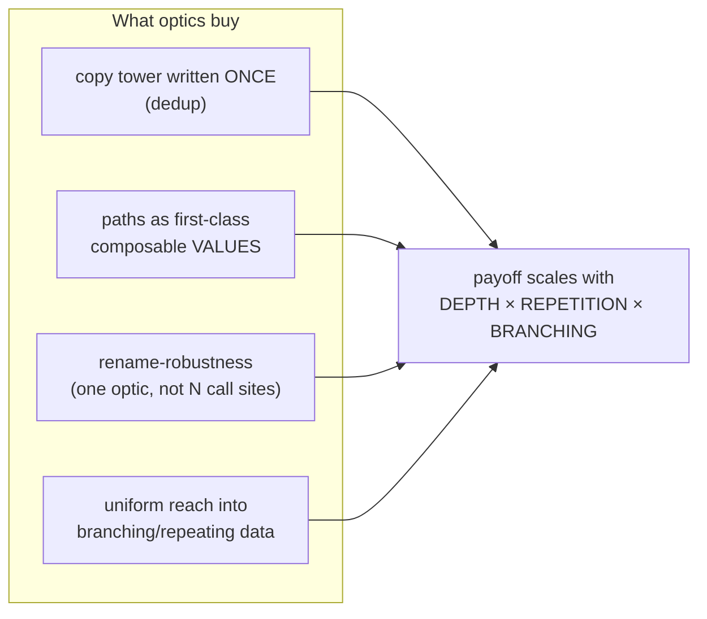
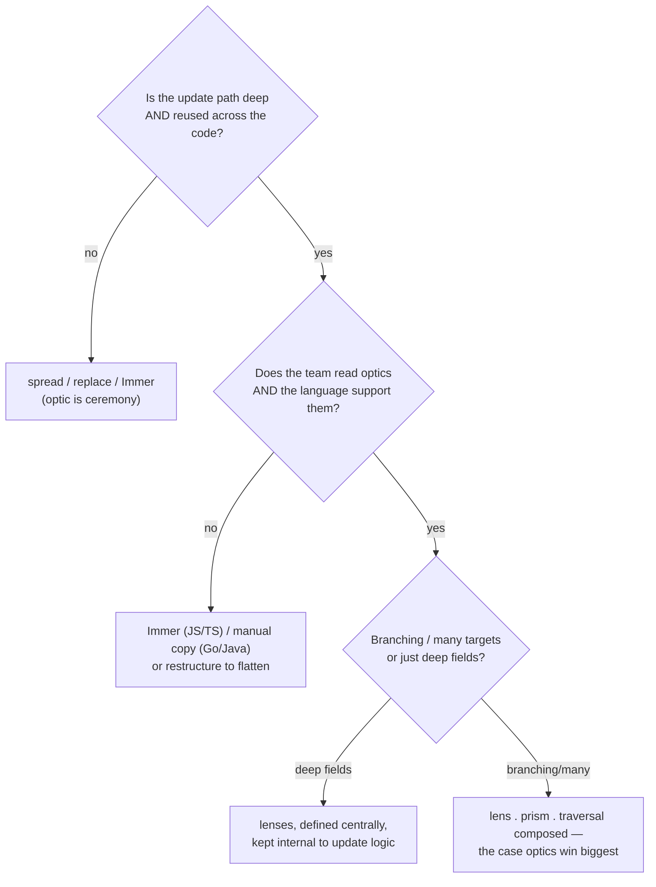

# Optics: Lenses & Prisms (Senior Level)

> **Roadmap:** [Functional Programming](../README.md) → Optics: Lenses & Prisms
>
> **Essence:** Optics are the composable abstraction for *reading and immutably updating parts of nested data*. At the senior level the question is never "what is a lens?" but "**does packaging this update path as an optic lower the cost of change — in this language, for this team, at this depth — or am I importing Kmett's `lens` library to make a two-level spread look clever?**" Optics are a tool with a steep cultural cost and a real payoff; a senior's job is to tell, for a given codebase, which side of the line a given use falls on.

---

## Table of Contents

1. [Introduction](#introduction)
2. [What Optics Actually Buy You](#what-optics-actually-buy-you)
3. [The Cost Function](#the-cost-function)
4. [When Optics Pay Off vs When They're Cargo-Cult](#when-optics-pay-off-vs-when-theyre-cargo-cult)
5. [Language Reality: Who Has Optics and What They Cost](#language-reality-who-has-optics-and-what-they-cost)
6. [Immer: The Pragmatic Non-Optic Answer](#immer-the-pragmatic-non-optic-answer)
7. [Designing With Optics: API and Boundary Decisions](#designing-with-optics-api-and-boundary-decisions)
8. [A Worked Judgment Call](#a-worked-judgment-call)
9. [Common Mistakes](#common-mistakes)
10. [Test Yourself](#test-yourself)
11. [Cheat Sheet](#cheat-sheet)
12. [Summary](#summary)
13. [Further Reading](#further-reading)
14. [Related Topics](#related-topics)

---

## Introduction

> Focus: **design and architecture judgment.** Not "what is a lens" (that's [`junior.md`](junior.md)) and not "the lens laws and the optic hierarchy" (that's [`middle.md`](middle.md)) — but *when, in a real codebase that ships, treating an update path as a first-class optic lowers the cost of change, and when it's an abstraction you'll regret introducing.*

Every working engineer has written the nested-copy tower: `{...state, a: {...state.a, b: {...state.a.b, c: newValue}}}`. It is tedious, it duplicates field names, and it is fragile — rename a field three levels down and you have a silent bug at every call site. Optics are the principled cure: a **lens** packages "reach `a.b.c`, read or update it, copy everything else" into one reusable, composable value, so the tower is written once and reused everywhere; a **prism** does the same for "if this is the `X` case, here's the value"; a **traversal** for "every matching element."

The senior insight is that optics are not a *correctness* tool — they don't let you do anything you couldn't do with hand-written copies. They are a **cost-of-change** tool. The hand-written tower and the composed optic produce the *same* new value; they differ only in how much code you write, how reusable the path is, how robust it is to schema change, and how much vocabulary a reader needs. So the decision to adopt optics is identical in shape to the decision to extract *any* abstraction: **does the duplication and fragility it removes exceed the comprehension cost it adds?** — and that answer is sharply dependent on three variables that change per codebase: *depth of nesting*, *repetition of the path*, and *team fluency × language support*.

> **The frame for this whole file:** an optic is a *reified update path*. You adopt it for the same reason you'd extract a helper — to stop repeating the copy tower and make "reach this part" a named, composable thing — and you reject it for the same reason you'd reject any abstraction: when the path is shallow, used once, or unreadable to your team. The word "optic" should rarely appear in your design docs; the *shape* — "we have one reusable, composable thing that reads-and-updates this part" — is what informs whether you reach for the library.

This is also the topic where the FP community most often *over-reaches*. Optics are intellectually gorgeous — the van Laarhoven encoding (see [`professional.md`](professional.md)) is a genuinely beautiful trick where a lens turns out to be *just* a function and that's *why* they compose with `.`. That beauty seduces engineers into using a `lens` library where a one-line spread would do. A senior holds the line: gorgeous is not a cost function.

---

## What Optics Actually Buy You

Be precise about the value, because "they're composable" is too vague to make a decision on. Optics buy you exactly four things:

**1. The copy tower, written once.** Without optics, "update `a.b.c` immutably" spells out the rebuild of every level at *every call site*. With a composed lens, the rebuild lives inside the lens definition; call sites are `abcLens.set(x, s)`. This is **deduplication of the immutable-update boilerplate**.

**2. Update paths as first-class, composable values.** A lens is a *value* you can name, store in a list, pass to a function, return, and — crucially — *compose* with `.`. "The discount of every premium account" becomes a value you define once and reuse. You cannot pass a hand-written spread tower as an argument; you can pass an optic. This is the difference between a *pattern you retype* and an *abstraction you reuse*.

**3. Robustness to one class of schema change.** When an update path is a single composed optic, a refactor like "rename `address.city` to `address.locality`" changes *one optic definition*, not fifty call sites. (It does **not** protect against *structural* changes — moving `city` up a level still breaks the optic. Optics localize *naming* changes, not *shape* changes.)

**4. Uniform reach into branching, repeating, nested data.** This is the one with no clean manual equivalent: `documents . traverse . _Heading . text` — a lens, traversal, prism, lens composed — uppercases every heading in every document, across a list and through a sum type, in one expression. The manual version is a nested loop with a type-check and two layers of copying. The deeper and more *branching* the structure, the more the optic pulls ahead.



Notice what is *not* on the list: performance (optics do **not** beat hand-written copies — see [`professional.md`](professional.md); they often allocate *more*), correctness (same result either way), or "being functional" (not a benefit). The four things above are the entire value proposition. If a proposed use doesn't clearly hit at least one of them with meaningful weight, the optic isn't paying for itself.

---

## The Cost Function

Treat the decision as a comparison of cost columns summed over the code's lifetime. This is the same risk-adjusted-investment frame from [bad-structure refactoring](../../anti-patterns/01-development/01-bad-structure/senior.md), applied to update paths.

| Cost dimension | Manual copy (`{...}` / `replace`) | Optics (lens/prism/traversal) | Immer (mutate-a-draft) |
|---|---|---|---|
| **Per-update writing** | Full rebuild at every call site | One-liner: `optic.set(x, s)` | Looks-like-mutation block |
| **Path reuse** | Retyped each time | Define once, reuse as a value | Not reusable as a value |
| **Reader onboarding** | Zero (everyone reads spread) | **High** — must learn optics + composition rules | Low — "it's like mutation" |
| **Rename-robustness** | Breaks at N call sites | One optic definition | Breaks at N draft sites |
| **Branching/many updates** | Nested loops + type checks | One composed `over` | Imperative loop in draft |
| **Allocation** | Minimal, hand-tuned | Often more (per-optic, per-step) | Structural sharing, proxy overhead |
| **Library/tooling weight** | None | A dependency + its idioms | A small, popular dependency |
| **Type safety of the path** | Compiler checks the spread | Compiler checks the composed optic | Draft is typed; path isn't a value |

The columns make the trade visible. **Optics win decisively** when the *path-reuse*, *rename-robustness*, and *branching/many* rows carry real weight — deep, repeated, branching updates — and the team already pays the reader-onboarding cost once (a fluent FP/Scala/Haskell shop). **Optics lose** when the structure is shallow and one-off (the per-update and reuse rows are near-zero either way) or when the reader-onboarding row dominates because nobody on the team speaks optics. **Immer wins** the common middle ground: nested updates that are real but where the team is JS-native and the path doesn't need to be a reusable value.

> **The litmus test:** *"Does reifying this update path as an optic make the code a future maintainer reads and changes **simpler** — in this language, for this team, at this depth — or just **cleverer**?"* Simpler-to-change gets funded; clever loses. The same as monads, the same as every abstraction: justified by the change-cost it removes, not by its mathematical pedigree.

A useful heuristic to short-circuit the analysis: **count the levels and count the call sites.** Two levels deep, updated in three places → spread or Immer; the optic is ceremony. Five levels deep, updated in thirty places, with a traversal in the middle → the optic is almost certainly worth it (if the language supports it). The product *depth × repetition × branching* is the signal; everything else is which tool and whether the team can read it.

---

## When Optics Pay Off vs When They're Cargo-Cult

The senior decision, made concrete.

### Optics pay off when…

- **The structure is deep *and* updated in many places.** A normalized application state tree (Redux-style), a game-entity component graph, a config tree, a document/AST model — nested 4+ levels, mutated across the codebase. The copy-tower cost is paid per call site without optics; the optic pays it once. This is the textbook win.
- **You need to update *many* targets through *branching* data.** "Every selected node," "every premium account's discount," "every heading's text." Traversal + prism + lens composed has no clean manual equivalent, and the optic version is dramatically less code and less bug surface.
- **Update paths are genuinely *reused*.** The same path appears in many features. Defining it once as a named optic (and getting rename-robustness) is real leverage.
- **The language has first-class optics and the team is fluent.** Haskell (`lens`/`optics`), Scala (Monocle), Kotlin (Arrow Optics with codegen). Here the composition operator makes deep updates read like a path, and the team already paid the learning cost.
- **You want the path to be a value you compose and pass.** Building optics programmatically, parameterizing a generic update function by an optic — this *requires* first-classness; a spread tower can't do it.

### It's cargo-cult / over-engineering when…

- **The structure is shallow.** One or two levels, the `{...x, y: z}` is *clearer* than a lens and has zero learning cost. A lens onto a top-level field is pure ceremony — the [Speculative Generality](../../anti-patterns/01-development/03-over-engineering/senior.md) of update paths.
- **The team can't read optics.** An optic path is opaque to anyone who hasn't learned the vocabulary and the composition-degradation rule. In a team that doesn't speak it, every optic is *negative* leverage: slower reviews, slower onboarding, and misuse (people unwrap optics or fall back to manual copies anyway, getting the dependency's cost with none of its benefit).
- **A simpler tool covers the real need.** In JS/TS, **Immer** solves the *same* nested-immutable-update pain with *no new concepts* — for most product teams it's the better trade. Reaching for monocle-ts/optics-ts when Immer would do is optimizing for elegance over the actual cost function.
- **You're in a language without an optics culture.** Go has none; hand-rolling lenses there produces non-idiomatic code the next maintainer reads slower. Honor the grain — write the copy, or restructure to reduce nesting.
- **The "many" case is actually flat.** A traversal over a top-level list is just `map`. You don't need an optic to `map` a list you already hold; reach for a traversal when the "many" is *buried* inside layers you also need to compose through.

> **The honest senior position:** in a fluent FP/Scala/Haskell codebase with deep, branching, frequently-updated state, optics are a normal and excellent tool — use them. In a mainstream JS/TS/Java/Python product codebase, reach for **Immer** (or plain spreads) first, and introduce an optics library only when you've *measured* the copy-tower pain (deep paths, many call sites, branching updates) and confirmed the team will pay the fluency cost. In Go, don't. The word "lens" in a design review should trigger the question "*how deep, how often, and can the team read it?*" — not reflexive adoption or reflexive rejection.

---

## Language Reality: Who Has Optics and What They Cost

The abstraction's value is bounded by the language's support and the team's fluency. Knowing the local dialect is most of the senior skill.

| Language | Optics support | Cost / friction | Senior default |
|---|---|---|---|
| **Haskell** | `lens` (Kmett — vast, powerful, intimidating); `optics` (cleaner, more teachable) | `lens` has a steep learning curve and famously cryptic operators (`^.`, `.~`, `%~`, `^?`, `#`); `optics` trades operators for named functions | Use them — this is their home; prefer `optics` for teachability |
| **Scala** | **Monocle** — full lens/prism/iso/traversal, macro-generated | Moderate; integrates with the FP ecosystem (Cats); `@Lenses` macro removes boilerplate | Use Monocle for deep state; idiomatic in FP-Scala |
| **Kotlin** | **Arrow Optics** — with a compiler plugin that *generates* optics from data classes | Codegen removes the hand-writing; still a real concept cost | Reasonable for deep domains; the codegen is the key enabler |
| **TypeScript/JS** | **monocle-ts**, **optics-ts** (full optics); **Ramda** `lens`/`lensProp`/`lensPath` (lenses only, simple) | Real concept cost; competes directly with Immer | **Usually prefer Immer**; optics only for deep, reused, composed paths |
| **Clojure** | **Specter** — "navigate and transform nested data," very practical, performance-focused | Its own path DSL to learn, but pragmatic and fast | Strong choice in Clojure for nested transforms |
| **Java** | No real optics library culture; you *can* hand-roll or use a niche lib | High friction; no HKT, no composition sugar, verbose | Don't; use records + `with`-style copies or builders |
| **Python** | Niche libs (`lenses`); not idiomatic | High friction; not in the ecosystem's grain | Use `dataclasses.replace` / `attrs.evolve`; reach for a lib only if deep |
| **Go** | None; no culture | Fights the language entirely | Manual nested copies; or restructure to flatten |

A few worth dwelling on:

**Haskell `lens` vs `optics`.** Both implement the same family, but `lens` (Kmett) encodes everything as cleverly-typed functions and exposes a dense operator zoo that is notoriously hard to read for newcomers (`s & a . b %~ f` is fluent once you know it, alien before). The `optics` library deliberately uses an *opaque* representation and *named* combinators (`view`, `set`, `over`, `preview`) with clearer type errors — a direct response to `lens` being a teaching wall. The senior lesson: *the same abstraction can be packaged for cleverness or for teachability, and which you pick affects your team's cost more than the math does.* Prefer the teachable packaging.

**TypeScript: monocle-ts vs Ramda vs Immer.** monocle-ts gives the full, lawful optic family with composition — powerful, but a real learning investment and somewhat ergonomically heavy in TS's type system. Ramda's lenses (`lensProp`, `lensPath`, `over`, `set`) are a lightweight subset — handy for simple read/update paths, no prism/traversal story. **Immer** isn't optics at all; it's the mutate-a-draft alternative that most product teams should reach for first. The TS senior decision is usually *Immer for app state, Ramda lenses for the occasional reusable path, monocle-ts only when you genuinely need composed prisms/traversals over deep branching data.*

**Java/Go: the abstraction doesn't fit.** Neither has higher-kinded types, composition sugar, or an optics culture. In Java, records + a `with`-style copy (or a builder) cover shallow updates, and deep ones are better solved by *flattening the model* than by importing optics. In Go, you write the copy by hand, by design. Fighting this produces worse code, not better — exactly as hand-rolling a `Result` monad does (see [`../09-monads-plain-english/senior.md`](../09-monads-plain-english/senior.md)).

> **The senior reading of this table:** optics are a *first-class architectural tool* in Haskell/Scala/Kotlin(+plugin)/Clojure, a *situational library choice competing with Immer* in TS/JS, and a *misfit* in Java/Go/idiomatic-Python. Match the design to the language's grain and the team's fluency — not to a Haskell blog post.

---

## Immer: The Pragmatic Non-Optic Answer

Because optics most often compete with Immer in the codebases this roadmap targets, treat Immer as a first-class design option, not an afterthought.

Immer solves the *same problem* — immutable nested updates — with a completely different ergonomic bet: instead of *reifying the path* (optics), it lets you write **apparent mutation** on a draft and produces the immutable copy via a proxy that records your writes and applies them with structural sharing.

```typescript
// TypeScript — Immer. The nested update reads like mutation; the result is immutable.
import { produce } from "immer";

const next = produce(state, (draft) => {
  draft.user.address.city = "Berlin";        // looks mutable; isn't
  draft.cart.items[0].qty += 1;
  for (const a of draft.accounts)
    if (a.tier === "premium") a.discount += 5;  // the "branching many" case, imperatively
});
```

```typescript
// The optics equivalent of the same operations — paths as composable values.
const city = userL.composeLens(addressL).composeLens(cityL);
const next1 = city.set("Berlin")(state);
// ...plus separate optics for cart.items[0].qty and premium discounts, each composed.
```

The contrast is the whole senior point:

| | Immer | Optics |
|---|---|---|
| **Mental model** | "Mutate a draft, I copy for you" | "Reify the path as a composable value" |
| **New concepts** | ~zero (it's like mutation) | lens/prism/traversal + composition rules |
| **Path as a reusable value** | **No** | **Yes** |
| **Branching/many updates** | Imperative loop in the draft | One composed `over` |
| **Rename-robustness** | Breaks at each draft site | One optic definition |
| **Best when** | App state, JS-native team, occasional updates | Deep, reused, composed, branching paths; fluent team |

> **The senior call:** for the *median* product team — JS/TS, not FP-fluent, updating nested state across features — **Immer is usually the right default**, because its reader-onboarding cost is ~zero and it solves the actual pain. Optics earn their seat when the *path itself* needs to be a first-class, reused, composed value (especially with prisms/traversals over branching data) *and* the team will pay the fluency cost. "We'll use Immer for state and reach for optics only where paths are deep and reused" is a defensible, common-sense architecture; "everything is a lens" in a React app is usually [over-engineering](../../anti-patterns/01-development/03-over-engineering/senior.md).

---

## Designing With Optics: API and Boundary Decisions

If you *do* adopt optics, the senior decisions are about where they live and how far they leak.

**1. Keep optics an *internal* implementation detail of update logic; don't leak them into public APIs.** A public function should expose a clear domain operation (`updateCity(state, city)`), not demand callers pass a `Lens<State, String>`. The optic is *how* you implement the update cleanly; the *contract* should be domain-shaped. Leaking optic types into your public surface forces every consumer to learn the abstraction — a tax you shouldn't impose. (Exception: a generic library whose *purpose* is optic-driven updates.)

**2. Define optics once, centrally, near the data they target.** Co-locate the lenses/prisms for a type with the type's definition (or in a single `optics` module per domain), so there's one authoritative path per field and rename-robustness actually holds. Scattered ad-hoc optics defeat the dedup benefit.

**3. Let the *data shape* dictate the optic — don't fight it.** Product field → lens; sum case → prism; collection → traversal. If you find yourself wanting a "lens that might fail," you want a prism (or affine traversal); reaching for a lens onto a maybe-present focus is a design smell that the data is a sum you're modeling as a product.

**4. Keep `over` functions pure.** The whole edifice rests on optics being referentially transparent. An `over` that does I/O, mutates, or throws breaks the contract and the [laws](../03-immutability/senior.md) the abstraction depends on. Effects belong at the [boundary](../09-monads-plain-english/senior.md), not inside an optic.

**5. Don't smuggle validation/normalization into a lens setter.** It breaks the put-get law (see [`middle.md`](middle.md)) and makes `over` lie. Keep lenses honest accessors; validate as a separate, explicit step in the pipeline.

**6. Prefer flattening the model over deep optic stacks where you can.** Sometimes the right senior move isn't "add a 6-deep composed optic" but "this state tree is too deep — normalize it." Optics make deep nesting *bearable*; they can also *enable* a too-deep model that should have been flattened. Ask whether the depth is essential before tooling around it.



> **The design principle:** an optic is *how* you implement a clean immutable update — keep it internal, central, law-abiding, and pure; expose domain operations, not optic types; and reach for it only where depth × repetition × branching (and team fluency) justify the cost. Where they don't, the simpler tool — Immer, a spread, a flatter model — is the better senior decision.

---

## A Worked Judgment Call

A React/TypeScript app has a normalized Redux state: `entities.documents[id].sections[i].blocks[j]`, where each block is a discriminated union (`Heading | Paragraph | Image`). Feature work keeps producing nested updates: "rename a document," "toggle a block's visibility," "uppercase all headings in a document," "set alt-text on every image." The team is product engineers, strong in TS, *not* FP-fluent. A senior on the team proposes adopting **optics-ts** to "clean up the reducers." Walk the decision.

**Step 1 — measure the actual pain.** The updates are real and nested (3–4 levels), and one of them ("uppercase all headings," "every image's alt") is the *branching/many* case where optics shine. So the structural signal (depth × branching) is genuinely present — this isn't a shallow one-off. Good evidence *for*.

**Step 2 — weigh team fluency.** The team doesn't speak optics, and optics-ts has a real learning curve and heavy types. The *reader-onboarding* row of the cost function is large and recurring (every reviewer, every new hire). Strong evidence *against* a full optics adoption.

**Step 3 — check the simpler tool.** **Immer** solves *every* update above — including the branching "uppercase all headings" — with an imperative loop in a draft and *zero* new concepts. The only thing optics give that Immer doesn't is *paths as reusable composable values* — and the team isn't currently reusing paths; each reducer writes its own update.

```typescript
// Immer covers ALL the cases, including the branching one, with no new vocabulary:
const next = produce(state, (d) => {
  const doc = d.entities.documents[id];
  for (const s of doc.sections)
    for (const b of s.blocks)
      if (b.type === "Heading") b.text = b.text.toUpperCase();   // the "many" case
});
```

**The senior verdict: adopt Immer, not optics — *for now*.** Reasoning: (a) Immer covers 100% of the current pain, including the branching case, at near-zero reader cost; (b) the team isn't yet *reusing* update paths, which is the one benefit Immer lacks and optics provide — so optics' headline advantage is currently unused; (c) introducing optics-ts would impose a recurring fluency tax on a team that doesn't need it. **Revisit if** paths start getting genuinely reused and composed across many features, *and* the team invests in optics fluency — at which point reifying the hot paths as a small set of central optics (perhaps just lenses via Ramda, escalating to optics-ts for the prism/traversal cases) becomes defensible. This mirrors the monad discipline: *use the simplest tool that removes the actual change-cost; escalate to the heavier abstraction only when its specific advantage is one you're actually leaving on the table.*

The anti-pattern to name explicitly: adopting optics because they're *principled* or *elegant*, in a team that can't read them, to solve a pain a simpler tool already solves — that's [Speculative Generality](../../anti-patterns/01-development/03-over-engineering/senior.md) wearing a category-theory hat, the exact failure mode of reaching for monad transformers in a CRUD app.

---

## Common Mistakes

Senior-level mistakes — the ones that pass review and cost the team later:

1. **Adopting an optics library for shallow structure.** A lens onto a top-level field is ceremony. The break-even is *depth × repetition × branching*; below it, a spread/`replace`/Immer is clearer and cheaper. Adopting optics "to be functional" is Speculative Generality.
2. **Importing optics into a team that can't read them.** The abstraction's value is gated on fluency. In a non-FP team, every optic is negative leverage — slower reviews, misuse, fallback to manual copies anyway. Either invest in fluency *first* or don't adopt.
3. **Choosing optics where Immer (or a flatter model) fits the team better.** In JS/TS product code, Immer solves the same pain at ~zero concept cost. Reaching for monocle-ts/optics-ts when Immer would do optimizes elegance over the cost function.
4. **Leaking optic types into public APIs.** Forcing callers to pass a `Lens<S, A>` taxes every consumer with the abstraction. Expose domain operations; keep optics internal to the update implementation.
5. **Hand-rolling optics in Go/Java/idiomatic-Python.** No HKT, no sugar, no culture — the result reads slower for the next maintainer. Honor the grain: manual copies, `replace`/`with`-builders, or restructure to flatten.
6. **Smuggling validation/normalization into a lens setter.** Breaks put-get, makes `over` lie, and turns a "field accessor" into a leaky abstraction. Keep lenses honest; validate separately.
7. **Believing optics are a performance win.** They aren't — they typically allocate *more* than a hand-tuned copy (see [`professional.md`](professional.md)). They buy composability and readability, sometimes at a GC cost. Never sell an optic on speed.
8. **Using a deep optic stack to prop up a model that should be flattened.** Optics make deep nesting bearable and can thereby *enable* a too-deep design. Ask whether the depth is essential before tooling around it.
9. **Saying "lens"/"optic" in a design doc to a team that doesn't speak it.** It triggers eye-rolls or cargo-culting. Describe the *shape and payoff* ("we reify the update path so renames touch one place"); let the abstraction be invisible.

---

## Test Yourself

1. Optics produce the *same* new value as a hand-written copy. So what *exactly* do they buy you — name the four things — and what do they explicitly *not* buy?
2. Give the three variables whose product determines whether an optic is worth it, and explain why a 2-level, single-call-site update fails the test.
3. A teammate wants to adopt monocle-ts in a React app where the team isn't FP-fluent and updates are 3 levels deep. What's the senior question to ask, and what's the likely better tool?
4. Why is "optics are a performance optimization" wrong? What *do* they cost at runtime, roughly?
5. Immer and optics both solve nested immutable updates. State the one benefit optics have that Immer lacks, and the one benefit Immer has that optics lack.
6. Why is hand-rolling a lens library in Go a senior mistake, by analogy to a monad mistake from topic 09?
7. A "lens" onto `email` lowercases the input in its setter. Which law does it break, why does it matter, and what's the fix?
8. When is reaching for a *traversal* genuinely justified versus just being `map` in disguise?

<details>
<summary>Answers</summary>

1. They buy: **(a)** the copy tower written *once* (dedup of immutable-update boilerplate); **(b)** update paths as *first-class, composable values* you can name/pass/reuse; **(c)** robustness to *renames* (one optic definition, not N call sites); **(d)** *uniform reach* into branching/repeating nested data (lens ∘ prism ∘ traversal). They do **not** buy correctness (same result as manual), performance (they often allocate *more*), or "being functional" (not a benefit).
2. **Depth of nesting × repetition of the path × branching (many/sum) — gated by team fluency × language support.** A 2-level, single-call-site update fails because per-update writing and path-reuse are near-zero either way (the spread is trivial and used once), so the optic adds reader-onboarding cost with no offsetting dedup/reuse benefit.
3. Ask: **"How deep, how often is the path reused, and will the team pay the fluency cost?"** With a non-FP team and modest depth, the likely better tool is **Immer** — it solves the same pain (including branching updates) at ~zero concept cost, and the team isn't yet *reusing* paths, which is the one thing Immer lacks and optics provide.
4. Optics don't change *what* value is produced — same result as a manual copy, so there's no algorithmic win. At runtime they typically allocate *more* (per-optic wrappers, per-step intermediate structures, closures) — a GC cost, not a saving. They buy composability/readability, *sometimes at a runtime price*. Selling an optic on speed is simply false.
5. Optics' unique benefit: the update **path is a first-class, composable value** you can name, pass, reuse, and combine (lens ∘ prism ∘ traversal). Immer's unique benefit: **~zero new concepts** — you write apparent mutation on a draft, so the reader-onboarding cost is essentially nothing.
6. Go has no HKT, no composition sugar, and no optics culture — a hand-rolled lens library is non-idiomatic and reads slower for the next maintainer, paying the abstraction tax with none of the ecosystem support. It's the same mistake as hand-rolling a `Result` monad in Go (topic 09): the language *rejected* the abstraction's grain; honor it with manual copies.
7. It breaks **put-get** (`get (set a s) == a` fails: `set "BOB@X.com"` then `get` returns `"bob@x.com"`). It matters because `over` and any composed optic now lie about the value — refactors and reasoning ("read it back, it's what I wrote") silently break. Fix: keep the lens an honest accessor; do lowercasing in the `over` function or a separate normalization step.
8. A traversal is justified when the "many" is **buried inside other layers you must compose through** — e.g. `documents . traverse . _Heading . text`, where the list sits between a lens and a prism and you want one composed update. If you already hold the flat list and just want to transform its elements, that's plain `map` — no optic needed.

</details>

---

## Cheat Sheet

| Concept | Plain-English meaning | Senior decision it drives |
|---|---|---|
| **Optic** | A reified, composable read-and-update path into nested data | Recognize the *shape*; reach for the library only above the break-even |
| **What it buys** | Copy-tower-once · paths as values · rename-robustness · uniform branching reach | Adopt only when ≥1 of these carries real weight |
| **What it doesn't buy** | Not correctness, not performance (often *more* alloc), not "functional points" | Never sell an optic on speed or principle |
| **The signal** | **depth × repetition × branching** (× team fluency × language support) | Below break-even → spread/Immer; above → optics |
| **Immer** | Mutate-a-draft → immutable copy; ~zero new concepts | The right default for median JS/TS product teams |
| **Lens setter purity** | Setters must obey put-get; `over` must be pure | No validation/normalization/effects in optics |
| **API boundary** | Optics are *how*, not the *contract* | Keep optics internal; expose domain operations |

**Language quick-reference:**

| Language | Use freely | Be careful / avoid |
|---|---|---|
| **Haskell** | `optics` (teachable) or `lens` (powerful) for deep state | `lens`'s operator zoo as a teaching wall — prefer `optics` |
| **Scala/Kotlin** | Monocle / Arrow Optics (codegen) for deep domains | Optic stacks propping up a model that should be flattened |
| **TS/JS** | Immer for app state; Ramda lenses for simple reused paths | monocle-ts/optics-ts unless deep + reused + composed + fluent team |
| **Clojure** | Specter for nested transforms (pragmatic, fast) | — |
| **Java/Go/Python** | Manual copies, `replace`/`with`-builders; flatten the model | Hand-rolling optics — fights the language's grain |

**Three golden rules:**
- *An optic is a reified update path; adopt it for the same reason as any abstraction — to delete the copy-tower duplication and make the path reusable — and reject it when shallow, one-off, or unreadable to your team.*
- *Optics buy composability and readability, sometimes at a GC cost — never correctness, never speed. The signal is depth × repetition × branching, gated by fluency and language support.*
- *For median JS/TS product teams, default to Immer; escalate to optics only when the path itself must be a first-class composed value and the team will pay the fluency cost.*

---

## Summary

- **Optics are a cost-of-change tool, not a correctness or performance tool.** A composed lens and a hand-written copy tower produce the *same* new value; optics differ only in code volume, reuse, rename-robustness, and reader cost.
- **What they buy (the only four things):** the copy tower written once (dedup), update paths as *first-class composable values*, robustness to *renames* (one optic, not N call sites), and *uniform reach* into branching/repeating data (lens ∘ prism ∘ traversal). What they don't buy: correctness, performance (they often allocate *more*), or "functional points."
- **The cost function** is the same risk-adjusted-investment frame as any abstraction: justified by the change-cost it removes. The signal is **depth × repetition × branching**, gated by **team fluency × language support**. Below break-even (shallow, one-off, non-fluent team) optics are ceremony; above it (deep, reused, branching, fluent FP team) they're excellent.
- **Language reality is everything.** First-class and idiomatic in Haskell (`lens`/`optics`), Scala (Monocle), Kotlin (Arrow + codegen), Clojure (Specter). A situational library competing with Immer in TS/JS. A misfit in Java/Go/idiomatic-Python — honor the grain with manual copies or a flatter model.
- **Immer is the pragmatic default for median product teams** — it solves the same nested-update pain (including branching cases) at ~zero concept cost, lacking only "the path as a reusable composable value," which is optics' unique edge. Default to Immer; escalate to optics only when that edge is one you're actually leaving on the table *and* the team will pay the fluency cost.
- **If you adopt optics:** keep them *internal* (expose domain operations, not optic types), define them *centrally* (one authoritative path per field, for rename-robustness), keep setters *law-abiding* and `over` *pure*, and prefer *flattening a too-deep model* over propping it up with a deep optic stack.
- **The litmus test:** does reifying this update path as an optic make the code a future maintainer reads and changes *simpler* — in this language, for this team, at this depth — or just *cleverer*? Simpler gets funded; clever loses.
- Next: [`professional.md`](professional.md) — the van Laarhoven / profunctor encoding (why a lens is *just a function* and *that's why* it composes with `.`), the constant/identity-functor tricks for `view`/`over`, and the runtime cost optics actually carry.

---

## Further Reading

- **"Lenses, Folds, and Traversals"** — Edward Kmett (talk) — the `lens` author on the hierarchy and the composition story; dense, authoritative.
- **`optics` (Haskell) library documentation** — the teachable packaging of the same abstraction; the model for "clever vs teachable."
- **Immer documentation** (immerjs.github.io) — the pragmatic alternative every senior should weigh against optics in JS/TS; understand the trade before choosing.
- **Monocle (Scala) documentation** — optics as a first-class, idiomatic library; the FP-shop reference for deep state.
- **Specter (Clojure)** — Nathan Marz's "navigate and transform nested data," with an explicit performance focus — a different, pragmatic take on the same problem.
- **"Don't Fear the Optics"** — community write-ups on `optics-ts`/monocle-ts in TypeScript — calibrate when the TS type cost is and isn't worth it.

---

## Related Topics

- [Immutability](../03-immutability/senior.md) — the core motivation; optics are the composable answer to "update without mutating," and the same purity/laws underpin both.
- [Algebraic Data Types](../06-algebraic-data-types/senior.md) — product vs sum *is* the lens vs prism duality; "let the data shape dictate the optic" rests on this.
- [Composition](../05-composition/senior.md) — optic composition is function composition's cousin; the "weakest link" degradation rule is the optic version, and the van Laarhoven encoding (next file) makes it literal.
- [Map / Filter / Reduce](../04-map-filter-reduce/senior.md) — a traversal generalizes `map`; knowing when the "many" is just `map` vs a buried traversal is a senior call.
- [Monads — Plain English](../09-monads-plain-english/senior.md) — the same "abstraction's value is gated on team fluency and language grain; don't hand-roll it where the language rejected it" judgment, applied there to monads and here to optics.
- [Over-Engineering → Speculative Generality](../../anti-patterns/01-development/03-over-engineering/senior.md) — the failure mode of adopting optics for shallow structure or unfluent teams "because they're principled."
- [Bad Structure](../../anti-patterns/01-development/01-bad-structure/senior.md) — the "abstraction is risk-adjusted investment in change-cost" frame that governs *when* to reify an update path as an optic.
