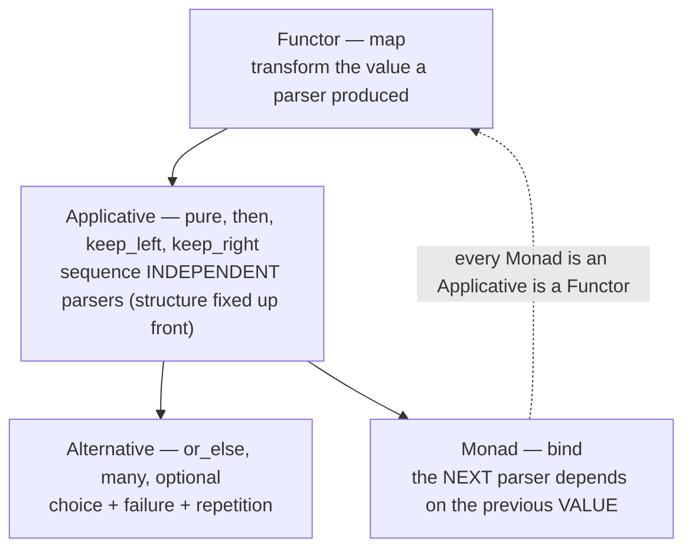

# Parser Combinators (Middle Level)

> **Roadmap:** [Functional Programming](../README.md) → Parser Combinators
>
> *A parser combinator library is a small algebra: a parser type, a handful of primitives, and a set of operators (`map`, sequence, choice, repetition) that combine parsers into bigger parsers. This level builds the full set, shows the Functor/Applicative/Monad/Alternative structure hiding inside it, and parses arithmetic with real operator precedence.*

---

## Table of Contents

1. [Introduction](#introduction)
2. [Prerequisites](#prerequisites)
3. [The Parser Type, Sharpened](#the-parser-type-sharpened)
4. [The Primitives](#the-primitives)
5. [The Combinator Set](#the-combinator-set)
   - [`map` — the Functor operation](#map--the-functor-operation)
   - [Sequencing: `andThen`, `keepLeft`, `keepRight` — the Applicative operations](#sequencing-andthen-keepleft-keepright--the-applicative-operations)
   - [`or` — the Alternative operation](#or--the-alternative-operation)
   - [`bind` — the Monad operation (context-dependent parsing)](#bind--the-monad-operation-context-dependent-parsing)
   - [Repetition: `many`, `many1`, `sepBy`, `between`, `optional`](#repetition-many-many1-sepby-between-optional)
6. [The Abstractions Behind the Combinators](#the-abstractions-behind-the-combinators)
7. [The Classic Example: Arithmetic with Precedence (`chainl1`)](#the-classic-example-arithmetic-with-precedence-chainl1)
8. [The Same Parser in Real Libraries](#the-same-parser-in-real-libraries)
9. [Trade-offs You Should Already See](#trade-offs-you-should-already-see)
10. [Common Mistakes](#common-mistakes)
11. [Test Yourself](#test-yourself)
12. [Cheat Sheet](#cheat-sheet)
13. [Summary](#summary)
14. [Further Reading](#further-reading)
15. [Related Topics](#related-topics)

---

## Introduction

> Focus: **the mechanics and the full toolkit.** Junior gave you four moves and a number parser. This level gives you the complete combinator vocabulary, names the abstractions it instantiates, and walks you through the canonical hard example — parsing `1 + 2 * 3` so it evaluates to `7`, not `9`.

At the junior level a parser was "a function `input -> (value, leftover)`" and we had four combinators. That was enough to feel the idea. It is not enough to parse anything real, because real formats have *precedence* (`*` binds tighter than `+`), *separators* (commas between list items), *brackets* (the contents matter, the brackets don't), and *context-dependence* (a length field that says how many bytes follow). Each of those needs a combinator, and each combinator turns out to be an instance of a deeper pattern you've met before.

The throughline of this file: **a parser combinator library is exactly a Functor + Applicative + Alternative + Monad, specialized to the type "function from input to result."** When you wrote `map` on a parser in junior, you wrote the Functor's `map`. When you sequence two parsers, that's the Applicative. When you write `or`, that's the Alternative. When a later parser depends on an earlier *value*, that's the Monad. The abstractions from [Functors & Applicatives](../13-functors-and-applicatives/middle.md) and [Monads — Plain English](../09-monads-plain-english/middle.md) are not academic here — they are *literally the combinator set*. This topic is where those abstractions earn their keep.

> **The frame:** you are building a tiny language for describing parsers. Its "vocabulary" is the combinators. The reason the vocabulary is exactly `map`/`sequence`/`choice`/`bind`/`repeat` and not something arbitrary is that those are the operations the Functor/Applicative/Alternative/Monad structure provides — and that structure is precisely what "compose computations that carry context" means, where the context here is "consuming input that might fail."

---

## Prerequisites

- **Required:** [`junior.md`](junior.md) — you can explain "a parser is a function `input -> (value, rest)`" and use `map`, `andThen`, `or`, `many`.
- **Required:** Comfort with higher-order functions and closures (a function that returns a function). See [First-Class & Higher-Order Functions](../01-first-class-and-higher-order-functions/middle.md).
- **Helpful:** A working feel for `map` vs `flatMap`/`bind` from [Monads — Plain English](../09-monads-plain-english/middle.md). The parser is a monad, and the `map`-vs-`bind` distinction returns here.
- **Helpful:** [Functors & Applicatives](../13-functors-and-applicatives/middle.md) — sequencing independent parsers is the Applicative; this file makes that concrete.
- **Helpful:** [Recursion & Tail Calls](../08-recursion-and-tail-calls/middle.md) — recursive grammars (expressions, nested structures) are parsed by parsers that reference themselves.

---

## The Parser Type, Sharpened

We keep the junior definition but make the result type carry an *error*, not just `None`. Knowing *why* a parse failed (and *where*) is the difference between a toy and a tool. We'll use a `Result` that is either `Ok(value, rest)` or `Err(message, position)`.

```python
# Python — the sharpened foundation: a parser returns Ok or Err (with a position).
from __future__ import annotations
from dataclasses import dataclass
from typing import Any, Callable, Generic, TypeVar, Union

T = TypeVar("T")

@dataclass(frozen=True)
class Ok(Generic[T]):
    value: T
    rest: str          # unconsumed input

@dataclass(frozen=True)
class Err:
    message: str       # what we expected
    pos: int           # how far we got (offset into the ORIGINAL input)

ParseResult = Union[Ok, Err]

# A Parser wraps a function str -> ParseResult, so we can hang methods off it.
@dataclass
class Parser:
    run: Callable[[str], ParseResult]

    def __call__(self, inp: str) -> ParseResult:
        return self.run(inp)
```

Wrapping the function in a `Parser` class (rather than leaving it a bare function as in junior) buys us *method syntax*: we can write `p.map(f)` and `p.then(q)` instead of `map_p(p, f)` and `and_then(p, q)`. The library reads like a fluent API, which matters a lot once parsers get big. Everything below hangs methods off this `Parser`.

> **Tracking position.** We pass the *whole* input around and compute offsets, or we pass an index. Carrying a position (`pos`) into errors is what lets us say "expected `)` at column 14" instead of "parse failed." It is the single most valuable upgrade over the junior version — see the [senior file](senior.md) for full error-reporting design.

---

## The Primitives

Three primitives generate everything. They are the only places that *touch raw characters*; every other parser is built from these by combination.

```python
# Python — the three primitives. Everything else is composition over these.

def satisfy(test: Callable[[str], bool], expected: str) -> Parser:
    """Match ONE character passing `test`. The atom of character-level parsing."""
    def run(inp: str) -> ParseResult:
        if inp and test(inp[0]):
            return Ok(inp[0], inp[1:])
        return Err(f"expected {expected}", 0)
    return Parser(run)

def char(c: str) -> Parser:
    """Match exactly the character c — a special case of satisfy."""
    return satisfy(lambda ch: ch == c, repr(c))

def string(s: str) -> Parser:
    """Match the literal multi-char string s."""
    def run(inp: str) -> ParseResult:
        if inp.startswith(s):
            return Ok(s, inp[len(s):])
        return Err(f"expected {s!r}", 0)
    return Parser(run)

# A handy "succeed without consuming" — wraps a plain value into a parser.
def pure(value: Any) -> Parser:
    """The Applicative's `pure`: succeed with `value`, consume nothing."""
    return Parser(lambda inp: Ok(value, inp))

# And "always fail" — useful as a base case and for custom errors.
def fail(message: str) -> Parser:
    return Parser(lambda inp: Err(message, 0))
```

`pure` deserves a second look: it is the parser that *consumes nothing and always succeeds with a fixed value*. It feels useless until you sequence parsers — it's how you inject a constant into a chain, and it's literally the Applicative/Monad `pure`/`unit` operation specialized to parsers. Keep it in mind; it shows up in `optional` and in `chainl1` below.

---

## The Combinator Set

Now the operators. Each is a method on `Parser`. We'll name the abstraction each one comes from as we go — that naming is the point of this level.

### `map` — the Functor operation

`map` transforms the *value* a parser produces, leaving *what it matches* unchanged. This makes `Parser` a **Functor**.

```python
# Python — map: Parser[A] + (A -> B) -> Parser[B]. The Functor operation.
def _map(self: Parser, f: Callable[[Any], Any]) -> Parser:
    def run(inp: str) -> ParseResult:
        r = self.run(inp)
        return Ok(f(r.value), r.rest) if isinstance(r, Ok) else r   # Err passes through
    return Parser(run)
Parser.map = _map

digit = satisfy(str.isdigit, "a digit")
digit_value = digit.map(int)        # '7' -> 7
```

Note how `Err` flows through untouched — failure short-circuits, exactly like every other functor over a "might fail" context.

### Sequencing: `andThen`, `keepLeft`, `keepRight` — the Applicative operations

Sequencing runs one parser then another. The general form keeps *both* values; the `keepLeft`/`keepRight` variants keep only one — which you need constantly (you want the value *inside* the brackets, not the brackets). These are the **Applicative** operations: combining *independent* parsers whose structure is fixed before any input flows.

```python
# Python — sequencing combinators (the Applicative layer).

def _then(self: Parser, other: Parser) -> Parser:
    """Run self, then other on the leftover; return BOTH values as a tuple."""
    def run(inp: str) -> ParseResult:
        r1 = self.run(inp)
        if isinstance(r1, Err):
            return r1
        r2 = other.run(r1.rest)
        if isinstance(r2, Err):
            return r2
        return Ok((r1.value, r2.value), r2.rest)
    return Parser(run)
Parser.then = _then

def _keep_left(self: Parser, other: Parser) -> Parser:
    """Run both; keep self's value, DISCARD other's. (Haskell's  <*  )"""
    return self.then(other).map(lambda pair: pair[0])
Parser.keep_left = _keep_left

def _keep_right(self: Parser, other: Parser) -> Parser:
    """Run both; DISCARD self's value, keep other's. (Haskell's  *>  )"""
    return self.then(other).map(lambda pair: pair[1])
Parser.keep_right = _keep_right
```

Why "Applicative"? Because in `a.then(b)`, the parser `b` does **not depend on the value `a` produced** — its structure is fixed in advance. That independence is exactly what defines applicative sequencing (versus monadic sequencing, where the next step is *chosen* based on the previous value). Most parsing is applicative: "a `(`, then an expression, then a `)`" doesn't need the value of the `(` to know what comes next. This matters for performance and error reporting, as the [professional file](professional.md) explores.

### `or` — the Alternative operation

`or` (often written `<|>`) tries the first parser; on failure it tries the second *on the original input*. This makes `Parser` an **Alternative** (a Functor/Applicative with a notion of "choice" and "failure").

```python
# Python — or: try self; if it fails, try other. The Alternative operation.
def _or(self: Parser, other: Parser) -> Parser:
    def run(inp: str) -> ParseResult:
        r = self.run(inp)
        return r if isinstance(r, Ok) else other.run(inp)   # NOTE: re-runs on ORIGINAL inp
    return Parser(run)
Parser.or_else = _or

sign = char("+").or_else(char("-"))     # a '+' OR a '-'
```

> **The subtlety to flag now (mastered at senior level):** this naive `or` *backtracks for free* — it discards `self`'s partial progress and retries `other` from the start. That's convenient but has two consequences: (1) error messages get vague (which alternative's error do you report?), and (2) on deeply nested alternatives it can be *exponentially* slow because it re-parses the same prefix many times. Real libraries make backtracking *explicit* (Parsec's `try`) so that, by default, a choice that has already consumed input commits to it. For now, know that "`or` re-runs from the start" is true of our toy and is the root of both the convenience and the cost.

### `bind` — the Monad operation (context-dependent parsing)

Sometimes the *next* parser genuinely depends on the *value* an earlier parser produced. The textbook case: a **length-prefixed** field — first parse a number `n`, then parse *exactly `n` characters*. The structure (how many chars to read) isn't known until you've parsed `n`. That dependency is what the **Monad** operation `bind` (a.k.a. `flatMap`) provides.

```python
# Python — bind: Parser[A] + (A -> Parser[B]) -> Parser[B]. The Monad operation.
# Use it ONLY when the next parser depends on the previous VALUE.
def _bind(self: Parser, f: Callable[[Any], Parser]) -> Parser:
    def run(inp: str) -> ParseResult:
        r = self.run(inp)
        if isinstance(r, Err):
            return r
        next_parser = f(r.value)        # CHOOSE the next parser using the value
        return next_parser.run(r.rest)
    return Parser(run)
Parser.bind = _bind

def take(n: int) -> Parser:
    """Consume exactly n characters."""
    def run(inp: str) -> ParseResult:
        if len(inp) >= n:
            return Ok(inp[:n], inp[n:])
        return Err(f"expected {n} more chars", 0)
    return Parser(run)

# Length-prefixed string: a number, then THAT MANY characters. Needs bind.
number = satisfy(str.isdigit, "a digit").many1().map(lambda ds: int("".join(ds)))
length_prefixed = number.keep_left(char(":")).bind(lambda n: take(n))

print(length_prefixed.run("3:abcDEF"))   # Ok('abc', 'DEF')  — read 3 because prefix said 3
print(length_prefixed.run("5:abcDEF"))   # Ok('abcDE', 'F')  — read 5 this time
```

This is the moment to internalize the `map`/`then`/`bind` decision:

| Your next step… | Use | Abstraction |
|---|---|---|
| transforms the value (returns a plain value) | `map` | Functor |
| is a *fixed* next parser (independent of the value) | `then` / `keep_left` / `keep_right` | Applicative |
| is *chosen based on* the previous value | `bind` | Monad |

> **Prefer the weakest one that works.** If your sequencing is applicative (structure fixed up front — the common case), use `then`/`keep_*`, not `bind`. Applicative parsers are easier for a library to analyze, can report *all* errors, and read more declaratively. Reach for `bind` only for genuine value-dependence like length prefixes, indentation-sensitive layouts, or "the tag byte tells me which record type follows." This mirrors the [Functor → Applicative → Monad ladder](../13-functors-and-applicatives/middle.md): use the least powerful rung that expresses the problem.

### Repetition: `many`, `many1`, `sepBy`, `between`, `optional`

Repetition combinators are where real grammars live. All derive from `or` + `then` + recursion.

```python
# Python — the repetition family.

def _many(self: Parser) -> Parser:
    """Zero or more. NEVER fails (returns [] on zero matches)."""
    def run(inp: str) -> ParseResult:
        values, rest = [], inp
        while True:
            r = self.run(rest)
            if isinstance(r, Err):
                break
            if r.rest == rest:          # guard: parser matched but consumed nothing
                raise RuntimeError("many: parser made no progress (infinite loop)")
            values.append(r.value)
            rest = r.rest
        return Ok(values, rest)
    return Parser(run)
Parser.many = _many

def _many1(self: Parser) -> Parser:
    """One or more. (Haskell `some`.) Fails if there isn't at least one match."""
    return self.then(self.many()).map(lambda pair: [pair[0]] + pair[1])
Parser.many1 = _many1

def _sep_by(self: Parser, sep: Parser) -> Parser:
    """Zero or more `self`, separated by `sep`. E.g. comma-separated values."""
    rest_items = sep.keep_right(self).many()          # (sep item)*
    non_empty = self.then(rest_items).map(lambda p: [p[0]] + p[1])
    return non_empty.or_else(pure([]))                # allow the empty list
Parser.sep_by = _sep_by

def between(open_p: Parser, close_p: Parser, inner: Parser) -> Parser:
    """Parse `inner` surrounded by open/close, keeping ONLY inner's value."""
    return open_p.keep_right(inner).keep_left(close_p)

def _optional(self: Parser, default=None) -> Parser:
    """Try self; on failure, succeed with `default`, consuming nothing."""
    return self.or_else(pure(default))
Parser.optional = _optional
```

Three things to absorb:

- **`sepBy` is how you parse lists** — `[1, 2, 3]` is `number.sep_by(char(","))` between brackets. It handles the "no trailing comma, but commas between" logic once, correctly, so you never write it by hand again.
- **`between` is how you parse bracketed things** while throwing the brackets away — exactly `keep_right` then `keep_left`. `between(char("("), char(")"), expr)` gives you the expression *inside* the parens.
- **The progress guard in `many` matters.** If you `many` a parser that can succeed *without consuming input* (like `optional`), you get an infinite loop: it "succeeds" forever on the same position. Real libraries detect this; our guard raises rather than hanging. This is a classic combinator footgun.

---

## The Abstractions Behind the Combinators

Pull the thread tight. Everything above is one structure seen four ways:



| Abstraction | Parser operation(s) | "Context" it manages | When you need it |
|---|---|---|---|
| **Functor** | `map` | a value that might-fail-to-parse | always — transforming results |
| **Applicative** | `pure`, `then`, `keep_left/right` | sequencing where structure is static | the bulk of parsing |
| **Alternative** | `or_else`, `many`, `many1`, `optional` | choice, repetition, failure | choices and loops |
| **Monad** | `bind` | sequencing where the next step depends on a value | length-prefixed / context-sensitive |

This is *the* payoff of the abstraction-heavy earlier topics. If you understood Functor/Applicative/Monad as "boxes with `map`/`ap`/`bind`," a parser is just one more box — the box being "a computation that consumes input and may fail." Once you see that, you don't memorize combinators; you *derive* them: "I need to transform a value → that's `map`; sequence two → `then`; choose → `or`; depend on a value → `bind`."

---

## The Classic Example: Arithmetic with Precedence (`chainl1`)

Here is the example every parsing tutorial owes you: parse `1 + 2 * 3` and get **7**, respecting that `*` binds tighter than `+`. The trick is *layering by precedence* and a combinator called `chainl1` that handles **left-associative** binary operators.

The grammar, in plain words and in layers (lowest precedence outermost):

```
expr   = term   ('+' | '-')  term ...      ← + and - chain left-to-right
term   = factor ('*' | '/')  factor ...    ← * and / bind tighter
factor = number  |  '(' expr ')'           ← atoms, and parens reset precedence
```

`chainl1(p, op)` parses one `p`, then *zero or more* `(op p)` pairs, and folds them **left-associatively**: `1 - 2 - 3` becomes `(1 - 2) - 3 = -4`, not `1 - (2 - 3) = 2`. Left-association is what you want for `-` and `/`; getting it wrong silently produces wrong answers.

```python
# Python — arithmetic evaluator via combinators, with correct precedence.

ws = satisfy(str.isspace, "space").many()             # optional whitespace

def token(p: Parser) -> Parser:                       # a parser, then skip trailing ws
    return p.keep_left(ws)

number = token(
    satisfy(str.isdigit, "a digit").many1()
        .map(lambda ds: int("".join(ds)))
)

def chainl1(p: Parser, op: Parser) -> Parser:
    """Left-associative chain: p (op p)*, folding results with the op functions."""
    def run(inp: str) -> ParseResult:
        r = p.run(inp)
        if isinstance(r, Err):
            return r
        acc, rest = r.value, r.rest
        while True:
            ro = op.run(rest)                         # try to read an operator
            if isinstance(ro, Err):
                break
            rp = p.run(ro.rest)                       # then the right operand
            if isinstance(rp, Err):
                break
            acc = ro.value(acc, rp.value)             # apply op to (acc, operand) — LEFT fold
            rest = rp.rest
        return Ok(acc, rest)
    return Parser(run)

# Operators carry the actual function to apply, so chainl1 can fold with them:
add = token(char("+")).map(lambda _: lambda a, b: a + b)
sub = token(char("-")).map(lambda _: lambda a, b: a - b)
mul = token(char("*")).map(lambda _: lambda a, b: a * b)
div = token(char("/")).map(lambda _: lambda a, b: a // b)

# Forward reference: `factor` needs `expr`, but `expr` is defined after.
# We wrap in a lambda-backed Parser so the recursion resolves at call time.
expr = Parser(lambda inp: expr_impl.run(inp))         # placeholder; filled below

factor = number.or_else(
    between(token(char("(")), token(char(")")), expr)  # '(' expr ')'  — recursion!
)
term      = chainl1(factor, mul.or_else(div))         # * and / — tighter
expr_impl = chainl1(term,   add.or_else(sub))         # + and - — looser

print(ws.keep_right(expr).run("1 + 2 * 3"))    # Ok(7, '')   ← 2*3 first, then +1
print(ws.keep_right(expr).run("(1 + 2) * 3"))  # Ok(9, '')   ← parens override precedence
print(ws.keep_right(expr).run("10 - 2 - 3"))   # Ok(5, '')   ← (10-2)-3, left-associative
```

Study the three results. `1 + 2 * 3 = 7` proves precedence works (multiplication grabbed its operands before addition saw them, because `term` sits *inside* `expr`). `(1 + 2) * 3 = 9` proves parentheses reset precedence (the recursive `expr` inside `between`). `10 - 2 - 3 = 5` proves `chainl1` folds left (not `10 - (2 - 3) = 11`).

The deep lesson: **precedence is encoded as grammar *layering*, not as a special algorithm.** Each precedence level is a `chainl1` over the next-tighter level. To add a new operator, you add it to the right layer. To add exponentiation (right-associative, tighter than `*`), you add a new layer using `chainr1` (the right-folding sibling). The structure scales by *adding combinators*, the same property you saw in junior — now applied to a real grammar.

> **`chainl1` vs `chainr1`:** `chainl1` folds left — for `-`, `/`, and most binary operators. `chainr1` folds right — for `^` (exponentiation: `2^3^2 = 2^9`, not `8^2`) and right-associative things like list cons. Picking the wrong one is a *silent* bug: the parse succeeds but computes the wrong value. Always match associativity to the operator's real mathematics.

---

## The Same Parser in Real Libraries

You built `chainl1` by hand for understanding. Real libraries ship it. The same expression parser, idiomatically:

```haskell
-- Haskell (megaparsec) — expression parser via the built-in `makeExprParser`,
-- which takes an operator TABLE (precedence + associativity) and the atom parser.
import Text.Megaparsec
import Text.Megaparsec.Char
import Control.Monad.Combinators.Expr

term :: Parser Int
term = parens expr <|> integer            -- atom: a number or a parenthesized expr

expr :: Parser Int
expr = makeExprParser term table
  where
    table =                               -- HIGHER in the list = TIGHTER binding
      [ [ InfixL (mul <$ symbol "*"), InfixL (div <$ symbol "/") ]
      , [ InfixL (add <$ symbol "+"), InfixL (sub <$ symbol "-") ] ]
-- `InfixL` = left-associative infix. The table replaces our manual chainl1 layering.
```

```javascript
// JavaScript (Parsimmon) — same idea; Parsimmon ships `.chain` (bind) and you
// build precedence by layering, like our Python. Libraries vary in how much
// they pre-package; the SHAPE (layer by precedence) is universal.
import P from "parsimmon";

const number = P.regexp(/[0-9]+/).map(Number).skip(P.optWhitespace);
const Lang = P.createLanguage({
  expr:   (r) => P.seqMap(r.term, P.seq(P.oneOf("+-").skip(P.optWhitespace), r.term).many(),
                          (first, rest) => rest.reduce((a, [op, b]) => op === "+" ? a + b : a - b, first)),
  term:   (r) => P.seqMap(r.factor, P.seq(P.oneOf("*/").skip(P.optWhitespace), r.factor).many(),
                          (first, rest) => rest.reduce((a, [op, b]) => op === "*" ? a * b : a / b, first)),
  factor: (r) => number.or(r.expr.wrap(P.string("(").skip(P.optWhitespace),
                                       P.string(")").skip(P.optWhitespace))),
});
Lang.expr.tryParse("1 + 2 * 3");   // 7
```

Note Haskell's `makeExprParser` with an *operator table* — the mature ergonomic answer to precedence. You declare a table of operators with their precedence and associativity, and the library generates the layered `chainl1`/`chainr1` structure for you. That's where you'll land in production; building it by hand once is how you understand what the table compiles to.

---

## Trade-offs You Should Already See

You don't need senior-level judgment yet, but three trade-offs are visible from the mechanics alone:

1. **Convenience vs error quality.** Our naive `or` backtracks silently, which makes errors vague ("expected a digit" when the real problem was a missing `)` three tokens back). Better messages require committing to a branch once it's consumed input — the `try`/commit machinery of real libraries. Convenience and good errors pull against each other.
2. **Applicative vs Monadic style.** Applicative sequencing (`then`/`keep_*`) keeps the grammar *static and analyzable* — a library can see the whole structure and, for validation-style parsers, report *all* errors. `bind` makes the grammar *dynamic* (the next parser depends on a value), which is strictly more powerful but opaque to analysis. Use the weakest that works.
3. **Combinators vs regex vs generators.** For a flat pattern, a regex is shorter. For a recursive grammar, combinators win on readability and structured output. For a giant performance-critical grammar (a production language compiler), a generated or hand-written parser is faster. These three tools occupy different points; the senior file maps the full landscape.

---

## Common Mistakes

1. **Using `bind` where `then`/`map` suffice.** If the next parser doesn't depend on the previous *value*, you don't need a monad — use applicative sequencing. Over-using `bind` makes grammars opaque and harder for libraries (and readers) to analyze.
2. **`many` over a parser that can succeed without consuming input.** `many(optional(...))` loops forever — it "succeeds" at the same position endlessly. Guard against zero-progress, or never `many` a possibly-empty parser.
3. **Wrong associativity (`chainl1` vs `chainr1`).** `10 - 2 - 3` with a right fold gives `11` instead of `5`; `2^3^2` with a left fold gives `64` instead of `512`. The parse *succeeds* — the bug is silent. Match the fold direction to the operator's real associativity.
4. **Forgetting whitespace.** Real input has spaces. If you don't `keep_left(ws)` after tokens (or build a tokenizer), `"1 + 2"` fails at the space. Decide on a whitespace strategy (tokenize, or skip-after-each-token) and apply it consistently.
5. **Putting precedence in the wrong layer.** Precedence *is* the nesting order of your `chainl1` calls. Tighter operators go in *inner* (later-parsed) layers. Swapping layers swaps precedence — and again, it parses fine but computes wrong.
6. **Building the brackets into the value.** Use `between`/`keep_right`/`keep_left` to *discard* structural tokens (`(`, `,`, `:`) and keep only the meaningful values. Otherwise your AST is littered with punctuation.

---

## Test Yourself

1. Name the four abstractions a parser combinator library instantiates, and the parser operation that comes from each.
2. You're parsing `key=value`. The `value` doesn't depend on what `key` was. Should the sequencing use `then` (applicative) or `bind` (monad)? Why?
3. You're parsing a binary format where the first byte `n` says how many bytes of payload follow. `then` or `bind`? Why is this the *opposite* answer to Q2?
4. Write, in words, what `between(char("["), char("]"), number.sep_by(char(",")))` parses, and what its value is for input `"[1,2,3]"`.
5. `chainl1(number, sub)` parses `"9-3-2"`. What value does it produce, and what would `chainr1` produce instead?
6. Why does `many(optional(char("x")))` hang, and how do real libraries prevent it?
7. Our naive `or` backtracks "for free" by retrying the alternative from the original input. Name one good consequence and one bad consequence of that.

<details>
<summary>Answers</summary>

1. **Functor** → `map` (transform the value). **Applicative** → `pure`/`then`/`keep_left`/`keep_right` (sequence independent parsers). **Alternative** → `or_else`/`many`/`optional` (choice, repetition, failure). **Monad** → `bind` (next parser depends on the previous value).
2. **`then`** (applicative). The `value` parser's *structure* is fixed regardless of what `key` was — there's no value-dependence — so you don't need the extra power of `bind`. Prefer the weakest combinator that works; applicative style stays analyzable.
3. **`bind`** (monad). The number of payload bytes to read *depends on the value* `n` you just parsed, so the next parser (`take(n)`) is *chosen* from a parsed value. That's exactly value-dependence, which only `bind` provides. It's the opposite of Q2 because here the later step genuinely needs the earlier *value*, not just the earlier *position*.
4. It parses a `[`, then zero-or-more numbers separated by commas, then a `]`, **keeping only the list of numbers** (the brackets and commas are discarded). For `"[1,2,3]"` the value is `[1, 2, 3]`.
5. `chainl1` folds left: `(9 - 3) - 2 = 4`. `chainr1` would fold right: `9 - (3 - 2) = 8`. For subtraction, left (`chainl1`) is correct.
6. `optional` succeeds *without consuming input* when there's no `x`, so `many` keeps "succeeding" at the same position forever, never advancing. Real libraries either forbid `many` over a parser that can match empty, or detect zero-progress and stop/raise (our `if r.rest == rest` guard).
7. **Good:** it makes choice ergonomic — you can try alternatives without manually saving/restoring position. **Bad:** it can re-parse the same prefix repeatedly (potentially exponential time on nested choices), and it muddies error messages (which alternative's error do you report?). Real libraries make backtracking explicit (`try`) to control both.

</details>

---

## Cheat Sheet

| Combinator | Type (informal) | Abstraction | Use for |
|---|---|---|---|
| `map(f)` | `P[A] → P[B]` | Functor | transform the parsed value |
| `pure(x)` | `A → P[A]` | Applicative | succeed with `x`, consume nothing |
| `then(q)` | `P[A] → P[(A,B)]` | Applicative | A then B, keep both |
| `keep_left(q)` / `<*` | `P[A] → P[A]` | Applicative | A then B, keep A |
| `keep_right(q)` / `*>` | `P[A] → P[B]` | Applicative | A then B, keep B |
| `or_else(q)` / `<\|>` | `P[A] → P[A]` | Alternative | A, or else B |
| `bind(f)` / `flatMap` | `P[A] → P[B]` | Monad | next parser *depends on* A's value |
| `many()` | `P[A] → P[[A]]` | Alternative | zero or more |
| `many1()` / `some` | `P[A] → P[[A]]` | Alternative | one or more |
| `sep_by(sep)` | `P[A] → P[[A]]` | derived | list with separators |
| `between(o,c,p)` | — | derived | bracketed, keep inner |
| `optional(d)` | `P[A] → P[A]` | derived | maybe, with default |
| `chainl1(p,op)` | — | derived | left-assoc binary operators |
| `chainr1(p,op)` | — | derived | right-assoc binary operators |

> **Decision rule:** transform a value → `map`. Sequence with fixed structure → `then`/`keep_*`. Choose → `or_else`. Repeat → `many`/`sep_by`. Next parser depends on a value → `bind` (and only then). Precedence → layer `chainl1`/`chainr1`, tighter operators inner.

---

## Summary

- A parser combinator library is a small **algebra**: a parser type (`input → Ok(value, rest) | Err(msg, pos)`), three primitives (`satisfy`/`char`/`string` plus `pure`/`fail`), and a combinator set.
- The combinators are exactly the **Functor** (`map`), **Applicative** (`pure`, `then`, `keep_left/right`), **Alternative** (`or_else`, `many`, `optional`), and **Monad** (`bind`) operations specialized to "a computation that consumes input and may fail." This topic is where those abstractions become concrete tools.
- **Prefer the weakest combinator that works:** `map` < applicative sequencing < `bind`. Use `bind` only for genuine value-dependence (length-prefixed / context-sensitive formats); most parsing is applicative.
- The repetition family — `many`, `many1`, `sepBy`, `between`, `optional` — is derived from choice + sequence + recursion, and covers lists, brackets, and optional parts.
- **Operator precedence is grammar layering**: a `chainl1` over the next-tighter level, recursing into parenthesized sub-expressions. `1 + 2 * 3 = 7` falls out for free. Match `chainl1`/`chainr1` to the operator's real associativity — the wrong choice is a *silent* bug.
- Real libraries (`megaparsec`'s `makeExprParser` with an operator table, Parsimmon, parsy) ship all of this; building it once by hand is how you understand what they compile to.
- Visible trade-offs already: convenience-vs-error-quality (naive backtracking), applicative-vs-monadic style, and combinators-vs-regex-vs-generators. The [senior file](senior.md) turns these into design judgment.

---

## Further Reading

- **"Functional Pearls: Monadic Parsing in Haskell"** — Hutton & Meijer (1998) — derives this exact algebra; the canonical reference for the combinator set.
- **"Understanding Parser Combinators"** (4-part series) — Scott Wlaschin (fsharpforfunandprofit.com) — builds the full library and an expression parser step by step in F#.
- **megaparsec tutorial** — Mark Karpov — the modern Haskell library; the chapters on `makeExprParser` and the operator table are the mature precedence story.
- **Parsimmon** and **parsy** docs — JS and Python combinator libraries; reading their combinator lists reinforces that every library ships the same set under different names.

---

## Related Topics

- [Functors & Applicatives](../13-functors-and-applicatives/middle.md) — `map` and applicative sequencing are the bulk of the combinator set; this topic is their flagship application.
- [Monads — Plain English](../09-monads-plain-english/middle.md) — `bind` for context-dependent parsing; the `map`-vs-`bind` decision returns here verbatim.
- [Composition](../05-composition/middle.md) — combinators compose parsers exactly as function composition composes functions.
- [Algebraic Data Types](../06-algebraic-data-types/middle.md) — the AST your parser builds (an `Expr` of `Add`/`Mul`/`Num`) is a recursive sum type.
- [Recursion & Tail Calls](../08-recursion-and-tail-calls/middle.md) — recursive grammars (expressions inside parentheses) are parsed by self-referential parsers.
- [Currying & Partial Application](../07-currying-and-partial-application/middle.md) — applicative parsing builds values by partially applying a constructor across sequenced parsers.
