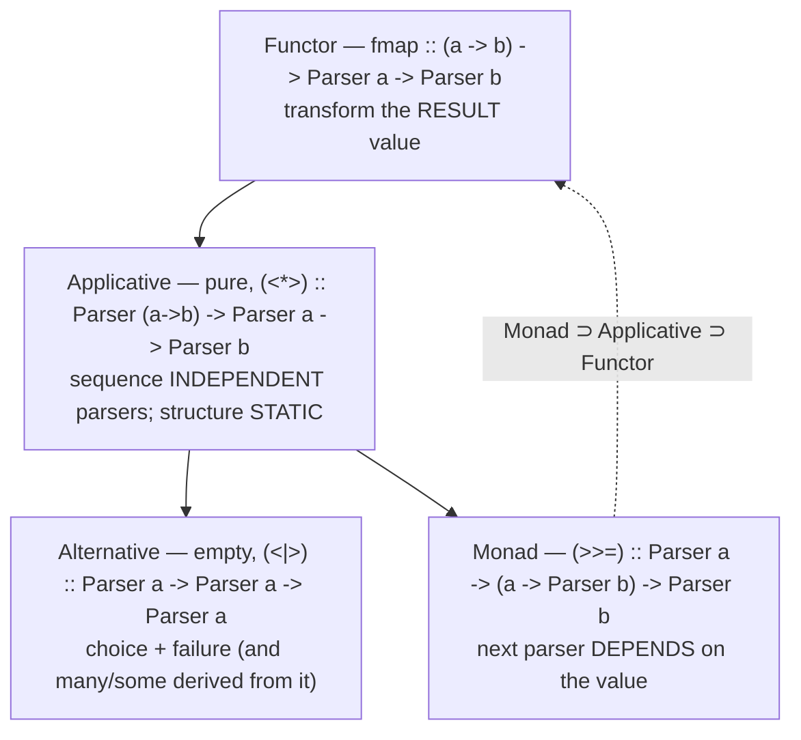

# Parser Combinators (Professional Level)

> **Roadmap:** [Functional Programming](../README.md) → Parser Combinators
>
> *By this level you can build the library and choose the right tool. The professional questions are different: what *exactly* is the parser type as a Functor/Applicative/Monad/Alternative, why does the applicative-vs-monadic choice decide whether you can batch errors and analyze the grammar, what does each combinator cost the allocator, and why do combinators lose to generated and hand-written parsers on hot paths — and when does that loss actually matter?*

---

## Table of Contents

1. [Introduction](#introduction)
2. [Prerequisites](#prerequisites)
3. [The Parser Type, Formally: Functor → Applicative → Alternative → Monad](#the-parser-type-formally-functor--applicative--alternative--monad)
4. [Why Applicative Parsers Are Special: Static Analysis & Error Accumulation](#why-applicative-parsers-are-special-static-analysis--error-accumulation)
5. [The State-Passing Core and the Laws](#the-state-passing-core-and-the-laws)
6. [Backtracking Cost, Formally](#backtracking-cost-formally)
7. [Packrat Parsing: Linear Time for a Memory Price](#packrat-parsing-linear-time-for-a-memory-price)
8. [Allocation per Combinator: Why Combinators Lose the Hot Path](#allocation-per-combinator-why-combinators-lose-the-hot-path)
9. [Streaming, Incremental, and Zero-Copy Parsing](#streaming-incremental-and-zero-copy-parsing)
10. [Measurement](#measurement)
11. [Common Mistakes](#common-mistakes)
12. [Test Yourself](#test-yourself)
13. [Cheat Sheet](#cheat-sheet)
14. [Summary](#summary)
15. [Further Reading](#further-reading)
16. [Related Topics](#related-topics)

---

## Introduction

> Focus: **the algebra that makes the combinator set principled, and the runtime price that decides where it belongs.** Two directions at once — upward into the Functor/Applicative/Alternative/Monad structure and its laws, downward into allocation-per-combinator, backtracking complexity, and the streaming concerns that separate a toy from `attoparsec`/`nom`.

The senior file framed parsing as a four-tool design choice. This file goes one layer down in both directions.

**Upward, into the algebra.** A parser is not "a function with a `bind`." It is a *state-transition function* `s -> (Result a, s)` that is simultaneously a **Functor**, an **Applicative**, an **Alternative**, and a **Monad** — and *which* of those four interfaces you sequence with is a load-bearing decision, not a stylistic one. Applicative sequencing keeps the grammar's *structure static and inspectable*, which is the difference between a parser that can accumulate all errors and one that short-circuits on the first; between a grammar you can analyze and optimize ahead of time and one you cannot. The four interfaces and their laws are the theory that makes the combinator set *the* combinator set and not an arbitrary grab-bag.

**Downward, into the runtime.** Every combinator allocates: a closure, a result object, often a wrapper per step. A naive `<|>` re-parses shared prefixes, and the worst case is exponential. This is precisely why production language compilers do *not* use combinators on their hot paths — and why high-performance combinator libraries (`attoparsec`, `nom`) bend the clean abstraction (dropping position tracking, going zero-copy, fusing) to claw the cost back. The professional skill is knowing which shapes optimize, what each library traded away to get fast, and when the cost is irrelevant (99% of parsing) versus when it's your bottleneck.

> **The mental model:** a parser is a *contract with two readers*. The first is the grammar author, who relies on the **four interfaces and their laws** to compose and refactor safely. The second is the runtime — the allocator, the GC, the branch predictor — which charges you per combinator and per backtrack. Honor both: choose the *weakest* interface that expresses the grammar (it's the most analyzable and often the fastest), and know the allocation/backtracking cost you've signed up for.

---

## Prerequisites

- **Required:** Fluency with [`senior.md`](senior.md) — you can choose among regex/combinators/generator/hand-written, and you understand backtracking, PEG-vs-CFG, and left recursion.
- **Required:** The Functor → Applicative → Monad ladder from [Functors & Applicatives](../13-functors-and-applicatives/professional.md) and [Monads — Plain English](../09-monads-plain-english/professional.md), including the three monad laws and Kleisli composition.
- **Required:** A working model of a managed runtime — heap vs stack, generational GC, closure allocation, JIT inlining/escape analysis (see [Bad Structure → professional](../../anti-patterns/01-development/01-bad-structure/professional.md) for the vocabulary).
- **Helpful:** Exposure to one *fast* combinator library (`attoparsec`, `nom`, `FastParse`) — they make the cost trade-offs concrete by showing what was sacrificed for speed.
- **Helpful:** the profiling-techniques and big-o-analysis skills for the measurement and complexity arguments.

> **Discipline carried from the runtime track:** every performance claim below is paired with the instrument that would *falsify* it on *your* grammar and *your* input. Illustrative numbers are labeled as such. A parser's worst case depends entirely on its grammar's backtracking structure — measure yours.

---

## The Parser Type, Formally: Functor → Applicative → Alternative → Monad

A parser is a function from parser state to a result and a new state. In Haskell-flavored types:

```haskell
-- The parser type: a state-transition function. `s` is the input + position.
newtype Parser a = Parser { runParser :: State -> (Either ParseError a, State) }
-- State carries the remaining input and the current position.
```

This single type is an instance of four typeclasses, each adding one capability. The four together *are* the combinator set; everything in [`middle.md`](middle.md) is a method of one of them.



| Interface | Operation | Adds | Parsing capability |
|---|---|---|---|
| **Functor** | `fmap` / `<$>` | transform the result | `digit <&> digitToInt` |
| **Applicative** | `pure`, `<*>`, `<*`, `*>` | combine *independent* parsers | `(,) <$> name <*> age` — structure fixed up front |
| **Alternative** | `empty`, `<\|>`, `many`, `some` | choice, failure, repetition | `keyword <\|> ident`, `many digit` |
| **Monad** | `>>=` | parser *chosen from* a value | length-prefixed, context-sensitive |

The instances, written out, are short — and writing them is the clearest possible statement of what each interface *means* for a parser:

```haskell
instance Functor Parser where
  -- map over the result; thread the state unchanged on success, propagate error
  fmap f (Parser p) = Parser $ \s -> case p s of
      (Right a, s') -> (Right (f a), s')
      (Left e,  s') -> (Left e,      s')

instance Applicative Parser where
  pure a = Parser $ \s -> (Right a, s)              -- succeed, consume nothing
  -- run pf to get a function, THEN px to get an arg, apply. Structure is STATIC:
  -- px does not depend on pf's RESULT — only on the state pf leaves behind.
  (Parser pf) <*> (Parser px) = Parser $ \s -> case pf s of
      (Right f, s')  -> case px s' of
          (Right x, s'') -> (Right (f x), s'')
          (Left e,  s'') -> (Left e,      s'')
      (Left e, s') -> (Left e, s')

instance Monad Parser where
  -- run p, then CHOOSE the next parser by applying f to the RESULT value.
  (Parser p) >>= f = Parser $ \s -> case p s of
      (Right a, s') -> runParser (f a) s'           -- f a depends on the value a!
      (Left e,  s') -> (Left e, s')
```

The decisive line is in `<*>` versus `>>=`. In `<*>`, the second parser `px` is *fixed before any input flows* — it depends on the *state* `pf` leaves behind (the position), but **not on `pf`'s result value**. In `>>=`, the next parser is `f a` — it is *computed from the value* `a`. That distinction is the entire reason applicative parsers can be statically analyzed and monadic ones cannot: **you cannot inspect a grammar whose shape isn't decided until values flow at runtime.**

> **The professional reading:** the four interfaces are a *capability ladder*, and each rung you climb costs you analyzability. `fmap` < `<*>` < `<|>`/`many` < `>>=`. The applicative `<*>` knows its whole shape statically; the monadic `>>=` does not. Choose the *weakest* rung that expresses your grammar — not for purity points, but because static structure is what lets a library accumulate errors, optimize, and reason about your parser ([next section](#why-applicative-parsers-are-special-static-analysis--error-accumulation)).

---

## Why Applicative Parsers Are Special: Static Analysis & Error Accumulation

This is the most consequential theoretical point in parser combinators, and it's directly practical.

Because an **applicative** parser's structure is fixed before any input flows, a library can *walk the parser as data* and do things a monadic parser forbids:

### Error accumulation vs short-circuit

A **monadic** parser *must* short-circuit on the first error: `p >>= f` cannot run `f` if `p` failed (there's no value to feed it). So a monadic validation of a form stops at the first bad field.

An **applicative** parser, because all its sub-parsers' structures are known independently, can run *all* of them and **accumulate every error**:

```haskell
-- Applicative validation accumulates ALL errors (using Validation, an
-- applicative that is NOT a monad precisely so it can collect errors).
-- Monadic (>>=) would stop at the first failure; <*> runs all three.
data RegForm = RegForm Name Email Age

validate :: RawForm -> Validation [Error] RegForm
validate raw = RegForm
   <$> validateName  (rawName raw)     -- runs even if...
   <*> validateEmail (rawEmail raw)    -- ...this fails, and...
   <*> validateAge   (rawAge raw)      -- ...this too — all errors collected
-- Result: Failure ["name too long", "email invalid", "age not a number"]
```

The deep fact: **`Validation` is an applicative that deliberately is *not* a monad.** It cannot have a lawful `>>=` *and* accumulate errors — because `>>=`'s type forces sequential dependence, which forces short-circuit. Choosing applicative here isn't a style preference; it's the *only* way to get all-errors-at-once. A parser that reports "you have 5 syntax errors" instead of "error at line 3" is leaning on exactly this. (See [Functors & Applicatives](../13-functors-and-applicatives/professional.md) for the `Validation` law detail.)

### Grammar inspection and optimization

Static applicative structure also enables:

- **Computing the FIRST set** (which input characters a parser can start with) ahead of time, so a choice `<|>` can dispatch on the next character *without trying-and-backtracking* — turning O(alternatives) choice into O(1) lookup. This is how fast libraries make `<|>` cheap.
- **Detecting unproductive grammars** (a `many` over a possibly-empty parser — the infinite-loop bug from [`middle.md`](middle.md)) statically, because the structure is visible.
- **Free applicatives / applicative parsing frameworks** that reify the grammar as a value to be optimized or pretty-printed.

> **The professional rule, sharpened:** prefer `<*>`/`<*`/`*>` over `>>=` not as a aesthetic but because **applicative structure is inspectable and monadic structure is opaque.** Use `>>=` only for genuine value-dependence (length-prefixed records, indentation-sensitive layout, content negotiation where a tag byte selects the next format). Every `>>=` you add is a region of your grammar the library can no longer see through — losing error accumulation, FIRST-set dispatch, and static productivity checks for that region.

---

## The State-Passing Core and the Laws

The parser type is, under the hood, the **State monad** (threading the remaining input) stacked with an **Either/error** effect (the failure) and a notion of **choice** (Alternative). Recognizing this is what lets you reason about it with the laws you already know.

The combinator set obeys the standard laws, and those laws are your **refactoring license** — the same way they are for any monad ([Monads → professional](../09-monads-plain-english/professional.md)):

| Law | For parsers, it means |
|---|---|
| **Functor:** `fmap id = id` | mapping the identity over a parser changes nothing — deletable. |
| **Applicative composition** | `(p <* q) <* r` ≡ `p <* (q <* r)` — you may regroup sequenced parsers freely. |
| **Monad associativity** | `(p >>= f) >>= g` ≡ `p >>= (\x -> f x >>= g)` — extract a sub-parser into a named function, safely. |
| **Alternative associativity** | `(a <\|> b) <\|> c` ≡ `a <\|> (b <\|> c)` — regroup choices freely (but order still matters — PEG!). |

The associativity laws are why you can **extract a chunk of a grammar into a named parser and inline it back with zero behavioral change** — the bread-and-butter refactor of growing a grammar. The Alternative laws come with the PEG caveat from [`senior.md`](senior.md): regrouping `<|>` is safe, but *reordering* alternatives is **not** (ordered choice makes order semantic). So associativity holds; commutativity does not.

```haskell
-- Alternative also has a left-zero and identity (the "monoid on parsers"):
empty <|> p   ≡  p            -- empty is the identity of choice
p <|> empty   ≡  p
-- and `many`/`some` are DEFINED from <|> and pure:
some p = (:) <$> p <*> many p    -- one then many
many p = some p <|> pure []      -- some, or nothing
```

> **Why this matters at this level:** the laws turn "I rearranged the grammar and hope it still works" into "I applied associativity, which guarantees identical behavior." A custom combinator that *breaks* a law (e.g. a `<|>` that's secretly order-independent, or a `many` that dedups) makes these refactors silently wrong — the same landmine as an unlawful monad. Property-test your custom combinators against the laws ([Measurement](#measurement)).

---

## Backtracking Cost, Formally

The senior file said naive `<|>` "can be exponential." Here is the precise complexity story.

### The exponential worst case

For a grammar with choices over alternatives sharing prefixes, naive backtracking re-parses shared prefixes. Model a rule `R = A R | B R | C` where `A`/`B` parse some shared structure: each failed alternative re-runs the shared work, and nesting depth `d` with branching `k` gives **O(kᵈ)** work — exponential in nesting depth. This is the *same phenomenon* as catastrophic regex backtracking (`(a|a)*` on a non-matching suffix), and it has the same cause: no memoization of intermediate results.

### Committed choice flattens it

PEG combinator libraries default to **committed choice**: `<|>` backtracks *only* if the left parser failed **without consuming input**. Once a parser consumes a character, the choice commits and failure is fatal. This bounds the work: each input position is the start of at most one committed branch attempt, so a *left-factored, commit-by-default* grammar runs in **O(n)** to **O(n·d)** rather than exponential. The cost moved from runtime (re-parsing) to design-time (you must left-factor and place `try` deliberately).

```haskell
-- The complexity difference is a grammar-shape decision.
-- BAD (exponential risk): each alternative re-parses the shared prefix.
expr = try (term *> symbol "+" *> term)
   <|> try (term *> symbol "-" *> term)
   <|>      term
-- GOOD (linear): parse the shared prefix ONCE, then decide.
expr = do
  t <- term
  (symbol "+" *> ((t +) <$> term)) <|> (symbol "-" *> ((t -) <$> term)) <|> pure t
-- The shared `term` is parsed once; the choice is over the SUFFIX only.
```

The second form is *left-factoring*: pull the shared prefix out so the choice happens after it, over divergent suffixes. It converts a potentially exponential grammar into a linear one and is the single most important performance refactor in combinator parsing.

> **The complexity table to carry:**
>
> | Grammar shape | Naive `<|>` (full backtrack) | Committed + left-factored | Packrat |
> |---|---|---|---|
> | No shared prefixes | O(n) | O(n) | O(n) |
> | Shared prefixes, nested choices | **O(kᵈ) — exponential** | O(n·d) | **O(n)** guaranteed |
> | Pathological PEG | unbounded | depends on `try` placement | O(n), O(n) memory |
>
> Default to committed choice + left-factoring; reach for packrat only when backtracking is unavoidable and inputs are large.

---

## Packrat Parsing: Linear Time for a Memory Price

**Packrat parsing** guarantees **linear time** for any PEG by memoizing: for each (parser, position) pair, store the result the first time it's computed and reuse it on every subsequent attempt. Since there are O(rules) parsers and O(n) positions, and each (rule, position) is computed once, total work is **O(n · rules) = O(n)** for a fixed grammar — at the cost of an **O(n · rules) memo table**.

```python
# Python — packrat memoization: cache (parser_id, position) -> result.
# This is the heart of guaranteed-linear PEG parsing.
def packrat(parser, parser_id):
    cache = {}                                   # (parser_id, pos) -> result
    def run(inp, pos):
        key = (parser_id, pos)
        if key in cache:
            return cache[key]                    # reuse — never re-parse this prefix
        result = parser(inp, pos)
        cache[key] = result
        return result
    return run
```

The trade-off, stated precisely:

- **You buy:** elimination of the exponential backtracking risk — *guaranteed* linear time regardless of grammar shape. No more "fast on tests, quadratic in prod."
- **You pay:** O(n) memory for the memo table (a result per rule per position), and constant-factor overhead on *every* parse (the cache lookup), which can make packrat *slower* than committed-choice on grammars that barely backtrack. It also complicates **streaming** (you must retain positions you might revisit) and **semantic side effects** (memoized parsers must be pure, or the cache returns stale effects).

When packrat is right: large inputs, unavoidable backtracking, memory is plentiful, and you value the worst-case guarantee. When it's wrong: streaming/bounded-memory parsing, grammars that left-factor cleanly (committed choice is faster and lighter), or hot paths where the per-position cache overhead dominates. Most production combinator libraries *don't* default to packrat for exactly these reasons — they default to committed choice and let you opt into memoization where measured.

> **Professional judgment:** packrat converts a *time* risk into a *space* cost with a guarantee attached. It's the right tool when the exponential risk is real and unfixable by left-factoring, and the wrong tool when it taxes every parse for a backtracking cost you don't actually incur. Measure backtracking before adopting it.

---

## Allocation per Combinator: Why Combinators Lose the Hot Path

Here is the cost that explains why GCC, Clang, V8, and `rustc` hand-write their parsers. A combinator parser, naively implemented, **allocates per combinator step**:

- Each combinator (`map`, `<*>`, `<|>`, `many`) is a **closure** capturing its sub-parsers — a heap object.
- Each step produces a **result object** (the `Ok`/`Err`, often a tuple) — another heap object.
- `many`/`sepBy` build **lists** that grow and may reallocate.
- Backtracking allocates **saved positions** and discards partially-built results (garbage).

```
   Each arrow is a combinator = a closure call + a result allocation:
   input ─▶ char ─▶ <*> ─▶ map ─▶ <|> ─▶ many ─▶ ...
              │      │      │      │      │
           alloc  alloc  alloc  alloc  alloc   ← young-gen pressure per char-ish
```

For a parser over a large input, this is *real* allocation pressure: a per-token (or worse, per-character) stream of short-lived heap objects feeding the GC. A hand-written recursive-descent parser, by contrast, walks the input with an index and a switch, allocating *only the AST nodes it keeps* — often an order of magnitude less garbage.

### How fast libraries claw it back

High-performance combinator libraries bend the clean abstraction to recover the cost:

- **`attoparsec` (Haskell)** drops **position tracking** (no line/column in errors) and works on strict/lazy `ByteString`/`Text` with aggressive fusion and a continuation-passing core — trading error quality for throughput. It's built for *network/binary* parsing where you want speed and don't need a compiler's error messages.
- **`nom` (Rust)** is **zero-copy**: parsers return *slices* of the input rather than copying substrings, and Rust's lack of GC plus monomorphization means combinators compile to tight, allocation-light code. It's used in production for binary formats and network protocols at high throughput.
- **`FastParse` (Scala)** uses macros to *inline* the combinator structure at compile time, eliminating much of the closure/indirection overhead — the combinators effectively compile down toward hand-written code.

The pattern: each fast library *gave something up* (position tracking, the simple value model, runtime flexibility) to recover the cost. The clean, error-rich, value-producing combinator library and the screaming-fast one are *different points on a trade-off curve*.

### The JIT angle (JVM/JS)

On managed runtimes, **escape analysis** can sometimes scalar-replace the intermediate result objects *if* the whole parser chain inlines and stays monomorphic — but combinator parsers are megamorphic by nature (every combinator is a different closure type at the same call site), which *defeats* inlining and escape analysis. So the JVM rarely erases combinator allocation the way it can for a tight `Optional` chain. This is a structural reason combinators stay allocation-heavy on the JVM, and why `jparsec`-style parsing loses to ANTLR's generated table-driven code on throughput.

> **The professional conclusion:** combinators are *not* the tool for the absolute-throughput frontier, and no amount of cleverness fully closes the gap with hand-written recursive descent — which is why real compilers hand-write. But this matters *only on hot paths over large inputs*. For config files, DSLs, protocols parsed occasionally, and inputs that fit comfortably in memory, the allocation cost is *noise* and the ergonomics win decisively. **De-combinatorizing a cold parser "for speed" is [Premature Optimization](../../anti-patterns/01-development/03-over-engineering/professional.md) in functional clothing.** Profile first; the parser is usually not your bottleneck.

---

## Streaming, Incremental, and Zero-Copy Parsing

Production parsing concerns that separate toys from tools.

**Streaming / incremental parsing.** A parser that demands the *entire* input as one string can't handle data larger than memory or data arriving over a socket. Streaming combinator libraries (`attoparsec`'s `Partial`/`Done` continuations) let a parser consume input *in chunks*, returning a continuation that resumes when more bytes arrive. This is essential for network protocols and large files — but it *conflicts with backtracking and packrat*, because both may need to revisit input you'd like to discard. The design tension: streaming wants to *forget* consumed input; backtracking and memoization want to *retain* it. Committed choice (which forgets after consuming) is streaming-friendly; arbitrary `try`/packrat is not.

**Zero-copy.** Naively, every matched substring is *copied* out of the input — a `String` allocation per token. Zero-copy parsers (`nom`, `attoparsec` on `ByteString`) return *slices/views* into the original buffer, so a parsed identifier is a `(offset, length)` into the input, not a new string. This eliminates the dominant allocation in text parsing. It requires the input to stay alive as long as the slices do (lifetime management — natural in Rust, careful in GC'd languages) and a value model built on views rather than owned strings.

**Tokenization (lexer + parser).** Most fast parsers split parsing into two phases: a **lexer** turns characters into a stream of tokens (`IDENT`, `NUMBER`, `PLUS`), and the **parser** combinator works over *tokens*, not characters. This is a major performance win — the parser sees one token per step instead of one character, slashing combinator invocations — and it improves errors (token-level "expected operator" beats char-level "expected `+`, `-`, `*`..."). The cost is a separate lexing pass and the loss of the "scannerless" simplicity where one combinator grammar handles everything. Scannerless combinator parsing is elegant and slower; tokenized parsing is faster and is what high-performance setups use.

> **The professional framing:** "parse a string in memory, copy substrings, char-by-char, with full backtracking" is the *teaching* model. The *production* model — streaming chunks, zero-copy slices, a separate lexer, committed choice — is what makes combinator parsing viable at scale, and each of those four moves trades the clean abstraction for throughput and bounded memory. Know which ones your library does, because they determine whether it can handle your input size and latency budget.

---

## Measurement

Never argue from intuition about a parser's cost. Prove it.

| Concern | Haskell | Rust | JVM (Scala/Java) | JS |
|---|---|---|---|---|
| **Per-combinator allocation** | `+RTS -s` (bytes allocated), `-prof` cost centres | `cargo flamegraph`, `heaptrack`, `dhat` | JFR allocation events, `-prof gc` (JMH) | `--cpu-prof`, heap snapshots |
| **Backtracking hotspots** | profile by cost centre; count `try` hits | flamegraph time in `alt`/`many` | sampling profiler on choice combinators | flamegraph |
| **Throughput (bytes/sec)** | `criterion` over representative inputs | `criterion`/`iai` | **JMH** with realistic corpora | `tinybench` |
| **Worst-case / pathological input** | feed adversarial shared-prefix inputs; watch time blow up | same | same | same |
| **Law conformance (custom combinators)** | QuickCheck the Functor/Applicative/Alternative/Monad laws | `proptest` | jqwik / ScalaCheck | fast-check |

### The benchmark that matters: realistic *and* adversarial inputs

```haskell
-- Benchmark a combinator parser on TWO corpora:
-- 1) representative production input (the common case)
-- 2) adversarial input that maximizes backtracking (shared prefixes, deep nesting)
-- The gap between them reveals your backtracking risk.
main = defaultMain
  [ bench "typical"     $ nf (parse grammar) typicalInput
  , bench "adversarial" $ nf (parse grammar) deepSharedPrefixInput ]
-- If "adversarial" is wildly slower, you have an un-left-factored backtracking hazard.
```

The adversarial benchmark is the one juniors skip and incidents are made of. A parser linear on typical input can be quadratic-or-exponential on a crafted (or unlucky) input — a denial-of-service vector if the input is attacker-controlled (the [ReDoS](../../anti-patterns/01-development/01-bad-structure/professional.md) analogue for parsers). Always benchmark the pathological case.

### Did the abstraction cost what you think?

```bash
# Haskell — bytes allocated for a parse; compare combinator vs hand-written.
./parser-bench +RTS -s     # "bytes allocated in the heap" tells the allocation story
# Rust — confirm zero-copy actually copies nothing:
dhat ./parser              # heap allocations during a parse — near-zero for nom/zero-copy
```

> **Discipline:** capture a baseline, change one lever (left-factor a choice, add committed-choice, switch to a tokenized/zero-copy library), re-measure on *both* typical and adversarial inputs, and attribute each win to its lever. "I rewrote the parser and it's faster" teaches you nothing about *which* change mattered — and whether you've actually closed the adversarial gap.

---

## Common Mistakes

Professional-level mistakes — subtle and expensive:

1. **Using `>>=` where `<*>` suffices.** Every monadic step makes that region of the grammar opaque — you lose error accumulation, FIRST-set dispatch, and static productivity checks. Use applicative sequencing unless there's genuine value-dependence.
2. **Assuming a custom combinator is lawful.** A `<|>` that's order-independent or a `many` that dedups breaks associativity/identity, and grammar refactors (extract-and-inline) silently change behavior. Property-test the laws.
3. **Shipping an un-left-factored grammar.** Shared-prefix alternatives with full backtracking are exponential. Left-factor (parse the shared prefix once, choose over suffixes) and commit by default; benchmark the *adversarial* input, not just the typical one.
4. **Reaching for packrat reflexively.** It taxes *every* parse with O(n) memory and per-position lookup overhead for a backtracking cost you may not incur. Adopt it only when measured backtracking justifies it; committed-choice + left-factoring is usually lighter.
5. **De-combinatorizing a cold parser "for speed."** The allocation cost matters only on hot paths over large inputs. Everywhere else it's noise; rewriting to hand-rolled code for a config parser is premature optimization.
6. **Ignoring zero-copy / tokenization on a hot path.** Copying every substring and parsing char-by-char with a scannerless grammar is the slow model. A lexer + token-level combinators + zero-copy slices is the fast one — but only worth it when throughput is the constraint.
7. **Streaming with arbitrary backtracking.** Streaming wants to forget consumed input; `try`/packrat want to retain it. The two conflict; for streaming, lean on committed choice and bounded lookahead.
8. **Attacker-controlled input without a worst-case bound.** A backtracking parser on untrusted input is a DoS vector (parser ReDoS). Bound it with committed choice, input-size limits, or a parser with linear-time guarantees.

---

## Test Yourself

1. Write the `<*>` and `>>=` instances for the parser type (in pseudocode), and point at the *one line* that makes `<*>` statically analyzable and `>>=` not.
2. Why can an *applicative* parser accumulate all errors while a *monadic* one must short-circuit at the first? What does this say about `Validation`'s relationship to `Monad`?
3. Give the worst-case time complexity of naive `<|>` on a grammar with nested shared-prefix choices, and the two ways to fix it. What does each fix cost?
4. What exactly does packrat parsing guarantee, what does it cost, and name two situations where it's the *wrong* choice.
5. List three reasons a combinator parser allocates more than hand-written recursive descent, and explain why JVM escape analysis usually *can't* erase that allocation.
6. `attoparsec`, `nom`, and `FastParse` are all "fast" combinator libraries. For each, name the thing it gave up or the trick it used to get fast.
7. Why do streaming and packrat conflict? Which choice discipline is streaming-friendly?
8. A parser is linear on your test corpus but you parse attacker-controlled input. What's the risk and the mitigation?

<details>
<summary>Answers</summary>

1. `<*>`: run `pf` to get a function, then run `px` (fixed in advance) on the leftover state, apply. `>>=`: run `p`, then run `f a` where `f a` is *computed from the result value `a`*. The decisive line is `runParser (f a) s'` in `>>=` — the next parser **depends on the value `a`**, so the grammar's shape isn't known until input flows. In `<*>`, `px` is fixed before any value exists, so the whole structure is static and inspectable.
2. A monadic `p >>= f` cannot run `f` if `p` failed (no value to pass `f`), forcing short-circuit. An applicative combines sub-parsers whose structures are *independent and known up front*, so all can run and their errors collected. This means **`Validation` is an applicative that deliberately is *not* a monad** — it cannot have a lawful `>>=` *and* accumulate errors, because `>>=`'s type forces sequential dependence and hence short-circuit. Error accumulation requires giving up monad-ness.
3. **O(kᵈ)** — exponential in nesting depth `d` with branching `k` — because shared prefixes are re-parsed per alternative. Fix 1: **committed choice + left-factoring** (parse the shared prefix once, choose over divergent suffixes; `<|>` backtracks only if no input consumed) → O(n)–O(n·d); cost is design-time effort and deliberate `try` placement. Fix 2: **packrat memoization** → guaranteed O(n); cost is O(n·rules) memory and per-position lookup overhead.
4. Packrat guarantees **linear time** for any PEG by memoizing each (rule, position) result. It costs **O(n·rules) memory** and a constant-factor lookup on every parse. Wrong when: (a) streaming/bounded-memory parsing (you can't retain all positions); (b) grammars that left-factor cleanly (committed choice is faster and lighter), or hot paths where cache overhead dominates a grammar that barely backtracks.
5. (a) Each combinator is a **closure** (heap object) capturing sub-parsers; (b) each step allocates a **result object** (Ok/Err/tuple); (c) `many`/`sepBy` allocate growing **lists**, and backtracking allocates **saved positions** + discards partial results as garbage. JVM escape analysis can't erase it because combinator call sites are **megamorphic** (each combinator is a different closure type at the same site), which defeats the inlining that scalar replacement requires.
6. **`attoparsec`** dropped **position tracking** (no line/col errors) and uses a CPS core + fusion over `ByteString`/`Text` — fast, for binary/network, weak errors. **`nom`** is **zero-copy** (returns slices into the input, no substring copies) and rides Rust's no-GC + monomorphization. **`FastParse`** uses **macros to inline** the combinator structure at compile time, eliminating closure/indirection overhead.
7. Streaming wants to **forget** consumed input (to bound memory / process chunks as they arrive); packrat must **retain** input and results to memoize positions it might revisit. They pull opposite directions. **Committed choice** is streaming-friendly: once a branch consumes input it commits, so consumed input can be discarded.
8. Risk: a backtracking parser can be quadratic/exponential on crafted shared-prefix/deeply-nested input — a **denial-of-service** vector (parser ReDoS). Mitigation: commit by default + left-factor (linear behavior), cap input size, and/or use a parser with a linear-time guarantee (packrat, or a generated LALR parser). Always benchmark the *adversarial* input.

</details>

---

## Cheat Sheet

| Concept | One-line truth |
|---|---|
| **Parser type** | `State -> (Either Error a, State)` — a state-transition function that's a Functor/Applicative/Alternative/Monad. |
| **Functor / Applicative / Alternative / Monad** | transform value / sequence *independent* / choice+repeat / sequence *value-dependent*. Use the weakest rung. |
| **`<*>` vs `>>=`** | `<*>` structure is static (analyzable); `>>=` shape depends on values (opaque). |
| **Applicative superpower** | static structure → **accumulate all errors**, FIRST-set dispatch, productivity checks. `Validation` is applicative-not-monad on purpose. |
| **Laws** | associativity = extract/inline a sub-parser safely; `<\|>` regroups but does **not** reorder (PEG). |
| **Naive `<\|>` cost** | **O(kᵈ)** exponential on shared-prefix nested choices. |
| **Committed choice** | `<\|>` backtracks only if no input consumed → O(n)–O(n·d); left-factor shared prefixes. |
| **Packrat** | guaranteed **O(n) time**, **O(n·rules) memory**; wrong for streaming / barely-backtracking grammars. |
| **Allocation** | closure + result per combinator; megamorphic sites defeat JVM escape analysis → combinators lose the hot path. |
| **Fast libraries** | `attoparsec` (drop position), `nom` (zero-copy), `FastParse` (macro-inline) — each trades something for speed. |
| **Production model** | streaming chunks + zero-copy slices + separate lexer + committed choice. |
| **When cost matters** | only hot paths over large/untrusted input; elsewhere it's noise — don't de-combinatorize a cold parser. |

> **Three golden rules:**
> - *Use the weakest interface that expresses the grammar (`fmap` < `<*>` < `<\|>` < `>>=`); applicative structure is inspectable and gives you error accumulation — monadic structure is opaque.*
> - *Backtracking is the defining cost: commit by default + left-factor for linear time; reach for packrat (time→space) only when measured backtracking demands it; benchmark adversarial input.*
> - *Combinators allocate per step and lose the absolute-throughput frontier to hand-written recursive descent — which is why real compilers hand-write — but that cost is noise off the hot path; profile before optimizing.*

---

## Summary

- A parser is formally a **state-transition function** `State -> (Either Error a, State)` that is a **Functor**, **Applicative**, **Alternative**, and **Monad** at once. The combinator set is exactly the methods of those four interfaces.
- The pivotal distinction is **`<*>` vs `>>=`**: applicative sequencing fixes the grammar's structure *before input flows* (statically inspectable), while monadic sequencing *computes the next parser from a value* (opaque). Use the weakest rung that works — every `>>=` is a region the library can't see through.
- **Applicative structure is a superpower:** it enables **error accumulation** (run all sub-parsers, collect every error — `Validation` is an applicative that's deliberately *not* a monad), FIRST-set dispatch (O(1) choice), and static productivity checks. Monadic short-circuiting throws these away.
- The combinator set obeys **Functor/Applicative/Alternative/Monad laws**; associativity is your license to extract-and-inline sub-parsers safely. But `<|>` is **associative, not commutative** — PEG ordered choice means reordering alternatives changes meaning.
- **Backtracking** is the defining cost: naive `<|>` is **O(kᵈ) exponential** on nested shared prefixes. **Committed choice + left-factoring** restores linear time at design-time cost; **packrat** guarantees O(n) time for O(n·rules) memory — the right tool only when backtracking is real and inputs are large.
- **Combinators allocate per step** (a closure + a result object each), and megamorphic call sites defeat JVM escape analysis — which is why they lose the absolute-throughput frontier to **hand-written recursive descent** (what GCC/Clang/V8/rustc actually use). Fast libraries (`attoparsec`, `nom`, `FastParse`) each *gave something up* (position tracking, copying, runtime flexibility) to claw the cost back.
- The **production model** — streaming chunks, zero-copy slices, a separate lexer, committed choice — trades the clean teaching abstraction for throughput and bounded memory. Streaming and packrat conflict (forget vs retain consumed input).
- **Measure** on *both* typical and *adversarial* inputs: a parser linear on tests can be exponential on crafted input — a DoS vector on untrusted data. The cost matters only on hot paths; de-combinatorizing a cold parser is premature optimization.

---

## Further Reading

- **"Packrat Parsing: Simple, Powerful, Lazy, Linear Time"** — Bryan Ford (2002) — the foundational packrat paper: linear-time PEG parsing and its memory cost.
- **"Parsing Expression Grammars"** — Bryan Ford (2004) — PEG semantics, ordered choice, and the formal basis for combinator behavior.
- **"Deterministic, Error-Correcting Combinator Parsers"** / Swierstra & Duponcheel (1996) — applicative parsers, FIRST-set analysis, and error correction — the theory behind statically-analyzable parsing.
- **megaparsec internals & `attoparsec` source** — the two ends of the error-quality/throughput trade-off in one ecosystem; read how each makes its choice.
- **nom documentation** (Rust) — zero-copy, allocation-light combinator parsing at production throughput; the streaming/slice model made concrete.
- **"Crafting Interpreters"** — Robert Nystrom (2021) — hand-written recursive descent + error recovery; the baseline combinators are measured against on the performance/error frontier.
- **profiling-techniques · big-o-analysis** skills — the measurement and complexity toolkits used throughout.

---

## Related Topics

- [Functors & Applicatives](../13-functors-and-applicatives/professional.md) — the `<*>`-vs-`>>=` distinction, `Validation`'s applicative-not-monad design, and error accumulation in full.
- [Monads — Plain English](../09-monads-plain-english/professional.md) — the monad laws, Kleisli composition, and allocation-per-bind — directly the parser's cost story.
- [Algebraic Data Types](../06-algebraic-data-types/professional.md) — the AST the parser produces; zero-copy parsing changes how those nodes reference the input.
- [Laziness & Streams](../12-laziness-and-streams/professional.md) — streaming/incremental parsing is lazy consumption of input; the same forget-vs-retain tension.
- [Recursion & Tail Calls](../08-recursion-and-tail-calls/professional.md) — recursive descent, stack depth, and the left-recursion limitation.
- [Bad Structure → professional](../../anti-patterns/01-development/01-bad-structure/professional.md) — escape analysis, allocation pressure, and the ReDoS-style worst-case-input vocabulary reused here.
- [Over-Engineering → Premature Optimization](../../anti-patterns/01-development/03-over-engineering/professional.md) — the counterweight: de-combinatorize only behind a profiler and an adversarial benchmark.
