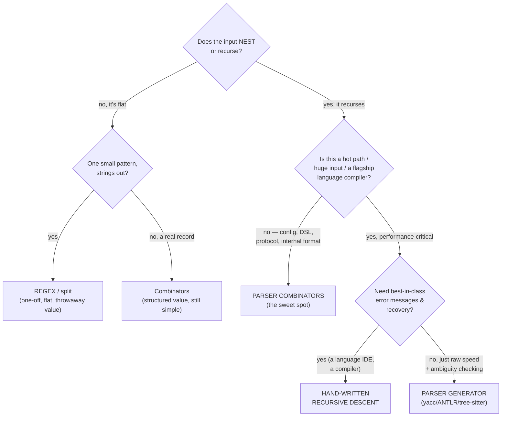

# Parser Combinators (Senior Level)

> **Roadmap:** [Functional Programming](../README.md) → Parser Combinators
>
> *At the senior level the question is never "how do I write `chainl1`?" It is "is a parser combinator the right tool for **this** input, in **this** language, for **this** team — or am I reaching for regex when I should use a generator, or a generator when a 30-line recursive descent would be clearer?" Parsing has four mature tools; choosing among them is the skill.*

---

## Table of Contents

1. [Introduction](#introduction)
2. [Prerequisites](#prerequisites)
3. [The Four Tools: Regex, Combinators, Generators, Hand-Written Recursive Descent](#the-four-tools-regex-combinators-generators-hand-written-recursive-descent)
4. [The Decision: Which Tool for Which Job](#the-decision-which-tool-for-which-job)
5. [Backtracking — the Hidden Cost in `<|>`](#backtracking--the-hidden-cost-in-)
6. [PEG vs CFG: Ordered Choice and No Ambiguity](#peg-vs-cfg-ordered-choice-and-no-ambiguity)
7. [Left Recursion: the Combinator Trap](#left-recursion-the-combinator-trap)
8. [Error Reporting Is a Design Problem, Not a Feature](#error-reporting-is-a-design-problem-not-a-feature)
9. [Language Reality: What You Actually Have](#language-reality-what-you-actually-have)
10. [When Combinators Are Over-Engineering](#when-combinators-are-over-engineering)
11. [Common Mistakes](#common-mistakes)
12. [Test Yourself](#test-yourself)
13. [Cheat Sheet](#cheat-sheet)
14. [Summary](#summary)
15. [Further Reading](#further-reading)
16. [Related Topics](#related-topics)

---

## Introduction

> Focus: **design judgment and tool selection.** Not "what is a combinator" ([`junior.md`](junior.md)) and not "the combinator set" ([`middle.md`](middle.md)) — but *when a combinator library is the right call versus regex, a parser generator, or hand-written recursive descent, and what each choice costs you in performance, error quality, and team comprehension.*

A parser combinator library is a beautiful thing: a grammar that is ordinary, testable, refactorable code in your host language, with no separate build step and no code generation. That beauty seduces engineers into using it for everything — including jobs where a one-line regex would do, and jobs where a production compiler needs the raw speed of a generated or hand-tuned parser. The senior failure mode is not "can't write a parser"; it's *reaching for the wrong one of four tools*.

The four tools, in one line each:

- **Regex** — match flat patterns; cannot handle nesting; returns strings, not structured values.
- **Parser combinators** — grammars as composable functions in your language; great ergonomics and structured output; pay an allocation/backtracking cost.
- **Parser generators** (yacc/bison, ANTLR, tree-sitter) — you write a grammar in a DSL, a tool generates a fast table-driven parser; best raw performance and ambiguity analysis, worst integration friction.
- **Hand-written recursive descent** — you write the parser by hand, one function per grammar rule; maximum control over speed and errors; most code, but no magic.

The non-obvious truth a senior internalizes: **these are not ranked best-to-worst.** Each dominates a region of the design space. Combinators sit in the middle — more powerful than regex, more ergonomic than generators, slower than both generators and tuned recursive descent. The job is to know which region your problem lives in.

> **The frame for this file:** parsing tool choice is a cost-function decision over *format complexity*, *performance requirements*, *error-message quality needed*, and *team fluency* — not a matter of which tool is "most functional" or "most modern." A senior can defend the choice on those four axes in a design review.

---

## Prerequisites

- **Required:** Fluency with [`middle.md`](middle.md) — you can build the combinator set, write `chainl1`, and parse arithmetic with precedence.
- **Required:** Working knowledge of regular expressions and at least passing exposure to one parser generator (yacc/bison, ANTLR, or tree-sitter) and the idea of recursive descent.
- **Helpful:** [Algebraic Data Types](../06-algebraic-data-types/senior.md) — the AST is a recursive sum type, and good error design leans on making illegal states unrepresentable.
- **Helpful:** [Monads — Plain English](../09-monads-plain-english/senior.md) — backtracking and the applicative-vs-monadic trade-off are the monad story applied to parsing.
- **Helpful:** Comfort reading a flame graph / allocation profile — the performance claims below are only credible if you can measure them on your input.

---

## The Four Tools: Regex, Combinators, Generators, Hand-Written Recursive Descent

Before deciding, understand what each tool *is* and where its ceiling is.

### Regex

A regular expression matches a **regular language** — patterns with no recursive nesting. It's the right tool for flat, local patterns: an email-ish string, a date format, a log-line shape, splitting a CSV row *without* quoted-comma escaping. Its hard ceiling is structural: a true regex *cannot* match balanced brackets, because counting arbitrary nesting requires a stack and a regex has no stack. (PCRE's recursive extensions blur this, at the cost of becoming write-only.) And a regex returns *matched text*, which you then re-parse into values by hand — fine for one capture group, miserable for a record with ten fields.

### Parser combinators

A grammar expressed as composable functions in your host language (the [`middle.md`](middle.md) build). The wins: no separate grammar language or build step; the grammar is *ordinary code* you unit-test, refactor, and step through in a debugger; it produces structured values directly; it handles nesting (the parser recurses). The costs: an allocation per combinator (a closure and a result object per step), backtracking that can go exponential if you're careless, and — critically — **PEG semantics** that quietly differ from the context-free grammars textbooks describe (more below).

### Parser generators (yacc/bison, ANTLR, tree-sitter)

You write a grammar in a dedicated DSL; a tool *generates* a parser — usually a fast table-driven LALR (yacc/bison) or LL(*) (ANTLR) automaton, or an incremental GLR parser (tree-sitter). Wins: **the best raw throughput** (table lookups, minimal allocation), **ambiguity detection at generation time** (yacc tells you about shift/reduce conflicts — a real grammar bug surfaced before runtime), and decades of tooling. Costs: a **build-time code-generation step** (friction in your pipeline), a generated artifact that's hard to read and step through, a learning curve for the grammar DSL and its conflict messages, and weaker default error messages (though ANTLR has improved this a lot).

### Hand-written recursive descent

You write the parser by hand: one function per grammar rule, calling each other, with a hand-rolled tokenizer. This is what **most production compilers actually use** — GCC, Clang, the Go compiler, Roslyn (C#), V8, and `rustc` all hand-write recursive descent. Wins: **total control** over performance (no combinator allocation, no generator indirection), **the best possible error messages** (you place every "expected X, found Y" exactly where it helps, with recovery tuned to your language), and code that any engineer can read and debug. Costs: it's *the most code*, you implement repetition/precedence/backtracking yourself, and it's easy to get subtle precedence or associativity wrong without the structure a generator imposes.

> **The senior's mental note:** the fact that essentially every serious production language compiler uses *hand-written recursive descent*, not combinators and not generators, is the single most clarifying data point about where combinators belong. Combinators are not the tool for the absolute performance/error-quality frontier; they are the tool for *good-enough parsing with excellent ergonomics*, which is most parsing that is not a flagship compiler.

---

## The Decision: Which Tool for Which Job

The choice is a function of four axes. Here is the decision made explicit.



Reading the tree as a senior:

- **Flat one-off → regex or `split`.** Parsing a single delimiter, a fixed date format, a log shape you grep once. Bringing a combinator library here is over-engineering ([When Combinators Are Over-Engineering](#when-combinators-are-over-engineering)).
- **Recursive but not performance-critical → combinators.** A config format, an internal DSL, a wire protocol, a query language for your app, a template language. This is the **sweet spot**: the format is structured enough that regex fails and a generator is overkill, and the ergonomics (testable, no build step, structured output) dominate. Most parsing in a typical application lives here.
- **Performance-critical + you want ambiguity analysis → generator.** A SQL dialect, a large data-format with a published grammar, anything where shift/reduce conflict detection catches real bugs and table-driven speed matters. Accept the build-step friction.
- **A flagship language / IDE needing the best errors → hand-written recursive descent.** When error messages, error *recovery* (keep parsing after a mistake to find more errors), and raw speed all matter at once, hand-rolling wins — which is why the real compilers do it.

The four-axis cost table, to put in a design doc:

| Axis | Regex | Combinators | Generator | Hand-written RD |
|---|---|---|---|---|
| **Format complexity ceiling** | flat only | recursive | recursive | recursive |
| **Raw throughput** | very high | low–medium | high | highest |
| **Error message quality** | poor | medium (good with effort) | medium | best |
| **Structured output** | no (strings) | yes | yes | yes |
| **Build/integration friction** | none | none | high (codegen step) | none |
| **Lines of code / effort** | tiny | small | medium (+ grammar DSL) | largest |
| **Team comprehension** | universal | needs FP fluency | needs DSL fluency | universal |

> **The judgment:** combinators win the *complexity × ergonomics × no-build-step* region — recursive grammars that aren't on a hot path, in a team comfortable with functional composition. They lose the flat one-off (regex is shorter), the absolute-performance/best-errors frontier (hand-written), and the published-grammar-with-ambiguity-risk case (generator). "We used combinators because the format nests and it's not a compiler hot path" is a defensible sentence; "we used combinators because they're elegant" is not.

---

## Backtracking — the Hidden Cost in `<|>`

The single most important performance and correctness pitfall in combinator parsing is **backtracking**, and a senior must understand it cold because it's invisible until it isn't.

Recall the naive `or` / `<|>` from [`middle.md`](middle.md): try the left parser; if it fails, retry the right parser *from the original input*. That "retry from the start" is backtracking — and it's both the convenience and the trap.

### Why naive `<|>` can be exponential

Consider alternatives that share a long common prefix:

```haskell
-- Haskell-ish — alternatives sharing a long prefix.
-- "keyword foo bar baz QUUX"  vs  "keyword foo bar baz CORGE"
stmt = (keyword *> ident *> ident *> ident *> char 'A')
   <|> (keyword *> ident *> ident *> ident *> char 'B')
```

If the first alternative parses `keyword foo bar baz` and *then* fails at the last char, naive `<|>` throws away all that work and re-parses `keyword foo bar baz` *again* for the second alternative. Nest a few such choices and you re-parse shared prefixes a combinatorial number of times — **O(2ⁿ)** in the worst case. This is the parser-combinator analogue of catastrophic regex backtracking, and it shows up in production as "the parser is mysteriously slow on this one large input."

### `try` and committed choice

Mature libraries solve this by making backtracking **explicit and opt-in**. In Parsec/megaparsec, `<|>` only backtracks if the left parser failed *without consuming input*. The moment a parser consumes a character, the choice **commits** — failure becomes a hard error rather than a silent retry. To get the old "retry even after consuming" behavior, you wrap the alternative in `try`:

```haskell
-- megaparsec — committed choice. Without `try`, once `keyword` is consumed,
-- failure in the first branch is FATAL (no retry of the second) — fast and
-- gives good errors. `try` re-enables backtracking ONLY where you ask for it.
stmt =  try (keyword *> char 'A')    -- backtrack allowed here
    <|>      (keyword *> char 'B')   -- but commit once we're in
```

The design wisdom: **commit by default, backtrack deliberately.** Committed choice is faster (no re-parsing) *and* gives better errors (the failure points at the real problem inside the committed branch, instead of vaguely blaming "no alternative matched"). Scatter `try` everywhere "to be safe" and you reintroduce the exponential cost and the vague errors — `try` is a sharp tool, not a safety blanket. The senior skill is *left-factoring* the grammar (pull shared prefixes out so alternatives diverge early) so you need `try` rarely.

### Packrat / memoization

The other fix is **packrat parsing**: memoize each parser's result at each input position, so a shared prefix is parsed *once* and reused. This buys **guaranteed linear time** for PEG grammars at the cost of **O(n × rules) memory** (a memo table). Some libraries (and PEG-based tools) offer it; it's the right call when backtracking is unavoidable and inputs are large, and the wrong call when memory is tight or the grammar barely backtracks. Knowing it exists — and that it trades memory for the exponential-time risk — is the senior-level awareness.

> **The takeaway:** backtracking is the combinator world's defining performance hazard. Default to *committed* choice (`try` only where genuinely needed), left-factor shared prefixes, and reach for packrat memoization only when profiling shows backtracking is the bottleneck. An un-`try`'d grammar that's fast on small tests and quadratic-or-worse on production input is a classic and avoidable incident.

---

## PEG vs CFG: Ordered Choice and No Ambiguity

Here is a semantic point most engineers miss and seniors must not: **parser combinators implement PEG semantics, not CFG semantics.** This is not pedantry — it changes what your grammar *means*.

A **context-free grammar (CFG)** — what yacc/bison and most theory use — has *unordered* choice (`A | B` considers both) and can be *ambiguous* (a string with multiple valid parse trees). Ambiguity is a property the grammar *has*, and a generator will warn you about it (shift/reduce conflicts).

A **parsing expression grammar (PEG)** — what combinators implement — has **ordered choice**: `A / B` tries `A` *first*, and if `A` succeeds it **never tries `B`**, even if `B` would also have matched. This has three consequences a senior must hold in mind:

1. **PEGs are unambiguous by construction.** Ordered choice means there's always exactly one parse (the first that succeeds). You get this for free — but it means the grammar can *silently* prefer a parse you didn't intend, with no warning, because there's no notion of "this is ambiguous."

2. **Order of alternatives is significant.** `string("if") <|> ident` and `ident <|> string("if")` are *different grammars*. With `ident` first, the keyword `if` is swallowed as an identifier and `if` is never recognized — a real, common bug. In a CFG these would conflict and the generator would warn; in a PEG it silently does the wrong thing. **You must order alternatives most-specific-first** (longer/keyword alternatives before the general one).

3. **The classic dangling-else.** `if e then s` vs `if e then s else s` — ambiguous in CFG, resolved by precedence rules. In a PEG, ordered choice resolves it deterministically by *which alternative you list first*, so you control it directly — but only if you know that's what's happening.

```python
# Python (our toy) — ordered choice bites: keyword vs identifier.
keyword_if = string("if")
ident      = satisfy(str.isalpha, "letter").many1().map("".join)

# WRONG order: `ident` matches "if" as an identifier; keyword_if never fires.
bad  = ident.or_else(keyword_if)        # "if" parses as identifier "if"  ✗

# RIGHT order: try the specific keyword first.
good = keyword_if.or_else(ident)        # "if" → keyword; "ifx" → identifier  ✓
# (Real grammars also need to ensure `if` isn't a PREFIX of a longer ident —
#  match the keyword only when NOT followed by an identifier char.)
```

> **The senior point:** combinators give you PEG semantics whether you asked for them or not. That's mostly a *gift* — no ambiguity, deterministic parses — but it shifts responsibility onto you: **alternative order is part of your grammar's meaning, and the tool will never warn you about a misordered choice.** Where a generator surfaces ambiguity as a conflict you must resolve, a PEG resolves it silently in favor of whatever you happened to list first. Knowing this is the difference between a grammar that works and one that mysteriously can't see its own keywords.

---

## Left Recursion: the Combinator Trap

The most notorious combinator footgun. A grammar rule that refers to *itself in its first position* — **left recursion** — makes a naive combinator parser loop forever:

```haskell
-- Left-recursive rule: expr starts by parsing... expr. Infinite loop.
expr = (expr <* char '+' <*> term)  <|>  term   -- ☠ expr calls expr with no progress
```

`expr` calls `expr` before consuming any input, which calls `expr`, which... stack-overflows. CFG generators (yacc) handle left recursion *fine* — it's natural for LALR tables and even *preferred* for left-associative operators. PEGs and recursive descent **cannot** handle it directly; it's a known limitation of the top-down approach.

The standard workarounds:

- **Rewrite to iteration with `chainl1`.** This is why [`middle.md`](middle.md) used `chainl1`: it expresses left-associative operators as *one parser plus a loop* (`term (op term)*`), sidestepping left recursion entirely while still folding left-associatively. This is the idiomatic fix and you should reach for it reflexively.
- **Left-factor / rewrite the grammar** to right recursion plus a fold, the manual version of what `chainl1` packages.
- **Use a library with left-recursion support.** Some packrat implementations support *bounded* left recursion via a seed-growing trick (Warth's algorithm); a few combinator libraries expose it. It's available but rarely worth the complexity versus just using `chainl1`.

> **The senior reflex:** when a grammar rule is left-recursive (almost always: binary operators, postfix application, member-access chains `a.b.c.d`), do **not** transcribe it literally into combinators — you'll hang. Convert to `chainl1`/`chainr1` or an explicit `many`-fold. This is *the* difference between someone who's read about combinators and someone who's shipped one. If left recursion is pervasive and natural in your grammar (some expression languages), that's a mild point *in favor of a CFG generator*, which eats it without ceremony.

---

## Error Reporting Is a Design Problem, Not a Feature

A parser that only says "parse failed" is useless in production. Error reporting is where combinator libraries historically struggled and where modern ones (megaparsec) shine — and it is a *design* concern you must engineer, not a checkbox.

### What good errors require

1. **Position tracking.** Every result must carry *where* it got to (line, column, offset). Our [`middle.md`](middle.md) `Err(message, pos)` was the seed; production parsers thread a full source position. Without position, "expected `)`" is unactionable.

2. **Expected-sets.** The best errors say *"expected one of `)`, `,`, or an operator; found `}`"* — the **set of things that could have come next** at the failure point. This requires the library to *collect* the expected tokens across the alternatives it tried, rather than just reporting the last failure. Megaparsec's whole error model is built around accumulating these expected-sets.

3. **The right failure location.** With backtracking, the *reported* failure and the *actual* mistake diverge: a misordered `<|>` might report "expected a number" when the real error was a stray `)` deep inside a committed branch. **Committed choice (`try` discipline) is therefore also an error-quality decision** — committing to a branch means its internal failure is reported *as the error*, instead of being swallowed and replaced by a vague "no alternative matched" at the outer choice.

4. **Error recovery (advanced).** A compiler shouldn't stop at the first error — it should recover (skip to the next `;` or `}`) and keep finding errors, so the user sees ten problems per compile, not one. This is where *hand-written recursive descent pulls ahead*: recovery is hard to express in pure combinators and trivial to hand-tune. Modern combinator libraries are adding recovery combinators, but it remains their weak spot relative to hand-rolled parsers.

```haskell
-- megaparsec — `<?>` labels a parser so the error says what was EXPECTED.
-- This is the ergonomic surface of expected-set design.
identifier :: Parser String
identifier = (some letterChar) <?> "identifier"
-- A failure now reads: "unexpected '3', expecting identifier"
-- instead of the raw "unexpected '3', expecting letter".
```

> **The senior framing:** error-message quality is a *first-class design axis*, often more important to your users than parse speed (a config-file parser's error message is the entire UX). Combinators give you *medium* errors out of the box and *good* errors with deliberate `<?>` labels, committed-choice discipline, and expected-set-aware libraries. If your parser's errors are user-facing and must be *excellent* with recovery (an IDE, a compiler), that's a strong vote for hand-written recursive descent. Decide how good your errors must be *before* you choose the tool — retrofitting great errors onto a naive combinator parser is painful.

---

## Language Reality: What You Actually Have

The abstraction's value is bounded by your language's libraries and ergonomics. Know the local dialect.

| Language | Mature combinator libraries | Ergonomic notes |
|---|---|---|
| **Haskell** | `parsec`, `megaparsec`, `attoparsec` | The reference ecosystem. `megaparsec` for great errors; `attoparsec` for *speed* (no position tracking, built for network/binary parsing). `do`-notation makes monadic parsing read imperatively. |
| **Scala** | `FastParse`, `cats-parse`, `scala-parser-combinators` | `FastParse` is fast and has good errors; `cats-parse` is the principled applicative-first option. The old stdlib `scala-parser-combinators` is slow — avoid for new work. |
| **Rust** | `nom`, `chumsky`, `pest` (PEG, macro-based) | `nom` is a high-performance, zero-copy combinator library (binary *and* text); `chumsky` targets excellent errors for language frontends; `pest` is a PEG generator (grammar in a separate file). |
| **JavaScript/TS** | `parsimmon`, `arcsecond` | Solid for config/DSL parsing in JS apps; not for hot paths. |
| **Python** | `parsy`, `pyparsing`, `lark` (generator) | `parsy` is a clean combinator library; `pyparsing` is older and widely used; `lark` is a fast *generator* (Earley/LALR) when you want CFG semantics and speed. |
| **Java** | `jparsec`, ANTLR (generator) | `jparsec` exists but combinator style fights Java's verbosity; **ANTLR is the dominant JVM parsing tool** and usually the better choice for real grammars. |
| **Go** | (no idiomatic combinator culture) | Go's grain is **hand-written parsers** — the standard library's own parsers (`encoding/json`, `go/parser`) are hand-rolled. Combinator libraries exist but cut against idiom; reach for hand-written recursive descent or a generator (goyacc, participle). |

Two reality checks a senior carries:

- **The "speed vs errors vs position" split inside one ecosystem.** Haskell alone has `attoparsec` (fast, no position — for binary/network), `megaparsec` (great errors, position-tracking — for languages/configs), and `parsec` (the classic middle). Choosing *within* the combinator family is itself a design decision keyed to whether you need speed or error quality.

- **In some languages the idiomatic answer isn't a combinator at all.** Go's culture and stdlib say "hand-write it." The JVM's says "use ANTLR for real grammars." Python has fast *generators* (`lark`) when CFG semantics and speed matter. Reaching for a combinator library *because you like combinators*, against the language's grain, is the same mistake as hand-rolling a `Result` monad in Go.

---

## When Combinators Are Over-Engineering

The discipline to *not* reach for the elegant tool. Combinators are over-engineering when:

- **The input is flat and you parse it once.** A single CSV line without quoted commas, a fixed `YYYY-MM-DD` date, a `key=value` pair, splitting on a delimiter. `split`, `strptime`, or a five-character regex is shorter, faster, and needs zero new dependencies or concepts. Wrapping it in a combinator library is ceremony.

- **A standard library already parses it.** JSON, YAML, TOML, XML, URLs, dates, CSV-with-escaping — these have battle-tested, fast, correct parsers in every language. *Never* hand-write a JSON parser with combinators for production; you'll reproduce edge-case bugs the stdlib fixed years ago. (Building one as a *learning* exercise is great; shipping it is not.)

- **The grammar is genuinely huge and hot.** A full programming-language compiler on a hot path: the allocation-per-combinator cost is real, and the error/recovery needs push you to hand-written recursive descent (which is, again, what the real compilers use).

- **The team can't read functional composition.** A combinator grammar in a team that finds `keyword *> expr <* symbol ")"` inscrutable is *negative* leverage — every change and review slows down. The grammar being "code" is only a win if the team reads that code fluently. Match the tool to the team, not to your taste.

```python
# OVER-ENGINEERED — a combinator library to split a flat, fixed-format line:
config_line = ident.keep_left(char("=")).then(value).map(lambda p: {p[0]: p[1]})
# JUST RIGHT — the input has no nesting; the stdlib is clearer and faster:
key, _, val = line.partition("=")
```

> **The litmus test:** *does the input recurse/nest, is it not a hot-path flagship grammar, and is there no stdlib parser — and does the team read functional code?* All yes → combinators are the right tool. Any no → regex (flat), stdlib (standard format), hand-written/generator (hot/huge), or rethink (team can't read it). The same risk-adjusted-investment frame from the rest of this roadmap applies: an abstraction is justified by the change-cost it removes, not by its elegance. See [Over-Engineering → Speculative Generality](../../anti-patterns/01-development/03-over-engineering/senior.md).

---

## A Worked Judgment Call: A Feature-Flag Expression Language

Make the decision concrete. Suppose your platform needs a small expression language for feature-flag targeting rules — strings users type into an admin UI like:

```
country == "US" && (plan == "pro" || trials_left > 0) && !is_banned
```

Walk the four axes a senior weighs, out loud, and watch the tool fall out.

**Axis 1 — complexity.** The grammar *recurses*: parentheses nest, `&&`/`||` have precedence, `!` is a prefix operator, comparisons sit below boolean operators. A regex is immediately out — it cannot match the nested parentheses, full stop. So we're choosing among combinators, a generator, and hand-written recursive descent.

**Axis 2 — performance.** These rules are short (tens of characters) and evaluated against a *compiled* form, not re-parsed per request — you parse a rule once when an admin saves it, cache the AST, and evaluate the cached AST millions of times. **Parsing is emphatically not the hot path.** That eliminates the main argument for a generator (table-driven speed) and for hand-written recursive descent (raw throughput). The allocation-per-combinator cost is irrelevant here: a few dozen short-lived objects, once, at save time.

**Axis 3 — error quality.** Errors are *user-facing* — an admin typing a rule needs "expected an operator or `)` at column 23, found `&`" — but they do **not** need compiler-grade *recovery* (reporting ten errors per parse). A single, well-located, expected-set error is exactly right, and that's precisely what a combinator library with labels (`<?>`) delivers. This is a point *for* combinators over a bare generator (whose default errors are often worse) and a point that doesn't quite reach the hand-written-recursive-descent threshold.

**Axis 4 — team & integration.** The grammar lives *inside your application code*, evolves with product requirements (new operators, new fields), and must be unit-tested like any other code. A generator's separate grammar file and codegen build step is pure friction for a grammar this small and this churny. Combinators keep the grammar as ordinary, testable, refactorable code — assuming the team reads functional composition, which for a boolean-expression grammar is a low bar.

**The verdict: parser combinators.** Every axis points the same way — recursive (regex out), cold path (generator/hand-written speed unneeded), good-but-not-recovery errors (combinators excel, hand-written overkill), in-codebase and evolving (generator's build step is friction). You'd build it with `chainl1` layering for the boolean operators (left-associative `&&` tighter than `||`), `between` for parentheses, a prefix combinator for `!`, and labels for the error messages. Commit by default and left-factor the comparison alternatives so it stays linear.

Now flip one axis to see the boundary move. **If** these rules were evaluated by re-parsing on *every* request at high QPS (hot path), the calculus changes: you'd pre-compile to a faster representation regardless, but if parsing itself were the bottleneck you'd reach for a faster combinator library (`FastParse`/`nom`-class) or hand-written code. **If** the language grew to a full scripting language with hundreds of constructs and you wanted ambiguity analysis, a generator (or ANTLR) starts to earn its build-step. **If** the team were five engineers who find `<|>` and `*>` unreadable, the *negative leverage* of an unfamiliar abstraction might tip you to a verbose hand-written recursive-descent parser that everyone can debug. The tool isn't fixed by the *problem* alone — it's fixed by the problem *and* the performance budget *and* the team. That conditional reasoning is the senior signal; "I'd use combinators because they're clean" is not.

---

## Common Mistakes

1. **Using combinators for a flat one-off or a standard format.** Regex/`split` beats combinators for flat input; the stdlib beats a hand-rolled JSON/CSV parser every time. Reserve combinators for *structured, non-standard, non-hot* formats.
2. **Transcribing a left-recursive rule literally.** `expr = expr op term <|> term` hangs. Convert binary operators to `chainl1`/`chainr1` or a `many`-fold. This is the #1 combinator crash.
3. **`try` everywhere "to be safe."** It reintroduces exponential backtracking and vague errors. Commit by default; left-factor shared prefixes; reach for `try` only at genuine decision points.
4. **Misordering `<|>` alternatives (PEG ordered choice).** `ident <|> keyword` swallows keywords as identifiers, silently — no warning, because PEGs are unambiguous by construction. Order most-specific-first.
5. **Treating combinators as CFG.** They're PEG. There's no ambiguity warning; alternative order *is* meaning; left recursion is forbidden. If you need CFG semantics or ambiguity analysis, use a generator.
6. **Ignoring error design until the end.** "Parse failed" is useless. Thread position, label with `<?>`, use committed choice for good failure locations, and decide *up front* how good your errors must be — it influences the tool choice.
7. **Assuming combinators are fast enough for a hot path without measuring.** Allocation-per-combinator and backtracking can dominate. If it's a hot path, profile; you may need `attoparsec`/`nom`-class speed, a generator, or hand-written recursive descent.
8. **Fighting the language's grain.** A combinator library in Go (hand-written culture) or instead of ANTLR on the JVM (for a real grammar) is often the wrong local choice regardless of the combinator's intrinsic merits.

---

## Test Yourself

1. Name the four parsing tools and the *one region* of the design space each one wins. Why do real compilers mostly use the one they use?
2. Explain why naive `<|>` can be exponential, and the two distinct fixes (`try`/committed choice vs packrat). What does each fix cost?
3. PEG vs CFG: what is "ordered choice," and give a concrete bug it causes that a CFG generator would have *warned* you about.
4. Why does `expr = expr '+' term <|> term` hang in a combinator parser but work fine in yacc? What's the idiomatic fix?
5. List three ingredients of good parser error messages, and explain why *committed choice* is also an error-quality decision, not just a performance one.
6. A teammate built a combinator parser for your app's `config.json`. What's your review feedback?
7. You must parse a recursive internal query DSL, errors are user-facing and must be good, it's not on a hot path, and the team writes Scala fluently. Which tool, and which specific library, and why?

<details>
<summary>Answers</summary>

1. **Regex** — flat one-off patterns (no nesting). **Combinators** — recursive grammars that aren't hot-path/flagship, where ergonomics and structured output dominate. **Generators** — performance-critical recursive grammars where ambiguity detection (shift/reduce) and table-driven speed matter. **Hand-written recursive descent** — flagship compilers/IDEs needing best-in-class errors, recovery, and raw speed all at once. Real compilers use *hand-written recursive descent* because they need the best errors/recovery *and* top speed simultaneously, and they can afford the code.
2. Naive `<|>` retries the right alternative *from the original input* after the left fails; alternatives sharing a long prefix re-parse that prefix repeatedly, going **O(2ⁿ)** when nested. **Fix 1 — committed choice (`try`):** once a branch consumes input it commits (no retry); cost is you must `try` deliberate backtrack points and left-factor prefixes. **Fix 2 — packrat memoization:** memoize each parser's result per position for guaranteed linear time; cost is **O(n × rules) memory** for the memo table.
3. **Ordered choice:** `A / B` tries `A` first and never tries `B` if `A` succeeds — so the grammar is unambiguous by construction and *alternative order matters*. Bug: `ident <|> string("if")` parses the keyword `if` as an identifier, so `if` is never recognized — silently, with no warning. A CFG generator would flag this region as a conflict; a PEG just picks the first listed alternative.
4. `expr` calls `expr` in first position *without consuming input*, so it recurses forever (stack overflow) — left recursion, which top-down (PEG/recursive-descent) parsers can't handle. yacc builds bottom-up LALR tables where left recursion is natural (and preferred for left-associativity). Idiomatic fix: `chainl1(term, op)` — express it as `term (op term)*` with a left fold.
5. Three ingredients: **position tracking** (line/column/offset), **expected-sets** ("expected one of `)`, `,`, operator"), and **the right failure location**. Committed choice is an error-quality decision because, without it, a backtracking `<|>` swallows the real internal failure and reports a vague "no alternative matched" at the outer choice; committing to a branch makes its *internal* failure the reported error, pointing at the actual mistake.
6. Push back: JSON has a fast, correct, battle-tested stdlib parser (`json.loads`/`JSON.parse`/`encoding/json`). Hand-rolling it with combinators reproduces solved edge-case bugs, is slower, and adds a dependency and maintenance burden for zero benefit. Use the standard library. (Combinators are for *non-standard* recursive formats.)
7. **Parser combinators**, specifically **`cats-parse` or `FastParse`** in Scala. Rationale: the grammar recurses (regex is out), it's not a hot path (a generator's speed isn't needed and its build-step friction isn't worth it), errors must be good (FastParse/cats-parse give good errors, especially with labels), structured output is wanted, and the team reads functional Scala fluently (so the ergonomics are a genuine win, not negative leverage). This is the combinator sweet spot.

</details>

---

## Cheat Sheet

| Decision | Choose | Because |
|---|---|---|
| Flat, one-off, throwaway value | **Regex / split** | shortest, fastest, no nesting needed |
| Standard format (JSON/YAML/CSV/dates) | **Stdlib parser** | battle-tested; never hand-roll |
| Recursive, *not* hot-path, no stdlib, FP-fluent team | **Combinators** | ergonomics + structured output + no build step |
| Recursive, performance-critical, want ambiguity checks | **Generator** (yacc/ANTLR/tree-sitter) | table-driven speed + conflict detection |
| Flagship compiler/IDE, best errors + recovery + speed | **Hand-written recursive descent** | total control; what real compilers do |

| Combinator hazard | Fix |
|---|---|
| Exponential backtracking on shared prefixes | commit by default; `try` only at real decision points; left-factor |
| Slow on large input despite small-test speed | profile; consider packrat (memory cost) or a faster library |
| Keywords parsed as identifiers | order `<|>` most-specific-first (PEG ordered choice) |
| Parser hangs at startup | left recursion → convert to `chainl1`/`chainr1`/`many`-fold |
| "Parse failed" with no detail | thread position, label with `<?>`, committed choice for location |

> **Three golden rules:**
> - *Combinators win the recursive-but-not-hot-path region with an FP-fluent team; regex wins flat, the stdlib wins standard formats, hand-written/generator win the performance/error frontier.*
> - *They're PEG, not CFG: no ambiguity warnings, alternative order is meaning, left recursion is forbidden — use `chainl1`.*
> - *Backtracking is the defining hazard: commit by default, `try` deliberately, and treat error-message quality as a first-class design axis chosen before the tool.*

---

## Summary

- Parsing has **four mature tools**, and the senior skill is choosing among them, not implementing one: **regex** (flat patterns), **combinators** (recursive grammars, great ergonomics, no build step), **generators** (table-driven speed + ambiguity detection, build-step friction), and **hand-written recursive descent** (best errors/recovery/speed — what real compilers use).
- The choice is a cost function over **format complexity, performance needs, error-quality needs, and team fluency**. Combinators win the *recursive-but-not-hot-path, no-stdlib, FP-fluent-team* region — most application parsing, not flagship compilers.
- **Backtracking** is the combinator world's defining hazard: naive `<|>` can be **exponential** on shared prefixes. Fix with **committed choice** (`try` only at real decision points; commit by default; left-factor) or **packrat memoization** (linear time, memory cost). `try`-everywhere reintroduces the cost and ruins errors.
- Combinators implement **PEG, not CFG**: ordered choice makes them unambiguous *by construction* but means **alternative order is part of the grammar's meaning** (misorder and keywords get swallowed as identifiers, silently — no warning a generator would have given), and **left recursion is forbidden** (use `chainl1`/`chainr1` instead — *the* classic crash).
- **Error reporting is a design problem**, not a feature: position tracking, expected-sets, and the right failure location all require deliberate work, and committed choice is an error-*quality* decision as much as a performance one. If errors must be excellent with recovery (an IDE/compiler), that votes for hand-written recursive descent.
- **Language reality** matters: Haskell's `megaparsec`/`attoparsec` split (errors vs speed), Rust's `nom`/`chumsky`, Scala's `FastParse`/`cats-parse`, Python's `parsy` vs `lark` (generator) — and in Go/the JVM the idiomatic answer is often *not a combinator* (hand-written; ANTLR).
- **Over-engineering check:** never combinator-parse a flat one-off (regex), a standard format (stdlib), or in a team that can't read functional composition. The elegance of grammar-as-code is only a win when the format and the team justify it.

---

## Further Reading

- **"Parsing Expression Grammars: A Recognition-Based Syntactic Foundation"** — Bryan Ford (2004) — defines PEGs, ordered choice, and packrat parsing; the theory under why combinators behave as they do.
- **megaparsec documentation & tutorials** — Mark Karpov — the modern reference for error design (expected-sets, `<?>`, committed choice) in a combinator library.
- **"Crafting Interpreters"** — Robert Nystrom (2021) — hand-written recursive descent done beautifully, including error recovery; the counterpoint that clarifies where combinators stop.
- **ANTLR 4 Reference** — Terence Parr — the dominant generator's model; reading it sharpens *why* you'd pick a generator over combinators.
- **nom and chumsky docs** (Rust) — high-performance combinators and error-focused combinators respectively; the two ends of the combinator design space in one ecosystem.
- **"Parser combinators vs parser generators"** — various comparative write-ups; the genre is worth one careful read to internalize the trade-off axes.

---

## Related Topics

- [Algebraic Data Types](../06-algebraic-data-types/senior.md) — the AST your parser produces is a recursive sum type; good error/result design leans on making illegal states unrepresentable.
- [Monads — Plain English](../09-monads-plain-english/senior.md) — backtracking, short-circuiting, and the applicative-vs-monadic trade-off are the monad story applied to parsers.
- [Functors & Applicatives](../13-functors-and-applicatives/senior.md) — applicative parsing (static structure) vs monadic parsing (value-dependent) drives error accumulation and analyzability.
- [Composition](../05-composition/senior.md) — combinators are composition for parsers; the same "build big from small" judgment applies.
- [Recursion & Tail Calls](../08-recursion-and-tail-calls/senior.md) — recursive grammars and the left-recursion limitation of top-down parsing.
- [Over-Engineering → Speculative Generality](../../anti-patterns/01-development/03-over-engineering/senior.md) — reaching for a combinator library on a flat one-off is the parsing-flavored version of over-abstraction.
