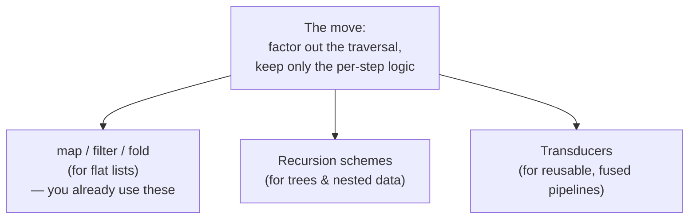

# Recursion Schemes & Transducers (Junior Level)

> **Roadmap:** [Functional Programming](../README.md) → Recursion Schemes & Transducers
>
> *Both of these ideas do the same trick you already love from `map` and `fold`: they **pull the boring "how do I walk through this?" part out of your code**, so you only write the interesting "what do I do at each step?" part. Recursion schemes do it for **tree-shaped recursion**; transducers do it for **pipelines** (`map`/`filter`/`take`).*

---

## Table of Contents

1. [Introduction: One Idea, Two Names](#introduction-one-idea-two-names)
2. [Prerequisites](#prerequisites)
3. [Glossary](#glossary)
4. [The Pattern You Already Know: `map` and `fold`](#the-pattern-you-already-know-map-and-fold)
5. [Part A — Recursion Schemes](#part-a--recursion-schemes)
   - [The problem: recursion is copy-pasted everywhere](#the-problem-recursion-is-copy-pasted-everywhere)
   - [`fold` for trees: the catamorphism](#fold-for-trees-the-catamorphism)
   - [`unfold` for trees: the anamorphism](#unfold-for-trees-the-anamorphism)
   - [Doing both at once: the hylomorphism](#doing-both-at-once-the-hylomorphism)
6. [Part B — Transducers](#part-b--transducers)
   - [The problem: `map().filter().map()` builds garbage](#the-problem-mapfiltermap-builds-garbage)
   - [A transducer is a recipe, not a result](#a-transducer-is-a-recipe-not-a-result)
   - [The same recipe over a list, a stream, a channel](#the-same-recipe-over-a-list-a-stream-a-channel)
7. [Why They're the Same Idea](#why-theyre-the-same-idea)
8. [Common Mistakes](#common-mistakes)
9. [Test Yourself](#test-yourself)
10. [Cheat Sheet](#cheat-sheet)
11. [Summary](#summary)
12. [Further Reading](#further-reading)
13. [Related Topics](#related-topics)

---

## Introduction: One Idea, Two Names

This topic has two intimidating words in its title. Both are simpler than they sound, and both are *the same good idea* in different costumes.

You already know the idea. When you replaced a `for` loop with `map`, you didn't change *what* you wanted to do (square each number) — you changed *who handles the looping*. The `for` loop made **you** write `i = 0; i < n; i++` every time; `map` does that part for you, and you just hand it the one interesting line: `x -> x * x`. You **factored the loop out** of your code.

> **The whole topic in one sentence:** recursion schemes and transducers take that exact move — *"let the library handle the traversal, I'll handle the per-step logic"* — and apply it to two harder cases: **tree-shaped recursion** (recursion schemes) and **chains of `map`/`filter`** (transducers).

- **Recursion schemes** are `map`/`fold` for *trees and nested structures*. You write what to do at one node; the "scheme" walks the whole tree.
- **Transducers** let you build a `map`-then-`filter`-then-`take` pipeline **once** and run it over *anything* — a list, an infinite stream, a network channel — in a single pass with no wasted work.

You do **not** need any of the scary math (it shows up properly in [`professional.md`](professional.md)). This file is pure intuition. If you understand `map` and `fold`, you already have the foundation.

---

## Prerequisites

- **Required:** You can write a function, and you've called `map`, `filter`, and `reduce`/`fold` on a list. See [Map / Filter / Reduce](../04-map-filter-reduce/junior.md).
- **Required:** You've written a recursive function at least once — something that calls itself, like summing a tree or computing a factorial. See [Recursion & Tail Calls](../08-recursion-and-tail-calls/junior.md).
- **Helpful:** You've felt the annoyance of writing the *same* recursive walk twice (once to count nodes, once to sum them) and noticed they were 90% identical.
- **Helpful:** You've chained `.map(...).filter(...).map(...)` and wondered if all those intermediate lists are wasteful. (They are — transducers fix it.)

---

## Glossary

| Term | Plain-English meaning |
|------|----------------------|
| **Recursion scheme** | A reusable "walker" for tree-shaped data. You give it the per-node logic; it handles the recursion. `map`/`fold` for trees. |
| **Catamorphism** | A fancy word for **`fold` on a tree** — tear a whole structure *down* into a single value (sum a tree, evaluate an expression). "Cata" = down. |
| **Anamorphism** | The reverse — **`unfold`**: *build* a tree *up* from a starting seed (grow a number range, a game tree). "Ana" = up. |
| **Hylomorphism** | Do an unfold **then** a fold, fused together so the intermediate tree is never actually built. Build-and-tear-down in one pass. |
| **Algebra** | Just "the per-node logic you hand to a fold." A function that says *"given the results from my children, here's my result."* |
| **Transducer** | A reusable transformation recipe (like "map then filter then take 10") that is **separate** from the data it runs on. |
| **Reducing function** | A `fold` step: `(accumulator, item) -> newAccumulator`. The thing `reduce` uses. Transducers are *transformations of* these. |
| **Fusion** | Combining several passes (a `map` pass + a `filter` pass) into **one** pass, so no intermediate collections are built. |
| **Single pass** | Going through the data exactly once, doing all the work, instead of once per `map`/`filter`. |

---

## The Pattern You Already Know: `map` and `fold`

Before the two new ideas, let's name the move they both copy. Look at summing a list **by hand**:

```python
# Python — the manual loop. The "how to walk the list" is tangled with "what to do."
total = 0
for x in [1, 2, 3, 4]:
    total = total + x      # ← the only interesting line
print(total)               # 10
```

Now with `reduce` (a.k.a. `fold`), the walking is gone and only the interesting line survives:

```python
# Python — fold/reduce. We hand over ONE function; the loop is the library's job.
from functools import reduce
total = reduce(lambda acc, x: acc + x, [1, 2, 3, 4], 0)   # 10
#                     ^^^^^^^^^^^^ the only thing we wrote
```

That trade — **"I write the step, you write the loop"** — is the heart of functional programming. `map`, `filter`, and `fold` are its most famous examples. Recursion schemes and transducers are just *more powerful members of the same family*:



Keep that diagram in mind. Everything below is one of those two new boxes.

---

## Part A — Recursion Schemes

### The problem: recursion is copy-pasted everywhere

Imagine a little tree of math: an **expression** like `(2 + 3) * 4`. We can model it as a data structure:

```python
# Python — an expression tree. A node is either a number, or an operation
# (add / multiply) with a left and right child that are themselves expressions.
Num = lambda n: ("num", n)
Add = lambda l, r: ("add", l, r)
Mul = lambda l, r: ("mul", l, r)

expr = Mul(Add(Num(2), Num(3)), Num(4))   # (2 + 3) * 4
```

Now suppose we want to **evaluate** it (get `20`). We write a recursive function:

```python
# Python — evaluate the tree. Note the recursion: eval calls itself on children.
def evaluate(e):
    tag = e[0]
    if tag == "num": return e[1]
    if tag == "add": return evaluate(e[1]) + evaluate(e[2])   # ← recurse on children
    if tag == "mul": return evaluate(e[1]) * evaluate(e[2])   # ← recurse on children
```

Fine. But now we want to **count the numbers** in the tree. And **pretty-print** it. And **find the maximum**. Watch what happens:

```python
# Python — count the leaves. Look how similar this is to evaluate!
def count_nums(e):
    tag = e[0]
    if tag == "num": return 1
    if tag == "add": return count_nums(e[1]) + count_nums(e[2])   # ← same recursion shape
    if tag == "mul": return count_nums(e[1]) + count_nums(e[2])   # ← same recursion shape
```

`evaluate` and `count_nums` are **90% the same code**. The recursion — "recurse into the children, then combine" — is copy-pasted. Only the *combine* step differs (`+`/`*` vs `+1`). This is exactly the duplication `map` solved for loops, but now for *trees*. **A recursion scheme deletes the duplicated recursion.**

### `fold` for trees: the catamorphism

A **catamorphism** is just **`fold` for a tree**. (The word comes from Greek *kata*, "downward" — you collapse the tree *down* to one value.) The trick is to split the function into two halves:

1. **The recursion** (recurse into children) — written **once**, in the scheme.
2. **The per-node logic** (what to do once your children are done) — written by *you*. This is called the **algebra**.

Here's a tiny `cata` we can write by hand:

```python
# Python — a hand-written catamorphism (fold over the expression tree).
# `alg` is YOUR per-node logic. cata handles ALL the recursion, once.
def cata(alg, e):
    tag = e[0]
    if tag == "num":
        return alg(("num", e[1]))                         # leaf: nothing to recurse
    # recurse FIRST, so the children are already folded to plain values...
    left  = cata(alg, e[1])
    right = cata(alg, e[2])
    return alg((tag, left, right))                        # ...then call YOUR algebra

# Now each task is just a tiny algebra — NO recursion in sight:
def eval_alg(node):
    if node[0] == "num": return node[1]
    if node[0] == "add": return node[1] + node[2]   # children already evaluated!
    if node[0] == "mul": return node[1] * node[2]

def count_alg(node):
    if node[0] == "num": return 1
    return node[1] + node[2]                         # children already counted!

print(cata(eval_alg,  expr))   # 20  — evaluate
print(cata(count_alg, expr))   # 3   — count the numbers
```

Look at what happened. `eval_alg` and `count_alg` have **no recursion at all** — by the time they run, the children are already plain numbers. The phrase **"children already evaluated"** is the magic: `cata` recurses *first*, hands you the finished child results, and you just combine them. You write the *interesting* part; the scheme writes the *boring* part. Exactly like `map`.

> **The mental model:** a catamorphism asks you one question at each node — *"given that your children have already been turned into answers, what's your answer?"* — and you answer it without ever writing the word "recurse."

The same thing in Haskell (which has a real library for this) reads almost identically — `cata` takes your algebra and folds the tree:

```haskell
-- Haskell (recursion-schemes lib, simplified intuition).
-- The algebra `evalAlg` says how to turn ONE node (with already-folded children)
-- into a value. `cata` drives the recursion for you.
evalAlg :: ExprF Int -> Int          -- ExprF Int = a node whose children are already Ints
evalAlg (NumF n)   = n
evalAlg (AddF a b) = a + b           -- a and b are already evaluated
evalAlg (MulF a b) = a * b

evaluate :: Expr -> Int
evaluate = cata evalAlg              -- that's the whole evaluator. No explicit recursion.
```

You don't need to read Haskell fluently. The point is: **`cata yourAlgebra` is the entire tree walk**, and `yourAlgebra` is three boring lines with no recursion.

### `unfold` for trees: the anamorphism

A catamorphism tears a structure **down** to a value. The mirror image — an **anamorphism** — builds a structure **up** from a starting *seed*. (*Ana* = "upward".) It's **`unfold`**: instead of "given children, produce a value," you say "given a seed, produce a node *and* the seeds for its children."

The classic example: build the list `[1, 2, 3, ..., n]` by unfolding from a counter.

```python
# Python — an anamorphism (unfold). We grow a structure from a seed.
# `coalg` (your logic) says: given a seed, am I done, or do I emit a value
# and hand back the next seed?
def ana(coalg, seed):
    step = coalg(seed)
    if step is None:                 # coalg says "stop": no more structure
        return []
    value, next_seed = step
    return [value] + ana(coalg, next_seed)   # emit value, recurse on the next seed

def count_down_to_one(n):
    if n == 0: return None           # stop
    return (n, n - 1)                # emit n, then continue from n-1

print(ana(count_down_to_one, 5))     # [5, 4, 3, 2, 1]
```

You wrote `count_down_to_one` — *"given a seed, what do I emit and what's the next seed?"* — and `ana` did all the building. Again: **you write the step, the scheme writes the loop**, just running in the *opposite direction* (building up instead of tearing down).

A real tree example: build a small binary tree of a number range by repeatedly splitting it.

```python
# Python — unfold a balanced tree from a range. Seed = (low, high).
def split(seed):
    low, high = seed
    if low > high:  return ("empty",)             # nothing to build
    mid = (low + high) // 2
    return ("node", mid, (low, mid - 1), (mid + 1, high))  # value + two child SEEDS
# An ana would turn `split` into a full tree builder — you only wrote the split rule.
```

### Doing both at once: the hylomorphism

Here's the neat part. Very often you **build a structure just to immediately tear it back down**. Think about computing `factorial(5)`:

- **Build (unfold):** make the list `[5, 4, 3, 2, 1]` from the seed `5`.
- **Tear down (fold):** multiply that list together → `120`.

You unfolded a list, then folded it. A **hylomorphism** is exactly that — *unfold then fold* — but with a clever twist: **the intermediate list is never actually built in memory.** Each number is produced and immediately consumed, so there's no wasteful `[5, 4, 3, 2, 1]` sitting around.

```python
# Python — a hylomorphism: unfold a seed into "virtual" steps, fold them up,
# but FUSE the two so the intermediate list never exists.
def hylo(fold_step, unfold_step, seed, base):
    step = unfold_step(seed)
    if step is None:
        return base                       # reached the bottom
    value, next_seed = step
    rest = hylo(fold_step, unfold_step, next_seed, base)   # build+fold the rest
    return fold_step(value, rest)         # combine immediately — no list stored

# factorial via hylo: unfold n..1, fold with multiply.
def fact(n):
    return hylo(
        fold_step   = lambda v, acc: v * acc,         # the fold: multiply
        unfold_step = lambda k: None if k == 0 else (k, k - 1),  # the unfold: n, n-1, ...
        seed = n,
        base = 1,
    )

print(fact(5))   # 120  — and no [5,4,3,2,1] list was ever created
```

The same fusion idea powers an efficient **merge sort**: *unfold* the array into a tree of halves, then *fold* the tree by merging — and a hylomorphism fuses those so you don't keep the whole tree of sub-arrays around. You'll see that worked out in [`middle.md`](middle.md). For now, the headline is:

> **Hylomorphism = unfold-then-fold, fused.** Build a structure and consume it in one pass, skipping the intermediate. This "no wasted intermediate" idea is *also* the whole point of transducers — which we turn to next.

---

## Part B — Transducers

### The problem: `map().filter().map()` builds garbage

You write data pipelines all the time:

```python
# Python — a normal pipeline. Looks clean. But how many lists get built?
nums = [1, 2, 3, 4, 5, 6, 7, 8]
result = list(map(lambda x: x + 1,
              filter(lambda x: x % 2 == 0,
              map(lambda x: x * 10, nums))))
print(result)   # [21, 41, 61, 81]
```

In a language with eager `map`/`filter` (like JavaScript arrays, or Java without streams), each step **builds a brand-new intermediate collection**:

```javascript
// JavaScript — each call returns a NEW array. Three passes, two throwaway arrays.
const result = nums
  .map(x => x * 10)       // builds array #1  (a full pass)
  .filter(x => x % 2 === 0) // builds array #2  (another full pass)
  .map(x => x + 1);       // builds array #3  (a third full pass)
```

For 8 items, who cares. For 8 *million* items, you just walked the data three times and allocated two giant arrays you immediately threw away. That's wasted CPU and wasted memory. **Transducers fix this by fusing the whole pipeline into one pass with no intermediate arrays.**

### A transducer is a recipe, not a result

Here's the key idea. Normally, `map(f, data)` mixes two things: the *transformation* (`f`) and the *data* (`data`), and immediately produces a result. A **transducer separates the recipe from the data.** You build the pipeline `map-then-filter-then-map` **as a standalone value**, with no data attached, and *then* run it over whatever you like.

The trick (this is the famous part): a transducer is **a function that transforms a `reduce` step.** Remember `reduce` needs a step function `(accumulator, item) -> accumulator`. A transducer takes *that* step and returns a *new, smarter* step that does the mapping/filtering on the way through.

In Clojure — transducers' home — you write the pipeline with no collection in sight:

```clojure
;; Clojure — `xform` is a transducer: a pipeline recipe with NO data attached.
;; `comp` glues the steps together (left-to-right when applied).
(def xform
  (comp (map #(* 10 %))        ; multiply by 10
        (filter even?)         ; keep evens
        (map inc)))            ; add 1

;; Run it over a vector — ONE pass, no intermediate collections:
(into [] xform [1 2 3 4 5 6 7 8])   ; => [21 41 61 81]
```

Notice `xform` doesn't mention `[1 2 3 ...]` at all. It's just the *recipe*. We applied it with `into`, but we could apply the **same `xform`** to anything.

Here's a tiny transducer built by hand in Python, so the mechanism is visible:

```python
# Python — a hand-rolled `mapping` transducer. It takes a reducing step
# and returns a NEW step that maps each item before reducing it.
def mapping(f):
    def transducer(step):                      # `step` is the next reducing function
        def new_step(acc, item):
            return step(acc, f(item))           # transform, THEN pass along
        return new_step
    return transducer

def filtering(pred):
    def transducer(step):
        def new_step(acc, item):
            return step(acc, item) if pred(item) else acc   # drop item if pred fails
        return new_step
    return transducer

# Compose recipes (note: applied outer-to-inner, so read top-down as the data flow):
def compose(*transducers):
    def combined(step):
        for t in reversed(transducers):
            step = t(step)
        return step
    return combined

xform = compose(mapping(lambda x: x * 10),
                filtering(lambda x: x % 2 == 0),
                mapping(lambda x: x + 1))

# Run the recipe over data in ONE pass using a plain reduce:
def append(acc, item):
    acc.append(item); return acc

from functools import reduce
result = reduce(xform(append), [1, 2, 3, 4, 5, 6, 7, 8], [])
print(result)   # [21, 41, 61, 81]  — one pass, no intermediate lists
```

You don't need to fully digest the wiring. The takeaway: each item flows through `map → filter → map` **once**, and the result list is built directly. No throwaway arrays.

### The same recipe over a list, a stream, a channel

This is the payoff that makes transducers special, not just a micro-optimization. Because `xform` has **no data baked in**, the *exact same recipe* works over completely different kinds of sources:

```clojure
;; Clojure — ONE transducer, MANY contexts. None of these rebuild xform.
(into [] xform [1 2 3 4 5 6 7 8])     ; over a vector
(sequence xform (range 1000000))      ; over a lazy, possibly-huge sequence
(transduce xform + 0 [1 2 3 4 5 6])   ; fold straight to a number, no collection
;; (over a core.async channel — the SAME xform filters/maps messages in flight)
(chan 10 xform)                       ; a channel that applies xform to every value
```

The same `map-filter-map` logic now filters messages flowing through a **channel**, transforms an **infinite stream**, or processes a **vector** — and you wrote the logic *once*. In ordinary `array.map().filter()` code, that logic is welded to arrays and can't move. Transducers unweld it.

> **The mental model:** a transducer is a **pipeline you can pick up and drop onto any data source** — a list, a stream, a queue, a socket — because it describes *what to do to each item*, not *where the items come from* or *where they go*.

---

## Why They're the Same Idea

Step back and you'll see recursion schemes and transducers are siblings. Both answer the same design question:

> **"How do I separate *what to do at each step* from *how the data is walked through*?"**

| | What it walks | The part **you** write | The part the **tool** writes |
|---|---|---|---|
| `map` / `fold` | a flat list | the per-element function | the loop |
| **Recursion scheme** (cata/ana) | a tree / nested structure | the per-node *algebra* | the recursion |
| **Transducer** | any source (list, stream, channel) | the per-item transform recipe | the traversal + fusion |

And both share the *fusion* payoff — doing the work in **one pass with no wasted intermediate structure**:

- A **hylomorphism** builds-and-consumes without keeping the intermediate tree/list.
- A **transducer** maps-and-filters without building intermediate collections.

That's not a coincidence. They're two answers to the same instinct: *describe the per-step logic separately, and let something else handle the walking — efficiently.* If you remember nothing else, remember that. Everything in [`middle.md`](middle.md) and beyond is making this precise and fast.

---

## Common Mistakes

1. **Thinking these are exotic and unrelated to what you know.** They're not — they're `map`/`fold` grown up. If you can use `reduce`, you can understand a catamorphism; if you can chain `.map().filter()`, you can understand a transducer.
2. **Confusing cata and ana directions.** **Cata** tears a structure **down** to a value (fold). **Ana** builds a structure **up** from a seed (unfold). Mnemonic: cata*strophe* goes *down*; *ana* (as in "analysis from the ground up") goes *up*.
3. **Writing recursion *inside* your algebra.** The whole point is that the algebra is recursion-*free* — by the time it runs, the children are already done. If you find yourself recursing inside the per-node function, you've missed the trick.
4. **Believing a transducer is just `map`.** A single `map` isn't the win. The win is (a) *fusing a whole chain* into one pass and (b) running the *same recipe over different sources*. One `map` over one array doesn't show either benefit.
5. **Confusing "transducer" with "the result."** A transducer is a **recipe with no data attached**. The moment you bake in the collection (`array.map(...)`), you've lost the reusability that makes it a transducer.
6. **Reaching for these on day one.** Most everyday code is fine with plain `map`/`filter`/`fold`. Recursion schemes and transducers earn their keep on *trees you walk many ways* and *hot pipelines you reuse across sources* — not on a five-line script.

---

## Test Yourself

1. In one sentence, what move do recursion schemes and transducers both copy from `map`/`fold`?
2. Which scheme tears a tree *down* into a value — catamorphism or anamorphism? Which builds a tree *up* from a seed?
3. In the `cata`/`eval_alg` example, why does `eval_alg` contain no recursion?
4. A hylomorphism is "unfold then fold." What does it cleverly *avoid* building?
5. Why does `array.map(f).filter(p).map(g)` in eager JavaScript waste work on a huge array?
6. What does it mean to say "a transducer has no data attached," and why does that let the same transducer run over a list *and* a channel?
7. What single payoff do hylomorphisms and transducers share?

<details>
<summary>Answers</summary>

1. **Factor out the traversal:** let the tool handle *how the data is walked* so you only write *what to do at each step* (the per-node algebra / the per-item transform).
2. **Catamorphism** tears down (it's `fold`). **Anamorphism** builds up (it's `unfold`).
3. Because `cata` recurses *first* and hands `eval_alg` the **already-evaluated children** (plain numbers). By the time the algebra runs, there's nothing left to recurse into — it just combines finished results.
4. The **intermediate structure** (the `[5,4,3,2,1]` list / the tree of sub-arrays). Each piece is produced and immediately consumed, so it never sits in memory.
5. Each of `map`, `filter`, `map` builds a **brand-new full array** and walks the data again — three passes and two throwaway arrays for an 8M-element input. That's wasted CPU and memory.
6. The transducer is just the *recipe* (`map-then-filter-then-map`) as a standalone value, with no collection baked in. Because it only describes *what to do to each item*, you can hand it to a list runner, a stream runner, or a channel runner — the recipe doesn't care where items come from or go.
7. **Fusion / no wasted intermediate:** both do all the work in a **single pass without building the intermediate structure** (the unfolded tree, or the intermediate collections).

</details>

---

## Cheat Sheet

| Term | It's just... | Direction / job |
|---|---|---|
| **Catamorphism** | `fold` for a tree | tear **down** to a value |
| **Anamorphism** | `unfold` for a tree | build **up** from a seed |
| **Hylomorphism** | unfold **then** fold, fused | build + consume, no intermediate |
| **Algebra** | your per-node logic | `children's results -> my result` |
| **Transducer** | a pipeline recipe with no data | `map`/`filter`/`take` as a reusable value |
| **Reducing function** | a fold step | `(acc, item) -> acc` |
| **Fusion** | merging passes into one | no throwaway collections |

> **The one idea:** *separate the per-step logic from the traversal.* Recursion schemes do it for trees; transducers do it for pipelines. Both get you a single, fused pass.

---

## Summary

- Recursion schemes and transducers both pull off the same move you love from `map`/`fold`: **the tool handles the traversal; you only write the per-step logic.**
- **Recursion schemes** are `map`/`fold` for *trees*. A **catamorphism** is a fold (tear a structure *down* to a value — like evaluating an expression tree); an **anamorphism** is an unfold (build a structure *up* from a seed); a **hylomorphism** does both fused, so the intermediate structure is never built.
- You write the **algebra** — the recursion-free per-node logic ("given my children's results, here's mine") — and the scheme drives the recursion. Swapping algebras turns one walker into an evaluator, a counter, a printer.
- **Transducers** separate a `map`/`filter`/`take` **recipe** from the data. They fuse the whole chain into **one pass with no intermediate collections**, and the *same* recipe runs over a list, a lazy stream, or a channel — because it describes *what to do to each item*, not where items come from.
- Both share the **fusion** payoff: do all the work in a single pass without wasted intermediates.
- You don't need any category theory yet — that's [`professional.md`](professional.md). Next: [`middle.md`](middle.md) builds these mechanically, including `Fix`, F-algebras, and worked merge-sort and channel examples.

---

## Further Reading

- **"Understanding F-Algebras"** — Bartosz Milewski (intro sections only) — the gentlest on-ramp to *why* a fold is a catamorphism; skim the pictures, ignore the proofs for now.
- **Clojure docs: "Transducers"** (clojure.org/reference/transducers) — the canonical, readable introduction from the people who invented them.
- **"Transducers" talk** — Rich Hickey (2014) — the original motivation ("decouple the transformation from the source/sink") in plain language.
- **"Recursion Schemes" series** — Patrick Thomson (blog) — a beginner-friendly walk from "duplicated recursion" to `cata`/`ana`, in approachable steps.

---

## Related Topics

- [Map / Filter / Reduce](../04-map-filter-reduce/junior.md) — the flat-list version of this exact "factor out the loop" idea; transducers generalize `map`/`filter`, cata generalizes `fold`.
- [Recursion & Tail Calls](../08-recursion-and-tail-calls/junior.md) — the hand-written recursion that recursion schemes factor away.
- [Composition](../05-composition/junior.md) — transducers compose with ordinary function composition; cata/ana compose into hylo.
- [Laziness & Streams](../12-laziness-and-streams/junior.md) — the "no intermediate collections / single pass" idea overlaps directly with transducer fusion.
- [Algebraic Data Types](../06-algebraic-data-types/junior.md) — the trees (expression nodes, lists-as-data) that recursion schemes walk are sum types.
- [Functors & Applicatives](../13-functors-and-applicatives/junior.md) — the "shape" a recursion scheme walks is a functor; `map`-able structure is what makes the trick work.
