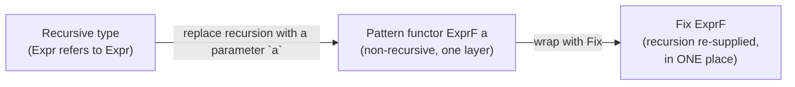
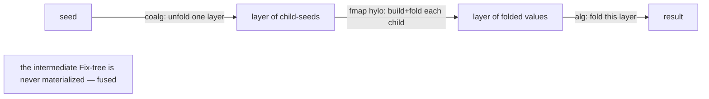
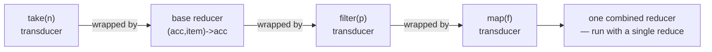

# Recursion Schemes & Transducers (Middle Level)

> **Roadmap:** [Functional Programming](../README.md) → Recursion Schemes & Transducers
>
> *Now we build the machinery. Recursion schemes work by **factoring the recursion out of the data type itself** (the `Fix`/pattern-functor trick) and feeding it an **algebra** (`f a -> a`) or **coalgebra** (`a -> f a`). Transducers work by treating a pipeline as a **transformation of a reducing function**, composed with ordinary function composition, with early termination built in.*

---

## Table of Contents

1. [Introduction](#introduction)
2. [Prerequisites](#prerequisites)
3. [Part A — Recursion Schemes, Mechanically](#part-a--recursion-schemes-mechanically)
   - [Step 1: factor recursion out of the *data type* (the pattern functor)](#step-1-factor-recursion-out-of-the-data-type-the-pattern-functor)
   - [Step 2: `Fix` — tie the knot back](#step-2-fix--tie-the-knot-back)
   - [Step 3: the catamorphism, defined once](#step-3-the-catamorphism-defined-once)
   - [Anamorphism: `cata` run backwards](#anamorphism-cata-run-backwards)
   - [Hylomorphism: ana then cata, fused](#hylomorphism-ana-then-cata-fused)
   - [Worked example: merge sort as a hylomorphism](#worked-example-merge-sort-as-a-hylomorphism)
   - [Para- and apomorphisms in one breath](#para--and-apomorphisms-in-one-breath)
4. [Part B — Transducers, Mechanically](#part-b--transducers-mechanically)
   - [The reducing function and the transformation](#the-reducing-function-and-the-transformation)
   - [`map`, `filter`, `take`, `cat`/`mapcat` as transducers](#map-filter-take-catmapcat-as-transducers)
   - [Composition and the order surprise](#composition-and-the-order-surprise)
   - [Early termination: `reduced`](#early-termination-reduced)
   - [One transducer, many contexts](#one-transducer-many-contexts)
5. [The Common Thread](#the-common-thread)
6. [Trade-offs](#trade-offs)
7. [Common Mistakes](#common-mistakes)
8. [Test Yourself](#test-yourself)
9. [Cheat Sheet](#cheat-sheet)
10. [Summary](#summary)
11. [Further Reading](#further-reading)
12. [Related Topics](#related-topics)

---

## Introduction

> Focus: **the mechanics.** [`junior.md`](junior.md) gave you the intuition — "factor out the traversal, write only the per-step logic." This file shows *how the factoring actually works*: the `Fix` trick that pulls recursion out of a data type, the algebra/coalgebra functions the schemes consume, and the reducing-function transformation that defines a transducer.

Both halves of this topic rest on a single structural idea: **make the recursion (or the iteration) a separate, swappable component.** For recursion schemes, that means literally rewriting your recursive data type so the recursion lives in *one* place you can fold over. For transducers, it means representing a pipeline as a *function that rewrites the step of a fold*, so it can be dropped onto any fold-shaped traversal.

By the end of this file you'll be able to:

- Rewrite a recursive type (`Expr`, `List`, `Tree`) as a non-recursive **pattern functor** plus `Fix`.
- Write `cata`, `ana`, and `hylo` and explain why `hylo` needs neither `Fix` nor an intermediate structure.
- Build `map`/`filter`/`take`/`mapcat` transducers, compose them, and handle early termination.
- See precisely why these two ideas are the same idea: *separate the per-step logic from the traversal*.

We keep the formal F-algebra story (initial algebras, uniqueness, fusion laws) for [`professional.md`](professional.md). Here it stays concrete and runnable.

---

## Prerequisites

- **Required:** [`junior.md`](junior.md) of this topic — the cata/ana/hylo and transducer *intuition*.
- **Required:** Comfortable writing recursive functions over trees and lists ([Recursion & Tail Calls](../08-recursion-and-tail-calls/middle.md)) and using `map`/`filter`/`reduce` fluently ([Map / Filter / Reduce](../04-map-filter-reduce/middle.md)).
- **Required:** You can read a generic/parametric type signature like `List<A>` and a function type like `A -> B`.
- **Helpful:** A first look at [Algebraic Data Types](../06-algebraic-data-types/middle.md) (sum types, recursive types) and [Composition](../05-composition/middle.md) (`compose`/`pipe`), both of which this builds on directly.

---

## Part A — Recursion Schemes, Mechanically

### Step 1: factor recursion out of the *data type* (the pattern functor)

Here's the key move, and it surprises everyone the first time. To factor recursion out of your *functions*, you first factor it out of your *data type*.

Look at a normal recursive expression type. It mentions itself:

```haskell
-- Haskell — a normal recursive type. `Expr` appears INSIDE its own definition.
data Expr = Num Int
          | Add Expr Expr     -- ← recursion: Expr refers to Expr
          | Mul Expr Expr     -- ← recursion
```

The recursion is *baked into the type*. Now we do something clever: replace every recursive `Expr` with a **type parameter** `a`, turning the self-reference into a "hole":

```haskell
-- Haskell — the PATTERN FUNCTOR. The recursive positions become a parameter `a`.
-- This type is NOT recursive — it describes ONE layer of an expression.
data ExprF a = NumF Int
             | AddF a a       -- the children are `a`, not Expr — a hole to fill
             | MulF a a
```

`ExprF a` is **one layer** of an expression whose children are some type `a`. If `a = Int`, then `ExprF Int` is "an expression node whose children are already plain `Int`s" — *exactly* the input your `eval_alg` algebra wanted in [`junior.md`](junior.md). That's not a coincidence; it's the whole design.

Crucially, `ExprF` is a **functor**: you can `map` a function over its `a` holes (its children) without touching the structure:

```haskell
-- Haskell — ExprF is a Functor: fmap reaches into the child `a` positions.
instance Functor ExprF where
  fmap _ (NumF n)   = NumF n              -- no children to map
  fmap f (AddF l r) = AddF (f l) (f r)    -- map into both child holes
  fmap f (MulF l r) = MulF (f l) (f r)
```

The same idea in Python (untyped, but the shape is identical):

```python
# Python — one layer of an expression, children in `a` positions.
NumF = lambda n:    ("NumF", n)
AddF = lambda l, r: ("AddF", l, r)        # l, r are "holes"
MulF = lambda l, r: ("MulF", l, r)

def fmap(f, layer):                        # map over the child holes only
    tag = layer[0]
    if tag == "NumF": return layer
    return (tag, f(layer[1]), f(layer[2])) # apply f to the two children
```

> **The pattern-functor rule:** take your recursive type, replace each recursive occurrence with a fresh type parameter, and give the result a `map` that hits exactly those parameter positions. You now have a *non-recursive* description of **one layer**, plus a way to transform its children. That's all a scheme needs.

### Step 2: `Fix` — tie the knot back

We removed the recursion from the type — but we still want *real, arbitrarily deep* expressions. We get them back with a tiny, almost magical wrapper called **`Fix`** (the *fixpoint* of the functor):

```haskell
-- Haskell — Fix ties the recursive knot. `Fix f` = "an f whose children
-- are themselves Fix f" — i.e. recursion, supplied externally and uniformly.
newtype Fix f = Fix (f (Fix f))

-- Now a real expression is built by nesting Fix:
type Expr = Fix ExprF

num n   = Fix (NumF n)
add l r = Fix (AddF l r)
mul l r = Fix (MulF l r)

example :: Expr
example = mul (add (num 2) (num 3)) (num 4)   -- (2 + 3) * 4
```

`Fix f` reads as: "a layer of `f`, whose holes are filled with more `Fix f`." That *is* recursion — but now the recursion lives in **one place** (`Fix`), not scattered through `Expr`. We've collected all the self-reference into a single reusable knob. This is the structural payoff: **every recursive type becomes `Fix` of some non-recursive pattern functor**, and anything that works for `Fix` works for *all* of them.



### Step 3: the catamorphism, defined once

Now the payoff lands. A **catamorphism** folds a `Fix f` down to a value, given an **algebra** — a function `f a -> a` that collapses *one already-folded layer*:

```haskell
-- Haskell — cata, the generic fold, defined ONCE for ANY functor f.
-- algebra :: f a -> a   ("given a layer whose children are already `a`s, produce an `a`")
cata :: Functor f => (f a -> a) -> Fix f -> a
cata alg (Fix layer) = alg (fmap (cata alg) layer)
--                     ^^^   ^^^^^^^^^^^^^^^ recurse into each child first...
--                     then run the algebra on the layer of finished children
```

Read the body slowly — it's the entire mechanism in one line:

1. `fmap (cata alg) layer` — recurse with `cata` into **every child hole** (that's what `fmap` reaches), turning each child from `Fix f` into a finished `a`.
2. `alg (...)` — now the layer is `f a` (children are finished `a`s), so hand it to your algebra to produce *this* node's `a`.

That's it. **`cata` is the only recursive function you ever write.** Every fold you want is now a non-recursive algebra:

```haskell
-- Haskell — three folds, ZERO recursion in the algebras.
evalAlg :: ExprF Int -> Int
evalAlg (NumF n)   = n
evalAlg (AddF a b) = a + b
evalAlg (MulF a b) = a * b

depthAlg :: ExprF Int -> Int
depthAlg (NumF _)   = 1
depthAlg (AddF a b) = 1 + max a b
depthAlg (MulF a b) = 1 + max a b

evaluate = cata evalAlg     -- (2+3)*4  => 20
depth    = cata depthAlg    -- => 3
```

The hand-rolled Python `cata` mirrors it exactly:

```python
# Python — generic cata over our (tag, children...) layers.
def cata(alg, expr):
    tag = expr[0]
    if tag == "NumF":
        return alg(expr)                                  # leaf — no children
    # recurse into each child hole FIRST, then run the algebra:
    folded = fmap(lambda child: cata(alg, child), expr)   # children become values
    return alg(folded)

def eval_alg(layer):
    if layer[0] == "NumF": return layer[1]
    if layer[0] == "AddF": return layer[1] + layer[2]     # children already ints
    if layer[0] == "MulF": return layer[1] * layer[2]

expr = MulF(AddF(NumF(2), NumF(3)), NumF(4))
print(cata(eval_alg, expr))   # 20
```

> **The signature to memorize:** an **algebra** is `f a -> a` — *"collapse one layer of finished children into a result."* Feed an algebra to `cata` and you get a fold. Different algebra, different fold, same `cata`.

### Anamorphism: `cata` run backwards

Flip every arrow. Where `cata` *consumes* a `Fix f` using an algebra `f a -> a`, an **anamorphism** *produces* a `Fix f` using a **coalgebra** `a -> f a` — *"given a seed, produce one layer whose children are the next seeds."*

```haskell
-- Haskell — ana, the generic unfold. coalgebra :: a -> f a
-- "from a seed, emit one layer; the child holes hold the NEXT seeds."
ana :: Functor f => (a -> f a) -> a -> Fix f
ana coalg seed = Fix (fmap (ana coalg) (coalg seed))
--                    ^^^^  ^^^^^^^^^^  unfold each child seed recursively
```

Compare the two signatures side by side — they are *mirror images*, and that symmetry is the deepest fact in Part A:

```
cata :: (f a -> a) -> Fix f -> a       -- algebra   f a -> a    : tear DOWN
ana  :: (a -> f a) -> a -> Fix f       -- coalgebra a -> f a    : build UP
```

A coalgebra that unfolds a range `[lo..hi]` into a balanced tree:

```python
# Python — a coalgebra: seed (lo, hi) -> one layer whose child holes are sub-seeds.
def split_coalg(seed):
    lo, hi = seed
    if lo > hi:
        return ("EmptyF",)
    mid = (lo + hi) // 2
    return ("NodeF", mid, (lo, mid - 1), (mid + 1, hi))   # children = next seeds

# `ana(split_coalg, (1, 7))` would build the whole balanced tree —
# you wrote only the split rule; ana supplied the recursion.
```

### Hylomorphism: ana then cata, fused

The headline of [`junior.md`](junior.md): unfold a structure, then fold it — but **never build the structure**. A **hylomorphism** is `ana` immediately followed by `cata`, fused into a single recursion that needs no `Fix` at all:

```haskell
-- Haskell — hylo = cata . ana, fused. No Fix, no intermediate structure.
hylo :: Functor f => (f b -> b) -> (a -> f b) -> a -> b
hylo alg coalg = alg . fmap (hylo alg coalg) . coalg
--               ^^^   ^^^^^^^^^^^^^^^^^^^^^^   ^^^^^^
--               fold      recurse into children      unfold
```

Read it right-to-left as data flows: `coalg` unfolds the seed into one layer of child-seeds; `fmap (hylo ...)` recursively hylo-s each child seed (building *and* folding it); `alg` folds this layer. The intermediate `Fix f` from `ana` is **fused away** — each generated layer is consumed by `alg` the instant it's produced. This is the recursion-scheme twin of transducer fusion: *no intermediate collection.*



### Worked example: merge sort as a hylomorphism

Merge sort is the textbook hylomorphism, because it *literally* unfolds then folds:

- **Unfold (coalgebra):** split a list into a **tree of halves** until each leaf is a single element. Seed = a list; layer = "leaf, or a node with two sub-lists."
- **Fold (algebra):** **merge** the sorted children back together, bottom-up.

The intermediate tree of sub-lists is exactly what we *don't* want to keep — and `hylo` fuses it away.

```python
# Python — merge sort as a hylomorphism. We write only split + merge;
# hylo drives the build-then-fold and never materializes the tree of halves.

def hylo(alg, coalg, seed):
    layer = coalg(seed)                          # unfold ONE layer
    tag = layer[0]
    if tag == "Leaf":
        return alg(layer)                        # base: fold the leaf directly
    # "Node": recursively hylo each child seed (build+fold), THEN fold this layer
    left  = hylo(alg, coalg, layer[1])
    right = hylo(alg, coalg, layer[2])
    return alg(("Node", left, right))

def split_coalg(xs):                             # a -> f a  (unfold)
    if len(xs) <= 1:
        return ("Leaf", xs)                      # a sorted run of 0 or 1 element
    mid = len(xs) // 2
    return ("Node", xs[:mid], xs[mid:])          # two child seeds (sub-lists)

def merge_alg(layer):                            # f b -> b  (fold)
    if layer[0] == "Leaf":
        return layer[1]                          # already sorted (0 or 1 elt)
    return merge(layer[1], layer[2])             # merge two SORTED children

def merge(a, b):
    out, i, j = [], 0, 0
    while i < len(a) and j < len(b):
        if a[i] <= b[j]: out.append(a[i]); i += 1
        else:            out.append(b[j]); j += 1
    out.extend(a[i:]); out.extend(b[j:])
    return out

print(hylo(merge_alg, split_coalg, [5, 2, 8, 1, 9, 3]))   # [1, 2, 3, 5, 8, 9]
```

The two ingredients you actually wrote — `split_coalg` and `merge_alg` — are tiny and *recursion-free* in spirit (the recursion is all in `hylo`). Swap `merge_alg` for a different fold and you get a different divide-and-conquer algorithm over the same split. **That reuse is the point.** (Factorial from [`junior.md`](junior.md) is the same shape with a 1-D "list" coalgebra and a `multiply` algebra.)

### Para- and apomorphisms in one breath

Two more schemes you'll hear named — you don't need to master them now, just recognize them:

- **Paramorphism** = a catamorphism where the algebra **also sees the original (un-folded) child**, not just its folded result. Useful when "what to do here" depends on the *structure* of a subtree, not only its computed value — e.g. `factorial` defined so the step knows both `n` and `(n-1)!`. Slogan: *fold with access to the original subterm.*
- **Apomorphism** = an anamorphism that can **short-circuit**: at any point the coalgebra may say "stop unfolding and splice in a ready-made subtree." Slogan: *unfold with an early exit.*

The family is large (zygo-, histo-, futu-…), but **cata/ana/hylo cover the overwhelming majority of real uses**. Reach for para/apo only when you specifically need "the original subterm" or "an early exit," and name the rest as trivia.

---

## Part B — Transducers, Mechanically

### The reducing function and the transformation

A **reducing function** (a "reducer") is just a fold step:

```
reducer :: acc -> item -> acc        -- (Clojure argument order: (acc item) -> acc)
```

`+` is a reducer (`acc + item`). "append to a list" is a reducer. `reduce`/`fold` drives a reducer over a source.

A **transducer** is **a function that takes a reducer and returns a new reducer**:

```
transducer :: reducer -> reducer     -- (acc -> item -> acc) -> (acc -> item -> acc)
```

That's the whole definition. A transducer *wraps* a reducing step with extra behavior (mapping, filtering, limiting) and hands back a reducing step you can still `reduce` with. Because it's "reducer in, reducer out," transducers **compose** — the output of one is a valid input to the next.



### `map`, `filter`, `take`, `cat`/`mapcat` as transducers

Each core transducer is a few lines. Here they are by hand in Python so the mechanism is fully visible:

```python
# Python — the core transducers. Each takes the NEXT reducer `rf` and returns
# a new reducer. `rf(acc, x)` means "pass x downstream into the pipeline."

def map_t(f):
    def xf(rf):
        def step(acc, x):
            return rf(acc, f(x))            # transform, then forward
        return step
    return xf

def filter_t(pred):
    def xf(rf):
        def step(acc, x):
            return rf(acc, x) if pred(x) else acc   # forward only if it passes
        return step
    return xf

def take_t(n):
    def xf(rf):
        count = [0]
        def step(acc, x):
            if count[0] >= n:
                return acc                  # past the limit — stop forwarding
            count[0] += 1
            return rf(acc, x)
        return step
    return xf

def mapcat_t(f):                            # like flatMap/cat: f(x) returns a sequence
    def xf(rf):
        def step(acc, x):
            for y in f(x):                  # forward EACH element of f(x) downstream
                acc = rf(acc, y)
            return acc
        return step
    return xf
```

Notes that matter:

- **`map`/`filter`** are one-in/one-out (or zero-out for filter): they decide whether and how to forward `x`.
- **`cat`/`mapcat`** is the *flattening* transducer — `f(x)` yields several items and each is forwarded individually. It's the transducer form of `flatMap`. (`cat` is `mapcat` with `f = identity`: it flattens a stream of collections.)
- **`take`** carries *state* (a counter) — perfectly fine; the state lives inside the transducer's closure, created fresh each time the transducer is applied.

The same names in Clojure are built in:

```clojure
;; Clojure — the standard transducers, used arity-1 (no collection => a transducer).
(map inc)            ; transducer that increments
(filter even?)       ; transducer that keeps evens
(take 5)             ; transducer that stops after 5
(mapcat range)       ; transducer that flattens (x -> 0..x-1)
```

And in JavaScript (transducers-js style), identical idea:

```javascript
// JavaScript (transducers-js flavor) — a transducer is (xf) => xf'.
const mapT = (f) => (rf) => (acc, x) => rf(acc, f(x));
const filterT = (p) => (rf) => (acc, x) => p(x) ? rf(acc, x) : acc;

// compose (right-to-left); each item flows map -> filter in ONE pass:
const xform = (rf) => mapT(x => x + 1)(filterT(x => x % 2 === 0)(rf));
const push = (acc, x) => (acc.push(x), acc);
const out = [1,2,3,4,5,6].reduce(xform(push), []);   // [3, 5, 7]
```

### Composition and the order surprise

Transducers compose with **ordinary function composition** (`comp` in Clojure, `compose` elsewhere) — that's the elegance. But there's a famous twist: because a transducer *wraps* the reducer beneath it, composition reads in the **opposite order** of how data flows.

```clojure
;; Clojure — `comp` here reads top-to-bottom AS THE DATA FLOWS:
(def xform (comp (map inc)        ; data hits this FIRST
                 (filter even?)   ; then this
                 (take 3)))       ; then this
```

This feels backwards if you know `comp` from math (where `(comp f g)` applies `g` first). The reconciliation: each transducer is applied to the reducer *under* it, so `(comp A B)` builds `A(B(rf))` — and when an *item* flows in, it enters `A`'s wrapper first. So **transducer composition reads in data-flow order**, which is what you want. Just remember: *compose them in the order you want data to traverse.*

### Early termination: `reduced`

A subtle but essential feature: some pipelines should **stop early**. `(take 3)` over an infinite stream must halt after 3, not run forever. Transducers support this with a "wrapped" sentinel — Clojure's `reduced` — that says "we're done; stop pulling from the source."

```clojure
;; Clojure — take uses `reduced` to signal "stop the whole reduction NOW".
;; This is why `(into [] (take 3) (range))` terminates over an INFINITE range.
(into [] (take 3) (range))   ; => [0 1 2]   (range is infinite; take stops it)
```

By hand, early termination means the reducer returns a *marked* accumulator that the driving `reduce` checks for and respects:

```python
# Python — a Reduced wrapper signals "stop". The driver checks for it.
class Reduced:
    def __init__(self, value): self.value = value

def take_t(n):
    def xf(rf):
        count = [0]
        def step(acc, x):
            count[0] += 1
            acc = rf(acc, x)
            if count[0] >= n:
                return Reduced(acc)         # forwarded the nth; now signal STOP
            return acc
        return step
    return xf

def transduce(xform, rf, init, source):
    step = xform(rf)
    acc = init
    for x in source:                        # `source` may be an infinite generator
        acc = step(acc, x)
        if isinstance(acc, Reduced):
            return acc.value                # honor early termination, stop pulling
    return acc
```

Without `reduced`, transducers couldn't fuse `take`/`takeWhile` correctly over infinite or expensive sources. *With* it, the pipeline stops pulling the moment the result is complete — true fused short-circuiting, the transducer cousin of `Optional`'s short-circuit and laziness's "stop when you have enough."

### One transducer, many contexts

The reason all this matters: a transducer is **decoupled from the source and the sink**, so one recipe runs everywhere. Clojure exposes one transducer through many drivers:

```clojure
(def xform (comp (filter even?) (map #(* % %)) (take 3)))

(into [] xform (range 100))        ; sink = a vector   => [0 4 16]
(sequence xform (range))           ; source = INFINITE lazy seq, lazily realized
(transduce xform + 0 (range 100))  ; sink = a single sum (fold to a number)
(chan 8 xform)                     ; source/sink = a core.async CHANNEL — xform
                                   ; transforms every value flowing through it
(reduce (xform conj) [] my-stream) ; over any custom reducible
```

The `xform` value never changed. A list, an infinite sequence, a numeric fold, and a concurrent channel all run the **same** fused pipeline. That portability — *"write the transformation once, apply it to any source/sink"* — is the property `array.map().filter()` can never have, because that style welds the transformation to arrays.

---

## The Common Thread

The two halves of this file are the same mechanism viewed from two angles:

| | The "per-step logic" you supply | The "traversal" the tool supplies | Fusion mechanism |
|---|---|---|---|
| **Recursion schemes** | an **algebra** `f a -> a` (or coalgebra `a -> f a`) | `cata`/`ana` drive the recursion over `Fix f` | `hylo` fuses ana+cata — no intermediate `Fix` |
| **Transducers** | a **reducer transformation** `rf -> rf` | `reduce`/`transduce`/`into` drive the traversal over any source | composed transducers fuse — no intermediate collections |

Both **(1)** name the per-step logic as a *first-class, composable value* (an algebra; a transducer), **(2)** hand the traversal to a separate driver, and **(3)** fuse multi-step work into a single pass with no intermediate structure. The slogan from [`junior.md`](junior.md) holds precisely: *separate what-to-do-at-each-step from how-the-structure-is-traversed.* That is the entire topic, now mechanized.

---

## Trade-offs

**Recursion schemes — what you gain and pay:**

- **Gain:** the recursion is written once and proven correct once; every new fold is a tiny, total, recursion-free algebra; the data type and the traversal are decoupled (you can add a new fold without touching the type, and `cata`/`ana` work for *every* `Fix f`).
- **Pay:** the `Fix`/pattern-functor indirection is real cognitive overhead, and in most languages it costs allocation (wrapping every node in `Fix`); stack traces and debugging get more abstract; readers must know the vocabulary. In a language without good functor/HKT support, the encoding is clumsy.

**Transducers — what you gain and pay:**

- **Gain:** one fused pass instead of N (no intermediate collections); the *same* transformation reused across collections, streams, and channels; transformations become testable, named, composable values independent of any data.
- **Pay:** the "reducer of a reducer" indirection is a real mental model to learn; the composition-order surprise trips people up; stateful transducers (`take`, `dedupe`) and early termination (`reduced`) add subtlety; for a single `map` over one small list, plain `map` is simpler and just as fast.

> **The honest middle-level summary:** both abstractions trade *a higher one-time conceptual cost* for *reuse and fusion*. They pay off when you walk a structure many ways (schemes) or reuse a pipeline across sources / over hot data (transducers). They don't pay off for a one-shot transform in a five-line script — that's [`senior.md`](senior.md)'s judgment call.

---

## Common Mistakes

1. **Trying to write `cata` for the *recursive* type directly.** You must first factor recursion out into a pattern functor (`ExprF a`) and re-supply it with `Fix`. `cata` is defined over `Fix f`, not over your raw recursive type.
2. **Putting recursion in the algebra.** The algebra is `f a -> a` where the children (`a`) are *already folded*. If your algebra calls itself, you've duplicated the recursion `cata` already does.
3. **Mixing up algebra vs coalgebra.** Algebra `f a -> a` *consumes* a layer (fold/cata). Coalgebra `a -> f a` *produces* a layer (unfold/ana). They're mirror images; swapping them won't type-check (or will loop).
4. **Thinking `hylo` builds the tree.** It doesn't — that's the entire point. `ana` would build a `Fix f`; `hylo` fuses the build and fold so the intermediate is never materialized.
5. **Reading transducer `comp` as math composition.** Transducer composition reads in **data-flow order** (`(comp (map f) (filter p))` maps *then* filters), because each transducer wraps the reducer below it. Compose them in the order data should traverse.
6. **Forgetting early termination.** Without `reduced`/a stop sentinel, `take` over an infinite source loops forever. Use the language's `reduced` (Clojure) or a `Reduced` wrapper your driver honors.
7. **Re-creating stateful transducers carelessly.** A `take`/`dedupe` transducer holds state in a closure; that state is created when the transducer is *applied* to a reducer. Sharing one applied reducer across two concurrent reductions shares the state — usually a bug. Apply per use.

---

## Test Yourself

1. Turn this recursive type into a pattern functor: `data Tree = Leaf Int | Branch Tree Tree`. What does `Fix TreeF` give you back?
2. What is the type of an **algebra**, and what is the type of a **coalgebra**? Which one does `cata` take, which does `ana` take?
3. In `cata alg (Fix layer) = alg (fmap (cata alg) layer)`, what does the `fmap (cata alg)` part accomplish before `alg` runs?
4. Why does a hylomorphism need *no* `Fix` and build *no* intermediate structure?
5. Define a transducer in one sentence using the words "reducing function."
6. `(comp (map inc) (filter even?))` — in what order does an incoming item hit these two transducers, and why does that feel backwards relative to math composition?
7. Why is `reduced`/early termination essential for `(take 3)` over `(range)` (an infinite sequence)?
8. Name the single property recursion schemes and transducers share, and the fusion benefit each derives from it.

<details>
<summary>Answers</summary>

1. `data TreeF a = LeafF Int | BranchF a a` (recursive `Tree` positions become the parameter `a`). `Fix TreeF` re-supplies the recursion, giving you back arbitrarily deep trees — equivalent to the original `Tree`, but with the recursion factored into one place (`Fix`).
2. **Algebra:** `f a -> a` (collapse one layer of finished children to a value). **Coalgebra:** `a -> f a` (from a seed, produce one layer whose children are next seeds). `cata` takes the **algebra**; `ana` takes the **coalgebra**.
3. `fmap (cata alg)` recurses into **every child hole** of the layer, folding each child from `Fix f` down to a finished `a`. So by the time `alg` runs, the layer is `f a` (children are results), and `alg` only has to combine finished values — no recursion in the algebra.
4. Because `hylo = alg . fmap (hylo ...) . coalg` produces each layer with `coalg` and *immediately* consumes it with `alg` in the same recursion. `ana` (which would create the `Fix f`) and `cata` (which would consume it) are fused, so the intermediate `Fix`-structure is never constructed.
5. A transducer is a **transformation of a reducing function** — it takes a reducing function `(acc, item) -> acc` and returns a new reducing function that adds map/filter/take/etc. behavior, independent of any source or sink.
6. The item hits `(map inc)` **first**, then `(filter even?)` — i.e. in data-flow / top-to-bottom order. It feels backwards because each transducer *wraps* the reducer beneath it, so `(comp A B)` builds `A(B(rf))` and an incoming item enters `A`'s wrapper first — the opposite of `(f ∘ g)` applying `g` first.
7. `(range)` is infinite, so a naive fold would pull values forever. `reduced` lets `take` return a marked "stop" accumulator after the 3rd item; the driving `reduce`/`transduce` sees the marker and *stops pulling from the source*, so the pipeline terminates.
8. **Shared property:** they separate the per-step logic (algebra / reducer-transformation) from the traversal (driver / `cata`/`reduce`). **Fusion benefit:** hylomorphisms fuse unfold+fold (no intermediate `Fix`-structure); composed transducers fuse the pipeline (no intermediate collections) — both: a single pass, no wasted intermediate.

</details>

---

## Cheat Sheet

| Recursion-scheme piece | Type / shape | Job |
|---|---|---|
| **Pattern functor** `f a` | recursion replaced by parameter `a` | describe **one layer** |
| **`Fix f`** | `f (Fix f)` | re-supply recursion in one place |
| **Algebra** | `f a -> a` | collapse a layer (fold) |
| **Coalgebra** | `a -> f a` | grow a layer from a seed (unfold) |
| **`cata alg`** | `Fix f -> a` | the generic fold |
| **`ana coalg`** | `a -> Fix f` | the generic unfold |
| **`hylo alg coalg`** | `a -> b` | unfold+fold fused, no `Fix` |
| **para / apo** | fold-with-original / unfold-with-exit | the niche extras |

| Transducer piece | Shape | Job |
|---|---|---|
| **Reducing function** | `(acc, item) -> acc` | a fold step |
| **Transducer** | `reducer -> reducer` | rewrite a fold step |
| **`map`/`filter`/`take`** | transducers | transform / drop / limit |
| **`cat`/`mapcat`** | transducer | flatten (the `flatMap` of transducers) |
| **`comp`** | function composition | glue transducers, **data-flow order** |
| **`reduced`** | wrapped sentinel | early termination / short-circuit |

> **The mechanized slogan:** a **scheme** = traversal driver (`cata`/`ana`/`hylo`) + your algebra; a **transducer** = traversal driver (`reduce`/`transduce`/`into`) + your reducer-transformation. Both fuse to one pass.

---

## Summary

- **Recursion schemes** start by factoring recursion out of the *data type*: replace recursive positions with a parameter to get a non-recursive **pattern functor** `f a`, then re-supply recursion in one place with **`Fix f`**. Now the recursion lives somewhere swappable.
- A **catamorphism** (`cata`) is the one recursive function you ever write; it takes an **algebra** `f a -> a` and folds any `Fix f`. The algebra is recursion-free because `cata` hands it already-folded children. An **anamorphism** (`ana`) is its mirror — a **coalgebra** `a -> f a` unfolds a seed into a structure.
- A **hylomorphism** (`hylo = cata . ana`, fused) unfolds and folds in one recursion with **no `Fix` and no intermediate structure** — the merge-sort/factorial pattern. **Para-/apomorphisms** add "see the original subterm" / "early exit," but cata/ana/hylo cover most real uses.
- A **transducer** is a **transformation of a reducing function** (`reducer -> reducer`). `map`/`filter`/`take`/`mapcat` are each a few lines; they **compose with ordinary function composition** (in data-flow order) and support **early termination** via `reduced`. The result is a fused single-pass pipeline with no intermediate collections.
- Because a transducer is decoupled from source and sink, the **same** recipe runs over a vector, an infinite lazy sequence, a numeric fold, or a concurrent channel.
- Both ideas are **one idea**: name the per-step logic as a composable value, hand the traversal to a driver, and fuse the work into a single pass. Next: [`senior.md`](senior.md) — when these abstractions actually pay off versus when they're cargo-cult, and the language reality (Haskell `recursion-schemes`, Clojure transducers, Scala Matryoshka/Droste, transducers-js).

---

## Further Reading

- **"Functional Programming with Bananas, Lenses, Envelopes and Barbed Wire"** — Meijer, Fokkinga, Paterson (1991) — the paper that named cata/ana/hylo (read the prose; the notation is dense — that's why the next files demystify it).
- **`recursion-schemes`** Haskell library docs (Edward Kmett) — `cata`/`ana`/`hylo`/`para`/`apo` as production code; the `Base`/`Recursive`/`Corecursive` machinery is the real-world `Fix`.
- **Clojure "Transducers" reference** + **"Inside Transducers"** (Rich Hickey, Strange Loop 2014) — the reducing-function transformation, `comp`, and `reduced` from the source.
- **"Recursion Schemes" series** — Patrick Thomson — the clearest step-by-step from pattern functors and `Fix` to `cata`/`ana`/`hylo` in Haskell.
- **transducers-js** README (Cognitect) — transducers ported to JavaScript; shows the `reducer -> reducer` shape outside Clojure.

---

## Related Topics

- [Map / Filter / Reduce](../04-map-filter-reduce/middle.md) — `cata` generalizes `fold`; transducers generalize `map`/`filter`. This is the flat-list base case.
- [Recursion & Tail Calls](../08-recursion-and-tail-calls/middle.md) — the hand-written recursion that `cata`/`ana` factor into a single reusable driver.
- [Algebraic Data Types](../06-algebraic-data-types/middle.md) — pattern functors and `Fix` are a re-encoding of recursive sum types.
- [Composition](../05-composition/middle.md) — transducers compose with ordinary `compose`; `hylo` is the composition of `ana` and `cata`.
- [Laziness & Streams](../12-laziness-and-streams/middle.md) — fusion / single-pass / "stop when you have enough" overlaps directly with transducers and hylomorphisms.
- [Functors & Applicatives](../13-functors-and-applicatives/middle.md) — the pattern functor `f` must be a `Functor`; `fmap` over its child holes is what makes `cata`/`ana` work.
