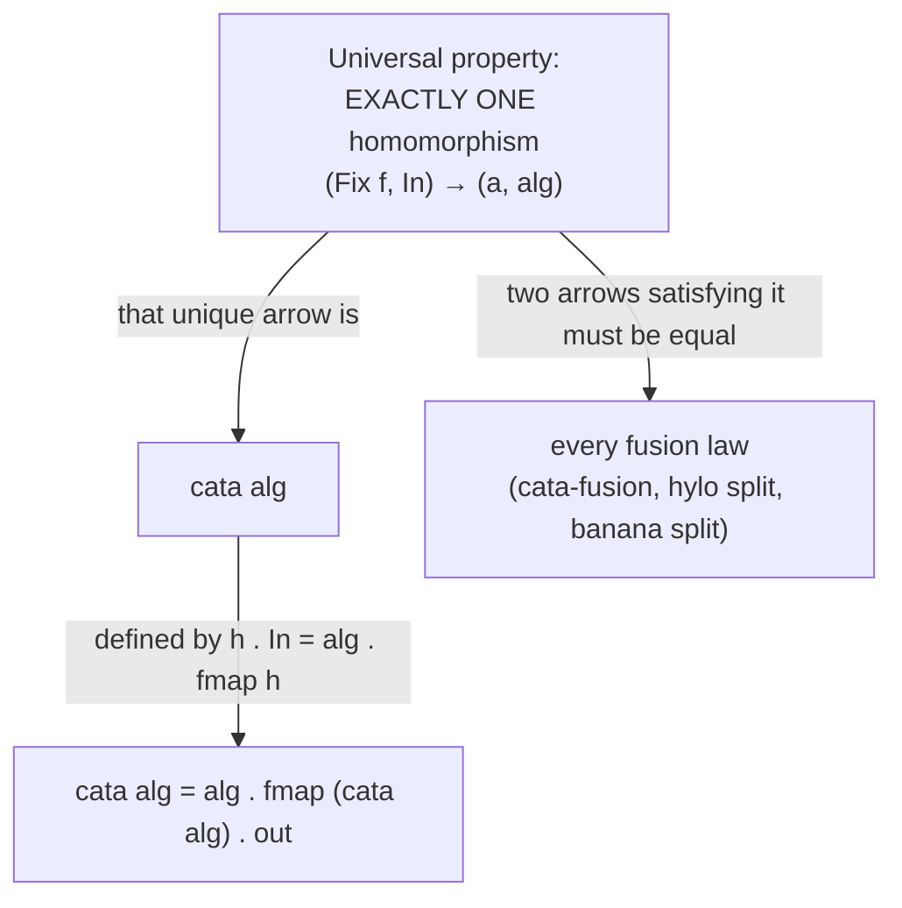
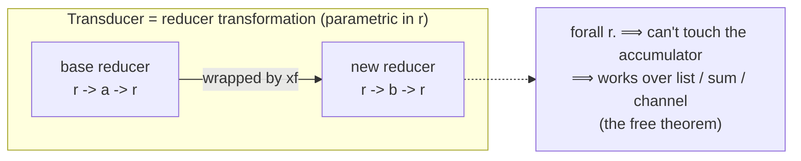

# Recursion Schemes & Transducers (Professional Level)

> **Roadmap:** [Functional Programming](../README.md) → Recursion Schemes & Transducers
>
> *By this level you can write `cata`/`ana`/`hylo` and a transducer. The professional questions are different: **why** is a catamorphism the *unique* arrow out of the initial F-algebra (so the fold is forced, not chosen), what laws license the fusion you rely on, what does each scheme/bind cost the allocator, and how do you *prove* the fused version is faster rather than assume it?*

---

## Table of Contents

1. [Introduction](#introduction)
2. [Prerequisites](#prerequisites)
3. [F-Algebras and the Initial Algebra](#f-algebras-and-the-initial-algebra)
4. [Why `cata` Is *Unique*: the Universal Property](#why-cata-is-unique-the-universal-property)
5. [Coalgebras, Anamorphisms, and Corecursion](#coalgebras-anamorphisms-and-corecursion)
6. [Fusion Laws: cata/ana/hylo](#fusion-laws-cataanahylo)
7. [Transducers, Formally: the Reducer Transformation](#transducers-formally-the-reducer-transformation)
8. [Runtime Cost and Measurement](#runtime-cost-and-measurement)
9. [Common Mistakes](#common-mistakes)
10. [Test Yourself](#test-yourself)
11. [Cheat Sheet](#cheat-sheet)
12. [Summary](#summary)
13. [Further Reading](#further-reading)
14. [Related Topics](#related-topics)

---

## Introduction

> Focus: **the formal core and the runtime price.** Upward into the algebra — F-algebras, initial algebras, the universal property that makes `cata` *unique* and the fusion laws *theorems*. Downward into the runtime — per-node `Fix` allocation, hylomorphism fusion, transducer closure cost, and how to measure each.

[`middle.md`](middle.md) showed *how* `cata`/`ana`/`hylo` and transducers work mechanically. This file answers *why they are forced* and *what they cost*.

The deep fact is this: a catamorphism is not "a fold we decided to write." It is **the unique structure-preserving map from the initial F-algebra to any other F-algebra** — given a pattern functor `f` and any algebra `f a -> a`, there is *exactly one* function `Fix f -> a` that respects the structure, and `cata` *is* that function. "Exactly one" is what the universal property guarantees, and it's the source of every fusion law: because the arrow is unique, two ways of computing it must be equal, which is precisely what a fusion law asserts. The same uniqueness, dualized, gives anamorphisms over the *final* coalgebra.

The runtime story runs the other way. The `Fix` encoding allocates a wrapper per node; a naive `cata` is therefore a per-node allocation plus indirection. A **hylomorphism fuses the build and the fold so the intermediate `Fix`-structure is never allocated** — and the fusion law `hylo alg coalg = cata alg . ana coalg` is the *theorem* that makes that optimization sound. Transducers are the operational analogue: composed transducers fuse a pipeline so no intermediate collection is allocated, and the same "the fused form equals the staged form" reasoning licenses it.

> **The mental model:** the universal property is a *contract with two readers*. The first is the equational reasoner (you, the compiler) who relies on uniqueness to rewrite `cata f . cata g`, fuse `ana` into `cata`, or hoist a `map` — every such rewrite is a fusion law, and every fusion law is the universal property cashing out. The second is the allocator/JIT, which can only *erase* the abstraction's cost when your schemes stay in fusible, inlinable shapes. Honor both: prove the law, then measure the allocation.

---

## Prerequisites

- **Required:** Fluent with [`middle.md`](middle.md) — you can write a pattern functor, `Fix`, `cata`, `ana`, `hylo`, and a `map`/`filter`/`take` transducer, and explain early termination.
- **Required:** Comfort with parametric polymorphism, `Functor`/`fmap`, and reading a type signature like `(f a -> a) -> Fix f -> a`. See [Functors & Applicatives](../13-functors-and-applicatives/professional.md).
- **Required:** A working model of a managed runtime — heap vs stack, tracing/generational GC, JIT inlining and escape analysis (the runtime vocabulary from [Bad Structure → professional](../../anti-patterns/01-development/01-bad-structure/professional.md)).
- **Helpful:** You can read GHC Core (`-ddump-simpl`), a JMH `-prof gc` result, and a `criterion`/`benchstat` comparison, and tell signal from noise.
- **Helpful:** Exposure to one lazy language (Haskell) — fusion and strictness are clearest there; and to [Laziness & Streams](../12-laziness-and-streams/professional.md), where the same fusion forces govern stream pipelines.

> **Discipline from the runtime track:** if you can't name the tool that would *falsify* a performance claim about a `Fix`-encoded fold or a transducer pipeline, you're guessing. Every cost below is paired with the instrument that proves it; illustrative numbers are labeled.

---

## F-Algebras and the Initial Algebra

Fix a functor `f` (your pattern functor — `ListF a`, `ExprF a`, `TreeF a`). An **F-algebra** is a pair: a *carrier* type `a` and an *evaluation* function

```
alg :: f a -> a
```

That's the entire definition. `alg` says "given one layer of `f` whose children are already values of type `a`, produce an `a`." Every fold you've written *is* an F-algebra:

```haskell
-- Haskell — F-algebras for the ExprF functor. Each is (carrier, f carrier -> carrier).
evalAlg :: ExprF Int -> Int           -- carrier Int      : evaluate
evalAlg (NumF n)   = n
evalAlg (AddF a b) = a + b
evalAlg (MulF a b) = a * b

sizeAlg :: ExprF Int -> Int           -- carrier Int      : count nodes
sizeAlg (NumF _)   = 1
sizeAlg (AddF a b) = 1 + a + b
sizeAlg (MulF a b) = 1 + a + b
```

The F-algebras for a fixed `f` form a category: an object is an algebra `(a, alg)`, and an **algebra homomorphism** from `(a, alg)` to `(b, alg')` is a function `h :: a -> b` such that the square commutes:

```
        fmap h
   f a ────────▶ f b
    │             │
 alg│             │alg'
    ▼             ▼
    a ──────────▶ b
          h
```

i.e. `h . alg = alg' . fmap h`: *map the children then evaluate* equals *evaluate then map the result.* Homomorphisms are the structure-preserving maps between algebras.

Now the key object. The **initial algebra** is the algebra `(Fix f, In)` where `In :: f (Fix f) -> Fix f` is just the `Fix` constructor — it *builds* one layer instead of evaluating it. "Initial" means: **from the initial algebra there is exactly one homomorphism to every other algebra.** That unique homomorphism is the catamorphism.

```haskell
-- Haskell — the initial algebra's evaluation is the constructor itself:
In :: f (Fix f) -> Fix f
In = Fix
-- Lambek's lemma: In is an ISOMORPHISM — Fix f ≅ f (Fix f). The fixpoint is exact:
-- "an Expr" and "one layer of Expr whose children are Exprs" are the same data.
```

That `Fix f ≅ f (Fix f)` (Lambek's lemma) is *why* `Fix` is called a fixpoint: the type is literally a fixed point of the functor `f`, satisfying `t ≅ f t`. The constructor `In` and destructor `out :: Fix f -> f (Fix f)` are inverse.

---

## Why `cata` Is *Unique*: the Universal Property

The **universal property of the initial algebra** is the whole engine:

> For any F-algebra `alg :: f a -> a`, there exists a **unique** homomorphism `cata alg :: Fix f -> a` from the initial algebra `(Fix f, In)` to `(a, alg)`. It is the unique function `h` satisfying
>
> ```
> h . In = alg . fmap h          -- the homomorphism square, with In = Fix
> ```

Read that equation as the *definition* of `cata`, and it's exactly the implementation from [`middle.md`](middle.md):

```haskell
-- The universal property, solved for h, IS the implementation of cata:
--   h (In layer) = alg (fmap h layer)
cata :: Functor f => (f a -> a) -> Fix f -> a
cata alg = alg . fmap (cata alg) . out      -- out = unwrap Fix
```

Two consequences make this the most important section in the file:

**1. The fold is *forced*, not invented.** You don't get to choose how to recurse — once you give an algebra, the *only* structure-respecting function is `cata alg`. There is no other lawful way to fold. This is why recursion schemes feel "canonical": they are the unique solution to a universal property, not one design among many.

**2. Every fusion law is uniqueness cashing out.** If two functions both satisfy the universal property's equation for the same algebra, they *are equal* (uniqueness). So any time you can show "this composite function makes the homomorphism square commute," it must equal `cata alg`. That single inference is the proof skeleton of *every* fusion law below.



> **The professional payoff:** "is this fold correct?" reduces to "does my algebra make the square commute?" — a local, equational check, not a recursion you trace by hand. And "can I fuse these two passes?" reduces to "do both sides satisfy the same universal property?" — which is why the laws are *theorems*, safe to apply mechanically.

---

## Coalgebras, Anamorphisms, and Corecursion

Dualize everything (reverse every arrow). An **F-coalgebra** is `(a, coalg)` with

```
coalg :: a -> f a            -- from a seed, produce ONE layer of next-seeds
```

The coalgebras form a category, and the dual of "initial algebra" is the **final (terminal) coalgebra** `(Nu f, out)` — the type of *possibly-infinite* `f`-structures. Its universal property is the mirror image:

> For any coalgebra `coalg :: a -> f a`, there is a **unique** homomorphism `ana coalg :: a -> Nu f` into the final coalgebra. It satisfies `out . h = fmap h . coalg`.

```haskell
-- Haskell — ana, the unique map INTO the final coalgebra; the dual of cata.
ana :: Functor f => (a -> f a) -> a -> Nu f
ana coalg = In . fmap (ana coalg) . coalg
```

The distinction `Fix`/`Mu` (initial, *finite* structures, consumed by `cata`) vs `Nu` (final, *possibly infinite*, produced by `ana`) is the formal version of the laziness story:

- `cata` is **structural recursion** — it terminates because it consumes a finite initial structure, peeling one constructor per step.
- `ana` is **guarded corecursion** — it produces a possibly-infinite final structure productively; each step yields one constructor before recursing (the "guardedness" that keeps it productive rather than divergent).

In a *total* setting these are different types (`Mu f` ≠ `Nu f`); in a lazy language like Haskell they coincide as `Fix f`, which is why you can `cata` over an `ana`-built infinite stream as long as the algebra is sufficiently lazy — exactly the [laziness](../12-laziness-and-streams/professional.md) fusion that lets a lazy fold consume a lazy unfold without materializing it.

---

## Fusion Laws: cata/ana/hylo

These are the laws you rely on (often implicitly, via the compiler) when you refactor or optimize. Each is a *theorem* provable from the universal property — "both sides are the unique homomorphism, so they're equal."

**1. cata-fusion (the fold–fold law).** If `h` is an algebra homomorphism — `h . alg = alg' . fmap h` — then

```
h . cata alg  ≡  cata alg'
```

Post-composing a fold with a homomorphism collapses into a *single* fold with a different algebra. This is the law that lets a compiler (or you) **fuse a `cata` followed by a transformation into one `cata`**, eliminating a pass.

**2. The hylomorphism law (the central one).** A hylomorphism is *defined* as the fused composite, and the law states the equivalence to the staged version:

```
hylo alg coalg  ≡  cata alg . ana coalg
hylo alg coalg  =  alg . fmap (hylo alg coalg) . coalg     -- the fused implementation
```

The right-hand `cata alg . ana coalg` *builds* the whole intermediate `Fix`-structure with `ana`, then *tears it down* with `cata`. The left-hand fused `hylo` produces each layer with `coalg` and immediately consumes it with `alg` — **the intermediate structure is never allocated.** The law guarantees the two are equal, so the optimizer (or you) may replace the staged form with the fused one *for free*. This is the formal license for the merge-sort/factorial fusion from [`middle.md`](middle.md).

```haskell
-- Haskell — the hylo law made operational. These are equal by the law,
-- but the right one ALLOCATES the whole tree; the left one allocates NOTHING extra.
mergeSort = hylo mergeAlg splitCoalg            -- fused: no intermediate tree
mergeSort = cata mergeAlg . ana splitCoalg       -- staged: builds then folds the tree
```

**3. The banana-split law.** Two folds over the *same* structure can be computed in **one pass** producing a pair:

```
(cata f &&& cata g)  ≡  cata ((f . fmap fst) &&& (g . fmap snd))
```

i.e. "compute the sum AND the count of a tree" need not traverse twice. This is the recursion-scheme analogue of *loop fusion* — and the exact same win a transducer gives by fusing `map`+`filter`+`reduce` into one traversal. (The name is from the "Bananas" paper, where `cata` is written with banana brackets `⦇ ⦈`.)

**4. The map-fusion law (the bridge to transducers).** For lists specifically,

```
map f . map g  ≡  map (f . g)            -- two passes fuse to one
```

is the simplest fusion law and *exactly* what a transducer `(comp (map g) (map f))` performs operationally: instead of two passes building an intermediate list, one pass applies `f . g`. **Transducers are map/filter-fusion made into composable runtime values.** GHC achieves the same statically via *short-cut fusion* (`foldr`/`build`, stream fusion); transducers achieve it dynamically and portably across sources.

> **The professional reading:** the recursion-scheme fusion laws (cata-fusion, hylo, banana-split) and the list map-fusion law are the *same* phenomenon — *eliminate the intermediate structure by proving the fused form equals the staged form.* The proof is always uniqueness from the universal property. Transducers are this fusion lifted to first-class, source-agnostic values; stream fusion is this fusion baked into a compiler. Recognizing them as one idea is the senior-to-professional jump.

---

## Transducers, Formally: the Reducer Transformation

A transducer's formal content is small and precise. A **reducer** over item type `a` and accumulator `r` is `r -> a -> r` (Clojure's argument order). A **transducer** is a polymorphic function

```
xf :: forall r. (r -> a -> r) -> (r -> b -> r)
```

— given a reducer that consumes `a`s, produce a reducer that consumes `b`s, doing the transformation in between. The **parametricity** in `r` (it works for *any* accumulator type) is what guarantees a transducer can't inspect or depend on the accumulator — it can only thread it — which is precisely why the *same* transducer works over a list (`r = list`), a sum (`r = number`), or a channel (`r = channel state`). The free theorem from that `forall r.` *is* the source/sink-independence.

The three "arities" a real transducer implements (Clojure's reducing-function protocol) make the algebra total:

```clojure
;; A complete reducing function has three arities; a transducer must handle all:
(fn
  ([] (rf))                 ; init    — produce an empty accumulator
  ([acc] (rf acc))          ; complete— finalize (flush buffers, e.g. partition)
  ([acc x] ...))            ; step    — the per-item reduce
```

The `complete` arity is the non-obvious one: a *stateful, buffering* transducer like `partition-all` holds a partial group and must **flush it on completion**. Without the completion arity, fused stateful pipelines would silently drop the trailing buffer — the transducer equivalent of forgetting to emit the last chunk.

**Early termination** is the operational dual of corecursion's productivity: a `reduced`-wrapped accumulator signals "stop pulling," letting a fused `take`/`take-while` short-circuit an infinite or expensive source. Formally it makes the reduce a *monoid action with an absorbing element* — once `reduced`, further items are absorbed (ignored).



> **Why this matters at this level:** the `forall r.` is not decoration — it's the formal guarantee of source/sink independence (the property [`senior.md`](senior.md) calls "portability"). And the three arities + `reduced` are what make a transducer a *total, fusible, short-circuiting* reducer transformation rather than just a fancy `map`. A transducer that ignores `complete` or `reduced` is incorrect on stateful or infinite inputs.

---

## Runtime Cost and Measurement

Now the price. Never argue cost from intuition — here's how to *prove* it per runtime.

### Recursion schemes: `Fix` allocation vs hylo fusion

A naive `cata` over a `Fix`-encoded structure pays, per node:

- **One `Fix` wrapper allocation** (the structure was built wrapped) — a heap object with a header per node.
- **One `fmap` traversal** of the layer's children.
- **One indirect call** to the algebra (and to `out`/`In`).

So a `Fix`-encoded fold of an N-node tree is **O(N) heap objects + O(N) indirections** beyond the work itself. In GHC with `-O2`, `INLINE`d `cata` and the `recursion-schemes` `Base`-functor machinery let the simplifier *specialize and fuse* much of this away — but only when the algebra and functor are concrete and inline. Read the Core to confirm:

```bash
# Did cata fuse, or is Fix being allocated per node?
ghc -O2 -ddump-simpl -dsuppress-all MergeSort.hs | less
#   look for: are `Fix`/`In`/`out` constructors still present in the hot loop,
#   or did the simplifier erase them (good)?
./prog +RTS -s     # "bytes allocated in the heap" — compare hylo vs cata.ana
```

A **hylomorphism avoids the `Fix` allocation entirely** — the hylo law says it equals `cata . ana`, but the fused implementation never constructs the intermediate. This is the *measurable* reason to prefer `hylo` on a hot path:

```
            ana builds                    cata tears down
  seed ──▶ [ Fix-tree of N nodes ]  ──▶  result          ← cata . ana : O(N) wrappers
  seed ─────────────  hylo  ─────────────▶ result          ← fused      : 0 intermediate
```

> **Illustrative (label: reproduce, don't trust):** a Haskell merge sort written as `cata mergeAlg . ana splitCoalg` allocated the full O(N log N)-node split tree; the `hylo mergeAlg splitCoalg` form allocated ~none of it and ran measurably faster and with lower max residency under `+RTS -s` — *when `hylo` was `INLINE`d and the functor concrete*. The lesson mirrors monads: the abstraction is free only when it fuses, and `+RTS -s` / Core dump tells you whether it did.

### Transducers: closure stack vs eliminated intermediates

A transducer pipeline trades *N intermediate collections* for *a stack of closures*:

- **Saved:** the `map().filter().map()` chain's per-stage collection allocations — the dominant cost on large inputs. One pass, one output.
- **Paid:** each transducer is a closure wrapping the reducer beneath it; a deep `comp` is a small stack of indirect calls per item, plus any *stateful* transducer's captured state (a `take` counter, a `partition` buffer).

On the JVM (transducers via a library, or analogously Java Streams), the JIT can inline a monomorphic, non-megamorphic transducer stack so the closures vanish; a megamorphic `step` call site (many different transducer types at one site) defeats it and the indirections become real. In JS, V8 inlines small monomorphic reducers but bails on polymorphic ones.

```javascript
// JavaScript — A/B the fusion win. Measure allocation + time, don't assume.
const N = 5_000_000;
const data = Array.from({length: N}, (_, i) => i);

// BEFORE: 3 passes, 2 intermediate arrays of ~N each.
console.time("chained");
const a = data.map(x => x*2).filter(x => x%3===0).map(x => x+1);
console.timeEnd("chained");

// AFTER: one pass, no intermediate arrays (transducers-js).
import { comp, map, filter, into } from "transducers-js";
console.time("transduced");
const xf = comp(map(x => x*2), filter(x => x%3===0), map(x => x+1));
const b = into([], xf, data);
console.timeEnd("transduced");
// Confirm allocation with --prof / heap snapshots, not just wall time.
```

### Measurement matrix

| Concern | Haskell | JVM (Java/Clojure) | JavaScript/Node |
|---|---|---|---|
| **Did the scheme fuse?** | `-ddump-simpl` (is `Fix`/`In`/`out` gone in the loop?) | `-XX:+PrintInlining` (did the stack inline?) | `--trace-opt`/`--trace-deopt` |
| **Per-node / per-stage allocation** | `+RTS -s`; `-prof` cost centres | JFR allocation events; JMH `-prof gc` (B/op) | `--prof`; DevTools heap snapshots |
| **hylo vs cata.ana** | `+RTS -s` max residency + bytes allocated | n/a (rare) | n/a |
| **Transducer fusion win** | `criterion` | **JMH** A/B chained vs transduced | `tinybench`; `console.time` + heap snapshot |
| **Law conformance (custom scheme/transducer)** | QuickCheck (universal-property / fusion) | jqwik | fast-check |

> **Discipline:** capture a baseline, change *one* lever (cata→hylo; `map().filter()`→transducer; add `INLINE`/`SPECIALIZE`), re-measure, attribute the win to that lever. A blended "I hylo-fied and inlined and strictified" number teaches nothing. And property-test your *custom* schemes/transducers against the laws — an unlawful `cata` (algebra that isn't a homomorphism) or a transducer that ignores `complete`/`reduced` breaks silently on stateful or infinite inputs, exactly where tests are sparse.

---

## Common Mistakes

Professional-level mistakes — subtle and therefore expensive:

1. **Treating a catamorphism as "a fold I chose."** It's the *unique* homomorphism out of the initial algebra; the recursion is forced by the universal property. Missing this is missing why the fusion laws are *theorems* rather than coincidences.
2. **Assuming a `Fix`-encoded `cata` is free.** It allocates a wrapper per node plus indirection unless the compiler fuses/specializes it. Verify with `-ddump-simpl` / `+RTS -s` before claiming a scheme is cheap *or* slow.
3. **Using `cata . ana` on a hot path instead of `hylo`.** The staged form *builds the whole intermediate structure*; `hylo` fuses it away (and the law guarantees equality). On hot recursion, fuse.
4. **Writing two folds where banana-split fuses to one.** "Sum and count" / "min and max" over one structure should be a single fused `cata` producing a pair, not two traversals — the recursion-scheme loop-fusion win.
5. **A transducer that ignores the `complete` arity.** Stateful/buffering transducers (`partition-all`, `dedupe` with flush) must flush on completion or silently drop the trailing buffer — wrong output on the last chunk, untested because tests rarely end mid-buffer.
6. **A transducer that ignores `reduced`.** Without honoring early termination, `take`/`take-while` loop forever over infinite sources and waste work over expensive ones; the fused pipeline must short-circuit.
7. **Relying on a transducer touching the accumulator.** The `forall r.` parametricity is the guarantee of source/sink independence; a transducer that inspects/depends on `r`'s concrete type breaks portability (and the free theorem) — it's no longer a real transducer.
8. **Megamorphic transducer/scheme call sites.** Many distinct transducer or algebra types at one call site go megamorphic, defeating JIT inlining/escape analysis — the fusion win evaporates and the closures/wrappers become real allocations. Confirm with `PrintInlining` / `--trace-deopt`.
9. **Property-testing only examples.** Custom schemes/transducers must be checked against the *laws* (universal property / fusion / arity totality), where the silent bugs live — not just a handful of inputs.

---

## Test Yourself

1. Define an F-algebra and state what makes `(Fix f, In)` the *initial* one. What is `In` concretely?
2. State the universal property of the initial algebra, and explain in one sentence why it makes `cata alg` *unique*.
3. Show how "every fusion law is the universal property cashing out" — i.e. the proof skeleton common to cata-fusion, hylo, and banana-split.
4. Write the hylomorphism law. Which side allocates the intermediate structure, and why does the law let you avoid that allocation safely?
5. What is the banana-split law, and which transducer behavior is its operational twin?
6. A transducer has type `forall r. (r -> a -> r) -> (r -> b -> r)`. What does the `forall r.` *guarantee*, and why does that guarantee enable running the same transducer over a vector, a sum, and a channel?
7. Name the two non-`step` arities of a transducer's reducing function and the bug each prevents.
8. On the JVM, an `Optional`-style or transducer chain shows ~0 B/op in one benchmark and tens of B/op in another with identical code. What changed, and which flag confirms it?

<details>
<summary>Answers</summary>

1. An **F-algebra** is a pair `(a, alg)` with `alg :: f a -> a` (carrier `a`, evaluator collapsing one layer of `a`-children to an `a`). `(Fix f, In)` is **initial** because from it there is *exactly one* algebra homomorphism to every other F-algebra. Concretely `In = Fix :: f (Fix f) -> Fix f` — it *builds* a layer rather than evaluating it; by Lambek's lemma it's an isomorphism `Fix f ≅ f (Fix f)`.
2. **Universal property:** for any `alg :: f a -> a` there is a *unique* homomorphism `cata alg :: Fix f -> a` satisfying `h . In = alg . fmap h`. It makes `cata alg` unique because the equation has exactly one solution — any function respecting the structure *is* `cata alg`, so the fold is forced, not chosen.
3. **Skeleton:** to prove `LHS ≡ cata alg` (or `LHS ≡ RHS`), show `LHS` satisfies the universal property's equation `h . In = alg . fmap h` for the relevant algebra; by *uniqueness*, any two functions satisfying it are equal, so `LHS` equals the unique `cata alg` (and hence equals any other expression also shown to satisfy it). cata-fusion, hylo, and banana-split each just exhibit both sides as the same unique homomorphism.
4. `hylo alg coalg ≡ cata alg . ana coalg` (with fused impl `alg . fmap (hylo alg coalg) . coalg`). The **right side (`cata . ana`)** allocates the whole intermediate `Fix`-structure (`ana` builds it, `cata` consumes it). The law guarantees the fused `hylo` — which produces and immediately consumes each layer, allocating *no* intermediate — is *equal*, so you may use it safely on a hot path.
5. **Banana-split:** `(cata f &&& cata g) ≡ cata ((f . fmap fst) &&& (g . fmap snd))` — two folds over one structure computed in a *single* pass producing a pair. Its operational twin is a **transducer fusing `map`+`filter`+`reduce` (or multiple stages) into one traversal** — loop fusion, no intermediate.
6. `forall r.` (parametricity in the accumulator type) **guarantees the transducer cannot inspect or depend on the accumulator** — it can only thread it through the supplied reducer. By the free theorem, the transducer's behavior is independent of what `r` is, so the *same* transducer works whether `r` is a vector (collect), a number (sum), or a channel's state (stream) — i.e. it's source/sink-independent.
7. **`init`** (`([])` → produce an empty accumulator) and **`complete`** (`([acc])` → finalize/flush). `complete` prevents *stateful/buffering* transducers (`partition-all`, `dedupe`) from silently dropping the trailing buffer; `init` lets the pipeline supply a seed (and composes correctly when an upstream stage needs one).
8. The **call-site monomorphism/inlining** changed. ~0 B/op: the chain inlined and stayed monomorphic, so escape analysis scalar-replaced the intermediates/wrappers. Tens of B/op: a polymorphic/megamorphic stage, an escaping closure, or a too-large method blocked inlining → real heap allocations. Confirm with `-XX:+PrintInlining` (JVM) — and JMH `-prof gc` for the B/op itself.

</details>

---

## Cheat Sheet

| Concept | One-line truth |
|---|---|
| **F-algebra** | `(a, alg :: f a -> a)` — collapse one layer of finished children. |
| **Initial algebra** | `(Fix f, In)`; `In = Fix`; unique homomorphism to every algebra = `cata`. |
| **Lambek's lemma** | `Fix f ≅ f (Fix f)` — the type is a true fixpoint of `f`. |
| **Universal property** | `∃! h. h . In = alg . fmap h`; that `h` is `cata alg` — the fold is *forced*. |
| **Coalgebra / final coalgebra** | `a -> f a`; `(Nu f, out)` holds possibly-infinite structures; `ana` is the unique map *into* it. |
| **cata-fusion** | `h . cata alg ≡ cata alg'` when `h` is a homomorphism — fuse fold + transform. |
| **hylo law** | `hylo alg coalg ≡ cata alg . ana coalg`; fused side allocates *no* intermediate. |
| **banana-split** | two folds → one pass producing a pair; recursion-scheme loop fusion. |
| **map fusion** | `map f . map g ≡ map (f . g)` — exactly what a transducer does at runtime. |
| **Transducer** | `forall r. (r->a->r) -> (r->b->r)`; `forall r` ⟹ source/sink independence. |
| **3 arities** | `init` / `step` / `complete`; `complete` flushes stateful buffers. |
| **`reduced`** | absorbing element → early termination over infinite/expensive sources. |
| **Cost: `Fix` cata** | O(N) wrappers + indirection unless fused/specialized; read Core / `+RTS -s`. |
| **Cost: hylo** | no intermediate structure — the fused-recursion win; verify with `+RTS -s`. |
| **Cost: transducer** | trades N intermediate collections for a closure stack; net win on big inputs. |

**Three golden rules:**
- *A catamorphism is the unique homomorphism out of the initial algebra; every fusion law is that uniqueness cashing out — so the laws are theorems you may apply mechanically.*
- *Fusion (`hylo`, transducers, banana-split, `map`-fusion) is one idea: eliminate the intermediate by proving the fused form equals the staged form. `hylo` and transducers *save* allocation; the `Fix`-everywhere encoding *costs* it.*
- *The abstraction is free only when it fuses/inlines — read the Core, count B/op, honor `complete`/`reduced` — never assume.*

---

## Summary

- An **F-algebra** is `(a, alg :: f a -> a)`. For a pattern functor `f`, the **initial algebra** is `(Fix f, In)` with `In = Fix` (Lambek: `Fix f ≅ f (Fix f)`). Its **universal property** — a *unique* homomorphism to every other algebra — *is* the catamorphism: the fold is forced, not chosen.
- **Every fusion law is that uniqueness cashing out.** cata-fusion (fold + transform → one fold), the **hylomorphism law** (`hylo ≡ cata . ana`, but the fused form allocates *no* intermediate structure), and **banana-split** (two folds → one pass) are all proved by "both sides are the unique homomorphism." The list **map-fusion** law `map f . map g ≡ map (f . g)` is the same phenomenon — and it's exactly what a transducer performs at runtime.
- **Coalgebras / anamorphisms** are the dual: the unique map *into* the final coalgebra `Nu f` (possibly-infinite structures). `cata` is structural recursion (consumes finite `Fix`); `ana` is guarded corecursion (produces possibly-infinite `Nu`) — the formal core of the laziness fusion that lets a lazy fold consume a lazy unfold.
- **Transducers, formally,** are `forall r. (r->a->r) -> (r->b->r)`. The `forall r.` parametricity *guarantees* source/sink independence (the free theorem = "portability"). The three arities (`init`/`step`/`complete`) make them total — `complete` flushes stateful buffers — and `reduced` (an absorbing element) gives fused early termination.
- **Runtime:** a `Fix`-encoded `cata` allocates a wrapper + indirection per node unless fused/specialized; a **hylomorphism eliminates the intermediate structure entirely** (the fused-recursion win). Transducers trade N intermediate collections for a closure stack — a net win on large inputs, dependent on monomorphic inlining.
- **Measure, always:** `-ddump-simpl` / `+RTS -s` (did the scheme fuse? is `Fix` gone?), JMH `-prof gc` / `PrintInlining` (did the transducer stack inline?), `--trace-deopt` (megamorphic bailout). Property-test custom schemes/transducers against the laws and arity totality — that's where the silent bugs live.
- This is the section's most advanced topic; from here, the same fusion forces recur in [Laziness & Streams](../12-laziness-and-streams/professional.md) (stream fusion) and [Monads](../09-monads-plain-english/professional.md) (allocation-per-bind, free monads as folds over an instruction functor).

---

## Further Reading

- **"Functional Programming with Bananas, Lenses, Envelopes and Barbed Wire"** — Meijer, Fokkinga, Paterson (1991) — cata/ana/hylo, the fusion laws, banana-split; the source.
- **"Understanding F-Algebras"** — Bartosz Milewski — initial algebras, the universal property, and Lambek's lemma, derived carefully.
- **`recursion-schemes`** (Edward Kmett) source — the production encoding (`Base` type family, `Recursive`/`Corecursive`); read how `cata`/`hylo` are `INLINE`d for fusion.
- **"Reflection without Remorse"** — van der Ploeg & Kiselyov (2014) — why naive recursive/free encodings go O(N²) and how to restore O(N); the same trap shadows naive `Fix` interpreters.
- **Rich Hickey, "Transducers"** (Strange Loop 2014) + clojure.org/reference/transducers — the reducing-function transformation, the three arities, and `reduced`, from the designer.
- **"Theorems for Free!"** — Philip Wadler (1989) — parametricity and free theorems; *why* `forall r.` forces a transducer's source/sink independence.
- **Stream Fusion papers** (Coutts, Leshchinskiy, Stewart, 2007) — how a compiler achieves statically what transducers achieve dynamically.
- **Optimizing Java** — Evans, Gough, Newland (2018) — escape analysis, scalar replacement, JMH, JFR — the "did the abstraction vanish?" toolkit.

---

## Related Topics

- [Functors & Applicatives](../13-functors-and-applicatives/professional.md) — the `f` in an F-algebra is a `Functor`; `fmap` over its child positions is the precondition for `cata`/`ana`.
- [Algebraic Data Types](../06-algebraic-data-types/professional.md) — recursive sum types re-encoded as pattern functors + `Fix`; the initial algebra is the data type.
- [Laziness & Streams](../12-laziness-and-streams/professional.md) — `ana`/`Nu`/corecursion and stream fusion are the lazy face of the same fusion laws.
- [Monads — Plain English](../09-monads-plain-english/professional.md) — allocation-per-bind, and free monads as `cata`/`hylo` over an instruction functor; the same "abstraction is free only when it fuses" discipline.
- [Composition](../05-composition/professional.md) — `hylo = cata . ana`; transducers compose with ordinary `compose`; fusion is composition collapsing intermediates.
- [Map / Filter / Reduce](../04-map-filter-reduce/professional.md) — `cata` generalizes `fold`; transducers generalize `map`/`filter`; map-fusion is the base case of every fusion law here.
- [Bad Structure → professional](../../anti-patterns/01-development/01-bad-structure/professional.md) — escape analysis, inlining, allocation pressure — the runtime vocabulary used to measure scheme/transducer cost.
- profiling-techniques · big-o-analysis · memory-leak-detection — the measurement toolkits referenced throughout.
