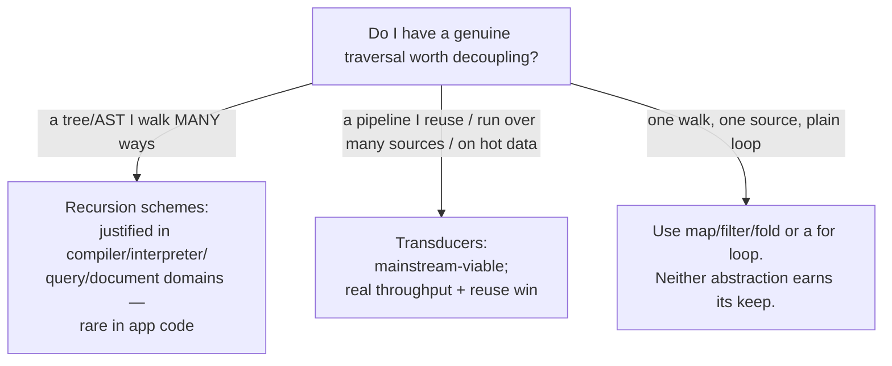

# Recursion Schemes & Transducers (Senior Level)

> **Roadmap:** [Functional Programming](../README.md) → Recursion Schemes & Transducers
>
> **Essence:** Both abstractions buy you the same thing — *the per-step logic decoupled from the traversal, fused into one pass.* At the senior level the question is never "what is a catamorphism?" but "**does factoring this recursion (or this pipeline) into a reusable, fused abstraction lower the cost of change here, or am I importing `Fix` and `comp`-of-transducers to look sophisticated in a codebase that needed a `for` loop?**" One of these two ideas earns its keep in everyday production code (transducers, on hot pipelines and reusable transforms); the other almost never does (recursion schemes, outside compilers and interpreters).

---

## Table of Contents

1. [Introduction](#introduction)
2. [The Two Abstractions, the One Payoff](#the-two-abstractions-the-one-payoff)
3. [Recursion Schemes: Where They Genuinely Pay Off](#recursion-schemes-where-they-genuinely-pay-off)
4. [Transducers: Where They Genuinely Pay Off](#transducers-where-they-genuinely-pay-off)
5. [Language Reality: What You Actually Have](#language-reality-what-you-actually-have)
6. [The Cost: Allocation, Cognition, Debuggability](#the-cost-allocation-cognition-debuggability)
7. [Choosing Among the Fusion Tools You Already Have](#choosing-among-the-fusion-tools-you-already-have)
8. [Designing the Abstraction Boundary When You Do Adopt](#designing-the-abstraction-boundary-when-you-do-adopt)
9. [When This Is Over-Engineering](#when-this-is-over-engineering)
10. [A Worked Judgment Call](#a-worked-judgment-call)
11. [Common Mistakes](#common-mistakes)
12. [Test Yourself](#test-yourself)
13. [Cheat Sheet](#cheat-sheet)
14. [Summary](#summary)
15. [Further Reading](#further-reading)
16. [Related Topics](#related-topics)

---

## Introduction

> Focus: **design and architecture judgment.** Not "what is a catamorphism" (that's [`junior.md`](junior.md)) and not "how do I write `cata`/a transducer" (that's [`middle.md`](middle.md)) — but *when, in a codebase that ships and a team that has to maintain it, factoring recursion into a scheme or a pipeline into a transducer is the right call, and when it is abstraction you'll regret in the next code review.*

Recursion schemes and transducers sit at the far edge of this functional-programming section, and that placement is honest: they are the most powerful and the most easily *misapplied* tools here. Both deliver a genuine, measurable benefit — **fused, single-pass traversal with the per-step logic factored out as a reusable, composable value** — and both can become exactly the kind of clever-over-simple abstraction that slows every future reader.

The senior skill is to hold two facts at once:

1. **The fusion benefit is real and sometimes decisive.** A transducer that turns a five-stage `map/filter/map/filter/take` over a 50-million-row stream from five passes and four giant intermediate collections into *one pass with no intermediates* is not a style preference — it's a throughput and memory win you can put on a dashboard. A hylomorphism that processes a structure without materializing it is the same win for recursion.

2. **The abstraction tax is also real, and these two ideas sit on opposite sides of the cost/benefit line for *most* code.** Transducers are a *mainstream-viable* tool: Clojure ships them, transducers-js and Java Streams give you most of the benefit, and a reusable cross-context pipeline is a normal thing to want. Recursion schemes are *specialist*: `Fix`, pattern functors, and `cata`/`ana` are the right tool for an *expression-tree-shaped* domain (compilers, query optimizers, document transforms) and almost nowhere else — most application code never has a recursive data type it walks enough different ways to justify the machinery.

> **The frame for this whole file:** both abstractions are *fusion + decoupling* tools. Adopt them where you have (a) a genuine traversal you walk *many ways* or *over many sources*, and (b) a fusion or reuse payoff that's measurable or maintainability-positive. Reject them where you have one walk, one source, and a `for` loop that any junior reads instantly. "It's more principled" is not the cost function; *change-cost × comprehension-cost over the code's lifetime* is.

---

## The Two Abstractions, the One Payoff

Before judging *when*, be precise about *what* you're buying, because the value proposition is identical and that's what makes them siblings:

| | You factor out… | …into a reusable value | The fusion win |
|---|---|---|---|
| **Recursion schemes** | the recursion over a tree/nested type | an **algebra** `f a -> a` (and `cata`/`ana`/`hylo` drivers) | `hylo` runs build+consume in one pass, no intermediate structure |
| **Transducers** | the iteration over a sequence/source | a **transducer** `rf -> rf` (composed pipeline) | one pass over the source, no intermediate collections |

Both let you (1) name the per-step logic as a first-class, testable, composable value; (2) write/verify the traversal *once*; (3) fuse multi-step work into a single pass. The decision in both cases reduces to the same question: **is the per-step logic worth decoupling from the traversal here, and is the fusion worth the indirection?**

The answers differ sharply by abstraction, and that asymmetry is the most important thing in this file:



---

## Recursion Schemes: Where They Genuinely Pay Off

Be blunt: **most production code should never define a `Fix` type or a `cata`.** The honest set of places recursion schemes pay off is small and specific — and it's the set where you have *one recursive data type that you traverse in many different ways*:

- **Compilers and interpreters.** An AST is *the* canonical recursion-scheme domain. You evaluate it, type-check it, pretty-print it, optimize it, compute free variables, constant-fold it — a dozen folds over the *same* tree. Factoring the recursion into `cata` once, and writing each pass as a small algebra, genuinely deletes duplication and keeps every pass total and consistent. This is why the technique was born in the programming-languages community.
- **Query / expression optimizers.** A SQL or filter-expression tree gets rewritten by many passes (predicate pushdown, constant folding, join reordering). Paramorphisms (fold-with-original-subterm) and the rewrite-friendly schemes shine here because rewrites need both the folded result and the original shape.
- **Document / config transforms.** A nested document (JSON-ish, an HTML DOM, a config tree) walked by many transformations — normalize, validate, redact, render — is the same shape as an AST and benefits the same way.
- **Algorithms that are *literally* unfold-then-fold.** Divide-and-conquer (merge sort, quicksort, tree-based DP) is a hylomorphism by nature; expressing it as one makes the "build the call tree, fold it back" structure explicit and fuses away the intermediate.

The unifying property: **a recursive structure you walk *enough different ways* that the duplicated recursion is a real maintenance cost.** One fold over one tree does not clear this bar — that's just a recursive function, and a recursive function is fine. The bar is "a dozen passes, and I want them consistent, total, and free of copy-pasted traversal."

> **The senior reading:** recursion schemes are a *domain* tool, not a *general* tool. If your domain is "trees walked many ways" (PL, queries, documents), they pay off and you should know them cold. If your domain is CRUD, services, UI, or data plumbing, you will almost never have the shape that justifies `Fix`, and reaching for it is a smell — the recursive function you were avoiding was clearer.

```haskell
-- Haskell — the case FOR recursion schemes: an AST walked many ways.
-- Each pass is a small algebra; cata is written once. THIS is where it pays off.
evalAlg  :: ExprF Value  -> Value     -- evaluate
freeVars :: ExprF (Set Name) -> Set Name  -- collect free variables
constFold:: ExprF Expr   -> Expr      -- (a paramorphism, really) constant-fold
prettyAlg:: ExprF Doc    -> Doc       -- pretty-print
-- a compiler has a dozen of these; cata makes them uniform, total, recursion-free.
```

---

## Transducers: Where They Genuinely Pay Off

Transducers sit on the *other* side of the line — they are *mainstream-viable* and pay off in ordinary production code, not just specialist domains. Three situations make them genuinely worth it:

**1. Hot data pipelines where intermediate collections hurt.** A `map().filter().map().filter()` chain over a large collection allocates an intermediate collection *per stage* and walks the data *per stage*. On a hot path — log processing, ETL, request fan-out, analytics — that's wasted CPU (multiple passes) and wasted memory (throwaway allocations feeding GC). A transducer fuses the whole chain into **one pass with zero intermediates**. This is the same fusion win as lazy streams, available even where you don't want laziness's downsides.

```clojure
;; Clojure — five stages, ONE pass, ZERO intermediate collections.
;; Over millions of rows this is a real throughput + allocation win.
(def pipeline
  (comp (map parse-row)
        (filter valid?)
        (map enrich)
        (filter in-region?)
        (map ->summary)))
(transduce pipeline conj [] huge-row-seq)   ; single traversal, no temp vectors
```

**2. A transformation you want to reuse across *different* sources/sinks.** This is the property `array.map().filter()` can never have. The *same* transducer can filter a vector, transform an infinite lazy sequence, process messages on a core.async channel, and fold straight to a number — because it's decoupled from where items come from and go. When you have one piece of business logic ("normalize and validate an event") that must run in a batch job *and* a streaming consumer *and* a test harness, a transducer lets you write it once and apply it in all three contexts. That reuse is a genuine architectural win — DRY across execution models.

```clojure
;; ONE transformation, applied in batch, streaming, and fold contexts:
(into [] pipeline batch-rows)          ; batch (vector)
(chan 1024 pipeline)                   ; streaming (channel) — same logic
(transduce pipeline + 0 batch-rows)    ; fold to a number — same logic
```

**3. Building composable, testable transformation *values*.** Because a transducer is a plain value with no data attached, you can name it, unit-test it in isolation, store it in a registry, pass it as a parameter, and compose it with `comp` like any function. "Our standard event-cleaning pipeline" becomes a value, not a pattern you re-type at each call site.

> **The senior reading:** transducers earn their place when you have *fusion pressure* (hot path, big data, intermediate-allocation cost) **or** *reuse pressure* (the same transform across vector/stream/channel). For a single `map` over a small list, they're over-engineering — plain `map` is clearer and equally fast. The discriminator is "is this transform reused or hot?" — if neither, skip it.

---

## Language Reality: What You Actually Have

The abstraction's value is bounded by the language's support, and these two ideas have *very* different mainstream stories.

| Language | Recursion schemes | Transducers |
|---|---|---|
| **Haskell** | First-class: `recursion-schemes` (Kmett) — `cata`/`ana`/`hylo`/`para`/`apo`, `Base`/`Recursive` typeclasses. The native home. | Possible via libraries (`foldl`, stream-fusion does the same job differently). |
| **Clojure** | Possible but rare (no `Fix` idiom); you'd hand-roll. | **The canonical home** — built into core (`map`/`filter`/`take` are transducers), `comp`, `transduce`, `into`, `sequence`, `chan`. |
| **Scala** | `Matryoshka` / `Droste` libraries bring `Fix`/`cata`/`ana` to Scala; used in data-pipeline/AST work (e.g. Slamdata/Quasar). Specialist. | Possible via libraries; `fs2`/`ZIO Stream` fusion covers most needs differently. |
| **JavaScript/TS** | Essentially never (no idiom, no HKT). | **transducers-js** (Cognitect) brings real transducers; usable but niche vs `Array` methods / RxJS. |
| **Java** | Never idiomatic (no HKT, no `Fix` culture). | **Streams are a limited cousin** — fused, single-pass, lazy intermediate ops — but *not* reusable/portable across sources the way a transducer is. |
| **Python** | Never idiomatic; you'd hand-roll a `cata`. | No standard transducers; generators + `itertools` give fusion-ish single-pass behavior instead. |

A few of these deserve a senior's attention because they teach the trade-off:

**Haskell's `recursion-schemes` is the real thing — and even there, it's specialist.** Kmett's library is the production implementation: it uses a `Base` type family and `Recursive`/`Corecursive` typeclasses so you don't write `Fix` by hand for built-in types. It's excellent and *still* mostly used in compiler/interpreter/AST-shaped code. The lesson: even in the language *built* for this, recursion schemes are a domain tool, not a default.

**Clojure transducers are the gold standard, and the design decision is instructive.** Rich Hickey's explicit goal was to **decouple the transformation from the source and the sink** — `map`/`filter`/`take` had been welded to sequences, and that welding prevented reuse over channels and other contexts. Transducers un-welded them. This is the clearest statement of the whole topic's thesis: *separate what-to-do-at-each-step from how-the-structure-is-traversed.*

**Java Streams are a limited cousin worth understanding precisely.** A `stream.map().filter().collect()` *is* fused and single-pass with lazy intermediate operations — so it captures the **fusion** benefit. What it lacks is **portability**: a `Stream` pipeline is bound to the `Stream` abstraction; you can't lift the *same* `map().filter()` and drop it onto a different source/sink (a queue, a reactive publisher) as a reusable value. Streams give you fusion-without-reuse; transducers give you fusion-*and*-reuse. Knowing which you need tells you whether plain Streams suffice (usually yes in Java).

**Scala's Matryoshka/Droste exist and are real, but niche.** They bring genuine `Fix`/`cata`/`ana` to Scala and are used in serious data-pipeline systems. If you're in a Scala shop doing AST/query work, they're a legitimate tool; if you're doing services, they're almost certainly over-reach, and `fs2`/`ZIO Stream` cover your fusion needs.

> **The senior reading of this table:** **transducers are mainstream-reachable** — Clojure natively, transducers-js / Streams as cousins — and worth adopting where fusion/reuse pressure is real. **Recursion schemes are specialist** — first-class only in Haskell/Scala-with-a-library — and worth adopting only in tree-walking domains. Match the tool to the language's grain *and* your domain shape; don't import `Fix` into a TypeScript service or a Go program (you can't, idiomatically, and shouldn't try).

---

## The Cost: Allocation, Cognition, Debuggability

Both abstractions are sometimes *cheaper* and sometimes *more expensive* than the naive code; a senior knows which, and why.

**Allocation — schemes can *cost*, hylo/transducers *save*.**
- A naive `cata` over a `Fix`-wrapped tree *allocates a `Fix` wrapper per node* and proceeds by indirection — in a strict language without aggressive optimization, that's measurable overhead versus a direct recursive function. The `recursion-schemes` library and GHC fusion claw much of it back, but the encoding is not free.
- A **hylomorphism**, by contrast, *saves* allocation: it never builds the intermediate `Fix`-tree. So `hylo` is the recursion-scheme you reach for *when performance matters*, and the `Fix`-everywhere encoding is the one you avoid on hot paths.
- **Transducers reliably save** intermediate-collection allocation: that's their headline. But each transducer is itself a closure wrapping a reducer, and a deep `comp` is a stack of closures — usually cheap, occasionally a JIT-inlining concern. The net is almost always a win over `map().filter()` chains because eliminating N intermediate collections dwarfs the closure overhead.

**Cognition — the real tax.** Both abstractions ask the reader to know a vocabulary that most engineers don't have. "Algebra," "coalgebra," "`Fix`," "pattern functor," "reducing-function transformation," and the transducer composition-order surprise are all *non-obvious*. In a team fluent in them, that cost is near zero; in a team that isn't, every review and every onboarding pays it, and — worse — people *misuse* the abstraction (recursion in the algebra; transducers re-created per item losing their state; reading `comp` as math composition). **The abstraction's value is gated on team fluency, full stop.**

**Debuggability — the hidden cost.** A direct recursive function has a stack trace that reads like the tree. A `cata`-based fold has a stack trace full of `cata`/`fmap` frames — the *mechanism*, not your logic — which is harder to read at 2 a.m. A fused transducer pipeline collapses five logical stages into one reduce, so a failure inside it doesn't point cleanly at "the filter stage." Fusion trades *legibility of the intermediate* for *performance*; that's a real cost when you're debugging, the same trade-off [laziness](../12-laziness-and-streams/senior.md) makes.

> **The cost summary:** `hylo` and transducers usually *save* allocation (no intermediates); `Fix`-encoded schemes can *cost* it. Both *cost* cognition and debuggability — bounded by team fluency. Budget the cognition tax explicitly: an abstraction nobody on the team reads fluently is negative leverage regardless of its elegance.

---

## Choosing Among the Fusion Tools You Already Have

Here is a senior reframe that deflates a lot of the mystique: **transducers are not the only way to get fusion, and recursion schemes are not the only way to walk a tree.** A mature engineer's instinct is not "should I use a transducer?" but "which of the fusion tools *already in my stack* fits this case, at the lowest comprehension cost?" Most languages give you several, and they overlap heavily.

For *pipelines*, the candidate fusion tools, ranked by how much novelty they impose on a reader:

| Tool | Fuses? | Reusable across sources? | Reader cost | Reach for it when… |
|---|---|---|---|---|
| A plain `for` loop | yes (one pass by construction) | n/a | ~zero | the pipeline is one-off, short, and hot |
| Lazy streams / generators (`Stream`, `yield`, `Seq`) | yes (lazy intermediate ops) | partly | low | you want fusion *and* laziness, single source |
| **Transducers** | yes | **yes** (the differentiator) | medium | the transform is reused across *vector / stream / channel*, or you want it as a value |
| Reactive (`Rx`, `fs2`, `ZIO Stream`) | yes | within that abstraction | medium-high | you also need async, backpressure, concurrency |

The decisive column is **"reusable across sources."** If you only need fusion over *one* source, a lazy stream or even a hand-written loop gets you there with *less* novelty than a transducer — and a junior reads it instantly. Transducers earn their extra reader cost precisely (and only) when the *same* transformation must run over *different* execution models. If you reach for a transducer and can't name the second source/sink it'll run over, you probably wanted a lazy stream.

For *tree walks*, the analogous ladder runs from "just recurse" up to full schemes:

| Tool | Handles many passes well? | Fuses build+fold? | Reader cost | Reach for it when… |
|---|---|---|---|---|
| A plain recursive function | no (duplicated per pass) | no | ~zero | one or two walks over the tree |
| A visitor / fold helper hand-written for *your* tree | somewhat | no | low | a handful of walks, no generality needed |
| **`cata`/`ana` over `Fix`** | yes | no (and *costs* `Fix` alloc) | high | *many* passes over one recursive type; you value totality/uniformity |
| **`hylo`** | n/a | **yes** (no intermediate) | high | a build-then-consume algorithm on a hot path |

Again the decisive question is *frequency of walks* and *the build-then-consume shape*. One walk → recurse. A few → a hand-written fold helper. A dozen consistent passes → `cata` starts earning the `Fix` tax. A hot divide-and-conquer → `hylo` for the fusion. **Skipping straight to `Fix`/`cata` for a two-walk tree is choosing the most expensive rung of the ladder for a problem the cheapest rung solved.**

> **The senior reframe:** treat recursion schemes and transducers as the *top* of a ladder of fusion/traversal tools, not as the default. Climb only as high as the problem forces you: a `for` loop, then a lazy stream, then — if and only if you need cross-source reuse — a transducer; a recursive function, then a fold helper, then — if and only if you have many passes or a hot build-then-fold — a scheme. The tool's power and its reader-cost rise together; pay for the higher rung only when the lower one genuinely fails.

This ladder framing also answers the most common objection ("isn't this just gold-plating?"). It is gold-plating *if you jumped rungs*. It is sound engineering if you climbed because the rung below it measurably failed — too many passes, too much intermediate allocation, the same transform copy-pasted across three execution contexts. The discipline is identical to any abstraction decision: [adopt the abstraction when the duplication or cost it removes is real](../../anti-patterns/01-development/01-bad-structure/senior.md), not because it's the most sophisticated option on the menu.

---

## Designing the Abstraction Boundary When You Do Adopt

Suppose you've decided — correctly — to introduce a transducer pipeline or a recursion scheme. The design work isn't done; *how you expose it* determines whether the next maintainer thanks you or curses you. Two principles govern the boundary.

**1. Keep the novelty *contained*, and the public surface *boring*.** The team-fluency tax is paid per *reader*, so minimize the number of readers who must understand the abstraction. A transducer pipeline should live behind an ordinary-looking function whose *signature* reveals nothing exotic:

```clojure
;; GOOD — the transducer is an implementation detail behind a plain function.
;; Callers see `(clean-events events) -> events`; only THIS file needs to know
;; about comp/transduce. The novelty is contained.
(defn clean-events [events]
  (into [] event-xform events))     ; event-xform is private to this namespace

;; BAD — the transducer leaks into every call site, taxing every reader.
;; Now everyone must understand comp-order and transduce to read the codebase.
(into [] (comp (map parse) (filter valid?) (map enrich)) events)   ; repeated everywhere
```

The same applies to a `cata`: expose `evaluate :: Expr -> Value`, not `cata` and the algebra, to callers. Inside the compiler module, schemes are the vocabulary; at the module boundary, the signature is a plain function. This is ordinary information-hiding — but it's *especially* important for high-novelty abstractions, because the boundary is what decides how far the cognition tax spreads.

**2. Make the per-step logic *testable in isolation*, and test it there.** The whole point of these abstractions is that the per-step logic is a *value* — so capitalize on it. A transducer is unit-testable without any real source; an algebra is unit-testable on a single layer of finished children. Test those small pieces directly, and you get cheap, fast, focused tests *and* documentation of intent:

```clojure
;; The transducer is a value — test it over a trivial in-memory source.
;; Fast, deterministic, and independent of the real channel/stream/DB.
(deftest event-xform-drops-invalid
  (is (= [parsed-enriched] (into [] event-xform [valid-raw invalid-raw]))))
```

```haskell
-- The algebra is a function on ONE layer — test it without building any tree.
evalAlgSpec = do
  evalAlg (AddF 2 3) `shouldBe` 5      -- children already folded; no recursion to set up
  evalAlg (MulF 4 5) `shouldBe` 20
```

Contrast this with the manual versions: a hand-inlined recursive evaluator can only be tested end-to-end (build a whole tree, check the final number), and an `array.map().filter()` chain can only be tested against a concrete array. Factoring the per-step logic into a value *buys you* unit-testability of that logic — a genuine maintainability win that often tips a borderline adoption decision, and one worth naming explicitly in the design review.

> **The boundary principle:** when you adopt a scheme or transducer, *contain* the novelty behind a boring signature and *exploit* the per-step value by testing it in isolation. Done this way, the abstraction's cost (cognition) is paid by a few maintainers of one module, while its benefits (fusion, reuse, testable steps) accrue to everyone. Done carelessly — leaking `comp`/`cata` to every call site — you pay the cost everywhere and capture the benefit nowhere.

---

## When This Is Over-Engineering

The failure mode for both is the same: reaching for the powerful, fused, decoupled abstraction when a loop or a `map` chain was the right answer. Concrete tells:

- **A `Fix`/`cata` for a structure you fold *once*.** If there's exactly one fold over your tree, a plain recursive function is clearer, shorter, and easier to debug. Recursion schemes pay for themselves only across *many* passes. One pass → just recurse. This is [Speculative Generality](../../anti-patterns/01-development/03-over-engineering/senior.md) wearing category-theory robes.
- **Recursion schemes in a non-tree domain.** If your data isn't recursively structured (a flat list, a record, a small fixed shape), there is *nothing for a scheme to factor out*. Importing `Fix` to process a list of orders is pure ceremony.
- **A transducer for a single `map` over a small, non-hot collection.** No fusion pressure (nothing to fuse), no reuse pressure (used once), no portability need (one source). Plain `map` wins on every axis. Transducers are for *reused or hot* pipelines.
- **Either abstraction in a language/team without the idiom.** Hand-rolling `cata` in Go or `Fix` in TypeScript fights the language and the readers. Transducers-js exists, but in a React/TS shop where everyone reaches for `Array` methods and RxJS, introducing transducers may cost more in unfamiliarity than it saves. Match the grain.
- **"It's more principled / more functional" as the justification.** That's an aesthetic argument, not a cost argument. The cost function is change-cost and comprehension-cost over the lifetime of the code. "More principled" doesn't get funded; "this hot ETL pass dropped from 4 passes to 1 and halved allocation" does.

> **The litmus test:** *"Does factoring this into a scheme/transducer make the code a future maintainer reads and changes simpler — in this language, for this team — or just cleverer?"* For **transducers**, "simpler" is often genuinely true on hot/reused pipelines. For **recursion schemes**, "simpler" is true mainly in tree-walking domains and rarely elsewhere — which is exactly why one is mainstream-reachable and the other is specialist.

---

## A Worked Judgment Call

Suppose a service ingests events. Two proposals land in review.

**Proposal 1 — replace the event-processing `map`/`filter` chain with a transducer.** The current code:

```javascript
// BEFORE — eager array methods: 4 passes, 3 throwaway arrays, over ~2M events/batch.
const out = events
  .map(parse)            // array #1
  .filter(isValid)       // array #2
  .map(enrich)           // array #3
  .filter(inRegion);     // array #4 (the result)
```

The transducer version (transducers-js) fuses to one pass with no intermediates, and the cleaning logic becomes a reusable value the streaming consumer can share:

```javascript
// AFTER — one fused pass, no intermediate arrays; `clean` is reusable across
// the batch path AND the streaming path AND tests.
import { comp, map, filter, into } from "transducers-js";
const clean = comp(map(parse), filter(isValid), map(enrich), filter(inRegion));
const out = into([], clean, events);          // single pass
// streaming consumer reuses the SAME `clean` over its source — DRY across contexts.
```

**Verdict: approve, with conditions.** There's genuine fusion pressure (2M events, four passes, three throwaway arrays per batch) *and* genuine reuse pressure (batch + streaming + tests share `clean`). That's exactly the transducer sweet spot. **Conditions:** measure the before/after (don't assume — prove the allocation/throughput win with a benchmark); confirm the team can read transducers-js or budget the ramp-up; keep the transducer named and unit-tested as a value.

**Proposal 2 — model the event payload (a nested record) with `Fix` and process it with a `cata`.** The payload is a moderately nested JSON-ish object, walked by exactly one transformation (redact PII).

**Verdict: reject.** There's no fold-it-many-ways pressure (one transformation), the structure is a *bounded record*, not an arbitrarily deep recursive tree you walk a dozen ways, and JS has no `Fix` idiom — the next maintainer would read it slower, not faster. A plain recursive `redact(node)` function is clearer, shorter, and debuggable. This is recursion-schemes-as-ceremony: the powerful tool applied where the shape doesn't call for it.

The asymmetry in the two verdicts is the lesson of this whole file: **the same instinct ("decouple per-step logic, fuse the pass") is a mainstream win for transducers under fusion/reuse pressure, and a specialist tool for recursion schemes that earns its keep only in genuinely tree-shaped, many-passes domains.**

---

## Common Mistakes

1. **Reaching for `Fix`/`cata` in app code with no tree-walked-many-ways shape.** Outside compilers, queries, documents, and divide-and-conquer, you almost never have the shape that justifies the machinery. The recursive function you were avoiding was clearer.
2. **Using a transducer for a single, small, non-hot `map`.** No fusion to gain, no reuse to capture, no portability needed — plain `map` is simpler and equally fast. Transducers are for *reused or hot* pipelines.
3. **Confusing Java Streams' fusion with transducers' portability.** Streams fuse (single pass) but bind the pipeline to `Stream`; they don't give you a *reusable value* you can drop onto a channel or queue. If you only need fusion in Java, Streams suffice — don't import a transducer library.
4. **Treating "more principled / more functional" as the justification.** That's aesthetics, not the cost function. Justify with measured fusion gains or concrete reuse/DRY-across-contexts wins, or don't adopt.
5. **Ignoring the cognition and debuggability tax.** Stack traces full of `cata`/`fmap` frames, fused pipelines that don't point at "the failing stage," and unfamiliar vocabulary all cost real maintenance time — bounded entirely by team fluency. Budget it explicitly.
6. **Putting the `Fix`-everywhere encoding on a hot path.** Naive `Fix`-wrapped schemes allocate per node. If performance matters, use a **hylomorphism** (no intermediate structure) or a direct loop — not a `cata` over `Fix`.
7. **Importing either abstraction against the language grain.** Hand-rolled `cata` in Go, `Fix` in TypeScript, transducers in a team that lives in `Array`/RxJS — all cost more in unfamiliarity than they save. Match the language and team.

---

## Test Yourself

1. State the one payoff both recursion schemes and transducers deliver, and why that makes them siblings.
2. Name the small, specific set of domains where recursion schemes genuinely pay off, and the property those domains share.
3. Give the three situations where transducers genuinely pay off in ordinary production code.
4. Java Streams are called a "limited cousin" of transducers. Which transducer benefit do they capture, and which do they lack?
5. When does a *recursion scheme* save allocation versus cost it? (Hint: `hylo` vs `Fix`-everywhere.)
6. A teammate proposes modeling a bounded, moderately-nested record with `Fix` and walking it with one `cata` to redact a field. Give the senior verdict and the reason.
7. Why is "it's more principled" an insufficient justification for either abstraction, and what justification *would* fund it?

<details>
<summary>Answers</summary>

1. **Payoff:** both decouple the *per-step logic* (an algebra `f a -> a`; a transducer `rf -> rf`) from the *traversal* (the `cata`/`ana`/`hylo` or `reduce`/`transduce` driver) and **fuse** the work into a single pass with no intermediate structure. Same value proposition → siblings.
2. **Compilers/interpreters (ASTs), query/expression optimizers, document/config transforms, and divide-and-conquer algorithms.** Shared property: a **recursive structure walked enough different ways** that the duplicated recursion is a real maintenance cost. One fold over one tree doesn't clear the bar.
3. **(a)** Hot data pipelines where intermediate collections hurt (fuse N passes → 1, no throwaway allocations); **(b)** a transformation reused across *different* sources/sinks (vector / stream / channel / fold) — portability `array.map()` can't give; **(c)** building composable, testable transformation *values* (named, registered, passed, `comp`-ed).
4. Streams capture **fusion** (single pass, lazy intermediate ops, no per-stage collections). They lack **portability/reuse** — a `Stream` pipeline is welded to `Stream` and can't be lifted as a reusable value onto a different source/sink the way a transducer can.
5. A **hylomorphism saves** allocation — it never builds the intermediate `Fix`-tree (unfold+fold fused). A **`Fix`-everywhere `cata`** *costs* allocation — it wraps every node in a `Fix` and proceeds by indirection (GHC fusion claws some back, but it's not free). So reach for `hylo`/direct loops on hot paths and avoid `Fix`-encoded folds there.
6. **Reject.** One transformation (no fold-many-ways pressure), a *bounded record* rather than an arbitrarily deep recursive tree, and (likely) a language with no `Fix` idiom — the next maintainer reads it slower, not faster. A plain recursive `redact(node)` is clearer, shorter, and debuggable. Recursion-schemes-as-ceremony.
7. "More principled" is an aesthetic argument; the cost function is **change-cost × comprehension-cost over the code's lifetime**. What funds it: a **measured fusion win** (e.g., "4 passes → 1, allocation halved on a 2M-row batch") or a concrete **reuse/DRY-across-contexts** win (the same transform runs in batch, streaming, and tests).

</details>

---

## Cheat Sheet

| Decision | Recursion schemes | Transducers |
|---|---|---|
| **Adopt when** | tree/AST walked *many ways* (compiler, query, doc, divide-and-conquer) | hot pipeline (fusion pressure) **or** transform reused across sources/sinks |
| **Skip when** | one fold, non-tree shape, no idiom | single small `map`, used once, one source |
| **Mainstream-reachable?** | No — specialist (Haskell `recursion-schemes`, Scala Matryoshka/Droste) | Yes — Clojure native; transducers-js / Java Streams (fusion cousin) |
| **Allocation** | `hylo` saves (no intermediate); `Fix`-everywhere costs (per-node wrapper) | reliably saves (no intermediate collections); closure stack is minor |
| **Main tax** | cognition + debuggability (`Fix`, algebra vocabulary, `cata` stack frames) | cognition (reducer-of-reducer, `comp` order) + fused-stage debuggability |
| **Bad justification** | "more principled / more functional" | "more functional" |
| **Good justification** | many consistent total passes over one tree | measured fusion gain or concrete cross-context reuse |

**Three golden rules:**
- *Transducers are mainstream-viable; recursion schemes are specialist. Reach for transducers under fusion or reuse pressure; reach for schemes mostly in tree-walking domains.*
- *Fusion (`hylo`, transducers) saves allocation; the `Fix`-everywhere encoding costs it. Use the fused form on hot paths, the direct loop when there's one walk.*
- *The cost function is change-cost × comprehension-cost, gated on team fluency — never "more principled." Measure the fusion win or name the reuse win, or don't adopt.*

---

## Summary

- **Both abstractions deliver the same payoff:** the per-step logic (an algebra; a transducer) decoupled from the traversal (the `cata`/`ana`/`hylo` or `reduce` driver), fused into a single pass with no intermediate structure. The senior question is whether that decoupling and fusion lower change-cost *here*.
- **Recursion schemes are specialist.** They pay off in a small, specific set of domains — compilers/interpreters (ASTs), query/expression optimizers, document/config transforms, divide-and-conquer — where a recursive structure is walked *enough different ways* that duplicated recursion is a real cost. Outside that, a plain recursive function is clearer, and `Fix`/`cata` is ceremony.
- **Transducers are mainstream-viable.** They pay off under **fusion pressure** (hot pipelines: N passes → 1, no throwaway collections) or **reuse pressure** (the *same* transform over vector/stream/channel/fold — portability `array.map()` can't provide), and as composable, testable transformation *values*.
- **Language reality:** Haskell's `recursion-schemes` (Kmett) is the native home for schemes, still specialist even there; Scala's Matryoshka/Droste bring them, niche. Clojure is the canonical transducer home (decouple transform from source/sink); transducers-js ports them; **Java Streams are a limited cousin** — fusion *without* portable reuse.
- **Cost:** `hylo` and transducers usually *save* allocation (no intermediates); the `Fix`-everywhere encoding *costs* it. Both *cost* cognition and debuggability (abstract stack traces, fused stages, unfamiliar vocabulary), bounded by team fluency — budget that tax explicitly.
- **Over-engineering tells:** `Fix`/`cata` for a one-pass or non-tree shape; a transducer for a single small `map`; either against the language/team grain; or "it's more principled" as the only justification.
- **The litmus test:** does factoring this into a scheme/transducer make the maintainer's job *simpler* in this language for this team, or just *cleverer*? Simpler — proven by a measured fusion win or a concrete reuse win — gets funded. Clever loses. Next: [`professional.md`](professional.md) — the F-algebra/fixpoint formalism, why a catamorphism is the unique map out of the initial algebra, fusion laws, and the runtime cost in detail.

---

## Further Reading

- **"Transducers"** — Rich Hickey (Strange Loop 2014) + clojure.org/reference/transducers — the design rationale: *decouple the transformation from the source and the sink*. The clearest statement of the topic's thesis.
- **`recursion-schemes`** (Edward Kmett) library + Patrick Thomson's "Recursion Schemes" blog series — the production Haskell tool and a readable on-ramp; note how even there it's a tree-domain tool.
- **"Functional Programming with Bananas, Lenses, Envelopes and Barbed Wire"** — Meijer, Fokkinga, Paterson (1991) — the origin of cata/ana/hylo; read it to see the *intended* domain (program transformation).
- **Matryoshka / Droste** (Scala) docs — recursion schemes in a mainstream JVM language; case study in *when* a shop adopts them (AST/query/data-pipeline work).
- **Java `Stream` documentation** (package `java.util.stream`) — to see exactly which transducer benefit (fusion) Streams capture and which (portable reuse) they don't.
- **transducers-js** (Cognitect) README — transducers outside Clojure; the bridge for JS/TS teams weighing adoption.

---

## Related Topics

- [Map / Filter / Reduce](../04-map-filter-reduce/senior.md) — the flat-list base case; transducers generalize `map`/`filter`, `cata` generalizes `fold`. The decision of *when to abstract* starts here.
- [Recursion & Tail Calls](../08-recursion-and-tail-calls/senior.md) — the hand-written recursion schemes factor away; when a plain recursive function is the *right* answer.
- [Composition](../05-composition/senior.md) — transducers compose with ordinary `compose`; `hylo` is `cata . ana`. Composition is the glue both rely on.
- [Laziness & Streams](../12-laziness-and-streams/senior.md) — the fusion / no-intermediate / single-pass design (and its debuggability trade-off) overlaps directly with transducers and hylomorphisms.
- [Algebraic Data Types](../06-algebraic-data-types/senior.md) — the recursive sum types (ASTs, trees) that recursion schemes walk, re-encoded as pattern functors.
- [Functors & Applicatives](../13-functors-and-applicatives/senior.md) — the `f` in an F-algebra is a functor; `map`-able structure is the precondition for any scheme.
- [Over-Engineering → Speculative Generality](../../anti-patterns/01-development/03-over-engineering/senior.md) — the failure mode of reaching for `Fix`/transducers before the fusion or reuse requirement is real.
