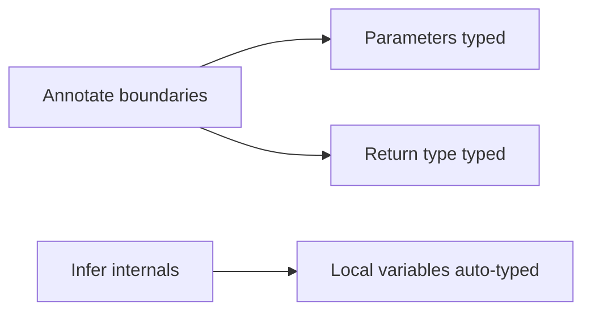
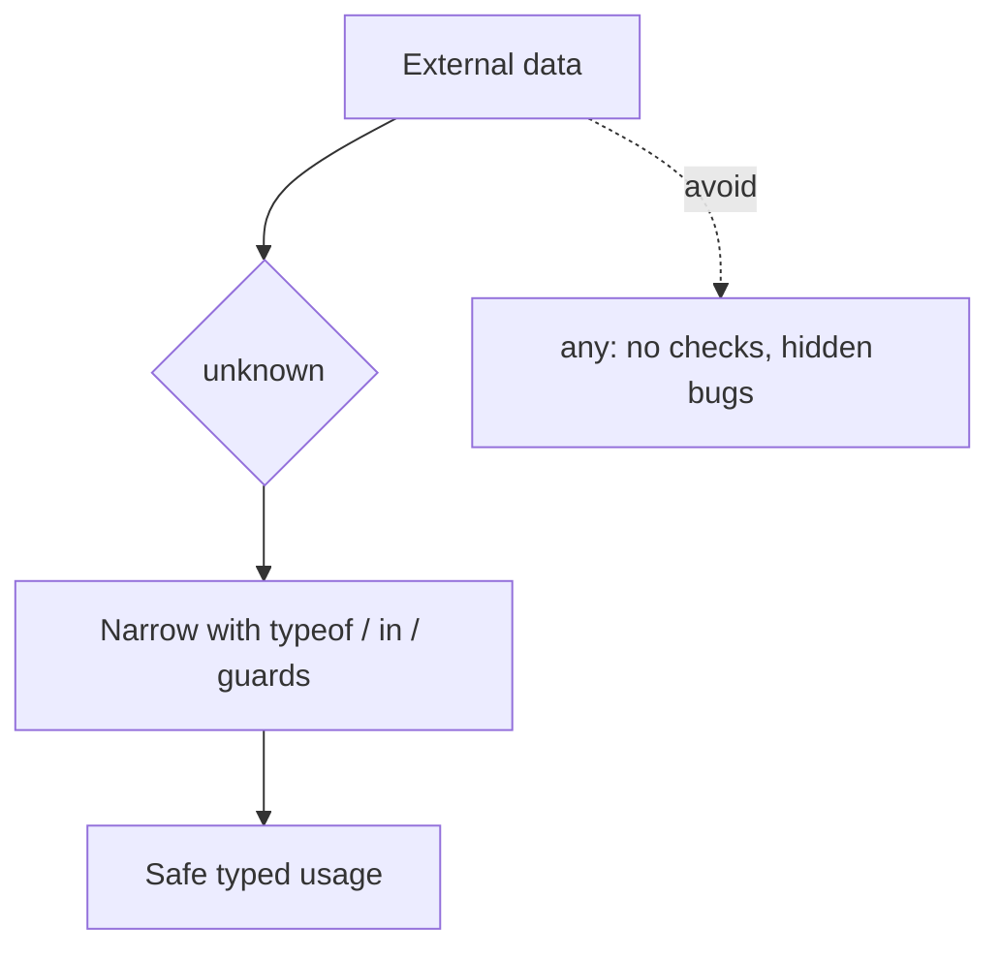
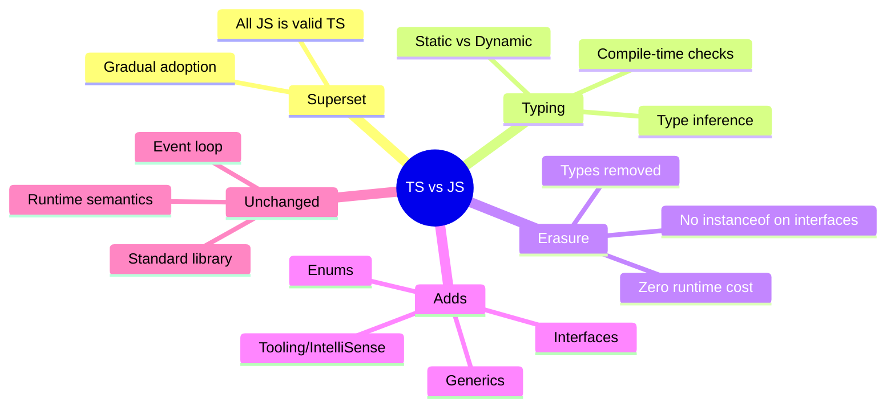
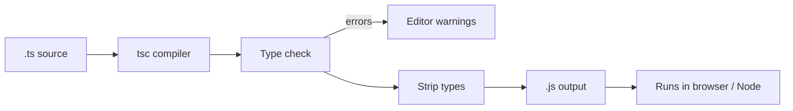

# TypeScript vs JavaScript — Junior Level

## Table of Contents

1. [Introduction](#introduction)
2. [Prerequisites](#prerequisites)
3. [Glossary](#glossary)
4. [Core Concepts](#core-concepts)
5. [Real-World Analogies](#real-world-analogies)
6. [Mental Models](#mental-models)
7. [Pros & Cons](#pros-cons)
8. [Use Cases](#use-cases)
9. [Code Examples](#code-examples)
10. [Coding Patterns](#coding-patterns)
11. [Clean Code](#clean-code)
12. [Product Use / Feature](#product-use-feature)
13. [Error Handling](#error-handling)
14. [Security Considerations](#security-considerations)
15. [Performance Tips](#performance-tips)
16. [Best Practices](#best-practices)
17. [Edge Cases & Pitfalls](#edge-cases-pitfalls)
18. [Common Mistakes](#common-mistakes)
19. [Common Misconceptions](#common-misconceptions)
20. [Tricky Points](#tricky-points)
21. [Test](#test)
22. [Tricky Questions](#tricky-questions)
23. [Cheat Sheet](#cheat-sheet)
24. [Summary](#summary)
25. [What You Can Build](#what-you-can-build)
26. [Further Reading](#further-reading)
27. [Related Topics](#related-topics)
28. [Diagrams & Visual Aids](#diagrams-visual-aids)

---

## Introduction

> Focus: "What is it?" and "How to use it?"

TypeScript is a programming language created by Microsoft in 2012 and led by Anders Hejlsberg (the same person who designed C# and Turbo Pascal). The single most important fact to internalize as a beginner is this: **TypeScript is a typed superset of JavaScript**. "Superset" means that every valid JavaScript program is also a valid TypeScript program. If you already know JavaScript, you already know most of TypeScript — TypeScript simply *adds* an optional static type system on top of the language you already use.

The second most important fact is equally simple but often misunderstood: **TypeScript types do not exist at runtime**. When you compile (also called "transpile") TypeScript, the type annotations are *erased*. The output is plain JavaScript that runs in any browser or in Node.js. The types are a tool for *you* and your *editor* and the *compiler* — they help catch mistakes *before* you run the program. Once the program runs, the types are gone.

Put together: TypeScript = JavaScript + a compile-time type checker that disappears at runtime. That is the whole idea, and everything else in this document is detail.

Why does this matter? Because JavaScript is *dynamically typed*: a variable can hold a number now and a string later, and you only discover a type mistake when the code actually executes — often in production, in front of a user. TypeScript moves that discovery to *compile time*, in your editor, with a red squiggle, seconds after you typed the mistake. That single shift — from runtime errors to compile-time errors — is the reason TypeScript has taken over modern web development.

---

## Prerequisites

- **Required:** Working knowledge of JavaScript — variables (`let`, `const`), functions, objects, arrays, and basic ES6 syntax (arrow functions, template literals, destructuring).
- **Required:** Comfort running commands in a terminal (you will run `tsc` or `npm` commands).
- **Helpful but not required:** Familiarity with the difference between *compile time* and *runtime*.
- **Helpful but not required:** Having seen a typed language before (Java, C#, C++) — the type annotations will feel familiar.

---

## Glossary

| Term | Definition |
|------|-----------|
| **TypeScript (TS)** | A typed superset of JavaScript that compiles to plain JavaScript |
| **JavaScript (JS)** | The dynamically-typed language that runs in browsers and Node.js |
| **Superset** | A language that contains all of another language plus extra features — all JS is valid TS |
| **Static typing** | Types are checked *before* the program runs (at compile time) |
| **Dynamic typing** | Types are checked *while* the program runs (at runtime) — what plain JS does |
| **Type annotation** | `: string` — explicitly telling TypeScript the type of a variable, parameter, or return value |
| **Type inference** | TypeScript automatically figuring out a type without you writing an annotation |
| **Transpile / Compile** | Translating TypeScript source into JavaScript output via the `tsc` compiler |
| **Type erasure** | The removal of all type annotations during compilation — types are gone at runtime |
| **`tsc`** | The TypeScript Compiler — the command-line tool that turns `.ts` into `.js` |
| **`any`** | A type that opts *out* of type checking — avoid it; it defeats TypeScript's purpose |
| **`unknown`** | The safe counterpart of `any` — you must narrow it before using it |
| **Compile-time error** | A mistake the compiler catches before running, shown as a red squiggle in your editor |
| **Runtime error** | A mistake that only appears while the program executes |

---

## Core Concepts

### Concept 1: TypeScript Is a Superset of JavaScript

Every line of valid JavaScript is valid TypeScript. You can rename a `.js` file to `.ts` and (in most cases) it compiles. TypeScript then *adds* features on top:

```typescript
// This is 100% valid JavaScript — and also valid TypeScript
function greet(name) {
  return "Hello, " + name;
}

// TypeScript lets you ADD types — this is the "super" part of "superset"
function greetTyped(name: string): string {
  return "Hello, " + name;
}
```

Because TS is a superset, adoption can be *gradual*. You do not have to rewrite your whole codebase. You can add types file by file, function by function.

### Concept 2: Static Typing vs Dynamic Typing

JavaScript is dynamically typed — a variable's type is whatever value it currently holds, and mistakes surface at runtime:

```javascript
// JavaScript — no error until you RUN it
function double(x) {
  return x * 2;
}
double("hello"); // returns NaN — silent bug, no warning
```

TypeScript is statically typed — mistakes surface at *compile time*, before you run anything:

```typescript
// TypeScript — error appears immediately in your editor
function double(x: number): number {
  return x * 2;
}
double("hello");
// Error: Argument of type 'string' is not assignable to parameter of type 'number'
```

### Concept 3: Types Are Erased at Runtime (No Runtime Cost)

This is the concept beginners get wrong most often. After compilation, all type information is **gone**. Look at the input and output side by side:

```typescript
// TypeScript INPUT (greeting.ts)
interface User {
  id: number;
  name: string;
}

function greet(user: User): string {
  return `Hello, ${user.name}`;
}
```

```javascript
// JavaScript OUTPUT (greeting.js) — types vanished!
function greet(user) {
  return `Hello, ${user.name}`;
}
// Note: the `interface User` produced NO output at all
```

Because types are erased, TypeScript adds **zero runtime overhead**. The shipped JavaScript is exactly what you would have written by hand. This also means you *cannot* check a TypeScript type at runtime — `typeof user === "User"` does not work, because `User` does not exist when the program runs.

### Concept 4: What TypeScript Adds (and What It Does NOT Change)

**TypeScript adds:**
- Static type checking (catch type errors before running)
- Type annotations, interfaces, type aliases, generics, enums
- Far better editor tooling: autocomplete (IntelliSense), inline documentation, safe refactoring (rename a symbol everywhere), jump-to-definition
- Compile-time documentation — the types describe the shape of your data

**TypeScript does NOT change:**
- The *runtime semantics* of JavaScript — `0.1 + 0.2` is still `0.30000000000000004`, `[] == ![]` is still `true`, `typeof null` is still `"object"`
- How the event loop, promises, closures, or prototypes behave
- The standard library — `Array.prototype.map`, `JSON.parse`, etc. work identically

TypeScript is a *checker* and a *translator*, not a new runtime.

---

## Real-World Analogies

| Concept | Analogy |
|---------|--------|
| **TS is a superset of JS** | Like a spell-checker added to a word processor — your text is still text; the checker just underlines mistakes before you print |
| **Type erasure at runtime** | Like training wheels on a bicycle — they help you while learning (writing code), then you remove them before the real ride (running). The bike (JS) is unchanged |
| **Static vs dynamic typing** | Static = a building inspector checks the blueprint before construction. Dynamic = you find the wall is missing only after someone walks into the hole |
| **`any` type** | Like signing a waiver that says "I take full responsibility" — the inspector stops checking that part |
| **Transpilation** | Like translating a book from one language to another — the story (logic) is identical; only the words (syntax) change |

---

## Mental Models

**The intuition:** Think of TypeScript as a *layer of glasses* you wear while writing JavaScript. With the glasses on, you can see the shapes of your data and the compiler warns you when a square peg is heading toward a round hole. When you ship the code, you take the glasses off — the JavaScript underneath is exactly the same.

**Why this model helps:** When you wonder "will this type affect my running program?" the answer is almost always "no — types are glasses, not code." This prevents the classic beginner trap of trying to validate runtime data using a TypeScript type (which is impossible because the type is erased).

**The second model — the gate:** TypeScript is a gate that stands between your editor and the JavaScript output. The gate inspects every value's type. If the types do not line up, the gate raises an error *but still lets the JavaScript through by default* (unless you configure it to block emit). The gate's job is to *warn*, and your job is to fix the warnings.

---

## Pros & Cons

| Pros | Cons |
|------|------|
| Catches type errors at compile time, before users see them | Requires a build step (`tsc` or a bundler) |
| Excellent editor tooling — autocomplete, refactoring, navigation | Learning curve for advanced types (generics, conditional types) |
| Types act as always-up-to-date documentation | More upfront typing/keystrokes than plain JS |
| Safe, large-scale refactoring (rename across thousands of files) | Type definitions for third-party libs may be missing or wrong |
| Gradual adoption — works alongside existing JavaScript | `any` can silently disable safety if misused |
| Zero runtime cost — types are erased | Compile-time checks are not runtime validation (data still needs guards) |

### When to use TypeScript:
- Any project larger than a single small script, especially with multiple contributors or a long lifespan (web apps, APIs, libraries, design systems).

### When plain JavaScript might be fine:
- Tiny scripts, quick prototypes, one-off automation, or environments where adding a build step is not worth it.

---

## Use Cases

- **Use Case 1: Frontend apps** — React, Angular, and Vue all have first-class TypeScript support. Props, state, and events become type-checked, eliminating a whole category of "undefined is not a function" bugs.
- **Use Case 2: Backend / Node.js APIs** — Request/response shapes, database models, and configuration are typed, so a typo in a field name is caught before deployment.
- **Use Case 3: Shared libraries / SDKs** — Publishing a library with `.d.ts` declaration files gives every consumer autocomplete and type safety, even if they write plain JavaScript.

---

## Code Examples

### Example 1: From JavaScript to TypeScript

```typescript
// Plain JavaScript style (also valid TS, but untyped)
function add(a, b) {
  return a + b;
}

// Typed TypeScript — parameters and return value annotated
function addTyped(a: number, b: number): number {
  return a + b;
}

console.log(addTyped(2, 3)); // 5
// addTyped(2, "3"); // Compile error: string not assignable to number
```

**What it does:** Shows the same function untyped vs typed.
**How to run:** `tsc add.ts` then `node add.js`, or use the [TS Playground](https://www.typescriptlang.org/play).

### Example 2: Type Inference — You Often Don't Need Annotations

```typescript
// TypeScript INFERS the type — no annotation needed
let count = 5;          // inferred: number
let title = "Roadmap";  // inferred: string
let active = true;      // inferred: boolean

count = 10;             // OK — number
// count = "ten";       // Error: string not assignable to number

// Inference also works for function return types
function square(n: number) {
  return n * n; // return type inferred as number
}
```

**What it does:** Demonstrates that TypeScript figures out types automatically. Annotate only when inference is not enough.

### Example 3: Interfaces and Object Shapes

```typescript
// An interface describes the SHAPE of an object
interface Product {
  id: number;
  name: string;
  price: number;
  inStock: boolean;
}

function describe(product: Product): string {
  return `${product.name} costs $${product.price}`;
}

const laptop: Product = {
  id: 1,
  name: "Laptop",
  price: 999,
  inStock: true,
};

console.log(describe(laptop)); // "Laptop costs $999"

// Missing a field is caught at compile time:
// const broken: Product = { id: 2, name: "Mouse" };
// Error: Property 'price' is missing in type ...
```

### Example 4: Union Types — A Value That Can Be One of Several Types

```typescript
// A union: id can be a string OR a number
function printId(id: string | number): void {
  // Narrowing: check the type before using type-specific methods
  if (typeof id === "string") {
    console.log(id.toUpperCase()); // id is string here
  } else {
    console.log(id.toFixed(0));    // id is number here
  }
}

printId("abc123"); // ABC123
printId(42);       // 42
```

### Example 5: Proving Types Are Erased

```typescript
// The .ts file
interface Animal {
  species: string;
}

const dog: Animal = { species: "dog" };
console.log(typeof dog); // "object" — NOT "Animal"!

// You CANNOT do: if (dog instanceof Animal) — Animal is not a runtime value
// Interfaces produce no JavaScript output whatsoever.
```

**What it does:** Demonstrates that `interface Animal` disappears at runtime; `typeof` returns the underlying JavaScript type.

---

## Coding Patterns

### Pattern 1: Annotate Function Boundaries, Infer Locals

**Intent:** Get maximum safety with minimum typing noise.
**When to use:** Always — this is idiomatic TypeScript.

```typescript
// Annotate parameters and return types (the "boundaries")
function buildUrl(base: string, path: string): string {
  // Let TypeScript INFER local variables
  const trimmedBase = base.replace(/\/$/, ""); // inferred: string
  const trimmedPath = path.replace(/^\//, "");  // inferred: string
  return `${trimmedBase}/${trimmedPath}`;
}
```

**Diagram:**



**Remember:** Explicit types at the edges, inference inside. This documents your API while keeping the body clean.

### Pattern 2: Prefer `unknown` Over `any` for External Data

**Intent:** Stay type-safe when receiving data you don't control (JSON, user input).
**When to use:** Whenever a value's type is genuinely unknown at compile time.

```typescript
function parse(raw: string): unknown {
  return JSON.parse(raw); // JSON.parse returns any; we narrow it to unknown
}

const data = parse('{"name":"Ada"}');

// You MUST narrow `unknown` before using it
if (typeof data === "object" && data !== null && "name" in data) {
  console.log((data as { name: string }).name);
}
```

**Diagram:**



---

## Clean Code

### Naming

```typescript
// Bad naming
function p(u: { n: string }): string { return u.n; }

// Clean naming
function getUserName(user: { name: string }): string {
  return user.name;
}
```

**Rules:**
- Variables describe WHAT they hold (`userName`, not `u`, `tmp`, `x`)
- Functions describe WHAT they do (`getUserName`, not `p`, `doIt`)
- Types/interfaces use PascalCase nouns (`User`, `OrderStatus`)
- Booleans use `is`/`has`/`can` prefixes (`isActive`, `hasAccess`)

### Functions

```typescript
// Too much — does parsing, validation, and saving
function handle(data: string) {
  // 60 lines doing everything...
}

// Single responsibility
function parseInput(data: string): RawInput { /* ... */ return {} as RawInput; }
function validate(input: RawInput): ValidInput { /* ... */ return {} as ValidInput; }
function save(input: ValidInput): void { /* ... */ }

interface RawInput { value: string }
interface ValidInput { value: string }
```

**Rule:** Each function should do one thing. The type annotations make the data flow between functions self-documenting.

### Comments

```typescript
// Noise comment (states the obvious — the type already says it)
// returns a string
function name(): string { return "x"; }

// Useful comment (explains WHY)
// We keep the id as a string because some legacy records have non-numeric ids
function getId(): string { return "x"; }
```

**Rule:** Let types document the *what*; let comments explain the *why*.

---

## Product Use / Feature

### 1. Visual Studio Code

- **How it uses TS/JS:** VS Code itself is written in TypeScript. Its IntelliSense (autocomplete) for JavaScript is *powered by the TypeScript language service*, even in plain `.js` files.
- **Why it matters:** It proves TypeScript scales to a huge, long-lived application maintained by a large team.

### 2. Slack, Airbnb, and most modern web apps

- **How they use TS/JS:** These companies migrated large JavaScript codebases to TypeScript to reduce production bugs and onboard engineers faster.
- **Why it matters:** Demonstrates the real business value: fewer runtime crashes and safer refactoring at scale.

### 3. Angular framework

- **How it uses TS/JS:** Angular is written in and requires TypeScript. Component inputs, services, and dependency injection all rely on TypeScript types.
- **Why it matters:** Shows TypeScript can be the *default* language of an entire ecosystem, not just an add-on.

---

## Error Handling

### Error 1: "Cannot find name 'tsc'"

```bash
# Trying to compile without TypeScript installed
$ tsc hello.ts
zsh: command not found: tsc
```

**Why it happens:** The TypeScript compiler is not installed.
**How to fix:**

```bash
npm install -g typescript   # global install
tsc --version               # verify
# or locally per project:
npm install --save-dev typescript
npx tsc hello.ts
```

### Error 2: "Argument of type 'string' is not assignable to parameter of type 'number'"

```typescript
function double(x: number): number {
  return x * 2;
}
double("5"); // Error
```

**Why it happens:** TypeScript caught a real type mismatch at compile time.
**How to fix:**

```typescript
double(5);             // pass a number
// or convert first:
double(Number("5"));   // 10
```

### Error Handling Pattern: Compile-Time Check vs Runtime Validation

```typescript
// A type only protects you at COMPILE time. At runtime, external data
// can still be the wrong shape, so you must validate it yourself.
interface Config {
  port: number;
}

function loadConfig(raw: unknown): Config {
  if (
    typeof raw === "object" && raw !== null &&
    "port" in raw && typeof (raw as Record<string, unknown>).port === "number"
  ) {
    return raw as Config;
  }
  throw new Error("Invalid config: 'port' must be a number");
}
```

**Key point:** TypeScript checks your *code*. It does not check your *data*. You still write runtime guards for input that crosses a trust boundary.

---

## Security Considerations

### 1. Types Are Not Runtime Validation

```typescript
// INSECURE assumption: trusting that input matches the type
function handleLogin(body: { username: string; password: string }) {
  // At runtime, body could be anything — TS does not validate it!
  authenticate(body.username, body.password);
}

declare function authenticate(u: string, p: string): void;
```

**Risk:** A malicious or malformed request may not match the declared type. TypeScript erased the type, so nothing checks `body` at runtime.
**Mitigation:** Use a runtime validation library (Zod, Valibot, io-ts) at the boundary:

```typescript
import { z } from "zod";

const LoginSchema = z.object({
  username: z.string().min(1),
  password: z.string().min(8),
});

function handleLogin(rawBody: unknown) {
  const body = LoginSchema.parse(rawBody); // throws if invalid
  authenticate(body.username, body.password);
}
```

### 2. `as` Assertions Can Hide Real Bugs

```typescript
// Risky: telling TS "trust me" without proof
const user = JSON.parse(raw) as { isAdmin: boolean };
if (user.isAdmin) grantAccess(); // if isAdmin is missing, undefined is falsy — but other fields may crash

declare const raw: string;
declare function grantAccess(): void;
```

**Risk:** `as` bypasses checks. If the real data lacks a field, you get silent `undefined` or a crash.
**Mitigation:** Validate before asserting, or use a schema parser that returns a typed value safely.

---

## Performance Tips

### Tip 1: Types Add Zero Runtime Cost — Stop Worrying

```typescript
// However many types you write, the compiled JS is identical in speed.
// This heavily-typed function...
function sum<T extends number>(items: readonly T[]): number {
  return items.reduce((acc, n) => acc + n, 0);
}
// ...compiles to the same loop a plain-JS author would write.
```

**Why it's fast:** Types are erased. There is no type-checking happening while your program runs.

### Tip 2: The Build Step Is the Only "Cost" — Make It Incremental

```json
// tsconfig.json
{
  "compilerOptions": {
    "incremental": true,
    "skipLibCheck": true
  }
}
```

**Why it helps:** `incremental` caches results so re-compiles only process changed files; `skipLibCheck` avoids re-checking `node_modules` type files. These speed up your *build*, not your program.

---

## Best Practices

- **Enable `strict: true`** in `tsconfig.json` from day one — it turns on the checks that catch the most bugs.
- **Avoid `any`** — prefer `unknown` and narrow it. Treat each `any` as a hole in your safety net.
- **Let TypeScript infer** when the type is obvious; annotate function parameters, return types, and public API.
- **Validate external data at runtime** — types do not protect you from bad JSON or user input.
- **Use `interface`/`type` to model your domain** so the types document your data.
- **Keep up with the compiler version** — each TypeScript release improves inference and adds checks.

---

## Edge Cases & Pitfalls

### Pitfall 1: Assuming Types Exist at Runtime

```typescript
interface Shape { kind: string; }

function area(shape: Shape) {
  // This does NOT work — Shape has no runtime existence
  // if (shape instanceof Shape) { ... }  // Error: 'Shape' only refers to a type
}
```

**What happens:** `instanceof` needs a runtime *class*, not an interface.
**How to fix:** Use a discriminant field and `typeof`/`in` checks, or a `class`:

```typescript
type Shape = { kind: "circle"; r: number } | { kind: "square"; s: number };
function area(shape: Shape): number {
  return shape.kind === "circle" ? Math.PI * shape.r ** 2 : shape.s ** 2;
}
```

### Pitfall 2: `any` Silently Disables Checking

```typescript
let data: any = JSON.parse("{}");
data.foo.bar.baz; // No error! `any` turns off all checks — crashes at runtime
```

**What happens:** Every access on `any` is allowed by the compiler, so bugs slip through.
**How to fix:** Type the value as `unknown` and narrow it before use.

### Pitfall 3: Forgetting That `tsc` Emits JS Even With Errors

```bash
# By default tsc still produces .js files even if there are type errors!
tsc app.ts   # writes app.js AND prints errors
```

**How to fix:** Set `"noEmitOnError": true` so a failing type check blocks output.

---

## Common Mistakes

### Mistake 1: Over-Annotating

```typescript
// Redundant — TypeScript already infers `number`
const total: number = 5 + 3;

// Cleaner — let inference do the work
const total2 = 5 + 3;
```

### Mistake 2: Using `any` to "Make the Error Go Away"

```typescript
// Wrong — hides the problem
function process(input: any) { return input.value; }

// Right — type it properly
function process(input: { value: string }): string { return input.value; }
```

### Mistake 3: Confusing Compile-Time Types with Runtime Values

```typescript
type Color = "red" | "green" | "blue";

// Wrong — you cannot iterate a type at runtime
// for (const c of Color) { ... }  // Error

// Right — define the runtime data separately
const COLORS = ["red", "green", "blue"] as const;
type ColorType = (typeof COLORS)[number]; // "red" | "green" | "blue"
for (const c of COLORS) console.log(c);
```

---

## Common Misconceptions

### Misconception 1: "TypeScript is a different language from JavaScript"

**Reality:** TypeScript is JavaScript *plus types*. All your JS knowledge transfers directly. You are not learning a new runtime — you are learning a type system that sits on top of the JS you know.

**Why people think this:** The `.ts` extension and unfamiliar type syntax make it look like a separate language.

### Misconception 2: "TypeScript makes my app slower"

**Reality:** Types are erased; the shipped JavaScript has zero type-checking overhead. If anything, TypeScript can make code *faster* to maintain and refactor, and bundlers can use type info for optimizations.

**Why people think this:** People conflate the *build step* (which takes time during development) with *runtime performance* (which is unaffected).

### Misconception 3: "If it compiles, it can't crash"

**Reality:** TypeScript checks the *code you wrote*, but external data (API responses, user input) is unchecked at runtime. A program that type-checks can still crash on bad data. You need runtime validation too.

**Why people think this:** Static typing feels like a guarantee, but it only covers what the compiler can see.

---

## Tricky Points

### Tricky Point 1: Type Erasure Means No Reflection on Types

```typescript
function logType<T>(value: T): void {
  // You CANNOT inspect T at runtime — it's erased.
  // console.log(typeof T); // Error: 'T' only refers to a type
  console.log(typeof value); // Only the runtime value's type is available
}
```

**Why it's tricky:** Coming from languages with runtime reflection (Java, C#), developers expect to query generic type parameters at runtime. In TypeScript, generics are a compile-time-only feature.
**Key takeaway:** If you need runtime type information, you must keep it as a *value* (a string tag, a discriminant field, or a schema).

### Tricky Point 2: Structural Typing — Shape Matters, Not Name

```typescript
interface Point { x: number; y: number; }

function distance(p: Point): number {
  return Math.sqrt(p.x ** 2 + p.y ** 2);
}

// No `implements Point` needed — the SHAPE matches, so this is accepted
const coords = { x: 3, y: 4, label: "origin" };
distance(coords); // OK! Extra `label` is allowed for a variable
```

**Why it's tricky:** In nominally-typed languages, you must explicitly declare you implement an interface. TypeScript only checks the *structure*.
**Key takeaway:** If an object has at least the required members, it is assignable — regardless of how it was declared.

---

## Test

### Multiple Choice

**1. What does "TypeScript is a superset of JavaScript" mean?**

- A) TypeScript replaces JavaScript entirely
- B) Every valid JavaScript program is also a valid TypeScript program
- C) TypeScript runs faster than JavaScript
- D) JavaScript is a newer version of TypeScript

<details>
<summary>Answer</summary>
**B)** — Superset means TS contains all of JS plus extra features. You can rename a `.js` file to `.ts` and it generally compiles. A) is false (TS compiles *to* JS), C) is false (types are erased, no speed change), D) reverses the relationship.
</details>

**2. When are TypeScript type errors caught?**

- A) At runtime, when the bad line executes
- B) At compile time, before the program runs
- C) Never — they are only suggestions
- D) Only in production

<details>
<summary>Answer</summary>
**B)** — Static typing means errors appear at compile time, in your editor, before you run anything. That is the core advantage over plain JavaScript.
</details>

### True or False

**3. TypeScript types exist at runtime and can be checked with `instanceof`.**

<details>
<summary>Answer</summary>
**False** — Types are *erased* during compilation. Interfaces and type aliases produce no JavaScript output. You cannot use `instanceof` on an interface.
</details>

**4. Using `any` everywhere is a good way to silence TypeScript errors.**

<details>
<summary>Answer</summary>
**False** — `any` opts out of type checking and hides real bugs. Prefer `unknown` and narrow it, or type the value properly.
</details>

### What's the Output?

**5. What does this print?**

```typescript
interface Animal { species: string; }
const cat: Animal = { species: "cat" };
console.log(typeof cat);
```

<details>
<summary>Answer</summary>
Output: `object`
Explanation: `typeof` reports the *runtime* JavaScript type. The interface `Animal` is erased, so at runtime `cat` is just a plain object.
</details>

**6. Will this compile, and why?**

```typescript
function double(x: number): number { return x * 2; }
double("4");
```

<details>
<summary>Answer</summary>
**No** — Compile error: `Argument of type 'string' is not assignable to parameter of type 'number'`. The string literal `"4"` does not match the `number` parameter.
</details>

---

## "What If?" Scenarios

**What if you ship TypeScript code with type errors?**
- **You might think:** The build fails and nothing is produced.
- **But actually:** By default, `tsc` still emits JavaScript even when there are type errors — it only *warns*. To make errors block output, set `"noEmitOnError": true`. Type errors do not automatically stop your program from running.

**What if a JavaScript developer joins your TypeScript team?**
- **You might think:** They need to relearn everything.
- **But actually:** They already know ~90% of TypeScript. They write the same JavaScript and gradually add types. The transition is incremental, not a rewrite.

---

## Tricky Questions

**1. Why does TypeScript add zero runtime overhead?**

- A) Because it uses a faster JavaScript engine
- B) Because types are erased during compilation, leaving plain JavaScript
- C) Because it compiles to machine code
- D) Because it caches type checks

<details>
<summary>Answer</summary>
**B)** — Type annotations are stripped out at compile time. The output is ordinary JavaScript with no type metadata, so there is nothing extra to run. A) and C) are false (TS targets the same JS engines and compiles to JS, not machine code).
</details>

**2. Which statement about structural typing is correct?**

- A) An object must use `implements` to match an interface
- B) Only the object's name must match the interface name
- C) An object is assignable if it has at least the required members of the target type
- D) Structural typing is the same as dynamic typing

<details>
<summary>Answer</summary>
**C)** — TypeScript uses structural (duck) typing: compatibility is determined by shape, not by explicit declarations or names. A) describes nominal typing; D) confuses two unrelated concepts.
</details>

**3. What is the safest type to use for data of unknown shape, such as parsed JSON?**

- A) `any`
- B) `object`
- C) `unknown`
- D) `never`

<details>
<summary>Answer</summary>
**C)** — `unknown` is type-safe: you must narrow it (via `typeof`, `in`, or a guard) before using it. `any` (A) disables all checks. `object` (B) is too broad and still lets through wrong shapes. `never` (D) means "no value possible."
</details>

---

## Cheat Sheet

| What | Syntax / Command | Example |
|------|-----------------|---------|
| Type a variable | `let x: type` | `let age: number = 30` |
| Type a function | `(p: T): R` | `function f(x: string): boolean` |
| Object shape | `interface Name {}` | `interface User { id: number }` |
| Type alias | `type Name = ...` | `type Id = string \| number` |
| Union type | `A \| B` | `string \| null` |
| Array type | `T[]` or `Array<T>` | `number[]` |
| Optional property | `prop?: T` | `name?: string` |
| Compile a file | `tsc file.ts` | produces `file.js` |
| Check version | `tsc --version` | `Version 5.x` |
| Run after compile | `node file.js` | runs the output |
| Safe unknown type | `unknown` | narrow before use |
| Avoid this | `any` | disables checking |

---

## Self-Assessment Checklist

### I can explain:
- [ ] What "TypeScript is a superset of JavaScript" means
- [ ] The difference between static and dynamic typing
- [ ] Why types are erased at runtime and add zero overhead
- [ ] What TypeScript adds and what it does NOT change

### I can do:
- [ ] Add type annotations to a JavaScript function
- [ ] Compile a `.ts` file to `.js` with `tsc`
- [ ] Use `interface`, union types, and `unknown`
- [ ] Recognize when a type is being inferred vs annotated

### I can answer:
- [ ] All multiple choice and tricky questions above

---

## Summary

- **TypeScript is a typed superset of JavaScript** — all valid JS is valid TS, so adoption is gradual.
- **Static typing catches errors at compile time**, in your editor, before the program runs — unlike JavaScript's runtime-only checks.
- **Types are erased at runtime**, so TypeScript adds zero runtime overhead and cannot be checked with `instanceof`/`typeof`.
- **TypeScript adds** types, interfaces, generics, enums, and superb tooling; it **does not change** JavaScript's runtime behavior.
- **Types are not runtime validation** — external data still needs guards (Zod, manual checks).

**Next step:** Learn how TypeScript and JavaScript interoperate — using JS libraries from TS and gradually migrating files.

---

## What You Can Build

### Projects you can create:
- **Typed Calculator CLI:** Convert a small JavaScript calculator to TypeScript and watch the compiler catch type mistakes.
- **Config Loader:** Build a function that loads JSON config and validates it at runtime, demonstrating the gap between compile-time types and runtime data.
- **Todo App (TS edition):** A simple todo list where `Todo` is an interface — practice modeling data with types.

### Learning path — what to study next:


---

## Further Reading

- **Official handbook:** [TypeScript for JavaScript Programmers](https://www.typescriptlang.org/docs/handbook/typescript-in-5-minutes.html)
- **Playground:** [TypeScript Playground](https://www.typescriptlang.org/play) — try TS in the browser, see the emitted JS
- **Article:** [TypeScript Handbook — The Basics](https://www.typescriptlang.org/docs/handbook/2/basic-types.html)
- **Video:** "TypeScript in 100 Seconds" — Fireship (great 2-minute overview)

---

## Related Topics

- **TS & JS Interoperability** — how TypeScript consumes plain JavaScript and `.d.ts` files.
- **Installation & Configuration** — setting up `tsc` and your first project.
- **tsconfig.json** — the configuration file that controls the compiler.

---

## Diagrams & Visual Aids

### Mind Map



### Compile Flow



### Static vs Dynamic Typing

```
+--------------------------------------------------+
|         TypeScript (static)  vs  JavaScript      |
|--------------------------------------------------|
| Error timing  | Compile time   | Runtime         |
| Tooling       | Rich autocomplete | Limited      |
| Refactoring   | Safe, automated | Risky, manual  |
| Runtime cost  | Zero (erased)  | N/A             |
| Build step    | Required       | None            |
+--------------------------------------------------+
```
