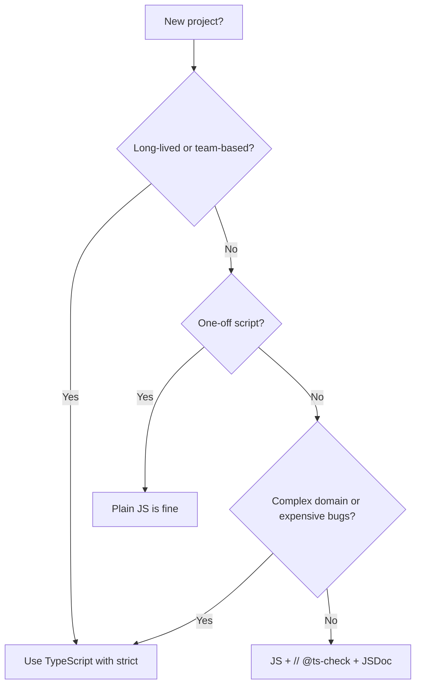

# TypeScript vs JavaScript — Middle Level

> Focus: "Why?" and "When?" — practical real-world usage and deeper trade-offs.

## Table of Contents

1. [Introduction](#introduction)
2. [Prerequisites](#prerequisites)
3. [Why Choose TypeScript Over JavaScript](#why-choose-typescript-over-javascript)
4. [When to Use TypeScript vs JavaScript](#when-to-use-typescript-vs-javascript)
5. [The Real Cost of TypeScript](#the-real-cost-of-typescript)
6. [Deep Dive: Static vs Dynamic Typing in Practice](#deep-dive-static-vs-dynamic-typing-in-practice)
7. [Type Erasure — Practical Consequences](#type-erasure-practical-consequences)
8. [Transpilation: tsc vs Babel vs esbuild vs swc](#transpilation-tsc-vs-babel-vs-esbuild-vs-swc)
9. [Structural Typing in the Real World](#structural-typing-in-the-real-world)
10. [Narrowing & Type Guards](#narrowing-type-guards)
11. [Configuring the Compiler for a Real Project](#configuring-the-compiler-for-a-real-project)
12. [Trade-offs Table](#trade-offs-table)
13. [Real-World Scenarios](#real-world-scenarios)
14. [Best Practices](#best-practices)
15. [Edge Cases & Pitfalls](#edge-cases-pitfalls)
16. [Common Mistakes](#common-mistakes)
17. [Decision Framework](#decision-framework)
18. [Test](#test)
19. [Middle Checklist](#middle-checklist)
20. [Summary](#summary)
21. [Further Reading](#further-reading)

---

## Introduction

At the junior level you learned *what* TypeScript is: a typed superset of JavaScript whose types are erased at runtime. At the middle level the questions shift to *why* you would accept a build step and a learning curve, and *when* the trade-off pays off versus when plain JavaScript is the right call.

The honest framing is this: TypeScript is not "better JavaScript" in some absolute sense — it is a tool that converts a class of *runtime* failures into *compile-time* failures, in exchange for a build step and more typing. Whether that trade is worth it depends on the size of the codebase, the number of contributors, the lifespan of the project, and how costly a production bug is. This document gives you the framework to make that call deliberately rather than by fashion.

---

## Prerequisites

- Comfortable writing functions, interfaces, type aliases, and union types (junior level).
- Have compiled at least one `.ts` file and seen the emitted `.js`.
- Understand the difference between compile time and runtime.
- Have used `npm`/`pnpm`/`yarn` and a `package.json`.

---

## Why Choose TypeScript Over JavaScript

The decision rests on a small number of concrete, measurable benefits.

### Reason 1: Bugs Found Earlier Are Cheaper

There is a well-known cost curve in software: a bug caught while typing costs seconds; the same bug caught in code review costs minutes; in QA, hours; in production, possibly days plus reputational damage. TypeScript pushes a whole category of bugs — wrong argument types, misspelled property names, `undefined` access, missing cases in a switch — all the way left to "while typing."

```typescript
interface Order {
  id: string;
  total: number;
  customerEmail: string;
}

function sendReceipt(order: Order): void {
  // Typo caught instantly: 'custmerEmail' does not exist on type 'Order'
  // emailService.send(order.custmerEmail);   // compile error
  emailService.send(order.customerEmail);     // correct
}

declare const emailService: { send(to: string): void };
```

In JavaScript, `order.custmerEmail` is `undefined`, the receipt silently goes nowhere, and you find out when a customer complains.

### Reason 2: Refactoring at Scale Becomes Safe

Rename a property used in 400 files. In JavaScript this is a terrifying find-and-replace. In TypeScript the editor's "Rename Symbol" updates every reference and the compiler verifies nothing was missed.

```typescript
// Before: rename `total` -> `amount` everywhere
interface Order { id: string; amount: number; } // renamed
// Every `.total` access across the codebase now errors until updated.
// The compiler is your safety net for the migration.
```

### Reason 3: Types Are Living Documentation

A function signature tells the next developer (often future-you) exactly what goes in and what comes out — and the compiler guarantees the documentation is never stale.

```typescript
// The signature alone documents the contract
function paginate<T>(
  items: readonly T[],
  page: number,
  pageSize: number,
): { data: T[]; totalPages: number; hasNext: boolean } {
  const start = page * pageSize;
  return {
    data: items.slice(start, start + pageSize),
    totalPages: Math.ceil(items.length / pageSize),
    hasNext: start + pageSize < items.length,
  };
}
```

### Reason 4: Superior Tooling and Developer Experience

Autocomplete that actually knows your data, jump-to-definition, find-all-references, and inline error highlighting compound into real productivity. This is not a vanity feature; it reduces context-switching and lookups.

---

## When to Use TypeScript vs JavaScript

### Strongly favor TypeScript when:

- **The codebase is large or growing** — more code means more surface area for type bugs.
- **Multiple people contribute** — types are a contract that coordinates teams.
- **The project is long-lived** — you will refactor it many times; types make that safe.
- **The domain is complex** — modeling states, variants, and data shapes pays off.
- **You publish a library** — consumers benefit from `.d.ts` files even if they use JS.
- **Bugs are expensive** — fintech, healthcare, infrastructure.

### Plain JavaScript may be the pragmatic choice when:

- **It is a throwaway script** — a 30-line automation you run once.
- **A build step is genuinely undesirable** — a quick inline `<script>` in a static page.
- **The team has zero TypeScript experience and a hard deadline** — though even then, `// @ts-check` on JS files gives partial benefit with no migration.
- **You are prototyping to learn**, and types would slow exploration (you can add them once the design stabilizes).

### A middle ground: JSDoc + `checkJs`

You can get much of TypeScript's checking *in plain `.js` files* using JSDoc comments and `"checkJs": true`. No `.ts` files, no syntax change, but real type checking:

```javascript
// @ts-check
/**
 * @param {number} a
 * @param {number} b
 * @returns {number}
 */
function add(a, b) {
  return a + b;
}
add("x", 1); // TypeScript-powered error, even in a .js file
```

This is a popular gradual-adoption path: enable `checkJs`, sprinkle JSDoc, then convert hot files to `.ts` over time.

---

## The Real Cost of TypeScript

Being honest about costs is what separates middle from junior reasoning.

### Cost 1: The Build Step

Plain JavaScript runs directly in the browser or Node. TypeScript must be compiled first. This adds:
- A toolchain to install and maintain (`tsc` or a bundler).
- Compile time during development (mitigated by watch mode and incremental builds).
- A potential source of "works in my editor, fails in CI" config drift.

### Cost 2: The Learning Curve

Basic types are easy. The difficulty ramps with generics, conditional types, mapped types, and `infer`. Junior engineers can be productive quickly, but reading advanced library types (e.g., the internals of a form library's generics) takes time.

### Cost 3: Type Definitions for the Ecosystem

Most popular libraries ship types or have community `@types/*` packages. But:
- Some libraries have *wrong* or *incomplete* types.
- Niche libraries may have none, forcing you to write your own `.d.ts` or use `any`.

### Cost 4: A False Sense of Safety

If the team treats "it compiles" as "it works," they may skip runtime validation and tests. TypeScript checks code, not data. This cost is *cultural* and the most dangerous.

---

## Deep Dive: Static vs Dynamic Typing in Practice

The theoretical difference is "when types are checked." The practical difference shows up in everyday situations.

```typescript
// Dynamic typing (JS) lets this run and fail late:
function getLength(x) {
  return x.length; // works for strings & arrays, crashes on numbers
}
// getLength(42) -> undefined in JS (no .length), silent bug

// Static typing (TS) forces you to handle the variety up front:
function getLengthTyped(x: string | unknown[]): number {
  return x.length; // guaranteed safe: both have .length
}
// getLengthTyped(42) -> compile error
```

Static typing's value is that it makes you *think about the full set of inputs* at the moment you write the function, not when a weird input arrives in production. Dynamic typing's value is *flexibility and speed* for small, exploratory code where the input space is small and known.

---

## Type Erasure — Practical Consequences

Because types vanish at runtime, several real patterns are affected:

### Consequence 1: You Cannot Switch on a Type

```typescript
// Does NOT work — types are erased
type Shape = Circle | Square;
interface Circle { radius: number; }
interface Square { side: number; }

function area(s: Shape): number {
  // if (s instanceof Circle) { ... }  // Error: Circle is not a value
  // Instead, add a runtime discriminant:
  if ("radius" in s) return Math.PI * s.radius ** 2;
  return s.side ** 2;
}
```

### Consequence 2: Generics Have No Runtime Identity

```typescript
function createArray<T>(length: number, fill: T): T[] {
  return Array.from({ length }, () => fill);
}
// At runtime there is no `T`. You cannot do `new T()` or `typeof T`.
```

### Consequence 3: Runtime Validation Is Still Required

```typescript
// The boundary pattern: validate once at the edge, trust the type inside.
import { z } from "zod";

const UserSchema = z.object({ id: z.string(), age: z.number() });
type User = z.infer<typeof UserSchema>;

async function fetchUser(id: string): Promise<User> {
  const res = await fetch(`/api/users/${id}`);
  const raw: unknown = await res.json();
  return UserSchema.parse(raw); // runtime check; returns typed User
}
```

This "parse, don't validate" pattern bridges the compile-time/runtime gap and is the single most important practical skill at this level.

---

## Transpilation: tsc vs Babel vs esbuild vs swc

There are two distinct jobs: **type checking** and **emitting JavaScript**. Different tools split these jobs differently.

| Tool | Type checks? | Emits JS? | Speed | Notes |
|------|:------------:|:---------:|:-----:|-------|
| **tsc** | Yes | Yes | Slow | The reference implementation; the source of truth for type errors |
| **Babel** (`@babel/preset-typescript`) | No | Yes | Fast | *Strips* types per-file without checking; needs `isolatedModules` |
| **esbuild** | No | Yes | Very fast | Used by Vite; transpiles only, no type checks |
| **swc** | No | Yes | Very fast | Rust-based; used by Next.js |

**The modern pattern:** Use a fast transpiler (esbuild/swc) to produce JavaScript for the dev server and bundle, and run `tsc --noEmit` separately (in your editor and in CI) purely as a *type checker*. This gives you fast builds *and* full type safety.

```bash
# Fast build (no type check)
vite build

# Type check separately (no emit) — runs in CI
tsc --noEmit
```

Because per-file transpilers do not see the whole program, they cannot resolve `const enum` or some cross-file type constructs — hence the `isolatedModules: true` flag, which warns you when you write something a per-file transpiler cannot handle.

---

## Structural Typing in the Real World

TypeScript's structural typing leads to behaviors that surprise people coming from Java/C#.

```typescript
interface Named { name: string; }

function printName(x: Named): void {
  console.log(x.name);
}

// Anything with a `name: string` works — no `implements` needed
printName({ name: "Ada", age: 36 });       // OK (extra props on a variable allowed)
printName(new Error("boom"));              // OK — Error has a `name` field!
```

This is powerful (flexible, no boilerplate) but occasionally too loose. When two types share a shape but mean different things (e.g., `UserId` and `PostId` are both `string`), structural typing lets you mix them. The fix is *branded types* (covered in senior.md).

A subtle point: **excess property checks**. Object *literals* are checked more strictly than variables:

```typescript
// Error: 'color' does not exist on type 'Named' (excess property check on a literal)
// printName({ name: "Bob", color: "red" });

// But via a variable, the excess property is allowed:
const obj = { name: "Bob", color: "red" };
printName(obj); // OK
```

---

## Narrowing & Type Guards

Narrowing is how you convince the compiler that a broad type is actually a specific one in a given branch. This is everyday middle-level TypeScript.

```typescript
function format(value: string | number | Date): string {
  if (typeof value === "string") return value.trim();      // narrowed to string
  if (typeof value === "number") return value.toFixed(2);  // narrowed to number
  return value.toISOString();                              // narrowed to Date
}
```

### Custom type guards (`is` predicates)

```typescript
interface Cat { meow(): void; }
interface Dog { bark(): void; }

function isCat(animal: Cat | Dog): animal is Cat {
  return "meow" in animal;
}

function speak(animal: Cat | Dog): void {
  if (isCat(animal)) {
    animal.meow(); // narrowed to Cat
  } else {
    animal.bark(); // narrowed to Dog
  }
}
```

### Discriminated unions (the cleanest pattern)

```typescript
type Result<T> =
  | { status: "success"; data: T }
  | { status: "error"; error: string };

function handle<T>(r: Result<T>): T | null {
  switch (r.status) {
    case "success": return r.data;   // narrowed
    case "error":
      console.error(r.error);
      return null;
  }
}
```

---

## Configuring the Compiler for a Real Project

A practical `tsconfig.json` for a middle-level project:

```json
{
  "compilerOptions": {
    "target": "ES2022",
    "module": "ESNext",
    "moduleResolution": "bundler",
    "lib": ["ES2022", "DOM", "DOM.Iterable"],
    "strict": true,
    "noUncheckedIndexedAccess": true,
    "noImplicitOverride": true,
    "noFallthroughCasesInSwitch": true,
    "esModuleInterop": true,
    "skipLibCheck": true,
    "isolatedModules": true,
    "noEmit": true,
    "forceConsistentCasingInFileNames": true
  },
  "include": ["src"]
}
```

Key flags explained:
- **`strict: true`** — the single most important flag; enables `strictNullChecks`, `noImplicitAny`, and more.
- **`noUncheckedIndexedAccess`** — `arr[i]` becomes `T | undefined`, catching out-of-bounds assumptions.
- **`noEmit: true`** — tsc only type-checks; a separate bundler emits JS (the modern pattern).
- **`isolatedModules: true`** — guarantees each file can be transpiled independently (Babel/esbuild compatibility).
- **`skipLibCheck: true`** — skips type-checking `.d.ts` files in `node_modules` for faster builds.

---

## Trade-offs Table

| Dimension | TypeScript | JavaScript |
|-----------|------------|------------|
| Error detection | Compile time (early) | Runtime (late) |
| Build step | Required | None |
| Refactoring safety | High (compiler-verified) | Low (manual) |
| Onboarding speed | Slower (learn types) | Faster |
| Tooling/IntelliSense | Excellent | Limited |
| Runtime performance | Identical (erased) | Identical |
| Documentation | Built into types | Comments/external |
| Flexibility | Constrained by types | Fully dynamic |
| Best for | Apps, libraries, teams | Scripts, prototypes |

---

## Real-World Scenarios

### Scenario 1: Migrating a Node.js Service

You inherit a 50k-line JavaScript service with frequent `undefined is not a function` crashes. The pragmatic path:
1. Add `tsconfig.json` with `allowJs: true`, `checkJs: false`.
2. Rename leaf files (no dependents) to `.ts` first.
3. Enable `strict` per-file via `// @ts-strict` (or globally once clean).
4. Add Zod validation at HTTP and DB boundaries.
5. Turn on `noEmitOnError` and `tsc --noEmit` in CI.

### Scenario 2: A Library Author

You publish an npm package. Even consumers who write plain JavaScript get autocomplete and inline docs because you ship `.d.ts` declaration files (`"declaration": true`). This is a major reason library authors choose TypeScript even when their users do not.

### Scenario 3: A React Component

```typescript
interface ButtonProps {
  label: string;
  onClick: () => void;
  variant?: "primary" | "secondary";
  disabled?: boolean;
}

function Button({ label, onClick, variant = "primary", disabled }: ButtonProps) {
  return (
    <button className={`btn btn-${variant}`} onClick={onClick} disabled={disabled}>
      {label}
    </button>
  );
}
// Passing an invalid variant, a missing label, or a wrong onClick signature
// is a compile error — caught before the component ever renders.
```

---

## Best Practices

- **Run `tsc --noEmit` in CI** even if a bundler does the actual build, so type errors block merges.
- **Validate at boundaries** with a schema library; trust types only for code you control.
- **Adopt `strict` mode** — partial strictness leaves gaps that produce false confidence.
- **Prefer discriminated unions** over flag-and-cast patterns for variant data.
- **Use `unknown` for external input**, never `any`.
- **Separate type checking from transpilation** for fast builds (esbuild/swc + `tsc --noEmit`).
- **Keep `@types/*` packages in sync** with their runtime counterparts.

---

## Edge Cases & Pitfalls

### Pitfall 1: Relying on Types for Runtime Safety

```typescript
function handler(body: { amount: number }) {
  charge(body.amount * 100); // if body.amount is a string at runtime, NaN
}
declare function charge(cents: number): void;
```

A malicious client can send `{ "amount": "100" }`. The type lied because nothing validated it. **Fix:** parse with a schema first.

### Pitfall 2: `const enum` with a Per-File Transpiler

```typescript
const enum Direction { Up, Down }
// Works with tsc, but esbuild/Babel cannot inline const enums per-file.
// Fix: use a regular enum or a union of string literals, or enable isolatedModules to be warned.
```

### Pitfall 3: Assuming `tsc` Output Equals Bundler Output

Your bundler (esbuild) might transpile a file that `tsc` would reject. If you do not run `tsc --noEmit`, type errors slip into production. **Fix:** always run the type checker separately in CI.

---

## Common Mistakes

### Mistake 1: Treating TypeScript as a Different Runtime

```typescript
// Wrong mental model: thinking this is "TypeScript magic"
const x = 0.1 + 0.2; // still 0.30000000000000004 — it's just JavaScript
```

### Mistake 2: Over-Using `as` to Silence Errors

```typescript
// Wrong — bypasses the check
const user = data as User;

// Right — validate, then the type is earned
const user = UserSchema.parse(data);
declare const data: unknown;
interface User { id: string }
declare const UserSchema: { parse(x: unknown): User };
```

### Mistake 3: Skipping `strict` Mode

Without `strictNullChecks`, `null`/`undefined` slip into every type, and you lose most of TypeScript's value. Always enable `strict`.

---

## Decision Framework



---

## Test

### Multiple Choice

**1. What is the modern pattern for fast TypeScript builds with full safety?**

- A) Use only `tsc` for everything
- B) Use esbuild/swc to transpile and `tsc --noEmit` to type-check separately
- C) Disable type checking entirely
- D) Use `any` everywhere

<details>
<summary>Answer</summary>
**B)** — Fast per-file transpilers (esbuild/swc) emit JS quickly but do not type-check; running `tsc --noEmit` separately in the editor and CI provides full type safety without slowing the build.
</details>

**2. Why must you still validate API responses at runtime in TypeScript?**

- A) Because TypeScript types are erased and do not check data at runtime
- B) Because TypeScript is slower than JavaScript
- C) Because `fetch` is deprecated
- D) You don't — types guarantee correct data

<details>
<summary>Answer</summary>
**A)** — Types disappear after compilation. A declared type does not verify that incoming JSON actually matches it; you need a runtime schema parser (Zod, etc.).
</details>

### True or False

**3. JSDoc plus `checkJs` can give type checking in plain `.js` files without any `.ts` files.**

<details>
<summary>Answer</summary>
**True** — With `// @ts-check` (or `"checkJs": true`) and JSDoc annotations, the TypeScript engine checks `.js` files, a common gradual-adoption path.
</details>

**4. Object literals and variables are checked identically for excess properties.**

<details>
<summary>Answer</summary>
**False** — Object *literals* trigger excess property checks (extra properties are errors); assigning via a *variable* allows the extra properties.
</details>

### Scenario

**5. A 30-line build script you run once a month keeps working fine in plain JS. Should you convert it to TypeScript?**

<details>
<summary>Answer</summary>
Probably not — the build step and setup cost outweigh the benefit for a tiny, stable, single-author script. If you want lightweight safety, add `// @ts-check` with a few JSDoc comments instead of a full migration.
</details>

---

## Middle Checklist

- [ ] `strict: true` enabled in `tsconfig.json`.
- [ ] `tsc --noEmit` runs in CI independently of the bundler.
- [ ] External data validated with a runtime schema (Zod/Valibot/io-ts).
- [ ] Discriminated unions used for variant data.
- [ ] No `any` without an explicit, reasoned `eslint-disable`.
- [ ] Transpilation (esbuild/swc) and type checking (tsc) separated for speed.
- [ ] You can articulate *why* TypeScript was chosen for this specific project.

---

## Summary

- TypeScript's core value is **moving a class of runtime errors to compile time**, which is cheaper to fix.
- It also enables **safe large-scale refactoring**, **living documentation**, and **superior tooling**.
- The costs are a **build step**, a **learning curve**, **ecosystem type-definition gaps**, and a **false sense of safety** if runtime validation is skipped.
- Choose TypeScript for **large, long-lived, team-based, or high-stakes** projects; plain JS (or JS + JSDoc) for **small, throwaway** ones.
- **Type checking and transpilation are separate jobs** — modern stacks use fast transpilers plus `tsc --noEmit`.

**Next step:** Senior level — how to architect, migrate, and scale TypeScript across large codebases.

---

## Further Reading

- [TypeScript Handbook — Everyday Types](https://www.typescriptlang.org/docs/handbook/2/everyday-types.html)
- [TypeScript Handbook — Narrowing](https://www.typescriptlang.org/docs/handbook/2/narrowing.html)
- [tsconfig reference](https://www.typescriptlang.org/tsconfig)
- [Zod documentation](https://zod.dev) — the "parse, don't validate" pattern
- [esbuild — TypeScript caveats](https://esbuild.github.io/content-types/#typescript-caveats)
