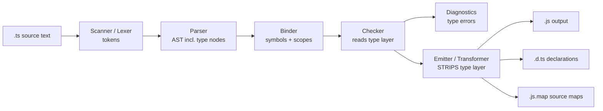
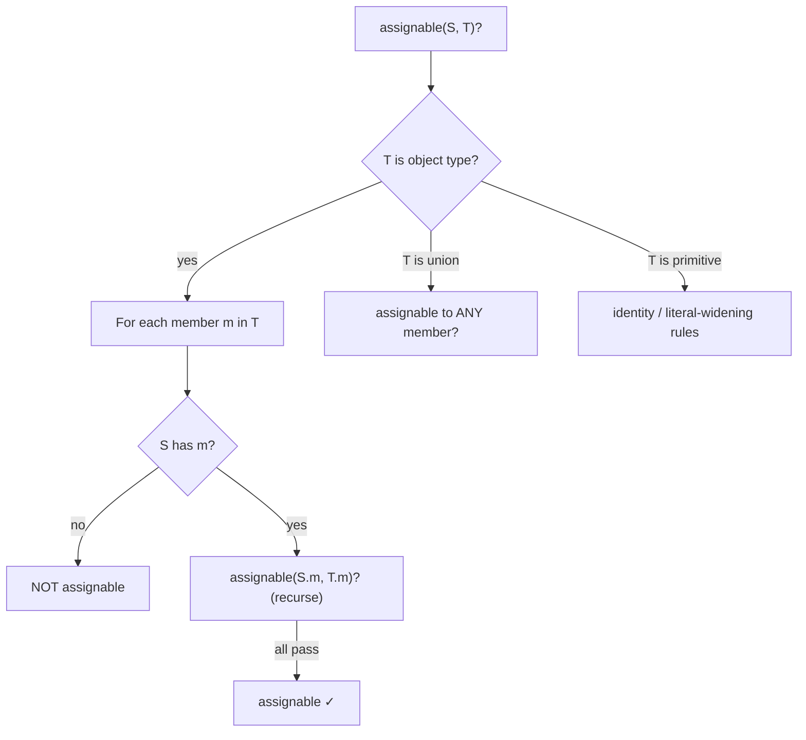
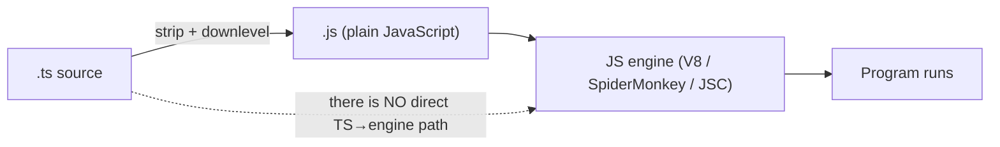

# TypeScript vs JavaScript — Under the Hood

## Table of Contents

1. [Overview](#overview)
2. [The Core Mental Model: A Superset Erased to JavaScript](#the-core-mental-model-a-superset-erased-to-javascript)
3. [The tsc Pipeline Through the TS-vs-JS Lens](#the-tsc-pipeline-through-the-ts-vs-js-lens)
4. [Type Erasure in Detail](#type-erasure-in-detail)
5. [The Emit Exceptions: enum, namespace, parameter properties](#the-emit-exceptions-enum-namespace-parameter-properties)
6. [Structural Typing Internals](#structural-typing-internals)
7. [declare, Ambient Types, and lib.\*.d.ts](#declare-ambient-types-and-libdts)
8. [Downlevel Emit: How target Rewrites the JavaScript](#downlevel-emit-how-target-rewrites-the-javascript)
9. [tsc vs Babel/esbuild/swc: Checker vs Stripper](#tsc-vs-babelesbuildswc-checker-vs-stripper)
10. [isolatedModules: What It Forbids and Why](#isolatedmodules-what-it-forbids-and-why)
11. [How JS Runs vs How TS Runs](#how-js-runs-vs-how-ts-runs)
12. [Source Maps: Mapping Runtime Errors Back to .ts](#source-maps-mapping-runtime-errors-back-to-ts)
13. [Diagnosing the Emit](#diagnosing-the-emit)
14. [Professional Pitfalls](#professional-pitfalls)
15. [Summary](#summary)

---

## Overview

This section explains what *physically happens* that makes TypeScript differ from JavaScript at the compiler and runtime level. It is not about team strategy or migration planning (that is `senior.md`). It is about mechanics: what bytes the compiler emits, what it deletes, what survives into the running program, and why the "fast" transpilers cannot do what `tsc` does.

The single fact that drives everything below: **TypeScript's type system has zero runtime representation.** A TypeScript program is a JavaScript program with an extra, *separable* layer of type annotations and type-only constructs. The compiler's job is to (a) check that layer for consistency and (b) delete it, leaving JavaScript that any V8/SpiderMonkey/JavaScriptCore engine already knows how to run. There is no "TypeScript engine," no "type metadata" in the output, and no runtime that understands `interface`.

The mental model to hold: **two independent jobs travel through one tool.** Job one is *type checking* (reads the type layer, produces diagnostics, emits nothing executable). Job two is *transformation* (parses syntax, deletes the type layer, downlevels modern syntax, writes `.js`). `tsc` does both; the fast transpilers do only the second. Confusing these two jobs is the root of nearly every "but it compiled!" surprise.

---

## The Core Mental Model: A Superset Erased to JavaScript

A `.ts` file's source text contains two interleaved kinds of tokens:

1. **JavaScript tokens** — the actual program: statements, expressions, function bodies, classes.
2. **Type tokens** — annotations (`: string`), `interface`/`type` declarations, generic parameters (`<T>`), `as` assertions, `satisfies`, `declare`. These are *erasable*: removing them never changes runtime behavior.

```text
   ┌─────────────────────── greeting.ts (source) ───────────────────────┐
   │  interface User { id: number }        ← type token  (erased)        │
   │  function greet(u: User): string {    ← ': User' & ': string' erased│
   │    return `Hi ${u.name}`              ← JS token   (kept)           │
   │  }                                                                  │
   └────────────────────────────────────────────────────────────────────┘
                                  │  emit
                                  ▼
   ┌─────────────────────── greeting.js (output) ───────────────────────┐
   │  function greet(u) {                                                │
   │    return `Hi ${u.name}`;                                           │
   │  }                                                                  │
   └────────────────────────────────────────────────────────────────────┘
```

Because the type layer is *separable*, two consequences follow that define the entire TS-vs-JS relationship:

- **Every valid JavaScript file is a valid TypeScript file.** A `.js` program has an empty type layer; there is nothing to erase, so it compiles unchanged.
- **A TypeScript type cannot be inspected at runtime.** `typeof`, `instanceof`, and reflection see only the JavaScript layer. `interface User` left no trace to inspect.

There is one wrinkle that the rest of this document keeps returning to: a *small* set of TypeScript constructs are **not** purely type-level — they emit real JavaScript. `enum`, `namespace`, and constructor parameter properties generate code. Those are the exceptions that prove the rule, and they are where most professional mistakes live.

---

## The tsc Pipeline Through the TS-vs-JS Lens

The compiler is a pipeline of phases. For understanding TS-vs-JS, the key insight is *which phases touch the type layer* and *which phase deletes it*.



Phase by phase, with emphasis on the type layer:

1. **Scanner** — turns characters into tokens. It tokenizes `:` `<` `as` just like any other token; it does not yet know they are "types."
2. **Parser** — builds the AST. Crucially, the AST *includes* type nodes (a `TypeAnnotation` node hangs off each parameter). At this stage TS and JS share the same tree shape, with extra type branches present in TS.
3. **Binder** — creates `Symbol`s and the scope/flow graph. It links a `User` reference to its `interface User` declaration. This is whole-*file* work.
4. **Checker** — the only phase that *reads and validates* the type layer. It performs assignability checks, generic inference, narrowing, and produces type **diagnostics**. The checker needs the *whole program* (all imported files) because a type in file A may be defined in file B. **The checker emits nothing executable.**
5. **Emitter (transformer)** — runs a chain of transforms. The first thing it effectively does is **drop every type node from the AST**, then it downlevels modern syntax to the configured `target`, then prints JavaScript. This phase produces `.js`, optional `.d.ts`, and optional `.js.map`.

The load-bearing observation: **type errors come from the checker; JavaScript comes from the emitter, and by default the emitter runs even if the checker found errors.** That is why `tsc app.ts` writes `app.js` *and* prints errors unless you set `noEmitOnError`. The two jobs are decoupled inside `tsc` itself.

---

## Type Erasure in Detail

"Erasure" means the emitter discards every type-only construct. Here is the precise inventory.

### Constructs that vanish completely (emit nothing)

| Construct | Emits? | Why |
|-----------|:------:|-----|
| `interface` | No | Pure type-layer; has no value form |
| `type` alias | No | Pure type-layer |
| Type annotations (`: T`) | No | Decoration on a value declaration |
| Generic parameters (`<T>`) | No | Resolved at check time, gone at emit |
| `as` / `<T>x` assertions | No | Compile-time-only coercion |
| `satisfies` | No | Compile-time-only constraint |
| `declare` declarations | No | Ambient — describes existing JS |
| `import type` / `export type` | No | Type-only module references |
| Function overload signatures | No | Only the implementation body emits |

A side-by-side of the full set:

```ts
// erasure.ts  (INPUT)
import type { Logger } from "./logger";       // type-only import

interface User {                              // erased
  id: number;
  name: string;
}
type Id = number | string;                    // erased

function find<T extends User>(items: T[], id: Id): T | undefined {  // <T>, : types erased
  return items.find((x) => x.id === id);
}

const u = find([{ id: 1, name: "Ada" }], 1) as User;   // 'as User' erased
export type { User };                          // erased
```

```js
// erasure.js  (EMITTED, target ES2017)
function find(items, id) {
    return items.find((x) => x.id === id);
}
const u = find([{ id: 1, name: "Ada" }], 1);
export {};
```

*Caption: the type-only import, the `interface`, the `type` alias, the generic parameter, the annotations, and the `as` assertion all disappear. The `export {}` remains only to keep the file a module.*

Notice the function *body* and the *value* `u` survive untouched — the runtime program is exactly what a JavaScript author would have written.

---

## The Emit Exceptions: enum, namespace, parameter properties

These constructs look type-ish but **generate runtime JavaScript**. Professionals must recognize them because they break the "types are free" intuition.

### enum → an object (and an IIFE)

```ts
// enum.ts  (INPUT)
enum Color {
  Red,
  Green,
  Blue,
}
const c = Color.Green;
```

```js
// enum.js  (EMITTED) — a real runtime object, NOT erased
var Color;
(function (Color) {
    Color[Color["Red"] = 0] = "Red";
    Color[Color["Green"] = 1] = "Green";
    Color[Color["Blue"] = 2] = "Blue";
})(Color || (Color = {}));
const c = Color.Green;
```

*Caption: a regular `enum` emits an IIFE that builds a two-way (name↔value) lookup object. This costs bytes and a runtime object — it is not a zero-cost type.*

A `const enum` is *usually* inlined and emits nothing at the use site:

```ts
// const-enum.ts  (INPUT)
const enum Direction { Up, Down }
const d = Direction.Up;
```

```js
// const-enum.js  (EMITTED with tsc, not isolatedModules)
const d = 0 /* Direction.Up */;
```

*Caption: `const enum` is inlined to the literal `0` — but this inlining requires whole-program knowledge, which is exactly why per-file transpilers cannot do it (see isolatedModules).*

### namespace → an object with an IIFE

```ts
// namespace.ts  (INPUT)
namespace Geometry {
  export function area(r: number): number {
    return Math.PI * r * r;
  }
}
const a = Geometry.area(2);
```

```js
// namespace.js  (EMITTED) — real runtime object
var Geometry;
(function (Geometry) {
    function area(r) {
        return Math.PI * r * r;
    }
    Geometry.area = area;
})(Geometry || (Geometry = {}));
const a = Geometry.area(2);
```

*Caption: `namespace` is not a type construct — it emits an object and an IIFE. Modern code uses ES modules instead.*

### Constructor parameter properties → assignment statements

```ts
// param-props.ts  (INPUT)
class Point {
  constructor(
    public x: number,
    private y: number,
  ) {}
}
```

```js
// param-props.js  (EMITTED) — the modifiers generated assignments
class Point {
    constructor(x, y) {
        this.x = x;
        this.y = y;
    }
}
```

*Caption: the `public`/`private` modifiers on constructor params are TypeScript-only syntax that **emits** `this.x = x; this.y = y;`. The `private` keyword itself is erased — it is a compile-time access check, not a runtime guard.*

The takeaway: when reasoning about bundle size or runtime behavior, treat `enum`, `namespace`, and parameter properties as **code**, not types. Everything else in the type layer is genuinely free.

---

## Structural Typing Internals

JavaScript has no static type compatibility rules at all — values are duck-typed at runtime. TypeScript's checker models that philosophy at *compile time* with **structural typing**: assignability is decided by comparing *shapes*, not names.

```ts
interface Point { x: number; y: number; }

function length(p: Point): number {
  return Math.sqrt(p.x ** 2 + p.y ** 2);
}

const v = { x: 3, y: 4, label: "v" };
length(v); // OK — v's shape includes {x:number, y:number}
```

### How the checker decides assignability

When the checker asks "is `S` assignable to `T`?", it (roughly):

1. If `T` is an object type, for **each** member of `T`, it looks up a corresponding member in `S` and recursively checks the member types are assignable.
2. Extra members in `S` are ignored (width subtyping) — *except* the special **excess property check** applied only to fresh object literals.
3. Function types use parameter/return variance rules.
4. To avoid infinite recursion on self-referential types, the checker maintains a stack of in-progress `(S, T)` comparisons and assumes success if it sees the same pair again.



### Contrast with nominal typing

In a nominal language (Java, C#, Swift), two classes with identical fields are *incompatible* unless one explicitly `implements`/`extends` the other. TypeScript would accept them. This is why two distinct `string`-based IDs interchange freely:

```ts
type UserId = string;
type PostId = string;
function load(id: UserId) {/* ... */}
const p: PostId = "p_1";
load(p); // OK structurally — both are just `string`
```

The crucial internals point: **all of this is compile-time only.** The checker runs this shape comparison while building the `Program`; the emitter then deletes every type, so the running JavaScript has no notion of `Point` or `UserId`. Structural typing is a property of the *checker*, never of the runtime.

---

## declare, Ambient Types, and lib.\*.d.ts

A puzzle: if types are erased, how does the checker know that `Math.sqrt` takes a number, or that `document.querySelector` exists? Those are JavaScript built-ins with no TypeScript source. The answer is **ambient declarations** — type information *about* existing JavaScript, written with `declare` and shipped as `.d.ts` files.

### `declare` describes JS that already exists

```ts
// A declaration: "trust me, a global `analytics` object exists at runtime"
declare const analytics: {
  track(event: string, props?: Record<string, unknown>): void;
};

analytics.track("page_view"); // checker is satisfied; emits as-is
```

```js
// EMITTED — the declare line vanished; only the call remains
analytics.track("page_view");
```

*Caption: `declare` emits nothing. It only feeds the checker. If `analytics` is not actually present at runtime, you get a `ReferenceError` — the type lied, because nothing validated it.*

### lib.\*.d.ts: the type model of the JS standard library

TypeScript ships a set of declaration files describing every JS built-in. These have **no implementation** — they are pure type descriptions of code the engine already provides.

```text
node_modules/typescript/lib/
├── lib.es5.d.ts          ← Array, Object, Function, String, Number...
├── lib.es2015.core.d.ts  ← Map, Set, Symbol, Promise...
├── lib.es2017.d.ts       ← Object.entries, padStart...
├── lib.dom.d.ts          ← window, document, HTMLElement, fetch...
└── lib.esnext.*.d.ts     ← newest proposals
```

The `lib` and `target` compiler options choose which of these the checker loads:

```jsonc
{
  "compilerOptions": {
    "target": "ES2017",
    // implicitly loads lib.es2017.d.ts and below;
    // add DOM only if you run in a browser:
    "lib": ["ES2017", "DOM", "DOM.Iterable"]
  }
}
```

This is the mechanism that lets the checker "know" JavaScript without any runtime cooperation: the standard library's *shape* is described in `.d.ts`, the *implementation* is provided by the engine, and the two meet only by convention. A wrong `lib` (e.g. omitting `DOM` in a browser app) makes the checker reject perfectly valid runtime code like `document.title` — a pure type-layer artifact with zero runtime cause.

---

## Downlevel Emit: How target Rewrites the JavaScript

Erasure removes the type layer. **Downlevel emit** is the *other* transformation: rewriting modern JavaScript syntax into older equivalents the chosen `target` engine supports. This is where `tsc` does real, behavior-preserving code generation — and where the emitted `.js` can look very different from the `.ts` source even ignoring types.

### async/await → state machine (target ES5)

```ts
// async.ts  (INPUT)
async function load(id: string): Promise<string> {
  const res = await fetch(`/u/${id}`);
  return res.statusText;
}
```

```js
// async.js  (EMITTED target ES5) — rewritten to a generator-driven state machine
var __awaiter = /* ...tslib helper... */;
function load(id) {
    return __awaiter(this, void 0, void 0, function () {
        var res;
        return __generator(this, function (_a) {
            switch (_a.label) {
                case 0: return [4 /*yield*/, fetch("/u/".concat(id))];
                case 1:
                    res = _a.sent();
                    return [2 /*return*/, res.statusText];
            }
        });
    });
}
```

*Caption: with `target: ES5`, `await` becomes a `switch`-based state machine plus `__awaiter`/`__generator` helpers. With `target: ES2017+`, `async/await` is native and emits almost verbatim.*

### Class fields and optional chaining (target ES2015)

```ts
// fields.ts  (INPUT)
class Counter {
  count = 0;
  next() { return ++this.count; }
}
const label = config?.theme?.name ?? "default";
declare const config: { theme?: { name?: string } } | undefined;
```

```js
// fields.js  (EMITTED target ES2015) — field moved to constructor; ?. expanded
class Counter {
    constructor() {
        this.count = 0;          // class field downleveled into constructor
    }
    next() { return ++this.count; }
}
const label = (_a = config === null || config === void 0 ? void 0 : config.theme) === null
    || _a === void 0 ? void 0 : _a.name;
var _a;
// (?? similarly expands to an explicit null/undefined check)
```

*Caption: a higher `target` keeps native class fields and `?.`/`??`; a lower `target` rewrites them into verbose but equivalent ES2015. The semantics are identical — only the syntax the engine must understand changes.*

The key internals point for TS-vs-JS: **`target` does not change types or the checker** — it only changes the *emitter's* output. The same `.ts` file produces different `.js` for `ES5` vs `ES2022`, but the type errors are identical. Erasure (delete types) and downleveling (rewrite syntax) are two separate passes in the same emit phase.

---

## tsc vs Babel/esbuild/swc: Checker vs Stripper

Two categories of tool process TypeScript, and the distinction is *architectural*, not just speed.

| Tool | Builds a Program? | Type-checks? | Emits JS? | How it handles types |
|------|:-----------------:|:------------:|:---------:|----------------------|
| **tsc** | Yes (whole program) | Yes | Yes | Checks, then erases |
| **Babel** (`@babel/preset-typescript`) | No (single file) | No | Yes | Strips syntactically, never checks |
| **esbuild** | No (single file) | No | Yes | Strips syntactically |
| **swc** | No (single file) | No | Yes | Strips syntactically |

The reason the fast tools cannot type-check is **structural, not effort**: they are *single-file* transformers.


To decide "is `S` assignable to `T`?", the checker frequently needs the *definition* of a type that lives in another file. A per-file transpiler, by design, never opens that other file. It only deletes things that are *syntactically* type annotations. It cannot know whether your annotations are *correct* — only whether they parse. That is why:

```ts
// Both tsc and esbuild EMIT identical JS for this file...
function add(a: number, b: number): number { return a + b; }
add("x", 1);   // ...but ONLY tsc reports: Argument of type 'string'
               // is not assignable to parameter of type 'number'.
```

The professional pattern that falls out of this: use a fast stripper (esbuild/swc) for the *build*, and run `tsc --noEmit` separately (editor + CI) as the *checker*. You get fast bundles and real safety — because you are running the two jobs in the two tools that are good at each.

---

## isolatedModules: What It Forbids and Why

`isolatedModules: true` tells `tsc` to *reject any construct that a single-file transpiler cannot correctly process*. It does not change emit; it adds guardrails so your code stays compatible with esbuild/swc/Babel.

What it forbids and the underlying reason:

| Forbidden | Why a per-file transpiler can't handle it |
|-----------|-------------------------------------------|
| `const enum` | Inlining `Direction.Up → 0` needs the enum's definition, which may be in another file |
| Re-exporting a *type* without `export type` | The transpiler can't tell if `export { Foo }` is a value or a type — it must keep or drop the import, and guessing wrong breaks the output |
| Non-module files (no import/export) treated as scripts | Each file must be independently a module |

```ts
// FORBIDDEN under isolatedModules
const enum Size { S, M, L }       // Error: const enums can't be used with isolatedModules

import { User } from "./types";   // User is a *type*
export { User };                  // Error: re-export needs `export type { User }`
```

```ts
// CORRECT under isolatedModules
enum Size { S, M, L }             // a regular enum is fine (it emits an object)
import type { User } from "./types";
export type { User };             // explicit type-only re-export
```

Why the `const enum` ban specifically: recall from the emit-exceptions section that `const enum Direction { Up }` inlines `Direction.Up` to `0` at every use site. That substitution requires reading the enum's *declaration*. A per-file tool processing `usage.ts` never opens `direction.ts`, so it cannot perform the inline — it would emit a reference to a `Direction` object that the const-enum form never created, producing a runtime `ReferenceError`. `isolatedModules` forbids the construct up front so the failure becomes a compile error instead of a runtime crash.

The `verbatimModuleSyntax` option is the modern companion: it makes the value/type distinction in imports explicit so any single-file tool can mechanically decide what to keep.

---

## How JS Runs vs How TS Runs

There is a persistent misconception that TypeScript "runs" somehow. It does not. **There is no TypeScript runtime.** The execution path is always: strip types → produce JavaScript → hand that JavaScript to a JS engine.



What the popular runners actually do:

| Runner | What happens to your `.ts` |
|--------|----------------------------|
| `tsc` + `node app.js` | `tsc` writes `.js`; Node runs the `.js`. Two steps. |
| `tsx app.ts` | esbuild strips types **in memory**, Node runs the resulting JS. No type check. |
| `ts-node app.ts` | By default uses the TS compiler API to transpile in memory, then runs the JS. Can optionally type-check (slower). |
| `node --experimental-strip-types app.ts` | Node itself strips the type tokens and runs the JS. No type check. |
| Browser `<script type="module" src="app.ts">` | **Does not work** — browsers have no TypeScript stripper; you must pre-build to `.js`. |

In every working case, by the time code reaches the engine it is plain JavaScript. The engine has never heard of `interface`. This is why a TypeScript-specific construct that *survives* erasure (an `enum`, a `namespace`) is the only TypeScript you can "see" at runtime — everything else is indistinguishable from hand-written JS.

```bash
# Prove there is no TS at runtime: compile, then inspect the running file
npx tsc app.ts            # writes app.js
node app.js               # the engine runs app.js, never app.ts
grep -c "interface" app.js   # 0 — the type layer is gone
```

The "`require('typescript')` resolution" that matters for `tsx`/`ts-node` is about *finding the stripper*, not about running types — and it is irrelevant to the `.ts → .js → engine` path itself. Once JavaScript exists, TypeScript has left the building.

---

## Source Maps: Mapping Runtime Errors Back to .ts

Erasure and downleveling mean the line that crashes in the emitted `.js` rarely matches the line you wrote in `.ts`. **Source maps** bridge that gap: a `.js.map` file records, position by position, which generated location came from which original `.ts` location.

```jsonc
{ "compilerOptions": { "sourceMap": true } }
```

Emit then produces a trailer in the `.js` and a sidecar map:

```js
// app.js (tail)
//# sourceMappingURL=app.js.map
```

```jsonc
// app.js.map (shape)
{
  "version": 3,
  "file": "app.js",
  "sources": ["../src/app.ts"],   // the ORIGINAL TypeScript
  "names": [],
  "mappings": "AAAA,SAAS,..."     // VLQ-encoded line/col correspondences
}
```

The `mappings` string is a compact, Base64-VLQ list of `(generatedColumn, sourceIndex, sourceLine, sourceColumn)` deltas. When a runtime throws, a source-map-aware consumer reverses the mapping:


Who consumes the map:
- **Browser DevTools** load it automatically and show your `.ts` in the Sources panel and stack traces.
- **Node** needs `--enable-source-maps` (or a library) to rewrite stack traces back to `.ts`.
- **Debuggers** (VS Code) use it to set breakpoints in `.ts` while executing `.js`.

The internals point for TS-vs-JS: the source map is the *only* link back from the running JavaScript to the TypeScript you wrote. It exists precisely because the emitter so thoroughly transformed the source — erasing types and downleveling syntax — that line numbers no longer correspond. The runtime still runs pure JS; the map is metadata consumed by *tools*, never by the engine's execution.

---

## Diagnosing the Emit

To reason about TS-vs-JS concretely, inspect what `tsc` actually emits and checks. These commands are the equivalent of an X-ray.

```bash
# 1. See the emitted JS for a single file WITHOUT a tsconfig
npx tsc app.ts --target ES2017 --outFile /dev/stdout   # prints JS to terminal

# 2. Type-check only — no files written (decouples checking from emit)
npx tsc --noEmit

# 3. Emit but block output if types are wrong (couple them back)
npx tsc --noEmitOnError

# 4. Every file pulled into the Program (shows lib.*.d.ts and @types being loaded)
npx tsc --listFiles

# 5. Per-phase timing — see how much is Check vs Emit
npx tsc --extendedDiagnostics
```

Comparing targets to *watch erasure + downleveling change*:

```bash
# Same source, two targets — diff the emitted JS to see downleveling
npx tsc demo.ts --target ES5     --outFile es5.js
npx tsc demo.ts --target ES2022  --outFile es2022.js
diff es5.js es2022.js            # async/await, class fields, ?. differ; types absent in both
```

The fastest interactive tool is the **TypeScript Playground** (`typescriptlang.org/play`):
- The **`.JS`** tab shows the emitted JavaScript live — watch `interface` produce nothing and `enum` produce an IIFE.
- The **`.D.TS`** tab shows the declaration file (the *type-only* projection of your module).
- The **Errors** tab is the checker's diagnostics — independent of what the `.JS` tab emits.

```bash
# Confirm the type layer is truly gone from a built file
npx tsc --target ES2020 sample.ts
grep -E "interface|: string|<T>" sample.js   # no matches — erased
```

If the `.JS` tab is empty for a file but errors appear, you are looking at the decoupling directly: the checker rejected the types, yet (without `noEmitOnError`) the emitter would still produce JS in a real build.

---

## Professional Pitfalls

### Pitfall 1: Believing `enum`/`namespace` Are Zero-Cost Types

```ts
enum LogLevel { Debug, Info, Warn, Error }
```

Engineers assume this is erased like an `interface`. It is not — it emits an IIFE and a runtime object (shown earlier), adding bytes and a value to the module. For a truly zero-cost alternative, use a union of string literals:

```ts
type LogLevel = "debug" | "info" | "warn" | "error";   // emits NOTHING
```

`const enum` is zero-cost only with `tsc`'s whole-program inlining — and is *forbidden* under `isolatedModules`, so it breaks the moment a per-file transpiler enters the build.

### Pitfall 2: Assuming a Type Guarantees Runtime Shape

```ts
function handle(body: { amount: number }) {
  charge(body.amount * 100);   // NaN if body.amount is actually a string at runtime
}
declare function charge(cents: number): void;
```

The annotation `: { amount: number }` was *erased*. Nothing checked the incoming `body`. A client sending `{ "amount": "100" }` produces `NaN`. The type described an intent, not a runtime guarantee. Validate at boundaries (Zod/Valibot) — see middle/senior levels.

### Pitfall 3: `const enum` + `isolatedModules` = Broken Build

```ts
// types.ts
export const enum Size { S, M, L }
// usage.ts
import { Size } from "./types";
const x = Size.M;     // tsc inlines to 2; esbuild/swc CANNOT — runtime ReferenceError risk
```

Under `isolatedModules` this is a hard error by design. The fix is a regular `enum` (emits an object every tool can resolve) or a string-literal union.

### Pitfall 4: Expecting `instanceof` / Reflection on Types

```ts
interface Animal { species: string; }
function area(x: Animal) {
  // if (x instanceof Animal) {}  // Error: 'Animal' only refers to a type
}
```

`instanceof` needs a runtime *constructor*; an interface left no runtime value. Use a discriminant field (`kind`) and `in`/`switch`, or a `class` if you genuinely need runtime identity.

### Pitfall 5: Forgetting the Emitter Runs Despite Type Errors

```bash
tsc app.ts            # writes app.js even with red errors (checker ≠ emitter)
```

The decoupling that makes fast builds possible also means a failing type check does not, by default, stop JavaScript from being produced and shipped. Set `noEmitOnError`, and run `tsc --noEmit` in CI so type errors block the merge.

### Pitfall 6: Wrong `target`/`lib` Producing Phantom Errors

A browser app with `lib` missing `DOM` makes the checker reject `document.querySelector` — a pure type-layer error with no runtime cause. Conversely, a too-high `target` can emit native syntax (`?.`, class fields) that crashes in an old engine. `target` and `lib` are emitter/checker knobs, not runtime features.

---

## Summary

- **TypeScript's type system has zero runtime representation.** A `.ts` file is JavaScript plus a *separable* type layer; the emitter deletes that layer, leaving JavaScript any engine already runs.
- **Two decoupled jobs travel through `tsc`:** the *checker* reads the type layer and produces diagnostics; the *emitter* erases types and downlevels syntax to produce `.js`. By default emit happens even when the checker errors.
- **Erasure deletes** interfaces, type aliases, annotations, generics, `as`, `satisfies`, `declare`, and type-only imports — **but `enum`, `namespace`, and constructor parameter properties emit real code.** Treat those as bytes, not types.
- **Structural typing is a compile-time property of the checker** — assignability by shape, not name — and leaves no runtime trace.
- **Ambient declarations and `lib.*.d.ts`** let the checker know JS built-ins it has no source for; the implementation comes from the engine, the shape from `.d.ts`.
- **Downlevel emit** (driven by `target`) rewrites modern syntax — `async/await` into a state machine, class fields and `?.` into ES2015 — without touching types.
- **The fast transpilers (Babel/esbuild/swc) strip types per-file and cannot type-check**, because checking needs the whole `Program`; that is why `isolatedModules` forbids `const enum` and ambiguous re-exports, and why the pro pattern is "fast stripper for build + `tsc --noEmit` for safety."
- **There is no TypeScript runtime** — the path is always `.ts → .js → engine`; source maps are the only link back from the running JS to the original `.ts`, consumed by tools, never by the engine.

**Next step:** The specification — the official compiler-internals references, the `--showEmit`/Playground emit model, and the authoritative type-erasure rules in the TypeScript handbook.
