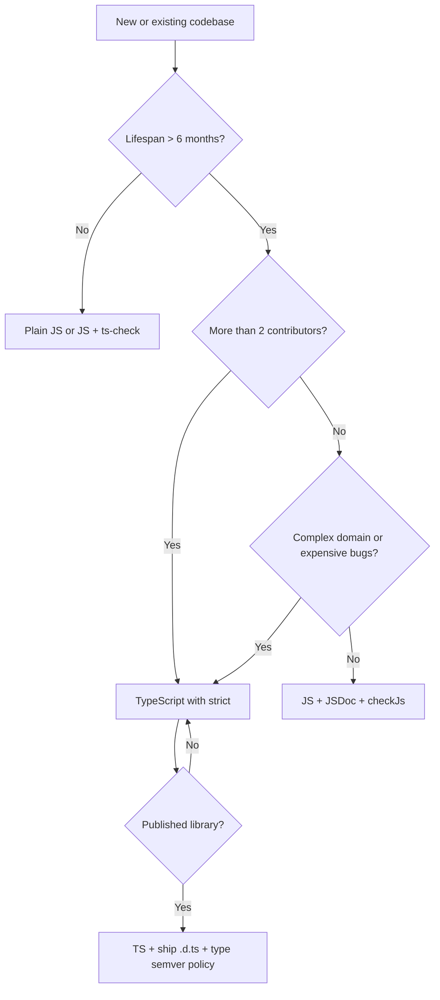
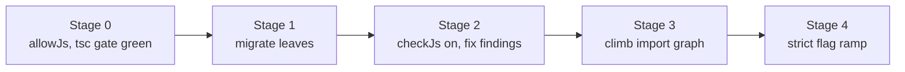
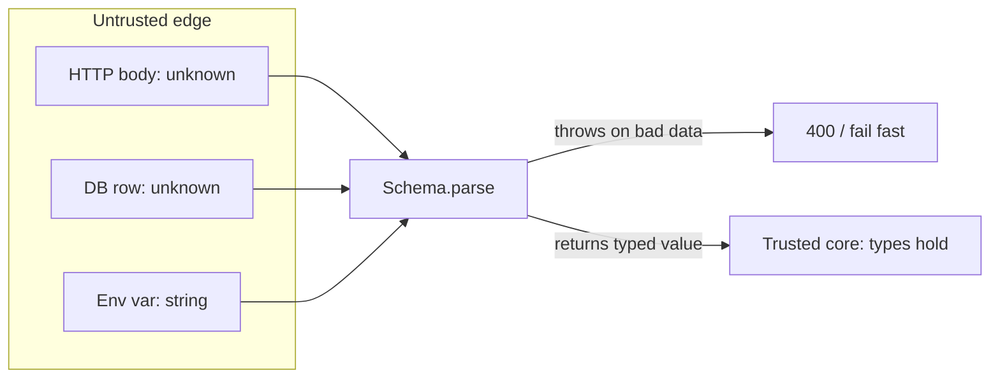
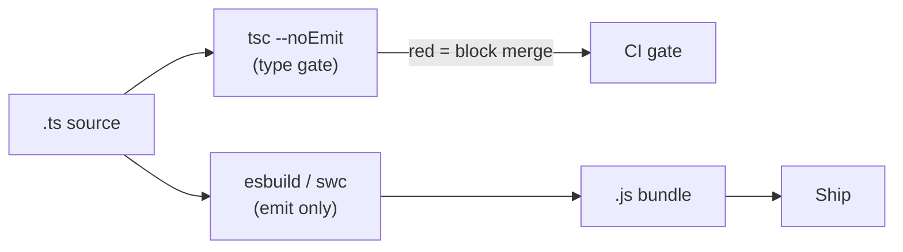

# TypeScript vs JavaScript — Senior Level

## Table of Contents

1. [Responsibilities at This Level](#responsibilities-at-this-level)
2. [The Strategic Question: Adopt TypeScript or Stay on JS](#the-strategic-question-adopt-typescript-or-stay-on-js)
3. [Cost/Benefit at Scale](#costbenefit-at-scale)
4. [The Three Postures: JS, JS+JSDoc, TypeScript](#the-three-postures-js-jsjsdoc-typescript)
5. [Architecting a Large-Scale Migration](#architecting-a-large-scale-migration)
6. [Strictness Rollout Strategy Across Teams](#strictness-rollout-strategy-across-teams)
7. [Type-Safety Boundaries: Compile-Time vs Runtime](#type-safety-boundaries-compile-time-vs-runtime)
8. [The Build/Transpile Pipeline at Scale](#the-buildtranspile-pipeline-at-scale)
9. [Monorepo Considerations](#monorepo-considerations)
10. [Library and Public API Design in TS vs JS](#library-and-public-api-design-in-ts-vs-js)
11. [Team Enablement and Code Review Standards](#team-enablement-and-code-review-standards)
12. [Banning `any` and `@ts-ignore` via Lint](#banning-any-and-ts-ignore-via-lint)
13. [Measuring the Payoff and Avoiding False Safety](#measuring-the-payoff-and-avoiding-false-safety)
14. [Migration and Upgrade Governance](#migration-and-upgrade-governance)
15. [Senior Checklist](#senior-checklist)
16. [Interview-Style Reasoning](#interview-style-reasoning)
17. [Summary](#summary)

---

## Responsibilities at This Level

At junior and middle levels the question was personal: *should I type this function?* At the senior level the question is organizational: *what is our company's stance on TypeScript, and how do we make that stance real across dozens of repos and engineers?*

- Set and defend the organization's TS-vs-JS strategy — when a new service starts in TS, when JS is acceptable, and when a migration is worth funding.
- Architect migrations of large JavaScript codebases to TypeScript without freezing feature work.
- Sequence the strictness rollout so teams ratchet toward `strict` without a wall of red errors blocking every PR.
- Establish where the trust boundary sits — what is guaranteed by the type checker versus what must be validated at runtime.
- Own the build pipeline decision: type-check as a gate, fast transpiler for emit, and how that composes in a monorepo.
- Define the public type surface of shared libraries and the semver policy for *types*, not just runtime behavior.
- Enable the team: review standards, lint rules, and the cultural rule that "it compiles" is not "it works."

The bar at this level: **the type system is a leveraged investment.** A senior decides where that leverage is applied, measures whether it pays off, and prevents it from degrading into a false sense of safety.

---

## The Strategic Question: Adopt TypeScript or Stay on JS

The honest senior answer is not "always TypeScript." It is "TypeScript pays for itself above a threshold of size, lifespan, team count, and bug cost — and below that threshold the build step and ceremony are pure overhead."



The decision is not binary at the org level either. A mature organization typically lands on a *policy*: "All new long-lived services are TypeScript with our shared strict base config. Throwaway scripts and infra glue may stay JS with `// @ts-check`. Existing large JS services are migrated only when their change rate and bug rate justify the investment."

The senior's job is to write that policy down, attach concrete thresholds to it, and make it enforceable — not to relitigate the choice in every repo.

---

## Cost/Benefit at Scale

The middle level listed the costs (build step, learning curve, type-definition gaps, false safety). At the senior level you quantify them against the size of the organization.

| Factor | Small codebase (1 dev, < 5k LOC) | Large codebase (20+ devs, 500k+ LOC) |
|--------|----------------------------------|---------------------------------------|
| Cost of build step | Noticeable friction | Amortized — already have CI/bundler |
| Cost of learning curve | Slows the one author | One-time, amortized across many hires |
| Benefit: refactor safety | Marginal — author remembers everything | Huge — no one person knows the whole tree |
| Benefit: onboarding | Low | High — types are the map for new hires |
| Benefit: bug-class elimination | Few bugs anyway | Eliminates whole categories at scale |
| Type-definition gaps | Painful (few deps) | Manageable (you can afford `.d.ts` work) |

The leverage flips as the org grows. For a solo throwaway script, TypeScript is overhead. For a 500k-line product touched by 30 engineers, the type checker is the *only* thing that makes a property rename across 400 files survivable. The senior frames the conversation in these terms instead of as a language preference.

A concrete framing for budget discussions:

```text
Migration cost  = engineer-weeks to type the hot path + strict rollout
Recurring benefit = (bugs prevented/quarter × avg bug cost)
                  + (refactor-hours saved/quarter)
                  + (onboarding-days saved/new hire)
ROI positive when recurring benefit × project lifespan > migration cost
```

---

## The Three Postures: JS, JS+JSDoc, TypeScript

A senior knows there is a middle posture that is often the right first step and is frequently skipped: **JavaScript with JSDoc and `checkJs`.** It buys most of the type checking with zero `.ts` files and zero build-step change for code that already ships as JS.

```jsonc
// tsconfig.json — type-check JS in place, no emit, no .ts files
{
  "compilerOptions": {
    "allowJs": true,
    "checkJs": true,        // turn on checking for .js files
    "noEmit": true,         // tsc is a checker only here
    "strict": true,
    "skipLibCheck": true
  },
  "include": ["src/**/*.js"]
}
```

```javascript
// src/pricing.js — fully checked, still plain JavaScript
// @ts-check

/**
 * @typedef {Object} LineItem
 * @property {string} sku
 * @property {number} qty
 * @property {number} unitPriceCents
 */

/**
 * @param {LineItem[]} items
 * @returns {number} total in cents
 */
export function subtotalCents(items) {
  return items.reduce((sum, it) => sum + it.qty * it.unitPriceCents, 0);
}

// subtotalCents([{ sku: "A", qty: "2", unitPriceCents: 100 }]);
//   -> Error: Type 'string' is not assignable to type 'number'
```

| Posture | Build change | Type safety | Best for |
|---------|--------------|-------------|----------|
| Plain JS | None | None | Throwaway scripts, prototypes |
| JS + JSDoc + `checkJs` | None (add tsconfig for checking) | Most of TS's checks | Existing JS you cannot stop to migrate; gradual on-ramp |
| TypeScript (`.ts`) | Build/transpile step | Full, plus TS-only syntax | New long-lived code, libraries, complex domains |

The strategic value of the middle posture: it lets a team turn on the type checker *today*, in CI, against the existing codebase, and start fixing real bugs — before committing to a file-by-file `.ts` rewrite. Many migrations should start here.

---

## Architecting a Large-Scale Migration

Migrating a large JS codebase is a multi-month program, not a weekend. The governing principle: **never block feature work, never do a big-bang rewrite, and make every step independently shippable.**

### Stage 0 — Turn on the checker without changing a single file

```jsonc
// tsconfig.json — the loosest possible starting config
{
  "compilerOptions": {
    "allowJs": true,        // let .js coexist with .ts
    "checkJs": false,       // do not check JS yet — zero new errors on day one
    "strict": false,        // ramp later
    "noImplicitAny": false,
    "noEmit": true,         // a fast transpiler handles emit; tsc is the gate
    "skipLibCheck": true,
    "esModuleInterop": true
  },
  "include": ["src"]
}
```

This produces zero errors and zero risk. CI now runs `tsc --noEmit` green. The scaffolding exists.

### Stage 1 — Migrate leaves first

Convert files with **no internal dependents** first (utilities, constants, pure helpers). A leaf rename cannot break callers because nothing imports types *from* it yet.

```bash
# Find the leaf files: modules that are imported the least
npx madge --json src | jq 'to_entries | sort_by(.value | length) | .[0:20]'

# Rename a leaf, fix its own errors, ship it
git mv src/utils/money.js src/utils/money.ts
npm run typecheck   # only this file's own issues surface
```

### Stage 2 — Ratchet `allowJs`/`checkJs` to find latent bugs

Flip `checkJs: true` to let the checker scan remaining `.js` files via inference and JSDoc. Suppress the noise file-by-file, fix the real findings.

```javascript
// Suppress an as-yet-unmigrated noisy file without losing checking elsewhere
// @ts-nocheck  — temporary, tracked in a migration ticket
```

### Stage 3 — Climb the import graph

Migrate modules whose dependencies are already `.ts`, working from leaves toward the application's entry points. Each PR converts a thin slice.

### Stage 4 — Tighten strictness (see next section)

Only after the codebase is fully `.ts` (or fully `checkJs`-clean) do you begin turning on individual strict flags.



A migration tracking table keeps the program honest:

| Metric | Start | Now | Target |
|--------|-------|-----|--------|
| Files `.ts` | 0% | 62% | 100% |
| Files `@ts-nocheck` | 0 | 41 | 0 |
| `any` occurrences | n/a | 318 | < 20 |
| Strict flags enabled | 0/8 | 4/8 | 8/8 |

---

## Strictness Rollout Strategy Across Teams

`strict: true` is eight flags bundled together. Turning them all on at once in a large codebase produces thousands of errors and stalls. The senior strategy is to enable them **one at a time, each as its own gated PR**, ordered by bug-value-per-error.

Recommended ordering (highest payoff, lowest churn first):

```jsonc
// Enable in this order, one flag per PR, each fully green before the next
{
  "compilerOptions": {
    "noImplicitAny": true,        // 1. forces explicit types at boundaries
    "strictNullChecks": true,     // 2. the big one — eliminates undefined-access bugs
    "strictFunctionTypes": true,  // 3. callback/variance safety
    "strictBindCallApply": true,  // 4. low churn, real safety
    "noImplicitThis": true,       // 5. catches detached `this`
    "alwaysStrict": true,         // 6. emit "use strict"
    "strictPropertyInitialization": true, // 7. class field init
    "useUnknownInCatchVariables": true    // 8. catch clauses become unknown
    // then: "strict": true to lock it and pick up future additions
  }
}
```

### Gate it in CI without blocking unrelated work

Use a *staging* config so a flag can be enabled and enforced on already-clean directories while the rest of the tree catches up.

```jsonc
// tsconfig.strict.json — applies the next flag only to migrated areas
{
  "extends": "./tsconfig.json",
  "compilerOptions": { "strictNullChecks": true },
  "include": ["src/payments", "src/auth"]   // areas already cleaned
}
```

```yaml
# .github/workflows/typecheck.yml
jobs:
  typecheck:
    runs-on: ubuntu-latest
    steps:
      - uses: actions/checkout@v4
      - uses: actions/setup-node@v4
        with: { node-version: 20, cache: npm }
      - run: npm ci
      - run: npm run typecheck            # baseline config, whole repo
      - run: npm run typecheck:strict     # strict config, migrated areas only
```

```json
// package.json
{
  "scripts": {
    "typecheck": "tsc -p tsconfig.json --noEmit",
    "typecheck:strict": "tsc -p tsconfig.strict.json --noEmit"
  }
}
```

This is the ratchet: every directory that becomes clean is added to `tsconfig.strict.json` and can never regress, while the rest of the codebase keeps shipping. When the strict include list equals the whole `src`, you delete the staging config and set `strict: true` in the base.

**Anti-pattern to forbid:** turning on `strict` globally and then sprinkling `// @ts-ignore` to silence the fallout. That produces a config that *claims* strictness while the source quietly opts out everywhere — the worst of both worlds.

---

## Type-Safety Boundaries: Compile-Time vs Runtime

The single most important architectural concept a senior enforces: **types guarantee the inside of your program; they guarantee nothing about data crossing a boundary.** Every edge where untyped data enters — HTTP bodies, query results, message queues, `localStorage`, env vars, third-party webhooks — must be validated at runtime.

The pattern is "parse, don't validate": at the boundary, run untrusted `unknown` through a schema that *returns a typed value* on success and throws otherwise. Inside the boundary, the type is earned and trustworthy.



```ts
import { z } from "zod";

// One schema is the single source of truth for the runtime shape AND the type
const CreateOrder = z.object({
  customerId: z.string().uuid(),
  items: z.array(z.object({ sku: z.string(), qty: z.number().int().positive() })).min(1),
  currency: z.enum(["USD", "EUR", "GBP"]),
});

// The compile-time type is DERIVED from the runtime schema — they cannot drift
type CreateOrder = z.infer<typeof CreateOrder>;

export function handleCreateOrder(rawBody: unknown): CreateOrder {
  // At the boundary, validate. Inside, the type is guaranteed.
  return CreateOrder.parse(rawBody); // throws ZodError on bad input
}
```

The senior decision is *where the boundaries are* and *that exactly one validation happens at each*. Two failure modes to police:

- **Validation gaps** — a boundary with no parse; the type is a lie and a malformed request reaches the core. Fix: a lint rule or architectural test that every controller input is schema-parsed.
- **Redundant validation** — re-parsing the same data deep inside the core where the type already holds. Wasteful and signals unclear boundaries.

```ts
// Env vars are a boundary too — validate once at startup, export typed config
const Env = z.object({
  PORT: z.coerce.number().int().default(3000),
  DATABASE_URL: z.string().url(),
  NODE_ENV: z.enum(["development", "test", "production"]),
});

export const env = Env.parse(process.env); // fails fast at boot if misconfigured
```

This is the boundary that converts "if it compiles it works" from a dangerous myth into a *true* statement for the trusted core — because the only way data enters is through a parse.

---

## The Build/Transpile Pipeline at Scale

At scale you separate the two jobs middle level introduced — **type checking** and **emitting JavaScript** — and assign them to the tools each does best.

- `tsc --noEmit` is the **type gate**: the source of truth for correctness, run in CI and the editor.
- A fast per-file transpiler (esbuild or swc) is the **emitter**: it strips types and produces JS at 10–100× tsc's speed, but performs *no* type checking.



```jsonc
// tsconfig.json — type-check only; emit is delegated
{
  "compilerOptions": {
    "noEmit": true,
    "isolatedModules": true,   // guarantees each file is transpilable alone
    "verbatimModuleSyntax": true,
    "strict": true,
    "skipLibCheck": true
  }
}
```

```bash
# Two independent commands; CI runs both, the dev server runs only the fast one
tsc -p tsconfig.json --noEmit     # correctness gate (slow, exhaustive)
esbuild src/index.ts --bundle --platform=node --outfile=dist/index.js  # fast emit
```

```json
// package.json — the canonical split
{
  "scripts": {
    "typecheck": "tsc --noEmit",
    "build": "esbuild src/index.ts --bundle --outfile=dist/index.js",
    "ci": "npm run typecheck && npm run build"
  }
}
```

`isolatedModules: true` is non-negotiable here: it makes `tsc` reject constructs a per-file transpiler cannot handle (e.g. `const enum`, type-only re-exports without `type`), so the gate and the emitter never disagree. The senior owns this guarantee — a green build that skipped the type gate is a production incident waiting to happen.

---

## Monorepo Considerations

In a monorepo the build pipeline gains a second dimension: dependency ordering. Use TypeScript **project references** (`composite: true`, `tsc -b`) so each package is checked once, emits its `.d.ts`, and downstream packages check against pre-computed declarations rather than re-parsing source.

```jsonc
// tsconfig.base.json — shared, strict, composite
{
  "compilerOptions": {
    "strict": true,
    "composite": true,
    "declaration": true,
    "declarationMap": true,
    "incremental": true,
    "skipLibCheck": true
  }
}
```

```bash
# Build/type-check the whole graph in dependency order, incrementally
tsc -b
# Only stale packages and their dependents rebuild on a change
```

The strategic payoff: a 40-package monorepo where editing one leaf package re-checks only that package and its dependents, in seconds, instead of re-checking the world. Combined with a turborepo/nx task graph, `typecheck` becomes a cached, parallel, per-package operation — the difference between a 4-minute and a 12-second PR gate.

The TS-vs-JS angle in a monorepo: you can mix postures per package. A new package is strict TS; a legacy package may stay `allowJs` until migrated; a published package additionally emits `.d.ts`. The shared base config makes the *default* strict, so JS is the deliberate exception, documented per package.

---

## Library and API Design in TS vs JS

Authoring a *library* raises decisions a plain application never faces, because your **types are part of your public API.**

### Ship declaration files

```jsonc
// tsconfig.json for a published package
{
  "compilerOptions": {
    "declaration": true,        // emit .d.ts — consumers get types even in JS
    "declarationMap": true,     // .d.ts.map — go-to-definition jumps to your source
    "emitDeclarationOnly": false
  }
}
```

```jsonc
// package.json — point consumers at runtime AND types, per export
{
  "name": "@acme/sdk",
  "type": "module",
  "exports": {
    ".": {
      "types": "./dist/index.d.ts",
      "import": "./dist/index.js",
      "require": "./dist/index.cjs"
    }
  }
}
```

A library author choosing TypeScript benefits *every consumer*, including those who write plain JavaScript: they still get autocomplete and inline docs from your shipped `.d.ts`. This is why TS adoption is near-universal for published packages even when their users are on JS.

### Types are subject to semver

This is the subtlety seniors must internalize: **a change that is runtime-compatible can still be a breaking change to the type surface.**

```ts
// v1.0.0
export function find(id: string): User | undefined { /* ... */ }

// v1.1.0 — PATCH/MINOR at runtime, but a BREAKING change for typed consumers:
export function find(id: string): User | null { /* ... */ }
//   consumers who did `const u = find(id); if (u !== undefined)` now mis-handle null
```

Policy a senior writes down:

| Type change | Semver impact |
|-------------|---------------|
| Widen a parameter type (accept more) | Non-breaking (minor) |
| Narrow a parameter type (accept less) | Breaking (major) |
| Widen a return type | Breaking (major) — consumers must handle more |
| Narrow a return type | Non-breaking (minor) |
| Add an optional property to a returned object | Minor |
| Add a required property to an accepted object | Breaking (major) |
| Rename/remove an exported type | Breaking (major) |

Guard this with type-level tests in CI so an accidental signature change is caught before publish:

```ts
import { expectTypeOf } from "expect-type";

// Pins the public contract; fails the build if the return type drifts
expectTypeOf(find).returns.toEqualTypeOf<User | undefined>();
```

Tools like `@arethetypeswrong/cli` and API-extractor let you snapshot the public `.d.ts` and diff it on every PR, turning "did we break the type API?" into an automated check.

---

## Team Enablement and Code Review Standards

A type system is only as good as the culture around it. The senior codifies review standards so the codebase converges rather than fragmenting into many personal styles.

Concrete standards to publish and enforce in review:

- **Annotate boundaries, infer internals.** Public functions, exported APIs, and module edges get explicit parameter and return types; locals are inferred.
- **No `any` without a written justification.** Prefer `unknown` + narrowing. An `any` in a PR requires a comment explaining why and a tracking ticket.
- **Validate every external boundary** with a schema; reviewers reject controllers that consume `req.body` without a parse.
- **Prefer discriminated unions** over boolean flags + casts for variant data.
- **`as` is a smell.** A type assertion in review must be justified; a schema parse or a type guard is almost always preferable.
- **Earn your types.** "It compiles" is not "it works" — review still asks for runtime tests at boundaries.

```ts
// Reviewer rejects this — boolean-flag-and-cast pattern
function render(s: { ok: boolean; data?: Data; error?: string }) {
  if (s.ok) draw(s.data as Data);     // unsafe cast, error/data not mutually exclusive
}

// Reviewer approves this — discriminated union makes illegal states unrepresentable
type State =
  | { status: "ok"; data: Data }
  | { status: "err"; error: string };

function render2(s: State) {
  if (s.status === "ok") draw(s.data); // narrowed, no cast, exhaustive
}
```

Enablement also means onboarding artifacts: a short internal "TS in this org" doc, the shared base config, example PRs that model the standards, and pairing for the first migration tickets. The goal is that a new hire absorbs the conventions from the codebase and the lint output, not from tribal knowledge.

---

## Banning `any` and `@ts-ignore` via Lint

`tsconfig.json` strictness can be silently bypassed in source with `any`, `as any`, and `@ts-ignore`. The senior closes these escape hatches with lint rules that fail CI, so the strictness encoded in config cannot be quietly defeated.

```jsonc
// eslint.config.js (typescript-eslint flat config) — the guardrails
{
  "rules": {
    // Ban explicit any in source
    "@typescript-eslint/no-explicit-any": "error",
    // Ban `as any` and similar unsafe assertions
    "@typescript-eslint/no-unsafe-assignment": "error",
    "@typescript-eslint/no-unsafe-call": "error",
    "@typescript-eslint/no-unsafe-member-access": "error",
    "@typescript-eslint/no-unsafe-return": "error",
    // Forbid @ts-ignore; require @ts-expect-error WITH a description instead
    "@typescript-eslint/ban-ts-comment": ["error", {
      "ts-ignore": true,
      "ts-expect-error": "allow-with-description",
      "minimumDescriptionLength": 10
    }],
    // Disallow non-null assertions (the `!` escape hatch)
    "@typescript-eslint/no-non-null-assertion": "error"
  }
}
```

Why `@ts-expect-error` over `@ts-ignore`:

```ts
// @ts-ignore stays forever, even after the underlying error is fixed — silent rot
// @ts-ignore
const x: number = getValue();

// @ts-expect-error FAILS the build once the error is gone, forcing cleanup
// @ts-expect-error legacy lib returns untyped value, tracked in TICKET-1234
const y: number = getValue();
```

`@ts-expect-error` is self-cleaning: when the suppressed error disappears (a library ships types, a refactor fixes it), the directive itself becomes an *unused suppression* error and CI forces its removal. `@ts-ignore` rots silently. Banning the latter and requiring a description on the former turns every suppression into a reviewable, tracked, expiring decision.

A pragmatic escalation path: ban these rules as `error` in new/migrated code, `warn` in legacy areas, and drive the legacy warning count to zero as a tracked metric.

---

## Measuring the Payoff and Avoiding False Safety

A senior justifies the investment with evidence, not faith. Two things must be measured: the **payoff** (is TypeScript reducing bugs and speeding refactors?) and the **false-safety risk** (is the team mistaking compilation for correctness?).

### Measuring payoff

- **Bug-class reduction.** Tag production incidents by root cause. Track the share attributable to classes TS eliminates: undefined/null access, wrong argument type, misspelled property, missing switch case. A falling trend after migration is the headline metric.
- **Refactor velocity.** Measure time-to-merge for cross-cutting renames before vs after typing the affected area.
- **Strictness coverage.** Percent of `src` under `strict`, count of `any`, count of `@ts-expect-error`. These should trend toward (100%, ~0, ~0).

```bash
# Cheap, trackable signals you can graph over time
grep -rEc "\bany\b" src | awk -F: '{s+=$2} END {print "any occurrences:", s}'
grep -rc "@ts-expect-error" src | awk -F: '{s+=$2} END {print "suppressions:", s}'
npx type-coverage --detail   # percent of identifiers with a non-any type
```

### Avoiding the false sense of safety

The most dangerous failure at scale is cultural: a team that believes a green `tsc` means correct software and therefore skips runtime validation and tests.

```ts
// This compiles cleanly and is WRONG at runtime
const config = JSON.parse(fs.readFileSync("config.json", "utf8")) as Config;
config.port.toFixed(); // crashes if port is a string in the actual JSON file
```

The type assertion bought a green build and zero safety. Countermeasures the senior enforces:

- **Boundaries are parsed, not asserted** — `as` at a boundary is a review failure.
- **Runtime tests still exist** at every boundary; "the types cover it" is not an acceptable reason to skip them.
- **Type coverage is monitored** — a high `any` count means large blind spots the compiler is silently ignoring.

The mature mental model: TypeScript guarantees *internal consistency*, not *external correctness*. It makes the trusted core trustworthy **only because** the boundaries validate. Drop the boundary validation and the entire guarantee collapses into a comforting illusion.

---

## Migration and Upgrade Governance

TypeScript ships frequent minor releases, and each can introduce new errors (better inference finds previously hidden bugs). At org scale, upgrades are governed events, not caret bumps.

```jsonc
// Pin exactly and dedupe to a single version across the tree
{
  "devDependencies": { "typescript": "5.5.4" },
  "overrides": { "typescript": "5.5.4" }
}
```

```bash
# Governed upgrade procedure
git checkout -b chore/ts-5.6
npm install -D typescript@5.6.2

# Capture the full error delta as the PR's evidence
npm run typecheck 2>&1 | tee ts-upgrade-errors.txt

# Fix or document each new error; never blanket-disable a strict flag to pass
npm ls typescript      # confirm a single version in the tree
```

Policy a senior writes down:

- TypeScript is upgraded in a **dedicated PR**, gated by a fully green `tsc --noEmit` across all packages.
- Every new error is either fixed or suppressed with a *described* `@ts-expect-error` and a ticket — never with a silenced strict flag.
- The lockfile is committed; CI runs `npm ci`; `overrides` guarantee one compiler version so editor, CI, and every package agree.
- Strict-flag increases are *separate* PRs from version bumps, so a regression is attributable to exactly one change.

This is the discipline that lets a large org adopt TypeScript improvements steadily instead of fearing every release — the pin keeps CI green until the upgrade is a deliberate, reviewed, reversible event.

---

## Senior Checklist

- [ ] Written org policy for TS vs JS vs JS+JSDoc, with concrete adoption thresholds.
- [ ] Shared strict base `tsconfig` extended by every repo; JS is the documented exception.
- [ ] Large migrations staged (Stage 0 gate → leaves → climb graph → strict ramp), tracked with metrics.
- [ ] Strict flags rolled out one-per-PR with a ratcheting `tsconfig.strict.json` include list.
- [ ] Every external boundary validated once with a schema (parse, don't validate); `env` parsed at boot.
- [ ] `tsc --noEmit` is the CI type gate; a fast transpiler (esbuild/swc) handles emit; `isolatedModules` on.
- [ ] Monorepos use project references (`composite`, `tsc -b`) for incremental, ordered checks.
- [ ] Published libraries ship `.d.ts`, declare `exports.types`, and have a documented *type* semver policy with type-level tests.
- [ ] Lint bans `any`/`@ts-ignore`/non-null `!`; `@ts-expect-error` requires a description and a ticket.
- [ ] Payoff measured (bug-class reduction, type-coverage, `any` count) and false safety actively policed.
- [ ] TypeScript upgrades are governed, pinned, deduped, gated PRs separate from strictness changes.

---

## Interview-Style Reasoning

**Q: A 30-engineer team has a 400k-line JavaScript service with frequent `undefined is not a function` crashes. How do you migrate to TypeScript without freezing feature work?**
> Never big-bang. Stage 0: add a `tsconfig` with `allowJs: true`, `checkJs: false`, `noEmit: true` — zero new errors, CI gate green immediately. Then migrate leaf files first (no dependents can break), flip `checkJs` on to surface latent bugs via JSDoc/inference, and climb the import graph one slice per PR. Add schema validation at HTTP and DB boundaries early, because that is where the actual crashes originate. Only once files are `.ts`-clean do I ramp strict flags one at a time behind a ratcheting `tsconfig.strict.json`. Every step is independently shippable, so features keep moving.

**Q: Your team enabled `strict: true` and now there are 2,000 `@ts-ignore` comments. What went wrong and how do you fix it?**
> They turned on strict globally before the code was ready and used suppressions to make CI green — a config that *claims* strictness while the source opts out everywhere. The fix: ban `@ts-ignore` via lint, migrate the existing ones to `@ts-expect-error` with descriptions (so each becomes self-cleaning and tracked), and re-do the rollout incrementally with a ratcheting include list per directory. Strictness must be earned area by area, not declared and then silenced.

**Q: Why might a library author choose TypeScript even when all their users write plain JavaScript?**
> Because the shipped `.d.ts` gives every consumer autocomplete, inline docs, and signature checking in their editor — even JS users via the TS-powered language service. The author also gets a typed, refactor-safe internal codebase. The catch they must manage is that the type surface is now part of the public API: a runtime-compatible change can still break typed consumers, so they need a *type* semver policy and type-level tests in CI to avoid shipping a breaking `.d.ts` as a patch.

**Q: How do you stop a team from treating "it compiles" as "it works"?**
> By making the boundary discipline non-negotiable and measurable. Every untrusted edge — HTTP body, DB row, env var, queue message — is parsed once with a schema that returns a typed value; `as` at a boundary fails review. Inside that boundary the types are *earned*, so the core is genuinely safe. I pair that with type-coverage monitoring (a rising `any` count is a blind-spot alarm) and keep runtime boundary tests mandatory. TypeScript guarantees internal consistency, never external correctness — the validation at the edge is what makes the guarantee real.

---

## Summary

- Senior-level TS-vs-JS is a **strategy decision**, not a personal preference: set an org policy with concrete thresholds for when TS, JS+JSDoc, or plain JS is correct.
- The leverage flips with scale — TypeScript's refactor-safety, onboarding, and bug-class-elimination benefits dominate in large, long-lived, multi-team codebases and are overhead in tiny ones.
- Migrate **incrementally**: a zero-risk `allowJs` gate first, leaves before roots, `checkJs` to surface latent bugs, then a per-PR strict-flag ratchet with a staging config — never a big-bang rewrite.
- The architectural keystone is the **type-safety boundary**: parse untrusted data once at every edge so the trusted core's types are earned; drop the parse and the safety is an illusion.
- Split **type-checking (`tsc --noEmit` gate)** from **emit (esbuild/swc)**; in monorepos use project references for incremental, ordered checks.
- Library types are **public API** subject to semver; ship `.d.ts`, gate type changes with type-level tests.
- Enforce the culture with **lint** (ban `any`/`@ts-ignore`, require described `@ts-expect-error`), **review standards**, and **measured payoff** — and never let "it compiles" be mistaken for "it works."

**Next step:** Go under the hood — how `tsc` actually performs type erasure, how the structural type checker and inference engine work, and how TypeScript and JavaScript differ at the compiler and runtime level.
