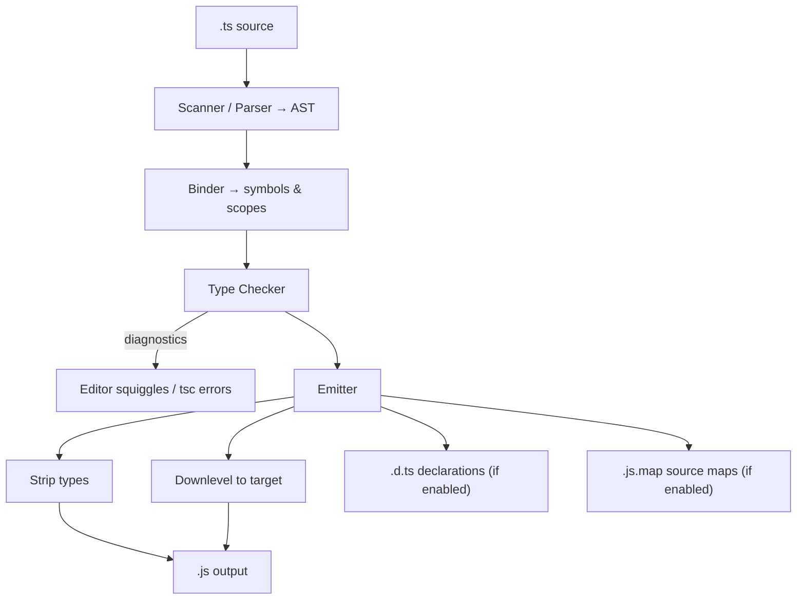

# TypeScript vs JavaScript — Specification

> **Official Documentation Reference**
>
> Source: [TypeScript Handbook — The Basics](https://www.typescriptlang.org/docs/handbook/2/basic-types.html) and [TypeScript for JavaScript Programmers](https://www.typescriptlang.org/docs/handbook/typescript-in-5-minutes.html)

---

## Table of Contents

1. [Docs Reference](#1-docs-reference)
2. [The Superset Relationship](#2-the-superset-relationship)
3. [Static vs Dynamic Typing (Per the Handbook)](#3-static-vs-dynamic-typing-per-the-handbook)
4. [Type Erasure — The Defining Property](#4-type-erasure--the-defining-property)
5. [Structural Typing](#5-structural-typing)
6. [What Compiles Away vs What Emits](#6-what-compiles-away-vs-what-emits)
7. [The Compilation Pipeline](#7-the-compilation-pipeline)
8. [Type Inference Rules](#8-type-inference-rules)
9. [`any`, `unknown`, and the Escape Hatches](#9-any-unknown-and-the-escape-hatches)
10. [Soundness — Where the Type System Is Deliberately Unsafe](#10-soundness--where-the-type-system-is-deliberately-unsafe)
11. [Official Examples](#11-official-examples)
12. [Edge Cases from the Docs](#12-edge-cases-from-the-docs)
13. [Version and History Notes](#13-version-and-history-notes)
14. [Compliance Checklist](#14-compliance-checklist)
15. [Related Documentation](#15-related-documentation)

---

## 1. Docs Reference

| Property | Value |
|----------|-------|
| **Official Site** | [typescriptlang.org](https://www.typescriptlang.org/) |
| **5-Minute Intro** | [TypeScript for JavaScript Programmers](https://www.typescriptlang.org/docs/handbook/typescript-in-5-minutes.html) |
| **Handbook — Basics** | [The Basics](https://www.typescriptlang.org/docs/handbook/2/basic-types.html) |
| **Everyday Types** | [Everyday Types](https://www.typescriptlang.org/docs/handbook/2/everyday-types.html) |
| **Type Compatibility** | [Type Compatibility](https://www.typescriptlang.org/docs/handbook/type-compatibility.html) |
| **Playground** | [TS Playground](https://www.typescriptlang.org/play) — shows emitted JS |
| **Design Goals** | [TypeScript Design Goals (Wiki)](https://github.com/microsoft/TypeScript/wiki/TypeScript-Design-Goals) |

The official documentation frames TypeScript as **"JavaScript with syntax for types."** This specification page mirrors the Handbook's framing of the TS↔JS relationship, with direct links and precise behavioral notes for each concept.

> From the official site: *"TypeScript is a strongly typed programming language that builds on JavaScript, giving you better tooling at any scale."*

---

## 2. The Superset Relationship

> Reference: [TypeScript for JavaScript Programmers](https://www.typescriptlang.org/docs/handbook/typescript-in-5-minutes.html)

The single foundational claim of the language: **TypeScript is a typed superset of JavaScript.** Formally, the set of valid TypeScript programs is a *superset* of the set of valid JavaScript programs.

| Claim | Meaning |
|-------|---------|
| Every valid JS is valid TS | A `.js` file's contents, renamed to `.ts`, parses and (usually) compiles |
| TS adds syntax | Type annotations, interfaces, enums, generics, `as`, `satisfies` — none of which exist in JS |
| TS emits JS | The output of the compiler is plain JavaScript at a configurable language level |

> From the Design Goals: *"Statically identify constructs that are likely to be errors"* and *"Impose no runtime overhead on emitted programs."*

### The one caveat the docs note

The "all JS is valid TS" claim is true at the **syntax** level. With type checking enabled, valid JS may still produce **type errors** (e.g. an implicit `any` under `noImplicitAny`). The program is still *valid TypeScript syntax*; the compiler simply reports diagnostics. By default `tsc` still emits the JS even with errors (see `noEmitOnError`).

```typescript
// 100% valid JavaScript. As TS, it parses fine.
// Under "noImplicitAny", `name` triggers a diagnostic — but it is still valid TS syntax.
function greet(name) {
  return "Hello, " + name;
}
```

### Design goal: a superset, not a replacement

The TypeScript team's stated non-goals explicitly include: *"Do not add expression-level syntax"* in ways that would change JavaScript semantics, and *"Use a consistent, fully erasable, structural type system."* The word **erasable** is the key — it guarantees the superset relationship is one-directional and lossless on the way down to JS.

---

## 3. Static vs Dynamic Typing (Per the Handbook)

> Reference: [The Basics](https://www.typescriptlang.org/docs/handbook/2/basic-types.html)

The Handbook's "The Basics" page opens by contrasting the two models directly.

| Aspect | JavaScript (dynamic) | TypeScript (static) |
|--------|----------------------|---------------------|
| When types are known | At runtime, per value | At compile time, per expression |
| When mistakes surface | When the bad line executes | When `tsc` checks the file |
| Tooling depth | Limited (guesswork) | Rich (the checker knows every type) |
| Cost model | Pay at runtime via crashes | Pay once at build time |

> From the Handbook: *"Ideally, we could have a tool that helps us find these bugs before our code runs. That's what a static type-checker like TypeScript does."*

### The canonical Handbook example

```typescript
// JavaScript behavior the Handbook highlights:
const message = "Hello World!";
// message();   // In plain JS: runtime TypeError: message is not a function
//              // In TS: compile-time error before you ever run it:
//              // "This expression is not callable. Type 'String' has no call signatures."
```

The Handbook stresses that TypeScript flags this *statically* — the red squiggle appears in the editor the moment you type it, not when a user triggers the code path in production.

### Catching typos — another Handbook example

```typescript
const user = {
  name: "Daniel",
  age: 26,
};

// JavaScript: undefined, silently — a typo bug that ships
// user.location;

// TypeScript: compile error
// Property 'location' does not exist on type '{ name: string; age: number; }'.
```

---

## 4. Type Erasure — The Defining Property

> Reference: [TypeScript for JavaScript Programmers — "Types by Inference" / erasure](https://www.typescriptlang.org/docs/handbook/typescript-in-5-minutes.html) and Design Goal *"fully erasable type system."*

This is the most consequential rule in the entire language for understanding the TS↔JS relationship.

**Rule:** All type-only constructs are **erased** during compilation. The emitted JavaScript contains **no** type annotations, interfaces, type aliases, generic parameters, or `as`/`satisfies` expressions.

### Constructs that are fully erased (produce ZERO output)

| Construct | Emits any JS? |
|-----------|---------------|
| `interface` | No — vanishes entirely |
| `type` alias | No — vanishes entirely |
| Type annotations (`: string`) | No — the `: string` is stripped |
| Generic parameters (`<T>`) | No — erased to nothing |
| `as` assertions / `satisfies` | No — the value remains, the assertion is stripped |
| `declare` statements | No — ambient, type-only |
| Type-only imports (`import type`) | No — elided |

### Constructs that DO emit JavaScript (not pure types)

| Construct | Emits JS? | Note |
|-----------|-----------|------|
| `enum` (non-const) | **Yes** | Generates a real runtime object |
| `class` | **Yes** | Real runtime constructor (but field *types* are erased) |
| `namespace` with values | **Yes** | Generates an IIFE object |
| `const enum` | Inlined | Replaced by literal values at use sites |
| Parameter properties (`constructor(private x)`) | **Yes** | Emits the assignment |

### Side-by-side proof

```typescript
// INPUT (.ts)
interface User {
  id: number;
  name: string;
}

type ID = string | number;

function getName(user: User): string {
  return user.name;
}

const u = { id: 1, name: "Ada" } as User;
```

```javascript
// OUTPUT (.js) — note: interface AND type alias produced nothing; `as User` stripped
"use strict";
function getName(user) {
  return user.name;
}
const u = { id: 1, name: "Ada" };
```

### Consequences of erasure (each cited as a "gotcha" in the docs)

1. **Zero runtime overhead.** The emitted JS is what a JS author would hand-write. This is the Design Goal: *"Impose no runtime overhead on emitted programs."*
2. **No type reflection.** You cannot ask "what is `T`?" at runtime; `T` does not exist.
3. **`instanceof` on an interface is impossible.** Interfaces have no runtime value. The Handbook directs you to discriminated unions or classes instead.
4. **Types are not validation.** A value typed as `User` from `JSON.parse` is *asserted*, not *checked*. Runtime data still needs guards (the Handbook's "Narrowing" chapter, plus libraries like Zod).

```typescript
interface Shape { kind: string; }
// if (x instanceof Shape) {}  // Error: 'Shape' only refers to a type, but is being used as a value here.
```

---

## 5. Structural Typing

> Reference: [Type Compatibility](https://www.typescriptlang.org/docs/handbook/type-compatibility.html)

TypeScript uses a **structural** type system (a.k.a. "duck typing"), in deliberate contrast to the *nominal* systems of Java/C#. The Design Goals state: *"Use a consistent, fully erasable, structural type system."*

> From the docs: *"Type compatibility in TypeScript is based on structural subtyping. Structural typing is a way of relating types based solely on their members."*

### The basic rule

A type `S` is assignable to type `T` if `S` has **at least** the members `T` requires — regardless of names, declarations, or `implements` clauses.

```typescript
interface Named {
  name: string;
}

class Person {
  // no "implements Named" anywhere
  constructor(public name: string) {}
}

let n: Named;
n = new Person("Alice"); // OK — Person structurally has `name: string`
```

### The "extra properties are fine for variables" rule

```typescript
interface Point { x: number; y: number; }

const p3d = { x: 1, y: 2, z: 3 };
const p2d: Point = p3d; // OK — p3d has at least x and y
```

### Excess property checks — the exception for object literals

The docs note a special case: when you assign an **object literal directly**, excess properties are flagged (to catch typos). Via an intermediate variable, the check is relaxed.

```typescript
interface Point { x: number; y: number; }

// Direct literal — excess property check fires:
// const p: Point = { x: 1, y: 2, z: 3 };
// Error: Object literal may only specify known properties, and 'z' does not exist in type 'Point'.

// Via a variable — structural rule allows it:
const tmp = { x: 1, y: 2, z: 3 };
const p: Point = tmp; // OK
```

### Why structural typing matters for the TS↔JS relationship

JavaScript objects are bags of properties created on the fly — there is no class hierarchy you must opt into. A **structural** system matches how JS code is actually written: you pass "anything with the right shape." A nominal system would reject the idiomatic JS pattern of plain object literals.

---

## 6. What Compiles Away vs What Emits

> Reference: [TSConfig — `target`](https://www.typescriptlang.org/tsconfig#target) and the Playground "JS" tab

The compiler does two distinct jobs that the docs keep separate:

1. **Type checking** — analyze types, report diagnostics. Affects *nothing* in the output.
2. **Emit (transpilation)** — strip types AND downlevel modern syntax to the configured `target`.

### Type stripping (always happens)

Independent of any option, type annotations are removed.

### Syntax downleveling (depends on `target`)

```typescript
// INPUT (.ts), target: ES5
const nums = [1, 2, 3];
const doubled = nums.map((n) => n * 2);
class Box { value = 0; }
```

```javascript
// OUTPUT with target ES5 — arrow fn and class downleveled to ES5
"use strict";
var nums = [1, 2, 3];
var doubled = nums.map(function (n) { return n * 2; });
var Box = (function () {
  function Box() { this.value = 0; }
  return Box;
}());
```

```javascript
// OUTPUT with target ES2017 — modern syntax preserved, only types stripped
"use strict";
const nums = [1, 2, 3];
const doubled = nums.map((n) => n * 2);
class Box { constructor() { this.value = 0; } }
```

**Key distinction:** type stripping is about the *type system*; downleveling is about *JavaScript language version compatibility*. Both happen during emit, but they answer different questions.

---

## 7. The Compilation Pipeline

> Reference: [How the compiler works (Handbook, conceptual)](https://www.typescriptlang.org/docs/handbook/intro.html)



| Phase | Job | Relationship to JS |
|-------|-----|--------------------|
| Parse | Build AST from source | Superset grammar: JS grammar + type syntax |
| Bind | Resolve names to symbols | Same scoping rules as JS |
| Check | Verify type assignability | The *only* phase JS lacks |
| Emit | Produce `.js` (+ `.d.ts`, maps) | Output is plain JS at `target` level |

Crucially, **the Check phase and the Emit phase are independent.** By default, type errors do NOT stop emit — `tsc` reports them and still writes `.js`. Set `noEmitOnError: true` to couple them.

---

## 8. Type Inference Rules

> Reference: [TypeScript for JavaScript Programmers — "Types by Inference"](https://www.typescriptlang.org/docs/handbook/typescript-in-5-minutes.html) and [Everyday Types](https://www.typescriptlang.org/docs/handbook/2/everyday-types.html)

The docs emphasize that you rarely need explicit annotations because TypeScript **infers** types.

> From the docs: *"TypeScript knows the JavaScript language and will generate types for you in many cases."*

### Inference from initialization

```typescript
let count = 5;        // inferred: number
const title = "Hi";   // inferred: "Hi" (literal type, because const)
let active = true;    // inferred: boolean
let list = [1, 2, 3]; // inferred: number[]
```

### `let` vs `const` widening

The docs note that `const` infers the **literal** type (narrowest), while `let` **widens** to the base type because the binding is mutable.

```typescript
const a = "hello"; // type: "hello"
let b = "hello";   // type: string  (widened)
```

### Contextual typing

When the surrounding context determines a type, parameters are inferred without annotation.

```typescript
// `n` is inferred as `number` from Array<number>.map's signature
[1, 2, 3].map((n) => n.toFixed(2));
```

### Best-practice from the Handbook

Annotate **function boundaries** (parameters and, optionally, return types) where inference cannot help; let inference handle locals. Over-annotating locals is explicitly discouraged in the "Everyday Types" examples.

---

## 9. `any`, `unknown`, and the Escape Hatches

> Reference: [Everyday Types — `any`](https://www.typescriptlang.org/docs/handbook/2/everyday-types.html#any) and [`unknown`](https://www.typescriptlang.org/docs/handbook/2/functions.html#unknown)

### `any` — opt out of checking

> From the docs: *"When a value is of type `any`, you can access any properties of it... and TypeScript won't check any of it."*

```typescript
let obj: any = { x: 0 };
obj.foo.bar.baz;   // no error
obj();             // no error
obj = "now a string"; // no error
```

`any` propagates: anything derived from an `any` value is also `any`. The docs warn this can silently disable type safety across large swaths of code. Use `noImplicitAny` to forbid *implicit* `any`, and avoid *explicit* `any`.

### `unknown` — the safe top type

> From the docs: *"`unknown` is the type-safe counterpart of `any`. Anything is assignable to `unknown`, but `unknown` isn't assignable to anything but itself and `any` without a type assertion or narrowing."*

```typescript
let value: unknown = JSON.parse("{}");
// value.foo;            // Error: 'value' is of type 'unknown'.
if (typeof value === "object" && value !== null && "foo" in value) {
  // narrowed — now safe
}
```

### Type assertions (`as`) — "trust me"

> From the docs: *"TypeScript only allows type assertions which convert to a more specific or less specific version of a type."*

```typescript
const el = document.getElementById("main") as HTMLCanvasElement;
// `as` is erased at runtime — it performs NO runtime check.
```

The docs explicitly warn that `as` is a compile-time-only escape hatch; it cannot fail at runtime and therefore cannot protect you from wrong data.

---

## 10. Soundness — Where the Type System Is Deliberately Unsafe

> Reference: [TypeScript Design Goals — Non-goals](https://github.com/microsoft/TypeScript/wiki/TypeScript-Design-Goals)

A key part of the TS↔JS relationship: TypeScript's type system is **intentionally not sound**. The Design Goals state a non-goal: *"Apply a sound or 'provably correct' type system. Instead, strike a balance between correctness and productivity."*

### Documented unsoundness examples

```typescript
// 1. Array bounds are not checked (without noUncheckedIndexedAccess)
const arr: number[] = [1, 2, 3];
const x = arr[99]; // typed `number`, actually `undefined` at runtime

// 2. Type assertions bypass checks
const n = "5" as unknown as number; // lies; runtime value is a string

// 3. `any` infects everything
const data: any = getData();
const len: number = data.length; // no check
declare function getData(): any;
```

The docs frame this as a productivity trade-off: a fully sound system (like some research languages) would reject too much idiomatic JavaScript. TypeScript chooses to catch the *common* errors while staying ergonomic for real JS code.

---

## 11. Official Examples

### Example A — the "5-minute" migration (from the docs)

```typescript
// Start: plain JS function
function compact(arr) {
  if (arr.length > 10) return arr.trim(0, 10);
  return arr;
}
// TS immediately flags: Property 'trim' does not exist on type 'any[]'.
// (the author meant `slice`) — a real bug caught at compile time.
```

### Example B — `interface` describing JS object shape

```typescript
interface User {
  name: string;
  id: number;
}

const user: User = {
  name: "Hayes",
  id: 0,
};
```

### Example C — union types from the Handbook

```typescript
function printId(id: number | string) {
  if (typeof id === "string") {
    console.log(id.toUpperCase());
  } else {
    console.log(id);
  }
}
```

### Example D — proving erasure on the Playground

```typescript
// Paste in https://www.typescriptlang.org/play and click the ".JS" tab:
type Color = "red" | "green" | "blue";
const favorite: Color = "red";
// The JS tab shows only:  const favorite = "red";
// The `type Color` line is gone entirely.
```

---

## 12. Edge Cases from the Docs

### Edge case 1: `tsc` emits JS even with type errors

```bash
tsc app.ts   # prints errors AND still writes app.js (by default)
```

Fix with `"noEmitOnError": true`. This is a frequent surprise for newcomers who expect a failing type-check to block output like a compiler for a sound language would.

### Edge case 2: `enum` is NOT erased

```typescript
enum Direction { Up, Down }
// Emits a real runtime object:
// var Direction; (function (Direction){ Direction[Direction["Up"]=0]="Up"; ... })(Direction||(Direction={}));
```

Unlike `interface`/`type`, a regular `enum` has a runtime footprint. The docs note `const enum` (inlined) or union-of-literals as zero-cost alternatives.

### Edge case 3: declaration merging (interfaces only)

```typescript
interface Box { height: number; }
interface Box { width: number; }
// Box now has BOTH height and width — interfaces merge; type aliases do not.
```

### Edge case 4: structural compatibility surprises

```typescript
interface Empty {}
const x: Empty = 42; // OK! number satisfies an empty interface structurally
const y: Empty = "s"; // also OK
```

An empty interface is satisfied by almost any non-null value — a classic structural-typing gotcha the docs caution against.

### Edge case 5: `object` vs `{}` vs `any`

```typescript
let a: object = { k: 1 }; // any non-primitive
let b: {} = 1;            // almost anything except null/undefined
let c: any = anything;    // disables checks
declare const anything: unknown;
```

---

## 13. Version and History Notes

| Version / Year | Milestone relevant to TS↔JS |
|----------------|------------------------------|
| 2012 (TS 0.8) | First public release — "typed superset of JS" framing established |
| TS 1.0 (2014) | Stable; `--noImplicitAny` |
| TS 2.0 (2016) | `strictNullChecks`, non-nullable types, `unknown` foundation |
| TS 3.0 (2018) | `unknown` type added — the safe `any` |
| TS 3.7 | Optional chaining `?.`, nullish coalescing `??` (mirror JS proposals) |
| TS 4.x | `satisfies` operator (4.9), better inference, `as const` improvements |
| TS 5.0 (2023) | `moduleResolution: bundler`, decorators aligned to TC39 |
| TS 5.x | `verbatimModuleSyntax`, isolated declarations — keep `tsc` and bundlers in sync |

The constant through every release: **types remain fully erasable**, preserving the zero-runtime-overhead guarantee.

---

## 14. Compliance Checklist

A correct mental model of the TS↔JS relationship per the official docs:

- [ ] I understand every valid JS program is valid TS syntax (the superset claim).
- [ ] I know type checking happens at compile time, runtime checking does not change.
- [ ] I can state that `interface`, `type`, annotations, and generics are **fully erased**.
- [ ] I know which constructs DO emit runtime code (`enum`, `class`, `namespace`).
- [ ] I understand structural typing: shape over name, no `implements` required.
- [ ] I know excess-property checks fire only on direct object literals.
- [ ] I can explain why TypeScript adds zero runtime overhead.
- [ ] I know the type system is intentionally unsound for productivity.
- [ ] I distinguish `any` (unsafe) from `unknown` (safe top type).
- [ ] I know `tsc` emits JS even with errors unless `noEmitOnError` is set.
- [ ] I never treat a TS type as runtime validation for external data.

---

## 15. Related Documentation

- [TypeScript for JavaScript Programmers](https://www.typescriptlang.org/docs/handbook/typescript-in-5-minutes.html) — the canonical intro
- [The Basics](https://www.typescriptlang.org/docs/handbook/2/basic-types.html) — static checking, non-exception failures
- [Everyday Types](https://www.typescriptlang.org/docs/handbook/2/everyday-types.html) — `any`, `unknown`, unions, inference
- [Type Compatibility](https://www.typescriptlang.org/docs/handbook/type-compatibility.html) — structural subtyping rules
- [Narrowing](https://www.typescriptlang.org/docs/handbook/2/narrowing.html) — runtime-level type guards
- [TSConfig Reference](https://www.typescriptlang.org/tsconfig) — `target`, `strict`, `noEmitOnError`
- [TypeScript Design Goals](https://github.com/microsoft/TypeScript/wiki/TypeScript-Design-Goals) — erasability, structural typing, non-soundness
- [TS Playground](https://www.typescriptlang.org/play) — inspect emitted JS live
