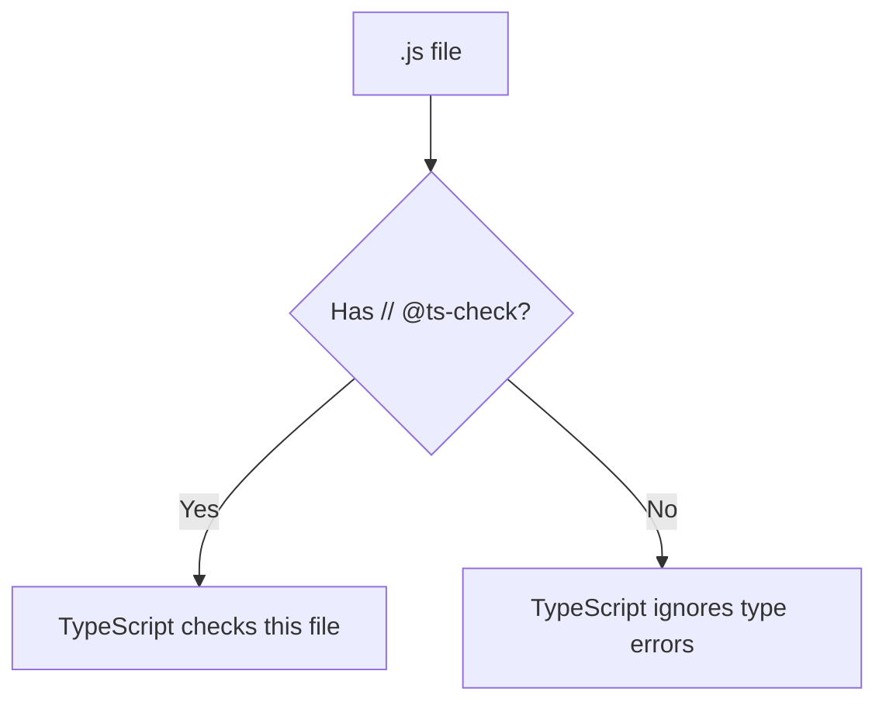
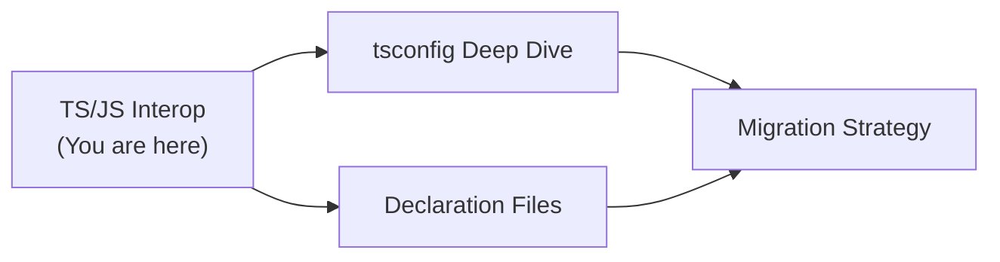
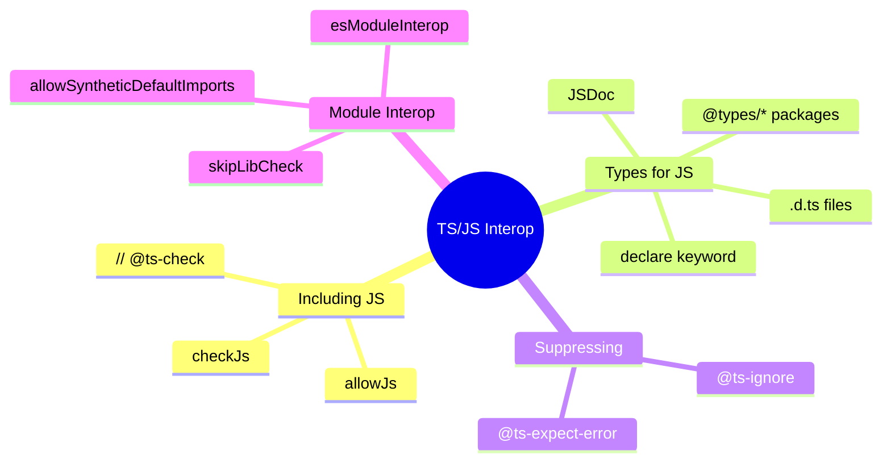
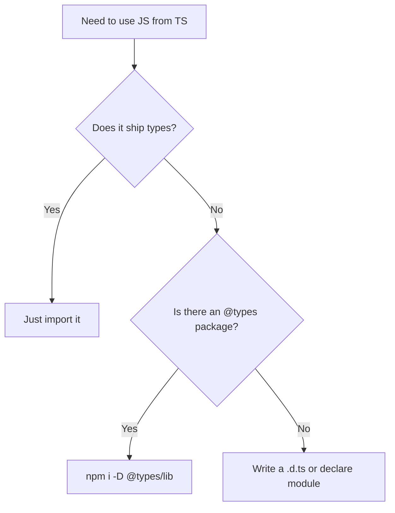

# TS and JS Interoperability — Junior Level

## Table of Contents

1. [Introduction](#introduction)
2. [Prerequisites](#prerequisites)
3. [Glossary](#glossary)
4. [Core Concepts](#core-concepts)
5. [Real-World Analogies](#real-world-analogies)
6. [Mental Models](#mental-models)
7. [Pros & Cons](#pros--cons)
8. [Use Cases](#use-cases)
9. [Code Examples](#code-examples)
10. [Coding Patterns](#coding-patterns)
11. [Clean Code](#clean-code)
12. [Error Handling](#error-handling)
13. [Security Considerations](#security-considerations)
14. [Performance Tips](#performance-tips)
15. [Best Practices](#best-practices)
16. [Edge Cases & Pitfalls](#edge-cases--pitfalls)
17. [Common Mistakes](#common-mistakes)
18. [Tricky Points](#tricky-points)
19. [Test](#test)
20. [Tricky Questions](#tricky-questions)
21. [Cheat Sheet](#cheat-sheet)
22. [Summary](#summary)
23. [What You Can Build](#what-you-can-build)
24. [Further Reading](#further-reading)
25. [Related Topics](#related-topics)
26. [Diagrams & Visual Aids](#diagrams--visual-aids)

---

## Introduction

> Focus: "What is it?" and "How to use it?"

TypeScript and JavaScript **interoperability** (often shortened to "interop") is the set of features that let TypeScript and JavaScript code live in the same project and call each other freely. This matters because TypeScript was deliberately designed as a **superset of JavaScript**: every valid `.js` file is *almost* a valid `.ts` file, and TypeScript compiles down to plain JavaScript. That design decision is the reason you can adopt TypeScript one file at a time instead of rewriting an entire codebase in a "big bang."

When people say "interop," they usually mean one of these situations:

- You have an existing JavaScript project and want to start using TypeScript **gradually**.
- You import a library that was written in plain JavaScript and has no built-in types.
- You write TypeScript but need to consume a `.js` file that you cannot (or do not want to) convert yet.
- You write a `.js` file but still want some type safety from the TypeScript compiler using **JSDoc comments**.
- You consume a third-party package and pull in its types from **DefinitelyTyped** (`@types/*`).

The tools that make all of this possible are: the `allowJs` and `checkJs` compiler options, **declaration files** (`.d.ts`), the `declare` keyword, **ambient declarations**, `@types/*` packages, JSDoc annotations, and special comment directives like `// @ts-check`, `// @ts-ignore`, and `// @ts-expect-error`. This document introduces all of them at a junior level with concrete, runnable examples.

---

## Prerequisites

- **Required:** Comfortable writing plain JavaScript (functions, objects, modules, `import`/`export` or `require`).
- **Required:** You have run `tsc` at least once and seen a `.ts` file compile to `.js`.
- **Required:** You understand what a `tsconfig.json` file is and that it configures the compiler.
- **Helpful but not required:** Basic familiarity with npm, `package.json`, and `node_modules`.
- **Helpful but not required:** You know the difference between CommonJS (`require`/`module.exports`) and ES Modules (`import`/`export`).

---

## Glossary

| Term | Definition |
|------|-----------|
| **Interop** | The ability of TypeScript and JavaScript to call into each other within one project |
| **Superset** | TypeScript contains all of JavaScript plus extra features (types, enums, etc.) |
| **`allowJs`** | A compiler option that lets `.js` files be part of the TypeScript program |
| **`checkJs`** | A compiler option that type-checks `.js` files (using inference and JSDoc) |
| **Declaration file (`.d.ts`)** | A file containing only types — no runtime code — describing the shape of JS |
| **`declare`** | A keyword that says "this thing exists somewhere; here is its type" without emitting code |
| **Ambient declaration** | A `declare` statement describing something defined outside TypeScript's view (globals, modules) |
| **DefinitelyTyped** | A community repository of `.d.ts` files for thousands of JS libraries |
| **`@types/*`** | npm packages (published from DefinitelyTyped) that add types to an untyped library |
| **JSDoc** | Specially formatted comments (`/** ... */`) that TypeScript can read as type annotations |
| **`// @ts-check`** | A comment that turns on type checking for a single `.js` file |
| **`// @ts-ignore`** | A comment that suppresses the type error on the **next** line |
| **`// @ts-expect-error`** | Like `@ts-ignore`, but *errors* if the next line has NO error (safer) |
| **`esModuleInterop`** | A compiler flag that smooths out importing CommonJS modules with ESM syntax |
| **`skipLibCheck`** | A flag that skips type-checking `.d.ts` files (faster builds) |

---

## Core Concepts

### Concept 1: TypeScript Is a Superset of JavaScript

The single most important idea for interop is that **all valid JavaScript is valid TypeScript** (with a few rare exceptions around reserved keywords). This is why migration can be incremental:

```typescript
// This is 100% valid JavaScript AND valid TypeScript.
function greet(name) {
  return "Hello, " + name;
}

console.log(greet("Ada"));
```

If you rename `app.js` to `app.ts`, it usually still compiles. TypeScript simply *adds* the option to annotate types — it does not force you to.

### Concept 2: `allowJs` — Let JS Into the Program

By default, `tsc` only looks at `.ts` and `.tsx` files. To bring `.js` files into the same compilation, set `allowJs: true`. Now TypeScript will read your JavaScript, follow `import` statements into it, and even emit it to the output folder.

```json
{
  "compilerOptions": {
    "allowJs": true
  }
}
```

### Concept 3: `checkJs` — Type-Check the JS

`allowJs` lets JS *participate*, but does not report type errors in it. Add `checkJs: true` to make TypeScript actually type-check your `.js` files using inference and any JSDoc comments you provide.

```json
{
  "compilerOptions": {
    "allowJs": true,
    "checkJs": true
  }
}
```

You can also enable checking for a single file with `// @ts-check` at the top, instead of turning it on globally.

### Concept 4: Declaration Files (`.d.ts`)

A `.d.ts` file describes the **types** of JavaScript code without containing any runtime logic. Think of it as a "header file" for JS. When you import a JS library, TypeScript looks for an accompanying `.d.ts` to know the shapes of its functions and objects.

```typescript
// math.d.ts — describes math.js (which has no types of its own)
export declare function add(a: number, b: number): number;
export declare function subtract(a: number, b: number): number;
```

### Concept 5: `declare` and Ambient Declarations

The `declare` keyword tells TypeScript "this exists at runtime; trust me." It produces **no JavaScript output**. This is how you describe globals injected by a `<script>` tag, environment variables, or libraries with no types.

```typescript
// Tell TS that a global "analytics" object exists at runtime.
declare const analytics: {
  track(event: string, data?: Record<string, unknown>): void;
};

analytics.track("page_view"); // No compile error now.
```

### Concept 6: `@types/*` and DefinitelyTyped

Many popular JS libraries ship without types. **DefinitelyTyped** is a giant community repository that publishes those missing types as `@types/<library>` npm packages. Installing `@types/lodash` gives you full IntelliSense for Lodash even though Lodash itself is plain JS.

```bash
npm install lodash
npm install --save-dev @types/lodash
```

---

## Real-World Analogies

| Concept | Analogy |
|---------|--------|
| **`.d.ts` declaration file** | A restaurant menu — it tells you what dishes exist and what they cost (the types) without showing you the kitchen (the implementation) |
| **`allowJs`** | Letting guests who don't speak the house language into the party — they can still attend and interact |
| **`checkJs`** | Hiring a translator at that party who corrects misunderstandings as they happen |
| **`@types/*` packages** | Subtitles for a foreign film — the movie (the JS library) is unchanged, but now you understand it |
| **`declare`** | A note on a shared fridge saying "the milk is in the back" — you trust it without opening the fridge |

---

## Mental Models

**The intuition:** Types are a layer that sits *on top of* JavaScript and is *erased* before the code runs. Interop is all about teaching that type layer about JavaScript code it cannot see the types of — either by checking the JS directly (`checkJs` + JSDoc) or by giving it a separate map of the types (`.d.ts`).

**Why this model helps:** Whenever interop confuses you, ask: "Does TypeScript have a way to know the types here?" If the answer is no, you need to *give* it the types — via JSDoc, a `.d.ts`, an `@types/*` package, or a `declare` statement. Every interop feature is just a different way of supplying that missing information.

---

## Pros & Cons

| Pros | Cons |
|------|------|
| Adopt TypeScript gradually — no big rewrite | Mixed codebases have inconsistent type safety |
| Reuse the entire npm/JavaScript ecosystem | Some `@types/*` packages are outdated or wrong |
| JSDoc gives types without changing `.js` files | JSDoc is more verbose than native annotations |
| `.d.ts` files separate types from implementation | Writing accurate `.d.ts` by hand is hard |
| `// @ts-check` opts in file-by-file | `// @ts-ignore` can silently hide real bugs |
| `skipLibCheck` speeds up builds | `skipLibCheck` can hide errors in dependency types |

### When to use:
- Migrating an existing JS project to TypeScript over time, or consuming untyped JS libraries.

### When NOT to use:
- A brand-new greenfield project — start with pure TypeScript and skip the interop complexity.

---

## Use Cases

- **Use Case 1:** Gradually migrating a legacy Node.js or React JS codebase to TypeScript file by file.
- **Use Case 2:** Adding types to an internal JS utility library so the rest of the team gets IntelliSense.
- **Use Case 3:** Consuming a third-party JS-only package by installing its `@types/*` package or writing a small `.d.ts`.

---

## Code Examples

### Example 1: Renaming a JS File to TS

```typescript
// before: user.js (plain JavaScript)
//   function makeUser(name, age) {
//     return { name, age };
//   }

// after: user.ts (now with types)
interface User {
  name: string;
  age: number;
}

function makeUser(name: string, age: number): User {
  return { name, age };
}

const ada = makeUser("Ada", 36);
console.log(ada.name);
```

**What it does:** Converts a plain factory function into a typed one.
**How to run:** `tsc user.ts && node user.js`

### Example 2: Enabling `allowJs` and `checkJs`

```typescript
// tsconfig.json
// {
//   "compilerOptions": {
//     "allowJs": true,
//     "checkJs": true,
//     "outDir": "./dist",
//     "noEmit": false
//   }
// }

// legacy.js — checked because checkJs is on
function double(x) {
  return x * 2;
}

// TypeScript infers double(x: any): number, and flags this:
double("not a number"); // checkJs reports: argument is not assignable
```

**What it does:** Turns on JS checking so TypeScript reports type errors in `.js`.
**How to run:** `tsc --noEmit`

### Example 3: Adding JSDoc Types to a `.js` File

```typescript
// @ts-check
// area.js — a plain JS file we want type-checked without converting it

/**
 * Compute the area of a rectangle.
 * @param {number} width
 * @param {number} height
 * @returns {number}
 */
function area(width, height) {
  return width * height;
}

area(3, 4);        // OK -> 12
area("3", 4);      // Error: string is not assignable to number
```

**What it does:** Uses JSDoc to give types to a JavaScript function.
**How to run:** `tsc --allowJs --checkJs --noEmit area.js`

### Example 4: Writing a Hand-Made `.d.ts`

```typescript
// legacy-lib.js (cannot be modified, no types)
//   module.exports = {
//     version: "1.2.3",
//     formatName: function (first, last) { return first + " " + last; }
//   };

// legacy-lib.d.ts — describes the shape so TS understands it
declare const legacyLib: {
  version: string;
  formatName(first: string, last: string): string;
};

export = legacyLib;
```

**What it does:** Provides types for a CommonJS module that ships none.
**How to run:** `tsc --noEmit`

### Example 5: Using a `@types/*` Package

```typescript
// After: npm install lodash @types/lodash
import { chunk } from "lodash";

const pages = chunk([1, 2, 3, 4, 5], 2);
// TypeScript knows chunk<T>(array, size): T[][]
// pages is typed as number[][]
console.log(pages); // [[1, 2], [3, 4], [5]]
```

**What it does:** Gets full type safety for Lodash via DefinitelyTyped types.
**How to run:** `tsc --noEmit && node dist/index.js`

### Example 6: Importing a CommonJS Module with `esModuleInterop`

```typescript
// With "esModuleInterop": true you can write clean default imports:
import express from "express";

const app = express();
app.get("/", (_req, res) => res.send("Hello"));

// Without esModuleInterop you'd be forced to write:
//   import * as express from "express";
//   const app = express(); // and this often errors
```

**What it does:** Lets you use ESM-style default imports against CommonJS modules.
**How to run:** `tsc && node dist/server.js`

---

## Coding Patterns

### Pattern 1: Opt-In Checking with `// @ts-check`

**Intent:** Get type safety in selected `.js` files without flipping `checkJs` globally.
**When to use:** Early in a migration, when you don't want to fix every JS file at once.

```typescript
// @ts-check
/**
 * @param {string[]} items
 * @returns {number}
 */
function totalLength(items) {
  return items.reduce((sum, s) => sum + s.length, 0);
}

totalLength(["a", "bb"]); // OK
totalLength("oops");      // Error: string is not string[]
```

**Diagram:**



**Remember:** `// @ts-check` is the per-file equivalent of `checkJs: true`. Use `// @ts-nocheck` to do the opposite.

### Pattern 2: Suppressing a Single Error Safely

**Intent:** Bypass a type error you know is wrong, without silencing future errors.
**When to use:** When a type definition is incorrect and you have verified the runtime behavior.

```typescript
function callLegacy(api: { doThing(): void }) {
  // Prefer @ts-expect-error over @ts-ignore:
  // @ts-expect-error -- the .d.ts is wrong; doThing takes no args at runtime
  api.doThing("extra-arg-the-types-forbid");
}
```

**Remember:** `@ts-expect-error` fails the build if the line later *stops* having an error — so it can't rot silently the way `@ts-ignore` can.

---

## Clean Code

### Naming

```typescript
// Bad: unclear what the declaration file describes
// stuff.d.ts

// Clean: name the .d.ts after the JS module it types
// payment-gateway.d.ts  describes  payment-gateway.js
```

**Rules:**
- Name `.d.ts` files to match the `.js` file or library they describe.
- Keep ambient global declarations in a clearly named file like `globals.d.ts`.
- Don't mix runtime code into `.d.ts` files — they are types only.

### Functions

```typescript
// Bad: untyped JSDoc that lies
/** @param x @returns the value */
function pass(x) { return x; }

// Clean: precise JSDoc types
/**
 * @template T
 * @param {T} x
 * @returns {T}
 */
function identity(x) { return x; }
```

**Rule:** A JSDoc annotation that is vague or wrong is worse than none — keep it accurate.

### Comments

```typescript
// Noise: @ts-ignore with no reason
// @ts-ignore
risky();

// Clean: explain WHY the suppression is safe
// @ts-expect-error -- upstream @types/foo@1.0 is missing the `retries` option (issue #421)
risky({ retries: 3 });
```

**Rule:** Every `@ts-ignore` / `@ts-expect-error` must carry a reason explaining why it is safe.

---

## Error Handling

### Error 1: "Could not find a declaration file for module 'x'"

```typescript
// import cool from "cool-lib";
// Error TS7016: Could not find a declaration file for module 'cool-lib'.
// 'node_modules/cool-lib/index.js' implicitly has an 'any' type.
```

**Why it happens:** `cool-lib` ships only JavaScript and has no `@types/cool-lib` installed.
**How to fix:**

```bash
# Option A: install community types if they exist
npm install --save-dev @types/cool-lib
```

```typescript
// Option B: write a minimal ambient declaration yourself
// types/cool-lib.d.ts
declare module "cool-lib" {
  export function doCoolThing(input: string): string;
}
```

### Error 2: "This module is declared with 'export =' and can only be used with..."

```typescript
// import express from "express";
// Error TS1259: Module can only be used with a default import
// when the 'esModuleInterop' flag is provided.
```

**Why it happens:** `express` is a CommonJS module (`export =`) and you used a default import without interop enabled.
**How to fix:**

```json
{
  "compilerOptions": {
    "esModuleInterop": true,
    "allowSyntheticDefaultImports": true
  }
}
```

### Error Handling Pattern

```typescript
// When consuming untyped JSON or JS, validate at the boundary.
function parseConfig(raw: unknown): { port: number } {
  if (
    typeof raw === "object" &&
    raw !== null &&
    "port" in raw &&
    typeof (raw as { port: unknown }).port === "number"
  ) {
    return { port: (raw as { port: number }).port };
  }
  throw new Error("Invalid config: 'port' must be a number");
}
```

---

## Security Considerations

### 1. Don't Trust Untyped Data at Runtime

```typescript
// Insecure: a wrong .d.ts makes you THINK data is safe
declare function loadUser(): { isAdmin: boolean };
// If the real JS returns isAdmin as a string "false", this is a vuln:
if (loadUser().isAdmin) { /* "false" is truthy! */ }
```

**Risk:** Type declarations are *promises*, not *guarantees*. A wrong `.d.ts` can hide a real type mismatch that becomes a privilege-escalation bug.
**Mitigation:** Validate security-relevant values at runtime with a schema (Zod, Valibot) regardless of declared types.

### 2. Audit `@types/*` Packages

```bash
# @types packages run no code, but they can mislead you.
# Verify the version matches the library version.
npm ls @types/lodash lodash
```

**Risk:** An outdated `@types/*` package may declare functions that no longer exist or have changed signatures, causing wrong assumptions.
**Mitigation:** Keep `@types/*` versions aligned with the libraries they describe, and prefer libraries that ship their own types.

---

## Performance Tips

### Tip 1: Enable `skipLibCheck`

```json
{
  "compilerOptions": {
    "skipLibCheck": true
  }
}
```

**Why it's faster:** TypeScript normally type-checks every `.d.ts` in `node_modules`. `skipLibCheck` skips that, which can dramatically cut build time on projects with many dependencies. The trade-off is that genuine errors inside dependency types are not reported.

### Tip 2: Limit `allowJs` Scope

```json
{
  "compilerOptions": { "allowJs": true },
  "include": ["src/**/*"],
  "exclude": ["src/vendor/**/*.js"]
}
```

**Why it helps:** When `allowJs` is on, TypeScript reads and emits every matched `.js` file. Excluding large vendored JS (minified bundles, generated code) keeps the program small and the build fast.

---

## Best Practices

- **Turn on `strict` early** — even in a mixed codebase, strict mode catches the most bugs.
- **Prefer `@ts-expect-error` over `@ts-ignore`** — it fails loudly when the underlying issue is fixed.
- **Always add a reason** after a suppression directive.
- **Install `@types/*` for every untyped dependency** before writing your own `.d.ts`.
- **Keep `.d.ts` files next to (or mirroring) the JS they describe** for discoverability.
- **Validate external data at runtime** — types are erased and cannot protect you at runtime.
- **Migrate leaf modules first** (files with no internal dependencies) for the smoothest gradual migration.

---

## Edge Cases & Pitfalls

### Pitfall 1: Types Disappear at Runtime

```typescript
declare const config: { mode: "dev" | "prod" };

// You cannot check a TYPE at runtime — this does nothing useful:
// if (config instanceof SomeType) {} // types aren't values

// Correct: check the actual runtime value
if (config.mode === "prod") {
  console.log("production");
}
```

**What happens:** Declarations are erased; only the JavaScript value exists at runtime.
**How to fix:** Branch on real values, not on declared types.

### Pitfall 2: `@ts-ignore` Hides More Than You Think

```typescript
// @ts-ignore suppresses ALL errors on the next line, including new ones
// @ts-ignore
const result = compute(a, b, c); // if compute later changes, errors are still hidden
```

**What happens:** A future bug on the same line is silently swallowed.
**How to fix:** Use `// @ts-expect-error` so the suppression breaks once the error goes away.

---

## Common Mistakes

### Mistake 1: Forgetting `allowJs` When Importing JS from TS

```typescript
// Wrong: importing a .js file with allowJs off
// import { helper } from "./helper.js"; // TS6059 / not found

// Correct: enable allowJs in tsconfig.json
// { "compilerOptions": { "allowJs": true } }
```

### Mistake 2: Putting Runtime Code in a `.d.ts`

```typescript
// Wrong: a .d.ts must contain ONLY type declarations
// utils.d.ts
// export function add(a, b) { return a + b; } // ERROR: not allowed

// Correct: declarations only
export declare function add(a: number, b: number): number;
```

---

## Common Misconceptions

### Misconception 1: "Adding `@types/*` changes my runtime behavior"

**Reality:** `@types/*` packages contain only `.d.ts` files. They are erased at compile time and never ship to production. They affect editor hints and `tsc` errors only.

**Why people think this:** They are installed via npm like real dependencies, so it feels like they add code.

### Misconception 2: "`checkJs` rewrites my JavaScript"

**Reality:** `checkJs` only *reports errors*. It never modifies your `.js` logic. Even with `allowJs` emitting output, the JavaScript semantics are unchanged.

**Why people think this:** Compilation sounds like transformation, but type-checking and emit are separate concerns.

---

## Tricky Points

### Tricky Point 1: `import` Path Extensions in TS vs JS

```typescript
// In TypeScript source you usually import WITHOUT the extension:
import { helper } from "./helper";

// But with modern Node ESM + "moduleResolution": "nodenext",
// you must write the .js extension even from a .ts file:
import { helper as h } from "./helper.js"; // points at the emitted .js
```

**Why it's tricky:** The extension you write depends on `module`/`moduleResolution` settings, and the rule differs between bundler and Node-native setups.
**Key takeaway:** Under `nodenext`/`node16`, import the *emitted* `.js` path even from `.ts` files.

---

## Test

### Multiple Choice

**1. Which option lets `.js` files participate in a TypeScript compilation?**

- A) `checkJs`
- B) `allowJs`
- C) `skipLibCheck`
- D) `esModuleInterop`

<details>
<summary>Answer</summary>
**B)** — `allowJs` includes `.js` files in the program. `checkJs` (A) additionally type-checks them but requires `allowJs`. `skipLibCheck` (C) skips checking `.d.ts` files. `esModuleInterop` (D) affects module import shapes.
</details>

**2. What does a `.d.ts` file contain?**

- A) Compiled JavaScript output
- B) Only type declarations, no runtime code
- C) Both types and implementations
- D) npm package metadata

<details>
<summary>Answer</summary>
**B)** — A declaration file contains only ambient/type information and emits no JavaScript.
</details>

### True or False

**3. `@types/lodash` adds runtime code to your production bundle.**

<details>
<summary>Answer</summary>
**False** — `@types/*` packages are pure `.d.ts` files. They are erased at compile time and never reach production.
</details>

**4. `// @ts-expect-error` errors if the next line has no type error.**

<details>
<summary>Answer</summary>
**True** — That self-cleaning behavior is exactly why it is preferred over `// @ts-ignore`.
</details>

### What's the Output?

**5. With `// @ts-check`, what does the compiler report here?**

```typescript
// @ts-check
/** @param {number} n */
function inc(n) { return n + 1; }
inc("5");
```

<details>
<summary>Answer</summary>
A type error: `Argument of type 'string' is not assignable to parameter of type 'number'`. The JSDoc `@param {number}` is enforced because of `// @ts-check`.
</details>

**6. What happens at runtime when you run this compiled code?**

```typescript
declare const VERSION: string;
console.log(typeof VERSION);
```

<details>
<summary>Answer</summary>
If `VERSION` is not actually defined at runtime, this throws `ReferenceError: VERSION is not defined`. `declare` only tells the compiler it exists; it does not create the variable.
</details>

---

## "What If?" Scenarios

**What if a JS library has neither built-in types nor an `@types/*` package?**
- **You might think:** You must rewrite the library in TypeScript.
- **But actually:** You can write a small `.d.ts` with just the parts you use, or add a one-line `declare module "lib";` to silence the error and treat it as `any` temporarily.

---

## Tricky Questions

**1. What is the difference between `allowJs` and `checkJs`?**

- A) They are the same flag with different names
- B) `allowJs` includes JS; `checkJs` additionally type-checks it
- C) `checkJs` includes JS; `allowJs` type-checks it
- D) Both are needed to compile any TypeScript

<details>
<summary>Answer</summary>
**B)** — `allowJs` brings `.js` into the program; `checkJs` (which requires `allowJs`) turns on type-checking for those files.
</details>

**2. Why prefer `@ts-expect-error` over `@ts-ignore`?**

- A) It is shorter to type
- B) It works in `.d.ts` files only
- C) It fails the build when the underlying error is fixed, preventing stale suppressions
- D) It disables checking for the whole file

<details>
<summary>Answer</summary>
**C)** — `@ts-expect-error` is self-cleaning: once the error disappears, the directive itself errors, prompting you to remove it.
</details>

**3. What does `export =` in a `.d.ts` describe?**

- A) An ES Module default export
- B) A CommonJS `module.exports = ...` assignment
- C) A re-export of all named members
- D) A type-only export

<details>
<summary>Answer</summary>
**B)** — `export =` models the CommonJS single-export pattern (`module.exports = something`).
</details>

---

## Cheat Sheet

| What | Syntax / Command | Example |
|------|-----------------|---------|
| Allow JS in program | `"allowJs": true` | tsconfig option |
| Check JS types | `"checkJs": true` | tsconfig option |
| Check one JS file | `// @ts-check` | top of `.js` file |
| Skip one JS file | `// @ts-nocheck` | top of `.js` file |
| Suppress next-line error | `// @ts-expect-error` | above the line |
| Install community types | `npm i -D @types/<lib>` | `npm i -D @types/lodash` |
| Declare a global | `declare const x: T;` | in a `.d.ts` |
| Declare a module | `declare module "lib" { ... }` | in a `.d.ts` |
| CommonJS interop | `"esModuleInterop": true` | tsconfig option |
| Faster lib checks | `"skipLibCheck": true` | tsconfig option |

---

## Self-Assessment Checklist

### I can explain:
- [ ] Why TypeScript is a superset of JavaScript and why that enables interop
- [ ] The difference between `allowJs` and `checkJs`
- [ ] What a `.d.ts` file is and what `declare` does
- [ ] What `@types/*` packages are and where they come from

### I can do:
- [ ] Add JSDoc types to a `.js` file and check it with `// @ts-check`
- [ ] Install and use an `@types/*` package
- [ ] Write a minimal `.d.ts` for an untyped module
- [ ] Configure `esModuleInterop` to fix a default-import error

### I can answer:
- [ ] All multiple choice questions in this document

---

## Summary

- Interop exists because TypeScript is a strict superset of JavaScript and compiles down to it.
- `allowJs` lets JavaScript into the program; `checkJs` (or `// @ts-check`) type-checks it.
- Declaration files (`.d.ts`) and the `declare` keyword describe JS types without emitting code.
- `@types/*` packages from DefinitelyTyped add types to untyped libraries.
- JSDoc annotations bring type safety to `.js` files without converting them.
- `esModuleInterop` and `skipLibCheck` smooth out module imports and speed up builds.

**Next step:** Learn *why* and *when* to apply these tools during a real migration (see `middle.md`).

---

## What You Can Build

### Projects you can create:
- **JS-to-TS Migrator:** Convert a small JS utility library to TypeScript one file at a time.
- **Typed Wrapper:** Write a `.d.ts` for an untyped npm package you use.
- **JSDoc Linter Demo:** A `.js` project that stays `.js` but is fully checked via `// @ts-check`.

### Learning path — what to study next:



---

## Further Reading

- **Official docs:** [TypeScript Handbook — JS Projects Utilizing TypeScript](https://www.typescriptlang.org/docs/handbook/intro-to-js-ts.html)
- **Official docs:** [Type Checking JavaScript Files](https://www.typescriptlang.org/docs/handbook/intro-to-js-ts.html)
- **Official docs:** [Declaration Files Introduction](https://www.typescriptlang.org/docs/handbook/declaration-files/introduction.html)
- **DefinitelyTyped:** [github.com/DefinitelyTyped/DefinitelyTyped](https://github.com/DefinitelyTyped/DefinitelyTyped)

---

## Related Topics

- **tsconfig.json fundamentals** — where `allowJs`, `checkJs`, and `esModuleInterop` live.
- **Module systems (CommonJS vs ESM)** — the foundation of module interop.
- **Declaration files authoring** — the deep version of `.d.ts` writing.

---

## Diagrams & Visual Aids

### Mind Map



### Interop Decision Flow



### How Interop Information Flows

```
+-------------------------------------------------+
|             Sources of Type Info                |
|-------------------------------------------------|
| .ts files      | native annotations             |
| .js + JSDoc    | checkJs reads comments          |
| .d.ts          | hand-written or generated       |
| @types/*       | DefinitelyTyped community types |
| declare        | ambient (globals, modules)      |
+-------------------------------------------------+
```
