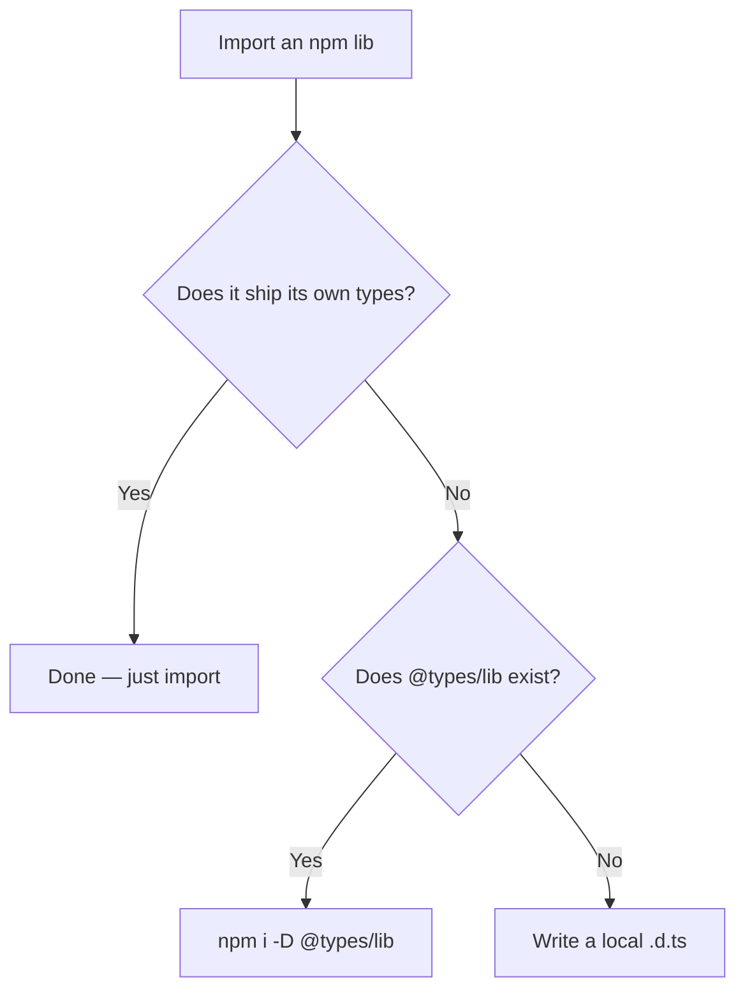

# TS and JS Interoperability — Middle Level

## Table of Contents

1. [Prerequisites](#prerequisites)
2. [Why Interop Matters](#why-interop-matters)
3. [When to Reach for Each Tool](#when-to-reach-for-each-tool)
4. [Deep Dive: allowJs and checkJs](#deep-dive-allowjs-and-checkjs)
5. [Deep Dive: JSDoc as a Type System](#deep-dive-jsdoc-as-a-type-system)
6. [Deep Dive: Declaration Files](#deep-dive-declaration-files)
7. [Deep Dive: Ambient Declarations and declare](#deep-dive-ambient-declarations-and-declare)
8. [Deep Dive: Module Interop](#deep-dive-module-interop)
9. [Real Migration Scenarios](#real-migration-scenarios)
10. [Suppression Directives in Practice](#suppression-directives-in-practice)
11. [Working with @types Packages](#working-with-types-packages)
12. [Configuration Recipes](#configuration-recipes)
13. [Anti-Patterns](#anti-patterns)
14. [Middle Checklist](#middle-checklist)
15. [Summary](#summary)
16. [Further Reading](#further-reading)

---

## Prerequisites

- Comfortable converting a simple JS file to TS and configuring a `tsconfig.json`.
- Understands `strict` mode and basic types: interfaces, unions, generics.
- Has used npm packages and understands `package.json` `dependencies` vs `devDependencies`.
- Knows the difference between CommonJS (`require`) and ES Modules (`import`).

---

## Why Interop Matters

Most teams do not get to start from a blank slate. They inherit:

- A large JavaScript codebase that works in production and cannot be paused for a rewrite.
- Dozens of npm dependencies, some of which ship types and some of which do not.
- Build tooling (webpack, Babel, esbuild, Vite) already wired for JavaScript.

Interoperability is what makes TypeScript adoption a **business-viable** decision instead of a risky rewrite. The TypeScript team designed the language specifically so that:

1. **Migration is incremental.** You convert one file, ship it, and the rest of the JS keeps working.
2. **The ecosystem is reusable.** You don't lose access to npm; you layer types on top of it.
3. **Safety is gradual.** You can start with loose checking and tighten it over months.

Without interop, every team would face an all-or-nothing choice. With it, the cost of trying TypeScript on a single module is nearly zero, which is the entire reason TypeScript "won" in the JS ecosystem.

### The cost-of-safety curve

```typescript
// Stage 0: plain JS, no checking — zero safety, zero friction
function tax(amount) { return amount * 0.2; }

// Stage 1: // @ts-check + JSDoc — safety without renaming files
// @ts-check
/** @param {number} amount @returns {number} */
function tax1(amount) { return amount * 0.2; }

// Stage 2: rename to .ts, add annotations — full native typing
function tax2(amount: number): number { return amount * 0.2; }

// Stage 3: strict mode on, no implicit any — maximum safety
```

Each stage buys more safety at a slightly higher friction cost. Interop lets a team sit at *any* stage, even different stages in different folders, at the same time.

---

## When to Reach for Each Tool

| Situation | Right tool |
|-----------|-----------|
| Existing JS project, want to start typing | `allowJs` + `checkJs` (or `// @ts-check`) |
| A single risky JS file you want checked | `// @ts-check` at the top |
| A JS file you must skip for now | `// @ts-nocheck` |
| Untyped npm dependency, types exist | `npm i -D @types/<lib>` |
| Untyped npm dependency, no types exist | hand-written `.d.ts` / `declare module` |
| Global injected by `<script>` or runtime | ambient `declare const` / `declare global` |
| CommonJS default-import error | `esModuleInterop: true` |
| Slow build from many dependency types | `skipLibCheck: true` |
| One wrong line you've verified is safe | `// @ts-expect-error` with a reason |

---

## Deep Dive: allowJs and checkJs

`allowJs` and `checkJs` are independent switches with a dependency relationship: `checkJs` requires `allowJs`.

```json
{
  "compilerOptions": {
    "allowJs": true,   // .js files are part of the program and can be emitted
    "checkJs": true,   // .js files are type-checked (needs allowJs)
    "outDir": "dist",
    "strict": true
  },
  "include": ["src"]
}
```

### What `allowJs` does

- Includes `.js`/`.jsx` files in the compilation graph.
- Lets `.ts` files `import` from `.js` files (and vice versa).
- Emits the `.js` to `outDir` (transpiling JSX, downleveling syntax to `target`).

### What `checkJs` adds

With `checkJs`, TypeScript runs the **same type checker** over your JS, using:

- **Type inference** from literals and control flow.
- **JSDoc comments** as explicit type annotations.
- **Imported types** from `.ts`/`.d.ts`/`@types`.

```typescript
// @ts-check on a single file behaves like checkJs for that file only.
// Granular control is the key benefit: you can turn checking on
// file by file as you fix each one, instead of fixing the whole repo.
```

### Granular overrides

| Directive | Effect |
|-----------|--------|
| `// @ts-check` | Force-check this `.js` file even if `checkJs` is off |
| `// @ts-nocheck` | Skip this file even if `checkJs` is on |
| `// @ts-expect-error` | Expect (and require) an error on the next line |
| `// @ts-ignore` | Suppress any error on the next line |

A practical migration uses `checkJs: false` globally and `// @ts-check` per file, flipping to `checkJs: true` only once most files pass.

---

## Deep Dive: JSDoc as a Type System

JSDoc lets you express almost the entire TypeScript type system inside `.js` comments. This is invaluable when you cannot rename files yet (e.g., a build pipeline that only handles `.js`).

```typescript
// @ts-check

/**
 * @typedef {Object} Product
 * @property {string} id
 * @property {string} name
 * @property {number} price
 * @property {string[]} [tags]   // optional property
 */

/**
 * @param {Product} product
 * @param {number} quantity
 * @returns {number}
 */
function lineTotal(product, quantity) {
  return product.price * quantity;
}

lineTotal({ id: "1", name: "Pen", price: 2 }, 3); // OK -> 6
```

### Common JSDoc constructs

```typescript
// Importing a type from another module
/** @type {import("./types").User} */
let currentUser;

// Generics with @template
/**
 * @template T
 * @param {T[]} arr
 * @returns {T | undefined}
 */
function first(arr) { return arr[0]; }

// Casting with inline JSDoc
const el = /** @type {HTMLInputElement} */ (document.getElementById("name"));
el.value = "typed!";

// Union types
/** @type {string | number} */
let id;

// Function type
/** @type {(a: number, b: number) => number} */
let combine;
```

### When JSDoc is the right call

- You ship `.js` directly (no compile step) but want editor type checks.
- Your bundler does not process `.ts` but you still want CI to catch type errors via `tsc --checkJs --noEmit`.
- You want types in a config file (e.g., `webpack.config.js`) without converting it.

---

## Deep Dive: Declaration Files

A `.d.ts` file is the contract between JavaScript implementations and TypeScript consumers. There are three flavors:

### 1. Module declaration (matches a JS file)

```typescript
// currency.js exists; currency.d.ts describes it
export declare function format(amount: number, code: string): string;
export declare const SUPPORTED: readonly string[];
```

### 2. Ambient module declaration (for a package)

```typescript
// declares an entire npm module by name
declare module "untyped-charts" {
  export interface ChartOptions {
    width: number;
    height: number;
  }
  export function render(el: HTMLElement, options: ChartOptions): void;
  const _default: { version: string };
  export default _default;
}
```

### 3. Global declaration (no imports involved)

```typescript
// globals.d.ts — describes things on the global scope
declare global {
  interface Window {
    __APP_CONFIG__: { apiUrl: string };
  }
}
export {}; // makes this file a module so `declare global` is valid
```

### How TypeScript finds declarations

For `import x from "lib"`, TypeScript looks (roughly) in this order:

1. `lib`'s `package.json` `types`/`typings` field.
2. A bundled `lib/index.d.ts`.
3. `node_modules/@types/lib`.
4. Any `declare module "lib"` in your project's included files.
5. The `typeRoots`/`paths` settings in `tsconfig.json`.

---

## Deep Dive: Ambient Declarations and declare

"Ambient" means "exists in the environment, defined elsewhere." The `declare` keyword introduces ambient bindings that emit no code.

```typescript
// Global variable injected by an inline <script> at runtime
declare const __BUILD_HASH__: string;

// Global function from a CDN-loaded library
declare function gtag(command: string, ...args: unknown[]): void;

// Ambient namespace (older library style)
declare namespace MyLib {
  function init(key: string): void;
  interface Options { debug: boolean; }
}

// Augmenting an existing module (module augmentation)
import "express";
declare module "express-serve-static-core" {
  interface Request {
    requestId: string;
  }
}
```

### `declare` vs no `declare`

Inside a `.d.ts`, `declare` is often implicit. Inside a `.ts`, you must write `declare` to say "do not emit, just type."

```typescript
// In a .ts file:
declare const ENV: "dev" | "prod"; // emits nothing; trusts runtime
// vs
const ENV2 = "dev";                // emits real JS: const ENV2 = "dev";
```

---

## Deep Dive: Module Interop

The thorniest interop area is mixing CommonJS and ES Modules.

### The problem

CommonJS uses `module.exports = X`. ESM uses `export default X` and named exports. They are not the same shape, so importing a CJS module with ESM syntax can break.

```typescript
// A CommonJS module:
//   module.exports = function moment() { ... };

// Without esModuleInterop, this is required and ugly:
import * as moment from "moment";
// and `moment()` may error because a namespace isn't callable

// With esModuleInterop: true, this clean form works:
import moment from "moment";
moment().format();
```

### The two flags

| Flag | What it does |
|------|--------------|
| `esModuleInterop` | Emits helper code so CJS modules import like ESM; implies `allowSyntheticDefaultImports` |
| `allowSyntheticDefaultImports` | Only relaxes the *type checker* to allow default imports; does not change emit |

```json
{
  "compilerOptions": {
    "esModuleInterop": true,
    "allowSyntheticDefaultImports": true,
    "module": "ESNext",
    "moduleResolution": "bundler"
  }
}
```

### Rule of thumb

- Using `tsc` to emit and running on Node? Turn on `esModuleInterop`.
- Using a bundler that handles interop itself? `allowSyntheticDefaultImports` may be enough for type-checking.

---

## Real Migration Scenarios

### Scenario A: Express API, 200 JS files

1. Add `tsconfig.json` with `allowJs: true`, `checkJs: false`, `strict: false`.
2. Get a clean `tsc --noEmit` (no errors yet because nothing is checked).
3. Add `// @ts-check` to leaf utility files; fix errors with JSDoc.
4. Rename checked files to `.ts` one PR at a time.
5. Once 80% are `.ts`, flip `checkJs: true` and `strict: true`, fix the long tail.

```typescript
// Step 3 example: a leaf utility gets // @ts-check + JSDoc
// @ts-check
/**
 * @param {string} email
 * @returns {boolean}
 */
function isValidEmail(email) {
  return /^[^@]+@[^@]+\.[^@]+$/.test(email);
}
module.exports = { isValidEmail };
```

### Scenario B: React app with untyped components

```typescript
// LegacyChart.js has no types. Add a sibling .d.ts:
// LegacyChart.d.ts
import * as React from "react";
export interface LegacyChartProps {
  data: number[];
  color?: string;
}
declare const LegacyChart: React.FC<LegacyChartProps>;
export default LegacyChart;
```

Now `.tsx` files importing `LegacyChart` get full prop checking even though the component is still `.js`.

### Scenario C: Config files that must stay JS

```typescript
// @ts-check
/** @type {import("webpack").Configuration} */
const config = {
  entry: "./src/index.ts",
  mode: "production",
};
module.exports = config;
```

The config stays `.js` (the tooling requires it) but gets fully type-checked against webpack's own types.

---

## Suppression Directives in Practice

```typescript
// @ts-expect-error -- @types/legacy@2.1 omits the `flush` method (PR pending)
client.flush();

// AVOID: silent, rot-prone
// @ts-ignore
client.flush();

// @ts-nocheck at top of a file you can't fix yet (use sparingly)
```

### Policy recommendation

- Ban `// @ts-ignore` via ESLint (`@typescript-eslint/ban-ts-comment`).
- Require a description after `// @ts-expect-error`.
- Track suppressions; they are technical debt with a paper trail.

```json
// .eslintrc — enforce reasons and prefer expect-error
{
  "rules": {
    "@typescript-eslint/ban-ts-comment": ["error", {
      "ts-ignore": true,
      "ts-expect-error": "allow-with-description"
    }]
  }
}
```

---

## Working with @types Packages

```bash
# Install the lib and its community types
npm install dayjs
npm install --save-dev @types/dayjs   # (dayjs actually ships its own types)

# Check whether a lib already ships types before adding @types
npm view some-lib types typings
```

### Decision tree



### Version alignment

A stale `@types/*` is a frequent bug source. Keep major versions aligned:

```bash
npm ls react @types/react   # major versions should match
```

---

## Configuration Recipes

### Recipe 1: Gradual migration starter

```json
{
  "compilerOptions": {
    "allowJs": true,
    "checkJs": false,
    "strict": false,
    "noImplicitAny": false,
    "esModuleInterop": true,
    "skipLibCheck": true,
    "outDir": "dist"
  },
  "include": ["src"]
}
```

### Recipe 2: Fully migrated, strict

```json
{
  "compilerOptions": {
    "allowJs": false,
    "strict": true,
    "noImplicitAny": true,
    "esModuleInterop": true,
    "skipLibCheck": true,
    "moduleResolution": "bundler"
  }
}
```

### Recipe 3: JS-only project with type checking (no emit)

```json
{
  "compilerOptions": {
    "allowJs": true,
    "checkJs": true,
    "noEmit": true,
    "strict": true,
    "skipLibCheck": true
  },
  "include": ["src/**/*.js"]
}
```

---

## Anti-Patterns

| Anti-pattern | Why it's bad | Better |
|--------------|--------------|--------|
| `// @ts-ignore` everywhere | Hides real and future bugs | `// @ts-expect-error` + reason, or fix the type |
| `declare module "*";` catch-all | Makes every unknown import `any` | Type the specific modules you use |
| Casting `as User` on `fetch().json()` | No runtime guarantee | Validate with a schema |
| Wrong `@types` version | False type confidence | Align versions, or write your own `.d.ts` |
| Runtime code in `.d.ts` | Illegal / confusing | Keep `.d.ts` declarations-only |
| `any` to "fix" interop errors | Spreads `any` through the codebase | Use `unknown` + narrowing |

---

## Middle Checklist

- [ ] `allowJs` and `checkJs` understood as independent, dependent switches.
- [ ] JSDoc used to type files that cannot be renamed.
- [ ] Every untyped dependency has either `@types/*` or a local `.d.ts`.
- [ ] `esModuleInterop` configured to match the runtime/bundler.
- [ ] `// @ts-ignore` banned; `// @ts-expect-error` requires a reason.
- [ ] Migration proceeds leaf-first, file by file.

---

## Summary

- Interop turns TypeScript adoption from a rewrite into an incremental, low-risk process.
- `allowJs`/`checkJs` and `// @ts-check` give granular control over which JS gets checked.
- JSDoc expresses nearly the full type system inside `.js` files.
- `.d.ts` files, `declare`, and `@types/*` supply types for code TypeScript cannot see.
- Module interop (`esModuleInterop`) reconciles CommonJS and ESM import shapes.

**Next step:** Architecting incremental migration of *large* codebases (see `senior.md`).

---

## Further Reading

- [Handbook — Migrating from JavaScript](https://www.typescriptlang.org/docs/handbook/migrating-from-javascript.html)
- [Handbook — Type Checking JavaScript Files](https://www.typescriptlang.org/docs/handbook/intro-to-js-ts.html)
- [JSDoc Reference](https://www.typescriptlang.org/docs/handbook/jsdoc-supported-types.html)
- [Module Resolution](https://www.typescriptlang.org/docs/handbook/module-resolution.html)
