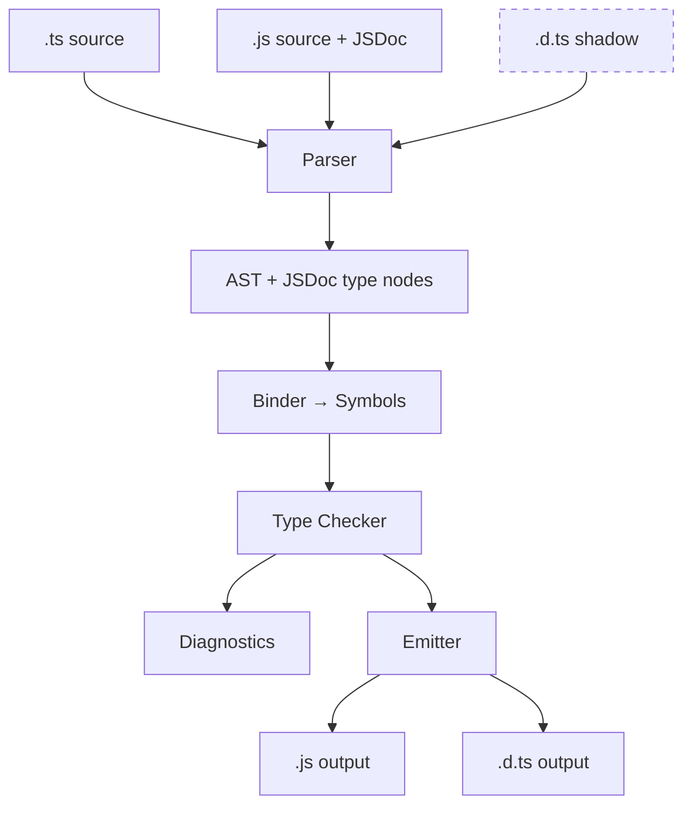
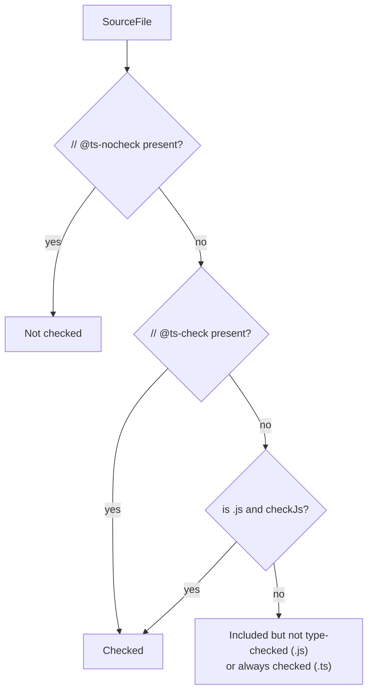
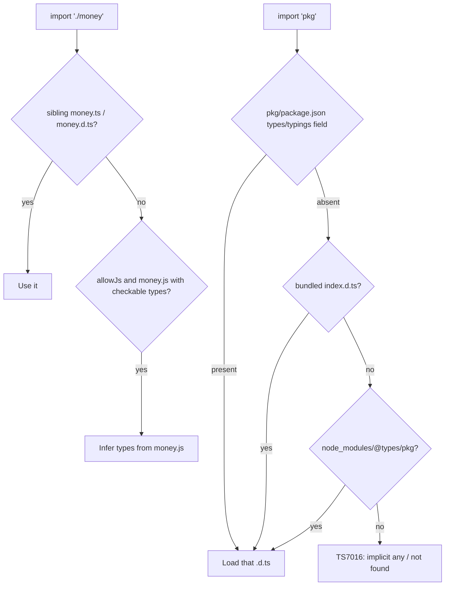
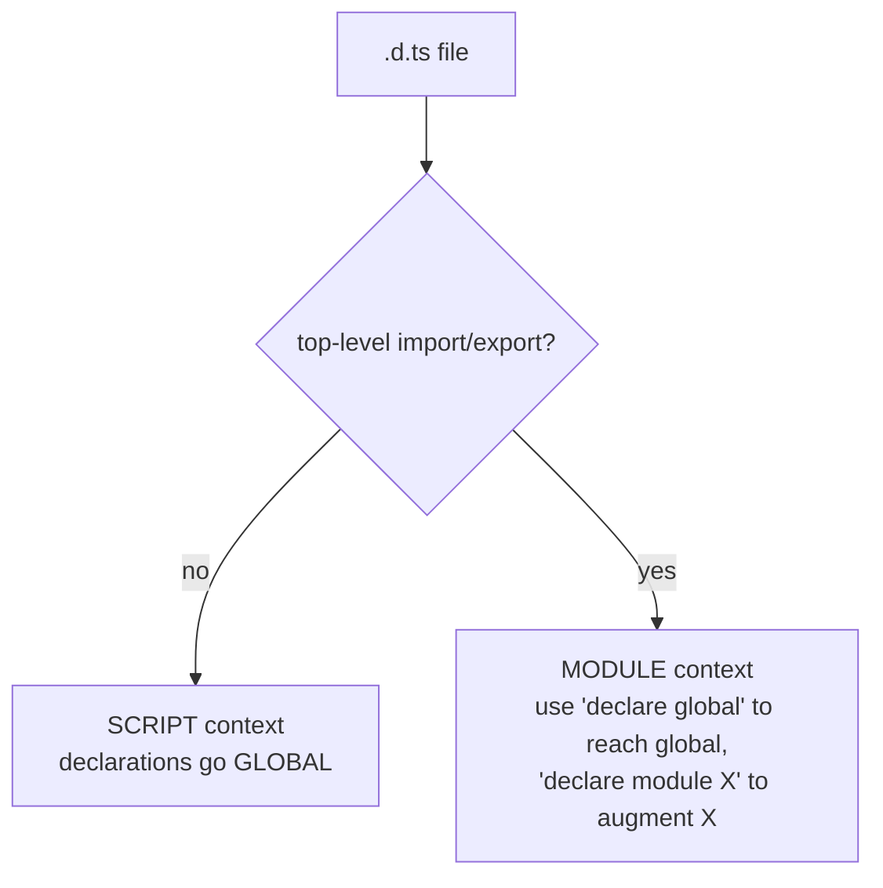
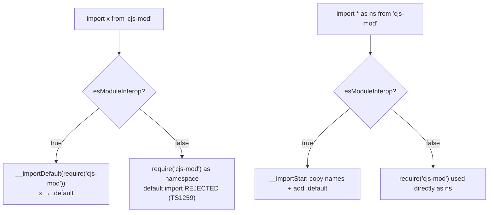
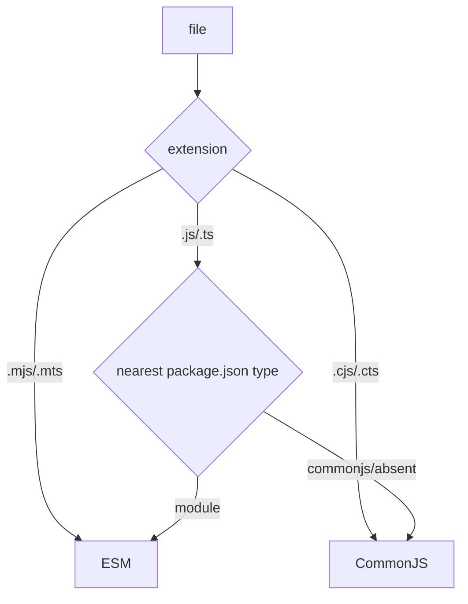
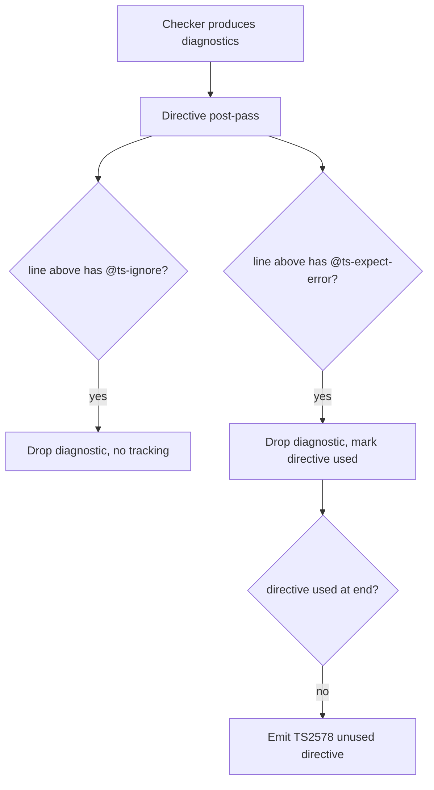

# TS and JS Interoperability — Under the Hood

## Table of Contents

1. [Overview and Mental Model](#overview-and-mental-model)
2. [How `allowJs` / `checkJs` Change the Program](#how-allowjs--checkjs-change-the-program)
3. [JSDoc Parsing Internals](#jsdoc-parsing-internals)
4. [Declaration File Emit and Consumption](#declaration-file-emit-and-consumption)
5. [`declare` and Ambient Declarations](#declare-and-ambient-declarations)
6. [Module Interop Emit: What `esModuleInterop` Generates](#module-interop-emit-what-esmoduleinterop-generates)
7. [Type-Only Imports and `verbatimModuleSyntax`](#type-only-imports-and-verbatimmodulesyntax)
8. [Module Resolution Across the Boundary](#module-resolution-across-the-boundary)
9. [The Two-Module-System Reality](#the-two-module-system-reality)
10. [Suppression Directive Mechanics](#suppression-directive-mechanics)
11. [Diagnosing Interop](#diagnosing-interop)
12. [Professional Pitfalls](#professional-pitfalls)
13. [`const enum` Across the Module Boundary](#const-enum-across-the-module-boundary)
14. [Summary](#summary)

---

## Overview and Mental Model

This section explains what *physically happens* inside the compiler and the runtime to make JavaScript and TypeScript work together. This is not migration strategy (that is `senior.md`) — this is the machinery: how `tsc` decides to include a `.js` file, how it reads JSDoc into the same type nodes as `.ts` syntax, how `.d.ts` files are emitted and resolved, what helper code `esModuleInterop` injects into the output, and how type-only imports vanish at emit.

The mental model to hold:

- **A `.ts` file is both a *type source* and a *runtime source*.** The checker reads its types; the emitter produces JavaScript.
- **A `.js` file (under `allowJs`) is a *type source* whose types are *inferred*, plus a runtime source that is mostly passed through.** With `checkJs`/`// @ts-check`, its inferred and JSDoc types are validated like any `.ts` file.
- **A `.d.ts` file is a *type-only shadow* of runtime JavaScript.** It contributes symbols to the type checker and emits **nothing**. The runtime `.js` it describes lives separately and is never verified against it.

The single most important internal fact: **the type checker does not care where a type node came from.** A type written as TS syntax (`x: number`), a type written in JSDoc (`@param {number} x`), and a type pulled from a `.d.ts` all become the *same kind of AST node* and the *same kind of `Type` object* inside the checker. Interop is, at the implementation level, the art of feeding type nodes to the checker from non-`.ts` sources.



The dashed box (`.d.ts`) reaches the checker but never reaches the emitter as output — it only *produces* output indirectly when you ask `tsc` to generate declarations from `.ts`/`.js`.

---

## How `allowJs` / `checkJs` Change the Program

The **Program** is `tsc`'s in-memory set of every source file participating in a compilation. By default it contains only `.ts`/`.tsx` files plus any `.d.ts` it resolves. `allowJs` and `checkJs` change *which files enter the Program* and *how much checking they receive*.

### What `allowJs` physically does

When `allowJs: true`:

1. The file-inclusion logic adds `.js`/`.jsx` files matched by `include`/`files` to the Program.
2. Module resolution is now allowed to **resolve an import to a `.js` file** (previously it would only land on `.ts`/`.d.ts`).
3. The emitter will **read and re-emit** those `.js` files (downleveling syntax to `target`, transpiling JSX), so they appear in `outDir`.

```jsonc
{ "compilerOptions": { "allowJs": true } }
```

```bash
# Prove a .js file is now part of the Program
npx tsc --listFiles | grep "\.js$"
```

Without `allowJs`, importing `./util.js` from a `.ts` file fails resolution (TS2307 / TS6059) because the resolver is not permitted to consider `.js` candidates as inputs.

### What `checkJs` adds

`checkJs: true` (which requires `allowJs`) flips a per-`SourceFile` flag, `checkJsDirective`, to "checked" for every `.js` file. The checker then runs the **same** type-checking pass over them, drawing types from:

- **Inference** from literals, assignments, and control flow.
- **JSDoc** comments parsed into type nodes (next section).
- **Imported types** from `.ts`/`.d.ts`/`@types`.

### Where `// @ts-check` / `// @ts-nocheck` hook in

These are not preprocessor tricks — they are read during **parsing** and stored on the `SourceFile` as comment directives. At check time, for each `.js` file, the checker computes an effective "should I check this file?" decision:

```text
effectiveCheck(jsFile) =
    hasComment("@ts-nocheck")  -> false   (always wins)
  : hasComment("@ts-check")    -> true
  : compilerOptions.checkJs    -> true/false
```

So `// @ts-check` is literally "set this one file's `checkJs` to true," and `// @ts-nocheck` is "force it false." For `.ts` files, `// @ts-nocheck` also works (it suppresses checking of that `.ts` file), but `// @ts-check` is a no-op there because `.ts` is always checked.



| File type | `checkJs` off, no directive | `// @ts-check` | `// @ts-nocheck` |
|-----------|----------------------------|----------------|-------------------|
| `.ts` | Checked | Checked (no-op) | **Not** checked |
| `.js` (allowJs) | Included, not checked | Checked | Not checked |

---

## JSDoc Parsing Internals

The reason JSDoc "just works" is that the TypeScript **scanner and parser** treat JSDoc comments as a first-class grammar, not as opaque text. When the parser encounters a `/** ... */` block immediately before a declaration, it parses the tags into **JSDoc AST nodes** and attaches them to the declaration's `.jsDoc` array.

Crucially, JSDoc *type expressions* (`{number}`, `{string[]}`, `{import("./x").Y}`) are parsed by the **same type-expression parser** used for `.ts` annotations. A `@param {number} x` produces a `JSDocParameterTag` whose `typeExpression` wraps a `KeywordTypeNode` for `number` — the identical node the parser would build for `x: number` in a `.ts` file.

```typescript
// area.js
// @ts-check
/**
 * @param {number} width
 * @param {number} height
 * @returns {number}
 */
function area(width, height) {
  return width * height;
}
```

Internally, when the checker resolves the type of the `width` parameter, it calls `getTypeFromTypeNode` on the JSDoc `typeExpression`'s inner node — exactly as it would for a TS annotation. **The checker has no branch that says "this came from JSDoc."** That is why every checker feature (assignability, narrowing, generics, conditional types) works identically in JSDoc.

### Tag-to-construct mapping

| JSDoc tag | TS equivalent | Resulting node |
|-----------|---------------|----------------|
| `@param {T} x` | `x: T` parameter type | `JSDocParameterTag` → type node |
| `@returns {T}` | function return `: T` | `JSDocReturnTag` → type node |
| `@type {T}` | `: T` on a variable | `JSDocTypeTag` → type node |
| `@typedef {Object} Foo` + `@property` | `interface Foo { ... }` / `type Foo = ...` | `JSDocTypedefTag` → declaration symbol |
| `@template T` | `<T>` generic param | `JSDocTemplateTag` → type parameter |
| `@type {import("./m").X}` | `import("./m").X` | import-type node, triggers module resolution |
| `/** @type {T} */ (expr)` | `expr as T` / `<T>expr` | cast applied to the parenthesized expression |

```typescript
// A @typedef becomes a real type symbol the binder registers.
/**
 * @typedef {Object} Product
 * @property {string} id
 * @property {number} price
 */

/** @param {Product} p */
function priceOf(p) {
  return p.price;   // checker resolves p as the synthesized Product type
}
```

The binder registers `Product` as a type symbol in the file's symbol table, indistinguishable (to later consumers) from an `interface Product` declared in TS syntax. `import("./types").User` inside JSDoc even kicks off **module resolution** during checking, pulling another file into the Program if needed.

---

## Declaration File Emit and Consumption

A `.d.ts` is the type checker's view of runtime JS, serialized. Two separate mechanisms matter: **emit** (producing `.d.ts`) and **consumption** (resolving an import to a `.d.ts`).

### Emit: `declaration: true`

With `declaration: true`, after the check phase the emitter runs a **declaration emitter** that walks each `.ts`/`.js` source and writes a parallel `.d.ts` containing only the *externally visible types*, with all implementations and private members removed.

```typescript
// src/money.ts  (input)
export function format(amount: number, code: string): string {
  const symbol = code === "USD" ? "$" : code;
  return `${symbol}${amount.toFixed(2)}`;
}
export const SUPPORTED = ["USD", "EUR"] as const;
```

```typescript
// dist/money.d.ts  (emitted)
export declare function format(amount: number, code: string): string;
export declare const SUPPORTED: readonly ["USD", "EUR"];
```

Notice the emitter **inserted `declare`** and **erased the function body**. The `as const` literal type is preserved because the *type* is the product; the runtime constant moves to the emitted `money.js`. If a type is not explicitly annotated and the inferred type is *not nameable* (e.g., references a non-exported type), declaration emit produces error **TS4023/TS4025** — the declaration emitter cannot reference a symbol that won't exist in the `.d.ts`.

```bash
# Produce .d.ts alongside .js
npx tsc --declaration --emitDeclarationOnly   # types only, no .js
```

### Consumption: resolving an import to its `.d.ts`

When a `.ts` file imports `./money` (or a package), the resolver looks for the *type* file in this order (roughly):



The key internal point: a `.d.ts` is **type-only** — resolving an import to `money.d.ts` contributes symbols to the checker but **emits no module load on its own**. The actual runtime `require("./money")` / `import("./money")` is governed entirely by the emitted JavaScript, which points at `money.js`. The `.d.ts` and the `.js` are *two parallel artifacts*; nothing at compile time verifies they agree.

---

## `declare` and Ambient Declarations

"Ambient" means "exists in the environment; defined elsewhere." The `declare` modifier tells the **binder** to register a symbol with **no backing implementation** and instructs the **emitter** to produce nothing for it.

```typescript
// In a .ts file:
declare const ENV: "dev" | "prod";   // binder: symbol ENV (value+type), emitter: nothing
const REAL = "dev";                   // binder: symbol REAL, emitter: const REAL = "dev";
```

Inside a `.d.ts`, **`declare` is implicit** — the whole file is ambient, so `export function f(): void;` is already declaration-only. Inside a `.ts`, you must write `declare` explicitly to get the same "type-only, no emit" effect.

### How the binder treats ambient symbols

The binder attaches an `Ambient` flag to ambient declarations. Later phases use this flag to:

- Skip emit for the symbol.
- Allow it to be referenced as if it exists at runtime (the checker trusts the declaration).
- Merge it into the correct scope (global vs module).

### Global vs module augmentation

The presence (or absence) of a top-level `import`/`export` decides scope:

```typescript
// globals.d.ts — NO top-level import/export → this is a SCRIPT → declarations are GLOBAL
declare const __BUILD_HASH__: string;
interface Window { __APP_CONFIG__: { apiUrl: string }; }
```

```typescript
// augment.d.ts — HAS export → this is a MODULE → use declare global to reach global scope
export {};                         // forces module context
declare global {
  interface Window { analytics: { track(e: string): void }; }
}
```

```typescript
// module-augment.d.ts — augment an existing module's types
import "express";
declare module "express-serve-static-core" {
  interface Request { requestId: string; }   // merged into Express's Request
}
```

The binder performs **declaration merging**: the augmented `interface Request` is merged with the library's own `Request` interface because interface declarations with the same name in the same module scope merge. `declare module "express-serve-static-core"` *opens* that module's scope and adds members to it.



**Trap:** adding an `export {}` to a previously-global `globals.d.ts` silently turns all its `declare`s into module-local symbols — globals vanish everywhere. The cause is purely "did the binder see a top-level export?"

---

## Module Interop Emit: What `esModuleInterop` Generates

This is the most misunderstood interop flag because it changes the **emitted JavaScript**, not just the types. The problem it solves: CommonJS modules use `module.exports = X`, but ESM `import X from "m"` expects a `.default` property. They do not match.

### The CJS `default` problem

```javascript
// legacy CommonJS module: cjs-lib.js
module.exports = function greet(name) { return "Hi " + name; };
```

An ESM consumer writes `import greet from "cjs-lib"`. Under ESM semantics, `greet` should be `module.exports.default`, but the CJS module has **no `.default`** — `module.exports` *is* the function. Without help, `greet` would be `undefined` (or you'd be forced into `import * as greet`, and a namespace object isn't callable).

### Without `esModuleInterop`

```typescript
// input (esModuleInterop: false)
import * as greet from "cjs-lib";
import { readFile } from "fs";
```

```javascript
// emitted JS (module: commonjs)
"use strict";
Object.defineProperty(exports, "__esModule", { value: true });
const greet = require("cjs-lib");        // namespace = the function; calling greet() works by luck
const fs_1 = require("fs");              // named: fs_1.readFile
```

Here a *namespace import* is mapped straight to `require`, and you must access named members as `fs_1.readFile`. Default imports of CJS are rejected by the checker (TS1259).

### With `esModuleInterop: true`

The emitter injects two helper functions, `__importDefault` and `__importStar`, and routes imports through them:

```typescript
// input (esModuleInterop: true)
import greet from "cjs-lib";        // default import
import * as fs from "fs";           // namespace import
```

```javascript
// emitted JS (module: commonjs)
"use strict";
var __importDefault = (this && this.__importDefault) || function (mod) {
  return (mod && mod.__esModule) ? mod : { "default": mod };
};
var __importStar = (this && this.__importStar) || function (mod) {
  if (mod && mod.__esModule) return mod;
  var result = {};
  for (var k in mod) if (k !== "default" && Object.prototype.hasOwnProperty.call(mod, k))
    result[k] = mod[k];
  result["default"] = mod;
  return result;
};
Object.defineProperty(exports, "__esModule", { value: true });
const cjs_lib_1 = __importDefault(require("cjs-lib"));
const fs = __importStar(require("fs"));
// usage compiles to:
cjs_lib_1.default("Ada");    // default import → .default, synthesized by the helper
fs.readFile;                 // namespace members preserved; fs.default also added
```

`__importDefault` wraps a non-ESM module so `.default` points at the whole `module.exports`. `__importStar` builds a *fresh* namespace object copying named members and adding a `.default`. This is exactly what real ESM↔CJS interop does at the Node level, which is why turning on `esModuleInterop` makes `tsc`-emitted code behave like native ESM.



`importHelpers: true` plus the `tslib` package replaces these inlined helpers with imports from `tslib`, so they are not duplicated in every file.

---

## Type-Only Imports and `verbatimModuleSyntax`

Type-only imports exist because an `import` that is used *only as a type* must not survive to the emitted JS — otherwise you load a module at runtime for no reason (and risk loading a module that has no runtime side you want, or causes a cycle).

### Elision: the default behavior

By default the emitter performs **import elision**: after the checker marks each imported binding as "used as a value" or "used only as a type," any import whose bindings are all type-only is *dropped* from the output.

```typescript
// input
import { User } from "./types";        // User used only as a type
import { saveUser } from "./db";       // saveUser called → value
export function persist(u: User) {
  saveUser(u);
}
```

```javascript
// emitted JS (module: commonjs)
"use strict";
Object.defineProperty(exports, "__esModule", { value: true });
exports.persist = persist;
const db_1 = require("./db");          // ./types import ELIDED — User was type-only
function persist(u) {
  (0, db_1.saveUser)(u);
}
```

The `./types` `require` is gone entirely. The decision is per-binding: in `import { A, B }` where `A` is a value and `B` is type-only, the emitter keeps `require` but the named usage of `B` does not appear.

### `import type`: explicit and guaranteed

`import type` tells the parser this import is type-only, so it is *always* elided and may **never** be used as a value (using it as a value is a compile error). It also documents intent and prevents accidental value usage that would resurrect the runtime import.

```typescript
import type { User } from "./types";   // guaranteed elided; cannot be used as a value
```

### `verbatimModuleSyntax`: stop being clever

`verbatimModuleSyntax: true` (the modern successor to `importsNotUsedAsValues`/`isolatedModules` heuristics) tells the emitter: **do not elide anything based on usage analysis.** Every `import`/`export` is emitted *verbatim* unless it is written as `import type` / `export type`. This makes emit predictable for single-file transpilers (Babel, esbuild, swc) that cannot do cross-file type analysis.

```typescript
// input (verbatimModuleSyntax: true)
import { User } from "./types";        // ERROR if module is CJS-emitting: would emit a runtime require
import type { Admin } from "./roles";  // fine: explicitly type-only → elided
import { saveUser } from "./db";
```

```javascript
// emitted JS (module: esnext, verbatimModuleSyntax: true)
import { User } from "./types";        // EMITTED verbatim — runtime import kept!
import { saveUser } from "./db";
export function persist(u) { saveUser(u); }
// import type { Admin } was dropped; type-only is the ONLY thing elided
```

With `verbatimModuleSyntax`, the rule is mechanical: `import type` → elided; everything else → kept exactly as written. Under it, you must annotate type-only imports yourself, which is what makes the emit deterministic without a type checker.

| Mode | Elision rule |
|------|--------------|
| Default | Checker analyzes usage; type-only imports auto-elided |
| `import type` X | Always elided; value use is an error |
| `verbatimModuleSyntax` | Only `import type`/`export type` elided; all else emitted verbatim |

---

## Module Resolution Across the Boundary

Finding the *types* for a JavaScript package is a resolution problem distinct from finding the *runtime* file. `tsc` runs an algorithm that mirrors Node's but layers type-file lookup on top.

For `import _ from "lodash"`:

```text
1. node_modules/lodash/package.json
   - "exports" with a "types"/"import"/"require" condition?  → use that .d.ts
   - else "types" / "typings" field?                          → use that .d.ts
   - else bundled "index.d.ts" next to "main"?                → use it
2. node_modules/@types/lodash  (DefinitelyTyped)
   - "types"/"typings" or index.d.ts
3. typeRoots entries (default: every node_modules/@types up the tree)
4. A local `declare module "lodash"` in an included .d.ts
5. Fail → TS7016 (implicitly 'any') under noImplicitAny, else silent any
```

```jsonc
{
  "compilerOptions": {
    "typeRoots": ["./node_modules/@types", "./types"],
    "types": ["node"]   // restrict GLOBAL @types auto-loading to this whitelist
  }
}
```

### Conditional `exports` and the `types` condition

Modern packages use a conditional `exports` map. `tsc` evaluates the **`types`** condition (and, under `NodeNext`, the import/require conditions matching the resolution mode):

```jsonc
// node_modules/some-lib/package.json
{
  "exports": {
    ".": {
      "types": "./dist/index.d.ts",
      "import": "./dist/index.mjs",
      "require": "./dist/index.cjs"
    }
  }
}
```

Under `moduleResolution: "node16"/"nodenext"/"bundler"`, `tsc` honors this `exports` map and picks the `types` entry. Under legacy `node`, `exports` is **ignored** — a frequent cause of "types resolve in the editor but not in CI" when the two use different `moduleResolution` settings.

```bash
# See exactly how tsc resolved a package's types
npx tsc --traceResolution 2>&1 | grep -A3 "some-lib"
```

---

## The Two-Module-System Reality

Node decides whether a file is **CommonJS** or **ES Module** *per file*, and `tsc` under `NodeNext` mirrors that decision exactly so its emit and resolution stay consistent with the runtime.

### How Node (and `tsc`) classify a file

```text
.mjs / .mts   → ESM       (always)
.cjs / .cts   → CommonJS  (always)
.js / .ts     → depends on the nearest package.json "type":
                  "type": "module"     → ESM
                  "type": "commonjs"   → CommonJS
                  (absent)             → CommonJS (Node default)
```



Under `module: "nodenext"`, `tsc` computes each file's **format** with this same rule and emits accordingly: an ESM-format `.ts` emits `import`/`export`; a CJS-format `.ts` emits `require`/`exports`. This is why `NodeNext` requires you to write **emitted-extension** specifiers (`./db.js`) — the resolver and Node both need them in ESM.

### The dual-package hazard, mechanically

A package shipping *both* a CJS build and an ESM build can be loaded **twice** in one process — once as CJS (`require`) and once as ESM (`import`) — producing **two distinct module instances**. Any module-level state (a singleton, a registry, an `instanceof` check) then breaks: `instanceof` fails because the two copies have different class identities even though they came from the same source.

```text
import  → dist/index.mjs   →  Class A (instance #1)
require → dist/index.cjs   →  Class A (instance #2)   ← different identity!
new (from mjs) instanceof (class from cjs)  → false
```

`tsc` cannot prevent this — it is a runtime packaging reality. The `types` you resolve may describe a single logical shape, but the *runtime* may instantiate two copies. This is why singletons and `instanceof`-based APIs are fragile across the CJS/ESM boundary.

---

## Suppression Directive Mechanics

`@ts-ignore`, `@ts-expect-error`, and `@ts-nocheck` are processed by the checker as **comment directives** recorded on the `SourceFile` during parsing. Their handling is entirely inside the diagnostic-reporting stage.

### How they are processed

After the checker produces the list of diagnostics for a file, a post-pass walks them against the file's directive comments:

```text
For each diagnostic D on line L:
  if line L-1 has // @ts-ignore         → drop D (suppressed)
  if line L-1 has // @ts-expect-error   → drop D AND mark that directive "used"
After the pass:
  for each // @ts-expect-error directive NOT marked "used"
      → emit TS2578: "Unused '@ts-expect-error' directive."
```

This is exactly why `@ts-expect-error` **errors when there is no error**: the directive expects to suppress *something*; if it suppressed nothing, it was unused, and the post-pass reports TS2578. `@ts-ignore` has no such bookkeeping — it silently drops whatever diagnostic happens to be on the next line, including future, unrelated ones.

```typescript
// @ts-expect-error  -- the .d.ts is wrong; doThing takes no args at runtime
api.doThing("extra");          // if this line later type-checks cleanly → TS2578 here

// @ts-ignore
api.doThing("extra");          // silently swallows ANY future error on this line
```

`// @ts-nocheck` is read at parse time and sets the file's effective check to false (Section 2) — it is a *whole-file* switch, evaluated before checking, not a per-line diagnostic filter.



---

## Diagnosing Interop

The same `tsc` flags that diagnose installs diagnose interop, plus reading the emitted JS directly.

```bash
# Which files actually entered the Program (did your .js get included? did a .d.ts win?)
npx tsc --listFiles

# How a specific import resolved to a TYPE file (or didn't)
npx tsc --traceResolution 2>&1 | grep -A4 "express"

# The fully-merged config — confirm allowJs/checkJs/esModuleInterop/moduleResolution
npx tsc --showConfig

# Inspect the emitted helpers and elision decisions
npx tsc --outDir /tmp/out && grep -n "__importDefault\|__importStar\|require(" /tmp/out/index.js
```

To verify type-only elision actually happened, emit and inspect:

```bash
# If a "type-only" import still appears as require(...) in output,
# something is using it as a value, or verbatimModuleSyntax kept it.
npx tsc --module commonjs --outDir /tmp/out
grep -n "require(\"./types\")" /tmp/out/*.js   # should be EMPTY if ./types was type-only
```

```bash
# Confirm which module format NodeNext assigned to a file
# (CJS files emit require/exports; ESM files emit import/export)
npx tsc --module nodenext --outDir /tmp/out && head -3 /tmp/out/index.js
```

| Symptom | Diagnostic | Likely internal cause |
|---------|-----------|------------------------|
| `.js` not type-checked | `--listFiles` shows it; no errors | `checkJs`/`// @ts-check` off |
| `.js` not even included | `--listFiles` omits it | `allowJs` off |
| Default import is `undefined` at runtime | inspect emitted JS | `esModuleInterop` off / no `__importDefault` |
| Types found in editor, not CI | `--traceResolution` differs | different `moduleResolution` (legacy ignores `exports`) |
| Type-only import still in output | `grep require` in emit | binding used as a value, or `verbatimModuleSyntax` |
| Unexpected globals everywhere | `--listFiles` shows a script `.d.ts` | a `.d.ts` with no top-level export went global |

---

## Professional Pitfalls

### Pitfall 1: Default-Import Mismatch Without `esModuleInterop`

```typescript
import express from "express";   // TS1259 without esModuleInterop
```

`express` is `export =` (CommonJS). Without `esModuleInterop`, no `__importDefault` helper is emitted, so even if the checker allowed it, `express.default` would be `undefined` at runtime. The flag fixes *both* the type rule and the emit. Turning on only `allowSyntheticDefaultImports` silences the *checker* but does **not** emit the helper — the build type-checks yet crashes at runtime. Match the type relaxation with the emit helper.

### Pitfall 2: The `.d.ts` Promises a Shape the Runtime Doesn't Have

```typescript
// loader.d.ts says:
declare function loadUser(): { isAdmin: boolean };
// runtime loader.js actually returns isAdmin as the STRING "false"
if (loadUser().isAdmin) { /* "false" is truthy → wrong branch */ }
```

Nothing at compile time checks `loader.d.ts` against `loader.js` — they are parallel artifacts (Section 4). A wrong `.d.ts` is an unchecked assertion that becomes a real bug. Validate security-relevant runtime values with a schema regardless of declared types.

### Pitfall 3: Ambient Global Leaking Everywhere

```typescript
// helpers.d.ts (no top-level import/export → SCRIPT → global)
type Id = string | number;   // now `Id` is a GLOBAL type, colliding project-wide
```

Because the file has no top-level `export`, the binder placed `Id` in global scope. Any other file's `Id` now conflicts or is silently shadowed. Add `export {}` to make the file a module — but remember that also turns any intended globals into module-locals (Section 5).

### Pitfall 4: Mismatched `moduleResolution` Hiding `exports`

A package that exposes types only via `exports.types` resolves under `node16`/`nodenext`/`bundler` but **not** under legacy `node`, because legacy resolution ignores `exports`. Editors often default to a modern resolution while a stale CI `tsconfig` uses `node` — types appear in the editor and vanish in CI. Pin `moduleResolution` and verify with `--traceResolution`.

### Pitfall 5: `verbatimModuleSyntax` Surfacing Accidental Runtime Imports

After enabling `verbatimModuleSyntax`, an `import { SomeType } from "./big-module"` that you *thought* was type-only is now emitted verbatim as a runtime import — pulling in (and executing) `big-module` at load time, possibly creating a cycle. Convert it to `import type` so the emitter elides it.

---

## `const enum` Across the Module Boundary

`const enum` is the sharpest interop edge in the emit pipeline. A normal `enum` emits a runtime object; a `const enum` emits **nothing** and is *inlined* at every use site.

```typescript
// input
const enum Color { Red, Green, Blue }
const c = Color.Green;
```

```javascript
// emitted JS — the enum object is GONE; the value is inlined
const c = 1 /* Color.Green */;
```

This is great for size but breaks across module boundaries:

- **Across packages:** if `Color` lives in a published package and a consumer references `Color.Green`, the inlining requires the *declaration* to be present at the consumer's compile time. If the package ships only a `.d.ts` for the const enum and a different build inlines it, versions can drift — the inlined number is frozen at the consumer's compile time and won't track changes to the enum.
- **With `isolatedModules` / single-file transpilers (Babel, esbuild):** these tools transpile one file at a time and **cannot inline** a `const enum` whose declaration is in another file — there is no cross-file information. `tsc` reports TS2748, and the tools either error or silently emit a broken reference.
- **`preserveConstEnums: true`** forces `tsc` to also emit the runtime object, defeating the size benefit but restoring cross-boundary safety.

```text
const enum across a module boundary:
  tsc whole-program build  → can inline (sees the declaration)
  isolatedModules / esbuild/babel → CANNOT inline → error or broken ref
  preserveConstEnums: true → emits the object too → safe but no size win
```

The internal reason: inlining is a **checker-driven emit transformation** that needs the enum's resolved member values, which only a cross-file type checker has. Single-file transpilers and ambient-only consumers lack that information. For library code crossing the boundary, prefer a plain `enum`, a `const` object with `as const`, or a union of literals.

---

## Summary

- Interop is the compiler treating `.js` files as *type sources* (inferred + JSDoc) and `.d.ts` files as *type-only shadows* of runtime JS; the checker treats a type identically regardless of whether it came from `.ts` syntax, JSDoc, or a `.d.ts`.
- `allowJs` adds `.js` to the Program and lets imports resolve to it; `checkJs`/`// @ts-check` flip the per-file check decision; `// @ts-nocheck` always wins.
- JSDoc type expressions are parsed into the *same* type nodes as TS annotations, so every checker feature works in `.js`; `@typedef` registers a real type symbol.
- `.d.ts` emit inserts `declare` and erases bodies; consumption resolves an import to a sibling/`types`-field/`@types` declaration, and nothing verifies the `.d.ts` against the real `.js`.
- `esModuleInterop` injects `__importDefault`/`__importStar` into the emitted JS to reconcile the CJS-no-`.default` problem; type-only imports are elided unless `verbatimModuleSyntax` keeps everything but `import type`.
- Under `NodeNext`, `tsc` classifies each file as CJS or ESM exactly as Node does (`"type"` field + extension), which is why the dual-package hazard and emitted-extension specifiers exist; `@ts-expect-error` errors when unused because the directive post-pass tracks usage.

**Next step:** The specification — official handbook pages on declaration files, module resolution, and `esModuleInterop`, plus the authoritative emit-helper and JSDoc references.
