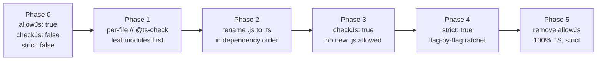
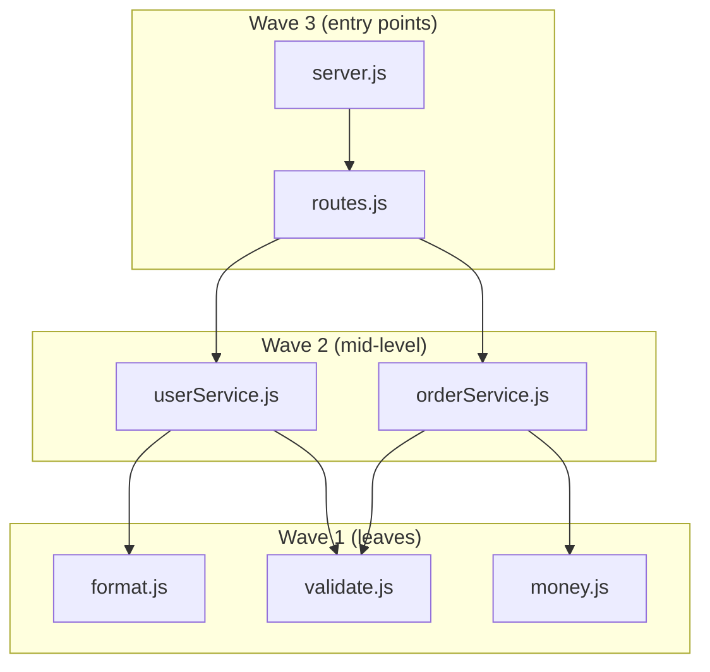
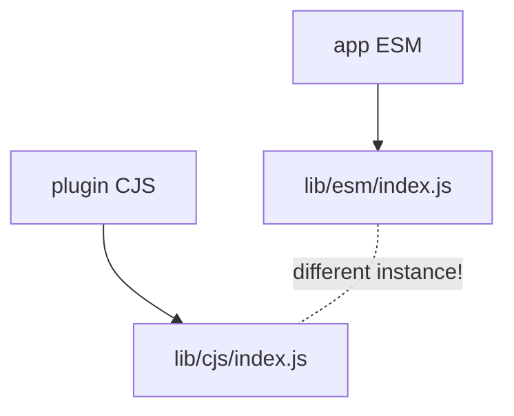
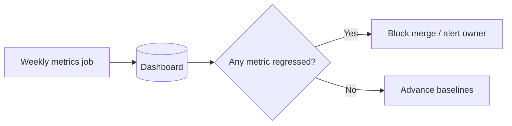

# TS and JS Interoperability — Senior Level

## Table of Contents

1. [Responsibilities at This Level](#responsibilities-at-this-level)
2. [The Migration Strategy You Own](#the-migration-strategy-you-own)
3. [Phasing a Large Codebase: The Strict Ratchet](#phasing-a-large-codebase-the-strict-ratchet)
4. [Sequencing: Dependency-Graph-Driven Waves](#sequencing-dependency-graph-driven-waves)
5. [Managing the Mixed-Codebase Period in CI](#managing-the-mixed-codebase-period-in-ci)
6. [Tracking Percent-Migrated and Forbidding New .js](#tracking-percent-migrated-and-forbidding-new-js)
7. [Strategy for Third-Party Types](#strategy-for-third-party-types)
8. [Owning Ambient Declarations](#owning-ambient-declarations)
9. [JSDoc-First Migration for No-Build Teams](#jsdoc-first-migration-for-no-build-teams)
10. [Module-System Interop at Scale](#module-system-interop-at-scale)
11. [Governance: Banning any Leaks Across the Boundary](#governance-banning-any-leaks-across-the-boundary)
12. [Publishing Libraries for JS and TS Consumers](#publishing-libraries-for-js-and-ts-consumers)
13. [Metrics, Error Budgets, and Suppression Debt](#metrics-error-budgets-and-suppression-debt)
14. [A Reference Migration Playbook](#a-reference-migration-playbook)
15. [Senior Checklist](#senior-checklist)
16. [Interview-Style Reasoning](#interview-style-reasoning)
17. [Summary](#summary)

---

## Responsibilities at This Level

At junior and middle levels, interop is a personal skill: you convert a file, add JSDoc, write a `.d.ts`. At the senior level, interop becomes an **organizational program**. You no longer ask "how do I type this file?" — you ask "how does a 400,000-line JavaScript product become TypeScript without a feature freeze, without a regression, and without exhausting the team?"

- Own the organization's JS→TS **migration strategy** end to end: timeline, phasing, rollback plan, and definition of done.
- Define the **interop standards** every team follows: which `tsconfig` flags are mandatory, how `any` is allowed to cross the JS/TS boundary, and how suppressions are tracked.
- Design a **mixed-codebase CI** that lets `.js` and `.ts` coexist for months while still gating quality and preventing backsliding.
- Set the **third-party types policy**: when to trust `@types/*`, when to bundle, when to hand-author `.d.ts`, and who owns ambient declarations.
- Establish the **strict ratchet**: strictness only ever goes up, never down, enforced by automation rather than goodwill.
- Define **metrics** (percent typed, suppression debt, error budget) so the migration is observable to engineering leadership, not a vibe.

The mental shift: a migration is a distributed systems problem with humans as the nodes. Your job is to make the *correct* action the *easy* action, and the *regressive* action *impossible*.

---

## The Migration Strategy You Own

A large migration has three failure modes, and your strategy must defend against all three:

1. **The big-bang rewrite** — someone proposes pausing features to convert everything at once. It always overruns, ships bugs, and burns trust. Interop exists precisely so you never do this.
2. **The stall** — the migration starts, hits 30%, and dies because there is no forcing function and no visibility. New `.js` files keep appearing faster than old ones convert.
3. **The fake migration** — files get renamed `.ts` but are riddled with `any`, `@ts-ignore`, and `as` casts. The repo *looks* typed but provides no safety. This is worse than no migration because it gives false confidence.

The strategy that avoids all three is **incremental, measured, and ratcheted**:



Each arrow is a **gate**, not a wish. You do not advance a phase until the metric for the current phase is green and locked by CI so it cannot regress.

---

## Phasing a Large Codebase: The Strict Ratchet

The core principle is the **ratchet**: every increment of type safety, once achieved, is mechanically prevented from regressing. A team's discipline decays; a CI check does not.

### Phase 0 — Make the program compile at all

```jsonc
// tsconfig.json — Phase 0: maximally permissive, just get a green build
{
  "compilerOptions": {
    "allowJs": true,
    "checkJs": false,        // include JS but do not check it yet
    "strict": false,
    "noImplicitAny": false,
    "esModuleInterop": true,
    "skipLibCheck": true,
    "outDir": "dist",
    "noEmit": true           // type gate only; bundler still emits
  },
  "include": ["src"]
}
```

The goal of Phase 0 is a single thing: `tsc --noEmit` exits 0 on the existing JavaScript. Nothing is *checked*, but TypeScript now sees the whole graph.

### Phases 1–4 — The ratchet config

The ratchet is implemented by introducing strictness flags one at a time, each as its own PR, each gated. Crucially, you never flip `strict: true` wholesale on a large codebase — that produces thousands of errors at once and is un-reviewable. Instead you enable the constituent flags individually:

```jsonc
// The strict family, enabled in roughly ascending pain order:
{
  "compilerOptions": {
    "noImplicitThis": true,          // cheap, enable first
    "alwaysStrict": true,
    "strictBindCallApply": true,
    "strictFunctionTypes": true,
    "noImplicitAny": true,           // medium pain
    "strictNullChecks": true,        // the big one — do it alone
    "strictPropertyInitialization": true,
    "useUnknownInCatchVariables": true,
    "noUncheckedIndexedAccess": true // hardest; last
  }
}
```

The rule, written into your engineering standards: **a flag is never removed once added.** The diff that disables `strictNullChecks` should be impossible to merge.

```bash
# A governance check: fail CI if any strict flag was weakened vs. the committed baseline.
npx tsc --showConfig > .resolved-tsconfig.json
git diff --exit-code .resolved-tsconfig.json \
  || { echo "tsconfig weakened — strict ratchet violated"; exit 1; }
```

| Phase | tsconfig state | Gate to advance |
|-------|----------------|-----------------|
| 0 | `allowJs`, `checkJs:false` | `tsc --noEmit` green |
| 1 | per-file `// @ts-check` on leaves | all `@ts-check` files pass |
| 2 | renaming `.js`→`.ts` | percent-TS rising each week |
| 3 | `checkJs: true` | zero unchecked `.js` remain |
| 4 | strict flags one by one | each flag green + locked |
| 5 | `allowJs: false` | no `.js` in `src/` |

---

## Sequencing: Dependency-Graph-Driven Waves

The order in which you convert files determines how much pain you absorb. Convert in the wrong order and every file you touch drags in a cascade of untyped dependencies that surface as `any`.

### Leaf-first, not entry-point-first

A **leaf module** depends on nothing internal (only on the standard library and well-typed npm packages). An **entry point** (e.g., `server.ts`, `index.tsx`) depends transitively on everything.

Convert leaves first. When you convert a leaf, its imports are already typed (third-party or std-lib), so you get *real* types immediately rather than `any`. When that leaf is `.ts`, the modules that import it now receive real types too — typing flows *upward* from the leaves toward the entry points.



Convert `format`, `validate`, `money` first (Wave 1). Then `userService`, `orderService` (Wave 2) — their dependencies are already typed. Then `routes`, `server` (Wave 3).

### Computing the waves mechanically

Do not eyeball the graph on a real codebase. Derive it:

```bash
# Generate the import dependency graph and find true leaves (madge handles JS + TS).
npx madge --extensions js,ts src --json > graph.json

# List files that nothing else depends on changing — i.e., convert candidates.
npx madge --extensions js,ts --leaves src
```

```bash
# A topological sort gives you the exact wave ordering for the whole repo.
npx madge --extensions js,ts --orphans src   # also surface dead files to delete, not migrate
```

Each migration "wave" becomes a milestone with an owner, a set of files, and a target date. A wave is small enough to review (10–30 files) and self-contained enough to ship independently.

---

## Managing the Mixed-Codebase Period in CI

For months your repo is half JavaScript, half TypeScript. CI must enforce quality on the typed half without breaking on the untyped half, and must make the untyped half *shrink monotonically*.

### Separate type gates from the build

```yaml
# .github/workflows/ci.yml — the mixed-codebase pipeline
name: CI
on: [push, pull_request]

jobs:
  typecheck:
    runs-on: ubuntu-latest
    steps:
      - uses: actions/checkout@v4
      - uses: actions/setup-node@v4
        with: { node-version: 20, cache: npm }
      - run: npm ci
      # The type gate: noEmit, checks everything currently in scope.
      - run: npx tsc --noEmit
      # The ratchet gate: percent-migrated must not drop.
      - run: node scripts/check-migration-ratchet.mjs
      # Forbid brand-new .js files in already-migrated directories.
      - run: node scripts/forbid-new-js.mjs
```

### `tsc --noEmit` is the gate, the bundler emits

In a mixed codebase you almost always keep your existing bundler (Vite, esbuild, webpack) producing the runtime output, because it already handles `.js` and is fast. TypeScript's job in CI is purely the **type gate**: `tsc --noEmit`. Decoupling the gate from emit means a type error fails CI clearly, and a transpile/bundle problem fails separately — you can tell them apart at a glance.

### Two-track checking during migration

```jsonc
// tsconfig.json — production gate (strict subset already migrated)
{ "extends": "./tsconfig.base.json", "include": ["src"] }
```

```jsonc
// tsconfig.check-js.json — a looser, JS-aware lane that proves
// the not-yet-renamed .js does not break the program graph.
{
  "extends": "./tsconfig.base.json",
  "compilerOptions": { "checkJs": false, "noEmit": true },
  "include": ["src/**/*.js"]
}
```

Run both in CI. The strict track guards what's migrated; the JS-aware track guards that the remaining JS still integrates cleanly.

---

## Tracking Percent-Migrated and Forbidding New .js

What gets measured gets migrated. Two scripts make the migration observable and irreversible.

### Percent-migrated metric

```js
// scripts/migration-stats.mjs
import { globSync } from "node:fs";
import { readdirSync } from "node:fs";

import { execSync } from "node:child_process";

const files = execSync("git ls-files src", { encoding: "utf8" })
  .split("\n")
  .filter(Boolean);

const ts = files.filter((f) => /\.tsx?$/.test(f)).length;
const js = files.filter((f) => /\.jsx?$/.test(f)).length;
const pct = ((ts / (ts + js)) * 100).toFixed(1);

console.log(JSON.stringify({ ts, js, total: ts + js, percentTs: Number(pct) }));
```

```bash
# Emit the number into CI logs and dashboards every run.
node scripts/migration-stats.mjs
# -> {"ts":312,"js":188,"total":500,"percentTs":62.4}
```

### The ratchet: percent must never drop

```js
// scripts/check-migration-ratchet.mjs
import { execSync } from "node:child_process";
import { readFileSync, writeFileSync } from "node:fs";

const current = JSON.parse(
  execSync("node scripts/migration-stats.mjs", { encoding: "utf8" }),
).percentTs;

const baseline = Number(readFileSync(".migration-baseline", "utf8").trim());

if (current < baseline) {
  console.error(`Migration regressed: ${current}% < baseline ${baseline}%`);
  process.exit(1);
}
// Advance the baseline so the floor only ever rises.
if (current > baseline) writeFileSync(".migration-baseline", String(current));
console.log(`Migration OK: ${current}% (baseline ${baseline}%)`);
```

### Forbid new `.js` in migrated areas

Once a directory is fully TypeScript, a new `.js` file there is a regression. Block it.

```js
// scripts/forbid-new-js.mjs
import { execSync } from "node:child_process";

// Files added in this PR vs. the merge base.
const base = process.env.GITHUB_BASE_REF || "main";
const added = execSync(`git diff --name-only --diff-filter=A origin/${base}...`, {
  encoding: "utf8",
}).split("\n").filter(Boolean);

// Directories declared "done" in a manifest — no new JS allowed there.
const frozen = ["src/core/", "src/services/", "src/domain/"];

const offenders = added.filter(
  (f) => /\.jsx?$/.test(f) && frozen.some((d) => f.startsWith(d)),
);

if (offenders.length) {
  console.error("New .js in TypeScript-only areas:\n" + offenders.join("\n"));
  process.exit(1);
}
```

You can enforce the same rule with ESLint for editor-time feedback:

```jsonc
// .eslintrc — block JS imports/creation in frozen zones via no-restricted patterns
{
  "overrides": [
    {
      "files": ["src/core/**", "src/services/**"],
      "rules": {
        "no-restricted-imports": ["error", { "patterns": ["*.js"] }]
      }
    }
  ]
}
```

---

## Strategy for Third-Party Types

Every untyped dependency is a hole in the type system. As the owner of interop standards, you decide the org-wide policy for filling those holes. There are three sources, in priority order.

| Source | When to use | Risk | Who owns it |
|--------|-------------|------|-------------|
| **Bundled types** (lib ships `.d.ts`) | Always preferred | Lowest — versioned with the lib | The library author |
| **`@types/*`** (DefinitelyTyped) | Lib has no bundled types but DT does | Version skew, community accuracy | You, via version alignment |
| **Hand-authored `.d.ts`** | No bundled types, no `@types`, or both are wrong | You maintain it forever | Your team (codeowners) |

### The decision procedure, codified

```bash
# 1. Does the lib bundle its own types?
npm view some-lib types typings exports
# 2. Does a community @types exist, and at a matching major?
npm view @types/some-lib version
npm ls some-lib @types/some-lib    # majors should align
```

### Handling DefinitelyTyped gaps and version skew

`@types/*` is a separately versioned package maintained by volunteers. The two failure modes you must govern:

- **Version skew:** `@types/react@17` against `react@18` declares APIs that no longer exist and omits new ones. Pin `@types/*` to match the runtime's major and treat a mismatch as a CI failure.
- **DT gaps/bugs:** the types are simply wrong. Do not scatter `any` casts to work around it. Centralize the fix in a single augmentation file you own, and upstream a fix to DefinitelyTyped.

```ts
// types/patches/some-lib.d.ts — one owned place for community-type corrections
import "some-lib";

declare module "some-lib" {
  // @types/some-lib@3.2 omits this option that exists at runtime (DT PR #1234).
  interface Options {
    retries?: number;
  }
}
```

```bash
# CI: fail if @types major drifts from the runtime major.
node scripts/check-types-alignment.mjs   # parses `npm ls --json`, compares majors
```

---

## Owning Ambient Declarations

Ambient declarations (`declare global`, `declare module`, `declare const`) are the highest-leverage and highest-risk interop surface: a single wrong global type silently lies to the entire codebase. Treat ambient `.d.ts` files as **privileged code** with extra controls.

```ts
// src/types/globals.d.ts — the ONE canonical place for runtime-injected globals
export {}; // make this a module so `declare global` is legal

declare global {
  interface Window {
    __APP_CONFIG__: { apiUrl: string; env: "dev" | "staging" | "prod" };
  }

  // Build-time defines (injected by the bundler) — typed once, centrally.
  const __BUILD_HASH__: string;
  const __FEATURE_FLAGS__: Readonly<Record<string, boolean>>;
}
```

Lock these files behind code review by the people who actually know the runtime:

```bash
# .github/CODEOWNERS — ambient declarations require platform-team approval
src/types/*.d.ts            @org/platform-types
types/patches/*.d.ts        @org/platform-types
**/*.d.ts                   @org/platform-types
```

Three standards your org should enforce on ambient declarations:

1. **No catch-all `declare module "*";`.** It turns every unknown import into `any` and disables the very safety you are migrating toward.
2. **Globals live in exactly one file.** Scattered `declare global` blocks make the true runtime contract impossible to audit.
3. **Ambient declarations are validated against reality.** A global typed `{ env: "prod" }` that the runtime delivers as the string `"production"` is a latent bug — assert it at startup.

```ts
// Validate that ambient declarations match runtime reality at boot, once.
import { z } from "zod";

const ConfigSchema = z.object({
  apiUrl: z.string().url(),
  env: z.enum(["dev", "staging", "prod"]),
});
ConfigSchema.parse(window.__APP_CONFIG__); // fail fast if the .d.ts lied
```

---

## JSDoc-First Migration for No-Build Teams

Not every team can add a `.ts` build step on day one. Bundler not configured for TS, a Node service that runs raw `.js`, or a config file the tooling requires to stay `.js` — all are real constraints. JSDoc lets such teams get **most of the type safety with zero build changes**.

The progression is: plain JS → `// @ts-check` + JSDoc (no rename, no build change) → `.ts` once a build step exists.

```js
// @ts-check
/**
 * @typedef {Object} Invoice
 * @property {string} id
 * @property {number} amountCents
 * @property {"draft" | "sent" | "paid"} status
 */

/**
 * @param {Invoice} invoice
 * @returns {boolean}
 */
function isOverdue(invoice) {
  return invoice.status === "sent"; // fully type-checked, file is still .js
}

module.exports = { isOverdue };
```

```bash
# CI type-checks the JS without any emit or rename.
npx tsc --allowJs --checkJs --noEmit --strict
```

### When to graduate from JSDoc to `.ts`

JSDoc is a waypoint, not a destination. Graduate a file to `.ts` when:

| Signal | Why it means "rename now" |
|--------|---------------------------|
| The JSDoc types are longer than the code | Native syntax is dramatically terser |
| You need advanced types (conditional, mapped, `infer`) | JSDoc support is partial and awkward |
| A build step now exists | The original blocker is gone |
| The file is a frequently-edited hot spot | Native types reduce per-edit friction |

The senior policy: JSDoc-checking is **mandatory** for any `.js` that cannot yet be renamed, so even unmigrated files carry real types. `// @ts-nocheck` is a tracked exception, never a default.

---

## Module-System Interop at Scale

The hardest interop problem in a large migration is the CommonJS ↔ ESM boundary, because it is a *runtime* concern that types can mask. Getting the types to compile is not the same as getting the module to load.

### `esModuleInterop` and `verbatimModuleSyntax`

```jsonc
// The modern, scale-safe module config:
{
  "compilerOptions": {
    "module": "NodeNext",
    "moduleResolution": "NodeNext",
    "esModuleInterop": true,        // CJS default-imports work ergonomically
    "verbatimModuleSyntax": true    // emit imports exactly as written — no surprises
  }
}
```

`verbatimModuleSyntax` is the senior-grade choice: it forbids ambiguous import elision and forces you to mark type-only imports explicitly with `import type`. This prevents a whole class of dual-module bugs where the compiler silently drops or rewrites an import.

```ts
// With verbatimModuleSyntax, value vs. type imports are unambiguous:
import { createServer } from "node:http";  // value — emitted
import type { Server } from "node:http";   // type — erased entirely
```

### The dual-package hazard

When a package ships **both** a CommonJS and an ESM build, a dependency graph can end up loading *both* copies. Two instances of the same class means `instanceof` fails, two singletons exist, and shared module state desyncs.



Your governance response:

- Prefer dependencies that are **ESM-only** or that correctly use a single `exports` map with no state-bearing singletons.
- For libraries *you* publish, avoid the hazard by exporting types/interfaces (erased) rather than `instanceof`-checked classes across the boundary, or ship a single format.

```jsonc
// A correct dual-format exports map (consumed by both worlds, one source of types):
{
  "exports": {
    ".": {
      "types": "./dist/index.d.ts",
      "import": "./dist/index.mjs",
      "require": "./dist/index.cjs"
    }
  }
}
```

---

## Governance: Banning `any` Leaks Across the Boundary

The JS/TS boundary is where `any` infiltrates. An untyped `.js` import is `any`; a wrong `.d.ts` is a silent `any`; a lazy `as any` to "fix" an interop error spreads `any` through everything it touches. Governance turns these from "discouraged" into "blocked."

```jsonc
// .eslintrc — the interop governance rules
{
  "rules": {
    // No explicit `any`, including the cast escape hatch.
    "@typescript-eslint/no-explicit-any": "error",
    // Catch `any` that LEAKS from untyped imports — the migration killer.
    "@typescript-eslint/no-unsafe-assignment": "error",
    "@typescript-eslint/no-unsafe-call": "error",
    "@typescript-eslint/no-unsafe-member-access": "error",
    "@typescript-eslint/no-unsafe-return": "error",
    // Ban // @ts-ignore; require // @ts-expect-error WITH a description.
    "@typescript-eslint/ban-ts-comment": ["error", {
      "ts-ignore": true,
      "ts-expect-error": "allow-with-description",
      "minimumDescriptionLength": 10
    }]
  }
}
```

The `no-unsafe-*` family is the load-bearing rule set during migration: it catches the `any` that flows *in* from an untyped boundary, which `no-explicit-any` alone misses because the `any` was never written explicitly.

```ts
// What no-unsafe-* catches that no-explicit-any does not:
import legacy from "./legacy.js"; // implicitly `any`

const total = legacy.computeTotal(); // no-unsafe-call + no-unsafe-assignment fire
// You are forced to narrow at the boundary instead of letting `any` spread:
const safeTotal: number = Number(legacy.computeTotal());
```

Pair lint rules with CODEOWNERS so the boundary contracts can only change with review:

```bash
# .github/CODEOWNERS
**/*.d.ts                @org/platform-types
tsconfig*.json           @org/platform-types
.eslintrc*               @org/platform-types
.migration-baseline      @org/platform-types
```

---

## Publishing Libraries for JS and TS Consumers

If your org publishes packages, those packages must serve **both** plain-JS and TypeScript consumers. Getting the `package.json` type-resolution fields right is a senior responsibility because a wrong field breaks every TS consumer's build invisibly.

```jsonc
// package.json — a correctly typed, dual-consumer package
{
  "name": "@acme/widgets",
  "version": "2.4.0",
  "type": "module",
  // Legacy resolvers (and many bundlers) read "types".
  "types": "./dist/index.d.ts",
  // Modern resolvers read the exports map — types FIRST in each condition.
  "exports": {
    ".": {
      "types": "./dist/index.d.ts",
      "import": "./dist/index.mjs",
      "require": "./dist/index.cjs",
      "default": "./dist/index.mjs"
    },
    "./package.json": "./package.json"
  },
  "files": ["dist"],
  "sideEffects": false
}
```

```bash
# Verify the published types actually resolve under every consumer setup.
npx @arethetypeswrong/cli --pack .
# Flags: missing "types" condition, ESM/CJS mismatch, masked exports, etc.
```

### Semver of types

Types follow semver just like runtime behavior — but the rules are subtler. A change that is runtime-compatible can still be a **breaking type change**:

| Change | Runtime | Types | Semver |
|--------|---------|-------|--------|
| Add optional param | compatible | compatible | minor |
| Widen a return type (`string` → `string \| null`) | compatible | **breaking** (consumers must handle null) | major |
| Narrow a parameter type | compatible | **breaking** (rejects previously valid calls) | major |
| Add a required field to an exported interface | depends | **breaking** | major |

```bash
# Gate type-level breaking changes in CI before publish.
npx @microsoft/api-extractor run    # produces an API report; diff it in review
```

The standard: a major version bump is required for any type-level breaking change, and the API report diff must be reviewed like any other public-contract change.

---

## Metrics, Error Budgets, and Suppression Debt

A migration leadership cannot see is a migration that stalls. Make it observable with three tracked numbers.

### 1. Percent typed (coverage)

Already computed above. Beyond file-count percent, track **value-level** type coverage, which catches files that are `.ts` but full of `any`:

```bash
# type-coverage reports the fraction of expressions with a non-any type.
npx type-coverage --detail --at-least 95
# -> 96.2% typed (12480 / 12972 identifiers)
```

File-percent measures *renaming*; `type-coverage` measures *real safety*. Track both — a fake migration shows high file-percent and low type-coverage.

### 2. Suppression debt

Every `// @ts-expect-error` and `as any` is a tracked liability with a paper trail.

```bash
# Count and locate suppression debt; trend it over time.
git grep -n "@ts-expect-error" -- 'src/**' | wc -l
git grep -n "as any"          -- 'src/**' | wc -l
```

```js
// scripts/suppression-budget.mjs — fail if suppressions grow beyond the budget.
import { execSync } from "node:child_process";
const count = Number(
  execSync("git grep -c '@ts-expect-error' -- src | awk -F: '{s+=$2} END{print s}'",
    { encoding: "utf8" }).trim() || "0",
);
const BUDGET = 40; // ratchets DOWN over time, never up
if (count > BUDGET) {
  console.error(`Suppression debt ${count} exceeds budget ${BUDGET}`);
  process.exit(1);
}
```

### 3. Error budget

When you flip a strict flag on a large area, you may accept a temporary, *bounded* number of remaining errors behind a known-list. The budget shrinks every sprint.

| Metric | Source | Direction | Gate |
|--------|--------|-----------|------|
| File percent-TS | `git ls-files` count | up only | ratchet script |
| Type coverage % | `type-coverage` | up only | `--at-least N` |
| Suppression count | `git grep` | down only | budget script |
| Open strict-flag errors | `tsc --noEmit` count | down only | known-list diff |



---

## A Reference Migration Playbook

Putting it together, here is the end-to-end sequence for a real 200k-line JS service.

```bash
# 1. Phase 0 — make it compile, check nothing.
npm install -D typescript @types/node
npx tsc --init
# set allowJs:true, checkJs:false, strict:false, noEmit:true
npx tsc --noEmit            # must be green

# 2. Establish the floor.
node scripts/migration-stats.mjs > /dev/null
echo 0 > .migration-baseline
git add .migration-baseline tsconfig.json

# 3. Wire CI gates (typecheck + ratchet + forbid-new-js).
#    (see the CI workflow above)

# 4. Compute waves and assign owners.
npx madge --extensions js,ts --leaves src   # Wave 1 candidates
```

```bash
# 5. For each wave: add // @ts-check + JSDoc to leaves, fix errors, then rename.
git mv src/util/money.js src/util/money.ts
npx tsc --noEmit            # real types now flow upward
node scripts/check-migration-ratchet.mjs    # baseline advances automatically
```

```bash
# 6. Once checkJs-clean: flip checkJs:true, then strict flags ONE at a time.
#    Each flag = one reviewable PR, gated and locked.
# 7. When src/ has zero .js: set allowJs:false. Migration complete.
```

The discipline that makes this work is not heroics — it is the ratchet. Every gate, once passed, is mechanically held. The codebase can only move toward more safety, one reviewable, shippable wave at a time.

---

## Senior Checklist

- [ ] A written, phased migration strategy exists with explicit gates per phase.
- [ ] Strictness is a ratchet: flags only added, never removed; enforced by a CI config-diff check.
- [ ] Conversion order is dependency-graph-driven (leaf-first), with waves owned and dated.
- [ ] CI separates the `tsc --noEmit` type gate from the bundler's emit.
- [ ] Percent-migrated is measured, dashboards exist, and the metric can only rise (ratchet script).
- [ ] New `.js` files are forbidden in already-migrated directories (script + ESLint + CODEOWNERS).
- [ ] Third-party types follow a policy: bundled > `@types/*` > hand-authored; `@types` majors aligned in CI.
- [ ] Ambient declarations live in one place, are CODEOWNER-gated, and are validated against runtime at boot.
- [ ] No-build teams use `// @ts-check` + JSDoc mandatorily; graduation-to-`.ts` criteria are documented.
- [ ] Module interop uses `esModuleInterop` + `verbatimModuleSyntax`; dual-package hazards are governed.
- [ ] `any` leaks are blocked by `no-unsafe-*` lint rules; `@ts-ignore` banned in favor of described `@ts-expect-error`.
- [ ] Published libraries ship `.d.ts`, a correct `exports` map (types-first), and semver type changes (verified by `attw` / api-extractor).
- [ ] Suppression debt and type-coverage are tracked with budgets that ratchet down.

---

## Interview-Style Reasoning

**Q: You inherit a 300k-line JavaScript app. Leadership wants TypeScript but will not pause feature work. What is your plan, and how do you prevent it from stalling at 40%?**
> Incremental, ratcheted, measured. Phase 0: `allowJs` + `checkJs:false` + `noEmit` so `tsc` sees the graph and CI is green. Then convert leaf-first in dependency-ordered waves so types flow upward and I get real types, not `any`. The anti-stall mechanism is automation: a CI ratchet script makes percent-migrated unable to drop, a script forbids new `.js` in migrated zones, and a dashboard makes progress visible to leadership. Strictness flags are added one reviewable PR at a time and locked by a tsconfig-diff check. Stalling requires merging a regression, which CI makes impossible.

**Q: A renamed-to-`.ts` codebase reports 95% file coverage but the team still hits runtime type bugs. What happened and how do you catch it?**
> A "fake migration": files were renamed but filled with `any`, `as any`, and `@ts-ignore`, so the *file* is TypeScript but the *expressions* are untyped. File-percent measures renaming, not safety. I add value-level metrics: `type-coverage --at-least 95` to measure the fraction of expressions with non-`any` types, a suppression-debt budget via `git grep` that ratchets down, and `no-unsafe-*` ESLint rules that block `any` leaking in from untyped imports. Those three together expose and then close the gap between "renamed" and "actually typed."

**Q: Your org publishes an internal package. A consumer on TypeScript says their build broke after your minor release, but the runtime works fine. What went wrong?**
> A type-level breaking change shipped as a minor. Runtime compatibility and type compatibility are different contracts: widening a return type to include `null`, narrowing a parameter, or adding a required interface field all compile-break consumers while running fine. Types follow semver too, so that release should have been a major. To prevent recurrence I gate the public API with `@microsoft/api-extractor` to produce a reviewable API report diff, validate resolution with `@arethetypeswrong/cli`, and require a major bump for any type-breaking change in code review.

---

## Summary

- Senior-level interop is owning the organization's JS→TS migration as a measured, ratcheted program — not a personal file-by-file skill.
- The strict ratchet is the core idea: every increment of safety is mechanically prevented from regressing by CI, because team discipline decays and automation does not.
- Sequence conversions leaf-first, in dependency-graph waves, so real types flow upward toward entry points instead of `any` flowing down.
- The mixed-codebase period is governed by CI: a `tsc --noEmit` gate separate from emit, a percent-migrated ratchet, and a ban on new `.js` in migrated zones.
- Third-party types follow a policy (bundled > `@types/*` > hand-authored), ambient declarations are privileged and CODEOWNER-gated, and `any` leaks are blocked by `no-unsafe-*` lint rules.
- Module interop at scale means `esModuleInterop` + `verbatimModuleSyntax` and active defense against the dual-package hazard; published libraries ship correct `exports`-map types under semver.
- Observability — percent typed, type-coverage, suppression debt, error budgets — turns the migration from a vibe into a tracked, un-stallable project.

**Next step:** Go under the hood — how the compiler actually resolves declarations, performs structural assignability across the JS/TS boundary, and emits interop helpers (`__importDefault`, `__esModule`) for CommonJS/ESM bridging (see `professional.md`).
