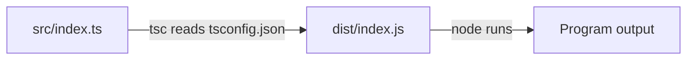
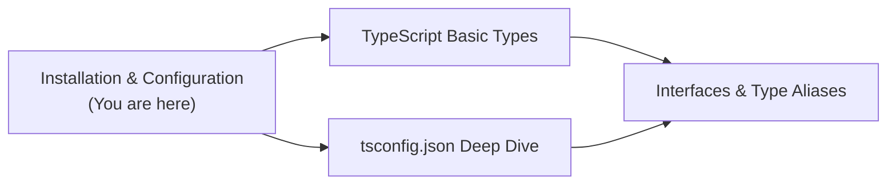
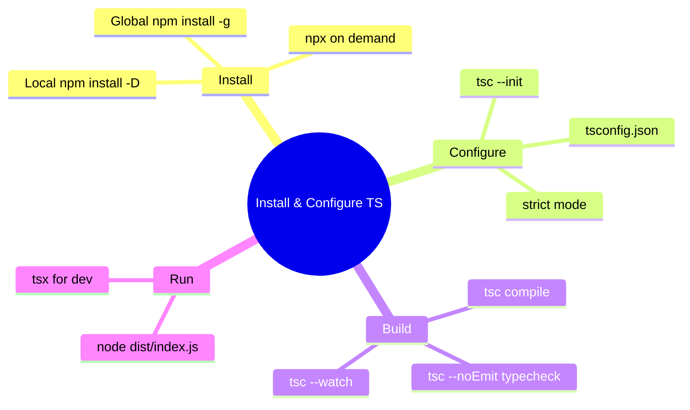
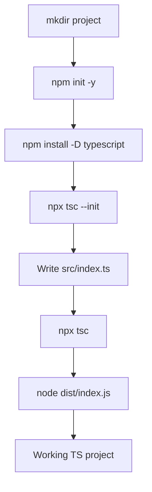

# Installation and Configuration — Junior Level

## Table of Contents

1. [Introduction](#introduction)
2. [Prerequisites](#prerequisites)
3. [Glossary](#glossary)
4. [Core Concepts](#core-concepts)
5. [Real-World Analogies](#real-world-analogies)
6. [Mental Models](#mental-models)
7. [Pros & Cons](#pros--cons)
8. [Use Cases](#use-cases)
9. [Code Examples](#code-examples)
10. [Coding Patterns](#coding-patterns)
11. [Clean Code](#clean-code)
12. [Product Use / Feature](#product-use--feature)
13. [Error Handling](#error-handling)
14. [Security Considerations](#security-considerations)
15. [Performance Tips](#performance-tips)
16. [Metrics & Analytics](#metrics--analytics)
17. [Best Practices](#best-practices)
18. [Edge Cases & Pitfalls](#edge-cases--pitfalls)
19. [Common Mistakes](#common-mistakes)
20. [Common Misconceptions](#common-misconceptions)
21. [Tricky Points](#tricky-points)
22. [Test](#test)
23. [Tricky Questions](#tricky-questions)
24. [Cheat Sheet](#cheat-sheet)
25. [Self-Assessment Checklist](#self-assessment-checklist)
26. [Summary](#summary)
27. [What You Can Build](#what-you-can-build)
28. [Further Reading](#further-reading)
29. [Related Topics](#related-topics)
30. [Diagrams & Visual Aids](#diagrams--visual-aids)

---

## Introduction

> Focus: "What is it?" and "How to use it?"

Installing and configuring TypeScript means putting the TypeScript compiler (`tsc`) onto your machine or into your project, then telling it how to behave with a `tsconfig.json` file. TypeScript is not a runtime — it is a **compiler** that reads `.ts` files and produces plain JavaScript `.js` files that Node.js or a browser can run. Before you can write a single line of typed code, you need that compiler available and configured.

There are several ways to install TypeScript: globally (available everywhere on your computer), locally (pinned inside a single project), or on demand with `npx`. Each approach has trade-offs. This guide walks you from an empty folder to a fully working TypeScript project with a `src/` folder, a `dist/` output folder, npm scripts for building and type-checking, and editor integration so VS Code lights up with red squiggles when you make a mistake.

By the end you will understand: how to install TypeScript the right way (locally, pinned), how to generate a `tsconfig.json`, how to compile your code, how to run the output with Node, and how to wire up `package.json` scripts so your whole team gets the same experience.

---

## Prerequisites

- **Required:** Node.js and npm installed. TypeScript ships as an npm package, so you need Node first. Check with `node --version` and `npm --version`.
- **Required:** Basic command line usage — you will run commands like `npm install`, `npx tsc`, and `node dist/index.js`.
- **Required:** Basic JavaScript knowledge — TypeScript is a superset of JavaScript, so all valid JS is valid TS.
- **Helpful but not required:** A code editor with TypeScript support. VS Code is recommended because it bundles TypeScript language support out of the box.

```bash
# Verify Node and npm are installed before installing TypeScript
node --version   # e.g. v20.11.0
npm --version    # e.g. 10.2.4
```

If these commands fail, install Node.js from [nodejs.org](https://nodejs.org/) (the LTS version is recommended) first.

---

## Glossary

| Term | Definition |
|------|-----------|
| **`tsc`** | The TypeScript Compiler — the command that turns `.ts` files into `.js` files |
| **`tsconfig.json`** | The configuration file that tells `tsc` how to compile your project |
| **`npx`** | A tool bundled with npm that runs a package's binary without installing it globally |
| **Global install** | Installing a package so its command is available anywhere on your machine (`npm install -g`) |
| **Local install** | Installing a package into one project's `node_modules` (`npm install -D`) |
| **devDependency** | A dependency needed only during development/build, not at runtime (TypeScript is one) |
| **`src/`** | Convention for the folder holding your source `.ts` files |
| **`dist/`** | Convention for the folder holding compiled `.js` output |
| **`@types/*`** | Type definition packages that describe the shapes of JavaScript libraries |
| **Language Service** | The background engine your editor uses for autocomplete, errors, and refactoring |
| **Pinning** | Locking a dependency to an exact version so everyone uses the same one |

---

## Core Concepts

### Concept 1: TypeScript Is Just an npm Package

TypeScript is distributed on the npm registry like any other package. Installing it is the same as installing a library: `npm install typescript`. There is no special installer. The package provides two binaries: `tsc` (the compiler) and `tsserver` (the language service your editor talks to).

```bash
# This adds TypeScript to your project's node_modules
npm install --save-dev typescript
```

### Concept 2: Local vs Global vs npx

- **Local (recommended):** `npm install -D typescript` puts TypeScript inside your project. The version is recorded in `package.json` so everyone on the team — and your CI server — uses the exact same compiler.
- **Global:** `npm install -g typescript` makes `tsc` available everywhere, but different projects may need different versions. Global installs cause "works on my machine" bugs.
- **npx:** `npx tsc` runs the locally installed `tsc` if present, otherwise downloads it temporarily. Great for one-off commands without a permanent install.

### Concept 3: `tsconfig.json` Controls Everything

The compiler reads `tsconfig.json` to know which files to compile, what JavaScript version to target, where to put the output, and how strict to be. You generate a starter one with `tsc --init`.

```bash
# Generate a tsconfig.json full of documented options
npx tsc --init
```

### Concept 4: Compile, Then Run

TypeScript code does not run directly in Node by default. You compile `.ts` → `.js`, then run the `.js` with Node.

```bash
npx tsc                 # compile src/*.ts into dist/*.js
node dist/index.js      # run the compiled output
```

---

## Real-World Analogies

| Concept | Analogy |
|---------|--------|
| **TypeScript compiler** | A translator who converts your typed document into plain language everyone understands |
| **Global install** | Keeping one universal toolbox in the garage that every project must share — convenient but everyone fights over the same wrench size |
| **Local install** | Each project getting its own labeled toolbox with exactly the right tools — heavier but no conflicts |
| **`tsconfig.json`** | A recipe card telling the chef which ingredients to use, the oven temperature, and how strict to be about presentation |
| **`npx`** | Renting a tool for a single job instead of buying it |
| **`@types/*` packages** | Instruction manuals that describe how a machine (a JS library) behaves so the inspector (TypeScript) can check your usage |

---

## Mental Models

**The intuition:** Think of a TypeScript project as having three layers. Layer 1 is the **compiler** — a program installed via npm. Layer 2 is the **configuration** — your `tsconfig.json` that tells the compiler what to do. Layer 3 is your **source code** in `src/` that gets transformed into runnable JavaScript in `dist/`.

**Why this model helps:** It clarifies that TypeScript itself is just a build tool. Your shipped product is the JavaScript in `dist/`. The `.ts` files and the compiler never reach production — they are part of your development and build process only.

**The pipeline model:** `src/*.ts` → (tsc reads tsconfig.json) → `dist/*.js` → (node runs it). Every TypeScript project follows this flow, whether it is a tiny script or a giant monorepo.

---

## Pros & Cons

| Pros | Cons |
|------|------|
| Local install pins the version — reproducible across machines | Requires a build step before running (unlike plain JS) |
| `tsconfig.json` is shared, so the whole team gets identical behavior | Beginners can be overwhelmed by the many compiler options |
| VS Code integration works automatically with a local install | Global installs can silently use the wrong version |
| `npx tsc` needs no permanent install for quick tasks | Misconfigured `outDir`/`rootDir` leads to confusing output layouts |
| Easy to add to CI with one `npm ci && npm run typecheck` | Type definitions (`@types/*`) sometimes lag behind library releases |

### When to use:
- Always — any TypeScript project needs the compiler installed and configured.

### When NOT to use:
- For a quick experiment without setup, use the [TypeScript Playground](https://www.typescriptlang.org/play) in your browser instead.

---

## Use Cases

- **Use Case 1:** Bootstrapping a brand-new Node.js backend project with TypeScript.
- **Use Case 2:** Adding TypeScript to an existing JavaScript project incrementally.
- **Use Case 3:** Standardizing the TypeScript version across a team via a local, pinned install.
- **Use Case 4:** Setting up a CI pipeline that type-checks code on every push.
- **Use Case 5:** Configuring a frontend project where a bundler (Vite, esbuild) handles emit and `tsc` only type-checks.

---

## Code Examples

### Example 1: Minimal Project From Scratch

```bash
# Create the project folder and initialize npm
mkdir my-ts-app && cd my-ts-app
npm init -y

# Install TypeScript locally as a dev dependency
npm install --save-dev typescript

# Generate a tsconfig.json
npx tsc --init
```

```typescript
// src/index.ts — your first TypeScript file
function greet(name: string): string {
  return `Hello, ${name}!`;
}

console.log(greet("TypeScript"));
```

```bash
# Compile and run
npx tsc
node dist/index.js   # prints: Hello, TypeScript!
```

### Example 2: A Sensible Starter `tsconfig.json`

```json
{
  "compilerOptions": {
    "target": "ES2022",
    "module": "NodeNext",
    "moduleResolution": "NodeNext",
    "rootDir": "src",
    "outDir": "dist",
    "strict": true,
    "esModuleInterop": true,
    "skipLibCheck": true,
    "forceConsistentCasingInFileNames": true
  },
  "include": ["src"]
}
```

**What it does:** Compiles everything in `src/` to modern JavaScript in `dist/`, with strict type-checking enabled.

### Example 3: package.json Scripts

```json
{
  "name": "my-ts-app",
  "version": "1.0.0",
  "type": "module",
  "scripts": {
    "build": "tsc",
    "typecheck": "tsc --noEmit",
    "watch": "tsc --watch",
    "start": "node dist/index.js"
  },
  "devDependencies": {
    "typescript": "5.4.5"
  }
}
```

```bash
npm run build       # compiles
npm run typecheck   # checks types without writing files
npm run watch       # recompiles on every save
npm start           # runs the compiled output
```

### Example 4: Running TypeScript Without Building (Quick Iteration)

```bash
# tsx runs .ts files directly, no separate build step (great for dev)
npm install --save-dev tsx
npx tsx src/index.ts   # executes immediately
```

---

## Coding Patterns

### Pattern 1: The Standard src/dist Layout

**Intent:** Keep source and output cleanly separated.
**When to use:** Every Node.js TypeScript project.

```
my-ts-app/
├── package.json
├── tsconfig.json
├── src/
│   └── index.ts      ← you edit this
└── dist/             ← tsc generates this (gitignored)
    └── index.js
```

```bash
# .gitignore should exclude build output and dependencies
echo "node_modules/" >> .gitignore
echo "dist/" >> .gitignore
```

**Diagram:**



**Remember:** Never edit files in `dist/` — they are regenerated on every build.

### Pattern 2: Type-Check Separately From Build

**Intent:** Catch type errors quickly without producing output.

```bash
# tsc --noEmit checks types but writes no .js files — fast feedback
npx tsc --noEmit
```

This is the command CI servers run to fail a build when types are wrong.

### Pattern 3: Watch Mode for Development

**Intent:** Recompile automatically as you edit.

```bash
npx tsc --watch
# Leave this running in a terminal; it rebuilds on save
```

---

## Clean Code

### Naming

```bash
# Bad: ambiguous, mixed conventions
mkdir TS_Project1
# Good: lowercase, descriptive, hyphenated
mkdir invoice-service
```

**Rules:**
- Project folders: lowercase with hyphens (`user-api`, not `UserAPI`).
- Keep `src/` and `dist/` as the conventional names so other developers recognize them instantly.

### Configuration

```json
// Bad: copy-pasted config with options you do not understand
{ "compilerOptions": { "target": "es3", "module": "amd", "noImplicitAny": false } }

// Good: minimal, intentional, strict
{ "compilerOptions": { "target": "ES2022", "module": "NodeNext", "strict": true } }
```

**Rule:** Only keep config options you understand and need. Delete the rest.

### Scripts

```json
// Bad: long inline commands repeated everywhere
"build": "node_modules/.bin/tsc --outDir ./dist --rootDir ./src"

// Good: configuration lives in tsconfig.json; scripts stay short
"build": "tsc"
```

**Rule:** Put settings in `tsconfig.json`, not in command-line flags scattered across scripts.

---

## Product Use / Feature

### 1. VS Code

- **How it uses TypeScript installation:** VS Code ships with a bundled TypeScript version for editor features, but it can — and should — use your project's local `typescript` from `node_modules` so the editor matches your build.
- **Why it matters:** Matching versions prevents the editor from showing errors your build does not, or vice versa.

### 2. Vite

- **How it uses TypeScript installation:** Vite uses esbuild to strip types fast during dev and relies on your local `tsc` for type-checking. Your `tsconfig.json` configures both.
- **Why it matters:** Shows the common "bundler does emit, tsc does checking" split used in modern frontend apps.

### 3. ts-node / tsx

- **How it uses TypeScript installation:** These tools read your local TypeScript and `tsconfig.json` to run `.ts` files directly without a separate build.
- **Why it matters:** Speeds up development and scripting; great for tooling and tests.

---

## Error Handling

### Error 1: `tsc: command not found`

```bash
$ tsc
bash: tsc: command not found
```

**Why it happens:** You installed TypeScript locally, so `tsc` is not on your global PATH.
**How to fix:**

```bash
# Use npx to run the local binary
npx tsc
# Or add a package.json script: "build": "tsc", then:
npm run build
```

### Error 2: `Cannot find module` After Compiling

```bash
$ node dist/index.js
Error: Cannot find module './utils'
```

**Why it happens:** With `module: NodeNext`, ESM imports must include the `.js` extension in your source.
**How to fix:**

```typescript
// Wrong
import { helper } from "./utils";
// Correct — include the .js extension (yes, .js even in .ts files)
import { helper } from "./utils.js";
```

### Error 3: `No inputs were found in config file`

```bash
$ npx tsc
error TS18003: No inputs were found in config file 'tsconfig.json'.
```

**Why it happens:** Your `include` path does not match where your `.ts` files actually are.
**How to fix:**

```json
{ "include": ["src"] }
```

Make sure your `.ts` files live in `src/`.

---

## Security Considerations

### 1. Pin Your TypeScript Version

```json
// Bad: caret allows minor updates that may change type-checking behavior
"typescript": "^5.4.0"
// Safer for reproducible builds: pin the exact version
"typescript": "5.4.5"
```

**Risk:** An automatic minor bump can introduce new errors or subtle behavior changes mid-sprint.
**Mitigation:** Pin exact versions and update deliberately. Commit `package-lock.json`.

### 2. Trust `@types` Packages Carefully

```bash
# @types packages run no code, but verify the package name matches the library
npm install --save-dev @types/node
```

**Risk:** Typosquatted packages (e.g. `@types/expres`) can be malicious.
**Mitigation:** Double-check spelling and prefer well-known `@types` published by DefinitelyTyped.

---

## Performance Tips

### Tip 1: Use `skipLibCheck`

```json
{ "compilerOptions": { "skipLibCheck": true } }
```

**Why it's faster:** Skips type-checking the `.d.ts` files in `node_modules`, which is the biggest chunk of work in many projects.

### Tip 2: Use `incremental` Builds

```json
{ "compilerOptions": { "incremental": true } }
```

**Why it's faster:** TypeScript saves a `.tsbuildinfo` cache and only rebuilds changed files on subsequent runs.

---

## Metrics & Analytics

### What to Measure

| Metric | Why it matters | Tool |
|--------|---------------|------|
| **Build time** | Slow builds hurt productivity | `time npx tsc` |
| **Type-check time** | Slow checks slow CI | `time npx tsc --noEmit` |
| **Output size** | Large bundles slow deploys | `du -sh dist` |

### Basic Instrumentation

```bash
# Measure a clean build
time npx tsc

# Measure type-check only
time npx tsc --noEmit

# Inspect output size
du -sh dist
```

---

## Best Practices

- **Install TypeScript locally** (`-D`), never rely on a global install for project builds.
- **Pin the exact version** in `package.json` and commit your lockfile.
- **Use the standard `src/` and `dist/` layout** so the structure is recognizable.
- **Add `build`, `typecheck`, and `watch` scripts** to `package.json`.
- **Enable `strict: true`** from day one — it is much harder to add later.
- **Gitignore `dist/` and `node_modules/`** — never commit build output.

---

## Edge Cases & Pitfalls

### Pitfall 1: Global and Local Versions Disagree

```bash
# Global tsc may be older than the project's pinned version
tsc --version      # Version 4.9.5  (global)
npx tsc --version  # Version 5.4.5  (local — the correct one)
```

**What happens:** Running global `tsc` builds with the wrong compiler.
**How to fix:** Always use `npx tsc` or an npm script so the local version wins.

### Pitfall 2: Forgetting `outDir`

```json
// Without outDir, .js files land right next to your .ts files
{ "compilerOptions": { "target": "ES2022" } }
```

**What happens:** `src/index.ts` and `src/index.js` clutter the same folder.
**How to fix:** Always set `"outDir": "dist"` and `"rootDir": "src"`.

---

## Common Mistakes

### Mistake 1: Installing TypeScript as a Regular Dependency

```bash
# Wrong — TypeScript is only needed at build time
npm install typescript

# Correct — it is a dev dependency
npm install --save-dev typescript
```

### Mistake 2: Running `.ts` Files Directly With Node

```bash
# Wrong — Node cannot run .ts directly (in older versions)
node src/index.ts

# Correct — compile first, or use tsx
npx tsc && node dist/index.js
# Or: npx tsx src/index.ts
```

### Mistake 3: Committing the dist Folder

```bash
# Wrong — build output bloats the repo and causes merge conflicts
git add dist/

# Correct — gitignore it; CI rebuilds it
echo "dist/" >> .gitignore
```

---

## Common Misconceptions

### Misconception 1: "TypeScript runs in the browser/Node directly"

**Reality:** TypeScript must be compiled to JavaScript first. Browsers and (by default) Node only execute JavaScript. The `.ts` files and compiler are development-time only.

**Why people think this:** Tools like `tsx` and `ts-node` hide the compile step, making it feel like TS runs directly — but they compile under the hood.

### Misconception 2: "I need to install TypeScript globally to use it"

**Reality:** A local install plus `npx tsc` or an npm script is the recommended approach. Global installs cause version mismatches.

**Why people think this:** Many old tutorials begin with `npm install -g typescript`.

---

## Tricky Points

### Tricky Point 1: `tsc` vs `tsc --build`

```bash
# tsc — compiles a single project per tsconfig.json
npx tsc

# tsc --build (or tsc -b) — builds project references in dependency order
npx tsc --build
```

**Why it's tricky:** They look similar but `--build` is for multi-project (monorepo) setups with `references`.
**Key takeaway:** Use plain `tsc` for single projects; `tsc -b` for project references.

### Tricky Point 2: The Editor's TypeScript vs the Project's

```
VS Code bundles its own TypeScript, but you can switch it to the
workspace version: Command Palette → "TypeScript: Select TypeScript Version"
→ "Use Workspace Version".
```

**Why it's tricky:** Editor and build can disagree if versions differ.
**Key takeaway:** Always select the workspace version so the editor matches your build.

---

## Test

### Multiple Choice

**1. Which command installs TypeScript as a dev dependency?**

- A) `npm install typescript`
- B) `npm install -g typescript`
- C) `npm install --save-dev typescript`
- D) `npm add tsc`

<details>
<summary>Answer</summary>
**C)** — `--save-dev` (or `-D`) records TypeScript under `devDependencies`, which is correct because it is only needed at build time.
</details>

### True or False

**2. TypeScript code can run directly in Node.js without any compilation.**

<details>
<summary>Answer</summary>
**False (by default)** — Node executes JavaScript. You must compile `.ts` to `.js`, or use a tool like `tsx`/`ts-node` that compiles on the fly.
</details>

### What's the Output?

**3. What does `npx tsc --noEmit` do?**

<details>
<summary>Answer</summary>
It type-checks the project and reports errors, but writes no `.js` files. Useful for CI and quick validation.
</details>

**4. Which command generates a starter `tsconfig.json`?**

- A) `tsc --config`
- B) `tsc --init`
- C) `tsc --new`
- D) `npm init typescript`

<details>
<summary>Answer</summary>
**B)** — `tsc --init` (commonly `npx tsc --init`) creates a documented `tsconfig.json`.
</details>

**5. Where should compiled output go by convention?**

- A) `build/`
- B) `out/`
- C) `dist/`
- D) `src/`

<details>
<summary>Answer</summary>
**C)** — `dist/` is the most common convention, set via `"outDir": "dist"`.
</details>

---

## Tricky Questions

**1. Why might `npx tsc` and a global `tsc` produce different results?**

- A) They never differ
- B) They may be different versions
- C) npx is always newer
- D) Global tsc ignores tsconfig.json

<details>
<summary>Answer</summary>
**B)** — `npx tsc` runs the project-local version recorded in `package.json`, while global `tsc` may be a different (often older) version installed system-wide.
</details>

**2. With `module: NodeNext`, what must relative imports include?**

- A) Nothing extra
- B) The `.ts` extension
- C) The `.js` extension
- D) An `@/` prefix

<details>
<summary>Answer</summary>
**C)** — Native ESM under `NodeNext` requires explicit `.js` extensions on relative imports, even in `.ts` source files.
</details>

---

## Cheat Sheet

| What | Syntax / Command | Example |
|------|-----------------|---------|
| Install locally | `npm install -D typescript` | Adds to devDependencies |
| Check version | `npx tsc --version` | `Version 5.4.5` |
| Init config | `npx tsc --init` | Creates tsconfig.json |
| Compile | `npx tsc` | src → dist |
| Type-check only | `npx tsc --noEmit` | No output files |
| Watch mode | `npx tsc --watch` | Rebuild on save |
| Run output | `node dist/index.js` | Executes compiled JS |
| Run .ts directly | `npx tsx src/index.ts` | No build step |
| Build references | `npx tsc --build` | Monorepo builds |
| Add Node types | `npm install -D @types/node` | Node API types |

---

## Self-Assessment Checklist

### I can explain:
- [ ] The difference between a local, global, and `npx` install
- [ ] Why TypeScript should be a devDependency
- [ ] What `tsconfig.json` controls
- [ ] Why the `src/`/`dist/` split exists

### I can do:
- [ ] Create a new TypeScript project from an empty folder
- [ ] Generate and edit a `tsconfig.json`
- [ ] Compile code and run the output with Node
- [ ] Add `build`, `typecheck`, and `watch` scripts to `package.json`

### I can answer:
- [ ] All multiple choice questions in this document
- [ ] "What's the output?" questions correctly

---

## Summary

- TypeScript is an npm package providing the `tsc` compiler — install it locally with `npm install -D typescript`.
- Prefer local + `npx` over global installs to keep versions consistent across machines and CI.
- `tsc --init` generates a `tsconfig.json`; `outDir`/`rootDir` define the `src/`→`dist/` flow.
- Compile with `tsc`, type-check with `tsc --noEmit`, iterate with `tsc --watch`, run with `node dist/index.js`.
- Add `build`, `typecheck`, and `watch` scripts so your whole team has one workflow.

**Next step:** Learn the TypeScript type system basics — variables, types, interfaces, and functions.

---

## What You Can Build

### Projects you can create:
- **CLI greeting tool:** A small command-line app compiled from `src/` to `dist/`.
- **Project bootstrapper:** A script that scaffolds the standard TypeScript layout.
- **Type-check CI gate:** A GitHub Action that runs `tsc --noEmit` on every push.

### Learning path — what to study next:



---

## Further Reading

- **Official docs:** [Download TypeScript](https://www.typescriptlang.org/download) — installation options.
- **Official docs:** [tsconfig reference](https://www.typescriptlang.org/tsconfig) — every compiler option explained.
- **Official docs:** [TypeScript for the New Programmer](https://www.typescriptlang.org/docs/handbook/typescript-from-scratch.html).
- **Tooling:** [tsx](https://github.com/privatenumber/tsx) — run TypeScript files directly.

---

## Related Topics

- **TypeScript Basic Types** — what to learn after your environment is ready.
- **tsconfig.json Options** — deeper dive into compiler configuration.

---

## Diagrams & Visual Aids

### Mind Map



### Setup Flow



### Project Structure

```
my-ts-app/
├── package.json        ← scripts + pinned typescript version
├── tsconfig.json       ← compiler configuration
├── .gitignore          ← excludes node_modules/ and dist/
├── src/
│   └── index.ts        ← your source code
└── dist/               ← generated JavaScript (gitignored)
    └── index.js
```
