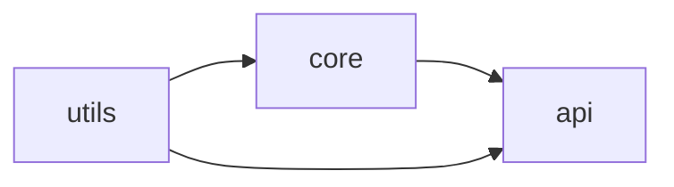

# Installation and Configuration — Optimization Guide

> **Optimize slow or inefficient TypeScript build setups.**
> Each exercise presents a real performance or workflow problem, a measured fix,
> and the expected improvement. Focus is on build/setup, not algorithmic code.

---

## How to Use

1. Read the problem and the baseline numbers.
2. Apply the optimization to your own project.
3. Re-measure with the diagnostic command provided.
4. Confirm the expected improvement.

### Diagnostic Commands You Will Reuse

```bash
time npx tsc                       # wall-clock build time
time npx tsc --noEmit              # type-check time
npx tsc --extendedDiagnostics      # per-phase timing + memory
npx tsc --generateTrace ./trace    # detailed trace for analyze-trace
npx @typescript/analyze-trace ./trace
npx tsc --listFiles | wc -l        # how many files are in the program
```

---

## Optimization 1: Enable Incremental Builds

**Problem:** A cold `tsc` takes 40 s; every rebuild repeats the full cost.

```json
{
  "compilerOptions": {
    "incremental": true,
    "tsBuildInfoFile": "node_modules/.cache/typescript/.tsbuildinfo"
  }
}
```

```bash
time npx tsc   # 40 s cold (writes .tsbuildinfo)
time npx tsc   # 2-4 s warm, no changes
```

**Expected improvement:** 10-20x faster warm rebuilds. The cache stores file hashes and the dependency graph so only changed files (and their type-dependents) recompile.

---

## Optimization 2: Skip Library Checking

**Problem:** Type-checking `node_modules` `.d.ts` files dominates build time.

```json
{ "compilerOptions": { "skipLibCheck": true } }
```

```bash
npx tsc --extendedDiagnostics   # compare "Check time" before/after
```

**Expected improvement:** Often 30-60% off cold build time on dependency-heavy projects. Trade-off: it skips checking for conflicts between declaration files, which is rarely an issue in practice.

---

## Optimization 3: Split a Monorepo Into Project References

**Problem:** One giant `tsconfig` including all packages re-checks everything on any change (90 s full check).



```json
// each package: composite + declaration
{ "compilerOptions": { "composite": true, "declaration": true, "incremental": true } }
```

```bash
npx tsc -b           # builds in dependency order, incrementally
npx tsc -b --verbose # shows which projects were skipped as up-to-date
```

**Expected improvement:** Full check on a 500-file repo drops from ~90 s to ~20 s; single-package edits rebuild only that package and its dependents (seconds). Downstream packages check against pre-emitted `.d.ts`, not source.

---

## Optimization 4: Cache `.tsbuildinfo` in CI

**Problem:** CI does a cold build every run (no state carried between runs).

```yaml
- uses: actions/cache@v4
  with:
    path: |
      **/*.tsbuildinfo
      node_modules/.cache
    key: tsbuildinfo-${{ runner.os }}-${{ hashFiles('**/package-lock.json') }}-${{ hashFiles('**/*.ts') }}
    restore-keys: tsbuildinfo-${{ runner.os }}-
```

**Expected improvement:** PR CI type-checks drop from a full build to an incremental one — frequently 3-5x faster on the second and later runs. Use a clean rebuild for release builds to avoid stale-cache risk.

---

## Optimization 5: Use a Faster Dev Loop (tsx/esbuild)

**Problem:** Restarting a Node app with `tsc && node` on every edit is slow.

```json
// Before: compile-then-run loop
{ "scripts": { "dev": "tsc && node dist/index.js" } }
```

```json
// After: tsx strips types with esbuild and restarts instantly
{ "scripts": { "dev": "tsx watch src/index.ts" } }
```

**Expected improvement:** Restart latency goes from seconds (full tsc) to tens of milliseconds. Run `tsc --noEmit --watch` in parallel to keep real type-checking — speed without losing safety.

```json
{ "scripts": { "dev": "run-p dev:run dev:check", "dev:run": "tsx watch src/index.ts", "dev:check": "tsc --noEmit --watch" } }
```

---

## Optimization 6: Separate Type-Check From Emit in Frontend Builds

**Problem:** A bundler builds fast, but waiting on `tsc` to also emit doubles the work.

```json
{
  "compilerOptions": { "noEmit": true, "isolatedModules": true, "moduleResolution": "Bundler" }
}
```

```json
{ "scripts": { "build": "tsc --noEmit && vite build" } }
```

**Expected improvement:** The bundler (esbuild/SWC) handles emit in milliseconds; `tsc` runs only as a checker. You can even run them in parallel for PR speed and keep `tsc --noEmit` as the authoritative gate.

---

## Optimization 7: Reduce Program Size With Precise include/exclude

**Problem:** `tsc` is pulling thousands of unintended files into the program.

```bash
npx tsc --listFiles | wc -l   # surprisingly large
```

```json
// Before: implicit broad inclusion
{ "include": ["."] }
```

```json
// After: scope tightly and exclude tests/build output
{
  "include": ["src"],
  "exclude": ["node_modules", "dist", "**/*.test.ts", "coverage"]
}
```

**Expected improvement:** Fewer parsed/bound files directly cuts parse and bind time. Confirm the drop with `--listFiles | wc -l` before and after.

---

## Optimization 8: Tame Expensive Generic Instantiations

**Problem:** A deep recursive type (`DeepPartial` on huge schemas) explodes check time.

```bash
npx tsc --generateTrace ./trace
npx @typescript/analyze-trace ./trace   # lists the most expensive instantiations
```

```typescript
// Slow: unbounded recursion
type DeepPartial<T> = T extends object ? { [K in keyof T]?: DeepPartial<T[K]> } : T;

// Faster: bound the depth or avoid recursion for known shapes
type Prev = [never, 0, 1, 2, 3, 4, 5];
type DeepPartial2<T, D extends number = 4> =
  D extends 0 ? T :
  T extends object ? { [K in keyof T]?: DeepPartial2<T[K], Prev[D]> } : T;
```

**Expected improvement:** analyze-trace pinpoints the worst types; bounding recursion or replacing it with runtime validation (e.g., Zod inference) can cut check time on hot files by half or more.

---

## Optimization 9: Pin and Dedupe TypeScript to One Version

**Problem:** Two TypeScript copies in the tree cause redundant work and inconsistent emit.

```bash
npm ls typescript   # shows two versions
```

```json
{
  "devDependencies": { "typescript": "5.4.5" },
  "overrides": { "typescript": "5.4.5" }
}
```

```bash
rm -rf node_modules package-lock.json && npm install
npm ls typescript   # single version
```

**Expected improvement:** Removes duplicate `.d.ts` emit work and the risk of the editor/build using different compilers — faster and more consistent.

---

## Optimization 10: Right-Size the Editor's tsserver Memory

**Problem:** In a large repo, the editor's language service becomes sluggish or restarts.

```json
// .vscode/settings.json
{
  "typescript.tsserver.maxTsServerMemory": 4096,
  "typescript.tsdk": "node_modules/typescript/lib"
}
```

```json
// Pair with project references so tsserver loads only the relevant project
{ "compilerOptions": { "composite": true } }
```

**Expected improvement:** Larger memory ceiling plus references keep the language service responsive; tsserver loads the smallest project graph needed rather than the entire monorepo.

---

## Optimization 11: Faster Watch With Direct-Dependency Assumption

**Problem:** Watch-mode rebuilds re-check too many transitive files.

```json
{ "compilerOptions": { "assumeChangesOnlyAffectDirectDependencies": true } }
```

**Expected improvement:** Watch and incremental rebuilds get noticeably faster because `tsc` only re-checks direct dependents. Trade-off: slightly less precise — keep a full `tsc --noEmit` in CI as the authoritative check.

---

## Optimization 12: Avoid Re-running Install in CI

**Problem:** CI reinstalls all dependencies from scratch every run.

```yaml
- uses: actions/setup-node@v4
  with:
    node-version: 20
    cache: npm          # caches the npm download cache keyed on lockfile
- run: npm ci
```

**Expected improvement:** The npm cache restores downloaded tarballs, so `npm ci` only relinks rather than re-downloading — often cutting install time by more than half on warm cache.

---

## Optimization 13: Use `importHelpers` to Shrink Output

**Problem:** Down-leveling emits the same helper functions (`__awaiter`, `__extends`, `__spreadArray`) into every file, bloating bundle size.

```json
{ "compilerOptions": { "importHelpers": true } }
```

```bash
npm install tslib   # the shared helper library imported instead of inlining
```

**Expected improvement:** Helpers are imported once from `tslib` instead of duplicated per file. On projects targeting older JS with many async functions, this measurably reduces total output size and improves tree-shaking.

---

## Optimization 14: Avoid Re-emitting With `noEmitOnError` Awareness

**Problem:** A failing build still wrote partial output, and downstream steps ran on stale/incomplete `dist/`.

```json
{ "compilerOptions": { "noEmitOnError": true } }
```

**Expected improvement:** No half-built `dist/` when the type-check fails, preventing wasted downstream work (packaging, deploying) on broken output. The build either fully succeeds or emits nothing.

---

## Optimization 15: Parallelize Independent Reference Builds

**Problem:** `tsc -b` builds references sequentially even when some have no dependency on each other.

```bash
# tsc -b is dependency-ordered but single-process. For truly independent
# packages, a task runner can build them in parallel processes.
npx turbo run build          # or nx, or npm-run-all -p
```

```jsonc
// turbo.json — declare the build graph so the runner parallelizes safely
{
  "tasks": {
    "build": { "dependsOn": ["^build"], "outputs": ["dist/**", "*.tsbuildinfo"] }
  }
}
```

**Expected improvement:** On multi-core machines, independent packages compile concurrently. Combined with per-package `incremental`, large monorepos see wall-clock build time drop close to the critical-path length rather than the sum of all packages.

---

## Optimization 16: Trim `lib` to What You Use

**Problem:** Loading `DOM` types in a pure Node project wastes parse time and pollutes globals.

```json
// Before: DOM pulled in unnecessarily (or inherited from a base)
{ "compilerOptions": { "target": "ES2022", "lib": ["ES2022", "DOM"] } }
```

```json
// After: Node-only project drops DOM
{ "compilerOptions": { "target": "ES2022", "lib": ["ES2022"] } }
```

**Expected improvement:** Fewer `lib.*.d.ts` files parsed, and `window`/`document` correctly become errors in Node code (catching browser-only APIs leaking into a server). Verify with `tsc --listFiles | grep lib.`.

---

## Optimization Summary Table

| # | Technique | Effort | Impact | Key Metric |
|---|-----------|--------|--------|-----------|
| 1 | `incremental: true` | Very Low | High | Warm rebuild time |
| 2 | `skipLibCheck: true` | Very Low | High | Cold build / check time |
| 3 | Project references | Medium | Very High | Monorepo full-check time |
| 4 | Cache `.tsbuildinfo` in CI | Low | High | CI type-check time |
| 5 | `tsx`/esbuild dev loop | Low | High | Edit-to-run latency |
| 6 | Split check from emit | Low | High | Frontend build time |
| 7 | Precise include/exclude | Low | Medium | Files in program |
| 8 | Tame recursive generics | Medium | Medium-High | Check time per file |
| 9 | Pin + dedupe TS | Low | Medium | Duplicate emit work |
| 10 | tsserver memory + refs | Low | Medium | Editor responsiveness |
| 11 | Direct-dependency watch | Low | Medium | Watch rebuild time |
| 12 | Cache npm in CI | Very Low | Medium | Install time |

---

## Optimization 17: Disable Source Maps in CI Type-Check

**Problem:** CI runs `tsc` with `sourceMap`/`declarationMap` on for a job that only needs a pass/fail.

```bash
# The type gate does not need any emit at all
npx tsc --noEmit
```

```json
// A dedicated CI config can disable all emit-related work
{
  "extends": "./tsconfig.json",
  "compilerOptions": { "noEmit": true, "sourceMap": false, "declaration": false }
}
```

**Expected improvement:** The emit phase (source maps, declarations) is skipped entirely in the gate job, shaving emit time. Keep full emit only in the build job that produces shipped artifacts.

---

## Optimization 18: Cache the npm Global Store With Lockfile Keys

**Problem:** Even `npm ci` re-downloads when the cache key changes too often.

```yaml
- uses: actions/cache@v4
  with:
    path: ~/.npm
    key: npm-${{ runner.os }}-${{ hashFiles('**/package-lock.json') }}
    restore-keys: npm-${{ runner.os }}-
```

**Expected improvement:** Keying on the lockfile hash means the cache only invalidates when dependencies actually change, so most runs restore the full npm store and `npm ci` becomes mostly a relink — substantially faster installs.

---

## Optimization 19: Precompile Once, Reuse the Artifact Across Jobs

**Problem:** Multiple CI jobs (lint, test, deploy) each rebuild TypeScript from scratch.

```yaml
jobs:
  build:
    steps:
      - run: npm ci
      - run: npm run build
      - uses: actions/upload-artifact@v4
        with: { name: dist, path: dist }
  test:
    needs: build
    steps:
      - uses: actions/download-artifact@v4
        with: { name: dist, path: dist }
      - run: npm test    # runs against prebuilt dist/
```

**Expected improvement:** TypeScript compiles once; downstream jobs download the artifact instead of recompiling. On pipelines with several jobs, this removes redundant `tsc` runs entirely.

---

## Optimization 20: Drop `ts-node` for `tsx` in Test Runs

**Problem:** A test runner using `ts-node` type-checks every test file on every run, slowing the suite.

```json
// Before (slower): ts-node type-checks as it runs
{ "scripts": { "test": "node --loader ts-node/esm --test" } }
```

```json
// After (faster): tsx strips types via esbuild; tsc --noEmit is the separate gate
{
  "scripts": {
    "test": "tsx --test",
    "typecheck": "tsc --noEmit"
  }
}
```

**Expected improvement:** Test execution speeds up dramatically because transpilation is esbuild-fast and type-checking happens once in a dedicated job rather than redundantly per test run.

---

## Optimization 21: Replace Heavy `@types` With Bundled Types

**Problem:** A library ships its own types, yet a stale `@types/*` package is also installed, doubling and sometimes conflicting type work.

```bash
npm ls @types/some-lib    # installed even though some-lib bundles types
npm uninstall @types/some-lib
```

```jsonc
// Scope global type loading to only what is truly global
{ "compilerOptions": { "types": ["node"] } }
```

**Expected improvement:** Removes redundant declaration parsing and eliminates conflicting-definition errors. Modern libraries (zod, axios, etc.) bundle their own types and need no `@types` companion at all.

---

## Optimization 22: Move Type-Heavy Code Behind `import type`

**Problem:** Importing types as values forces the resolver and emitter to treat them as runtime imports, adding work and risking circular-import issues.

```typescript
// Before: value import of a type-only symbol
import { User } from "./models.js";

// After: explicit type-only import (erased completely at emit)
import type { User } from "./models.js";
```

```json
// Enforce it so accidental value imports of types are flagged
{ "compilerOptions": { "verbatimModuleSyntax": true } }
```

**Expected improvement:** Type-only imports are fully erased, reducing emit size and breaking import cycles that slow the checker. `verbatimModuleSyntax` makes the distinction explicit and machine-checkable.

---

## Optimization 23: Warm the Editor With a Smaller Initial Project

**Problem:** Opening a huge monorepo makes `tsserver` load every file before the editor becomes responsive.

```json
// Per-package tsconfig with composite lets tsserver load just one project graph
{ "compilerOptions": { "composite": true }, "include": ["src"] }
```

```jsonc
// .vscode/settings.json — restrict the watcher and server scope
{
  "typescript.tsserver.watchOptions": { "watchFile": "useFsEvents" },
  "files.watcherExclude": { "**/dist/**": true, "**/node_modules/**": true }
}
```

**Expected improvement:** `tsserver` loads only the project containing the open file rather than the whole repo, cutting cold-open time and steady-state memory in large workspaces.

---

## Measurement Discipline

Always measure before and after. A single command tells you where time goes:

```bash
npx tsc --extendedDiagnostics
```

Typical output to watch:

```
Files:                 412
Lines:              182394
Nodes:              612388
Parse time:           1.85 s
Bind time:            0.62 s
Check time:           8.41 s   ← usually the dominant cost
Emit time:            0.94 s
Total time:          11.82 s
Memory used:       412345 K
```

- High **Check time** → `skipLibCheck`, project references, simpler generics.
- High **Parse/Bind time** → fewer files via include/exclude, references.
- High **Memory** → split into references, raise tsserver memory for the editor.

---

## Summary

Build-setup optimization is mostly configuration, not code: turn on `incremental` and `skipLibCheck`, split monorepos into project references, cache `.tsbuildinfo` and the npm cache in CI, separate type-checking from emit, and use `tsx`/esbuild for the dev loop. Profile with `--extendedDiagnostics` and `--generateTrace` so every change is justified by a measured improvement rather than a guess.
