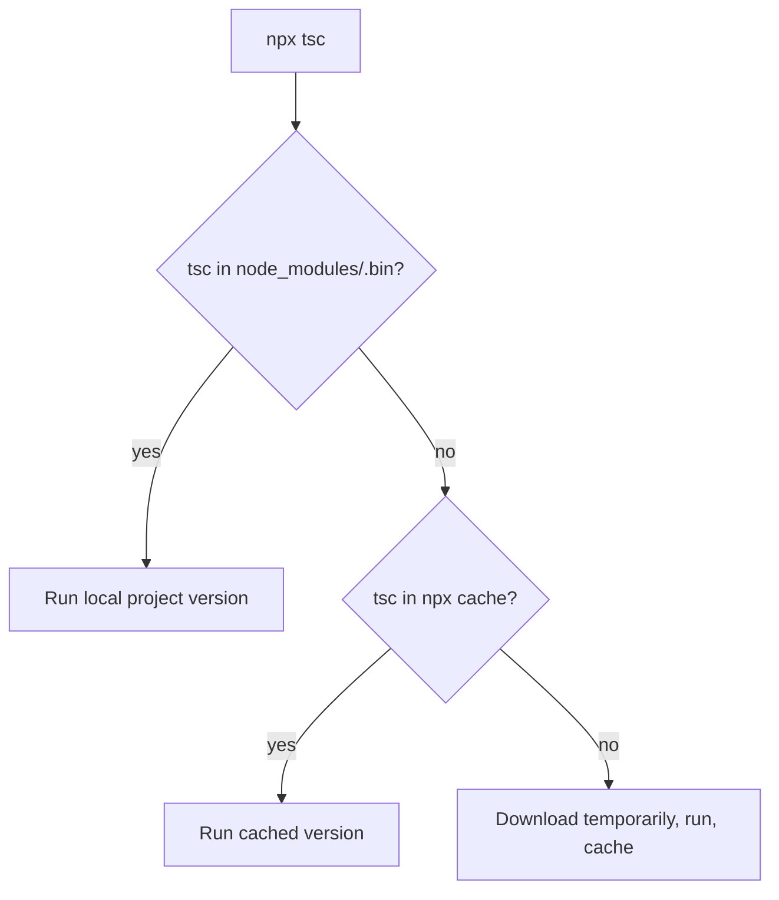
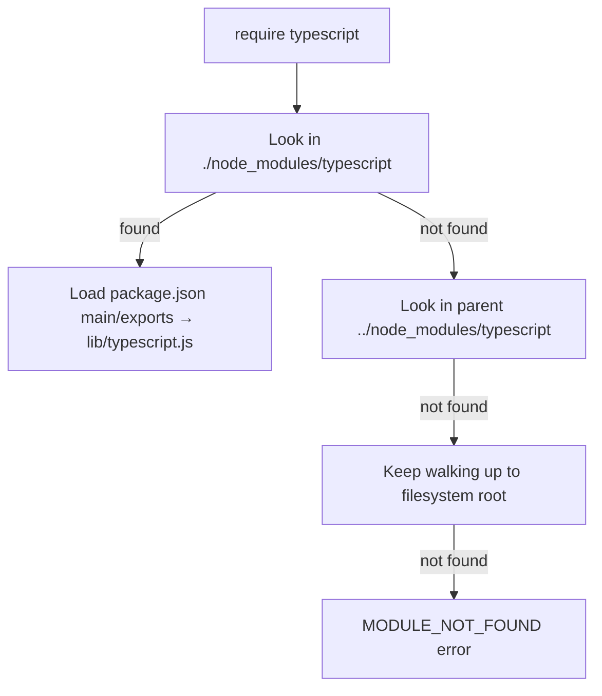
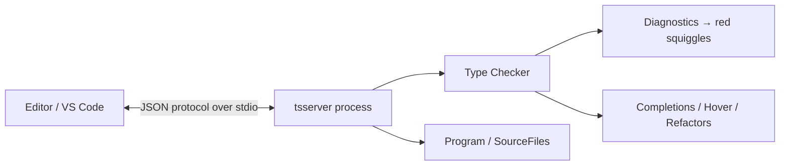
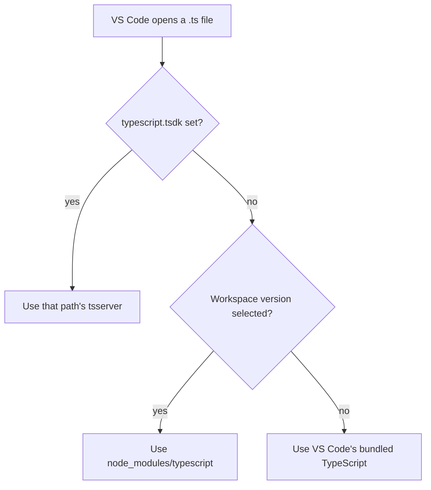
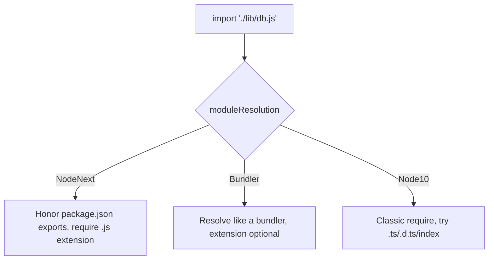
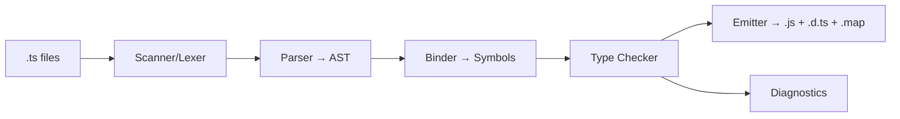
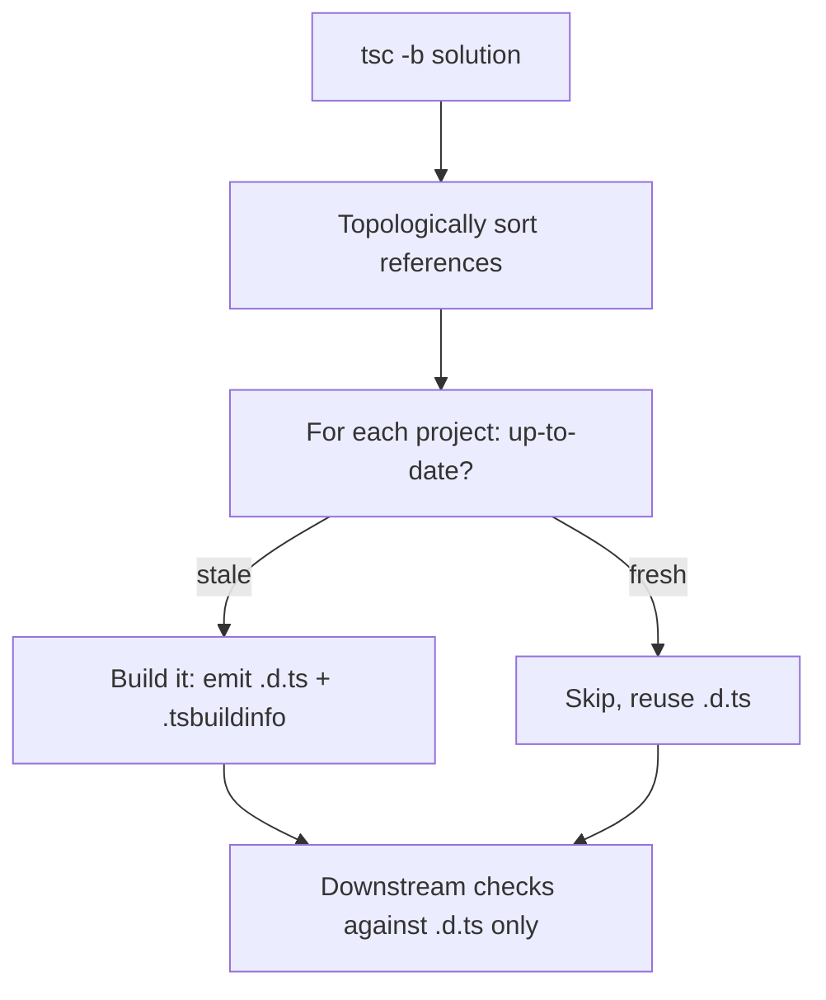
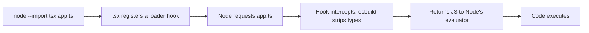
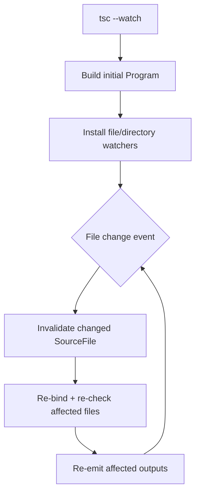

# Installation and Configuration — Under the Hood

## Table of Contents

1. [Overview](#overview)
2. [What `npm install typescript` Actually Does](#what-npm-install-typescript-actually-does)
3. [The Binary Shims: tsc and tsserver](#the-binary-shims-tsc-and-tsserver)
4. [How npx Resolves the Compiler](#how-npx-resolves-the-compiler)
5. [How Node Resolves the Install at Runtime](#how-node-resolves-the-install-at-runtime)
6. [tsconfig Discovery and Resolution](#tsconfig-discovery-and-resolution)
7. [The TypeScript Language Service](#the-typescript-language-service)
8. [How Editors Pick the TypeScript Version](#how-editors-pick-the-typescript-version)
9. [Module Resolution Internals](#module-resolution-internals)
10. [The tsc Build Pipeline](#the-tsc-build-pipeline)
11. [Incremental Builds and .tsbuildinfo](#incremental-builds-and-tsbuildinfo)
12. [Project References Internals](#project-references-internals)
13. [Type Acquisition and @types](#type-acquisition-and-types)
14. [Diagnosing the Install](#diagnosing-the-install)
15. [Professional Pitfalls](#professional-pitfalls)
16. [Summary](#summary)

---

## Overview

This section explains what physically happens when you install and configure TypeScript: which files land where, how the `tsc` and `tsserver` binaries are wired, how `npx` and Node locate the install, how `tsconfig.json` is discovered and merged, and how your editor's language service is connected to a specific TypeScript version. Understanding these internals lets you diagnose "wrong version" bugs, editor/CI mismatches, and module-resolution failures that the public docs gloss over.

The mental model to hold: TypeScript is a JavaScript program living in `node_modules/typescript/`. Everything else — the `tsc` command, the editor squiggles, `npx tsc` — is a thin layer that locates and executes code in that directory.

---

## What `npm install typescript` Actually Does

```bash
npm install --save-dev typescript@5.4.5
```

Step by step:

1. npm contacts the registry, downloads the `typescript` tarball, and verifies its integrity against the `package-lock.json` SHA-512 hash (or records a new one).
2. It extracts the package into `node_modules/typescript/`.
3. It reads that package's `package.json` `bin` field and creates **shim scripts** in `node_modules/.bin/`.
4. It records `"typescript": "5.4.5"` under `devDependencies` and updates the lockfile.

```text
node_modules/
├── typescript/
│   ├── package.json        ← declares "bin": { "tsc": "./bin/tsc", "tsserver": "./bin/tsserver" }
│   ├── bin/
│   │   ├── tsc             ← tiny launcher → ../lib/tsc.js
│   │   └── tsserver        ← tiny launcher → ../lib/tsserver.js
│   └── lib/
│       ├── tsc.js          ← the actual compiler (a single huge JS file)
│       ├── tsserver.js     ← the language server
│       ├── typescript.js   ← the programmatic API
│       └── lib.*.d.ts      ← built-in type declarations (ES, DOM, etc.)
└── .bin/
    ├── tsc -> ../typescript/bin/tsc        ← symlink (or .cmd shim on Windows)
    └── tsserver -> ../typescript/bin/tsserver
```

The compiler itself is just `lib/tsc.js` — a self-contained JavaScript file Node executes. There is no native binary; TypeScript runs entirely on the Node runtime.

---

## The Binary Shims: tsc and tsserver

The `bin/tsc` file is a minimal Node launcher:

```javascript
#!/usr/bin/env node
// node_modules/typescript/bin/tsc (simplified)
require("../lib/tsc.js");
```

When npm creates `node_modules/.bin/tsc`, on Unix it is a symlink to this launcher; on Windows it generates `.cmd` and `.ps1` wrappers. Anything that puts `node_modules/.bin` on its `PATH` — which `npm run` and `npx` both do — can invoke `tsc`.

```bash
# This is why an npm script finds tsc without npx:
# npm prepends ./node_modules/.bin to PATH for the script's shell
{ "scripts": { "build": "tsc" } }   # 'tsc' resolves to node_modules/.bin/tsc
```

```bash
# Prove it
echo $PATH                      # normal shell — no .bin
npm run env | grep node_modules # inside npm script — .bin is prepended
```

---

## How npx Resolves the Compiler

`npx tsc` follows a defined search order:



1. Look in the local `node_modules/.bin` (project install) — this is why a local install always wins.
2. Walk up parent directories' `node_modules/.bin` (monorepo hoisting).
3. Check the npx cache.
4. As a last resort, download the package temporarily.

```bash
# Confirm which binary npx will run
npx --no-install tsc --version   # fails if no local install — proves locality
npx tsc --version                # the version actually used by your build
```

**Implication:** In a project with a local install, `npx tsc` and `npm run build` (with `"build": "tsc"`) execute the *same* file. A global `tsc` only runs if you type `tsc` directly in a shell where `.bin` is not on `PATH`.

---

## How Node Resolves the Install at Runtime

Tools like `tsx` and `ts-node` load TypeScript programmatically. They call Node's module resolution to find the `typescript` package:

```javascript
// Roughly what ts-node/tsx do internally
const ts = require("typescript");   // Node resolves node_modules/typescript/lib/typescript.js
```

Node's algorithm for `require("typescript")`:



The `package.json` `exports`/`main` field of the `typescript` package points `require("typescript")` to `lib/typescript.js` — the programmatic API (distinct from `lib/tsc.js`, the CLI). This is the same resolution used by ESLint's TS parser, bundler TS plugins, and the editor.

---

## tsconfig Discovery and Resolution

When you run bare `tsc`, the compiler searches for configuration:

1. If `--project`/`-p` is given, use that file.
2. Otherwise, look for `tsconfig.json` in the current directory.
3. If not found, walk up parent directories until one is found or the root is reached.

```bash
# See exactly which config tsc loaded and the fully-resolved options
npx tsc --showConfig
```

### `extends` Merging

```jsonc
// tsconfig.json
{ "extends": "@tsconfig/node20/tsconfig.json", "compilerOptions": { "outDir": "dist" } }
```

Resolution rules:
- `extends` is resolved like a module specifier (so it can point into `node_modules`).
- `compilerOptions` are shallow-merged (the child overrides individual keys).
- `files`, `include`, and `exclude` from the base are **not** inherited — they reset; the child must redeclare them.
- Relative paths in the base (`outDir`, `rootDir`) are resolved relative to the config that *defines* them, then re-based — a frequent source of confusion.

```bash
# Inspect the merged result to verify what actually applies
npx tsc --showConfig | head -40
```

---

## The TypeScript Language Service

The editor experience is powered by `tsserver` — a long-running Node process implementing the **language service** API. It is the same type-checker core as `tsc`, exposed for interactive use.



- The editor spawns `tsserver` and communicates over a JSON protocol via stdio.
- `tsserver` maintains an in-memory `Program` (the parsed, bound source files) and incrementally updates it on each keystroke.
- It serves completions, hover info, go-to-definition, diagnostics, rename, and code fixes from the same type information `tsc` computes.

```bash
# tsserver is the binary the editor launches
ls node_modules/typescript/lib/tsserver.js
```

Because `tsserver` and `tsc` share the checker, the diagnostics your editor shows are — when the versions match — identical to what `tsc --noEmit` reports. Version mismatches are the root cause of "editor disagrees with CI."

---

## How Editors Pick the TypeScript Version

VS Code (and similar editors) face a choice: use the TypeScript bundled inside the editor, or the one in the project's `node_modules`.



Resolution order:

1. The `typescript.tsdk` setting (workspace `.vscode/settings.json`), if present, pointing at `node_modules/typescript/lib`.
2. The version selected via **"TypeScript: Select TypeScript Version" → Use Workspace Version**.
3. Otherwise, the editor's **bundled** TypeScript (updated on the editor's own release cadence).

```jsonc
// .vscode/settings.json — force the workspace version
{
  "typescript.tsdk": "node_modules/typescript/lib",
  "typescript.enablePromptUseWorkspaceTsdk": true
}
```

**Why bundled-by-default is dangerous:** VS Code ships a recent TypeScript that may be newer or older than your pinned project version. With the bundled version, the editor can show errors your build does not (or hide ones it would). Committing `typescript.tsdk` removes this entire class of confusion.

```text
Check the active version: VS Code status bar shows "TypeScript 5.4.5"
when a .ts file is focused; clicking it opens the version picker.
```

---

## Module Resolution Internals

`moduleResolution` controls how `tsc` turns an import specifier into a file on disk. This must match how the **runtime** resolves, or you get errors that only appear at execution time.

| Strategy | Algorithm | Extension in import? |
|----------|-----------|----------------------|
| `Node10` (classic Node) | CommonJS `require` lookup | No |
| `NodeNext` | Native ESM + `exports`/`imports` map | Yes (`.js`) |
| `Bundler` | Like NodeNext but no extension required | Optional |

```typescript
// Under NodeNext, the import specifier must match what Node ESM resolves at runtime.
// Source is index.ts, but it imports the EMITTED .js name:
import { db } from "./lib/db.js";   // resolves db.ts at compile, db.js at runtime
```



```bash
# Trace exactly how a specifier resolves (invaluable for debugging)
npx tsc --traceResolution | grep "db" | head
```

Under `NodeNext`, `tsc` also reads each dependency's `package.json` `exports` map and its `"type"` field to decide ESM vs CommonJS — the same logic Node uses, which is why the two stay consistent.

---

## The tsc Build Pipeline



1. **Program construction:** `tsc` reads `tsconfig.json`, resolves all `include`d files plus their imports, and builds a `Program` — the complete set of source files to compile.
2. **Parse:** Each file becomes an AST.
3. **Bind:** Symbols are attached to declarations; the symbol table and control-flow graph are built.
4. **Check:** The type checker resolves types, infers generics, and validates assignments, emitting diagnostics.
5. **Emit:** Type annotations are stripped; JavaScript (`outDir`), declaration files (`declaration`), and source maps (`sourceMap`) are written.

```bash
# See per-phase timing
npx tsc --extendedDiagnostics
# Files, Lines, Nodes, Parse time, Bind time, Check time, Emit time, Memory used
```

The check phase dominates wall time on large projects; emit is comparatively cheap. This is why `--noEmit` (type-check only) is barely faster than a full build — the expensive work already happened.

---

## Incremental Builds and .tsbuildinfo

With `incremental: true`, `tsc` writes a `.tsbuildinfo` file recording file hashes and the dependency graph.

```json
{ "compilerOptions": { "incremental": true, "tsBuildInfoFile": "node_modules/.cache/tsbuildinfo" } }
```

On the next run, `tsc`:
1. Reads `.tsbuildinfo`.
2. Hashes current source files and compares to stored hashes.
3. Recomputes only changed files and the files whose types depend on them.

```bash
# First run: full build, writes .tsbuildinfo
npx tsc
# Second run, no changes: reads cache, exits fast
npx tsc
```

```text
.tsbuildinfo contains (conceptually):
{
  "fileInfos": { "src/a.ts": { "version": "<hash>", ... } },
  "referencedMap": { "src/a.ts": ["src/b.ts"] },   // who depends on whom
  "options": { ...compilerOptions snapshot... }
}
```

If `compilerOptions` change between runs, the recorded `options` no longer match and `tsc` invalidates the cache, forcing a full rebuild — which is why a config tweak always triggers a clean recompile.

---

## Project References Internals

With `composite: true`, a referenced project is treated as a pre-built unit:



- `tsc -b` reads the reference graph, topologically sorts it, and processes leaves first.
- Each project emits `.d.ts` files; downstream projects type-check against those declarations, never re-parsing upstream source.
- Each project's own `.tsbuildinfo` makes its up-to-date check `O(files)` hashing, not a full recompile.

```bash
# Watch the up-to-date decisions
npx tsc -b --verbose
# Logs: "Project 'utils' is up to date", "Building 'api' because 'core' changed", etc.
```

`declarationMap: true` additionally emits `.d.ts.map` files so "go to definition" jumps to the original `.ts` source across package boundaries instead of the generated `.d.ts`.

---

## Type Acquisition and @types

`tsc` finds ambient type declarations through `typeRoots` and the `types` option.

```jsonc
{
  "compilerOptions": {
    // Default: every node_modules/@types folder up the tree
    "typeRoots": ["./node_modules/@types", "./types"],
    // Optional: restrict to a whitelist (excludes the rest)
    "types": ["node"]
  }
}
```

Resolution details:
- By default, all packages under any `node_modules/@types` are loaded globally (which is why `@types/node` makes `process` available everywhere without an import).
- Setting `types: ["node"]` restricts global type loading to that list — useful to keep test-only globals (`@types/jest`) out of production source.
- A library that bundles its own `.d.ts` (via its `package.json` `types`/`exports`) needs no `@types` package at all.

```bash
# See which type packages tsc auto-loaded
npx tsc --listFiles | grep "@types"
```

---

## Diagnosing the Install

```bash
# Which TypeScript version is actually resolved
npx tsc --version

# Is there more than one copy in the dependency tree? (causes inconsistent emit)
npm ls typescript

# The fully-resolved configuration after extends-merging
npx tsc --showConfig

# Every file pulled into the Program (catches accidental node_modules inclusion)
npx tsc --listFiles

# How a specific import resolves
npx tsc --traceResolution 2>&1 | grep "my-module"

# Per-phase timing and memory
npx tsc --extendedDiagnostics
```

```bash
# Where the resolved 'typescript' module physically lives
node -p "require.resolve('typescript')"
# → /path/to/project/node_modules/typescript/lib/typescript.js
```

---

## Professional Pitfalls

### Pitfall 1: Two TypeScript Versions in the Tree

```bash
npm ls typescript
# project@1.0.0
# ├── typescript@5.4.5
# └─┬ some-tool@2.0.0
#   └── typescript@4.9.5   ← a second copy!
```

A tool that depends on its own TypeScript can cause inconsistent `.d.ts` emit or editor/build mismatch. Fix with `overrides` to force a single version.

### Pitfall 2: Editor Uses Bundled TS, CI Uses Pinned

The editor shows green; CI fails. Always commit `typescript.tsdk` so `tsserver` runs from `node_modules`.

### Pitfall 3: `extends` Path-Rebasing Surprise

`outDir` defined in a base config resolves relative to the base file's location, not the consuming config — output can land somewhere unexpected. Verify with `tsc --showConfig`.

### Pitfall 4: Stale `.tsbuildinfo` After a Git Operation

Switching branches can leave a `.tsbuildinfo` describing a different file set, occasionally hiding errors. For release builds, run `tsc -b --clean` first.

---

## How `tsx` and `ts-node` Hook Into Node

These tools make `node file.ts` appear to work. Internally they register a hook into Node's module loading so `.ts` files are transpiled to JS on import.



```bash
# Modern Node ESM loader registration
node --import tsx src/index.ts
# Older style
node --loader ts-node/esm src/index.ts
```

Key distinction in the internals:

- **tsx** uses esbuild to *strip* types — it does **no type-checking**. Fast, but you still need `tsc --noEmit` as a gate.
- **ts-node** can run the full TypeScript checker during execution (slower) or use `--transpile-only` to skip it.

```javascript
// Conceptually, the hook resolves the typescript package the same way as tsc:
const ts = require("typescript");      // node_modules/typescript/lib/typescript.js
// then calls ts.transpileModule(source, { compilerOptions }) per file
```

Because these tools read your `tsconfig.json`, the `target`/`module` you configure for `tsc` also governs how they transpile — a single source of truth.

---

## The `typescript` Package `exports` Map

The package's own `package.json` defines what `require`/`import` of subpaths resolve to. This is why tools can import the API but not internal files.

```jsonc
// node_modules/typescript/package.json (simplified)
{
  "name": "typescript",
  "version": "5.4.5",
  "bin": { "tsc": "./bin/tsc", "tsserver": "./bin/tsserver" },
  "main": "./lib/typescript.js",
  "types": "./lib/typescript.d.ts"
}
```

- `bin` → the CLI shims npm links into `.bin`.
- `main`/`types` → what `require("typescript")` and its types resolve to (the programmatic API).
- The CLI (`lib/tsc.js`) and the API (`lib/typescript.js`) are separate entry points sharing the same checker code.

```bash
# Confirm the resolved entry point
node -p "require.resolve('typescript')"
# /…/node_modules/typescript/lib/typescript.js
```

---

## Lib Files: Where Built-In Types Come From

When you write `Array.prototype.map` or `Promise`, those types come from `lib.*.d.ts` files shipped inside the TypeScript package.

```text
node_modules/typescript/lib/
├── lib.es5.d.ts          ← base JS APIs
├── lib.es2015.d.ts       ← Map, Set, Promise, Symbol
├── lib.es2022.d.ts       ← Array.at, Object.hasOwn
├── lib.dom.d.ts          ← document, window, fetch
└── lib.esnext.d.ts       ← bleeding-edge proposals
```

The `lib` compiler option (or the default derived from `target`) selects which of these are loaded:

```jsonc
{ "compilerOptions": { "target": "ES2022", "lib": ["ES2022", "DOM", "DOM.Iterable"] } }
```

```bash
# Confirm which lib files were pulled in
npx tsc --listFiles | grep "lib\."
```

If `lib` excludes `DOM`, `document` is undefined to the checker — a common source of "Cannot find name 'window'" in Node-targeted configs (which is correct: Node has no `window`).

---

## Watch Mode Internals

`tsc --watch` keeps the `Program` resident and uses filesystem watchers to recompute only what changed.



```jsonc
// Tune the watcher strategy for large repos or networked filesystems
{
  "watchOptions": {
    "watchFile": "useFsEvents",
    "watchDirectory": "useFsEvents",
    "fallbackPolling": "dynamicPriority"
  }
}
```

On systems where native FS events are unreliable (Docker volumes, some network mounts), polling fallbacks prevent missed rebuilds at the cost of CPU.

---

## Summary

- TypeScript installs as plain JavaScript under `node_modules/typescript/`; `tsc` and `tsserver` are thin Node launchers shimmed into `node_modules/.bin`.
- `npx` and `npm run` prefer the local `.bin`, so a pinned install reliably wins over any global one.
- `tsserver` is the language service the editor talks to; it shares the checker with `tsc`, so matching versions makes editor diagnostics equal CI diagnostics.
- Editors pick the TS version from `typescript.tsdk` / workspace selection, falling back to a bundled copy — commit the setting to avoid drift.
- `moduleResolution` must mirror the runtime's resolution; use `--traceResolution`, `--showConfig`, and `--listFiles` to diagnose the install.

**Next step:** The specification — official install docs, `tsc --init` defaults explained option by option, and authoritative links.
