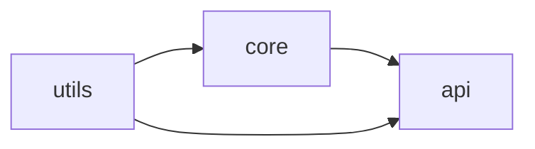

# Installation and Configuration — Senior Level

## Table of Contents

1. [Responsibilities at This Level](#responsibilities-at-this-level)
2. [Team Standardization](#team-standardization)
3. [Reproducible Builds](#reproducible-builds)
4. [Version Pinning Policy](#version-pinning-policy)
5. [Shared Base Configs](#shared-base-configs)
6. [Monorepo TypeScript Configuration](#monorepo-typescript-configuration)
7. [Project References](#project-references)
8. [CI Type-Checking Pipeline](#ci-type-checking-pipeline)
9. [Caching in CI](#caching-in-ci)
10. [Toolchain Standardization](#toolchain-standardization)
11. [Editor Version Enforcement](#editor-version-enforcement)
12. [Build Performance at Scale](#build-performance-at-scale)
13. [Migration and Upgrade Strategy](#migration-and-upgrade-strategy)
14. [Governance and Linting the Config](#governance-and-linting-the-config)
15. [Senior Checklist](#senior-checklist)
16. [Interview-Style Reasoning](#interview-style-reasoning)
17. [Summary](#summary)

---

## Responsibilities at This Level

- Define the organization's TypeScript installation and configuration standards.
- Guarantee reproducible builds across developer machines and CI runners.
- Design monorepo TS configuration with project references and incremental builds.
- Own the version-upgrade policy: when and how the org bumps TypeScript.
- Keep CI type-checking fast through caching and parallelism.
- Prevent config drift via shared base configs and automated checks.

At this level, "it compiles on my machine" is not acceptable. The bar is: **any engineer, on any machine, and the CI runner all produce byte-identical results from a clean checkout.**

---

## Team Standardization

The enemy is drift. When ten developers each have a slightly different `tsconfig.json`, a different global `tsc`, and a different editor TS version, you get errors that appear for one person and not another. Standardization eliminates this.

```bash
# A clean-checkout build must be deterministic. The canonical sequence:
git clean -xfd               # remove all untracked files (node_modules, dist)
npm ci                       # install EXACT versions from package-lock.json
npm run typecheck            # tsc --noEmit, the type gate
npm run build                # tsc, the artifact
```

`npm ci` (not `npm install`) is the linchpin: it installs strictly from the lockfile and fails if `package.json` and `package-lock.json` disagree. This is what CI must run.

```json
// package.json — enforce a Node + npm version range so toolchains match
{
  "engines": {
    "node": ">=20.0.0 <21",
    "npm": ">=10"
  }
}
```

```bash
# Enforce engines strictly (fail install on mismatch)
npm config set engine-strict true
```

---

## Reproducible Builds

Reproducibility rests on three pillars: pinned dependencies, a committed lockfile, and a deterministic compiler configuration.

```json
// All build-affecting tools pinned exactly
{
  "devDependencies": {
    "typescript": "5.4.5",
    "@types/node": "20.11.30",
    "tsx": "4.7.1"
  }
}
```

```bash
# The lockfile must be committed and treated as source of truth
git add package-lock.json

# In CI, never run plain 'npm install' — it can mutate the lockfile
npm ci
```

### Determinism in tsconfig

```json
{
  "compilerOptions": {
    "incremental": true,
    "tsBuildInfoFile": "node_modules/.cache/tsbuildinfo",
    "newLine": "lf",                 // consistent line endings across OSes
    "forceConsistentCasingInFileNames": true
  }
}
```

`newLine: "lf"` and `forceConsistentCasingInFileNames` prevent the two classic non-determinism sources: Windows CRLF vs Unix LF, and case-insensitive filesystems (macOS) hiding casing bugs that break on Linux CI.

---

## Version Pinning Policy

Document a clear policy so upgrades are intentional events, not accidents.

| Tool | Pinning | Rationale |
|------|---------|-----------|
| `typescript` | Exact (`5.4.5`) | Minor bumps add type errors |
| `@types/*` | Exact or `~` | Track the runtime they describe |
| `tsx` / `ts-node` | Exact | Affects dev/test execution |
| Node | Range via `engines` | Allow patch security fixes |

```jsonc
// Override transitive TypeScript to a single version across the whole tree
// (prevents two copies of tsc causing inconsistent .d.ts emit)
{
  "overrides": {
    "typescript": "5.4.5"
  }
}
```

**Policy statement template:** "TypeScript is upgraded in a dedicated PR, no more than once per minor release, gated by a green full `tsc --noEmit` across all packages. The upgrade PR documents every new error and its resolution."

---

## Shared Base Configs

In an organization, publish a base `tsconfig` as a package so every repo extends one source of truth.

```json
// @acme/tsconfig-base/tsconfig.json  (published to your registry)
{
  "$schema": "https://json.schemastore.org/tsconfig",
  "compilerOptions": {
    "target": "ES2022",
    "module": "NodeNext",
    "moduleResolution": "NodeNext",
    "strict": true,
    "noUncheckedIndexedAccess": true,
    "esModuleInterop": true,
    "skipLibCheck": true,
    "forceConsistentCasingInFileNames": true,
    "verbatimModuleSyntax": true,
    "declaration": true,
    "sourceMap": true
  }
}
```

```json
// Consuming repo's tsconfig.json — extend, override only what differs
{
  "extends": "@acme/tsconfig-base/tsconfig.json",
  "compilerOptions": {
    "rootDir": "src",
    "outDir": "dist"
  },
  "include": ["src"]
}
```

```bash
npm install -D @acme/tsconfig-base
```

This is exactly how `@tsconfig/node20`, `@tsconfig/strictest`, etc. work — well-known community base configs you can adopt directly.

```bash
# Adopt a community base instead of hand-rolling
npm install -D @tsconfig/node20 @tsconfig/strictest
```

```json
{ "extends": ["@tsconfig/node20/tsconfig.json", "@tsconfig/strictest/tsconfig.json"] }
```

---

## Monorepo TypeScript Configuration

A monorepo houses multiple packages that depend on each other. The naive approach — one giant `tsconfig` including everything — is slow and couples packages. The correct approach is **project references**.

```
monorepo/
├── package.json            ← workspaces config
├── tsconfig.base.json      ← shared compiler options
├── tsconfig.json           ← solution file (references all packages)
├── packages/
│   ├── core/
│   │   ├── tsconfig.json   ← composite: true, references none
│   │   └── src/
│   ├── utils/
│   │   ├── tsconfig.json   ← composite: true
│   │   └── src/
│   └── api/
│       ├── tsconfig.json   ← references core + utils
│       └── src/
```

```json
// package.json — npm workspaces
{
  "name": "monorepo",
  "private": true,
  "workspaces": ["packages/*"]
}
```

```json
// tsconfig.base.json — shared options, no files
{
  "compilerOptions": {
    "target": "ES2022",
    "module": "NodeNext",
    "moduleResolution": "NodeNext",
    "strict": true,
    "skipLibCheck": true,
    "declaration": true,
    "declarationMap": true,
    "composite": true,
    "incremental": true
  }
}
```

```json
// packages/utils/tsconfig.json — a leaf package
{
  "extends": "../../tsconfig.base.json",
  "compilerOptions": { "rootDir": "src", "outDir": "dist" },
  "include": ["src"]
}
```

```json
// packages/api/tsconfig.json — depends on core and utils
{
  "extends": "../../tsconfig.base.json",
  "compilerOptions": { "rootDir": "src", "outDir": "dist" },
  "include": ["src"],
  "references": [
    { "path": "../core" },
    { "path": "../utils" }
  ]
}
```

```json
// tsconfig.json at the root — the "solution" file, builds everything
{
  "files": [],
  "references": [
    { "path": "packages/core" },
    { "path": "packages/utils" },
    { "path": "packages/api" }
  ]
}
```

---

## Project References

```bash
# Build the whole graph in dependency order, incrementally
npx tsc --build

# Equivalent short form
npx tsc -b

# Force a clean rebuild
npx tsc -b --clean && npx tsc -b

# Watch the entire reference graph
npx tsc -b --watch
```

**How it speeds things up:** With `composite: true`, each package emits `.d.ts` files plus a `.tsbuildinfo` cache. Downstream packages type-check against the upstream `.d.ts` (fast, pre-computed) instead of re-parsing all source. On a no-change rebuild, `tsc -b` reads the build-info caches and exits in well under a second.



```bash
# tsc -b walks this graph and rebuilds only stale nodes and their dependents
# Editing utils → rebuilds utils, core, api
# Editing api   → rebuilds only api
```

---

## CI Type-Checking Pipeline

```yaml
# .github/workflows/ci.yml
name: CI
on: [push, pull_request]

jobs:
  typecheck:
    runs-on: ubuntu-latest
    steps:
      - uses: actions/checkout@v4
      - uses: actions/setup-node@v4
        with:
          node-version: 20
          cache: npm
      - run: npm ci
      - run: npm run typecheck   # tsc --noEmit (or tsc -b --noEmit for monorepos)
      - run: npm run build
```

```json
// package.json — the canonical scripts CI invokes
{
  "scripts": {
    "typecheck": "tsc -b --noEmit",
    "build": "tsc -b"
  }
}
```

**Separate the gate from the artifact:** `typecheck` proves correctness; `build` produces output. Keeping them as distinct steps gives clearer CI failures — a red `typecheck` means a type error, a red `build` means an emit/config problem.

---

## Caching in CI

The single biggest CI speedup is caching the incremental build state.

```yaml
      - name: Cache tsbuildinfo
        uses: actions/cache@v4
        with:
          path: |
            **/*.tsbuildinfo
            node_modules/.cache
          key: tsbuildinfo-${{ runner.os }}-${{ hashFiles('**/package-lock.json') }}-${{ hashFiles('src/**/*.ts') }}
          restore-keys: |
            tsbuildinfo-${{ runner.os }}-
```

```json
// Point the cache at a stable location so it is easy to cache/restore
{
  "compilerOptions": {
    "incremental": true,
    "tsBuildInfoFile": "node_modules/.cache/typescript/.tsbuildinfo"
  }
}
```

**Caveat:** A stale or corrupt `.tsbuildinfo` can hide errors. For release builds, run a clean `tsc -b --clean && tsc -b` to guarantee correctness; use the cache only for PR feedback speed.

---

## Toolchain Standardization

Beyond TypeScript itself, pin the entire build toolchain.

```
.nvmrc          → 20.11.0          (Node version, read by nvm/fnm)
.npmrc          → engine-strict=true, save-exact=true
package.json    → engines, pinned devDependencies
```

```ini
# .npmrc — make every install exact and enforce engines
save-exact=true
engine-strict=true
```

```bash
# save-exact=true means future installs pin automatically
npm install -D some-tool     # records "some-tool": "1.2.3", not "^1.2.3"
```

```bash
# Optional: enforce the toolchain with Corepack for package-manager pinning
corepack enable
# package.json: "packageManager": "npm@10.5.0"
```

---

## Editor Version Enforcement

A senior ensures editors do not diverge from the build.

```jsonc
// .vscode/settings.json — committed, enforced via the workspace TS SDK
{
  "typescript.tsdk": "node_modules/typescript/lib",
  "typescript.enablePromptUseWorkspaceTsdk": true,
  "typescript.tsserver.maxTsServerMemory": 4096
}
```

```jsonc
// .vscode/extensions.json — recommend the right extensions to new hires
{
  "recommendations": [
    "dbaeumer.vscode-eslint",
    "esbenp.prettier-vscode"
  ]
}
```

When the editor uses `node_modules/typescript`, the squiggles a developer sees are produced by the exact compiler CI runs. This closes the "passes locally, fails in CI" gap at the source.

---

## Build Performance at Scale

```bash
# Profile where checking time goes
npx tsc -b --generateTrace ./trace
npx @typescript/analyze-trace ./trace

# Print extended diagnostics (files, instantiations, memory, time per phase)
npx tsc --extendedDiagnostics
```

| Technique | Impact | Notes |
|-----------|--------|-------|
| `skipLibCheck: true` | High | Skips `node_modules` `.d.ts` checking |
| Project references | Very High | Parallel, incremental per package |
| `incremental: true` + cached `.tsbuildinfo` | High | Warm rebuilds in seconds |
| `assumeChangesOnlyAffectDirectDependencies` | Medium | Faster watch, slightly less precise |
| Avoid deep recursive generics | Medium | Reduces instantiation explosion |
| Split oversized union types | Medium | Cheaper assignability checks |

```json
// Faster watch for very large repos (trades a little precision)
{
  "compilerOptions": {
    "assumeChangesOnlyAffectDirectDependencies": true
  }
}
```

---

## Migration and Upgrade Strategy

Upgrading TypeScript across a large codebase is a managed project, not a casual bump.

```bash
# 1. Branch and bump in isolation
git checkout -b chore/ts-5.5
npm install -D typescript@5.5.4

# 2. Run the full type gate and capture the error delta
npm run typecheck 2>&1 | tee ts-errors.txt

# 3. Fix or suppress with documented reasons, never blanket-disable strict
```

```json
// Stage strictness increases behind a separate config so the PR is reviewable
{
  "extends": "./tsconfig.json",
  "compilerOptions": { "noUncheckedIndexedAccess": true }
}
```

**Incremental adoption pattern:** when adding TypeScript to a large JS codebase, start with `allowJs: true` and `checkJs: false`, migrate file-by-file, and tighten `strict` flags one at a time across PRs rather than all at once.

```json
{
  "compilerOptions": {
    "allowJs": true,
    "checkJs": false,
    "strict": false,
    "noImplicitAny": true
  }
}
```

---

## Governance and Linting the Config

Prevent config drift with automated checks.

```bash
# Fail CI if anyone weakens the config (example: a script that diffs against the base)
npx tsc --showConfig > .resolved-tsconfig.json
git diff --exit-code .resolved-tsconfig.json
```

```jsonc
// Use the JSON schema for editor validation of tsconfig itself
{
  "$schema": "https://json.schemastore.org/tsconfig"
}
```

```bash
# Detect duplicate/stray TypeScript installs in the tree (causes inconsistent emit)
npm ls typescript
# Expect a single version; multiple entries indicate a dependency pulling its own copy
```

A common governance rule: an ESLint config that forbids `@ts-ignore` (require `@ts-expect-error` with a description) and bans `as any`, so the strictness encoded in `tsconfig.json` cannot be quietly bypassed in source.

---

## Senior Checklist

- [ ] `npm ci` used in CI; lockfile committed and treated as source of truth.
- [ ] TypeScript and `@types/*` pinned exactly; `overrides` dedupe transitive copies.
- [ ] Shared base config (`@acme/tsconfig-base` or `@tsconfig/*`) extended everywhere.
- [ ] Monorepo uses project references with `composite: true` and `tsc -b`.
- [ ] CI separates `typecheck` (gate) from `build` (artifact).
- [ ] `.tsbuildinfo` cached in CI for fast PR feedback; clean rebuild for releases.
- [ ] `.nvmrc`, `engines`, and `.npmrc` (`save-exact`, `engine-strict`) standardize the toolchain.
- [ ] Editor pinned to the workspace TS version via committed `.vscode/settings.json`.
- [ ] Documented, gated TypeScript upgrade policy.

---

## Interview-Style Reasoning

**Q: How do you guarantee CI and a developer's machine produce identical type-check results?**
> Pin TypeScript exactly, commit the lockfile, run `npm ci` everywhere, and point the editor at `node_modules/typescript`. Add `overrides` so only one TS version exists in the tree. With all four, the same compiler with the same config runs in every context.

**Q: Why project references instead of one big tsconfig in a monorepo?**
> One big config re-parses all source on every change and couples packages. References with `composite: true` cache each package's `.d.ts` and build-info, so downstream packages check against pre-computed declarations and only stale nodes rebuild — orders of magnitude faster at scale.

**Q: A TypeScript minor upgrade broke CI. What is your process?**
> Treat it as a dedicated PR. Capture the error delta with `tsc --noEmit`, fix or document each new error, never blanket-disable strict flags, and merge only on a fully green type gate. Pinning is what let CI stay green until the deliberate upgrade.

---

## Summary

- Senior-level installation/configuration is about determinism: pinned versions, committed lockfile, `npm ci`, and aligned editors.
- Shared base configs eliminate per-repo drift; the org has one source of truth.
- Monorepos use project references (`composite`, `tsc -b`) for fast incremental, dependency-ordered builds.
- CI separates the type gate from the build artifact and caches `.tsbuildinfo` for speed.
- TypeScript upgrades are governed, gated events — never accidental caret bumps.

**Next step:** Go under the hood — how `tsc` and Node resolve the install, the language service, and how editors pick the TypeScript version.
