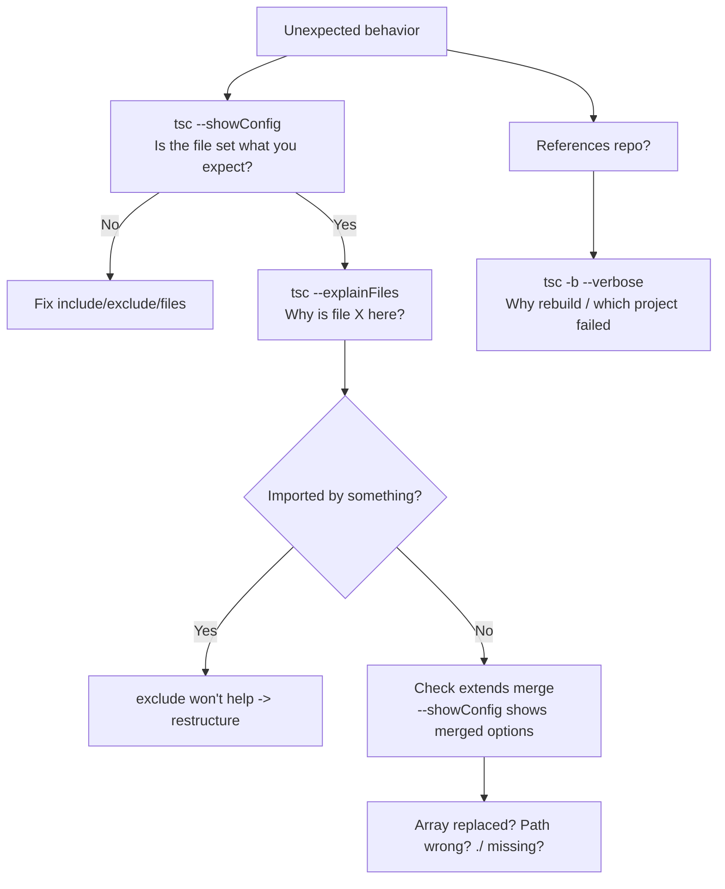

# tsconfig.json — Find the Bug

> **Practice finding and fixing configuration bugs in `tsconfig.json`.**
> Each exercise contains a broken config (or config + code) — find the bug, explain why it happens, and fix it.
> These bugs are specific to project configuration: wrong include/exclude, broken extends, missing references, and build-mode mistakes.

---

## How to Use

1. Read the buggy config carefully.
2. Predict the error or wrong behavior **before** reading the explanation.
3. Write the fix yourself, then compare.
4. Understand **why** — config bugs are silent until they bite.

### Difficulty Levels

| Level | Description |
|:-----:|:-----------|
| 🟢 | **Easy** — Common beginner mistakes: wrong field placement, missing `./`, empty include |
| 🟡 | **Medium** — Inheritance pitfalls, exclude misconceptions, output overlap |
| 🔴 | **Hard** — Project references, composite, incremental cache, build-mode subtleties |

---

## Bug 1: Top-Level Field Inside compilerOptions 🟢

**What it should do:** Compile everything under `src`.

```json
{
  "compilerOptions": {
    "strict": true,
    "outDir": "dist",
    "include": ["src"]
  }
}
```

**The bug:** `include` is a **top-level** field, not a `compilerOptions` flag. Placed inside `compilerOptions`, it is ignored — and `include` defaults to `**/*`, pulling in unexpected files (or erroring if combined with other issues).

**Fix:**
```json
{
  "compilerOptions": {
    "strict": true,
    "outDir": "dist"
  },
  "include": ["src"]
}
```

---

## Bug 2: Local extends Without `./` 🟢

**What it should do:** Inherit from a sibling base config.

```json
{
  "extends": "tsconfig.base.json",
  "compilerOptions": { "outDir": "dist" }
}
```

**Error:**
```
error TS5083: Cannot read file 'tsconfig.base.json'.
```

**The bug:** A bare specifier is resolved as an npm package from `node_modules`. Local files must use `./` or `../`.

**Fix:**
```json
{
  "extends": "./tsconfig.base.json",
  "compilerOptions": { "outDir": "dist" }
}
```

---

## Bug 3: Empty include Matches Nothing 🟢

**What it should do:** Compile the project, whose code lives at the repo root.

```json
{
  "compilerOptions": { "strict": true },
  "include": ["src"]
}
```

**Error:**
```
error TS18003: No inputs were found in config file 'tsconfig.json'.
Specified 'include' paths were '["src"]' and 'exclude' paths were '[]'.
```

**The bug:** There is no `src` directory — the `.ts` files are at the repo root, so the glob matches zero files.

**Fix:** Point `include` at the real location (or move code into `src`).
```json
{
  "compilerOptions": { "strict": true },
  "include": ["*.ts", "**/*.ts"]
}
```

---

## Bug 4: exclude Doesn't Stop Imported Files 🟡

**What it should do:** Keep `legacy.ts` out of the build.

```json
{
  "compilerOptions": { "outDir": "dist" },
  "include": ["src"],
  "exclude": ["src/legacy.ts"]
}
```
```typescript
// src/index.ts
import { oldHelper } from "./legacy"; // legacy.ts still compiles!
```

**The bug:** `exclude` only filters the **root discovery** set. Because `index.ts` imports `legacy.ts`, the file is reachable through the module graph and is compiled regardless of `exclude`. `dist/legacy.js` appears anyway.

**Fix:** Don't import excluded files. Remove the import (and the file if truly unused), or move the code:
```typescript
// src/index.ts — no import of legacy
import { newHelper } from "./helper";
```

---

## Bug 5: Array Override Wipes Inherited lib 🟡

**What it should do:** Add `DOM` types on top of the base's `ES2022`.

```json
// base.json
{ "compilerOptions": { "lib": ["ES2022"], "strict": true } }
```
```json
// tsconfig.json
{
  "extends": "./base.json",
  "compilerOptions": { "lib": ["DOM"] }
}
```

**Symptom:** `Promise`, `Map`, and other ES2022 globals are suddenly "Cannot find name".

**The bug:** Arrays are **replaced**, not merged, across `extends`. The child's `["DOM"]` fully replaces the base's `["ES2022"]`.

**Fix:** Restate the full array in the child.
```json
{
  "extends": "./base.json",
  "compilerOptions": { "lib": ["ES2022", "DOM", "DOM.Iterable"] }
}
```

---

## Bug 6: outDir Overlaps rootDir 🟡

**What it should do:** Compile `src` into a separate output folder.

```json
{
  "compilerOptions": {
    "rootDir": "src",
    "outDir": "src"
  },
  "include": ["src"]
}
```

**The bug:** Output is written into the source folder. Compiled `.js` files clutter `src`, get picked up by `include` on the next run, and can even be re-compiled. It also pollutes git diffs.

**Fix:** Send output to a distinct folder and gitignore it.
```json
{
  "compilerOptions": { "rootDir": "src", "outDir": "dist" },
  "include": ["src"],
  "exclude": ["dist"]
}
```

---

## Bug 7: Custom exclude Drops node_modules Protection 🟡

**What it should do:** Exclude the build folder.

```json
{
  "compilerOptions": { "outDir": "build" },
  "include": ["src", "node_modules/some-lib/src"],
  "exclude": ["build"]
}
```

**Symptom:** The build becomes very slow and pulls in thousands of library source files.

**The bug:** The `include` glob explicitly reaches into `node_modules`. Although `node_modules` is excluded **by default**, that default only applies when you don't set your own `exclude` — and here `include` explicitly references it anyway. The net effect is a bloated compilation.

**Fix:** Never include `node_modules` sources; depend on the published types instead. Keep `exclude` explicit.
```json
{
  "compilerOptions": { "outDir": "build" },
  "include": ["src"],
  "exclude": ["node_modules", "build"]
}
```

---

## Bug 8: Missing references in a Monorepo 🔴

**What it should do:** Let `app` import from `utils` in a project-references repo.

```json
// packages/utils/tsconfig.json
{ "compilerOptions": { "composite": true, "declaration": true, "outDir": "dist", "rootDir": "src" }, "include": ["src"] }
```
```json
// packages/app/tsconfig.json
{
  "compilerOptions": { "composite": true, "outDir": "dist", "rootDir": "src" },
  "include": ["src"]
}
```
```typescript
// packages/app/src/index.ts
import { format } from "../../utils/src/format"; // reaching into another project!
```

**Error (with tsc -b):**
```
error TS6059: File '.../utils/src/format.ts' is not under 'rootDir' '.../app/src'.
error TS6307: File is not listed within the file list of project.
```

**The bug:** `app` reaches into `utils`'s source directly instead of declaring a reference. In references mode, cross-project imports must go through the reference + emitted `.d.ts`.

**Fix:** Add a `references` entry (and import via the package's public entry, ideally a real package name).
```json
// packages/app/tsconfig.json
{
  "compilerOptions": { "composite": true, "outDir": "dist", "rootDir": "src" },
  "references": [{ "path": "../utils" }],
  "include": ["src"]
}
```

---

## Bug 9: composite Project Missing a File 🔴

**What it should do:** Build a composite library.

```json
{
  "compilerOptions": { "composite": true, "declaration": true, "outDir": "dist", "rootDir": "src" },
  "files": ["src/index.ts"]
}
```
```typescript
// src/index.ts
export * from "./helpers"; // src/helpers.ts exists but is NOT listed
```

**Error:**
```
error TS6307: File 'src/helpers.ts' is not listed within the file list of project.
Projects must list all files or use an 'include' pattern.
```

**The bug:** Composite projects must list **all** input files. Using a single `files` entry omits `helpers.ts`, which `index.ts` imports.

**Fix:** Use an `include` glob (recommended) or list every file.
```json
{
  "compilerOptions": { "composite": true, "declaration": true, "outDir": "dist", "rootDir": "src" },
  "include": ["src"]
}
```

---

## Bug 10: Running Plain tsc in a References Repo 🔴

**What it should do:** Build the whole monorepo.

```bash
# Run at the solution root that has files: [] + references
tsc
```

**Symptom:** Either "no inputs" or errors about missing referenced outputs; nothing builds as expected.

**The bug:** Plain `tsc` does not follow `references`. A solution root with `"files": []` compiles nothing and ignores its references under plain `tsc`.

**Fix:** Use build mode.
```bash
tsc -b          # follows references, builds in dependency order
tsc -b --verbose
```

---

## Bug 11: Stale Incremental Cache After Option Change 🔴

**What it should do:** Rebuild correctly after toggling `strict`.

```bash
# First build with strict: false
tsc -b
# Edit tsconfig: strict -> true
tsc -b
```

**Symptom (perceived):** "The build is slow again even though I barely changed anything," or confusion about why a full rebuild happened.

**The bug (actually correct behavior, often misdiagnosed):** Compiler options are recorded in `.tsbuildinfo`. Changing `strict` invalidates the incremental cache **entirely** and forces a full rebuild. This is correct — but teams sometimes "fix" it by deleting caches or forcing flags, masking the real cause.

**Fix / understanding:** Accept the full rebuild after option changes. In CI, include compiler options (and the TS version) in your cache key so caches bust intentionally. Do not commit `.tsbuildinfo`; cache it instead.

```bash
# .gitignore
*.tsbuildinfo
dist/
```

---

## Bug 12: extends Array Order Reversed 🔴

**What it should do:** Apply Node settings, then enforce strictest on top.

```json
{
  "extends": [
    "@tsconfig/strictest/tsconfig.json",
    "@tsconfig/node20/tsconfig.json"
  ]
}
```

**Symptom:** Some strict flags from `strictest` are unexpectedly relaxed because `node20` (listed later) overrode them.

**The bug:** In an `extends` array, **later entries override earlier ones**. Here `node20` overrides any overlapping keys from `strictest`, weakening strictness.

**Fix:** Put the config you want to win last (or override explicitly in `compilerOptions`).
```json
{
  "extends": [
    "@tsconfig/node20/tsconfig.json",
    "@tsconfig/strictest/tsconfig.json"
  ]
}
```

---

## Bug 13: paths Without a Runtime Alias 🔴

**What it should do:** Use `@utils/*` aliases at both compile and run time.

```json
{
  "compilerOptions": {
    "baseUrl": ".",
    "paths": { "@utils/*": ["src/utils/*"] },
    "outDir": "dist"
  },
  "include": ["src"]
}
```
```typescript
// src/index.ts — type-checks fine
import { format } from "@utils/format";
```

**Runtime error:**
```
Error: Cannot find module '@utils/format'
```

**The bug:** `paths` only affects TypeScript's **type** resolution. The emitted JS still contains `@utils/format`, which Node cannot resolve at runtime.

**Fix:** Add a runtime resolver (`tsconfig-paths`, a bundler alias, or Node `imports` in `package.json`), or use relative imports / real package names. Example with `package.json` subpath imports:
```json
// package.json
{
  "imports": { "#utils/*": "./dist/utils/*.js" }
}
```
and import `#utils/format` (Node's native subpath imports), keeping tsconfig `paths` aligned to the same shape.

---

## Bug Hunt Summary

| # | Bug | Level | Root cause |
|---|-----|:-----:|-----------|
| 1 | `include` inside `compilerOptions` | 🟢 | Wrong field placement |
| 2 | extends without `./` | 🟢 | Treated as npm package |
| 3 | Empty include | 🟢 | Glob matches nothing |
| 4 | exclude ignored for imports | 🟡 | Root-set filter only |
| 5 | Array override wipes lib | 🟡 | Arrays replace, not merge |
| 6 | outDir overlaps rootDir | 🟡 | Output pollutes source |
| 7 | include reaches node_modules | 🟡 | Bloated compilation |
| 8 | Missing references | 🔴 | Cross-project import without ref |
| 9 | composite missing a file | 🔴 | Must list all files |
| 10 | Plain tsc in references repo | 🔴 | Need `tsc -b` |
| 11 | Stale cache after option change | 🔴 | Options baked into `.tsbuildinfo` |
| 12 | extends array order | 🔴 | Later entries win |
| 13 | paths without runtime alias | 🔴 | `paths` is type-only |

> Mastering these means you can debug almost any real-world `tsconfig.json` problem.
> When stuck, reach for `tsc --showConfig` and `tsc -b --verbose` first.

---

## Bug 14: noEmit With an Expectation of Output 🟢

**What it should do:** Produce `dist/index.js` for `node` to run.

```json
{
  "compilerOptions": {
    "outDir": "dist",
    "noEmit": true
  },
  "include": ["src"]
}
```
```bash
tsc && node dist/index.js
```

**Error:**
```
Error: Cannot find module '.../dist/index.js'
```

**The bug:** `noEmit: true` tells `tsc` to type-check only and write nothing. `outDir` is then meaningless — no files are produced.

**Fix:** Remove `noEmit` for a build that must emit (or keep `noEmit` only for type-check-only configs and let a bundler produce output).
```json
{
  "compilerOptions": { "outDir": "dist" },
  "include": ["src"]
}
```

---

## Bug 15: rootDir Too Narrow 🟡

**What it should do:** Compile sources spread across `src` and `shared`.

```json
{
  "compilerOptions": { "rootDir": "src", "outDir": "dist" },
  "include": ["src", "shared"]
}
```
```typescript
// src/index.ts
import { x } from "../shared/util";
```

**Error:**
```
error TS6059: File '.../shared/util.ts' is not under 'rootDir' '.../src'.
'rootDir' is expected to contain all source files.
```

**The bug:** `rootDir` is set to `src`, but `shared` is outside it. `rootDir` must contain every input file because the output structure mirrors it.

**Fix:** Set `rootDir` to the common ancestor of all inputs (or drop it and let TypeScript infer).
```json
{
  "compilerOptions": { "rootDir": ".", "outDir": "dist" },
  "include": ["src", "shared"]
}
```

---

## Bug 16: types Restricts Away Needed Globals 🟡

**What it should do:** Use Node globals like `process` and `Buffer`.

```json
{
  "compilerOptions": {
    "types": ["vitest/globals"]
  }
}
```
```typescript
console.log(process.env.NODE_ENV); // error: Cannot find name 'process'
```

**The bug:** Setting `types` restricts global type loading to **only** the listed packages. With just `vitest/globals`, the `@types/node` globals are no longer included.

**Fix:** Add every globals package you actually need.
```json
{
  "compilerOptions": {
    "types": ["node", "vitest/globals"]
  }
}
```

---

## Bug 17: Wrong moduleResolution for ESM Package 🔴

**What it should do:** Resolve a modern package that uses `package.json` `exports`.

```json
{
  "compilerOptions": {
    "module": "ESNext",
    "moduleResolution": "Node10"
  }
}
```
```typescript
import { thing } from "modern-pkg/sub"; // error: Cannot find module
```

**The bug:** `Node10` (classic Node resolution) does not understand the `exports` field in `package.json`. Modern packages that only expose subpaths via `exports` won't resolve.

**Fix:** Use a resolution mode that honors `exports`.
```json
{
  "compilerOptions": {
    "module": "NodeNext",
    "moduleResolution": "NodeNext"
  }
}
```
(or `"Bundler"` when a bundler handles loading.)

---

## Bug 18: tsBuildInfoFile Inside outDir That Gets Cleaned 🔴

**What it should do:** Keep incremental builds fast across CI runs.

```json
{
  "compilerOptions": {
    "incremental": true,
    "outDir": "dist",
    "tsBuildInfoFile": "dist/.tsbuildinfo"
  }
}
```
```bash
# CI step: rm -rf dist  (clean build dir)
tsc
```

**Symptom:** Incremental never helps in CI — every run is cold.

**The bug:** The `.tsbuildinfo` lives inside `dist`, which CI deletes before building. The cache is destroyed every run.

**Fix:** Put the build info outside the cleaned output, and cache it.
```json
{
  "compilerOptions": {
    "incremental": true,
    "outDir": "dist",
    "tsBuildInfoFile": ".cache/tsconfig.tsbuildinfo"
  }
}
```
Then cache `.cache/` (and avoid deleting it) between CI runs.

---

## How to Approach Any Config Bug



---

## Self-Test

For each, name the bug class before peeking:

1. `dist/legacy.js` appears though `legacy.ts` is excluded. → *exclude vs imports*
2. `Cannot read file 'base.json'`. → *missing `./`*
3. `lib` types vanished after extending. → *array replacement*
4. Whole monorepo rebuilds every CI run. → *uncached/destroyed `.tsbuildinfo`*
5. `File is not listed within the file list`. → *composite must list all files*
6. `Cannot find module 'modern-pkg/sub'`. → *wrong `moduleResolution`*
7. Nothing builds at the solution root with `tsc`. → *need `tsc -b`*
8. `@utils/*` import fails at runtime only. → *`paths` is type-only*

> If you can name the class instantly for all eight, you've internalized the failure modes of `tsconfig.json`.
