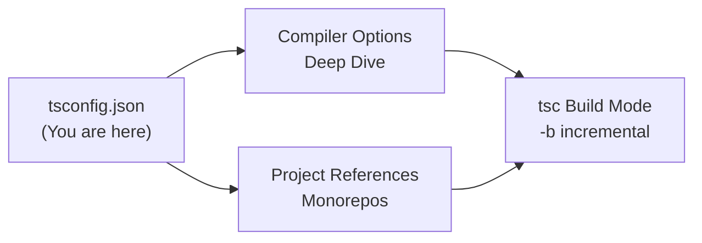
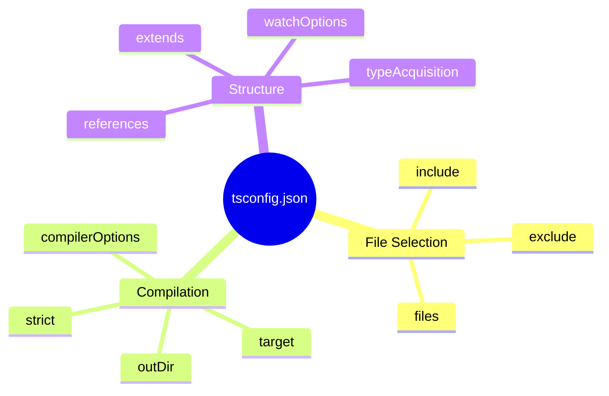
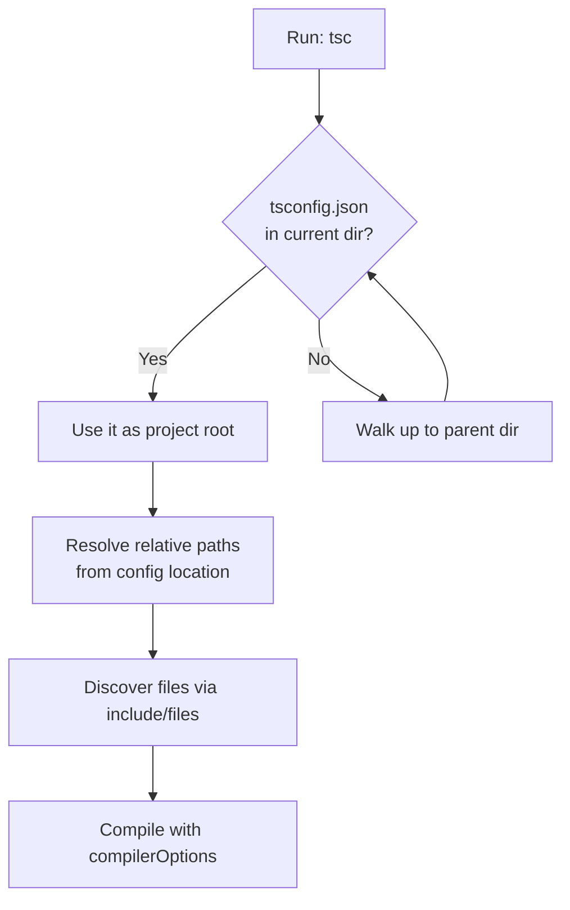

# tsconfig.json — Junior Level

## Table of Contents

1. [Introduction](#introduction)
2. [Prerequisites](#prerequisites)
3. [Glossary](#glossary)
4. [Core Concepts](#core-concepts)
5. [Real-World Analogies](#real-world-analogies)
6. [Mental Models](#mental-models)
7. [Pros & Cons](#pros--cons)
8. [Use Cases](#use-cases)
9. [Code Examples](#code-examples)
10. [Top-Level Fields](#top-level-fields)
11. [Clean Config](#clean-config)
12. [Error Handling](#error-handling)
13. [Security Considerations](#security-considerations)
14. [Performance Tips](#performance-tips)
15. [Best Practices](#best-practices)
16. [Edge Cases & Pitfalls](#edge-cases--pitfalls)
17. [Common Mistakes](#common-mistakes)
18. [Common Misconceptions](#common-misconceptions)
19. [Tricky Points](#tricky-points)
20. [Test](#test)
21. [Tricky Questions](#tricky-questions)
22. [Cheat Sheet](#cheat-sheet)
23. [Self-Assessment Checklist](#self-assessment-checklist)
24. [Summary](#summary)
25. [What You Can Build](#what-you-can-build)
26. [Further Reading](#further-reading)
27. [Related Topics](#related-topics)
28. [Diagrams & Visual Aids](#diagrams--visual-aids)

---

## Introduction

> Focus: "What is it?" and "How to use it?"

`tsconfig.json` is the configuration file that tells the TypeScript compiler (`tsc`) how to compile your project. It is a plain JSON file that lives at the root of a TypeScript project. When you run `tsc` without specifying any input files, the compiler looks for a `tsconfig.json` file, reads it, and uses its settings to decide **which files to compile**, **how to compile them**, and **where to put the output**.

Think of `tsconfig.json` as the "control panel" for TypeScript. Without it, every developer on your team would have to type a long list of command-line flags every time they compile. With it, those settings are written down once, committed to version control, and shared by everyone — including your editor (VS Code reads `tsconfig.json` to give you accurate red squiggles) and your CI pipeline.

The presence of a `tsconfig.json` file in a directory marks that directory as the **root of a TypeScript project**. This single fact drives a lot of TypeScript's behavior: file discovery, module resolution, and editor tooling all key off where the nearest `tsconfig.json` lives.

---

## Prerequisites

- **Required:** Basic knowledge of TypeScript — you can write a `.ts` file with type annotations
- **Required:** Node.js and `npm` installed, and TypeScript installed (`npm install -D typescript`)
- **Required:** Comfort reading JSON (objects, arrays, strings, booleans)
- **Helpful but not required:** Familiarity with the command line and running `npx tsc`
- **Helpful but not required:** Understanding of compiled vs interpreted languages

---

## Glossary

| Term | Definition |
|------|-----------|
| **tsconfig.json** | The JSON file that configures the TypeScript compiler for a project |
| **tsc** | The TypeScript compiler — the command-line tool that turns `.ts` into `.js` |
| **compilerOptions** | The object inside `tsconfig.json` that holds compiler flags like `target` and `strict` |
| **include** | An array of glob patterns describing which files belong to the project |
| **exclude** | An array of glob patterns describing which files to leave out |
| **files** | An explicit list of individual files to compile (no globs) |
| **extends** | A field that lets one `tsconfig.json` inherit settings from another |
| **glob** | A pattern like `src/**/*.ts` that matches many files at once |
| **outDir** | The folder where compiled `.js` files are written |
| **rootDir** | The folder that TypeScript treats as the base of your source files |
| **strict** | A flag that turns on all of TypeScript's strict type-checking rules |
| **JSON5 / JSONC** | A relaxed JSON dialect that allows comments and trailing commas — tsconfig uses it |

---

## Core Concepts

### Concept 1: A `tsconfig.json` Marks a Project Root

The most important idea: when `tsc` runs with no file arguments, it searches the current directory (and walks up the parent directories) for a `tsconfig.json`. The directory containing that file becomes the project root. All relative paths inside the config (`outDir`, `include`, etc.) are resolved relative to the location of the `tsconfig.json` itself — not relative to where you ran the command.

```json
{
  "compilerOptions": {
    "target": "ES2022",
    "module": "ESNext",
    "outDir": "./dist",
    "strict": true
  },
  "include": ["src"]
}
```

### Concept 2: tsconfig.json Is Special JSON (JSONC)

Although the file ends in `.json`, TypeScript reads it with a relaxed parser that allows **comments** (`//` and `/* */`) and **trailing commas**. This makes configs much easier to document.

```json
{
  "compilerOptions": {
    // The JS version your output should target
    "target": "ES2022",
    "strict": true, // trailing comma is allowed here
  }
}
```

### Concept 3: The Three Big Jobs of tsconfig.json

1. **File selection** — `include`, `exclude`, and `files` decide *which* files the compiler reads.
2. **Compilation behavior** — `compilerOptions` decides *how* those files are checked and emitted.
3. **Inheritance & structure** — `extends` and `references` let you share and split configuration across many configs.

### Concept 4: Minimal vs Full Config

A `tsconfig.json` can be as small as `{}`. An empty object is a valid config; TypeScript fills in defaults and compiles every `.ts` file under the project root. As your project grows you add fields to take control.

```json
{}
```

This empty config is perfectly valid. TypeScript will compile every `.ts`/`.tsx` file it can find under the folder.

---

## Real-World Analogies

| Concept | Analogy |
|---------|--------|
| **tsconfig.json** | The settings file for a video game — you set difficulty, controls, and graphics once, and every play session uses them |
| **include / exclude** | A guest list for a party — `include` says who is invited, `exclude` says who is removed from that list |
| **extends** | A recipe that says "start from grandma's base sauce, then add my own spices" — you inherit and override |
| **compilerOptions** | The knobs on a camera — ISO, shutter speed, aperture — each one changes how the final photo turns out |
| **strict mode** | Spell-check set to "pedantic" — it catches more mistakes but complains more |

---

## Mental Models

**The intuition:** `tsconfig.json` is a contract between you and the compiler. You write down your intentions ("treat null carefully", "output ES2022", "only look in `src`"), and the compiler honors them consistently every time, for everyone.

**Why this model helps:** When the compiler does something surprising — compiles a file you did not expect, or refuses to find a module — the answer is almost always in `tsconfig.json`. Train yourself to open it first. The config is the single source of truth for compiler behavior.

**Second model — the "nearest config wins":** Your editor finds the closest `tsconfig.json` above any open file and uses it. If you open a file and the types look wrong, check which config governs that file.

---

## Pros & Cons

| Pros | Cons |
|------|------|
| One place to configure the whole project | Many options — overwhelming at first |
| Shared by editor, `tsc`, and CI — consistency everywhere | Defaults change between TypeScript versions |
| Supports comments to document each setting | JSON has no logic — you cannot compute values |
| `extends` enables reusable base configs | Misconfigured `include`/`exclude` causes confusing "file not found" errors |
| Enables project references for big monorepos | Project references add setup complexity |

### When to use:
- Every TypeScript project — even a one-file script benefits from a config

### When NOT to use:
- Truly throwaway single-file experiments where you pass files directly to `tsc` (but even then a config is recommended)

---

## Use Cases

- **Use Case 1:** A Node.js backend — set `module`, `target`, `outDir`, and `strict`, point `include` at `src`.
- **Use Case 2:** A frontend app bundled by Vite/esbuild — set `noEmit: true` and `moduleResolution: "bundler"` so TypeScript only type-checks.
- **Use Case 3:** A shared library — enable `declaration: true` to emit `.d.ts` type files alongside the JavaScript.

---

## Code Examples

### Example 1: A Minimal Node.js Config

```json
{
  "compilerOptions": {
    "target": "ES2022",
    "module": "NodeNext",
    "moduleResolution": "NodeNext",
    "outDir": "./dist",
    "rootDir": "./src",
    "strict": true,
    "esModuleInterop": true,
    "skipLibCheck": true
  },
  "include": ["src/**/*"],
  "exclude": ["node_modules", "dist"]
}
```

**What it does:** Compiles every file under `src` into modern JavaScript inside `dist`, with strict type checking.
**How to run:** `npx tsc`

### Example 2: A Type-Check-Only Config (Frontend)

```json
{
  "compilerOptions": {
    "target": "ES2022",
    "module": "ESNext",
    "moduleResolution": "bundler",
    "lib": ["ES2022", "DOM", "DOM.Iterable"],
    "jsx": "react-jsx",
    "strict": true,
    "noEmit": true
  },
  "include": ["src"]
}
```

**What it does:** Type-checks the project but emits no files — a bundler like Vite handles the actual transpilation.
**How to run:** `npx tsc --noEmit` (or just `npx tsc` since `noEmit` is in the config)

### Example 3: Inheriting From a Base Config

```json
// tsconfig.base.json
{
  "compilerOptions": {
    "strict": true,
    "target": "ES2022",
    "esModuleInterop": true,
    "skipLibCheck": true
  }
}
```

```json
// tsconfig.json
{
  "extends": "./tsconfig.base.json",
  "compilerOptions": {
    "outDir": "./dist"
  },
  "include": ["src"]
}
```

**What it does:** The project config inherits all base settings and adds `outDir`. Multiple sub-projects can share the same base.
**How to run:** `npx tsc`

---

## Top-Level Fields

These are the fields that live at the **top level** of `tsconfig.json` (not inside `compilerOptions`):

| Field | Type | Purpose |
|-------|------|---------|
| `compilerOptions` | object | All the compiler flags (`target`, `strict`, `outDir`, etc.) |
| `include` | string[] | Glob patterns for files to include |
| `exclude` | string[] | Glob patterns to remove from the `include` set |
| `files` | string[] | Explicit list of files (no globs) |
| `extends` | string \| string[] | Path(s) to base config(s) to inherit from |
| `references` | object[] | Links to other TS projects (project references) |
| `watchOptions` | object | Settings for `tsc --watch` file watching |
| `typeAcquisition` | object | Controls automatic `@types` downloading (mostly for JS projects) |

### include vs files vs exclude

```json
{
  "compilerOptions": { "outDir": "dist" },

  // include: globs — TypeScript expands these to find files
  "include": ["src/**/*.ts"],

  // exclude: removes files that include would otherwise catch
  "exclude": ["src/**/*.test.ts"],

  // files: explicit list, takes priority, never affected by exclude
  "files": ["src/special-entry.ts"]
}
```

**Key rule:** If you specify neither `include` nor `files`, TypeScript includes **all** `.ts`/`.tsx`/`.d.ts` files in the project root and subfolders (minus default excludes like `node_modules`).

**Another key rule:** `exclude` only filters what `include` found. It does **not** remove files that are imported by an included file. If `a.ts` imports `b.ts`, excluding `b.ts` will not stop it from being compiled.

---

## Clean Config

### Keep It Readable

```json
// Messy — no organization, no comments
{ "compilerOptions": { "strict": true, "target": "ES2022", "outDir": "dist", "module": "NodeNext", "rootDir": "src", "esModuleInterop": true }, "include": ["src"] }
```

```json
// Clean — grouped logically, commented, one option per line
{
  "compilerOptions": {
    // Language & environment
    "target": "ES2022",
    "module": "NodeNext",
    "lib": ["ES2022"],

    // Output
    "outDir": "./dist",
    "rootDir": "./src",

    // Type checking
    "strict": true,
    "esModuleInterop": true
  },
  "include": ["src"],
  "exclude": ["node_modules", "dist"]
}
```

**Rules:**
- One option per line — never cram everything onto one line
- Group related options with comment headers
- Always list `exclude` even when it matches the defaults — it documents intent
- Prefer `include: ["src"]` over leaving it implicit, so the file set is obvious

---

## Error Handling

### Error 1: "No inputs were found in config file"

```bash
error TS18003: No inputs were found in config file 'tsconfig.json'.
Specified 'include' paths were '["src"]' and 'exclude' paths were '[]'.
```

**Why it happens:** Your `include` glob does not match any files — perhaps the `src` folder is empty or your files are in a different folder.
**How to fix:**

```json
{
  "include": ["src/**/*.ts"]   // make sure this path actually has .ts files
}
```

Verify with `ls src`. If your code is at the root, use `"include": ["./*.ts"]` or remove `include` to use the default.

### Error 2: "Cannot read file 'tsconfig.base.json'"

```bash
error TS5083: Cannot read file 'tsconfig.base.json'.
```

**Why it happens:** Your `extends` points to a path that does not exist. Local paths must start with `./` or `../`.
**How to fix:**

```json
{
  "extends": "./tsconfig.base.json"   // note the ./ prefix for a local file
}
```

### Error 3: Output Overwrites Source

```json
// Dangerous — outDir is the same place as your source
{
  "compilerOptions": { "outDir": "./src" },
  "include": ["src"]
}
```

**Why it happens:** If `outDir` overlaps with your source folder, compiled `.js` files land next to `.ts` files and clutter your tree (or worse, get re-compiled).
**How to fix:** Always send output to a separate folder like `dist` or `build`, and add that folder to `exclude` and `.gitignore`.

---

## Security Considerations

### 1. Do Not Commit Output or Build Caches

```json
// .gitignore should contain:
// dist/
// *.tsbuildinfo
```

**Risk:** Committing compiled output or `.tsbuildinfo` cache files can leak internal paths and create noisy diffs. Build artifacts belong in CI, not version control.
**Mitigation:** Keep `outDir` separate and gitignore it. The `tsconfig.json` source of truth is the only thing that should be committed.

### 2. Be Careful With `extends` From npm Packages

```json
{
  "extends": "@tsconfig/node20/tsconfig.json"
}
```

**Risk:** Extending a third-party config means trusting whatever compiler settings that package ships — including possibly loose settings that weaken type safety.
**Mitigation:** Review base configs from packages before adopting them, and override anything that loosens `strict`.

---

## Performance Tips

### Tip 1: Add `skipLibCheck`

```json
{
  "compilerOptions": {
    "skipLibCheck": true
  }
}
```

**Why it's faster:** It tells `tsc` not to type-check the `.d.ts` files inside `node_modules`. Those files are usually already valid, and skipping them can cut build time significantly on large dependency trees.

### Tip 2: Narrow Your `include`

```json
{
  "include": ["src"],
  "exclude": ["node_modules", "dist", "**/*.test.ts"]
}
```

**Why it helps:** The fewer files TypeScript reads, the less work it does. A precise `include` plus an `exclude` for tests and build output keeps the compilation unit small.

---

## Best Practices

- **Always start every project with a `tsconfig.json`** — even tiny ones. Generate a starting point with `npx tsc --init`.
- **Turn on `strict: true`** from day one. Adding it later means fixing a mountain of errors at once.
- **Use a separate `outDir`** (`dist`) and gitignore it.
- **Document non-obvious options** with comments — future you will thank you.
- **Use `extends`** to share a base config across multiple sub-projects instead of copy-pasting.
- **Keep `include` explicit** so anyone reading the file knows exactly what gets compiled.

---

## Edge Cases & Pitfalls

### Pitfall 1: `exclude` Does Not Stop Imported Files

```json
{
  "include": ["src/index.ts"],
  "exclude": ["src/secret.ts"]
}
```

```typescript
// src/index.ts
import { thing } from "./secret"; // secret.ts is STILL compiled!
```

**What happens:** Even though `secret.ts` is in `exclude`, it gets compiled because `index.ts` imports it. `exclude` only filters the *root* file discovery, not the dependency graph.
**How to fix:** Don't import files you intend to exclude, or restructure so excluded files aren't referenced.

### Pitfall 2: Forgetting That Paths Are Relative to the Config

```bash
# You run tsc from a different folder
cd ..
npx tsc -p ./myproject/tsconfig.json
```

**What happens:** `outDir: "./dist"` resolves relative to `myproject/`, not your current directory. Relative paths always anchor to the `tsconfig.json` location.
**How to fix:** Always think "relative to the config file," not "relative to my shell."

---

## Common Mistakes

### Mistake 1: Putting Top-Level Fields Inside `compilerOptions`

```json
// Wrong — include belongs at the top level, not inside compilerOptions
{
  "compilerOptions": {
    "strict": true,
    "include": ["src"]
  }
}
```

```json
// Correct
{
  "compilerOptions": {
    "strict": true
  },
  "include": ["src"]
}
```

### Mistake 2: Expecting JSON Comments to Break Tools

```json
{
  // This comment is fine for tsc...
  "compilerOptions": { "strict": true }
}
```

Some tools that read `tsconfig.json` with a strict JSON parser will choke on comments. `tsc` itself is fine, but be aware that not every tool tolerates JSONC.

---

## Common Misconceptions

### Misconception 1: "tsconfig.json compiles my code"

**Reality:** `tsconfig.json` is just data. The `tsc` compiler reads it. The file does nothing on its own — you still need to run `tsc` (or use a bundler/editor that reads the config).

**Why people think this:** Editors apply the config automatically, so it feels like the file "does" things.

### Misconception 2: "exclude removes files from the build entirely"

**Reality:** `exclude` only removes files from the initial discovery step. Any file reachable through an `import` from an included file is still compiled.

**Why people think this:** The word "exclude" sounds absolute, but in TypeScript it is a filter on the root set only.

### Misconception 3: "I must list every file in `files`"

**Reality:** You almost never use `files`. The `include` glob (or the default) handles file discovery. `files` is for special cases like a tiny single-entry project or fine-grained control in project references.

---

## Tricky Points

### Tricky Point 1: `extends` Merges Shallowly for Most Fields But Not Arrays

```json
// base.json
{ "compilerOptions": { "strict": true, "lib": ["ES2022"] } }
```

```json
// tsconfig.json
{
  "extends": "./base.json",
  "compilerOptions": { "lib": ["ES2022", "DOM"] }
}
```

**Why it's tricky:** `compilerOptions` from the child **overwrites** matching keys from the parent. The `lib` array is *replaced*, not merged — the child's `["ES2022", "DOM"]` fully wins. Also note: `files`, `include`, and `exclude` from a child config **override** (do not merge with) the parent's.
**Key takeaway:** Inheritance overwrites at the key level. Re-state full arrays in the child if you want to extend them.

---

## Test

### Multiple Choice

**1. Where do top-level fields like `include` belong?**

- A) Inside `compilerOptions`
- B) At the top level of `tsconfig.json`, as a sibling of `compilerOptions`
- C) In a separate `include.json` file
- D) On the command line only

<details>
<summary>Answer</summary>
**B)** — `include`, `exclude`, `files`, `extends`, and `references` are all siblings of `compilerOptions` at the top level. Putting `include` inside `compilerOptions` has no effect.
</details>

**2. What does an empty `{}` tsconfig.json do?**

- A) It is invalid and errors
- B) It compiles nothing
- C) It is valid and compiles all `.ts` files under the project root using defaults
- D) It deletes your source files

<details>
<summary>Answer</summary>
**C)** — `{}` is a valid config. TypeScript applies defaults and compiles every `.ts`/`.tsx`/`.d.ts` file it finds (minus `node_modules`).
</details>

### True or False

**3. `exclude` will stop a file from being compiled even if another file imports it.**

<details>
<summary>Answer</summary>
**False** — `exclude` only filters the initial file discovery. Files imported by included files are still compiled regardless of `exclude`.
</details>

**4. Relative paths in tsconfig.json are resolved relative to the config file's location.**

<details>
<summary>Answer</summary>
**True** — `outDir`, `include` globs, and `extends` paths all anchor to where the `tsconfig.json` lives, not to your shell's current directory.
</details>

### What's the Output?

**5. Given `include: ["src"]` and an empty `src` folder, what happens when you run `tsc`?**

<details>
<summary>Answer</summary>
You get `error TS18003: No inputs were found in config file`. The include glob matched zero files.
</details>

---

## Tricky Questions

**1. Which top-level field lets one config inherit from another?**

- A) `imports`
- B) `extends`
- C) `inherits`
- D) `base`

<details>
<summary>Answer</summary>
**B)** — `extends` takes a path (or array of paths) to base config files to inherit from.
</details>

**2. If both `files` and `exclude` list the same file, what happens?**

- A) The file is excluded
- B) tsc errors
- C) The file is still included — `exclude` never affects `files`
- D) Undefined behavior

<details>
<summary>Answer</summary>
**C)** — `files` is an explicit list that `exclude` does not touch. `exclude` only filters the `include` glob results.
</details>

**3. Can `tsconfig.json` contain comments?**

- A) No, it is strict JSON
- B) Yes, tsc parses it as JSONC (JSON with comments)
- C) Only block comments
- D) Only at the top of the file

<details>
<summary>Answer</summary>
**B)** — TypeScript reads `tsconfig.json` as JSONC, allowing both `//` line comments and `/* */` block comments, plus trailing commas.
</details>

---

## Cheat Sheet

| What | Field / Command | Example |
|------|-----------------|---------|
| Create a starter config | `tsc --init` | Generates a commented `tsconfig.json` |
| Compile the project | `tsc` | Reads nearest `tsconfig.json` |
| Use a specific config | `tsc -p path/to/tsconfig.json` | `tsc -p tsconfig.build.json` |
| Include files | `include` | `"include": ["src/**/*"]` |
| Exclude files | `exclude` | `"exclude": ["node_modules", "dist"]` |
| Explicit file list | `files` | `"files": ["main.ts"]` |
| Inherit a base config | `extends` | `"extends": "./tsconfig.base.json"` |
| Output folder | `outDir` | `"outDir": "./dist"` |
| Turn on strict checks | `strict` | `"strict": true` |
| Type-check only | `noEmit` | `"noEmit": true` |

---

## Self-Assessment Checklist

### I can explain:
- [ ] What `tsconfig.json` is and why it exists
- [ ] The difference between `include`, `exclude`, and `files`
- [ ] What `extends` does
- [ ] Why relative paths anchor to the config file

### I can do:
- [ ] Generate a config with `tsc --init`
- [ ] Write a minimal Node.js `tsconfig.json` from scratch
- [ ] Set up `outDir` and exclude it from git
- [ ] Inherit settings from a base config

### I can answer:
- [ ] All multiple choice questions in this document

---

## Summary

- `tsconfig.json` is the configuration file that tells the TypeScript compiler which files to compile and how.
- Its presence marks a directory as a TypeScript project root.
- Top-level fields include `compilerOptions`, `include`, `exclude`, `files`, `extends`, and `references`.
- `include`/`exclude` use globs; `files` is an explicit list; `exclude` only filters discovery, not imports.
- `extends` enables config inheritance and reuse.
- Relative paths resolve relative to the config file's own location.

**Next step:** Learn the structure in depth at the Middle level — globs, base configs, and `tsc --init` output.

---

## What You Can Build

### Projects you can create:
- **Config Generator CLI:** A small script that scaffolds a tailored `tsconfig.json` based on answers (Node vs browser, strict vs loose).
- **Config Linter:** A tool that reads a `tsconfig.json` and warns about risky settings (`outDir` overlapping source, missing `strict`).
- **Monorepo Starter:** A template repo with a base config and two sub-packages that extend it.

### Learning path — what to study next:



---

## Further Reading

- **Official docs:** [What is a tsconfig.json](https://www.typescriptlang.org/docs/handbook/tsconfig-json.html)
- **Reference:** [tsconfig reference — every option](https://www.typescriptlang.org/tsconfig)
- **Base configs:** [github.com/tsconfig/bases](https://github.com/tsconfig/bases) — community base configs like `@tsconfig/node20`
- **Project references:** [Project References handbook](https://www.typescriptlang.org/docs/handbook/project-references.html)

---

## Related Topics

- **Compiler Options** — the deep dive into every flag inside `compilerOptions`
- **tsc** — the compiler command-line tool that reads this config
- **ts-node** — running TypeScript directly, which also reads `tsconfig.json`

---

## Diagrams & Visual Aids

### Mind Map



### How tsc Finds the Config



### tsconfig.json Anatomy

```
+--------------------------------------------------+
|                tsconfig.json                     |
|--------------------------------------------------|
| extends         | inherit a base config          |
| compilerOptions | target, strict, outDir, ...    |
| include         | ["src/**/*"]  (globs)           |
| exclude         | ["node_modules", "dist"]       |
| files           | ["main.ts"]   (explicit)       |
| references      | [{ path: "../core" }]          |
| watchOptions    | watch behavior for --watch     |
| typeAcquisition | auto @types for JS projects    |
+--------------------------------------------------+
```
