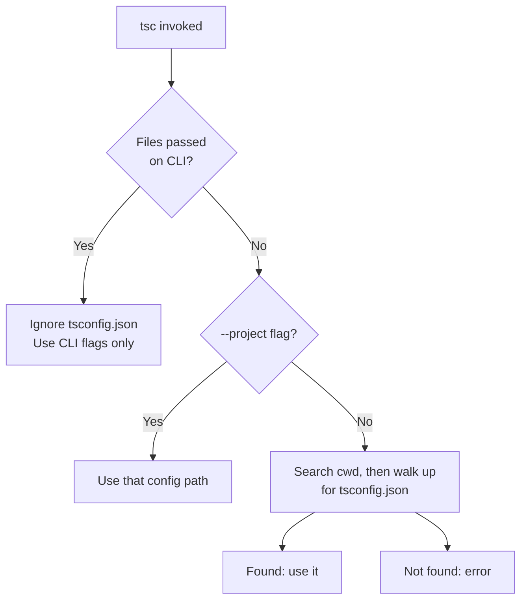
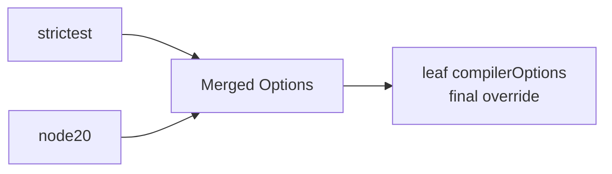
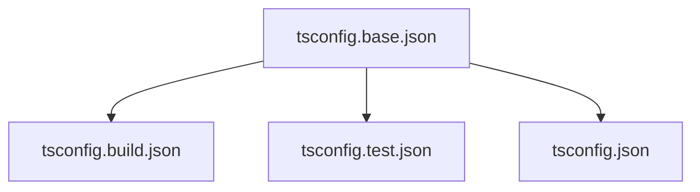

# tsconfig.json — Middle Level

## Table of Contents

1. [Prerequisites](#prerequisites)
2. [Why & When](#why--when)
3. [How tsc Discovers tsconfig.json](#how-tsc-discovers-tsconfigjson)
4. [Deep Dive: Top-Level Fields](#deep-dive-top-level-fields)
5. [Glob Patterns in include & exclude](#glob-patterns-in-include--exclude)
6. [Config Inheritance with extends](#config-inheritance-with-extends)
7. [Community Base Configs](#community-base-configs)
8. [The Most Important compilerOptions](#the-most-important-compileroptions)
9. [Splitting Configs](#splitting-configs)
10. [watchOptions](#watchoptions)
11. [typeAcquisition](#typeacquisition)
12. [Real-World tsconfig Examples](#real-world-tsconfig-examples)
13. [Patterns](#patterns)
14. [Best Practices](#best-practices)
15. [Common Mistakes](#common-mistakes)
16. [Edge Cases](#edge-cases)
17. [Middle Checklist](#middle-checklist)
18. [Test](#test)
19. [Summary](#summary)
20. [Further Reading](#further-reading)

---

## Prerequisites

- Comfortable writing TypeScript with interfaces, generics, and union types
- Have run `tsc` and seen compiled output in an `outDir`
- Understand the difference between `compilerOptions` and the top-level fields
- Have used `npm`/`pnpm`/`yarn` to install dev dependencies

---

## Why & When

> Focus: "Why does this exist?" and "When do I reach for each feature?"

At the junior level you learned *what* `tsconfig.json` is. Now we focus on *why* its structure is the way it is and *when* to use each capability.

A `tsconfig.json` exists to make compilation **reproducible** and **shared**. Three different consumers read the same file:

1. **The CLI compiler `tsc`** — for builds and CI type-checking.
2. **The TypeScript Language Server** — powering your editor's autocomplete, errors, and refactors.
3. **Other tooling** — ts-node, ESLint's type-aware rules, bundler plugins (`@vitejs/plugin-react`, `ts-loader`), and test runners (Vitest, Jest with `ts-jest`).

If any of these disagreed about settings, you'd get "it compiles but my editor shows errors" confusion. A single `tsconfig.json` is the contract that keeps them aligned.

**When to add structure:**
- Small project → one flat `tsconfig.json`.
- Multiple build targets (app vs tests vs build) → split configs with `extends`.
- Monorepo with internal packages → project `references`.

---

## How tsc Discovers tsconfig.json

When you invoke `tsc`, file discovery follows clear rules:

```bash
# Case 1: no arguments — search for config
tsc
# Looks for ./tsconfig.json, then walks UP the directory tree
# until it finds one (or hits the filesystem root).

# Case 2: explicit project flag — use this exact config
tsc --project ./configs/tsconfig.app.json
tsc -p ./configs/tsconfig.app.json   # short form

# Case 3: explicit files — IGNORES tsconfig.json entirely
tsc src/index.ts
# When you pass files directly, tsc does NOT read any tsconfig.json.
# Compiler options must come from the command line.
```



**Critical gotcha:** Passing any file argument disables `tsconfig.json` reading. `tsc src/index.ts` will not apply your config's `strict` or `outDir`. To compile one file *with* the config, you cannot use this form — instead narrow `include` or use a separate config.

---

## Deep Dive: Top-Level Fields

```json
{
  "extends": "./tsconfig.base.json",
  "compilerOptions": {
    "outDir": "./dist",
    "rootDir": "./src"
  },
  "include": ["src/**/*"],
  "exclude": ["**/*.test.ts"],
  "files": ["src/global.d.ts"],
  "references": [{ "path": "../shared" }],
  "watchOptions": {
    "watchFile": "useFsEvents",
    "excludeDirectories": ["**/node_modules", "dist"]
  },
  "typeAcquisition": {
    "enable": false
  }
}
```

| Field | When you reach for it |
|-------|------------------------|
| `compilerOptions` | Always — controls target, module, strictness, output |
| `include` | To scope the project to a folder like `src` |
| `exclude` | To drop tests, build output, or generated files from discovery |
| `files` | Rarely — explicit entry points or forcing a `.d.ts` to load |
| `extends` | To share a base config across sub-projects |
| `references` | Monorepos / multi-package builds with `tsc -b` |
| `watchOptions` | Tuning `--watch` on large repos or network filesystems |
| `typeAcquisition` | Mostly JS projects in editors; usually disabled in TS projects |

---

## Glob Patterns in include & exclude

TypeScript supports a specific set of glob wildcards:

| Wildcard | Meaning |
|----------|---------|
| `*` | Matches zero or more characters (excluding path separators) |
| `?` | Matches exactly one character (excluding path separators) |
| `**/` | Matches any directory nested to any depth |

```json
{
  "include": [
    "src/**/*",          // everything under src, any depth
    "types/*.d.ts",      // only .d.ts files directly in types/
    "scripts/build.ts"   // a single specific file
  ],
  "exclude": [
    "node_modules",      // default, but explicit is clearer
    "dist",
    "**/*.test.ts",      // any test file anywhere
    "**/__mocks__/**"    // mock folders anywhere
  ]
}
```

### Implicit Extensions

If a glob in `include` does **not** specify a file extension, TypeScript automatically appends `.ts`, `.tsx`, and `.d.ts` (and `.js`/`.jsx` when `allowJs` is on). So `"src/**/*"` is equivalent to `"src/**/*.ts"`, `"src/**/*.tsx"`, and `"src/**/*.d.ts"` combined.

### Default Excludes

Even if you write no `exclude`, TypeScript always excludes:
- `node_modules`
- `bower_components`
- `jspm_packages`
- the `outDir`

**But beware:** the moment you specify your *own* `exclude`, you replace the defaults except for `outDir`. Always re-add `node_modules` if you customize `exclude`... actually `node_modules` stays excluded by default discovery, but listing it explicitly avoids surprises with tooling.

### include Order Does Not Matter; Specificity Does Not Either

Unlike `.gitignore`, the order of patterns doesn't matter. The final set is: `(files) ∪ (include globs) − (exclude globs)`. `files` entries are never removed by `exclude`.

---

## Config Inheritance with extends

`extends` lets a config inherit from one or more base configs.

```json
// tsconfig.base.json — shared rules
{
  "compilerOptions": {
    "target": "ES2022",
    "module": "NodeNext",
    "strict": true,
    "esModuleInterop": true,
    "skipLibCheck": true,
    "forceConsistentCasingInFileNames": true
  }
}
```

```json
// tsconfig.json — the actual build config
{
  "extends": "./tsconfig.base.json",
  "compilerOptions": {
    "outDir": "./dist",
    "rootDir": "./src"
  },
  "include": ["src"]
}
```

### Inheritance Rules You Must Know

1. **`compilerOptions` merge key-by-key.** The child's keys override the parent's; keys only in the parent are kept.
2. **Arrays are replaced, not concatenated.** If the parent sets `lib: ["ES2022"]` and the child sets `lib: ["DOM"]`, the result is `["DOM"]`.
3. **`files`, `include`, `exclude` from the child *replace* the parent's** (they do not merge). If the child omits `include`, it inherits the parent's `include`.
4. **Relative paths in the base config are resolved relative to the base config's location** — except `outDir`, `declarationDir`, `rootDir`, etc., which the docs note are relative to the inheriting config's directory in newer versions. (When in doubt, set output paths in the leaf config.)
5. **`references` are never inherited.**

### Extending Multiple Configs (TypeScript 5.0+)

```json
{
  "extends": [
    "@tsconfig/strictest/tsconfig.json",
    "@tsconfig/node20/tsconfig.json"
  ],
  "compilerOptions": {
    "outDir": "./dist"
  }
}
```

When you pass an array, later entries override earlier ones. The leaf `compilerOptions` override all of them.



---

## Community Base Configs

The `@tsconfig/*` packages provide battle-tested base configs so you don't reinvent target/lib settings for each runtime.

```bash
npm install -D @tsconfig/node20
```

```json
{
  "extends": "@tsconfig/node20/tsconfig.json",
  "compilerOptions": {
    "outDir": "dist"
  },
  "include": ["src"]
}
```

| Package | Use for |
|---------|---------|
| `@tsconfig/node20` | Node.js 20 backends — sets `target`, `lib`, `module` correctly |
| `@tsconfig/node22` | Node.js 22 backends |
| `@tsconfig/strictest` | Maximum strictness — every safety flag on |
| `@tsconfig/recommended` | Sensible defaults for any project |
| `@tsconfig/bun` | Bun runtime |
| `@tsconfig/vite-react` | Vite + React frontends |

These are resolved like any npm module — TypeScript looks them up in `node_modules`, which is why no `./` prefix is used.

---

## The Most Important compilerOptions

This topic is about *structure*; the full per-option deep dive belongs to the sibling "Compiler Options" topic. But you must know the handful that shape every config:

```json
{
  "compilerOptions": {
    // --- Language & environment ---
    "target": "ES2022",        // JS version of emitted code
    "lib": ["ES2022"],         // built-in type definitions available
    "module": "NodeNext",      // module system of emitted code
    "moduleResolution": "NodeNext", // how imports are resolved

    // --- Output ---
    "outDir": "./dist",        // where .js goes
    "rootDir": "./src",        // base of source tree (mirrors structure in outDir)
    "declaration": true,       // emit .d.ts files
    "sourceMap": true,         // emit .js.map for debugging

    // --- Type checking ---
    "strict": true,            // master switch for strict checks
    "noUncheckedIndexedAccess": true, // arr[i] is T | undefined

    // --- Interop & performance ---
    "esModuleInterop": true,   // smoother CommonJS/ESM interop
    "skipLibCheck": true,      // skip type-checking node_modules .d.ts
    "noEmit": false            // set true for type-check-only projects
  }
}
```

**Mental grouping:**
- `target` + `lib` + `module` + `moduleResolution` describe the *runtime environment*.
- `outDir` + `rootDir` + `declaration` + `sourceMap` describe the *output*.
- `strict` and friends describe *how picky* the type checker is.

---

## Splitting Configs

A common real-world pattern is to split one logical project into several config files that share a base. This solves the problem where your app, your tests, and your build all need slightly different settings.

```json
// tsconfig.json — the "editor/IDE" config (sees everything)
{
  "extends": "./tsconfig.base.json",
  "compilerOptions": { "noEmit": true },
  "include": ["src", "tests"]
}
```

```json
// tsconfig.build.json — production build (no tests, emits output)
{
  "extends": "./tsconfig.base.json",
  "compilerOptions": {
    "outDir": "./dist",
    "rootDir": "./src"
  },
  "include": ["src"],
  "exclude": ["**/*.test.ts", "**/*.spec.ts"]
}
```

```bash
# Editor uses tsconfig.json automatically (full project incl. tests)
# CI build uses the narrowed build config:
tsc -p tsconfig.build.json
```

**Why split?** Your editor should type-check test files (so you get errors while writing tests), but your production build should not emit compiled test files into `dist`. Two configs, one base, no duplication.

---

## watchOptions

`watchOptions` tunes how `tsc --watch` (and editors) monitor the filesystem. Most projects never touch it, but it matters on large repos, Docker volumes, or network drives where the default watcher is slow or misses changes.

```json
{
  "watchOptions": {
    // How individual files are watched
    "watchFile": "useFsEvents",
    // How directories are watched
    "watchDirectory": "useFsEvents",
    // Strategy when many files change at once
    "fallbackPolling": "dynamicPriority",
    // Skip watching huge folders
    "excludeDirectories": ["**/node_modules", "dist"],
    "excludeFiles": ["build/generated.ts"]
  }
}
```

| Option | Values | Purpose |
|--------|--------|---------|
| `watchFile` | `fixedPollingInterval`, `priorityPollingInterval`, `dynamicPriorityPolling`, `useFsEvents`, `useFsEventsOnParentDirectory` | File watch strategy |
| `watchDirectory` | similar set | Directory watch strategy |
| `fallbackPolling` | polling strategies | What to do when native events are unavailable |
| `excludeDirectories` | glob[] | Directories to never watch (big perf win) |
| `excludeFiles` | glob[] | Specific files to ignore |

---

## typeAcquisition

`typeAcquisition` controls **automatic** download of `@types` packages. This is primarily a feature for **JavaScript** projects opened in an editor — TypeScript fetches type definitions for libraries so you get autocomplete even without manually installing `@types/*`.

```json
{
  "typeAcquisition": {
    "enable": true,
    "include": ["jquery", "lodash"],
    "exclude": ["express"],
    "disableFilenameBasedTypeAcquisition": false
  }
}
```

| Option | Purpose |
|--------|---------|
| `enable` | Turn automatic type acquisition on/off (default: on for JS, off for TS) |
| `include` | Force-acquire types for these packages |
| `exclude` | Never auto-acquire types for these |
| `disableFilenameBasedTypeAcquisition` | Stop inferring `@types` from filenames like `jquery.js` |

**For pure TypeScript projects:** you install `@types/*` explicitly as dev dependencies, so `typeAcquisition` is usually irrelevant or set to `{ "enable": false }`.

---

## Real-World tsconfig Examples

### Node.js + ESM Backend

```json
{
  "compilerOptions": {
    "target": "ES2022",
    "module": "NodeNext",
    "moduleResolution": "NodeNext",
    "outDir": "dist",
    "rootDir": "src",
    "declaration": true,
    "sourceMap": true,
    "strict": true,
    "esModuleInterop": true,
    "skipLibCheck": true,
    "forceConsistentCasingInFileNames": true
  },
  "include": ["src"],
  "exclude": ["node_modules", "dist", "**/*.test.ts"]
}
```

### React App (Vite, type-check only)

```json
{
  "compilerOptions": {
    "target": "ES2022",
    "lib": ["ES2022", "DOM", "DOM.Iterable"],
    "module": "ESNext",
    "moduleResolution": "bundler",
    "jsx": "react-jsx",
    "strict": true,
    "noEmit": true,
    "allowImportingTsExtensions": true,
    "verbatimModuleSyntax": true,
    "skipLibCheck": true
  },
  "include": ["src"]
}
```

### Publishable Library

```json
{
  "compilerOptions": {
    "target": "ES2020",
    "module": "ESNext",
    "moduleResolution": "Bundler",
    "outDir": "dist",
    "rootDir": "src",
    "declaration": true,
    "declarationMap": true,
    "sourceMap": true,
    "strict": true,
    "stripInternal": true
  },
  "include": ["src"],
  "exclude": ["**/*.test.ts"]
}
```

### Monorepo Package (project reference)

```json
{
  "extends": "../../tsconfig.base.json",
  "compilerOptions": {
    "composite": true,
    "outDir": "dist",
    "rootDir": "src"
  },
  "references": [{ "path": "../utils" }],
  "include": ["src"]
}
```

---

## Patterns

### Pattern 1: Base + Leaf Configs

**Intent:** Share strictness/target across every config in the repo.
**When to use:** Any repo with more than one config file.

```json
// tsconfig.base.json — no include, no outDir, just shared rules
{
  "compilerOptions": {
    "strict": true,
    "target": "ES2022",
    "esModuleInterop": true,
    "skipLibCheck": true
  }
}
```

Every leaf config does `"extends": "./tsconfig.base.json"` and adds only what is unique to it.

### Pattern 2: Separate Test Config

**Intent:** Keep test files out of the production build but still type-checked.

```json
// tsconfig.test.json
{
  "extends": "./tsconfig.base.json",
  "compilerOptions": { "noEmit": true, "types": ["node", "vitest/globals"] },
  "include": ["src", "tests"]
}
```



---

## Best Practices

- **One base config per repo** that holds strictness and target; leaf configs add output/include.
- **Never pass files directly to `tsc`** when you want config applied — use `-p`.
- **Keep `outDir` out of `include`** and out of git.
- **Use `@tsconfig/*` bases** for runtime-specific target/lib so you don't hand-tune them.
- **Re-state arrays** (`lib`, `types`) fully in the child config since they replace, not merge.
- **Split build vs editor configs** when tests need different emit behavior than the app.

---

## Common Mistakes

### Mistake 1: Expecting Arrays to Merge Across extends

```json
// base: lib = ["ES2022"]
// child:
{ "extends": "./base.json", "compilerOptions": { "lib": ["DOM"] } }
// Result: lib = ["DOM"]  — ES2022 is GONE, not merged
```

Always restate the full array: `"lib": ["ES2022", "DOM"]`.

### Mistake 2: Local extends Without `./`

```json
// Wrong — TypeScript treats this as an npm package lookup
{ "extends": "tsconfig.base.json" }

// Correct — local file needs ./ or ../
{ "extends": "./tsconfig.base.json" }
```

### Mistake 3: Customizing exclude and Losing Test Filtering

```json
// You add a custom exclude but forget your old patterns
{ "exclude": ["dist"] }   // tests are no longer excluded!
```

When you set `exclude`, list everything you need; it fully replaces defaults (except `outDir`).

---

## Edge Cases

### Edge Case 1: An Imported File Outside `include`

If a file in `include` imports a file *outside* `include` (and not in `exclude`), that imported file is still compiled. The compilation unit is `include ∪ everything reachable by imports`.

### Edge Case 2: `extends` Chains

You can chain `extends` (A extends B extends C). TypeScript resolves the chain fully, applying overrides from the outermost (leaf) config last.

### Edge Case 3: A Glob With No Extension and `allowJs`

`"include": ["src/**/*"]` with `allowJs: true` also pulls in `.js`/`.jsx` files. Without `allowJs`, those are ignored.

---

## Middle Checklist

- [ ] Repo has a single `tsconfig.base.json` with shared strictness/target.
- [ ] Leaf configs `extend` the base and only add unique settings.
- [ ] `include` is explicit (e.g., `["src"]`), `exclude` lists tests + build output.
- [ ] Production build uses a dedicated config (`tsconfig.build.json`).
- [ ] Arrays (`lib`, `types`) are fully restated when overridden via `extends`.
- [ ] `outDir` is gitignored and never inside `include`.

---

## Test

### Multiple Choice

**1. What happens when you run `tsc src/index.ts` in a project with a tsconfig.json?**

- A) The config is applied to that file
- B) The config is ignored; only CLI flags apply
- C) tsc errors
- D) Both the config and CLI flags merge

<details>
<summary>Answer</summary>
**B)** — Passing files directly to `tsc` disables `tsconfig.json` reading entirely.
</details>

**2. If base sets `lib: ["ES2022"]` and child sets `lib: ["DOM"]`, the result is:**

- A) `["ES2022", "DOM"]`
- B) `["DOM"]`
- C) `["ES2022"]`
- D) Error

<details>
<summary>Answer</summary>
**B)** — Arrays are replaced, not merged, across `extends`.
</details>

### True or False

**3. `@tsconfig/node20` is referenced with a `./` prefix.**

<details>
<summary>Answer</summary>
**False** — It is an npm package, resolved from `node_modules`, so no `./` prefix is used: `"extends": "@tsconfig/node20/tsconfig.json"`.
</details>

**4. `exclude` patterns are replaced (not merged) by a child config that defines its own `exclude`.**

<details>
<summary>Answer</summary>
**True** — `include`, `exclude`, and `files` from a child fully replace the parent's.
</details>

---

## Summary

- `tsc` discovers config by walking up directories, unless you pass `-p` or explicit files (which disables config reading).
- Globs in `include`/`exclude` support `*`, `?`, and `**`; extensions are auto-appended when omitted.
- `extends` merges `compilerOptions` key-by-key but replaces arrays and the file-selection fields.
- Community `@tsconfig/*` base configs encode correct target/lib per runtime.
- Splitting into base + build + test configs is the standard real-world layout.

**Next step:** The Senior level covers project references architecture, incremental builds, and monorepo strategy.

---

## Further Reading

- [tsconfig.json handbook](https://www.typescriptlang.org/docs/handbook/tsconfig-json.html)
- [The full tsconfig reference](https://www.typescriptlang.org/tsconfig)
- [tsconfig/bases repository](https://github.com/tsconfig/bases)
- [Project References](https://www.typescriptlang.org/docs/handbook/project-references.html)
