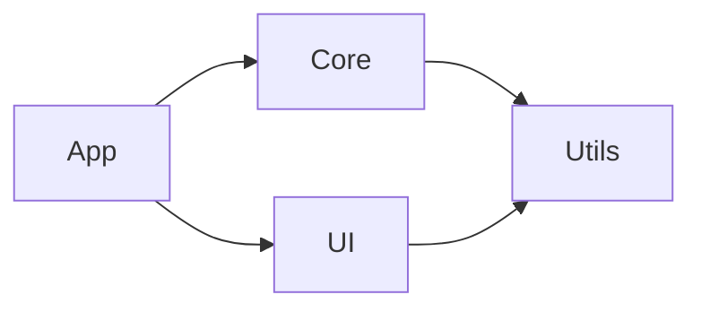
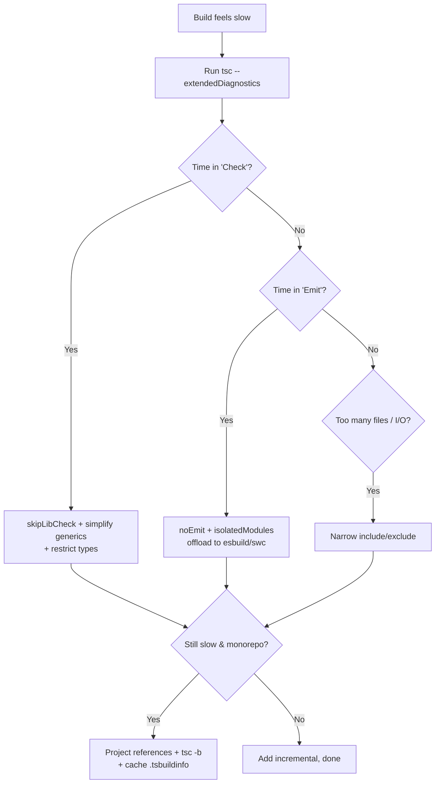

# tsconfig.json — Optimization Guide

> 12+ exercises focused on speeding up TypeScript builds and type-checks **through configuration**.
> Each entry states the problem, the config change, the expected improvement, and how to measure it.
> Measure before and after — `time tsc` (or `time tsc -b`) is your friend.

## Table of Contents

1. [Optimization 1: skipLibCheck](#optimization-1-skiplibcheck)
2. [Optimization 2: Incremental Builds](#optimization-2-incremental-builds)
3. [Optimization 3: Project References](#optimization-3-project-references)
4. [Optimization 4: Narrow include / exclude](#optimization-4-narrow-include--exclude)
5. [Optimization 5: noEmit + Bundler Transpile](#optimization-5-noemit--bundler-transpile)
6. [Optimization 6: isolatedModules](#optimization-6-isolatedmodules)
7. [Optimization 7: Restrict types](#optimization-7-restrict-types)
8. [Optimization 8: assumeChangesOnlyAffectDirectDependencies](#optimization-8-assumechangesonlyaffectdirectdependencies)
9. [Optimization 9: Disable sourceMap/declarationMap in CI](#optimization-9-disable-sourcemapdeclarationmap-in-ci)
10. [Optimization 10: Cache .tsbuildinfo in CI](#optimization-10-cache-tsbuildinfo-in-ci)
11. [Optimization 11: Tune watchOptions](#optimization-11-tune-watchoptions)
12. [Optimization 12: disableSourceOfProjectReferenceRedirect](#optimization-12-disablesourceofprojectreferenceredirect)
13. [Diagnostics & Profiling](#diagnostics--profiling)
14. [Optimization Summary Table](#optimization-summary-table)

---

## Optimization 1: skipLibCheck

**Problem:** Cold `tsc` spends a large fraction of its time type-checking `.d.ts` files inside `node_modules` (especially big libraries like `@types/node`, AWS SDK, etc.).

```json
{
  "compilerOptions": {
    "skipLibCheck": true
  }
}
```

```bash
# Measure
time tsc --noEmit              # before
# add skipLibCheck, then:
time tsc --noEmit              # after
```

**Expected improvement:** Often 20–40% off cold type-check time on dependency-heavy projects.

**Trade-off:** It skips checking declaration files, so a broken `.d.ts` (or a conflict between two `@types` versions) won't be caught. Usually worth it; just be aware.

---

## Optimization 2: Incremental Builds

**Problem:** Every `tsc` run is a full rebuild, even when almost nothing changed.

```json
{
  "compilerOptions": {
    "incremental": true,
    "tsBuildInfoFile": "./.cache/tsconfig.tsbuildinfo"
  }
}
```

```bash
time tsc --noEmit   # first run (cold) writes .tsbuildinfo
time tsc --noEmit   # second run (warm, no changes) — near-instant
```

**Expected improvement:** Warm no-change runs go from full time to a few hundred milliseconds. The bigger the project, the bigger the win.

**How it works:** `.tsbuildinfo` stores file hashes + `.d.ts` signatures; unchanged files are skipped, and dependents are only rebuilt if a signature changed.

---

## Optimization 3: Project References

**Problem:** A monorepo with one giant `tsconfig.json` re-type-checks the entire codebase on every change.



```json
// solution root tsconfig.json
{ "files": [], "references": [
  { "path": "packages/utils" },
  { "path": "packages/core" },
  { "path": "packages/ui" },
  { "path": "packages/app" }
] }
```

```bash
tsc -b           # builds in dependency order, skips up-to-date projects
tsc -b --verbose # shows which projects were rebuilt and why
```

**Expected improvement:** After a change to one package, only that package and its dependents rebuild. On large repos this turns minute-long rebuilds into seconds.

---

## Optimization 4: Narrow include / exclude

**Problem:** TypeScript is reading more files than the build needs — tests, fixtures, generated code, stories.

```json
{
  "include": ["src"],
  "exclude": [
    "node_modules",
    "dist",
    "**/*.test.ts",
    "**/*.spec.ts",
    "**/*.stories.tsx",
    "**/__fixtures__/**",
    "**/__generated__/**"
  ]
}
```

**Expected improvement:** Fewer files = less parsing, binding, and checking. The savings scale with how much non-production code you drop from the build config.

**Tip:** Keep a separate config that *does* include tests for the editor; the production build config stays lean.

---

## Optimization 5: noEmit + Bundler Transpile

**Problem:** You run `tsc` for emit AND your bundler also transpiles — duplicate work.

```json
{
  "compilerOptions": {
    "noEmit": true,
    "moduleResolution": "bundler"
  }
}
```

```bash
# TypeScript only type-checks (no JS emit); the bundler (Vite/esbuild/swc) does transpilation
tsc --noEmit     # fast type-check gate
vite build       # actual output
```

**Expected improvement:** `tsc` skips the entire emit phase. esbuild/swc transpile far faster than `tsc`'s emitter, and you keep full type safety via the separate `--noEmit` check.

---

## Optimization 6: isolatedModules

**Problem:** Your bundler transpiles each file independently (esbuild/swc) but some TS features (const enums, certain re-exports) require whole-program info, causing subtle breakage or forcing slower paths.

```json
{
  "compilerOptions": {
    "isolatedModules": true,
    "verbatimModuleSyntax": true
  }
}
```

**Expected improvement:** Not a direct speedup of `tsc`, but it guarantees per-file transpilation is safe, letting you fully offload emit to esbuild/swc (which is dramatically faster). `isolatedModules` makes the "tsc type-checks, esbuild emits" split reliable.

---

## Optimization 7: Restrict types

**Problem:** TypeScript auto-includes **every** package under `node_modules/@types`, loading global declarations you don't use (and that slow down checking).

```json
{
  "compilerOptions": {
    "types": ["node"]
  }
}
```

**Expected improvement:** Limits global type loading to exactly what you list. On projects with many `@types/*` transitive deps, this trims parsing/binding of unused global declarations.

**Caution:** Once you set `types`, only the listed packages' globals are available — explicitly add what you actually need (e.g., `["node", "vitest/globals"]`).

---

## Optimization 8: assumeChangesOnlyAffectDirectDependencies

**Problem:** Incremental/watch rebuilds still recompute the full affected-file set, which can be expensive on huge graphs.

```json
{
  "compilerOptions": {
    "assumeChangesOnlyAffectDirectDependencies": true
  }
}
```

**Expected improvement:** `tsc --watch` becomes faster by assuming a change only affects direct importers, skipping deep transitive recomputation.

**Trade-off:** Less precise — in rare cases a needed rebuild is skipped, so it is best for the **watch/dev** loop, not necessarily the authoritative CI build.

---

## Optimization 9: Disable sourceMap/declarationMap in CI

**Problem:** Emitting source maps and declaration maps in CI type-check/build steps that don't need them wastes time and disk.

```json
// tsconfig.ci.json
{
  "extends": "./tsconfig.build.json",
  "compilerOptions": {
    "sourceMap": false,
    "declarationMap": false
  }
}
```

**Expected improvement:** Skips map generation/writing. Modest but free when CI only needs type-checking or production artifacts without maps. Keep maps on in dev configs.

---

## Optimization 10: Cache .tsbuildinfo in CI

**Problem:** CI starts cold every run, so incremental builds never benefit.

```bash
# Conceptual CI cache
# key: ts-${{ hashFiles('**/*.ts', '**/tsconfig*.json') }}-${{ matrix.ts-version }}
# restore-paths: **/.tsbuildinfo, **/dist
tsc -b
# save the same paths after the step
```

**Expected improvement:** A warm cache turns a full type-check into a near-no-op when source is unchanged (e.g., docs-only PRs). The biggest single CI win for large repos.

**Must-do:** Include the TypeScript version in the cache key — `.tsbuildinfo` is version-bound and a TS upgrade forces a full rebuild anyway.

---

## Optimization 11: Tune watchOptions

**Problem:** `tsc --watch` (or the editor) pegs the CPU, especially on Docker bind-mounts or network drives, because it watches too much (including `node_modules`).

```json
{
  "watchOptions": {
    "watchFile": "useFsEvents",
    "watchDirectory": "useFsEvents",
    "fallbackPolling": "dynamicPriority",
    "excludeDirectories": ["**/node_modules", "dist", ".cache"]
  }
}
```

**Expected improvement:** Lower idle CPU and faster change detection. Excluding `node_modules` from watching is the highest-impact single change.

**Note:** On some virtualized filesystems, `useFsEvents` misses events; switch to a polling strategy if changes aren't detected.

---

## Optimization 12: disableSourceOfProjectReferenceRedirect

**Problem:** In a references monorepo, the editor/language server reads upstream package **source** (`.ts`) for cross-package navigation, which can slow the IDE on very large graphs.

```json
{
  "compilerOptions": {
    "disableSourceOfProjectReferenceRedirect": true
  }
}
```

**Expected improvement:** The language server consumes upstream `.d.ts` instead of source, reducing IDE memory and improving responsiveness in big monorepos. The trade-off is that you must keep upstream `.d.ts` built/fresh for accurate navigation.

---

## Diagnostics & Profiling

Always measure; don't guess.

```bash
# High-level: where does time go?
tsc --noEmit --extendedDiagnostics
# Prints: files, lines, parse/bind/check/emit time, memory.

# Deep: generate a trace and analyze hotspots
tsc --noEmit --generateTrace ./trace
npx @typescript/analyze-trace ./trace
# Lists the most expensive files and type instantiations.

# Build mode: why did things rebuild?
tsc -b --verbose
tsc -b --dry      # what WOULD build, without building

# Confirm the file set you're actually compiling
tsc --showConfig  # too many files here = narrow include/exclude
```

`--extendedDiagnostics` is the fastest way to see whether your time is in **check** (type complexity → simplify generics, `skipLibCheck`) vs **emit** (offload to esbuild via `noEmit`) vs **I/O** (too many files → narrow `include`).

---

## Optimization Summary Table

| Technique | Effort | Impact | Key metric | Notes |
|-----------|--------|--------|-----------|-------|
| `skipLibCheck: true` | Very Low | High | Cold check time | Skips node_modules `.d.ts` |
| `incremental: true` | Very Low | High | Warm rebuild time | Writes `.tsbuildinfo` |
| Project references | Medium | Very High | Monorepo rebuild time | Use `tsc -b` |
| Narrow `include`/`exclude` | Low | Medium | Files in program | Drop tests/fixtures |
| `noEmit` + bundler | Low | High | Emit time | esbuild/swc transpiles |
| `isolatedModules` | Low | Enabler | Safe per-file transpile | Pairs with bundler |
| Restrict `types` | Low | Medium | Global decls loaded | Re-add what you need |
| `assumeChanges…DirectDependencies` | Low | Medium | Watch rebuild | Dev loop only |
| Disable maps in CI | Low | Low–Med | Emit/write time | Keep on in dev |
| Cache `.tsbuildinfo` in CI | Low | Very High | CI wall time | Key on TS version |
| Tune `watchOptions` | Low | Medium | Idle CPU | Exclude node_modules |
| `disableSourceOfProjectReferenceRedirect` | Low | Medium (IDE) | IDE memory | Keep `.d.ts` fresh |

---

> Rule of thumb: start with `skipLibCheck` + `incremental` (instant wins), measure with
> `--extendedDiagnostics`, then reach for project references and bundler-offloaded emit on large repos.
> Re-measure after every change — configuration "optimizations" that aren't measured are guesses.

---

## Worked Example: From 90s to 6s

A realistic before/after on a 400-file repo with heavy `@types` dependencies.

### Baseline config

```json
{
  "compilerOptions": {
    "target": "ES2022",
    "module": "NodeNext",
    "moduleResolution": "NodeNext",
    "outDir": "dist",
    "rootDir": "src",
    "declaration": true,
    "sourceMap": true,
    "strict": true
  },
  "include": ["src", "tests", "scripts", "fixtures"]
}
```

```bash
time tsc --noEmit
# real ~90s  (cold, checking all node_modules .d.ts, all folders, every run full)
```

### Step-by-step changes

**Step 1 — add skipLibCheck.**

```json
{ "compilerOptions": { "skipLibCheck": true } }
```
```bash
time tsc --noEmit   # ~60s  (-33%)
```

**Step 2 — narrow the program.** Move tests/fixtures/scripts out of the build config into an editor-only config.

```json
{ "include": ["src"], "exclude": ["**/*.test.ts", "fixtures", "scripts"] }
```
```bash
time tsc --noEmit   # ~42s
```

**Step 3 — enable incremental.**

```json
{ "compilerOptions": { "incremental": true } }
```
```bash
time tsc --noEmit   # first run ~42s; subsequent no-change runs ~0.8s
```

**Step 4 — split into project references** (`utils`, `core`, `app`).

```bash
tsc -b   # cold ~30s (parallelizable scope); after a 1-package change ~6s
```

**Step 5 — offload emit to esbuild; tsc only type-checks.**

```json
{ "compilerOptions": { "noEmit": true, "isolatedModules": true } }
```
```bash
tsc -b --noEmit   # type-check only; esbuild handles output in ~1s
```

**Result:** day-to-day rebuilds dropped from ~90s to ~6s (single-package change) or ~0.8s (no-change warm). CI cold builds dropped from ~90s to ~30s, and cached CI runs to a few seconds.

---

## Anti-Optimizations (Things That Backfire)

| Tempting change | Why it backfires |
|-----------------|------------------|
| Setting `target: "ES5"` "for compatibility" | Forces heavy downleveling/helpers, slower emit and larger output, rarely needed today |
| Committing `.tsbuildinfo` to "share" the cache | It's absolute/version-bound; stale committed caches cause wrong skips and noisy diffs |
| Deleting caches whenever a rebuild feels slow | Hides the real cause (option/version change); you lose the cache benefit entirely |
| `skipLibCheck` to mask a broken `@types` conflict | Hides a real type bug that will surface at runtime |
| Using `paths` to "speed up" imports | No speed effect; it's type-only and risks runtime breakage |
| Over-splitting into dozens of tiny projects | Per-project overhead and graph bookkeeping can exceed the savings |

---

## Decision Flow: Which Optimization First?



---

## CI-Specific Checklist

- [ ] Type-check is a **separate** CI step from bundling (clear failure attribution).
- [ ] `tsc -b` (references) or `tsc --noEmit` (flat) used in CI.
- [ ] `.tsbuildinfo` + `dist` cached, keyed on source + tsconfig + **TS version**.
- [ ] `skipLibCheck: true` set (unless you specifically audit `.d.ts`).
- [ ] Maps disabled in pure type-check CI configs.
- [ ] TypeScript version pinned in `devDependencies` (exact, not `^`).
- [ ] `tsc -b --verbose` available in a debug job to explain rebuild storms.

---

## Quick Reference: Speed Flags

```json
{
  "compilerOptions": {
    "skipLibCheck": true,
    "incremental": true,
    "composite": true,
    "noEmit": true,
    "isolatedModules": true,
    "assumeChangesOnlyAffectDirectDependencies": true,
    "types": ["node"]
  }
}
```

```bash
# Profiling toolbox
tsc --extendedDiagnostics          # phase timing + memory
tsc --generateTrace ./trace        # detailed trace
npx @typescript/analyze-trace ./trace
tsc -b --verbose                   # rebuild reasons
tsc --showConfig                   # actual file set
```

> Final note: the two highest-leverage, lowest-risk wins are almost always `skipLibCheck` and
> incremental/references caching. Everything else is situational and should be justified by a measurement.

---

## Optimization 13: Avoid Redundant Double Type-Checking

**Problem:** Many setups type-check the same files twice — once by `tsc` and again by a test runner (`ts-jest`) or an IDE plugin doing full checks.

```json
// Use transpile-only test runners; let one authoritative tsc gate types
// jest.config / vitest: transform with esbuild/swc, no per-test type check
```

```bash
# One authoritative type-check (CI), fast transpile-only tests
tsc -b --noEmit        # the gate
vitest run             # esbuild transform, no type-check
```

**Expected improvement:** Tests run much faster (no per-file type-check), while CI still guarantees type safety via the single `tsc` gate. Avoid `ts-jest` in `isolatedModules: false` mode for large suites.

---

## Optimization 14: moduleDetection and Smaller Programs

**Problem:** Ambient script files (no imports/exports) can be treated as global scripts, occasionally widening what the checker must consider.

```json
{
  "compilerOptions": {
    "moduleDetection": "force"
  }
}
```

**Expected improvement:** `force` treats every file as a module, avoiding accidental global-scope merging that can complicate (and slow) checking in mixed codebases. Minor, but a clean default for module-only repos.

---

## Measuring Methodology

Reliable measurement matters more than any single flag.

```bash
# Warm the disk cache first, then measure 3 runs and take the median
for i in 1 2 3; do /usr/bin/time -p tsc --noEmit; done

# Always clear incremental state when measuring COLD builds
rm -f **/*.tsbuildinfo
tsc --noEmit   # this is your true cold number

# For warm (incremental) numbers, run twice; the SECOND is the warm number
tsc --noEmit   # cold
tsc --noEmit   # warm  <-- record this
```

Rules:
- Compare **like with like**: cold-vs-cold, warm-vs-warm.
- Change **one** variable at a time.
- Record the actual numbers in your PR description.
- Watch `--extendedDiagnostics` "Check time" vs "Emit time" to know which lever applies.

---

## Phase-Targeted Tuning Cheat Sheet

| `--extendedDiagnostics` says time is in… | Pull these levers |
|------------------------------------------|-------------------|
| **Parse / I/O** | Narrow `include`/`exclude`; fewer files; project references |
| **Bind** | Narrow program; restrict `types` |
| **Check** | `skipLibCheck`; simplify recursive generics; `restrict types`; `incremental` |
| **Emit** | `noEmit` + esbuild/swc; disable maps in CI; `isolatedModules` |
| **Program update (watch)** | `assumeChangesOnlyAffectDirectDependencies`; tune `watchOptions` |

---

## End-to-End Optimized Config (Annotated)

```json
{
  "compilerOptions": {
    // environment
    "target": "ES2022",
    "module": "NodeNext",
    "moduleResolution": "NodeNext",

    // type checking (keep strict — speed should not cost safety)
    "strict": true,

    // SPEED: skip node_modules .d.ts checking
    "skipLibCheck": true,

    // SPEED: persist incremental state
    "incremental": true,
    "tsBuildInfoFile": ".cache/tsconfig.tsbuildinfo",

    // SPEED: offload emit to the bundler; tsc is the type gate
    "noEmit": true,
    "isolatedModules": true,
    "verbatimModuleSyntax": true,

    // SPEED: only load globals you use
    "types": ["node"]
  },
  // SPEED: lean program — no tests/fixtures in the build gate
  "include": ["src"],
  "exclude": ["node_modules", "dist", "**/*.test.ts", "fixtures"]
}
```

> For a monorepo, layer this into `tsconfig.base.json` and add per-package `composite`/`references`,
> then run `tsc -b` with `.tsbuildinfo` caching for the biggest wins.
